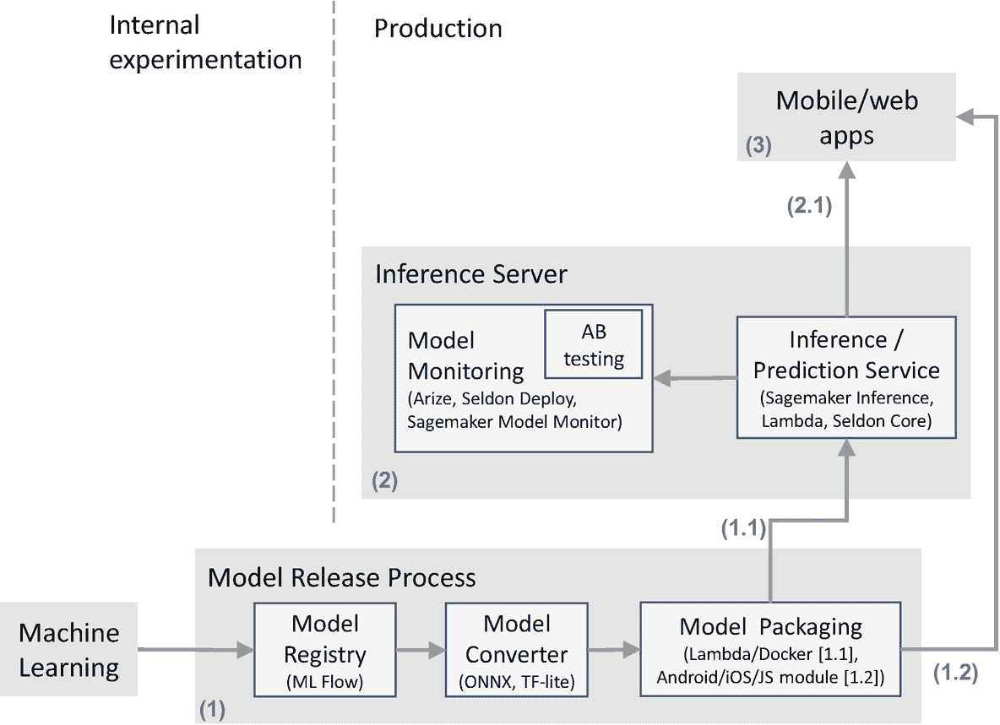

# 十七、推理

一旦在机器学习步骤中创建了模型，就需要将它们部署为现实世界流程和生产系统的一部分。这是在数据科学流程的*推理*步骤中完成的。

在推理步骤中，我们执行将模型推送到生产系统所需的任务，以便其他应用程序可以使用它们，并监控这些模型的性能。

图 [17-1](#Fig1) 展示了进入数据科学最后一英里的各种活动、技巧和技术。本章将详细介绍图 [17-1](#Fig1) 。我们首先介绍模型发布过程，在这个过程中，在内部实验中创建的模型被准备好推向生产系统。然后，我们介绍生产系统本身，包括模型是如何部署的，如何被应用程序用于预测/推理，以及如何被监控。我们将按照方框/箭头所示的数字顺序，从底部开始并向上移动，覆盖图表。在这样做的同时，我们将讨论每个活动中使用的各种组件、技巧和技术。然后我们将触及一些在选择开源和付费推理工具时要考虑的因素。最后，我们将提到推理中涉及的数据工程方面。

图 17-1

推论:步骤和组件；方框内的括号中提到了技术实例

## 模型发布流程(1)

当数据科学团队创建了一个模型并准备将其部署到生产环境中时，就会触发模型发布流程。这是推理步骤的起点。

模型发布过程将模型打包，以便它可以部署到生产系统中。让我们看一下模型发布过程中的每个组件和活动。

### 模型注册表

数据科学团队在机器学习步骤中创建的模型存储在**模型注册表**中。模型注册中心中的模型通常是版本化的。模型也有生命周期，例如，测试中的*、*、生产中的*、*等等。

MLFlow 是实现模型注册中心的一个流行的开源选择。它还允许将模型链接回创建模型的原始实验——这使得实验具有可追溯性和可再现性。

一些开发环境(参见第 [18 章](18.html))也提供了内置的模型注册中心。例如，Databricks 将 MLFlow 集成到其开发环境中。

### 模型转换器

数据科学团队创建的模型通常最初在他们使用的技术堆栈中表示，例如，如果数据科学团队使用 Python 和 ML 库，如 *scikit-learn* ，那么 Python *pickle* 文件将表示 ML 模型。pickle 文件将捕获，比如说，决策树的结构或者线性回归模型的方程。这个 ML 模型通常需要被*转换*成适合部署到目标生产系统的形式。

**Model converter** 涉及将 ML 模型转换成 interexchange 格式或目标系统，如移动/web 应用程序。让我们简要地看一下这两个选项以及何时使用它们。

#### 交换格式

在各种编程语言中存在几个 ML 库和平台——我们在第 [16](16.html) 章中看到了其中的一些。为了实现这些之间的互操作性，机器学习社区开发了 interexchange 格式。交换格式

*   指定一种对编程语言和 ML 库不可知的 ML 模型表示

*   用 Java、Python 等各种流行的生产系统语言提供*推理运行时库*。，来调用模型

*   激励 ML 库开发人员提供能够以 interexchange 格式保存模型的 API

使用 interexchange 格式的优点是，尽管数据科学家可以使用任何 ML 库用一种语言(比如 Python 或 R)构建模型，但转换后的模型可以使用适当的推理运行时库在各种生产技术栈(比如 Java、Python、JavaScript 或 Swift)中轻松调用。

经典的 PMML [2](#Fn2) 和最近的 ONNX [3](#Fn3) 是流行的交换格式的两个例子。根据我们的经验，ONNX 是目前的首选，因为它支持广泛的 ML 模型，并与多种语言(Python、R 等)的大量流行 ML 库 [4](#Fn4) 集成。).

#### 目标系统

在某些情况下，一个模型可以被直接转换为针对一个特定的生产系统， [5](#Fn5) 而不需要使用 interexchange 格式。如果 ML 库技术栈在数据科学和软件工程团队中是标准化的，这是可能的。例如，如果 *TensorFlow* 作为跨团队的标准，那么 TensorFlow 模型可以使用 *TensorFlow Lite、Tensorflow.js、*等进行转换。*、*针对移动/web 应用等系统，其中模型必须直接在用户的设备/浏览器上执行。 [6](#Fn6)

### 模型包装

**模型** **打包**包括从转换后的模型中创建一个可部署的工件。工件的类型取决于模型是部署到服务器还是最终用户的系统(例如，移动应用程序/web 浏览器)。

*   当一个模型被部署到推理服务器(1.1)时，那么工件的类型可以是 AWS Lambda 函数、Docker 容器等。

*   当一个模型要被部署到一个移动或 web 应用程序(1.2)上，以便它在用户的移动设备或浏览器上运行时，那么工件将是一个可以在移动或 web 应用程序中使用的 Android/iOS/JavaScript 模块或库。

在这两种情况下，转换后的模型(例如，ONNX 模型)作为工件的一部分被包括。 [7](#Fn7) 这个工件然后被部署到生产系统(1.1，1.2)——模型然后可以被应用程序调用，我们接下来将会看到。

## 生产

数据科学团队创建的模型由生产系统中的应用程序使用。我们现在来看看这些应用程序通常如何*调用*已经部署的模型。

### 推理服务器(2)

最常见的场景是将模型公开为 REST APIs，这样任何应用程序都可以调用它们(2.1)。您还需要监视模型在生产中的表现，以确定模型的性能是可接受的还是随着时间的推移而恶化。我们将封装这些职责的组件称为*推理服务器*。

让我们简要介绍一下推理服务器的这两项职责。

#### 推理/预测服务

这指的是公开模型的服务(最常见的是 REST APIs)。通常，数据工程师或软件工程师可以很容易地在打包的模型上实现 REST API 层。

但是如果有大量的模型，或者如果您需要快速扩展到几千个并发请求的能力，等等。，你可能会考虑使用亚马逊 Sagemaker 推论、Seldon、Algorithmia 等服务。根据我们的经验，我们也发现*无服务器*技术相当合适。例如，Amazon API Gateway 与 AWS Lambda 的结合是一种经济高效的方式来部署可以轻松扩展的模型。

#### 模型监控

要了解模型的有效性，您需要知道模型给出的预测何时证明是正确的或不正确的。让我们参考第 [4](04.html) 章中关于分类的例子——根据预期销售是否实现，我们可以确定模型给出的预测是否正确。通常生产中的模型会随着时间的推移开始*漂移*，也就是说，越来越多地开始给出不正确的预测。尽早发现这一点并修复/升级模型至关重要。

为此，需要存储模型生成的所有预测，以供数据科学团队将来分析。此外，每当我们知道真实的结果时，我们也应该存储它，以便可以检测到*模型漂移*。该数据还将有助于确定新的候选模型与旧模型相比如何。

模型监控通常与某种形式的 AB 测试相结合，也就是说，同时部署两个或更多的模型变体，并且将一定百分比的推理请求路由到每个变体。通过分析每个变体在生产中的表现，我们可以确定哪个变体是最好的，并将其用作主要模型，也就是说，将大多数推理请求路由到它。

图 [17-1](#Fig1) 中提到了一些专注于监控模型的云服务。

从模型监控中获得的数据也用于数据科学过程的进一步迭代中——我们将在“数据工程”一节中再次讨论这一点。

### 移动和网络应用(3)

这广义上是指由您的公司构建的应用程序以及希望使用您的模型的第三方应用程序。应用程序调用模型有两种典型的方式:

1.  应用程序将调用推理服务器公开的 API，使用模型获得预测(2.1)。

2.  这些模型被集成到您的移动或 web 应用程序(1.2)中，这样这些模型就可以直接在用户的移动设备/web 浏览器上运行。这些通常是需要低延迟和/或移动应用需要能够在没有互联网连接的情况下离线运行的情况。示例包括在在线会议期间实时抑制音频噪声 [8](#Fn8) 或者从用户移动设备上捕获的语音中检测用户的健康状况。

## ML 操作

在生产中发布和维护模型的规程被称为 ML Ops。这在过去的几年中已经发展成为一门学科，并且广泛覆盖了*模型发布过程*和*推理服务器*的模块。

相应地，专门的 ML Ops *角色*也越来越多地出现在数据科学团队中——我们将在第 [21 章](21.html)中更详细地了解这一角色。

## 开源与付费

一些组织开始采用数据科学，并在将模型部署到生产系统时面临困难。因此，在这个快速扩张的空间中有大量的工具和云服务。

对于*推理*步骤，我们建议尽可能使用开源框架，或者使用具有开源策略的工具。

例如，您可以从使用 MLFlow 进行模型注册、使用 ONNX 进行模型转换、使用 Docker 进行模型打包以及使用简单的定制部署进行推理服务开始。

在早期阶段，您可以简单地将模型预测直接存储到数据湖或数据仓库中。在某个时候，你会开始有几个模型投入生产，并且大规模地部署和监控这些模型变得越来越重要。

一旦你到达一个阶段，一个更高级的工具似乎对所有这些活动更有效，你就可以考虑使用一个付费的工具，可能是一个开源策略。您可能希望从以增量方式为某些组件采用新工具开始。例如，你可以开始使用开源的谢顿 [10](#Fn10) 用于*模型发布过程*和*推理/预测服务*，然后在适当的时机采用他们的企业解决方案 [11](#Fn11) ，该解决方案也覆盖了整个*推理服务器*。

## 数据工程

推理步骤中的所有活动都可以被认为是数据工程的一部分。当生产中的型号数量增加，团队壮大时，如果需要，可以分离出一个小型的专业 MLOps 组。详见第 [21](21.html) 章和第 [22](22.html) 章。

此外，从数据工程的角度来看，从模型监控中捕获的数据与其他数据是同等的，也就是说，模型监控系统是另一个数据源。在这里，我们回到数据科学过程的数据捕获步骤——关于模型给出的预测及其性能(根据真实结果评估)的数据用于数据科学过程的进一步迭代，以调整和升级模型。

## 结论

在这一章中，我们讨论了数据科学过程中推理步骤所涉及的各种活动。我们还涉及了一些工具和库，它们通常用于各种特定目的的活动中，并涵盖了一些与在开源和付费工具之间进行选择相关的要点。

生产中模型的预测和性能实际上是数据科学过程的数据捕获步骤的新数据源。这个循环形成了我们在第 [1](01.html) 章中首次看到的数据科学过程的最大迭代——从数据捕获到推理，再回到数据捕获。

<aside aria-label="Footnotes" class="FootnoteSection" epub:type="footnotes">Footnotes [1](#Fn1_source)

在机器学习步骤中作为实验代码的一部分调用的 MLFlow API 实现了这一点。

  [2](#Fn2_source)

[T2`https://wikipedia.org/wiki/Predictive_Model_Markup_Language`](https://wikipedia.org/wiki/Predictive_Model_Markup_Language)

  [3](#Fn3_source)

[T2`https://onnx.ai/`](https://onnx.ai/)

  [4](#Fn4_source)

比如我们在第 [16](16.html) 章看到的那些。

  [5](#Fn5_source)

请参考“移动和 Web 应用程序”一节，了解何时适合这样做的示例。

  [6](#Fn6_source)

或者在物联网设备上。

  [7](#Fn7_source)

在(1.2)的情况下，偶尔会将转换后的模型直接集成，而不打包成模块。这取决于 app 的底层设计。

  [8](#Fn8_source)

通常使用深度学习模型来完成，该模型被训练成从嘈杂的音频中产生干净的音频。

  [9](#Fn9_source)

参见第 [13 章](13.html)。

  [10](#Fn10_source)

那就是谢顿核心。

  [11](#Fn11_source)

那就是，谢顿的部署。

 </aside>