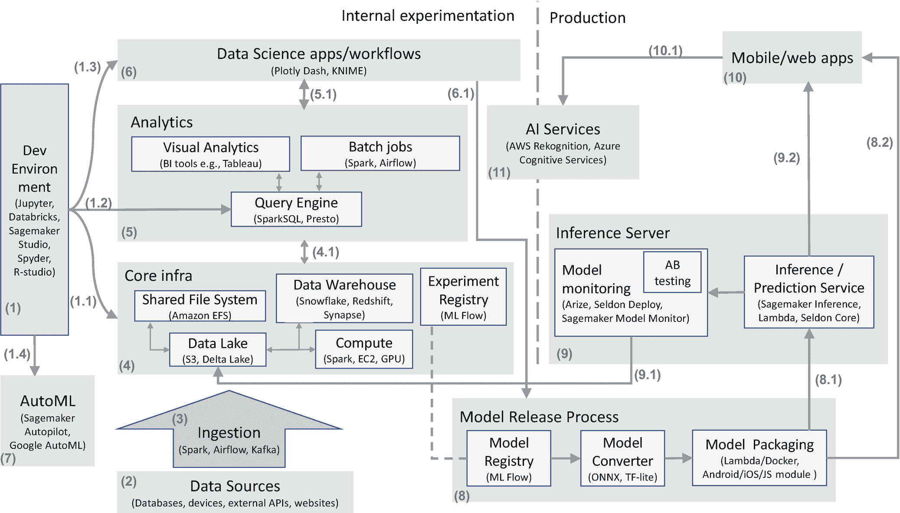

# 十九、参考架构

到目前为止，我们已经介绍了数据科学团队用来执行数据科学流程各个步骤的各种工具和技术。在本章中，我们现在将了解一个参考体系结构，该体系结构可以定制并用于您的数据科学团队的运营。该参考体系结构汇集了我们迄今为止看到的各种工具和技术，使数据科学流程能够进行快速试验和部署。

图 [19-1](#Fig1) 显示了参考架构。我们已经在第 3 部分的前几章中介绍了各个组件——本章将介绍它们是如何组合在一起的。

需要注意的是，并非所有的块都是必要的，这取决于数据科学项目的种类和数据科学文化，不同的块会随着时间的推移而发展。但是最终一旦你的团队达到一个成熟的水平，几乎所有这些模块都是需要的。

在高层次上，数据科学有两个方面，如图 [19-1](#Fig1) 所示:支持数据科学实验活动的系统和使用数据科学团队创建的模型的生产系统。

在本章中，我们将详细浏览图 [19-1](#Fig1) 。我们将首先看实验方面，然后是从实验到生产的过渡。一般来说，我们将按照方框/箭头所示的数字顺序浏览各个模块。

图 19-1

支持数据科学运营的参考架构

## 实验

在本节中，我们将介绍与数据科学团队的实验活动相关的各种组件。

### 开发环境(1)

我们在第 [18 章](18.html)中简要介绍了开发环境。在这里，我们将了解更多关于开发环境如何与参考体系结构中的所有其他组件一起使用的细节。

(1.1)开发环境应允许无缝访问核心基础架构:

*   数据湖/数据仓库中的所有数据都应该可以使用 SQL、pandas、Spark 等常见机制进行访问(通过访问控制)。

*   数据科学家应该能够根据需要扩展计算能力。这包括扩大/缩小单台机器，也可能包括一个机器集群，具体取决于数据大小和分析类型。

*   数据科学家应该能够轻松地在实验注册表中注册他们的实验，以及数据的候选模型和谱系。

(1.2)如果您有一个使用 SparkSQL 或 Presto 等查询引擎的大数据设置，那么数据科学团队应该能够使用该查询引擎运行 SQL。

(1.3)如果数据科学团队使用简单的应用程序或工作流向其他内部利益相关方公开一些模型，那么最好能够在开发环境和这些应用程序/工作流之间实现集成。例如，KNIME Server 可以像我们在第 [18](18.html) 章中看到的那样用于此目的，它允许使用 REST APIs 调用工作流——这样的 API 可以从开发环境中调用来执行工作流。

(1.4)数据科学团队可能需要在云上访问 AutoML 服务，如亚马逊 Sagemaker Autopilot、谷歌云 AutoML 等。

### 数据来源(2)

可能有几个相关的内部和外部数据源。我们已经在第 [13](13.html) 章中讨论过这些。

来自这些多个数据源的数据被摄取(3)到中央数据湖/数据仓库(如 4 所示)中，供数据科学团队进行分析。

### 摄入(3)

我们已经在第 [13](13.html) 章中探讨了与摄入相关的方面。摄取的目标是让数据在数据湖或数据仓库中以合理组织的形式可用(在 4 中)。

### 核心基础设施(4)

这是实验沙盒基础设施的核心，所有其他系统都基于它。概括地说，这包括数据存储、计算和实验注册组件。

我们已经在第 [13](13.html) 章中介绍了数据存储，即数据湖、数据仓库和共享文件系统。

我们已经在第 [18](18.html) 章中介绍了计算基础设施和实验注册。

### 分析(5)

数据科学家的大量数据分析可能会在使用核心基础架构(4)的开发环境(1)中进行。但是，在处理大数据的规模稍大的团队中，开始感受到以下需求:

*   如果团队中有一名数据分析师或公民数据科学家 [1](#Fn1) 可能没有很好的编程技能，使用**可视化分析**工具可以提高生产率。使用这些工具创建的可视化可以使用查询引擎或直接从数据湖/数据仓库(4.1)获取数据。我们在第 [15](15.html) 章中讨论了数据可视化和 BI 工具。

*   数据工程师或数据科学家可能会编写**批处理作业**，自动执行从数据准备到机器学习的步骤。这些可以产生转换的数据或分析结果，这些数据或分析结果被写回到数据湖/数据仓库(4.1)。批处理作业也可以执行 ML 实验，在这种情况下，实验细节被写入实验注册表(也是 4.1)。

*   如果您的基础架构不包括数据仓库，而您的数据科学家/分析师更喜欢使用 SQL，那么可能需要一个**查询引擎**来提供 SQL 支持。查询引擎能够从数据湖和数据仓库(4.1)中的多个数据集过滤/聚集数据。我们已经在第 13 章[中看到了查询引擎。](13.html)

### 数据科学应用/工作流(6)

我们在第 [18](18.html) 章中介绍了数据科学应用/工作流。注意到

*   这些应用程序/工作流中使用的模型通常从模型注册中心(6.1)获取。

*   通常使用分析查询引擎(5.1)访问应用程序/工作流所需的任何数据。

*   可视化分析也可以嵌入到数据科学应用程序/工作流中(5.1)。

### 自动语言(7)

AutoML 服务包含在第 [18 章](18.html)中。所使用的 AutoML 服务需要访问用于训练 AutoML 模型的数据。

如果您计划使用*云* AutoML 服务，但拥有*本地*核心基础架构设置(4)，您的 IT 团队可能需要帮助您的数据科学团队从他们的开发环境中使用 AutoML(1.4)。

讨论了实验方面之后，现在让我们看看需要哪些步骤/组件来确保数据科学家创建的模型能够作为生产系统的一部分出现。

## 从实验到生产

当数据科学团队创建的模型将被部署到生产系统时，模型发布过程(8)被触发。在第 [17](17.html) 章中，我们已经介绍了这个模型发布过程以及随后的推理服务器(9)和移动/网络应用程序(10)。

模型生成的预测将被存储回我们的数据湖(9.1)中，用于监控和未来分析——这也在第 [17](17.html) 章中有所涉及。

### 人工智能服务

人工智能服务(11)，如语音处理、计算机视觉、时间序列预测等。，都包含在第 [18 章](18.html)中。这些服务通常以 API 和 SDK 的形式公开，可以直接从移动或 web 应用程序中调用(10.1)。

通常，数据科学团队 [2](#Fn2) 会进行一些实验，以评估人工智能服务在用于生产之前是否适合您的特定用例——这就是为什么我们将人工智能服务组件描述为跨越实验和生产系统。

## 结论

在本章中，我们介绍了一个可以根据您的特定需求进行定制的参考体系结构。我们还讲述了如何使用该参考体系结构中的各种组件来支持数据科学流程。

我们将在第 [23](23.html) 章中再次讨论参考架构——在那里，我们将了解数据科学项目的类型如何影响对参考架构各个模块的需求。

<aside aria-label="Footnotes" class="FootnoteSection" epub:type="footnotes">Footnotes [1](#Fn1_source)

数据分析师和公民数据科学家将在第 [21 章](21.html)中介绍。

  [2](#Fn2_source)

可能是 ML 工程师，参见第 [21 章](21.html)。

 </aside>