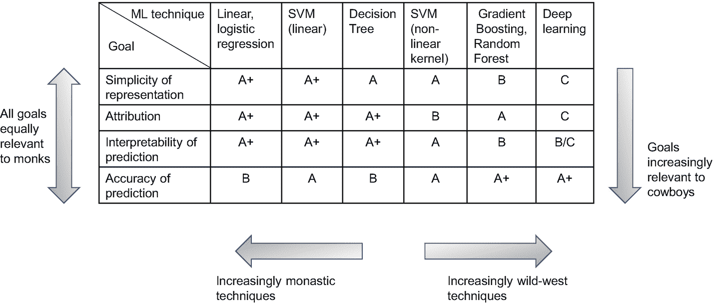

# 二十、僧侣与牛仔：实践

在第 [3](03.html) 章中，我们首先看了数据科学的两种文化，以及如何确定哪种文化可能与手头的问题和您的总体业务更相关。现在，我们已经介绍了数据科学过程的各个步骤中使用的各种技术，我们准备好了解两种文化在实践数据科学的方式上有什么不同。这是本章的重点。

理解实践中的这些文化差异在三个方面是有用的:首先，这可以使您确定您的数据科学团队将会并且应该使用哪些技术来符合期望的文化-这将在本章稍后的图 [20-1](#Fig1) 中说明。

第二，当你建立团队时，你可以试着加入数据科学家，他们倾向于你的企业所期望的文化；本章总结的文化差异将有助于确定候选数据科学家主要属于的文化。在组建数据科学团队的背景下，我们将在第 [22](22.html) 章中再次讨论这个方面。

第三，在可解释性的背景下，对本章所涵盖的目标和技术的更深入的理解对于法规遵从性也是有用的。我们将在第 23 章中讨论这一点。

因此，在这一章中，我们将详细阐述这两种文化如何在实践中进行建模——这主要与数据科学过程的机器学习步骤有关，在某种程度上，也与数据准备步骤有关。在实践中，主要的区别就在于这两个步骤。

我们将从创建数据科学模型的目标的简要、稍微正式的概述开始。然后，我们将总结各种 ML 技术如何实现这些目标，以及每种文化认为相关的目标。这有效地提供了一个框架来确定两种文化通常偏好的技术。最后，我们将对表 [3-1](03.html#Tab1) 进行扩展，以包括两种文化在实践中看到的差异。

请注意，在本章的其余部分，我们会提到第 [16](16.html) 章中涉及的各种 ML 技术。您可能会发现，在需要时回顾该章会有助于加深您对某项技术或其某些细节的理解。

## 建模的目标

回想一下第 [3](03.html) 章，模型的主要目的是

*   通过估计潜在的*真相*来解释观察结果:这可以进一步分解为两个粒度目标，*简单表示*和*归因。*

*   预测未来观测值:这可以进一步分解为两个粒度目标，*预测的可解释性*和*预测的准确性。*

在这一节中，我们将通过几个例子来描述这四个目标，这些例子展示了各种技术是如何帮助实现每一个目标的。

### 估计真相:简单的表现

> 真理总是在简单中被发现，而不是在事物的多样性和混乱中。
> 
> ——艾萨克·牛顿爵士

我们倾向于更喜欢——并且相信——更简单的想法和表述，因为它们更接近事实。对物理学中的“统一场论”或“大统一理论”的追求是这种永恒的人类渴望*简化*的旗舰例子——对自然界中不同种类的物理力有不同的理论表明了“多样性”和“混乱”，并乞求、要求简化。

像 *E = mc* *2* 或 *F = ma* 这样的单个方程是最简单的表示，它的优雅给我们留下深刻印象。线性/逻辑回归等技术旨在实现这种简单性——为了实现这种简单性，数据科学家通常甚至愿意牺牲预测的准确性。类似地，多项式方程，以及更一般地，任何表示曲线(或 n 维中的*曲面*)的方程，都是优雅、简单的表示。

让我们来看看其他一些表现:

*   线性 SVM 也相当简单，就简单性而言，非常接近线性回归，其中真实值由分隔观察值的单线 [2](#Fn2) 表示。另一方面，非线性 SVM 是一种更复杂的表示。

*   决策树是一种简单但有点混乱的表示；当我们查看需要遍历的各种节点时，会有一种“多样性”的感觉。–我们不会像看一个等式那样获得优雅简洁的效果。

*   随机森林等。，是相当复杂的——我们在表现中感觉到多重性和混乱，这是由树的随机性和大量造成的。

*   深度神经网络是最复杂的表现形式——数百个神经元和数千个权重向试图理解这一切的人类大脑传达了一种强烈的多样性和混乱感。虽然可以说，从数学上来说，神经网络只是一组方程， [3](#Fn3) 它的层数越多，看起来就越复杂。当我们添加具有更复杂表示的层时，如 CNN、RNN 等，这种复杂性进一步增加。

### 估计真相:归因

当观察值由几个属性/特征的值组成时，“真实”的一个基本方面是理解那些属性中哪些是最重要的，也就是说，哪些属性在确定目标变量的值时是最重要的。我们将这一目标称为*归因。* [4](#Fn4) 回想一下，我们在表 [3-2](03.html#Tab2) 中看到过病因学；归因是确定病因的技术基础。

让我们回顾一下我们在第 [16](16.html) 章中看到的几个归因示例:

*   线性回归:如果一个特性的系数/权重在线性方程中为零，这显然意味着目标值不受该特性值的影响。换句话说，这个特性的值对于确定目标变量的值没有用。我们还可以从等式中看到，如果所有特征具有相同的值范围(例如，使用最小-最大缩放)，则具有较高权重 [6](#Fn6) 的特征可以被认为对目标变量的值具有较大的影响，因此更重要。

*   决策树:回想一下，使用子节点在一个类别中具有较高优势的可用特征集合中的那个特征来分割每个节点，也就是说，从子节点具有最低熵的集合中挑选那个特征。这意味着决策树能够比较特征，并确定哪个特征更好或更重要。这种能力可以提供一种机制，根据特性的重要性对其进行排序。

*   随机森林:我们刚刚讨论了一种机制，它可以帮助我们确定决策树中特征的重要性。我们可以考虑随机森林的所有决策树中每个特征的重要性，以得出随机森林中特征的整体重要性。

*   深度学习:对于如何衡量功能的相对重要性，没有直观的概念。最近的发展，特别是在名为“可解释的人工智能”的领域，可以帮助确定重要的特征——但这些方法本身可能相当复杂，而且不太直观。如果它变得极其复杂和不直观，那么它通常就不像是“真理”

请注意，在所有这些情况下，基于用于创建模型的 ML 算法，数据科学家采用一些概念来确定特性的重要性。然后他们得出归因的结论，也就是说，宣布一些特征是“重要的”正如我们所看到的，这只是一个相对的重要性概念——它可能因此感觉像是一个有点武断的归因基础，除非归因机制既直观又严谨。实现这种直觉和严谨可能是一项艰巨的任务，但幸运的是，正如我们在第 [3](03.html) 章中看到的，许多现实世界的业务问题并不需要病因和归因。

### 预测:可解释性

这个目标指的是我们人类需要能够理解和解释模型是如何为一个新的观察产生一个特定的预测。换句话说，作为人类，我们需要能够*解释*一个模型从输入观察值达到目标预测所采取的每一步。让我们看几个例子:

*   方程的解释，如线性回归模型的解释，是非常简单的。

*   在决策树的情况下，我们可以查看该树，并基于某个特征的值来理解新的观察结果在每个节点处将遵循哪个分支，以便进行预测。因此，这种模型给出的预测具有高度的可解释性。

*   在随机森林的情况下，要详细查看大量的树木以了解它们如何做出预测并相应地解释最终预测是极其困难的。因此，即使随机森林可以给出哪些特征是重要的一些概念(即，支持属性)，它们也不是可解释的。

*   我们在第 [16](16.html) 章中看到，神经网络并没有给我们一个简单的描述它是如何进行预测的画面——这样的模型是最难解释的模型之一。

### 预测:准确性

这仅仅是指我们希望我们的模型能够准确预测未来未知观测的目标变量的值。请注意，这个目标不包括我们作为人类是否能够理解(解释)为什么模型预测某事的任何概念——它只谈到正确预测的目标。在写这篇文章的时候，就准确预测的能力而言

*   深度学习技术似乎优于其他技术，尤其是对于与感知相关的问题，如 NLP、计算机视觉等。

*   随机森林和梯度提升树 [7](#Fn7) 一般来说似乎是所有其他类型问题的首选技术。我们在第 16 章[中看到了这些算法如何改进他们的预测。](16.html)

看了四个目标和一些技术如何实现这些目标的例子，我们可以看一个更正式的“分级”矩阵来捕捉所有技术的这些概念——这个矩阵也有助于确定每个文化通常更喜欢哪些技术。

## 分级 ML 技术

在上一节中，我们讨论了如何将建模的每个目的分成两个目标，从而得到建模的四个目标。我们还讨论了一些例子，说明各种技术如何与这些目标相冲突。我们在图 [20-1](#Fig1) 中给出的等级 [8](#Fn8) 概括了这一点——该图还显示了两种文化在实现这些目标的方式上有何不同，以及这如何决定了他们通常更喜欢的技术。我们在第 [3](03.html) 章中已经看到，修道士文化关注这两个目的，所以所有四个目标都与修道士同等相关，如表中所示。西部文化只关注于预测价值的目的，所以表格底部的目标与牛仔更相关。因此，由于向左的 ML 技术在所有四个目标上都有很高的分数，这些技术在修道文化中更受欢迎。类似地，向右的技术对底层目标有很高的分数，因此在西部文化中更受欢迎。

图 20-1

一些 ML 技术为建模的每个目标分级，以及这些等级如何影响两种文化的首选技术

以下是几个案例背后的(有些主观的)推理示例:

*   随机森林在预测的准确性方面获得了较高的等级(A+)，但在属性方面获得了稍低的等级(A)。这是因为虽然算法确实识别了重要的特征，但可能存在这些特征不可靠的情况——参见 Efron (2020)中的一个例子。

*   深度学习在预测的准确性上得了高分(A+)，在归因上得了低分(C)。对于预测的可解释性，它得到了一个有点模糊的 B/C 等级，因为
    *   可解释性因神经网络的复杂性而异。

    *   在解释/解释深度学习预测的这一领域正在取得进展，例如，CNN 的类激活图等。这些解释可能不够清晰明了，不足以获得 A，但它们足够有用，偶尔可以获得 b。

虽然我们在本书中只提到了一些技术，但是图 [20-1](#Fig1) 的结构和框架可以用来对任何 ML 技术进行分级，并确定它在多大程度上适合特定的目标，从而适合特定的文化(并因此适合手头的业务问题)。

ADVANCED NOTE: OTHER TECHNIQUES

以下是一些我们在书中其他地方没有涉及到的经典修道技巧:

*   *统计检验*:t 检验、卡方检验等统计检验。僧侣们在寻找潜在真理的旅途中经常使用。例如，可以使用统计测试来确定哪些特征是重要的。

*   *赤池信息准则和贝叶斯信息准则*:通常被称为 AIC 和 BIC，用于在一组候选模型中选择最佳模型。为此，他们考虑了模型对训练数据的性能和模型的复杂性。具有更多参数的复杂模型会受到惩罚。

我们将在下一节中引用这些技术。

## 文化差异

表 [20-1](#Tab1) 总结了两种文化之间的所有差异——它详细阐述了表 [3-1](03.html#Tab1) 中的几个要点，并根据我们在本章前面的报道增加了几个新的要点。

表 20-1

修道院与狂野西部:最终版

<colgroup><col class="tcol1 align-left"> <col class="tcol2 align-left"> <col class="tcol3 align-left"></colgroup> 
| 

因素

 | 

修道文化

 | 

西部文化

 |
| --- | --- | --- |
| 心态 | 找到导致观察的潜在的、永恒的真理(自然) | 现在就找到有效的方法。可以经常更新。经验主义是唯一永恒的真理 |
| 目的 | 对观察结果背后的*真相*进行评估，从而实现预测和更深入、准确的因果洞察 | 预测准确性是首要目标因果往往是一种损失。因果洞察力要么是不相关的，不太准确的，要么只是有好处的 |
| 估价 | 我的估计有多接近事实？ | 我得到的预测是否如我所愿的那样准确？ |
| 评估——评估什么 | 估计的“真相”包括归因以及模型的可解释的和准确的预测。此外，具有更简单表示的模型是优选的 | 主要关注模型预测的准确性。预测和归因的可解释性有时是好的 |
| 领域专业知识 | 对领域的理解极大地影响了特性的制作；这是因为属性是一个主要目标，所以被很好理解的特性是首选 | 当使用自动化特征提取的技术时，较少的领域专业知识通常就足够了；例如，使用 CNN，从图像中自动提取相关特征 |
| 有多少特征用于建模 | 尽量避免“维数灾难”找到包含大部分信息的几个要素-这降低了模型的复杂性并有助于归因 | 任何附加信息都有助于提高预测的准确性，因此非常有用。深度学习、梯度提升树等技术。，甚至可以与数百个功能一起使用 |
| ML 技术 | 优先选择图 [20-1](#Fig1) 中所有目标的高分 | 首选图 [20-1](#Fig1) 中“预测准确度”为 A+的 |
| 属性 | 统计测试，ML 模型确定的重要特征 | ML 模型确定的重要特征 |
| 模型性能评估 | 统计测试，AIC/BIC，交叉验证[9](#Fn9)T3】 | 交叉验证 |
| 型号升级频率 | 创建模型可能需要更长时间。但是一旦创建，因为它代表了一个长期的真理，升级就不那么频繁了 | 随着新数据的获得，模型通常被快速创建并通过快速迭代进行升级 |

UNSUPERVISED LEARNING AND THE TWO CULTURES

我们的报道主要集中在文化差异相当显著的监督学习技术上。但是这种差异偶尔可以在一些无监督的技术中看到，例如异常检测技术。

## 结论

在本章中，我们详细阐述了在第 [3](03.html) 章中首次介绍的两种数据科学文化之间的差异。

当谈到从数据中创建模型时，Leo Breiman 首先强调了两种文化的存在。他的原始论文、D.R. Cox 和 Brad Efron 的评论以及 Breiman 的回应都在 Breiman (2001)中。用我们的术语来说，我们会说 Breiman 显然是第一个离开修道院，冒险进入西部荒野的僧侣。在那里从事数据科学多年后，包括对 random forest 等技术的贡献，他不仅带着一套新技术，还带着一个新的视角回到了修道院——前面提到的文章详细描述了 Breiman 的旅程以及他回到修道院时受到几名僧侣的欢迎。

我们对这两种文化的描述很大程度上是基于我们的个人经历。这两种文化在过去被赋予了不同的名称——根据记录，我们的“修道士”文化有点类似于 Breiman 的“数据建模”文化，我们的“狂野西部”文化有点类似于 Breiman 的“算法建模”文化。然而，值得注意的是，自 Breiman 的原始论文以来，这两种文化如何实践数据科学的含义和细节已经发生了变化，特别是在大数据时代(大约从 2006 年至 2010 年开始)和深度学习革命(大约从 2013 年开始)。

Efron (2020)对这两种文化进行了更近期的调查。这篇论文，以及前面提到的 Breiman 的讨论，帮助我们对这两种文化的观察有了一些结构。Efron (2020)也提供了我们所采用的非常有用的术语“归因”。

在第 [22](22.html) 章中，我们将看到本章中涵盖的各种因素在构建数据科学团队时是如何有用的。

在第 [23](23.html) 章中，我们将看到文化的选择如何受到数据科学项目类型的影响。我们还将在可解释性的背景下重新审视建模和数字 [20-1](#Fig1) 的目标。

## 第 3 部分摘要

在第 [12](12.html) 到 [18](18.html) 章中，我们介绍了数据科学过程中使用的各种技巧和技术。在第 [19 章](19.html)中，我们看到了它们如何在一个参考架构中融合在一起，以支持数据科学团队的运营。最后，在这一章中，我们讨论了两种数据科学文化在实践数据科学的方式上如何不同的更多细节，特别是关于他们对 ML 技术的选择。

到目前为止，我们已经讨论了在构建数据科学实践中需要考虑的业务和技术方面。在接下来的最后一部分，我们将着眼于建立数据科学团队和执行数据科学项目的实践方面。

## 参考

布雷曼，利奥。"统计建模:两种文化."统计科学 2001:199–231。

埃夫隆，布拉德利。"预测、估计和归因."*美国统计协会杂志*2020:636–655。

<aside aria-label="Footnotes" class="FootnoteSection" epub:type="footnotes">Footnotes [1](#Fn1_source)

来源于牛顿项目“关于启示的无标题论文(第 1.1 节)”<[`www.newtonproject.ox.ac.uk/view/texts/normalized/THEM00135`](http://www.newtonproject.ox.ac.uk/view/texts/normalized/THEM00135)T3】

  [2](#Fn2_source)

或者更一般地，超平面。

  [3](#Fn3_source)

也就是将每个神经元的输入映射到输出的方程。

  [4](#Fn4_source)

这似乎还不是行业中的标准术语，但我们发现它相当合适。

  [5](#Fn5_source)

参见第 [14 章](14.html)。

  [6](#Fn6_source)

重量的绝对值更精确。

  [7](#Fn7_source)

尤其是 XGBoost。

  [8](#Fn8_source)

不同的数据科学家可能会给出稍微不同的分数。

  [9](#Fn9_source)

包含在第 [16 章](16.html)中。

 </aside>