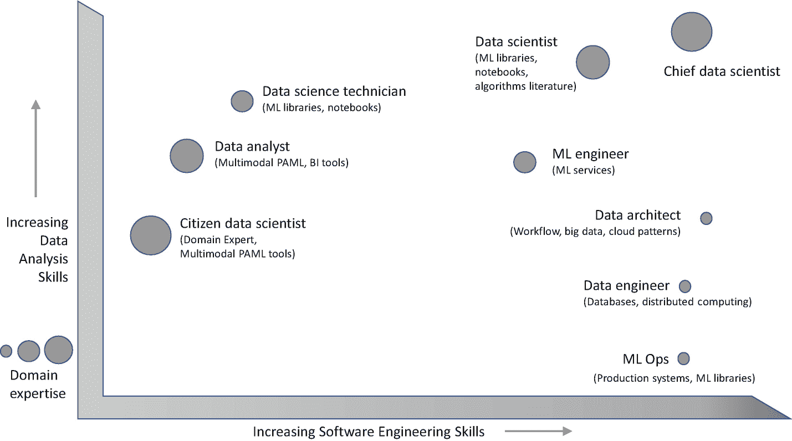

# 二十一、技能框架

回想一下第 [1](01.html) 章中的概念，即*使用软件将科学方法应用于数据被称为数据科学。*因此，数据科学从根本上说是处于数据分析和软件工程尖端的跨学科活动。作为团队领导，您需要定期确定您的团队所必需的角色，并确保拥有数据分析和软件工程技能的合适团队成员能够胜任该角色。

图 [21-1](#Fig1) 显示了数据科学团队中常见的各种角色，以及这些角色所需的各类技能的程度。

图 21-1

技能框架。角色被描述为三个方面所需技能的组合:数据分析、软件工程和领域专业知识

如图所示，除了数据分析和软件工程这两个维度，还有第三个维度——*领域专业知识*，由气泡的大小表示。不同的角色在不同程度上需要这些技能的组合。在本章的其余部分，我们将涵盖技能的三个方面，然后是各种角色及其职责。

## 技能的三个维度

数据科学项目所需的三种技能是*数据分析、软件工程、*和*领域专业知识*。让我们看一看每一个问题，以理解它们所包含的内容。

### 数据分析技能

数据分析简单来说就是从数据中获取洞察的能力。这可以从简单的报告(例如，销售趋势)到统计技术(例如，相关性分析以找出哪些产品通常一起销售)和机器学习算法。

从概念上讲，进入数据分析的思维过程并不一定需要软件技能——事实上，今天数据科学家使用的许多技术在 20 世纪上半叶就已经很好地建立起来了，而且早于计算机。虽然软件工具有助于更快、更准确地进行数据分析，*使用*这些工具并不一定需要软件工程技能——例如，几十年来，Microsoft Excel 等工具一直是数据分析的默认选择，甚至是金融领域的 quants 所做的高级分析。

### 软件工程技能

软件工程本身当然是一门庞大的学科。在数据科学的特定上下文中，需要软件工程技能来对数据科学过程的各个步骤进行编码。一些相关方面包括

*   分析算法的设计和有效实现:有几个用于数据科学的开源库。但是偶尔需要实现一个适合您需求的算法或者修改一个开源算法。

*   数据准备:整理、清理和准备大规模数据集，包括数据管道。

*   GPU 和深度学习:最先进的深度学习算法和神经网络需要 GPU 集群和微调的数据流范式来进行高效的模型训练。这种设置中的几个性能调整方面需要软件工程技能。

*   生产 ML 模型:将模型部署到生产中需要软件工程技能来将模型大规模集成到生产技术栈中。

对于有效的端到端数据科学解决方案，这些软件工程技能是不可或缺的。

### 领域专业知识

深入了解领域以及数据与领域的关系，对于制定正确的问题陈述、确定解决问题的数据科学方法以及最终评估解决方案的正确性至关重要。几个数据科学问题都是面向自动完成由金融、零售、医疗保健等领域的专家执行的日常工作。–在这些情况下，这些人的领域专业知识对数据科学团队的成功至关重要。

有关领域专业知识需求如何依赖于数据科学文化的讨论，请参考第 [20](20.html) 章。

因此，一个有效的数据科学团队需要这三种技能:数据分析、软件工程和领域专业知识。现在，我们将了解数据科学团队中的典型角色，以及这些角色如何需要结合这三个方面的技能。

## 数据科学团队中的角色

参考图 [21-1](#Fig1) ，图中显示了各种角色以及每个角色通常需要的三个方面的技能水平。我们现在将介绍数据科学团队中的每个角色及其职责。

需要注意的是，这些是“角色”而不是个人——一个人可能会扮演其中的几个角色，尤其是在团队的孵化阶段。我们将在下一章中围绕团队的建立和结构化来讨论这些方面。

### 公民数据科学家

公民数据科学家是公司中最重要的领域专家。他们知道业务流程以及数据如何映射到现实世界。

鉴于他们的领域知识，公民数据科学家通常会确定数据科学项目的范围，并影响公司的数据战略 [1](#Fn1) 。它们还使首席数据科学家和其他人能够更加深入地理解该领域。

他们与首席数据科学家密切合作，制定问题陈述，并积极参与数据科学流程迭代，特别是从领域角度设计实验和评估模型性能。

虽然拥有该领域的专业知识，但他们通常不具备高度的数据分析或软件工程技能。因此，他们依赖于先进的工具 [2](#Fn2) ，这使得像他们这样的人更容易使用他们的领域知识创建初始基线模型。然后，数据科学家在数据科学流程的进一步迭代中以此基线为基础进行构建。

### 数据分析师

这是大多数组织中的传统角色，您可能对此很熟悉。数据分析师是该领域的专家。他们通常使用 BI 工具和 SQL 等查询语言，但他们的编程技能可能有限。他们可以使用各种可视化和统计技术从数据中提取见解。

如果你的公司已经有一个数据分析师，让他们参与到咨询中来会很好。鉴于他们在产品和业务流程领域的专业知识，他们通常最适合评估生产系统中的模型性能，以及将数据科学模型纳入组织运营的业务影响。

### 数据科学技术员

这个术语是我们为那些中等编程水平并且了解 scikit-learn、Keras、Matplotlib 等库的人创造的。，用于数据科学过程。因此，他们可以快速执行实验并评估模型性能。另一方面，他们还没有获得独立设计新实验的科学专业知识——从这个意义上说，他们可以被视为见习数据科学家。

在大型数据科学团队中，数据科学技术人员对于快速准确地执行实验至关重要；这使得数据科学家能够专注于实验设计和创新新技术。

### ML 操作

ML Ops 既需要了解数据科学团队创建的模型，也需要了解工程/IT 团队创建和维护的生产系统。这是一个利基角色，主要面向数据科学过程的*推理*步骤。

ML Ops 负责生产系统中模型的部署、维护和监控。

通常，ML Ops 成员需要熟悉第 [17](17.html) 章中提到的技术和工具。

### 数据工程师

数据工程师执行数据科学过程的数据工程步骤。因此，他们负责存储、跟踪、转换、评估和维护供整个数据科学团队使用的数据资产。数据工程师通常履行以下职责:

*   执行数据科学流程的数据捕获步骤中的大部分活动。这包括从领域专家和数据科学家确定的数据源中获取数据，并方便对数据的访问。

*   自动化可重复的数据准备和数据可视化步骤，这些步骤通过数据科学流程的多次迭代而具体化。

*   确保机器学习步骤的数据无缝可用，可能包括使用大数据的分布式学习。

*   在小团队中扮演 ML Ops 的角色。

*   维护任何 BI 或 PAML [3](#Fn3) 工具以及其余的数据基础设施。

### 数据架构师

数据架构师负责决定符合预算限制的整个数据和计算基础架构。这包括选择最适合数据科学团队的工具。对于跨学科团队，数据架构师需要确保架构能够在数据科学流程的各个步骤中实现所有角色之间的顺畅协作。

我们在第 [19](19.html) 章中看到了数据科学团队的参考架构。数据架构师负责根据您组织的特定需求和约束来定制该参考体系结构。

### ML 工程师

在过去的几年里，人工智能服务在云和 AutoML 上出现了巨大的增长。我们在第 18 章中讨论了这些。正如我们在那一章中看到的，工程师可以使用这样的服务或库来创建模型，例如，预测商店的库存需求。为此，他们需要了解领域和数据，但不需要知道数据科学过程的细节，ML 技术等。在模型的创建过程中。

这就产生了一个相对较新的 *ML 工程师*角色——一个对领域有很好理解的工程师，他可以使用这些服务和库，并评估生成的模型以确保它们满足预期的目标。

与数据科学技术人员角色相比，ML 工程师需要的数据分析技能较少，因为他们不需要完全了解数据科学流程。但是 ML 工程师需要有更强的工程技能来有效地使用 AutoML 库和云服务。

软件工程师可以很容易地升级为 ML 工程师，只需接受最少的 ML 基础培训，如模型性能评估，并结合 AI/AutoML 服务和库的知识。

如果您正在遵循狂野西部的方法，或者需要在大量投资雇佣数据科学家之前对现有云服务进行快速 POC，那么用 ML 工程师来引导团队可能是个好主意。

### 数据科学家

正如我们从图 [21-1](#Fig1) 中看到的，数据科学家在所有三个方面都有很好的技能组合。通常，数据科学家擅长应用适合其工作领域的科学方法。相应地，他们与领域专家密切合作，以获得对业务和领域的深刻理解。

在一个小团队中，他们可能与首席数据科学家合作，帮助设计实验并执行它们。在大型团队中，数据科学家可能会专注于与首席数据科学家一起设计实验，并将执行任务委托给数据科学技术人员和 ML 工程师。他们还与数据工程师合作，定义数据管道的要求。随着数据准备和数据可视化步骤变得越来越可重复，数据科学家与数据工程师一起自动执行这些步骤，以实现快速迭代。

数据科学家通常对算法有深刻的理解——因此他们可以在必要时修改现有的开源实现。一些数据科学家也可以根据需要创建新的算法和技术。

### 首席数据科学家

首席数据科学家最终负责整个数据科学团队。他们在所有三个方面都有混合技能，这使得他们能够顺利地在数据分析、软件工程和领域/业务方面移动。

他们是制定要解决的问题、设置所需的数据和实验策略、定义路线图以及在其他角色的支持下执行路线图的主要负责人。我们将在下一章更详细地讨论首席数据科学家的角色。

## 技能上的偏差

图 [21-1](#Fig1) 中对一些角色的描述代表了我们的理想主义观点，在实际场景中偏离这些观点并不少见；特别是，这里描述的理想数据科学家和首席数据科学家通常被认为是独角兽。在许多团队中，其他角色通常会补充和填补这些主要角色技能中的任何不足，例如，如果(首席)数据科学家的软件工程技能较少，那么其他工程师(如数据架构师、数据工程师或 ML 工程师)会填补这一不足。

文化的选择(修道士或狂野西部)也可能会影响数据科学家的主要技能(数据分析或软件工程)。例如，一个僧侣的软件工程技能可能不如这里描述的理想。

## 结论

在这一章中，我们讨论了一个技能框架，以解释组成跨学科数据科学团队的各种角色。团队中需要哪些角色取决于数据科学文化和业务的具体情况，我们在每个角色的描述中涵盖了一些方面。

在下一章，我们将着眼于建立和组织由这些角色组成的数据科学团队。

<aside aria-label="Footnotes" class="FootnoteSection" epub:type="footnotes">Footnotes [1](#Fn1_source)

*数据战略*是指围绕捕获和利用数据的总体愿景，旨在实现业务目标。

  [2](#Fn2_source)

例如，多模态 PAML 工具，如 SAS VDM ml–参见第 [18](18.html) 章。

  [3](#Fn3_source)

参见第 [18 章](18.html)。

 </aside>