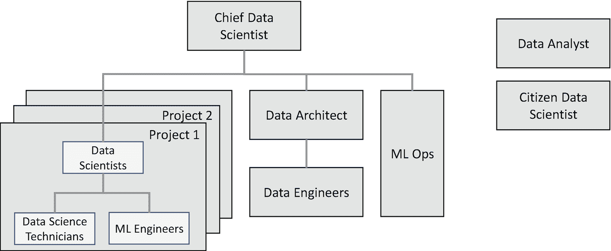

# 二十二、建立和构建团队

在前一章中，我们看到了组成跨学科数据科学团队的各种角色和技能。在本章中，我们将了解实践中常见的一些典型团队结构，然后讨论一些关于聘用数据科学家的要点，特别关注首席数据科学家。

## 典型的团队结构

在本节中，我们将首先了解开始数据科学活动所需的最小团队组成。然后，我们将看到一个成熟的、可操作的大型团队的典型组成，也就是说，一个团队创建了几个模型，这些模型被部署到生产系统中，并为业务产生价值。在介绍了数据科学之旅中的这两个极端点之后，我们将看看关于团队如何从孵化结构向成熟的运营结构发展的一些因素。

### 小型孵化团队

一旦你确定你已经准备好踏上数据科学之旅，你通常会从首席数据科学家开始。根据问题的复杂程度，您可能会雇用一名额外的数据科学家。或者如果你打算依赖 AutoML 和 AI 服务， [1](#Fn1) 你可以雇佣一个 ML 工程师来代替。

正如在第 [2](02.html) 章中所讨论的，向数据科学家提供数据至关重要。随着数据科学家继续分析数据，他们可能会要求更多数据或强调数据中的问题。为了满足数据科学家的这些要求，您可能还需要一名数据工程师。

有了这样的团队组成，数据工程师将拥有数据科学过程的数据捕获步骤。随着数据科学家在数据科学过程的迭代中不断进步，数据工程师也可以自动化数据准备和数据可视化步骤的某些部分。这将允许数据科学家越来越多地关注数据科学过程的机器学习步骤。

数据科学家或数据工程师也会执行推理步骤；通常，初始模型将被打包成一个简单的脚本，供 IT/工程团队调用。在这个早期阶段，投资先进的 ML Ops 流程可能没有意义。 [2](#Fn2)

### 成熟的运营团队

图 [22-1](#Fig1) 显示了一个已经发展成熟并完全可操作的团队的典型结构。

图 22-1

成熟的运营数据科学团队的典型结构

这样的团队通常会同时执行多个项目。几个当前和过去的项目已经产生了部署到生产系统中的模型。

在这种情况下，每个项目通常都有一组数据科学家、数据科学技术人员和 ML 工程师参与其中。数据科学家通常定义实验策略，并指定要执行的实验。数据科学技术人员和 ML 工程师执行实验。每个项目中团队的组成取决于项目的类型——这将在下一章详细介绍。

数据工程活动由数据工程师团队执行，通常由数据架构师领导。这个团队支持所有的数据科学项目。

专门的 ML Ops 团队确保以自动化方式部署、升级和监控模型。如果使用先进的 ML Ops 工具，那么这个团队通常会很小，只有一两个成员。

所有这些角色都有效地向首席数据科学家报告，首席数据科学家负责协调整体执行。首席数据科学家还从多个项目中汲取见解和提炼通用技术。

数据分析师和市民数据科学家角色(如果有)根据需要与团队的其他成员就各种项目进行协作。

### 团队进化

一旦孵化团队成功执行了几个项目，通常会有更多应用数据科学的机会出现。随着您的团队朝着上一节所述的成熟结构发展，您通常会努力沿着以下路线保持适当的平衡:

*   数据科学家与数据科学技术人员/ML 工程师的比例:为了以经济高效的方式扩展团队，允许数据科学家越来越多地关注实验设计而不是编码和执行可能是有用的。

*   将数据准备工作交给数据工程师:一旦数据科学家确定了典型的数据准备活动，如数据清理和数据转换，您就可以让数据科学家将这些步骤交给数据工程师。理想情况下，数据科学家应该花最少的时间准备数据。

*   卸载推理活动:虽然数据科学家需要了解生产需求(例如，推理过程中可接受的延迟)，但让他们为生产部署打包模型并不是很有成效。最好尽早将推断步骤交给数据工程师或 ML Ops。

*   采用先进工具与雇佣:鼓励数据科学团队成员采用工具可以减少对数据工程师和 ML Ops 的需求。此类工具的示例包括增强协作和简化计算集群供应的高级 ide、实验和模型注册、ML Ops 工具等。 [3](#Fn3)

*   快速执行与最佳实践:为了确保所有实验的业务连续性和可重复性，灌输最佳实践是至关重要的，例如使用实验注册、跟踪数据集的谱系等等。当引入这些工具时，团队可能会觉得这是一种开销——但一旦反复灌输，日常运营开销往往会变得微不足道，特别是如果使用正确的工具 [4](#Fn4) 的话。

## 关键雇员:首席数据科学家

对于首席数据科学家的角色，要评估的最重要的因素之一是:他们创建的模型中有多少已经部署到生产系统或用于战略决策。模型生产经验的可靠记录对于确保首席数据科学家具有基于结果的思维模式以及过去与其他团队(如工程团队和管理利益相关方)合作创建端到端解决方案至关重要。

接下来，除了通常的技术资格，当你试图寻找适合你的业务的首席数据科学家时，有两个主要方面需要考虑:首先，你认为哪种文化适合你的业务——修道士或狂野西部——其次，你是想聘请全职首席数据科学家还是聘请顾问。我们将简要介绍其中的每一个。

### 评估文化

回想一下第 [3](03.html) 章，通常，根据您的业务需求，您可以确定两种数据科学文化中哪一种更适合。如果您已经确定了哪种文化更适合您的业务，那么您将需要评估首席数据科学家，以确定他们可能主要属于哪种文化。

如果首席数据科学家拥有“正确的”文化，那么团队的其他成员通常会向首席数据科学家灌输相同的文化-他们会向团队成员灌输必要的文化，也会聘用属于类似文化的新数据科学家。

我们已经在第三章和第二十章中看到了两种文化之间的一些差异因素。相应地，以下是识别候选数据科学家可能主要属于哪种文化的一些要点:

1.  看看他们过去处理过的问题。这些问题需要修道士或狂野西部的方法吗？参见第 [3](03.html) 章了解这一点。

2.  看看他们用来解决这些问题的技巧，并将它们映射到第 [20](20.html) 章。他们的背景是否表明他们倾向于修道士或狂野西部的技巧？

3.  候选人的学术背景如何？根据我们的经验，如果候选人有
    *   作为统计学硕士或博士，他们可能更接近文化光谱的僧侣端。(数据科学文化谱参见第 [3](03.html) 章。)

    *   计算机科学背景，他们可能更接近文化光谱的牛仔端。

    *   一些其他的科学背景，例如，自然科学，那么他们很可能处于文化光谱的中间。

请注意，这些要点适用于招聘任何数据科学家。具体到首席数据科学家的角色，工作主体(第 1 点和第 2 点)将是文化的主要指标。基于学术背景的因素(第 3 点)是基于我们与跨文化领域的数据科学家合作的经验的观察。

### 雇佣顾问与获得顾问

在最初阶段，当您考虑启动数据科学团队时，寻求首席数据科学家的帮助可能是明智的

*   阐明问题

*   确保必要的数据可用

*   确保数据科学实际上是解决问题的正确方法 [5](#Fn5)

*   定义数据和实验策略

顾问还可以建议使用人工智能服务或 AutoML 是否可以满足您的需求。如果最初的实验可以使用 AI 服务或 AutoML 来完成，那么你可以指派一名 ML 工程师在顾问的指导下工作。如果你没有一个 ML 工程师，你可以在你现有的 IT/软件开发团队中提升一个聪明的软件工程师来快速成为一个 ML 工程师。 [6](#Fn6)

如果顾问建议现有的人工智能服务或 AutoML 可能不是很合适，那么你可以考虑雇用一名高级或首席数据科学家，这取决于问题的复杂性和你从试点数据科学项目中看到的潜在投资回报。

## 数据工程:需求和人员配备

让我们看看决定您团队的数据工程需求的几个因素，以及如何满足它们。

如果你正在培养一种修道士文化，那么不太可能需要大量的基础设施，比如 GPU 集群等等。通常，在这些情况下，数据科学家更喜欢在一台有可用数据的专用机器上工作。在这种情况下，数据工程活动可能是间歇的，而不是持续的。

如果你正在孕育一种狂野的西部文化，那么你的数据科学家可能会处理大数据，也需要机器集群，可能包括 GPU。在这种情况下，通常要执行更多的数据工程活动。

无论如何，在早期孵化阶段，你可能不需要全职数据工程师；如果是这样，有几个选择:

*   如果数据科学家熟悉您组织中的数据源，他们可以执行数据工程活动。

*   从你的 IT/工程团队中从事数据库工作的软件工程师那里抽出一些时间。如果做到了这一点，那么您的数据科学家的生产力将是最佳的。

## 技能提升笔记

你可能听说过数据工程师可以晋升为数据科学家。虽然在某些情况下这可能是真的，但我们经常发现数据工程师缺乏必要的数据分析背景和有效应用科学方法所需的思维过程。

如果提升技能是你的主要人员配置策略，那么数据工程师，就像软件工程师一样，通常可以提升为 ML 工程师。一旦他们显示出作为 ML 工程师的潜力，你就可以考虑将他们提升为数据科学家。

## 结论

我们讲述了典型的团队结构和演变，以及一些关于雇佣数据科学家，尤其是首席数据科学家的建议。

在下一章，我们将在各种数据科学项目的背景下重新审视团队结构。

<aside aria-label="Footnotes" class="FootnoteSection" epub:type="footnotes">Footnotes [1](#Fn1_source)

涵盖在第 [18 章](18.html)中。

  [2](#Fn2_source)

第 [17](17.html) 章介绍了 ML Ops。

  [3](#Fn3_source)

参见第 [19](19.html) 章，回忆这些不同的工具是如何一起使用的。

  [4](#Fn4_source)

例如用于实验注册的 ML 流等。

  [5](#Fn5_source)

参见第 [2 章](02.html)。

  [6](#Fn6_source)

回想一下前一章，软件工程师可以很容易地升级为 ML 工程师，只需接受最少的 ML 基础培训，如模型性能评估，并结合 AI/AutoML 服务和库的知识。

 </aside>