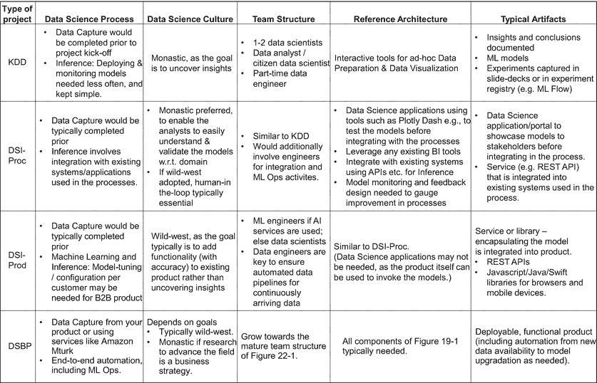

# 二十三、数据科学项目

本书开始时，我们在第 1 部分介绍了数据科学过程。然后在第 2 部分中，我们看到了可能与您的业务相关的各种问题，以及数据科学过程如何应用于每种情况。在第 3 部分中，我们研究了执行数据科学流程的每一步所涉及的各种技巧和技术，最终形成了一个可以根据您的特定团队量身定制的参考架构。在过去的几章中，我们已经看到了在组建一个执行端到端数据科学流程的跨学科团队时所扮演的各种角色。

数据科学团队(前两章)将技巧和技术(第 3 部分)应用于各类问题(第 2 部分)，使用数据科学流程实现业务成果(第 1 部分)。数据科学*项目*是包含产生预期业务成果的所有这些方面的总体活动。在这最后一章，我们将着眼于数据科学项目的各个实际方面。

我们首先介绍四种常见类型的数据科学项目以及它们产生的典型业务成果；我们还涵盖了项目类型如何影响数据科学过程、参考架构、数据科学文化等。

在以下部分中，我们将介绍与管理数据科学项目和团队相关的各个方面。我们首先介绍在数据科学之旅中经常被认为太迟的一个关键方面——使用 KPI 评估团队的绩效。然后，我们将讨论数据质量和数据保护/隐私的各个方面——这些通常是人们在日常运营中往往会回避的秘密。然后，我们看一下数据科学项目特有的法律和法规考虑事项。最后，我们总结了认知偏差以及如何/何时在数据科学项目中防范认知偏差。

## 数据科学项目的类型

表 [23-1](#Tab1) 显示了数据科学项目的四种常见类型以及每种类型项目的典型预期业务成果。

表 23-1

数据科学项目的类型和典型的业务成果

<colgroup><col class="tcol1 align-left"> <col class="tcol2 align-left"></colgroup> 
| 

项目类型

 | 

典型的业务成果

 |
| --- | --- |
| 从数据中发现知识(KDD) | 源自现有数据的新颖、可行的见解 |
| 流程中的数据科学融合(DSI-Proc) | 现有业务流程的改进。也能带来新的商业模式 |
| 产品中的数据科学融合(DSI 产品) | 增加客户对现有产品的参与度，提高产品的采用率 |
| 基于数据科学的产品(DSBP) | 基于数据科学模型的新型“智能”产品 |

使用表 [23-1](#Tab1) ，您可以确定哪种类型的项目最适合您的业务需求。这也有助于团队和其他利益相关者设定相应的预期结果。

在以下小节中，我们将介绍每种数据科学项目的一些示例，并总结每种数据科学项目的一些典型特征。

### 从数据/数据挖掘中发现知识

从现有数据中提取新颖的、可操作的见解被称为从数据中发现知识(KDD)或数据挖掘(T2)。以下是一些例子:

*   典型的例子是识别用户交易模式，以实现有效的销售和营销策略。例如，假设您的组织经营一家零售商店/连锁店，并捕获了几个用户和交易的数据。使用这些数据，您希望对具有相似购买模式的用户进行分类，或者确定经常一起销售的产品。 [1](#Fn1) 这些种类的洞察可以随后启用交叉销售活动。

*   假设您的组织制造一些重型设备，如运土机器。您已经创建了一个工业物联网解决方案，该解决方案正在收集有关机器运行的各种数据，如遥测数据。您组织中的其他内部或代理商应用程序捕获数据，如您的设备的销售或租赁、其操作条件(如土壤类型)等。鉴于这些数据都是在过去几年中获得的，您渴望从中获得进一步的见解。在这一阶段，您不确定需要什么样的见解，但是任何关于操作条件或设备用户如何影响设备性能的有用信息都是有用的。KDD 的一个项目可以探索这些数据来提取这样的见解。一个具体的结果可能是洞察，例如，土壤条件、运行时间和设备操作者如何影响设备的燃料消耗或维护需求。

TERMINOLOGY CHAOS: DATA MINING AND KDD

术语*数据挖掘*和 *KDD* 有几种不同的用法。例如，一些人认为数据挖掘是 KDD 的一个步骤。然而，在本书中，我们会互换使用数据挖掘和 KDD 这两个术语。

此外，KDD 的一个常见扩展是数据库中的知识发现。我们更喜欢更通用的术语“从数据中发现知识*，因为数据可以来自网站、API、流等。，此外还有数据库。*

 *最后，如本节所述，我们将 KDD/数据挖掘视为数据科学项目的*一种*类型，现在归入数据科学。

### 流程中的数据科学融合

数据科学可以在改善组织内的现有流程 [2](#Fn2) 或组织参与的流程方面发挥关键作用。

以下是这类项目的几个例子:

*   在将液体储存在大罐中的公司中，终端的操作通常涉及诸如监测罐、将液体保持在一定温度范围内、以及将液体从卡车或轨道车泵入/泵出罐以进行运输的活动。各种活动涉及电机，如泵、加热器等。，并导致公用事业费用。给定过去操作的数据、储罐中的当前液体体积以及卡车/轨道车的估计到达时间，数据科学模型可用于预测特定活动(例如，加热)需要在各种储罐中发生的最晚时间。这些预测可以输入到一个调度算法中，该算法按照预测的时间限制来安排活动，从而最大限度地减少终端的用电高峰。这将导致成本节约。

*   考虑一家制造家用医疗产品的公司，例如，用于监测癌症患者的尿条。在这种情况下，该过程通常包括将试条发送给临床医生/医生，他们对颜色读数进行解码以获得病理学指标。利用现代计算机视觉技术，这可以被数字化，使得可以分析条带的照片(由患者使用他们的移动设备拍摄的)以提取颜色读数，转换成病理学度量，并且以自动化的方式与临床医生/医生共享。这改善了整个过程和患者的体验。

*   在某些情况下，使用数据科学模型自动化一些内部流程也可以带来新的业务模式。例如，假设一家公司生产化学增强剂，以提高某个炼油厂某些化学过程的产量。为了给特定炼油厂推荐合适的增强剂组合，该公司会让专家分析炼油厂的输入原料和其他环境因素。如果您已经从过去的几个这样的分析中收集了数据，那么现在可以使用数据科学模型来自动化它。该模型将从专家过去的决策中学习，从而提高产量，并相应地为任何新的客户/化学工艺提供增强剂混合物的建议。一旦流程的这一关键部分实现自动化，就有机会为客户提供自助服务平台，让他们可以输入有关原材料、环境等的所有参数。，并获得可以提高产量的增强剂混合物的建议。

### 产品中的数据科学融合

不同领域的技术产品往往会受益于通过注入数据科学模型获得的“智能”。例如:

*   假设您的公司为协作和生产力开发软件产品。一种这样的产品，虚拟集成工作空间，允许用户使用各种通信模式，例如聊天、音频/视频会议、电子邮件和其他工具，如日历、笔记等。，从单个集成界面中。可以注入这种产品的数据科学驱动的功能包括
    *   自动理解电子邮件、聊天或音频通话的意图，并执行所请求的操作。例如，根据电子邮件中的请求创建日历事件或预订会议室等。

    *   为会议自动生成抄本和行动事项记录，包括自动行动，如安排后续讨论等。

*   假设您的公司生产物联网设备，并提供软件平台来监控设备及其使用情况，并远程控制设备，包括制定政策等。在这种情况下，可以将基于数据科学的模型添加到产品中，帮助检测任何异常读数(即异常检测)，并实现预测性维护的用例。

*   假设您的公司销售检测异常网络流量或资源使用的 IT 安全产品。您可能已经使用规则引擎嵌入了 AI，但是客户现在报告说在某些情况下错误警报相当高。添加基于数据科学的异常检测技术可以提高产品性能，从而改善客户体验。

*   假设你的公司生产 CT 扫描仪。虽然高辐射剂量可以获得高质量的扫描，但与低辐射剂量相比，高辐射剂量对患者来说可能不太安全。但是使用低辐射剂量获得的对病人安全的扫描会有更多的噪音，看起来模糊等等。，这会使解释/诊断不清楚。通过分析过去从低辐射剂量和高辐射剂量获得的扫描，深度学习技术可以学习将有噪声的扫描(从降低的辐射剂量获得)转换为高质量的扫描。给 CT 扫描机注入这种技术可以实现使用低辐射剂量的高质量 CT 扫描。

*   推荐系统、语音增强界面等。，是将数据科学融入现有产品的其他常见示例。

*   如果您的公司提供在线视频会议解决方案，那么可以使用数据科学模型来实时消除与会者音频的噪声。在这种情况下，基于干净音频和嘈杂音频的数据(例如，交通的背景声音、狗叫声、儿童哭声等)来训练模型。)来去除噪声。这种系统中的一个挑战是音频去噪必须实时发生，以便参与者在会议期间不会经历延迟。提供这样的功能可以成为市场中的一个差异化因素，从而提高客户的采用率。

### 基于数据科学的产品

由于各种易于使用的数据科学库和工具的快速增加，各种公司现在都在构建完全基于数据科学模型的产品。请注意，此类 DSBP 项目与我们之前看到的 DSI-Prod 项目之间的主要区别是，在 DSBP 的情况下，没有数据科学模型，产品就无法存在；另一方面，在 DSI-Prod 的情况下，数据科学为现有的功能性产品添加了一些有用的功能。以下是 DSBP 项目的几个例子:

*   如果你正在开发一个可以使用用户音频样本检测健康状况的健康移动应用，你将完全依赖数据科学模型来完成这一任务。作为商业策略的一部分，你可以从一两种健康状况开始，如呼吸困难等。并且，随着时间的推移，增加你能够检测到的健康状况的数量和种类。
    *   作为业务策略的一部分，您可能还希望提供能够使用音频样本检测健康状况的 API。这种 API 可以由例如创建远程医疗应用等的外部公司使用。

    *   如今，更常见的是先构建一个 API 平台，然后在这个 API 平台上构建您的移动应用程序。通过这种方式，您可以将移动应用货币化，并将其作为 API 平台功能的原型。

    *   如果你提供 API，那么从你的 API 的客户的角度来看，你是在提供 AI 服务。

*   在监控、医学成像等领域，有几种产品是使用计算机视觉技术制造的。

### 数据科学项目的典型特征

表 [23-2](#Tab2) 捕捉了各种类型的数据科学项目的一些典型特征。虽然这些特征很大程度上是基于我们的经验，但它们也可以从我们在本书中的早期内容中逻辑地推导出来。此表旨在作为启动新项目或组建团队时的指示性参考[3](#Fn3)——它可以帮助确定前进方向，设定利益相关者和团队成员的期望，并作为估算预算和分配领域的起点。

表 23-2

数据科学项目的特点

<colgroup><col class="tcol1 align-center"> <col class="tcol2 align-center"></colgroup> 
|  |

## KPI

关键绩效指标(KPI)用于量化团队的绩效和实现目标的总体进度。在本节中，我们将提到一些可用于数据科学项目或整个团队的 KPI 和指标。请注意，我们没有涵盖 RoI 等业务 KPI。，决定数据科学团队对业务的贡献；相反，我们涵盖了运营 KPI，这些 KPI 用于跟踪数据科学团队针对其自身目标的绩效。假设数据科学团队的目标已经映射到期望的业务成果(参见第 [2](02.html) 章)。如果您对多个项目有一个成熟的实践，那么您可能想要捕获项目级别的 KPI，并聚集它们以跟踪整个团队的绩效。

### 模型性能

这是决定给定模型表现如何的 KPI。实现期望的模型性能通常是数据科学项目的直接目标。

需要确定模型性能的适当指标——参见第 [16](16.html) 章中的模型性能评估和指标。

项目的每一次迭代或冲刺都应该捕捉到模型性能的提高，这表明了核心数据科学的进步。

模型绩效 KPI 确保团队朝着*正确*的方向前进，并记录所取得的进展；下面提到的其他度量标准只跟踪*如何高效地*团队朝着那个方向努力。

### 实验周期时间

*实验周期时间* KPI 是获取完成实验所需总时间的综合指标。这反映了数据科学团队迭代实验的速度。

WHAT IS AN EXPERIMENT?

请注意，“实验”的概念是相当主观的，具体到手头的问题和使用的技术。它也可以基于项目所处的阶段而发展。例如，在项目的早期阶段，评估每种类型的 ML 算法或各种可能的数据集都可以是一个实验。一旦确定了某个 ML 方法和数据集，那么模型训练和调整的一个特定迭代可以被认为是一个实验。

因此，构成“实验”的是数据科学家将会识别的东西。

为了持续改进实验周期时间，几个辅助指标可能是有用的，其中一些如表 [23-3](#Tab3) 所示。解决特定于任何指标的改进领域将会缩短整个实验周期时间。

表 23-3

与实验周期时间相关的辅助指标

<colgroup><col class="tcol1 align-left"> <col class="tcol2 align-left"> <col class="tcol3 align-left"></colgroup> 
| 

公制的

 | 

描述

 | 

数据科学过程的相关步骤

 |
| --- | --- | --- |
| 数据集管理工作 | 管理感兴趣的数据集的工作。这包括获取相关数据、探索性分析和为 ML 准备数据 | 数据捕获、数据准备、数据可视化 |
| 模型培训工作 | 为训练模型和分析结果模型及其性能所做的努力。数据大小、基础设施等。，在这里发挥作用。如果由于基础设施不理想而导致模型训练时间过长，数据科学家可能会花时间等待，这一时间也应包括在内 | 机器学习 |
| 模型测试工作 | 给定一个模型，在新数据集上“测试”该模型所需的工作。这包括将测试数据集转换成适当的格式、在测试集上使用模型，以及在测试集上评估模型性能所需的任何工作数据大小、基础设施等。，在这里也扮演一个角色 | 机器学习 |
| 模型部署工作 | 一旦一个模型被批准，它在目标生产系统上“运行”需要多长时间？这衡量了整个 ML Ops 渠道的有效性 | 推理 |
| 模型监控工作 | 数据科学团队分析生产模型性能所需的工作。这包括获得所有相关数据的清晰图像以及模型给出的预测/见解的能力 | 推理 |

#### 努力-成本权衡

请注意，在上表中，我们通常将*工作*作为衡量标准。减少工作量的一个常见方法是采购工具，例如，我们在第 3 部分中看到的用于数据科学过程各个步骤的工具。与任何其他项目一样，数据科学项目也涉及以下因素之间的适当权衡:

*   如果人工努力没有减少，机会成本是多少？

*   使用一个工具会节省数据科学团队多少手动工作？这种努力的等价成本是多少？

*   一个工具要花多少钱？

## 数据质量

数据质量通常是公司内部讨论的两极分化话题，尤其是在数据科学团队内部。当您拥有来自多个来源的数据，并且已经建立了数据管道来捕获数据科学家在数据科学过程中使用的数据时，数据科学家的期望是数据是“高质量的”但是，数据科学家所指的“高质量”往往与软件或数据工程师所理解的“高质量”不同——这导致在数据科学过程的后期才发现问题。由于数据质量问题发现得太晚而浪费了几个人工月的努力，这种情况并不少见。

在本节中，我们将首先介绍数据质量的重要性，以及数据质量问题造成的影响的严重性如何因数据科学项目的类型而异。然后，我们看看数据质量的几个维度，这将有助于为您的团队适当地“定义”数据质量。然后，我们将涉及测量和确保数据质量的一些方面。最后，我们将看看为什么数据质量经常处于次要地位的典型原因，以及如何解决这些原因。在这些部分中，我们的重点是在数据科学家开始在数据科学过程中处理数据之前，确保数据具有预期的质量。 [4](#Fn4)

### 数据质量的重要性

为了理解数据质量的重要性，让我们考虑一下将低质量数据用于数据科学时可能出现的各种问题，以及这些问题造成的影响的潜在严重性。

#### 低质量数据引起的问题

一个常见的预期问题是，数据科学家无法创建一个性能足够好的模型。这是一个相对不太严重的问题——一旦发生这种情况，您可以回头更严格地检查数据质量。损失的时间较少，因此在这种情况下是可以忍受的。

更严重的问题，也是一个经常被忽视的问题是，数据科学家可能实际上得出一个看起来性能良好的模型(使用质量差的数据)——当基础测试数据质量也很差，并给人以良好性能的误导时，就会发生这种情况。这可能会令人惊讶地经常发生，尤其是在西部文化中，例如，在深度学习技术中，你只关注预测准确性，而不是获得和验证模型提供的洞察力。当这样的模型——使用有质量问题的数据构建——被部署到生产中时，它将表现不佳或不稳定。然后，通常一开始就认为这是模型的问题，例如，可能模型没有在足够多的测试数据上进行测试，所以它不能很好地概括生产场景。只是在那之后，很晚，注意力才转移到验证数据质量上。通过这种方式，潜在的数据质量问题很晚才被发现，数据科学团队的大量工作可能已经被浪费了。

#### 影响的严重性

这些问题影响的严重性和性质取决于您的业务和正在解决的问题。然而，数据科学项目的类型通常有助于获得影响严重性/性质的一些初步近似值。如表 [23-4](#Tab4) 所示。

表 23-4

基于项目类型的数据质量的影响，有助于获得严重性/性质的一些初步近似值

<colgroup><col class="tcol1 align-left"> <col class="tcol2 align-left"> <col class="tcol3 align-left"></colgroup> 
| 

项目类型

 | 

影响的严重性

 | 

影响的性质

 |
| --- | --- | --- |
| 知识发现 | 批评的 | 来自 KDD 项目的结果/见解通常用于定义新的战略或启动新产品开发。由于这些通常是高成本投资，如果发现 KDD 项目的结果不正确，影响可能会相应地更大 |
| 数字信号处理器 | 中等–高 | 如果注入到流程中的模型在生产中表现不佳，流程中的改进可能不会达到预想/期望的程度。因此，投资回报率将低于预期。如果对监督最少的模型的依赖导致流程效率恶化，影响可能会更大 |
| DSI-产品 | 低-中等 | 由于产品已经支持了业务，如果引入的新功能没有按预期执行，影响相对较低。如果许多用户使用新功能，预期会产生中等程度的影响，而糟糕的体验会导致客户流失 |
| 压 | 高的 | 由于整个业务都依赖于数据和生成的模型，因此影响会很大。但是在这种情况下，由于模型是面向客户的产品的主要焦点，问题和影响往往会更快地被强调(和解决)。因此，我们将影响归类为高，而不是关键 |

确定低质量数据影响的严重性与通过确保数据质量来降低风险的工作量之间的适当权衡——这种*风险-工作量权衡*是数据质量计划的基石之一。在下面的章节中，我们将涉及到评估这种权衡的各个方面。

### 数据质量的维度

确保数据质量的第一大障碍在于定义数据质量。对于数据科学实践，定义最好由首席数据科学家与数据架构师或数据工程师合作完成。 [5](#Fn5) 这确保了每个人都符合定义和由此产生的数据质量需求，以及任何时间点的数据质量状态。

数据质量的定义通常采取确定各种维度的形式，可以沿着这些维度确定可量化的度量。维度的选择可能因组织而异。随着数据科学实践的成熟，维度的选择通常也会发生变化——可能会添加更多的维度，或者进一步细化现有的维度。在任何情况下，都有一些重复出现的典型尺寸——表 [23-5](#Tab5) 记录了其中一些尺寸。

表 23-5

数据质量的维度

<colgroup><col class="tcol1 align-left"> <col class="tcol2 align-left"></colgroup> 
| 

数据质量维度

 | 

解决质量问题

 |
| --- | --- |
| 一致性 | 数据管道中多个步骤的数据是否存在意外差异？ |
| 有效期 | 数据是否具有预期的数值范围、数据类型和格式？ |
| 完全 | 每个观察的所有属性都可用吗？ |
| 可用性 | 数据科学团队可以使用这些观察结果吗？这由数据科学家根据所进行的数据分析的具体情况来决定。例如，在某些情况下，无效或不完整的观察结果可能仍然有用 |
| 准确 | 数据在多大程度上反映了现实世界？ |

有关数据质量各个维度的更全面、更严格和更详细的覆盖范围，请参考 DAMA (2017)第 [13](13.html) 章“数据质量”。 [6](#Fn6)

一旦您确定了相关维度，就该考虑如何沿着这些维度实际测量数据质量了。

### 测量数据质量

当谈到沿着确定的维度测量数据质量时，最初遇到的几个问题是“我们测量哪些数据？”以及“对于不同的维度，什么样的质量水平是可接受的？”。

解决这些问题的常见方法是将各种数据集“标记”为青铜、白银或黄金，如表 [23-6](#Tab6) 所示。

表 23-6

基于预期目的和数据的预期性质对数据集进行分级

<colgroup><col class="tcol1 align-left"> <col class="tcol2 align-left"> <col class="tcol3 align-left"></colgroup> 
| 

级别

 | 

目的

 | 

数据的预期性质

 |
| --- | --- | --- |
| 青铜 | 了解可用数据的早期探索；数据科学项目的可行性分析 | 未经任何处理的原始数据 |
| 银 | 数据科学过程的早期迭代，更加面向数据准备和数据可视化步骤 | 转换为标准格式的数据，已清理的数据，以及任何基本错误，如无效值、表间不一致等。，已被识别和标记 |
| 金色的 | 创建数据科学模型 | 从多个银表中提炼出具有必要质量的有趣观察结果 |

相应地，目标是黄金数据应该是高质量的(在所有质量维度上得分高)，白银数据的质量可以稍低，所有其他数据都可以被视为青铜数据-青铜数据质量可能根本无法衡量或质量很差。

考虑到数据资产的这种分类，现在有必要首先投入所有必要的努力来确保您当前直接项目中使用的黄金数据集的质量。一旦确保您当前项目的黄金级数据的整个质量可以接受，您就可以根据您的战略需求和可用资源投入更多精力来衡量其他白银级和青铜级数据的质量。

### 确保数据质量

一旦确定了维度并对数据集进行了分级，通常会编写脚本来自动执行以下操作:

*   衡量相关数据集的数据质量

*   随着新数据的到来更新数据质量指标

*   如果检测到任何严重的数据质量问题，则触发警报(例如，电子邮件通知)

这些脚本通常由数据工程团队编写和维护。

ML 技术也可用于帮助提高数据质量。有关该领域的概述，请参考使用机器学习提高数据质量(2021)。

### 对数据质量工作的抵制

当一个人事后意识到科学工作是浪费的，因为数据质量差，除了业务影响之外，这往往还会对数据科学家的士气和动力产生重大的负面影响。让一个科学家处理未经质量验证的数据从根本上违背了这一学科的精神。在任何其他科学领域，人们都不会期望科学家处理这样的数据，但在数据科学中，我们经常看到领导者和管理者没有充分关注数据质量，直到为时已晚。

一个潜在的根本原因是，一旦数据科学家加入进来，尝试创建模型会被认为更有成效(更有利可图)——典型的期望往往是“模型将于何时交付…？”甚至“第一季度计划交付多少款？”–只有在以后实际遇到任何问题时，才重新考虑数据质量。

在这种情况下，产生的感觉通常是没有足够的时间或带宽来正确定义“数据质量”,衡量数据质量指标，并确保必要的数据质量——这是数据质量工作的主要阻力。

知情的权衡分析通常有助于评估这种抵制是否合理。在权衡分析过程中，重要的是要充分认识到如果数据质量未经验证可能会出现的问题的性质和严重性。对不良数据质量影响的严重性(本节前面已介绍过)和可用带宽/资源之间的权衡进行客观分析，将有助于客观地确定在数据质量方面可以付出多少努力。

## 数据保护和隐私

数据保护/隐私是一个庞大的话题，影响着组织中数据存储和使用的方方面面。这是如此重要，以至于在许多公司，专门的首席信息安全官(CISO)负责确保数据保护和隐私。现有各种数据保护法规，例如

*   通用法规，例如 GDPR

*   特定于行业的法规，如针对健康信息的 HIPAA 等。

组织运营所在的地区/国家及其所属的垂直行业决定了适用的数据保护和隐私法规(例如这里提到的法规)。组织相应地采用它需要遵守的标准和法规遵从性要求。虽然在遵守这些法规时需要考虑几个因素，但对于用于数据科学的数据，有几个共同的重要方面。我们将在这一节谈到这些。

### 加密

通常，数据收集、存储和处理会使用适当的机制进行加密，以符合您的组织中针对安全性和法规遵从性设置的标准。

确保数据科学团队在数据科学流程的各个步骤中也遵循这些机制非常重要。以下是此类组织标准的几个示例，以及它们如何应用于数据科学团队:

*   数据科学团队使用的数据湖或数据仓库应该加密。同样，如果您的流程允许数据科学家将这些数据下载到他们的机器上，那么他们的机器也需要加密。

*   任何数据处理都应通过安全通道进行，如 HTTPS/TLS。这可能包括数据科学家下载数据的方式，或者集群(如 Spark 集群或 GPU 机器集群)中的机器之间如何进行数据传输。

### 访问控制

确保数据访问仅限于正确的团队成员非常重要。例如，如果一个数据科学家正在从事一个特定的项目，那么他们应该只被授予分析所需的表和行的访问权限。为此，各种数据湖和数据仓库支持访问控制机制。

有时，出于探索目的，数据科学家可能需要访问更多数据，甚至整个数据湖，在这种情况下，可以在有限的时间内提供扩展的访问权限。

限制对某些数据的写访问也是有用的；例如，您可以定义一个策略，以确保黄金数据仅由某些授权的数据工程师或数据科学家写入/更新。

最后，如果数据科学团队中的一些成员有权访问受保护的或可识别的信息，则需要审核所有此类访问。

### 可识别/受保护/敏感的信息

个人身份信息(PII)是指姓名、电话号码、地址等属性。，可用于识别特定的个人。甚至语音记录也可能是 PII，因为个人可能通过他们的声音被识别。

受保护信息扩展了 PII 的范围，包括使用您的服务收集的任何其他个人信息，这些信息可用于识别个人身份。例如，根据美国健康保险便携性和责任法案(HIPAA)，受保护的健康信息(PHI)包括诸如病历号、健康保险详细信息等信息。，此外还有前面提到的 PII 信息。

最后，某些法规可能涵盖与“敏感”数据处理相关的方面。例如，根据 GDPR(第 9 条)，敏感数据包括

> *透露种族或民族血统、政治观点、宗教或哲学信仰或工会成员身份的个人数据，以及对遗传数据、用于唯一识别自然人的生物特征数据、健康数据或自然人性生活或性取向数据的处理…*

> —gdpr(第 9 条)

数据科学团队必须意识到这些概念是组织的合规性目标所要求的，并且他们必须*主动*尝试*而不是*访问或使用 PII、受保护或敏感信息，除非绝对必要。即使在必要的时候，也需要以受控的方式提供访问权限。

例如，假设您正在构建一个基于数据科学的产品，该产品分析语音样本以检测健康状况。一旦您确定数据科学家确实需要访问包含声音样本的音频文件，那么在启用访问时，您应该考虑以下几个问题:

*   我们能否将访问音频文件的权限限制在某些数据工程师或数据科学家，他们将执行数据准备以从音频样本中提取数字特征？这样，PII 访问受到高度限制，而团队的其他成员可以使用数字特征(不是 PII)进行建模等。

*   音频文件是从多个国家收集的吗？如果是，PII 每个国家的水处理法规是什么？例如，很可能这些国家要求 PII 不能离开这个国家——任何对 PII 的加工都需要在这个国家进行。如果是这样，我们如何构建系统并定义流程，以便数据科学家能够在遵守这些约束的同时使用音频文件来创建模型？

这些通常是不小的挑战；这些解决方案将取决于您组织的数据架构、基础设施和法规遵从性要求。这通常需要首席架构师、数据架构师、首席数据科学家和首席信息安全官共同合作，定义一个整体战略，使数据科学符合法规。

最后，如果您正在使用(或计划使用)任何云服务，检查这些服务是否符合您组织的法规要求是很重要的。例如，如果您使用 AWS 来存储和处理美国的医疗保健信息，您需要检查您使用的 AWS 服务是否符合 HIPAA(它们通常都是符合的)。

### 联合学习

通常，组织希望合作创建新的模型。但是考虑到数据的敏感性和不可共享性，这样的合作是一个挑战。这尤其适用于医疗保健和金融等行业。

为了克服这一挑战，联合学习的概念最近开始在这些行业中获得牵引力。以下是联合学习的主要概念:

*   组织可以安全地与其合作伙伴共享代码，例如模型训练代码。

*   代码在合作伙伴基础设施中对合作伙伴数据安全地执行。

*   执行代码的结果(例如，模型)被返回给请求/发起执行的组织。

确保模型和数据的安全性(一直到硬件级别)所需的关键能力之一是可信执行环境(TEE ),如英特尔 SGX。参考通过革命性技术的联合学习(2020)的例子，其中包括进一步的技术细节。

## 法律和监管方面

在上一节关于数据保护和隐私的内容中，我们讨论了一些关于数据存储、访问和处理的主要法规。假设所有这些方面都考虑到了，并且根据需要获得了个人的同意，那么在将数据用于数据科学时，还需要考虑其他几点。在本节中，我们将简要介绍从数据中创建 ML 模型的道德/法律和监管方面*的具体内容*。

### 这些什么时候相关？

在很大程度上，本节涵盖的方面往往适用于消费品，包括网站/移动应用程序等。，由消费者使用。如果您的公司处理消费者数据，那么您需要付出努力来确保您的数据科学项目和模型满足以下概述的必要法规遵从性。

如果您的项目纯粹处理非个人数据，如传感器读数或收集的内部操作数据等。，那么这些法律因素可能不太相关。

我们建议，如果您正在进行 DSI-Prod 或 DSBP 项目， [7](#Fn7) 主动检查所有合规性要求通常更安全，即使乍一看您似乎没有在处理消费者数据。

### 不歧视

正如我们在本书中所看到的，数据科学依赖于数据，从数据中学习模式，并根据过去的数据进行预测。各种 ML 算法可能以不同的方式“学习”，8 并且产生的模型将以不同的方式进行预测——但是它们最终基于在训练期间提供给它们的数据。如果数据本身在某些方面有偏差，那么得到的模型也可能有偏差。在过去几年中，在工作表现、金融贷款、教育、个人偏好等不同领域都有几个这样的例子——参见 O'Neil (2017)。GDPR 也在“貌相”下概述了这些方面，例如，见叙文 71 和第 22 条。

如果数据科学模型明确使用敏感数据，如种族、宗教等。，那么创建/准备数据的人类固有的任何偏差也将被 ML 算法“学习”。如果数据科学模型使用地理区域等其他相关信息，也会出现类似的偏差——这是因为一些地区可能有更多的低收入或少数民族居民。将使用这些数据训练的模型视为“客观的”可能是一个严重的错误。

### 可解释性和问责制

GDPR 第 12/13 条和美国 2019 年算法问责法案等法规涵盖了使用机器学习算法处理数据和决策的问责方面。例如，如果申请人的贷款请求基于一个模型被拒绝，组织要对拒绝负责(即，不能仅仅指出一个“模型”负有责任)，还需要能够*解释*决策背后的原因。

即使一个组织是善意的，问责制的主要障碍之一是缺乏可解释性。 [9](#Fn9) 而解释的首要障碍在于一个 ML 模型的技术细节。

在第 [20](20.html) 章中，我们看到了各种技术在涉及到*归因*和*预测的可解释性*等因素时的显著差异。从纯技术的角度来看，这是构成*模型*可解释性的两个主要因素——哪些数据(属性)影响了决策/预测，以及算法(ML 模型)如何基于这些属性的值得出最终的决策/预测。

在第 20 章中，在这两个因素上得分较低的技术——比如深度学习——在谈到*模型*的可解释性时最为臭名昭著。这类模型解释能力差，通常被称为*黑箱模型*。近年来，在黑盒模型的可解释性方面的研究越来越多。但是这些技术通常是近似或估计的，这导致了不能被信任的解释忠实于原始模型是如何得到预测的。有关更多详细信息，请参见 Rudin (2019)。

我们预计围绕这些方面的辩论将持续数年。同时，我们建议，如果您正在处理消费者信息和个人数据，尽可能使用可解释的技术，即在第 [20 章](20.html)中对*归因*和*预测*的可解释性具有高等级的技术。

### 可解释的人工智能:什么是“解释”？

一个人想要达到的理想目标是提供一个解释…

> *…以简明、透明、可理解和易于获取的形式，使用清晰明了的语言向数据主体披露…*
> 
> —gdpr(第 12 条)

这涉及到的不仅仅是*模型*的可解释性——实现这一理想目标可能很棘手，即使对于在第 [20](20.html) 章中*归因*和*预测*的可解释性上获得 A/A+的技术来说也是如此。这是因为这些模型本质上基本上是数学模型，并且用“清晰明了的语言”来解释它们的行为。在某些情况下，对数据主体进行。不用说，使用黑盒模型更难达到这个理想目标(尽管在这种模型的可解释性方面正在进行研究)。

## 认知偏差

我们从第 1 章开始看爱丁顿和爱因斯坦——现在让我们重复回到他们身上。

> 爱丁顿的观察……非常不精确，其中一些与其他的相矛盾。当他选择哪些观察结果算作数据，哪些算作“噪音”，也就是说，当他选择保留哪些，丢弃哪些时，爱丁顿非常清楚爱因斯坦的预测。因此，爱丁顿只能声称已经证实了爱因斯坦，因为他用爱因斯坦的推导来决定他的观测实际上是什么，而爱因斯坦的推导之所以被接受，只是因为爱丁顿的观测似乎证实了它们。观察和预测是在一个相互证实的循环中联系在一起的，而不是像我们根据实验测试的传统想法所期望的那样相互独立。因此，正确的描述是存在“一致同意”,而不是存在一个理论，然后是一个测试，然后是一个确认。
> 
> —柯林斯和平奇(1998 年)

积极寻找并关注支持一个人已有信念的数据和证据的倾向被称为*确认偏差*。

回想一下第 3 章，修道士文化的目标是寻找永恒的真理，而西部蛮荒文化对短期的、看似偶然的真理很满意。

偶然的真理通常不值得“相信”——因此，牛仔通常较少受到确认偏差的影响。例如，如果他们在新数据上检测到模型性能下降，表明该模型不适用于这些观察，他们将不会试图维护该模型。他们将简单地重新训练使用新的观察来建立代表新的短期事实的模型——这没什么大不了的。

另一方面，永恒的真理是经过深思熟虑后得出的，并且*要求*“信仰”——僧侣们投入大量精力提炼“真理”，一旦提炼出来*就相信*。僧侣们可能会选择忽略偶尔出现的与永恒真理相矛盾的微不足道的证据(观察)，或者为了证明其误导性/不正确而对其进行检查。

不幸的是,“确认偏差”这个术语似乎有负面的含义——毕竟，所有科学的发展都依赖于一个健康的确认偏差。但有时，数据科学家可能会受到不健康的确认偏差的影响，这可能会因业务现实和迫在眉睫的截止日期而加剧，从而损害科学，并可能导致错误的结论/决策。例如，一个数据科学家可能会拒绝证明他们的真理/模型不成立的好的观察结果，从而导致错误的结论。

确认偏差是*认知偏差、*的主要例子，也就是说，人类推理通常会受到偏差的影响。除了确认偏差之外，还有许多其他认知偏差也在科学中扮演着重要的角色，尤其是在数据科学中。

虽然我们已经看到了一些偏见在起作用，但很高兴看到数据科学和机器学习的这一方面在过去几年的文献中受到关注。例如，参见 Kliegr、Bahník 和 Fürnkranz (2020 年)和 Miller (2018 年)。

### 认知偏差和数据科学项目

在我们看来，KDD 和 DSI-Proc 项目通常有受到认知偏差(如确认偏差)显著影响的风险。这是因为各种各样的原因，比如此类项目的目标、通常采用的数据科学文化等。至少对于这些类型的项目，谨慎的做法是对分析和结果进行同行审查，同行审查可以由其他数据科学家和数据/业务分析师酌情进行。

## 结论和进一步阅读

在最后一章中，我们讨论了执行数据科学项目的各个实际方面。我们首先看到了数据科学项目的四种常见类型，以及每种类型在数据科学流程、团队结构、参考架构等方面的一些典型特征。然后，我们讲述了用于评估数据科学团队绩效的 KPI。

然后，我们讨论了数据质量和数据保护/隐私的各个方面。关于这些和相关方面的更多细节，请参考 DAMA (2017)。

围绕数据科学的法律和监管方面正在快速发展，我们讨论了一些关键点，包括可解释性的概念。有关算法决策和解释权相关的 GDPR 的报道，请参考 Goodman 和 Flaxman (2017)。奥尼尔(2017)调查了数据科学和大数据对人类造成的所有负面影响。当前围绕数据和可解释的人工智能的一系列法规是由本书中提到的事件类型推动的。

然后我们研究了认知偏差，尤其是确认偏差。最近，在数据科学和机器学习的背景下，认知偏差的影响越来越受到关注。米勒(2018)很好地涵盖了什么构成了“解释”和相应的挑战，包括认知偏差。

## 参考

柯林斯，哈利和特雷弗·平奇。假人:每个人都应该知道的科学知识，第二版。英国剑桥:剑桥大学出版社，1998 年。

达马。 *DAMA DMBOK，第二版*。美国新泽西州:工艺出版物，2017 年。

*通过革命性技术实现联合学习*。2020 年 11 月 6 日。<[`https://consilient.com/white-paper/federated-learning-through-revolutionary-technology/`](https://consilient.com/white-paper/federated-learning-through-revolutionary-technology/)T6】。

古德曼，布莱斯和塞斯·弗莱克斯曼。"欧盟关于算法决策和“解释权”的规定." *AI 杂志【2017 年 10 月:50–57。<[`https://arxiv.org/pdf/1606.08813.pdf`](https://arxiv.org/pdf/1606.08813.pdf)T6】。*

Kliegr、Tomá、tápán Bahník 和 Johannes Fürnkranz。“认知偏差对基于规则的机器学习模型的解释的可能影响的综述。”2020 年 12 月。< [`https://arxiv.org/abs/1804.02969`](https://arxiv.org/abs/1804.02969) >

米勒蒂姆。2018 年 8 月。*人工智能中的解释:来自社会科学的见解。< [`https://arxiv.org/abs/1706.07269`](https://arxiv.org/abs/1706.07269) >。*

奥尼尔，凯西。*破坏数学的武器*。企鹅兰登书屋，2017。

鲁丁辛西娅。"停止解释高风险决策的黑盒机器学习模型，转而使用可解释的模型."2019.< [`https://arxiv.org/abs/1811.10154`](https://arxiv.org/abs/1811.10154) >

*利用机器学习提高数据质量*。日期:2021 年 5 月。<[`www.cc-cdq.ch/Machine-Learning-for-Improving-Data-Quality`](http://www.cc-cdq.ch/Machine-Learning-for-Improving-Data-Quality)T6】。

<aside aria-label="Footnotes" class="FootnoteSection" epub:type="footnotes">Footnotes [1](#Fn1_source)

我们在第 [7](07.html) 章看到了类似的例子。

  [2](#Fn2_source)

当用来优化一个组织的内部运作时，这个项目也有运筹学(OR)经典概念的一些元素。这可以从正文后面的第一个例子中感受到。

  [3](#Fn3_source)

特定于当前项目的偏差并不少见。

  [4](#Fn4_source)

然而，一旦这种预期质量得到保证，数据科学家本身也可以在数据科学过程的数据准备步骤中进一步提高质量。

  [5](#Fn5_source)

在存在数据管理实践的组织中，将咨询数据管理员以了解现有的维度，并根据需要定制/增强它们。

  [6](#Fn6_source)

在表 [23-5](#Tab5) 中，我们针对典型的数据工程和数据科学活动定制了一些维度。

  [7](#Fn7_source)

因为这两种类型的项目可能有消费者数据。

  [8](#Fn8_source)

见第 [16 章](16.html)。

  [9](#Fn9_source)

问责制还有其他道德方面，如组织对透明度、公平性等的意愿和驱动力。，这我们就不在这里赘述了。

  [10](#Fn10_source)

因为您只知道预测值，但不知道模型内部是如何计算的。

 </aside>*