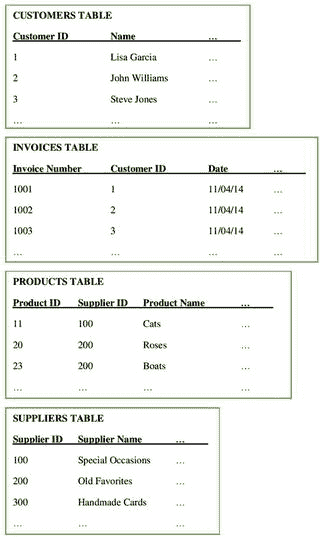
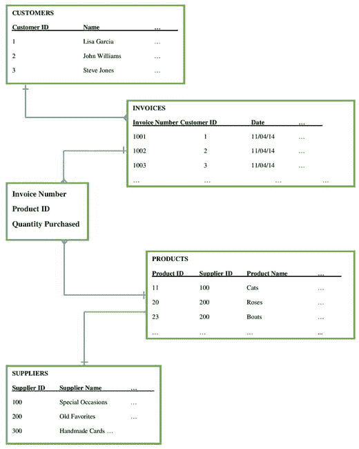
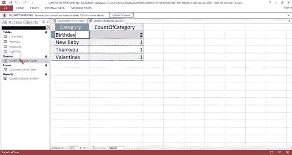
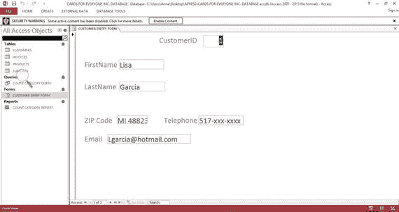
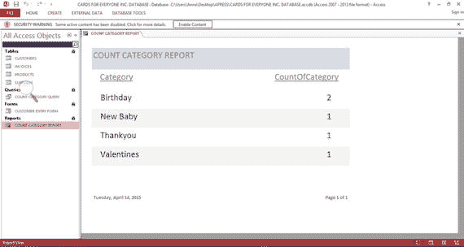

# 一、数据如何让您的小型企业受益

收集和分析数据对您的小型企业非常重要，因为它可以提高效率和盈利能力。数据可以记录一直在发生的事情——谁是你的客户，他们的人口统计是什么，他们买了什么。它可以让您发现趋势，例如，您的客户最喜欢的产品。数据中存在对您的业务非常重要的隐藏模式，例如一起销售的多组产品。数据可以提供一个可以搜索的档案。

当小企业的人发现他们的数据可以给他们带来巨大的变化时，他们通常会着迷于了解更多。事实是，对于小企业来说，已经收集了有关其运营的许多方面的数据。所有企业都收集收入和支出的详细信息，以满足税务要求。许多企业收集客户的姓名和地址，以便与他们联系。

这本书的目的是证明你正在收集的数据有远远超出其最初目的的好处。这本书将解释你的数据的价值，并告诉你如何充分利用它。这本书旨在介绍数据库和进一步参考的路标，如果这些是必要的。

首先，我假设您对文字处理和电子表格等软件包有基本的了解，但对数据库完全没有经验。此外，我意识到大多数小型企业并不只有一个人专门处理他们的数据，他们的大多数员工在公司中都有几个角色。我还假设您的小企业受到小预算的限制。

一段时间以来，您可能一直在无效地使用您的数据，而没有意识到它的全部潜力。如果是这样的话，你会很高兴在本书中看到改进的见解和数据分析。此外，如果您只是简单地存储数据，而不是在绝对必要的情况下使用它，您会惊喜地发现，学习处理和分析数据的技术的第一步也是最重要的一步就在您的掌握之中。

你的企业可能处于几个阶段中的一个阶段。你可能刚刚起步，渴望确保自己完全掌握最新技术。你可能已经经营了一段时间，并希望鼓励进一步发展。或者，你的企业可能正经历着具有挑战性的时期，正在寻求帮助向前发展。无论您的环境如何，您都会发现您的数据会对您企业的盈利能力产生重大影响。

## 什么是数据和数据库

以下部分描述了数据和电子表格的含义。通过使用电子表格作为起点来介绍数据库。

### 数据

数据可以采取多种形式，包括数字、文本、图像、超链接和声音。数据可以是关于任何主题的，也可以是关于多个主题的。

### 电子表格

如前所述，我假设您熟悉电子表格，一些常见的例子有 Microsoft Excel、LibreOffice Calc 和 Google Sheets。我将使用电子表格作为描述数据库的起点。

电子表格和数据库都用来存储和管理数据。表达这种区别的一个非常简单的方法是把电子表格看作一个大型复杂的可编程计算器，而把数据库看作一个高效的电子文件系统，它能使数据很快被查阅和分析。电子表格和数据库的主要区别在于它们存储和操作数据的方式，以及通常涉及的数据量。

电子表格将数据项(例如，数字、文本和超链接)存储在单元格中，多个单元格由行和列的系统来表示。一个单元格中的值可以通过公式定义的关系与其他单元格中的值相关联。

电子表格最严重的两个问题如下:

*   存储重复数据:相同的数据可能存储在多个电子表格中。如果您需要对数据进行更改，可能需要在存储数据的每个位置进行相同的更改，从而增加了出错的风险。
*   查找数据:在电子表格中查找一个数据项可能需要扫描许多列。

Hypothetical Example of a Small Business: Cards for Everyone Inc.

本书使用了三个案例来说明:一个小型工程公司，一个小型律师事务所和一个小型非营利组织。它们将在接下来的三章中介绍。此外，您还将读到一个假设的例子，描述了一家名为 Cards for Everyone Inc .的小型在线企业，该企业在线销售一系列卡片。

Cards for Everyone Inc .从一系列供应商处购买卡片，并在其网站上展示图片进行销售。网站是由一个承包商设计的，这样公司的员工就可以自己更新了。这家企业有三名员工:帕特、泽夫和利昂娜。

经理 Pat 有许多角色，包括购买供应品和营销业务。Pat 必须随着库存水平的变化随时更新网站。

Zeph 和 Leona 是处理订单的助理，他们在仓库里找到卡片，然后把它们放进信封里分发。当新货到达时，他们把它放在储藏室，并把详细情况传给帕特，以便她可以更新网站。

数据库解决了这两个问题。通过将数据分成表格(由行和列组成)来最小化重复数据项，这样，在理想情况下，每个数据项只存储一次。表之间定义的关系使得非常高效的数据检索成为可能:它们将数据链接在一起，使检索变得高效。第 6 章更详细地解释了电子表格和数据库的优缺点。

下一节给出了 Cards for Everyone Inc .使用的数据库示例。

### Cards for Everyone Inc .使用的数据库。

Cards for Everyone Inc .中给定客户的典型数据是他们的姓名、地址、电话号码和电子邮件地址。表 [1-1](#Tab1) 显示了包含三个客户数据的示例数据库表。每个客户在表中都被分配了一行，也称为记录。每条记录分为五列，每列代表记录的一部分(即客户 ID、姓名、邮政编码等)。).每个客户记录都有一个唯一的客户标识号，称为客户 ID。任何两个客户都不能有相同的客户 ID，从而避免重复。

表 1-1。

Basic Customer Database Table

<colgroup><col> <col> <col> <col> <col> <col></colgroup> 
| 客户 ID | 西方人名的第一个字 | 姓 | 邮政区码 | 电话 | 电子邮件 |
| --- | --- | --- | --- | --- | --- |
| one | elizabeth 的昵称 | 加西亚 | 米 48823 | 517-xxx-xxxx | lgarcia@hotmail . com |
| Two | 约翰 | 威廉姆斯 | 或者 97062 | 503-xxx-xxxx | Jwilliams@gmail.com |
| three | 史蒂夫(男子名) | 琼斯 | FL 33901 | 239-xxx-xxxx | Sjones@aol.com |

Cards for Everyone Inc .的其他数据库表包含产品、供应商和发票的详细信息。与客户一样，每个产品、每个供应商和每张发票在各自的表中都有一个唯一的标识号。为了帮助建立关系，标识号可以出现在多个表中。在这一点上，这些表格仅用于说明目的；第 7 章包含了更多关于它们的含义和构造的细节。表 [1-2](#Tab2) 显示了每个人卡公司的五种产品的表，产品 ID 在第 1 列。请注意，该表在第 2 列中有一列是供应商的标识号。

表 1-2。

Basic Product Database Table

<colgroup><col> <col> <col> <col> <col> <col></colgroup> 
| 产品 ID | 供应商 ID | 产品名称 | 种类 | 价格(美元) | 可用数量 |
| --- | --- | --- | --- | --- | --- |
| Eleven | One hundred | 猫 | 生日 | Two | five |
| Twenty | Two hundred | 玫瑰 | 谢谢你 | Three | eight |
| Twenty-three | Two hundred | 船 | 生日 | Two point five | Ten |
| forty-two | Three hundred | 心 | 情人 | Four point five | nine |
| Sixty-one | Three hundred | 兔子 | 新生婴儿 | Five | Eleven |

表 [1-3](#Tab3) 中给出了假设供应商的列表。

表 1-3。

Basic Suppliers Database Table

<colgroup><col> <col> <col> <col> <col></colgroup> 
| 供应商 ID | 供应商名称 | 邮政区码 | 电话 | 电子邮件 |
| --- | --- | --- | --- | --- |
| One hundred | 特殊场合 | IA 52241 | 319-xxx-xxxx | admin@specialoccasions.com |
| Two hundred | 旧的最爱 | CA 92591 | 503-xxx-xxxx | office@oldfavorites.com |
| Three hundred | 手工卡片 | FL 33351 | 954-xxx-xxxx | enquiries@handmadecards.com |

五个发票记录如表 [1-4](#Tab4) 所示，对应的客户 id 在第 2 列。

表 1-4。

Basic Invoices Database Table

<colgroup><col> <col> <col> <col></colgroup> 
| 发票号 | 客户 ID | 日期 | 金额(美元) |
| --- | --- | --- | --- |
| One thousand and one | one | 11/4/14 | ... |
| One thousand and two | Two | 11/4/14 | ... |
| One thousand and three | three | 11/4/14 | ... |
| One thousand and four | Two | 12/14/14 | ... |
| One thousand and five | one | 12/18/14 | ... |

目前，这四个表只不过是四个独立的数据电子表格，如图 [1-1](#Fig1) 所示。

图 1-1。

Separate Database Tables for Cards for Everyone Inc.

数据库使用每个表的唯一标识符将这些表及其数据链接在一起，如图 [1-2](#Fig2) 所示。如图 [1-2](#Fig2) 所示的数据库结构可以防止你不得不重复存储数据，冒着打字和不匹配错误的风险。数据库非常适合将数据集中在一起，分离主题，并实现高效的存储、更新和检索。

图 1-2。

Linked database tables for Cards for Everyone Inc.

可以通过三种主要方式查看最终的连接数据结构:

查询:这是一个关于数据库中数据的问题，来自一个或多个表或来自其他查询。查询可用于筛选数据、执行计算、汇总数据以及执行管理任务。例如，当订单到来时，知道库存中是否有足够的产品，以及如果没有，从哪里订购更多的产品将是有用的。这包括同时查询 Products 和 Suppliers 表。查询可能非常复杂，跨越许多表。图 [1-3](#Fig3) 显示了来自 Cards for Everyone Inc .的一个非常简单的数据库查询。该查询统计了表 [1-2](#Tab2) 中每个类别的卡片数量。

图 1-3。

Simple query for Cards for Everyone Inc.

表单:这些是纸质表单的电子版本，是可视化数据的有用手段。它们由数据库的一个或多个表或一个或多个查询组成，可用于输入、编辑或显示数据。表单是一种通过筛选搜索数据的有用方法。例如，表单可以用作发票，汇集客户和产品的详细信息，可以编辑和搜索(基于客户、购买的产品等)。)图 [1-4](#Fig4) 显示了一个非常简单的 Cards for Everyone Inc .表单，它提供了一种查看 Customers 表中数据的方法和一种输入数据的手段。与直接在表中输入数据相比，表单是一种更加用户友好的方式。

图 1-4。

Sample form for Cards for Everyone Inc.

报告:它们使文档能够从数据库表或查询中设计出来，可以很容易地以电子形式共享或在远离计算机的地方查看。报告可以用来总结哪些产品卖得好，哪些客户一直在买。图 [1-5](#Fig5) 显示了来自图 [1-3](#Fig3) 的查询数据的报告。

图 1-5。

Sample report for Cards for Everyone Inc.

图 [1-2](#Fig2) 中所示的关系可以通过使用主选项卡、查找公式、交叉引用的电子表格和 Visual Basic 编程在电子表格中处理。只要连接保持最新，这就可以工作。然而，在引入新产品的过程中，由于需要检查数据以确保一切都正确匹配，可能会出现问题。

Note

在本书中，我默认使用关系数据库，因为它们是最流行的。还有其他的数据库，如面向对象的、分层的、文件的和网络的。

## 数据可以为您的小型企业带来的好处

如果对您的小型企业没有最终的好处，那么花时间创建和填充数据库是没有意义的。下面几节讨论了使用数据库可以带来的各种好处。

### 提供对客户的深入了解

通过瞄准利基市场，小企业可以有效地与大公司竞争。数据有助于你更好地了解你的客户，更准确地识别这个利基市场。通过存储、分类和过滤关于你的客户的数据，有可能更多地了解最有利可图的客户。小企业非常适合与客户和供应商建立个人关系。有效利用您的数据可以为这些优势增加额外的权重。与你的客户保持密切联系不仅有助于你的企业留住他们，还可以帮助你为未来的营销建立类似客户的档案。

### 更深入地了解你的销售

通过收集关于你的产品和顾客的信息并把它们放入数据库，你可以看到哪些产品卖得好，哪些顾客会回来重复订购，哪些商品卖得不好，等等。手动完成这些功能非常耗时。

例如，了解你的企业拥有的前 50 名客户可以让你为这些人/企业创建特定的优惠，或者为这些忠诚的客户创建奖励计划。

### 有效的库存控制

只要浏览一下您的数据库，您就可以看到哪些商品几乎缺货，以及从哪里订购更多的商品。该数据库还可以在供应短缺时提醒您，这样您就可以在必需品告罄之前订购更多。

### 应对变化

一个组织良好的数据库可以帮助企业应对变化并做出决策。如果可以通过数据库中的链接表获得涵盖许多业务运营的数据，经理们就可以在做出决策之前对业务的当前状态有一个全面的了解。这一点对于小企业来说尤为重要，因为小企业通常比大企业更能灵活应对变化。这通常是因为小企业缺乏层级。

### 数据分析

数据库的查询和报告功能使它们成为分析数据和预测未来趋势的宝贵资源，因为它们可以将整个小型企业的数据汇集在一起。例如，一份报告可能显示，在电子邮件促销后，某些产品的销售额增加了，而在店内促销后，其他产品的销售额增加了。

### 提高数据的安全性

安全控制和授权可以在数据库中实现，方法是将敏感数据移动到一个单独的表中，该表具有自己的授权控制。当数据库用户登录时，他们只能访问他们有权查看的数据。例如，可能存在对诸如雇员工资等字段的限制，这些字段只能由直接处理工资单的人员查看。

## 为什么一些企业选择不使用他们的数据

小型企业忽视以上一节讨论的方式将他们的数据用于有益用途的原因是多种多样和复杂的。本节的目的是帮助你理解为什么你还没有找到利用你的数据的动机，而不是通过任何判断。这样做的目的也是鼓励你远离任何犹豫。

### 太贵了

许多小企业预算很少，认为数据库太贵。他们认为他们必须付钱给专家来创建数据库。然而，该软件本身并不昂贵，而且开源版本也很常见。例如，您正在使用的 MS Office 版本可能已经提供了 MS Access。而且一些开源软件套件有数据库包可用，比如 OpenOffice 和 LibreOffice。

还可能会担心需要新的昂贵的硬件。有许多选择，尤其是存储在云中的数据库，这需要最小的投资和对办公硬件的维护。云计算在[第 18 章](18.html)中讨论。

### 这太具有破坏性了

如果一家公司运行顺利，可能会有人担心实施数据库会破坏现状，导致业务下滑。可能有人担心会有一段时间无法接受任何订单。

从其他电子存储方式到数据库的物理迁移并不像你想象的那么困难。例如，通常有一种在数据库和电子表格之间传输数据的快速方法，并且大多数电子数据可以被快速处理到可以在电子表格上呈现的程度。

员工培训包含在第 20 章中。一个明智的开始方式是选择一个你的业务领域放入数据库，这样每个人都可以习惯新技术的本质。例如，您可以将有关客户联系信息的电子表格移动到数据库中的单个表中，并允许您的员工习惯于访问和操作它。一旦每个人都熟悉了第一个表格，您就可以将更多的电子表格导入到其他表格中。

值得注意的是，电子表格和数据库可以一起使用，直到所有员工都感到舒适。您必须确保只对其中一个文件进行更新，然后转移到另一个文件，这样更改就不会被覆盖。最明显的方法是对电子表格进行更改，然后定期将更改传输到数据库。这种传输可以通过几个简单的指令完成，称为更新查询，这在第 20 章中有所介绍。通过这种方式，电子表格保持正常运行，但是员工可以打开数据库来查看数据是如何存储的，并且可以熟悉如何访问它。

### 这将花费太多的时间

正如生活的方方面面一样，只有你能回答这个反复出现的问题:“事情要变得多糟，我才会做出改变？”如果您使用纸质文件，并且每次有客户联系您时都在办公室里惊慌失措地跑来跑去，搜索文件，那么提高您的效率是有意义的。您确实需要投入时间来学习数据库，但是如果您继续使用过时的系统，这最终会比您所浪费的时间要少。您可以按照上一段关于中断的描述，逐步实现数据库。本章前面已经解释了数据库的好处以及数据对小型企业的重要性。这个决定归结为投资和回报之间的平衡，由个体企业决定它在可能性光谱中的位置。

### 太难学，太难实施

如果您以前没有使用过数据库，那么学习数据库可能会令人望而生畏。但是，如果您已经在使用文字处理和电子表格，那么使用数据库并不像您想象的那么容易。这本书将帮助你设定一些小目标并稳步前进。

### 它在优先级列表中太低了

经营一家小型企业可能会让人不知所措，工作时间很长，几乎没有时间来保持条理性。在试图关注数据之前，您可能有一长串需要整理的事情。它可能看起来像一个长期目标，而且像任何长期目标一样，它很容易被更多的短期计划所掩盖。

为了改善你的业务运作，你可能倾向于关注更重要的事情，比如采取措施改善你管理办公室、保存记录、储存产品和用品的方式。只有到那时，你才会觉得自己有资格看你的数据。

但是，如果您要从数据开始，很可能您业务的许多其他部分都需要仔细组织，以使流程有效工作。这是因为您的数据经常涉及到您业务的所有领域，如您的客户、销售和库存。

例如，假设 Cards for Everyone Inc .在处理客户的电话订单方面效率不高。顾客打电话进来，细节被写在纸上，放在帕特桌子上的一个托盘里，直到她可以把信息交给泽夫和利昂娜处理。有了一个将产品与供应商联系起来的数据库，他们可以快速查看是否有足够的库存来满足订单，如果没有，联系谁来获得更多。这促使立即更新产品表(表 [1-2](#Tab2) )的可用数量字段，并开始为订单开具发票。一旦数据被输入数据库，纸质电话记录就可以被销毁，帕特办公桌上堆积的纸张瓶颈也就消除了。

### 未能预测业务增长的速度

当一个企业开始时，通常可以通过名字认出每个客户。简单的归档系统就足够了。然而，有一个点，客户不是立即可识别的:一般来说，当数量超过 50 个客户标记时，就会发生这种情况。在大多数情况下，小型企业希望尽可能保持其服务的个性化。

一个数据库可以让你保持你的服务个性化，即使客户数量增加。这是因为数据检索效率很高。例如，关于客户偏好的重要数据可以与他们的记录一起保存，以便当客户联系公司时可以快速访问这些数据。以 Cards for Everyone Inc .为例，一些客户可能对某些类型的卡片有偏好，例如猫或兔子，并且希望通过电子邮件让他们了解新设计的可用性。

### 未能理解数据对企业的价值

许多小型企业不了解他们的数据在利用利润方面的价值。您的小型企业拥有的数据有可能通过提供有用的信息、增加客户数量和改善客户体验来增加收入。管理人员可能乐于根据他们过去的经验、直觉或与市场上其他产品的比较来做出决策。使用数据库中的数据可以使这一过程从猜测走向精确的市场规划，从而使小企业更具竞争力，尤其是相对于更了解数据库的大企业而言。

在某些情况下，一个小企业没有数据库也可以运行得很好。例如，如果你开了一家咖啡馆，对每天新鲜购买的固定商品有固定的需求，那么你很可能是通过直接观察来经营的。如果你发现盐和胡椒不够了，你可以很容易地开车去商店买更多。保存顾客的记录并不简单。然而，你可以记录每天的销售情况、天气情况以及你所在的城镇正在发生的事件，然后利用这些信息来提高你的销售额、提高利润率以及推出新产品。当你面临竞争时，这一信息尤其重要，比如说，街对面新开了一家咖啡馆。对你的数据视而不见从来都不是一个好主意。

## 个案研究

三个案例研究将在接下来的三章中介绍，并在整本书中反复出现:第二章第一章中的一个小型工程公司，第三章第三章中的一个小型律师事务所，以及第四章第五章中的一个小型非营利组织。每个组织的历史都有详细的描述，以便将每个业务的当前位置放入上下文中。讨论了每个案例研究的业务目标。业务目标是成功的数据库设计和使用的基础，这个问题将在第 5 章中讨论。