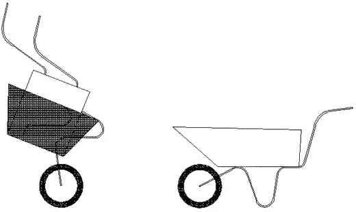

# 二、小型工程公司：案例研究

本章介绍了三个案例研究中的第一个，作为整本书的范例。许多读者只会认同其中的一个，选择最适合你的情况或经历的案例研究是完全合理的。概括一下，[第 3 章](03.html)涵盖了一个小型律师事务所，[第 4 章](04.html)涵盖了一个小型非营利组织。

本章介绍了一家位于东海岸的小型工程公司。目前，该公司生产和销售同一产品的两个版本，并正在寻求扩张。电子表格目前用于存储数据。

## 智能手推车公司:背景

Smart 独轮车公司向居住空间有限的专业人士出售折叠式独轮车，比如那些住在带屋顶花园的城市公寓里的人和那些住在公寓里的人。这种手推车是由该公司的首席执行官霍华德设计的，因此框架、主容器和轮子都可以尽可能折叠起来，并可以挂在钉子上。它们由铝制成，以保持轻便。图 [2-1](#Fig1) 显示了折叠和展开状态下的手推车。

图 2-1。

Foldup wheelbarrow, folded and unfolded

手推车的折叠机构是通过多个分开的边缘和多个铰接的边缘实现的，这些边缘被称为分裂边缘。

Smart 独轮车公司位于康涅狄格州，在一个技术中心租了一个单元。该单位分为一个小办公室，一条生产线，和一个储藏室。该公司成立于 2012 年，开始销售一种尺寸的折叠手推车，即“标准”尺寸，有四种颜色:红色、绿色、黑色和白色。

通过口口相传，很明显顾客们把手推车用于装饰和园艺目的。人们还发现，一些高管客户使用手推车运送食物和葡萄酒等物品。这导致了另外两种颜色，金色和银色。

来自客户调查的反馈表明，存在对用于装饰的小型手推车的需求，例如用于盛放植物。这种产品不需要折叠的能力。

该信息的结果是总共开发了十二种产品，六种标准尺寸的折叠式手推车和六种小型非折叠式手推车。标准尺寸的红色、绿色、黑色或白色版本售价 120 美元，同等的小型版本售价 70 美元。标准的金或银手推车价格为 125 美元，小型金或银手推车价格为 75 美元。金色或银色的手推车稍微贵一些，因为油漆比其他颜色的要贵，必须从专业公司订购。表 [2-1](#Tab1) 总结了 Smart 独轮车公司提供的独轮车系列。

表 2-1。

Products Sold by Smart Wheelbarrows Inc.

<colgroup><col> <col> <col></colgroup> 
| 产品名称 | 颜色 | 价格(美元) |
| --- | --- | --- |
| 标准手推车 | 红色、绿色、黑色或白色 | One hundred and twenty |
| 标准手推车 | 银还是金 | One hundred and twenty-five |
| 小手推车 | 红色、绿色、黑色和白色 | Seventy |
| 小手推车 | 银和金 | Seventy-five |

智能手推车公司通过其他业务分销其产品，如花店、园艺中心和亚马逊等在线零售商。它还通过网站(由承包商设计)和电话直接接受消费者的订单。

手推车一部分是在公司的场地上制造的，一部分是由承包商制造的。主集装箱的制造外包给一家拥有必要设备的当地公司。框架的制造和喷漆在内部进行，因为 Howard 找不到人来制作框架，所以他购买了必要的设备并雇佣了员工，如下一节所述。

## 智能手推车公司的员工。

智能手推车公司由霍华德经营，他有八名员工。Howard 是一名经验丰富的机械工程师，他曾在一家大型工程公司工作，但由于缺乏实现自己想法的自由而感到沮丧。Howard 邀请他以前的同事 Sanjiv(来自同一家工程公司)加入他的团队，担任技术生产经理。

霍华德和桑基夫雇佣了约翰和陈两个人在办公室工作。约翰负责接受订单并确保订单正确发出。陈负责记账和发放工资。

John 和 Chen 负责更新网站(网站设计为易于更新)和接听电话。他们在生病和休假期间互相掩护，作为一个团队工作。

霍华德在公司身兼数职。他做了大量的网络和营销工作。他还亲自或远程管理行政办公室。当霍华德在城里的时候，他每周都要在办公室门口探头探脑几次，以确保一切顺利进行。然而，霍华德大部分时间都不在城里，他会通过云中的加密电子表格定期在线查看订单。他还在网上查看银行账户(检查企业的现金流)，并不时关注损益账户。

Howard 和 Sanjiv 招募了四个人在由 Sanjiv 管理的生产线上工作，具体如下:

*   海伦将铝管送到一台机器上，这台机器将铝管弯曲成手推车框架的形状。
*   米格尔负责框架和锁紧铰链的焊接。
*   他用铰链悬挂管子，并在一个特殊的隔间里操作喷漆。每个部分都涂了两层油漆。
*   Valentina 负责所有部件，组装独轮车(折叠成标准尺寸)，并将其装入一个准备装运的箱子中。其中一个组件是一个 U 形夹，它通过制造商放在那里的孔用螺栓固定在容器上，用于连接框架。她需要检查所有部件是否都已添加，这是通过称量每个箱子以检查其重量是否符合预期来完成的。一个小的差异可能意味着遗漏了一些小东西，如紧固件。

库房经理 Steve 负责供应品的入库和成品的出库。

Sanjiv 管理的公司之间有很大的灵活性，因此可以涵盖病假和假期。Sanjiv 可以执行所有工作，因此能够覆盖。他还确保所有四条生产线的操作人员能够完成彼此的工作。这给他们的工作带来了更多的兴趣，提高了劳动力的技能，并在员工短缺时提供了更好的掩护。表 [2-2](#Tab2) 总结了 Smart 独轮车公司雇佣的员工。

表 2-2。

Staff Working at Smart Wheelbarrows Inc.

<colgroup><col> <col></colgroup> 
| 名字 | 位置 |
| --- | --- |
| 霍华德 | 首席执行官 |
| 三纪夫 | 技术生产经理 |
| 约翰 | 命令 |
| 陈 | 簿记和工资单 |
| 海伦 | 第一条生产线运行:制造框架 |
| 米格尔 | 第二条生产线运行:焊接 |
| 山姆 | 第三条生产线运行:喷漆 |
| 瓦伦蒂娜（f.） | 第四条生产线操作:包装 |
| 史蒂夫(男子名) | 储藏室经理 |

## 智能手推车公司存储的数据。

数据存储在电子表格中。就数据而言，Smart 独轮车公司和 Cards for Everyone 公司的主要区别在于，Smart 独轮车公司购买材料和组件并制造产品，而 Cards for Everyone 公司购买现成的产品并不经过任何进一步加工就出售。智能手推车公司有六个数据电子表格。下表总结了电子表格:

*   客户
*   发票
*   生产手推车所用的材料
*   材料供应商
*   用于标准手推车的材料(包括数量)
*   用于小手推车的材料(包括数量)

客户电子表格如表 [2-3](#Tab3) 所示，客户外发发票电子表格如表 [2-4](#Tab4) 所示。注意这两个电子表格中客户的姓名和邮政编码是如何重复的。

表 2-4。

Invoices for Smart Wheelbarrows Inc.

<colgroup><col> <col> <col> <col></colgroup> 
| 名字 | 邮政区码 | 日期 | 金额(美元) |
| --- | --- | --- | --- |
| 光明花店 | 纽约州 11375 | … | … |
| 希拉里·史密斯 | 马 02108 | … | … |
| 布利斯花园中心 | RI 02886 | … | … |

表 2-3。

Basic Customer Spreadsheet for Smart Wheelbarrows Inc.

<colgroup><col> <col> <col> <col> <col></colgroup> 
| 名字 | 邮政区码 | 电话 | 电子邮件 | 种类 |
| --- | --- | --- | --- | --- |
| 光明花店 | 纽约州 11375 | … | … | 商业 |
| 希拉里·史密斯 | 马 02108 | … | … | 商业 |
| 布利斯花园中心 | RI 02886 | … | … | 消费者 |

此外，Smart 独轮车公司有一份独轮车部件的材料电子表格(如表 [2-5](#Tab5) 所示)和一份材料供应商的供应商电子表格(如表 [2-6](#Tab6) 所示)。还有一份供应商发票的电子表格(未显示，但类似于表 [2-4](#Tab4) 中用于客户发票的表格)。没有产品的电子表格，因为列表很短并且不会经常改变。

表 2-6。

Basic Suppliers Spreadsheet for Smart Wheelbarrows Inc.

<colgroup><col> <col> <col> <col></colgroup> 
| 供应商名称 | 邮政区码 | 电话 | 电子邮件 |
| --- | --- | --- | --- |
| 铝盒 | … | … | … |
| 工程用品 | … | … | … |
| 顶级材料 | … | … | … |
| 优质油漆 | … | … | … |
| 豪华油漆 | … | … | … |

表 2-5。

Materials for Smart Wheelbarrows Inc.

<colgroup><col> <col> <col> <col> <col> <col></colgroup> 
| 软件零件号 | 供应商零件号 | 供应商名称 | 产品名称 | 价格(美元) | 可用数量 |
| --- | --- | --- | --- | --- | --- |
| OS01 | 是 39 号 | 工程用品 | 铰链 | … | … |
| OS02 | 是 24 个 | 工程用品 | 车轮 | … | … |
| OS03 | 是 67 | 工程用品 | 处理 | … | … |
| oso4 | 是 09 年 | 工程用品 | 扣件 | … | … |
| OS05 | AB01 | 铝盒 | 容器 | … | … |
| OS06 | TM01 | 顶级材料 | 铝管 | … | … |
| OS07-1 | QP04 | 优质油漆 | 红色油漆 | … | … |
| OS07-2 | QP11 | 优质油漆 | 绿色油漆 | … | … |
| OS07-3 | QP18 | 优质油漆 | 黑漆 | … | … |
| OS07-4 | pp19 | 优质油漆 | 白漆 | … | … |
| OS07-5 | LP25 | 豪华油漆 | 金色油漆 | … | … |
| OS07-6 | LP26 | 豪华油漆 | 铝粉漆 | … | … |
| OS08 | 23 岁了 | 工程用品 | 小轮子 | … | … |
| OS09 | 是 68 年 | 工程用品 | 小把手 | … | … |
| OS10 | 八点了 | 工程用品 | 小紧固件 | … | … |
| OS11 | LP02 | 铝盒 | 小容器 | … | … |
| OS12 | 69 年了 | 工程用品 | u 形夹 | … | … |

手推车的零件编号如下:

*   对于内部制造的零件，编号以 SW 开头，代表智能手推车。
*   对于所有其他零件，外部供应商的编号以 OS 开始，因此这些零件的编号系统与表 [2-5](#Tab5) 第二列中所示的每个零件的供应商使用的编号一致。
*   油漆都是 OS07，根据颜色有后缀。

表 [2-5](#Tab5) 中材料电子表格的第三列包含相应的供应商名称。通过在表 [2-6](#Tab6) 的供应商电子表格中找到该供应商对应的行，可以获得供应商的详细信息。

Smart 独轮车公司对其每种产品都有一份材料清单(BOM)。这是原材料和子组件的清单；制造每种产品所需的零件和数量。表 [2-7](#Tab7) 显示标准独轮车的 BOM，表 [2-8](#Tab8) 显示小型独轮车的 BOM。

表 2-8。

Bill of Materials for the Small Wheelbarrow

<colgroup><col> <col> <col></colgroup> 
| 零件号码 | 零件名称 | 量 |
| --- | --- | --- |
| SW03 | RHS 框架 | one |
| SW04 | LHS 框架 | one |
| OS08 | 小轮子 | one |
| OS09 | 小把手 | Two |
| OS10 | 小型紧固件 | four |
| OS11 | 小容器 | one |
| OS07 | 颜料 | 升 |

表 2-7。

Bill of Materials for the Standard Wheelbarrow

<colgroup><col> <col> <col></colgroup> 
| 零件号码 | 零件名称 | 量 |
| --- | --- | --- |
| SW01 | RHS 框架 | one |
| SW02 | LHS 框架 | Two |
| OS01 | 关键 | four |
| OS02 | 车轮 | one |
| OS03 | 处理 | Two |
| oso4 | 扣件 | four |
| OS05 | 主容器 | one |
| OS07 | 颜料 | 半升 |
| OS12 | u 形夹 | four |

请注意，两个 BOM 中都没有 OS06(铝管)。这是因为铝管是内部制造的手推车框架。还需要四个 BOMs 标准独轮车的右侧框架和左侧框架各一个，小型独轮车的右侧框架和左侧框架各一个。这里没有显示这些。(注意，小手推车的两个框架被设计成通过轮子相互嵌入。)

请注意，小手推车没有铰链，因为它不会折叠。

## 数据库

霍华德在旅途中遇到了他的大学老朋友安妮特。安妮特是一名数据分析师，她问霍华德智能手推车公司是否在使用数据库。Howard 从未考虑过数据库，此外，他觉得他们使用的电子表格已经足够了。安妮特认为，数据库可以帮助霍华德更好地了解他的客户群，并吸引新客户。客户数据库对于推动有效的营销活动也至关重要。

数据库还可以加强 Smart 独轮车公司的库存控制。通过将每个 BOM 与材料和产品电子表格相链接，可以查看库存中是否有足够的独轮车来满足订单，是否需要制造更多的独轮车，如果需要，是否有足够的库存来满足订单。目前，当订单进来时，约翰倾向于给储藏室的史蒂夫打电话，直接问这些问题，或者如果史蒂夫不在，他会亲自去储藏室检查供应品。这不是对时间的有效利用。

霍华德受到讨论的鼓舞，同意阅读安妮特建议的一些在线资料，然后回复她。

智能手推车公司数据库的开发将在以后的章节中介绍。

## 研究思路

许多人问霍华德，手推车是否可以用回收的聚合物产品(即回收的家用塑料)制成。他一直在思考这个问题，并与可能有帮助的人交谈。使用回收材料存在一些挑战，霍华德希望有时间来调查。两个主要问题如下:

*   框架的设计可能会更加困难。为了给独轮车提供足够的强度，可能需要大量的回收材料，从而使得框架笨重且不美观。
*   还有一个问题是，回收的聚合物产品可能具有较差的光洁度，因为它们不是非常光滑。

霍华德需要考虑将新的生产流程整合到他的业务中。这个框架可能需要注射成型，也就是说，将熔化的塑料注入模具。他希望成型是简单的，一次成型，也就是所谓的“一次成型”

霍华德想为这项研究申请资助。确定资金来源将涉及寻找许多潜在的捐助者。此外，一旦研究开始，通过快速查找研究论文来跟上最新发表的工作对 Howard 来说是很重要的。第 19 章涵盖了在线数据库的有效搜索。

## 摘要

一家小型工程企业 Smart 独轮车公司生产小型独轮车。该企业将其数据存储在许多电子表格中，涵盖了客户、发票、产品和供应商。此外，还有描述所用材料的电子表格和显示每个产品如何制造的电子表格(称为材料清单)。公司的雇员也有一个电子表格。在接下来的许多章节中，Smart 手推车公司将被用作案例研究，展示将电子表格转换为数据库所需的各个阶段。