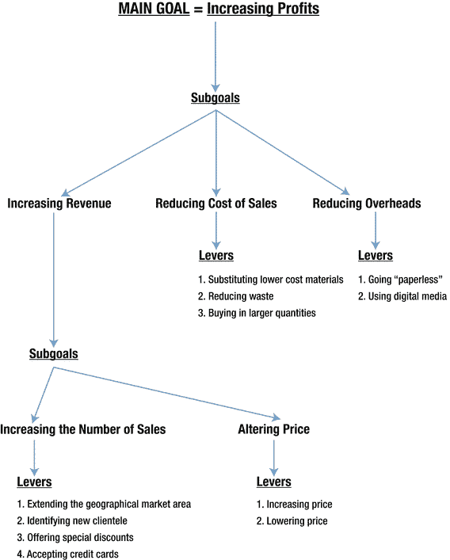

# 五、根据小型企业的目标调整数据库

为了让小型企业从数据库中获得最大收益，在设计数据库时必须牢记企业的目标、指标和杠杆。总的来说，目标旨在使业务朝着给定的方向发展，杠杆是可以改变的变量，目的是实现这样的发展，而指标衡量目标和杠杆的进展。本章详细解释了这三个组件。

有用的数据库是由业务目标形成的，大部分数据由指标组成。如果数据库设计得当，它生成的查询和报告将直接反馈到企业的决策过程中，使企业能够充分了解信息。(查询和报告在第 1 章的[中介绍，并分别在](01.html)[第 12 章](12.html)和[第 14 章](14.html)中详细解释。)

目标、杠杆和指标很少是一成不变的，尤其是在充满挑战的经济时期。因此，为了使数据库具有较长的寿命，它需要能够快速响应新的需求。这可能意味着向一个表中添加更多的表或更多的列。数据库设计的技术方面包含在第 7 章中，改变现有数据库的方法包含在第 15 章的[中。](15.html)

以下章节展示了为 Smart 独轮车公司案例研究设定目标、杠杆和指标的示例，该案例研究在第 2 章的[中介绍。你还会读到 Jennings-Havard 律师事务所和 Connecting South Side 案例研究的简短例子，分别在](02.html)[第 3 章](03.html)和[第 4 章](04.html)中介绍。每个例子都显示了使用数据库来跟踪指标和提供关于杠杆和目标的数据的重要性。

如果所有的数据库分析都是由业务目标驱动的，那么这将是高度限制性的。对于小企业来说，尝试和惊喜的空间是有益的。数据库通常包含隐藏的信息，这些信息无法提前预测，但可能会很有用。例如，Smart 独轮车公司可能会发现，其超过一半的独轮车订单是在周六上午下的。这是一个对库存控制有用的事实，但不一定能提前预测。数据分析方法在第 13 章中讨论。

此外，数据库结构的本质使一个数据表能够与其他表一起操作，而不管您的业务的目标、杠杆和指标如何。例如，这允许通过显示库存中是否有足够的独轮车来满足订单、是否需要制造更多的独轮车，以及如果需要，是否有库存来这样做，来加强智能独轮车公司的库存控制。

话虽如此，使用目标、杠杆和度量是数据库设计的逻辑起点，并且很有可能产生有用的数据库。

## 设定目标

小企业的目标应该受到其使命陈述的影响，因为使命陈述描述了该组织成立的原因及其背后的原则。例如，谷歌 2013 年的使命宣言是:

> "Google's mission is to organize information all over the world and make it universally accessible and useful."

Ama zon 公司过去 18 年的使命是:

> "Our vision is to become the most customer-centered company on the planet; Build a place where people can find and discover anything they might want to buy online. "

目标的设定是为了在使命宣言设定的背景下推动企业朝着某个方向发展。目标应该是对期望结果的陈述；它们以动词开头，但没有给出如何实现目标的信息。例子包括“增加利润”、“扩大客户群”和“削减成本”

目标通常分为长期目标和短期目标，长期目标通常会持续几年。短期目标是为了帮助公司实现长期目标。设定目标和实现目标是一个复杂的过程，因为许多外部因素可能会干扰，如从银行获得贷款、税收和利率变化、成本增加(如能源和燃料)以及技能短缺。此外，成长型企业会有多个目标，这些目标可能会发生冲突。举个非常简单的例子，如果一家公司只有两个目标——“保持高质量的产品”和“利润最大化”——它就必须在保持商品质量的约束下实现利润最大化。因此，它可以通过与供应商谈判更低的价格来增加利润，但它可能无法使用更便宜、质量更差的材料来生产产品。

## 识别杠杆

杠杆改变了目标的实现方式。通过确定一个可以“拉动”的杠杆，就有可能对一个相关的目标做出改进。杠杆是必要的，因为在考虑杠杆之前设定的目标是一个过程的结果，没有杠杆就不能改变。杠杆的例子包括“利用互补商品的销售来鼓励更大规模的客户交易”，以及“通过谈判降低供应价格来提高利润率”。

## 设计指标

猜测杠杆和目标进展如何是没有意义的。两者都需要是可测量的，以确保业务朝着其目标前进，并评估每个杠杆的影响有多大。这样的测量，被称为度量，允许杠杆被控制并且有希望被改进。

本节涵盖了指标的设计。指标和数据库紧密相连，因为作为指标结果收集的数据必须进行存储和分析。数据库是实现这一目的的理想工具。然后在数据库中生成查询和报告，这可以允许做出关于业务进展的决策。

大多数小企业使用一些指标，例如衡量利润和损失的水平。然而，除了绝对必要之外，许多人经常根据过去的经验、直觉或通过查看市场上的其他产品来操作(如第 1 章中所解释的)。

与销售相关的指标示例如下:

*   给定时间段内新客户端的数量
*   销售收入

制定指标时，以下因素很重要:

*   简单性:度量标准应该易于使用和解释。
*   数量:为了避免混乱，在给定的时间应该实现少量的度量。
*   质量:应该有可能为所有指标收集准确和完整的数据。
*   收集方法:度量不应该干扰操作或产生不合理的开销。
*   对员工的影响:度量标准不应该导致员工违背企业的最佳利益。
*   适当的尺度:应该设置度量来揭示适当大小的变化，以便采取行动来改进过程。
*   响应性:度量必须快速提供反馈，以便问题可以尽快被识别。

在度量标准确定之后，就可以建立一个“基线”。基线使用度量标准来衡量性能的当前状态，并可用于与未来状态进行比较。

虽然这看起来很明显，但是不要被指标冲昏头脑是很重要的。不是所有的东西都可以直接测量。在某种程度上依靠直觉可能会有所帮助。例如，你可能觉得你的客户会更喜欢一个更智能、更舒适的等候区，而度量标准不太可能会告诉你这一点。度量标准最好与常识和直觉一起使用，而不是作为任何一个的替代品。

## 案例研究:概述

下面将介绍在[第 2 章](02.html)–[第 4 章](04.html)中介绍的案例研究中目标、杠杆和指标的使用。每个案例研究部分都提出了使命陈述，它决定了组织所做一切的动机。然后，您将了解如何为 Smart 手推车公司和 Jennings-Havard 法律事务所设定目标。对于“连接南方”案例研究，使命和目标将反映资助该组织的赠款的目的和目标。对于每个组织，一个单一的目标被用来展示杠杆和指标的选择。

## 案例研究:智能手推车公司。

将为 Smart 独轮车公司确定使命陈述和潜在目标。我们将为其中一个目标提出潜在的杠杆，并建议可能的衡量标准。

### 使命陈述和目标

Smart 独轮车公司的使命是:

> "Our goal is to become a customer-centered company, producing and selling high-quality and innovative wheelbarrows."

Smart 独轮车公司根据其使命陈述制定了一系列目标:

*   生产高质量，重量轻，折叠手推车和装饰手推车
*   确保员工对顾客友好并乐于助人
*   无条件保证产品，随时接受任何理由的退货
*   为员工提供一个充满机会的友好的工作环境
*   通过给予所有者和员工提出新想法的自由来促进增长
*   增加利润

下一节将详细考虑“增加利润”目标的杠杆选择。为每个级别考虑合适的度量:这些度量代表到潜在数据库的链接，因为以数据库的形式存储数据以执行测量是明智的。

### 增加利润

确定增加利润的合适杠杆的逻辑方法是确定构成利润的要素。

利润计算如下:

利润=收入-销售成本-管理费用

以下是对这些组件的描述:

*   收入是 Smart 独轮车公司的收入。在本例中，我们将假设这仅与其手推车的销售相关。在一个更复杂的例子中，其他形式的收入可能包括投资利息、服务费等。
*   销售成本是生产手推车的成本。这包括使用的材料和直接人工成本。
*   间接费用是企业的运行成本，包括租金、燃料和文具。

我们将依次讨论这些组件，并选择合适的杠杆。图 [5-1](#Fig1) 总结了增加利润的目标，以下章节将定期引用。增加利润的主要目标显示在图 [5-1](#Fig1) 的顶部，下面列出了增加收入、降低销售成本和减少管理费用的子目标。

图 5-1。

Subgoals and levers for the goal of Increasing Profits for Smart Wheelbarrows Inc.

### 增加收入

考虑到收入在创造利润中的作用，增加利润的一个方法是关注增加收入的子目标。对于每种类型的手推车，收入计算如下:

收入=手推车销售额 x 手推车零售价格

该公式为增加收入提供了两个潜在的子目标，如图 [5-1](#Fig1) 所示，它们可以一起使用，也可以单独使用:

*   增加销售数量
*   改变手推车的价格

### 增加销售数量

下面列出了可用于实现增加销售额的子目标、增加收入的子目标以及最终实现增加利润的主要目标的杠杆示例:

*   扩大地理市场区域:目前，Smart 手推车公司主要销售到美国东海岸。广告可以推广到全国。以下指标可用于衡量该杠杆在一段时间内的影响。

*   各州的销售数量
*   通过向各州销售获得的收入
*   基于现有市场的销售实现目标

*   确定新的客户群:客户群可以扩大到儿童。这种手推车类似于现有的小型手推车，但不需要昂贵的油漆。市场营销将针对玩具店。可以使用以下指标:

*   特定时期内儿童手推车的销售情况
*   儿童手推车销售收入占总收入的比例
*   儿童手推车的销售和收入与目标的比较

*   提供特别折扣:给购买一辆以上手推车的商家打折可能很有吸引力。私人和商业买家可能会对及时折扣感兴趣。可以使用以下指标:

*   给定时间段内打折销售的数量
*   获得的收入
*   达到的目标

*   接受信用卡:信用卡对客户很有吸引力，因为它们可以提供更大的便利和现金流。信用卡公司向零售商收取费用，但这些费用通常会被销售额的增长抵消。可以使用以下指标:

*   使用信用卡的销售数量
*   通过使用信用卡销售获得的收入
*   基于现有市场达到的目标

### 价格变动

影响收入的第二个子目标是价格，如图 [5-1](#Fig1) 所示。手推车的价格可以提高或降低。更高的价格意味着更高的销售收入，但销售总数可能会下降。如果价格降低，情况正好相反。

顾客出于不同的原因购买手推车；有些人购买是因为它们易于存放，有些人购买是因为他们想给朋友留下深刻印象。前一类人会欢迎降价，但对后一类人降价没有意义，因为他们购买奢侈品的信念可能会减弱。一般来说，客户很少对轻微的价格上涨做出反应，并且经常忽视它们。

衡量价格变化的一个合适的方法是，在相同的时间段内，将价格上涨后的销售数量与价格上涨前的销售数量进行比较。

### 降低销售成本

增加利润的第二个子目标是降低销售成本，如图 [5-1](#Fig1) 所示。用于制造手推车的材料成本是该组织最大的销售成本之一。以下三个杠杆旨在降低材料成本，同时不影响手推车的质量。

*   尽可能用成本较低的材料替代:比铝更便宜、更重的低碳钢可以用于“静态”手推车，因为它们不需要悬挂起来。所有的手推车都被涂上了油漆，因此使用低碳钢可能带来的生锈问题得到了缓解。相关指标:

*   在给定时间内，由于材料成本降低而节省的收入
*   由于材料成本的降低而导致销售成本的降低

*   减少浪费:铝或软钢的成本很高，因此在生产过程中丢弃的数量很重要，特别是随着时间的积累。直接从制造商处购买固定长度的管子。也许可以协商更短的长度，但仍能满足所需的数量，而且价格更低。相关指标:

*   在给定时间内，由于减少浪费而节省的收入
*   由于材料成本的降低而导致销售成本的降低

*   大量购买:在大量购买材料时，有可能利用折扣。这通常值得与供应商协商。相关指标可以是:

*   在一定时期内通过大量购买而节省下来的收入
*   由于大量购买供应品，销售成本降低

### 减少开销

利润等式的第三个组成部分是管理费用，和销售成本一样，为了促进利润的增长，管理费用需要下降。降低管理费用构成了利润增加的第三个子目标，如图 [5-1](#Fig1) 所示。以下三个杠杆有可能降低 Smart 独轮车公司的管理费用:

*   通过“无纸化”降低办公费用:Smart 独轮车公司可以避免打印，除非绝对必要。在可能的情况下，他们可以制作并发送电子发票和账单，并将所有重要的文书工作保存在电脑或云中。相关指标可能是:
    *   给定时间内节省的办公用品费用
    *   由于削减办公费用而节省的间接费用比例
    *   由于削减办公费用而节省的办公费用比例

*   通过使用数字媒体减少广告支出:Smart 独轮车公司可以免费开通商业脸书和 Twitter 账户，并削减更传统形式的广告支出。相关指标可能是:
    *   引入数字媒体后节省的广告费用
    *   由于使用数字广告而节省的开销比例
    *   由于使用数字广告而节省的广告比例

### 存储适当的数据以涵盖指标

为了展示目标、杠杆和指标之间的联系，下表给出了一个可以为上一节介绍的指标捕获和存储的数据示例。它并不打算是全面的。在第 7 章的[中，您将了解到不建议使用派生数据来设计数据库——例如，使用包含总销售额的列。考虑到这一点，表](07.html) [5-1](#Tab1) 不包括衍生数据。

表 5-1。

Sample Data Corresponding to the Metrics Used by Smart Wheelbarrows Inc.

<colgroup><col> <col></colgroup> 
| 附属目标 | 公制的 |
| --- | --- |
| 收入 | 每个交易日期每个产品的销售数量每个产品的交易价格涉及折扣的客户销售地址涉及信用卡的销售 |
| 销售成本 | 根据每种类型、长度和材料供应商购买的数量根据每种类型、长度和材料供应商支付的每笔交易价格的日期 |
| 开销 | 每种办公文具的购买数量，每笔交易的日期，每种办公文具的价格，每种广告投资的成本，尽可能细分到每笔广告投资的日期 |

## 案例研究:詹宁斯-哈佛律师事务所

以下部分确定了 Jennings-Havard 律师事务所的潜在目标。这些部分还将建议其中一个目标的潜在杠杆，并提出合适的衡量标准。

### 使命陈述和目标

Jennings-Havard 律师事务所的使命是:

> "Jennings-Havard Law Firm aims to provide affordable, high-quality, customer-centered estate planning, trust management, probate and long-term care planning services for all kinds of people."

根据本使命声明，詹宁斯-哈佛律师事务所制定了以下目标:

*   保持低成本，使小时费率具有竞争力
*   始终关注、尊重和耐心地对待客户
*   提高客户保持率
*   吸引新客户
*   鼓励所有合作伙伴和员工提出新想法
*   增加增长
*   提供一个愉快且高效的工作环境

下一节考虑“提高客户保持率”目标的杠杆选择。

### 提高客户保持率

留住客户的成本远低于获得客户的成本。因此，留住客户是詹宁斯-曼宁律师事务所的一个重要目标。可以用来提高客户保持率的三个杠杆的例子如下:

*   最大化客户互动:公司与客户的互动越多，他们离开的可能性就越小。例如，可以鼓励客户注册公司的时事通讯，在公司的博客上发表评论，并在 Twitter 上关注公司。指标:接收时事通讯/在博客上发表评论/在 Twitter 上关注的新客户数量
*   确保客户对他们接受的服务满意:可以要求客户定期反馈。在最糟糕的情况下，公司可以确保员工明白，如果他们得知客户要离开，该怎么做。例如，他们可以安排一次会议来讨论哪里出了问题，并从账单中扣除一小部分。度量:提供反馈的客户比例，好的和坏的
*   随着时间的推移，满足客户的需求:客户通常会停止使用某项服务，因为他们认为自己不再需要它了。了解客户需求如何发展并向他们推销服务是很重要的。例如，遗产规划可能会转移到对长期护理规划的需求。指标:回头客数量，现有客户推荐的客户数量

## 案例研究:连接南区

第 4 章描述了一个由赠款资助的非营利组织“连接南边”的案例研究。奖助金上所述的目标可视为其使命陈述，其目标构成其目标:

目标:改善生活在芝加哥南部来自不同背景的社会孤立人群的生活。

目标:

To make contact with a minimum of 1,000 socially isolated people living on Chicago’s South Side, roughly two per day during the work week, over the two-year period.   To take enquiries from those of diverse age, ethnic origin, neighborhood, and health.   To publicize the service in all areas of the community.   To link the enquirers to organizations that can help them move away from social isolation.   To identify gaps in services.  

以下杠杆可用于目标 1:

*   出席相关的社区活动
*   鼓励从其他非营利组织推荐
*   在公共场所做广告，如图书馆、教堂、当地商店和咖啡店

指标:连接南区的查询数量。如果这等于或大于 Connecting South Side 已经运行的工作日数的两倍，则该组织符合目标。

Note

之前的指标(查询次数)可能会鼓励员工做出违背组织最佳利益的行为。查询的数量并不反映每个查询所付出的努力，可能会无意中鼓励工作人员匆忙完成查询。为了缓解这个问题，组织可能还会收集涵盖每个查询的呼叫数量的指标。

## 摘要

对于有用的数据库，它需要与业务目标相关联。这意味着直接从目标开始开发数据库的内容。目标受到杠杆的影响，杠杆被“拉动”以在给定的方向上产生变化。指标衡量目标和杠杆的变化。为指标收集的数据存储在数据库中。

## 进一步阅读

《营销度量:衡量营销绩效的权威指南》,保罗·w·法里斯、尼尔·t·本德尔、菲利普·e·普费菲和大卫·j·赖伯斯坦。皮尔逊 FT 出版社；第二版，2010 年，ISBN-13: 978-0137058297。

《衡量营销:每个营销人员都需要的 110+个关键指标》,约翰·A·戴维斯著。约翰·威利父子公司；第二版，2013，ISBN-13: 978-1118153741。