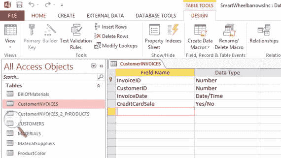
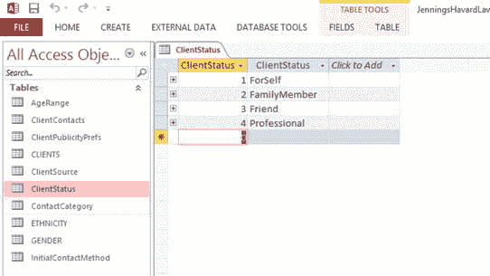
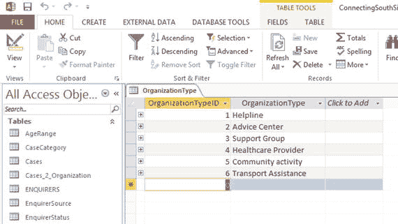

# 七、设计您的小型企业数据库

一个设计良好的数据库将易于使用，易于调整，并提供可靠的输出。另一方面，一个糟糕的设计最初可能仍然有效，但很可能会随着时间的推移而恶化。可能会出现问题，例如错误的或丢失的数据，最终，数据库可能会被企业完全丢弃。

在设计数据库时，有一些准则可以帮助避免问题，但这些准则并没有涵盖所有标准。例如，影响数据库设计的大部分因素来自于[第 5 章](05.html)中讨论的业务目标和杠杆。这些有助于你找到出发点和专注的方向。因此，除了满足一组规则之外，您的数据库设计是灵活的。

本章将引导您完成数据库的设计步骤，从没有数据库的地方开始，一直到有链接表结构的地方。

## 数据库设计过程

设计过程包括以下步骤:

Familiarizing yourself with the purpose of your database.   Identifying and organizing the required data.   Dividing the data into tables made up of columns.   Refining your design by adding a few rows of sample data to test that you obtain the desired results.   Defining and setting up the relationships between the tables.   Applying “rules” to ensure that the tables have been structured efficiently.   Developing queries and reports.   Documenting your database design for future users.  

## 确定数据库的用途

在开始设计数据库之前，明确小型企业的目标、杠杆和指标非常重要。如果您不花时间规划项目的需求并确定数据库将如何满足这些需求，则整个项目很可能会失去方向，并且远不如原来有用，从而浪费时间和金钱。

首先为你的数据库写一个任务声明。例如，Cards for Everyone Inc .的声明可以是

> "The database will be used to track invoices from customers and coordinate the supply of cards."

这样的陈述将帮助你在设计过程中更容易地做出决定。

如果不止一个人将使用数据库，描述他们的角色会很有帮助——每个人何时以及如何与数据库交互。在 Cards for Everyone Inc .的例子中，三个雇员(Pat、Zeph 和 Leona)中的每一个都将与数据库进行交互。他们的作用可以概括如下:

*   经理 Pat 将更新数据库的详细信息，输入新客户、发票和供应品的详细信息。
*   助理 Zeph 和 Leona 将使用数据库检查所需物品的库存。

此外，您必须定义数据库要求，例如“必须能够生成每月销售报告”起草样本输入表单、查询和报告也是有益的。显然，不可能预测数据库必须满足的每个需求和可能出现的每个问题，但是尽可能防止潜在的遗漏是很重要的。

## 确定要输入数据库的数据

一旦确定了数据库的用途，下一步就是收集需要存储的数据。从您现有的数据开始是一个很好的地方。

如果你使用电子表格，你可以从列标题列表开始。或者，如果您一直使用纸质记录，所使用的每种类型的数据都可以放在一个列表中(例如，您在表单上填写的每个框)。

另一个选择是使用数据库的使命陈述作为指导方针，从头开始制作你的清单。完成后，您可以检查是否覆盖了所有现有数据。

在所有情况下，当你准备这个清单时，写下你想到的每一项。不要在这个阶段担心列表的结构，因为你可以在以后整理它。如果其他人将使用数据库，也询问他们的想法。

接下来，考虑您希望从数据库生成的查询、表单、报告或邮件的类型。例如，您可能希望按地区报告销售额，或者显示产品库存水平。想象一下报告会是什么样子，会包含哪些数据。列出将出现在您预期创建的每个报告中但尚未出现在您的列表中的每个数据项。

假设您为客户提供了接收电子邮件简讯的机会，并且您想要提取所有选择接收该简讯的人的列表。为了获取这些数据，您可以在数据库中添加一个“时事通讯”栏。对于每个客户，您可以将该列的值设置为 Yes 或 No，这取决于他们是否希望出现在列表中。

本章末尾展示了三个完整的数据库设计示例，分别对应于[第 2 章](02.html)–[第 4 章](04.html)中的案例研究。

收集完这些数据后，就可以开始下一步了。

## 创建表格

数据库由链接表组成。以下部分描述了如何创建和填充您的表。

### 表格的内容

如[第一章](01.html)所示，表格由行和列组成。行和列可以以任何顺序插入。表格用于表示主题，即现实世界中的对象。Cards for Everyone Inc .中真实世界对象的一个示例是客户、发票、供应商或产品。

小企业的数据很少简单到可以用一个表来表示，一般来说，数据库是由链接在一起的表组成的。数据库允许使用查询、表单和报表将存储在表中的数据放回一起。

数据库基于每个表代表一个主题的原则。一旦选择了由表表示的主题，下一步就是选择表中存储主题数据的列。例如，Cards for Everyone Inc .中的 Products 表应该只存储有关产品的数据。例如，尽管供应商的地址与产品相关，但它是关于供应商的事实，而不是关于产品的事实。它属于供应商表。

要确定表中的列，请确定要存储的关于表所表示的主题的数据。例如，在 Cards for Everyone Inc .中的 Customers 表中，列有名字、姓氏、邮政编码、电话和电子邮件。稍后将介绍客户 ID。

表中的每一行都包含一组相同的列，因此可以为每个客户存储相同类型的数据。

一旦确定了每个表的初始列集，就可以进一步细化这些列。例如，将每段数据分成最小的有用部分通常是有意义的，因为将数据项收集在一起比将它们分开容易得多。就姓名而言，为了使姓名的每个组成部分都易于使用，可以将姓名分成三部分:头衔、名字和姓氏。结果是一个更加灵活的数据库，因为，例如，一份报告可以按姓氏排序，或者您可以创建写给琼斯先生和史密斯夫人的信，这通常比写给约翰·威廉姆斯先生和史密斯小姐更合适。丽莎.加西亚。类似地，地址由几个独立的部分组成:例如，地址行 1、地址行 2、城市、州、邮政编码和国家/地区。如果您想要操作数据，例如按照地址的一个组成部分(例如邮政编码)进行排序，您将需要将邮政编码存储在单独的列中。

### 命名列和表

您为列和表指定的名称非常重要。清晰的名称使数据库的当前和未来用户能够理解列或表的预期用途以及它存储的数据的性质。在 Customers 表中，FirstName 的一个不好的替代示例可能是 FName，甚至是 FN。这些名称无法立即识别，会减慢进度。

避免在列名中使用空格，如产品 id。虽然我并不建议您在本书中进行任何编程，但是包含空格的列名对程序员来说是一个问题，所以避免它们是一个好的做法。有许多可能的替代项，如 Product_ID、productID 和 ProductID。此外，最好避免在名称周围放置引号或括号，例如“产品 ID”和[产品 ID]。

您需要为列选择合适的数据类型。常见的数据类型包括整数、文本、日期/时间和是/否。

### 唯一标识符

表中的每一行都应该是唯一的，这样它就可以用来将表链接在一起，或者在搜索中被识别而不会混淆。通过为表中的每一行指定一个包含唯一值的列(或多个列)，可以保证表的唯一性。自然存在的列是唯一标识符的首选。

Note

唯一标识符在形式上被称为主键，但在本书中将被称为唯一标识符。

唯一标识符应该具有以下属性:

*   它们应该尽可能静止不动。客户的电话号码不是一个好的选择，因为它可能会改变。
*   通常最好使用数字(例如产品 ID)作为唯一标识符，而不是文本列，因为这样可以避免拼写错误和名称更改的问题。
*   唯一标识符不应包含缺失数据。这很重要，因为如果缺少唯一标识符，就不能直接标识或引用表中的行。一些数据库包(如 MS Access)会自动确保每个唯一标识符都有一个值。

Note

Cards for Everyone Inc .中的一些数据库表包含来自其他表的唯一标识符。例如,“产品”表包含一个列，其中包含供应商 ID。这种唯一标识符在数据库文献中被称为外键。以这种方式使用唯一标识符将表链接在一起，这将在本章后面的表关系一节中介绍。

## 测试数据库:第 1 阶段

为了测试您的初始数据库设计，开始熟悉一个数据库包会有所帮助。正如第一章中提到的，如果您正在使用 MS Office，MS Access 可能已经对您可用。一些开源软件套件包括数据库包，如 LibreOffice 和 OpenOffice。

作为一个例子，图 [7-1](#Fig1) 显示了从 Cards for Everyone Inc .创建 Customers 表的初始步骤。以类似的方式，选择一个您自己的表，给它命名并创建它的列。

图 7-1。

Creating a new table in MS Access 2013 Note

本书末尾的附录提供了关于从头开始创建数据库和表的更详细的说明。以 MS Access 2013 和 LibreOffice 5 Base 为例。

然后，为每一列分配一种类型。对每个表重复这些步骤。

Note

根据您使用的数据库包，创建表的过程会有所不同。通过内部帮助工具和/或在线工具，您的数据库包将提供说明。在谷歌上直接搜索也会有所帮助。

我写这一章的目的是在我认为会妨碍理解的地方删掉数据库术语。然而，当您使用数据库包时，您可能会遇到不熟悉的术语。例如，在图 [7-1](#Fig1) 中，左上角有一个主键图标，表示表格的唯一标识符。总的来说，不要被你不认识的术语所困扰。

一旦创建了草稿表，请在每一行中输入数据。图 [7-2](#Fig2) 显示了 Everyone Inc .卡的客户表中的行数据。这些表应该很熟悉，因为它们非常像电子表格。

图 7-2。

Adding data to a new table in MS Access 2013 Note

可以将数据从电子表格直接加载到数据库中。这一步更快，有助于防止打字错误。例如，您可以将 MS Excel 电子表格中的数据直接加载到 MS Access 中。这涉及到一个导入步骤，在本书末尾附录的外部数据部分有所涉及。

以这种方式创建数据库有效地开始了设计测试过程。当您输入数据时，设计中的缺陷可能会变得很明显。作为指示，如果您发现自己在多个地方重复相同的数据，请考虑将该数据放在一个地方或开始一个新表。例如，不需要将客户名称放在 customer 表和 Invoices 表中:存放这些数据的最佳位置是 Customers 表，因为它包含关于客户的数据。

## 创建表关系

由不相连的表组成的数据库没有什么用处。你也可以用电子表格来代替。设计数据库的一个关键部分是识别表之间的关系。

### 关系的类型

有三种主要类型的关系，在下面的章节中描述。

#### 一对一的关系

如果对于第一个表中的每一行，第二个表中最多有一行，则两个表以一对一(1-1)关系相关。在现实世界中不太可能找到一对一的关系。

出于安全或性能方面的考虑，当您必须将一个表拆分为两个或更多个表时，一对一关系在数据库中可能是必要的。例如，如果为 Everyone Inc .的 Cards 创建了两个表，一个用于 Employees，另一个用于 EmployeeSalary，则可以将数据库设计为只有经理 Pat 有权访问 Salary 表。为了实现这一点，两个表通过它们的唯一标识符 EmployeeID 以一对一的关系连接在一起，如图 [7-3](#Fig3) 所示，在两个表之间使用一条两端带“1”的线。以一对一关系相关的表应该总是具有相同的唯一标识符。

图 7-3。

One-to-one relationship

#### 一对多关系

一对多(1-M)关系是最常见的。在下列情况下，两个表以一对多关系相关:

*   对于第一个表中的每一行，第二个表中可以有零行、一行或多行
*   对于第二个表中的每一行，第一个表中正好有一行

例如，Cards for Everyone Inc .的每个客户可以有多张发票，但每张发票只能指向一个客户。在图 [7-4](#Fig4) 中，客户表旁边有一条“1”的线，发票表旁边有一个无穷大符号。再比如，一个供应商可以供应多种产品，但每种产品只能由一个供应商供应。一对多关系也称为父子关系或主从关系。

图 7-4。

One-to-many relationship

#### 多对多关系

当对于第一个表中的每一行，第二个表中可能有许多行，并且对于第二个表中的每一行，第一个表中可能有许多行时，两个表以多对多(M-M)关系相关。多对多关系必须分解为两个一对多关系。例如，在 Cards for Everyone Inc .中，一张发票可能包含几个产品，一个给定的产品可以出现在多张发票上。因此，如图 [7-5](#Fig5) 所示，Invoices 表通过第三个链接表与 Products 表相关，该链接表通过包含每个表中的唯一标识符，为产品和发票之间的关系的每次出现包含一行。

图 7-5。

A many-to-many relationship changed into two one-to-many relationships

### 表之间的关系

下一步是确定表之间的关系。首先，判断两个给定的表之间是否有关系。如果有，算出是一对一，一对多，还是多对多。本章末尾的三个案例研究提供了进一步的例子。如果是多对多关系，需要插入一个链接表，如图 [7-5](#Fig5) 所示。

如前一节所述，有些表设计有来自其他表的惟一标识符:例如，Cards for Everyone Inc .的发票表包含一列客户 id。这些唯一标识符中的每一个都必须与目标表中的值相匹配。因此，在发票表中，所有客户 ID 必须与客户表中的客户 ID 相匹配。

Note

在表之间添加新的关系时，可以指示数据库确保一个表的每个唯一标识符与目标表的唯一标识符相匹配。这个过程称为实施参照完整性。

此外，如果表中的唯一标识符发生变化(或者整行被删除)，必须采用以下策略来避免在其他表中创建孤立的唯一标识符:

*   不允许。这种改变是完全不允许的(一种可以由数据库包强加的功能)。
*   对于更新，更改将应用于所有相关表。
*   对于删除，所有相关表中具有相同唯一标识符的行将被删除，或者相关唯一标识符值将被设置为 Null。

## 进一步检查

一旦您表示了所有的数据，并绘制了表并将它们链接在一起，就可以应用许多规则来帮助您确保将数据划分到适当的表中。

Note

这些规则在数据库文献中通常被称为规范化。

回想一下，每个表应该代表一个主题，它的列完整地描述了这个主题。如第 6 章中的[所述，任何冗余数据都应被分离并放入相关的表中。每个表必须包含一个唯一的标识符。](06.html)

在给定表的每个行和列的交叉点上，应该只有一个值，而不是一个值列表。例如，表 [7-1](#Tab1) 显示了来自[第 6 章](06.html)的客户和发票的组合表，其中约翰·威廉姆斯的两张发票的数据组合到相同的行/列交叉点。

表 7-1。

Combined Customer and Invoices Spreadsheet with Additional Data Items for John Williams

<colgroup><col> <col> <col> <col> <col> <col> <col></colgroup> 
| 客户号 | 西方人名的第一个字 | 姓 | 邮政区码 | 电子邮件 | 日期 | 金额(美元) |
| --- | --- | --- | --- | --- | --- | --- |
| one | elizabeth 的昵称 | 加西亚 | 米 48823 | Lgarcia@… | 11/4/14 | Seventeen |
| Two | 约翰 | 威廉姆斯 | 或者 97062 | Jwilliams@ ... | (11/4/14, 12/4/14) | (2.50, 5.00) |
| three | 史蒂夫(男子名) | 琼斯 | FL 33901 | Sjones@… | 11/4/14 | Fourteen |

从这个表中检索数据会很困难，因为在一个列中存储了太多的数据。例如，很难创建一个报告来汇总每天花费的金额。

避免重复组，即使它们存储在几列中。例如，表 [7-1](#Tab1) 可以通过用重复列(如日期 1、日期 2、金额 1 和金额 2)替换单一日期列和单一金额列来改进，如表 [7-2](#Tab2) 所示。

表 7-2。

Combined Customer and Invoices Spreadsheet with Two Date and Two Amount Columns

<colgroup><col> <col> <col> <col> <col> <col> <col></colgroup> 
| 客户号 | 西方人名的第一个字 | … | 日期 1 | 金额 1(美元) | dota2 | 金额 2(美元) |
| --- | --- | --- | --- | --- | --- | --- |
| one | elizabeth 的昵称 | … | 11/4/14 | Seventeen |   |   |
| Two | 约翰 | … | 11/4/14 | Two point five | 12/14/14 | Five |
| three | 史蒂夫(男子名) | … | 11/4/14 | Fourteen |   |   |

虽然数据已经被分成多列，但仍然存在问题。任何旨在计算每天花费金额的查询都必须搜索日期列和金额列。显然，随着发票数量的增加，需要增加列数来容纳数据。如果每个客户每年的最大发票数是 50，这意味着您将使用 100 列来存储每个客户的日期和金额数据，即使对于只有一两张发票的客户也是如此。这是对空间的浪费，并且没有建立任何明确的界限。

表 [7-1](#Tab1) 和 [7-2](#Tab2) 的基本问题是列没有引用(或描述)表的唯一标识符——任何不引用的列都应该被移到另一个表中。表 [7-1](#Tab1) 和 [7-2](#Tab2) 是关于客户的，但是关于发票日期和发票金额的栏是指发票而不是客户。因此，它们应该放在另一张桌子上。表 [7-3](#Tab3) 和 [7-4](#Tab4) 分别显示了如何将表 [7-2](#Tab2) 分解为客户表和发票表。这些表使用 CustomerID 通过一对多关系连接，如图 [7-4](#Fig4) 所示。列中的所有重复数据项都已被删除，并且所有重复列都已被删除。表中的每一列都引用该表的唯一标识符。现在可以直接运行一个查询来计算在任何给定日期花费的金额。

表 7-4。

Basic Invoices Database Table

<colgroup><col> <col> <col> <col></colgroup> 
| 发票号 | 客户 ID | 日期 | 金额(美元) |
| --- | --- | --- | --- |
| One thousand and one | one | 11/4/14 | Seventeen |
| One thousand and two | Two | 11/4/14 | Two point five |
| One thousand and three | three | 11/4/14 | Fourteen |
| One thousand and four | Two | 12/4/14 | Five |

表 7-3。

Basic Customer Database Table

<colgroup><col> <col> <col> <col> <col> <col></colgroup> 
| 客户号 | 西方人名的第一个字 | 姓 | 邮政区码 | 电话 | 电子邮件 |
| --- | --- | --- | --- | --- | --- |
| one | elizabeth 的昵称 | 加西亚 | 米 48823 | 517-xxx-xxxx | 天主教霍特 mail.com 教区 |
| Two | 约翰 | 威廉姆斯 | 或者 97062 | 503-xxx-xxxx | Jwilliams @gmail.com |
| three | 史蒂夫(男子名) | 琼斯 | FL 33901 | 239-xxx-xxxx | Tiones @aol.com |

此外，描述唯一标识符以外的列的任何列都必须移动到另一个表中。例如，如果有任何计算列，那么应该删除它们，因为当需要结果时，可以使用数据库软件来执行计算—数据是冗余的。例如，假设 Cards for Everyone Inc .想要创建一个报表，显示每个类别中可用的卡片数量，如生日或情人节卡片的数量。该场景在[第一章](01.html)中有所呈现，如图 [7-6](#Fig6) 所示。

图 7-6。

Sample report for Cards for Everyone Inc.

表 [7-5](#Tab5) 显示了一个 CountOfCategory 列，该列被添加到 Everyone Inc .的卡的产品表中。但是，没有必要将该列存储在数据库中，因为图 [7-6](#Fig6) 中的报告可以直接从产品表的类别列中生成。

表 7-5。

Basic Product Database Table with a calculated column

<colgroup><col> <col> <col> <col> <col> <col></colgroup> 
| 产品 id | 供货商编号 | 产品名称 | 种类 | … | CountOfCategory |
| --- | --- | --- | --- | --- | --- |
| Eleven | One hundred | 猫 | 生日 | … | Two |
| Twenty | Two hundred | 玫瑰 | 谢谢你 | … | one |
| Twenty-three | Two hundred | 船 | 生日 | … | Two |
| forty-two | Three hundred | 心 | 情人 | … | one |
| Sixty-one | Three hundred | 兔子 | 新生婴儿 | … | one |

通常，应该可以在不影响任何其他列的情况下更改表中每一列的值。这些列应该是相互独立的。在表 [7-5](#Tab5) 中，可以看到 CountOfCategory 的值依赖于类别。例如，如果类别为生日的另一张卡片被添加到表 [7-5](#Tab5) 中，则每次出现类别=‘生日’时，CountOfCategory 的值将升至 3。

Note

发票表(表 [7-4](#Tab4) )中的金额列是计算列。发票发出后，其金额在大多数情况下保持不变。所以，有这个栏目也未尝不可。

## 测试数据库:第 2 阶段

测试您的数据库是一个持续的过程，永远不应该被认为是完整的。第 12 章、[第 13 章](13.html)和[第 14 章](14.html)介绍了表格、查询和报告的使用，并讨论了数据的分析。执行这些步骤时，您可能会发现设计中需要纠正的问题。

然而，你没有理由不现在就开始这个过程。看看能不能用数据库得到想要的答案。创建表单和报表的草稿，并查看它们是否显示了您期望的数据。寻找不必要的数据重复，如果发现重复，就修改设计以消除重复。

如果您发现忘记了一列，请尝试通过查询现有的列来计算它。如果不能从其他列计算数据，很可能需要为其创建一个新列。您需要确定是否需要创建另一个表。

把用户带回来，让他们评价你的表格和报告。如果他们的需求没有得到满足，改进设计。

## 数据库文档

如果您仔细地命名您的表和列，那么您的数据库代表什么就非常清楚了。此外，您的文档应该包含表、列和关系的定义。文档中还介绍了默认设置，以便清楚地了解如何使用它们。例子是有帮助的。如果长期使用表单、查询和报告，还应该记录它们的详细信息。在后面的章节中会给出更多的细节。

您的目标应该是提供足够的信息，以便当您将数据库传递给其他人时，他们可以理解其工作方式，并根据需要进行更改。

## 个案研究

本节介绍了第 2–4 章中案例研究的数据库设计。您应该将这些设计视为一种可能的解决方案，而不是唯一的解决方案。

尝试根据每个案例研究各自章节中描述的数据来完成每个设计。设计非常简单，尽管有些有很多桌子。如果设计变得势不可挡，拿一小部分，比如两张桌子，尽你所能去理解它们是如何联系在一起的。然后慢慢积累。

### 案例研究:智能手推车公司的数据库设计。

智能手推车公司的数据库的一个可能的任务陈述可以是:

> "The database will be used to store customer details, to ensure that there are enough materials in stock to satisfy orders, and to provide tips for ordering new supplies. Indicators will be stored to enable enterprises to monitor their leverage and goals. "

智能手推车公司使用的数据在第 2 章中介绍。此外，在[第 5 章](05.html)中收集并呈现了度量形式的数据。该数据复制在表 [7-6](#Tab6) 中。

表 7-6。

Sample Data for the Levers and Metrics Used by Smart Wheelbarrows Inc.

<colgroup><col> <col></colgroup> 
| 工具 | 公制的 |
| --- | --- |
| 收入 | 每个交易日期每个产品的销售数量每个产品的交易价格涉及折扣的客户销售地址涉及信用卡的销售 |
| 销售成本 | 根据每种类型、长度和材料供应商购买的数量根据每种类型、长度和材料供应商支付的每笔交易价格的日期 |
| 杂项开支 | 每种办公文具的购买数量，每笔交易的日期，每种办公文具的价格，每种广告投资的成本，尽可能细分到每笔广告投资的日期 |

为了便于管理，只添加了两个指标:

*   涉及折扣的销售
*   涉及信用卡的销售

许多表格反映了第 2 章中的电子表格，我们将依次考虑这些表格。数据库设计是三个案例研究中最复杂的，可以分为三个部分:

*   客户
*   产品的颜色和类型
*   材料

图 [7-7](#Fig7) 显示了数据库设计的概述。

图 7-7。

Overview of the complete database design for Smart Wheelbarrows Inc. Note

数据库设计通常被称为模式。

以下三个部分将分别讨论这些表格，并将展示设计的特写镜头。

#### 客户表

客户表非常类似于您在第 2 章中看到的相应电子表格(表 [2-3](02.html#Tab3) )。在第一列中添加了一个唯一标识符，Name 列被拆分为 FirstName 和 LastName。图 [7-8](#Fig8) 显示了分配给每一列的数据类型，图 [7-9](#Fig9) 显示了填充的客户表。

图 7-9。

Populated Customers table for Smart Wheelbarrows Inc.

图 7-8。

Customers table for Smart Wheelbarrows Inc.

一个名为 CustomerInvoices 的数据库表对应于表 [2-4](02.html#Tab4) 中所示的发票电子表格。进行了以下调整。

*   与 Cards for Everyone Inc .一样，Customers 表和 CustomerInvoices 表之间存在一对多关系，因为每个客户可以有多张发票，但每张发票只适用于一个客户。
*   Customers 表中的一个惟一标识符(称为 CustomerID)被放在每张发票的旁边，这样发票就可以链接到它们相关的客户。这取代了第 2 章中[的表](02.html) [2-4](02.html#Tab4) 中的客户名称。
*   邮政编码列被删除，因为它与客户表中的信息重复。
*   Amount 列已被删除，但将通过链接表在 CustomerInvoices 表和 Products 表之间的关系中看到。
*   添加了类型为“是/否”的名为“信用卡销售”的列。该数据对于业务目标非常重要，并与发票的支付方式直接相关。

CustomerInvoices 的列类型如图 [7-10](#Fig10) 所示，填充的表格如图 [7-11](#Fig11) 所示。

图 7-11。

Populated CustomerInvoices table for Smart Wheelbarrows Inc.

图 7-10。

CustomerInvoices table for Smart Wheelbarrows Inc.

与 Cards for Everyone Inc .一样，CustomerInvoices 表和 Products 表之间存在多对多的链接。这是通过使用一个名为 CustomerInvoices _ 2 _ Products 的链接表来实现的。填充的表格如图 [7-12](#Fig12) 所示。下一节提供了关于 ProductID 的详细信息。

图 7-12。

Populated CustomerInvoices_2_Products table for Smart Wheelbarrows Inc.

最后，在本节中，图 [7-13](#Fig13) 显示了所有这些表格之间的关系。

图 7-13。

The Customers, CustomerInvoices, and Products tables, linked together

#### 产品的颜色和类型

有两种产品，标准独轮车和小独轮车，六个颜色。类型和颜色是分开处理的，因为不同的数据适用于每个类型和颜色。例如，每个物料清单都适用于特定类型的手推车，而油漆则有不同的代码和供应商。

将产品电子表格([第二章](02.html)中的表 [2-1](02.html#Tab1) )转换成如图 [7-14](#Fig14) 所示的数据库表需要很多步骤。

图 7-14。

Populated Products table for Smart Wheelbarrows Inc.

首先，包含每种手推车颜色列表的列已被拆分，因为任何行和列的交叉点都不应包含一个以上的项目。每个产品都有一个单独的行，根据其类型和颜色有一个唯一的产品代码。该产品代码将作为其唯一标识符，如图 [7-14](#Fig14) 所示。

第二，独轮车的类型分为标准的 SD 和小型的 SM。这些类型使用一对多关系链接到 ProductType 表。每个产品只能有一种类型，而给定的类型可以应用于多个产品。产品类型表包含每种产品类型的描述，以及所需的油漆量(因为这取决于产品的类型)。产品类型表如图 [7-15](#Fig15) 所示。

图 7-15。

Populated ProductType table for Smart Wheelbarrows Inc.

第三，产品颜色被分配了唯一的标识符，并使用一对多关系链接到一个关于颜色的数据表，称为 ProductColor。每个产品只能有一种颜色，但是每种颜色可以应用于多种产品。在该表中，包含了关于可用颜色和相应油漆代码和供应商 ID 的数据。该表格引用了第 2 章中[的表格](02.html) [2-5](02.html#Tab5) 和 [2-6](02.html#Tab6) 所示的电子表格数据，如图 [7-16](#Fig16) 所示。

图 7-16。

Populated ProductColor table for Smart Wheelbarrows Inc.

第四，Products 表的最后两列与价格相关，这取决于 ProductID。折扣价格使用“是”或“否”列，用于营销目的，以衡量折扣是否会影响销售以及来自哪些客户。

Note

油漆的价格需要包含在数据库设计中。因为油漆的价格取决于油漆的颜色，所以它最合理的位置应该在上面 7-16 的产品颜色表中。

这四个表之间的关系如图 [7-17](#Fig17) 所示。

图 7-17。

Relationships among the Products, ProductType, ProductColor, and MaterialSuppliers tables for Smart Wheelbarrows Inc.

#### 材料表

材料表反映了你在[第 2 章](02.html)的表 [2-5](02.html#Tab5) 中看到的材料电子表格。为每种材料添加了唯一的标识符。“供应商名称”列已被删除(因为它不依赖于“材料”表的唯一标识符),并已被“供应商 ID”所取代。图 [7-18](#Fig18) 显示了材料表的前几列。

图 7-18。

Materials table for Smart Wheelbarrows Inc.

这些原材料的供应商，反映在[第 2 章](02.html)中表 [2-6](02.html#Tab6) 的电子表格中，出现在材料供应商表中。增加了唯一标识符，如图 [7-19](#Fig19) 所示。

图 7-19。

MaterialSuppliers table for Smart Wheelbarrows Inc.

每种类型的产品都有自己的物料清单电子表格，如第二章的[中的表](02.html) [2-7](02.html#Tab7) 和 [2-8](02.html#Tab8) 所示。材料清单数据库表如图 [7-20](#Fig20) 所示，包括每种产品的数量要求栏。MaterialID 和 ProductTypeID 构成了 BillOfMaterials 表的唯一标识符。也就是说，它们一起而不是单独充当唯一标识符。“产品”、“产品类型”、“材料”和“材料清单”表之间存在以下关系:

图 7-20。

BillOfMaterials table for Smart Wheelbarrows Inc.

*   Products 表中的 ProductTypeID 和 BillOfMaterials 表中的 ProductTypeID 之间存在一对一的关系。每个产品类型 ID 有一个物料清单，每个物料清单仅适用于一个产品类型。
*   物料清单表中的 MaterialID 和物料表中的 MaterialID 之间存在一对多关系。每份材料清单中的每种材料只出现一次，但是每种材料可以在多份材料清单中列出。

图 [7-21](#Fig21) 显示了产品类型、物料清单、物料、物料供应商表之间的关系。

图 7-21。

Relationships among ProductType, BillOfMaterials, Materials, and MaterialSuppliers tables

要查看智能手推车公司数据库设计的完整视图，请回头参考图 [7-7](#Fig7) 。这些表格涵盖了顾客、颜色、产品类型以及材料。数据库将这三个主要特征结合在一起。

### 案例研究:詹宁斯-哈佛律师事务所

Jennings-Havard 律师事务所数据库的使命声明是:

> "The database will be used to improve customer retention and attract new customers."

这里介绍的数据库设计比 Smart 独轮车公司的数据库简单得多。它以一个客户表为中心，链接到不同的人口统计数据表——年龄、性别和种族——并包括关于接受宣传的偏好的详细信息，如公司的时事通讯。所有表之间的关系都是一对多的。

还将增加在第 5 章中介绍的两个指标:

*   客户是否是新客户
*   客户是如何发现这家公司的

这两个指标将被合并到一列 ClientSource 中。更多的细节将在本章后面给出。

已经创建了三个虚构的客户端来填充数据库:

*   朱琴，45 岁，女。她在 Jennings-Havard 律师事务所有两个正在进行的案件:她和丈夫的遗产规划，以及她年迈父母的长期护理规划。她是在当地华人社区中心的一次演讲中了解到这家公司的，并希望通过电子邮件接收该公司的时事通讯。朱太太是中国人。
*   保罗·伯根，67 岁，男。他是独生子，父亲最近去世了。詹宁斯-霍华德律师事务所正在处理他父亲的遗嘱。保罗从报纸广告上发现了这家公司，并打电话联系他们。他选择通过邮件接收公司的时事通讯。卑尔根先生是白人。
*   简·史密斯，53 岁，女。她在公司有一个遗产规划的案子。她通过一个朋友了解了他们，并希望收到他们的电子邮件简讯。她亲自到办公室进行了初步接触。史密斯小姐是白人。

图 [7-22](#Fig22) 显示了 Jennings-Havard 律师事务所数据库设计的概述。本章后面将更详细地介绍这些表格。

图 7-22。

Overview of the database design for Jennings-Havard Law Offices

客户表位于设计的中心，因为客户构成了数据库任务的中心。有标题、名字和姓氏列，还有联系人数据列。人口统计数据有三列:年龄、性别和种族。这些列中的每一列都有一个唯一的标识符，它链接到一个单独的表。图 [7-23](#Fig23) 显示了填充的客户端表的前几列。

图 7-23。

Clients table for Jennings-Havard Law Offices

年龄、性别和种族的表格分别如图 [7-24](#Fig24) 、 [7-25](#Fig25) 和 [7-26](#Fig26) 所示。

图 7-26。

Ethnicity table for Jennings-Havard Law Offices

图 7-25。

Gender table for Jennings-Havard Law Offices

图 7-24。

AgeRange table for Jennings-Havard Law Offices Note

图 [7-24](#Fig24) 到 [7-26](#Fig26) 所示的三个人口统计表中的值可以直接合并到 Clients 表中。然而，使用单独的表格可以保持数据输入的准确性，避免输入有拼写错误的数据，如[第 10 章](10.html)所述。

一个名为 ClientPublicityPrefs 的表用于存储客户对有关接收简讯的问题的回答。可以选择是完全接收，还是通过电子邮件或邮件接收。图 [7-27](#Fig27) 显示了 ClientPublicityPrefs 表。

图 7-27。

ClientPublicityPrefs table for Jennings-Havard Law Offices

Clients 表连接的最后一个表是 ClientContacts 表。它的前几列如图 [7-28](#Fig28) 所示，稍后将提供更多细节。

图 7-28。

ClientContacts table for Jennings-Havard Law Offices

这个客户联系表按案件编号列出了公司正在处理的每个案件。有些客户，比如朱进，会有不止一个案例。如图 [7-28](#Fig28) 中的客户联系表所示，提供了初次联系的日期，以及联系方式(电话、电子邮件等。).

图 [7-29](#Fig29) 提供了 Clients 表及其链接表之间关系的概要。

图 7-29。

The Clients table and its linked tables

InitialContactMethod 表如图 [7-30](#Fig30) 所示。

图 7-30。

InitialContactMethod table for Jennings-Havard Law Offices

联系人类别反映了公司开展的四种工作类型，如图 [7-31](#Fig31) 所示。

图 7-31。

ContactCategory table for Jennings-Havard Law Offices

客户身份指的是客户的地位——他们是为自己打电话，还是代表家庭成员，还是代表服务用户的专业人士，等等。图 [7-32](#Fig32) 显示了客户端状态的值。

图 7-32。

ClientStatus table for Jennings-Havard Law Offices

ClientSource 指的是关于公司的信息来源。许多客户以前用过这家公司。然而，新客户会通过广告、社交媒体和朋友的推荐来了解这家公司。图 [7-33](#Fig33) 列出了詹宁斯-哈佛律师事务所考虑的可能性。

图 7-33。

ClientSource table for Jennings-Havard Law Offices

ClientContact 及其链接表之间的关系如图 [7-34](#Fig34) 所示。

图 7-34。

ClientContacts and its linked tables

Jennings-Havard 律师事务所数据库的表格和关系如图 [7-22](#Fig22) 所示。该公司有许多客户，每个客户都有不止一个案例。数据库设计能够捕获人口统计数据和病例关系数据。

### 案例研究:连接南区

Connecting South Side 数据库的使命陈述如下:

> "The database will be used to track the contact with consultants to prove that Connecting South Side meets the goal of its funding and provide data for compiling future funding."

Jennings-Havard 法律事务所数据库的主要构件也可以在这里使用。这是因为这两个数据库都关注与他们组织联系的人。然而，用于连接 South Side 的数据库更复杂，因为收集了关于每个查询者的大量数据。

图 [7-35](#Fig35) 显示了数据库设计的概述。如前一节所述，有一个问询表(客户)和一个案例表(客户联系人)。两个案例研究中的年龄、性别和种族表是相同的。还有，宣传也是一样的。

图 7-35。

Database design for Connecting South Side

一个新的表，Neighborhood，用于收集询问者来自芝加哥哪个社区的数据。南边有 200 多个社区，需要的时候会添加到表中。图 [7-36](#Fig36) 显示了邻居表。

图 7-36。

Neighborhood table for Connecting South Side

在最后一节中，Cases 表向 ClientContacts 表添加了几个额外的列。图 [7-37](#Fig37) 显示了案例、组织和组织类型之间的联系。

图 7-37。

The Cases and Organizations tables

每个案件都与询问者提到的组织有关。这是一种多对多的关系，因为每个查询者可以被推荐给多个组织，每个组织可以申请多个查询者。图 [7-38](#Fig38) 显示了案例与组织的关联表，图 [7-39](#Fig39) 显示了组织表的前四列。

图 7-39。

Organizations table for Connecting South Side

图 7-38。

Cases_2_Organization table for Connecting South Side

每个组织都被分配了一个类型，如帮助热线或支持小组，以使报告更容易。图 [7-40](#Fig40) 为组织类型表。

图 7-40。

OrganizationType table for Connecting South Side

图 [7-41](#Fig41) 是案例表及其剩余链接表的特写。

图 7-41。

The Cases table and its remaining linked tables

添加了一个名为 CSS_Employee 的新列。负责该案例的连接南区员工的姓名首字母存储在此处，以便任何查询都可以发送给此人。此外，正如在第 10 章中所讨论的，当你在监控数据质量时，知道谁输入了数据会有所帮助，这样就可以向适当的人发出任何必要的进一步指示。

案例中的许多列反映了上一节中的内容。有几个是不同的。

CaseCategory 列反映了连接 South Side 的案例类型。这些可以包含许多组件，因此也包含许多类别。因此，本专栏旨在获取最初接触 Connecting South Side 时最突出的类别的数据。图 [7-42](#Fig42) 显示了相应的 CaseCategory 表。

图 7-42。

CaseCategory table for Connecting South Side

Cases 表使用一对一关系链接到 HealthCondition 表。健康状况表涵盖了询问者的任何残疾或其他健康状况。随着时间的推移，同一询问者的健康状况可能会因病例而异，因此取决于病例而非询问者本人。除了唯一标识符之外，每一列都是“是/否”类型。一个查询者可以有多种残疾。图 [7-43](#Fig43) 显示了填充的健康状况表。请注意，《T2》第四章中的多萝西·贝恩有身体残疾和精神健康问题。

图 7-43。

HealthCondition table for Connecting South Side

NumberOfContacts 列是一个指标，表示每个查询涉及的工作量。与 HealthCondition 表一样，它使用一对一关系链接到 Cases 表。另一种设计是将其列合并到 Cases 表中，这里使用两个表来减少 Cases 表中的列数。当联系人可能是一个电话、一封电子邮件或一次对办公室的访问时，将计算传入和传出联系人的数量。还记录了单独网络搜索的次数。图 [7-44](#Fig44) 显示了已填充的联系数量表。请注意，多萝西·贝恩的调查涉及许多联系人。

图 7-44。

NumberOfContacts table for Connecting South Side

Cases 表的 Open 列的数据类型是 Yes/No，它标识一个案例是正在进行还是已经结束。

最后一列，NotesAboutContact，反映了为第 4 章中描述的每个案例保留的文档。案件档案的注释放在这里。

上图 [7-35](#Fig35) 显示了连接南侧数据库设计的概述。与 Jennings-Havard 法律事务所的设计一样，该数据库能够捕获大量客户/咨询者的数据，并且是围绕一个咨询者可能有多个案件这一事实构建的。通过“连接南区”,案例和它们所涉及的组织之间的额外关系被包含在设计中。

## 摘要

本章讲述了创建简单稳定的数据库设计所需遵循的步骤。这个过程从考虑您当前(或将要)处理的数据开始，将它分成表，并确定这些表之间的适当关系。您可以对表进行进一步的检查，以确保尽可能高效地检索和分析数据。彻底测试数据库并提供全面的文档是必不可少的。