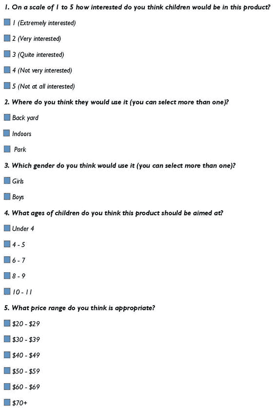
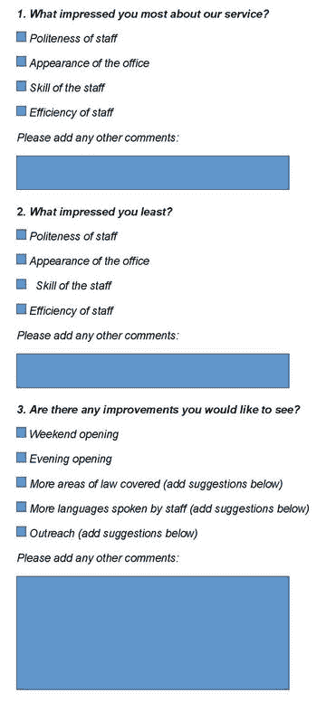

# 九、收集您的数据

明确的目标对于有效的数据收集至关重要。任何技术对你的小企业所能做的最好的事情就是帮助它廉价而快速地实现目标。第 5 章讲述了设定业务目标、杠杆和指标。[第 7 章](07.html)讲述了数据库设计，将业务目标牢记在心。本章介绍了数据收集，并解释了一些收集数据的方法。

## 概观

十有八九，你已经在收集数据了。例如，如果你接受顾客的钱，你可能会给他们开发票并做记录。这些数据可以直接放入你的数据库。然而，以这种方式收集数据并不能帮助你理解为什么人们会有这样的行为。因此，需要进一步的数据收集技术来帮助回答特定的问题，并帮助您的企业朝着其特定的目标前进。如果你想改善和发展你的业务，你可能想超越你收集的数据的界限。可能有益的数据包括:

*   您客户的人口统计数据
*   客户对你提供的产品/服务的反馈
*   您的客户对特定变化的态度

小型企业收集描述其当前客户的数据至关重要。关于性别、年龄和种族的人口统计数据很重要，尽管还必须考虑数据保护和隐私:[第 8 章](08.html)规定了关于数据保护的指导原则。数据收集可以简单到询问人们向朋友和同事推荐你的公司的可能性有多大，也可以包括关于客户体验各方面满意度的详细问卷。

您应该以足够频繁的时间间隔收集数据，以实现您的最终目标。例如，库存数据可能必须连续收集，而关于新产品发布的反馈可以在需要时收集。

小型企业应该和大型企业一样重视数据收集的准确性，如果不是更多的话。例如，一个大企业可能一个月丢几张发票，但对小企业的影响可能要大得多。充分的培训和监督对于确保准确收集和输入您的数据至关重要。员工培训包含在第 20 章中。

数据收集应该是一致的，这样你就可以跟踪一段时间的趋势。例如，当收集关于客户发票的数据时，确保每次都以完全相同的方式进行。数据应安全存储(参见第 8 章[)并且数据收集程序应尽可能简单。](08.html)

## 数据收集方法

收集数据的方法有很多种，如下面几节所述，您将了解每种方法的优缺点。对第 2–4 章中介绍的三个案例研究最有用的方法也进行了说明。

这里考虑的所有方法都需要参与者积极参与。然而，在许多采用这种收集方法的情况下，参与率可能非常低。幸运的是，被动收集数据也是可能的。例子包括当人们浏览你的公司网页时，收集他们的网络浏览习惯的数据。谷歌分析(Google Analytics)等工具可以帮助你做到这一点，因为它使你能够确定，例如，你的网站上最受欢迎的页面，你的访问者用来访问你的网站的关键字类型，以及你的访问者来自哪些国家。

此外，有可能获得不特定于您的业务的数据，但如果将其趋势与您收集的数据进行比较，可能会有用。一个例子是来自美国人口普查局的数据，可从`census.gov`获得，它涵盖了美国各地理区域的各种人口统计特征。从这些数据中提供的信息是有用的，因为它可以告知您当地的人口趋势，并帮助您将您从您的业务中收集和分析的数据放在正确的位置。

### 在线调查工具

在线调查工具是从客户那里获取数据的一种非常直接的方式。在线调查(或称电子调查)已经成为进行客户满意度调查以及产品和服务反馈评估的首选方式。

Note

调查收集工具的例子有 AskNicely、Survey Monkey、SurveyGizmo、Qualtrics、Woofu 和 Google Forms。

选择在线调查而不是其他数据收集方法有许多原因，包括节省成本、节省时间，以及通过自动回复收集提高数据准确性。

给自己最好的机会来吸引对您的调查的回应是很重要的。对任何调查的回复率影响最大的因素是受访者对该主题的兴趣。例如，对现有客户的调查可能比对非客户的调查有更高的回应率，因为受访者是从与您的业务有关系的一群人中抽取的。

尽管如此，还有其他因素可以提高答复率，如下所示:

*   目标受众必须经常使用电脑和互联网。
*   调查的标题应该简短且切题。
*   应该清楚如何开始调查以及如何完成调查。
*   问题应该具体且易于理解，例如，“您对我们的客户服务的满意度如何，从 1 到 5 分？”。
*   为了简单起见，调查应该使用一个目标。
*   文本应该保持最少:一页包含三到四个问题就足够了。当顾客想要买东西时，他们不会喜欢填写详细的问卷。

你可以使用各种类型的问题，比如多项选择、复选框、是/否等等。开放式问题很难管理。开放式问题的一个例子是，“描述一下我们的服务有多有用”。足够宽泛以捕捉真实反应的特定选择提供了更易于使用的数据。尽管如此，添加一个可选的文本框还是很有帮助的，这样参与者可以根据自己的意愿扩展他们的回答。参与者应该能够在 10 分钟内完成整个问卷。

以下标准将有助于提高您的回复率:

*   解释将如何使用数据，并解决相关的数据保护问题([第 8 章](08.html)详细介绍了数据保护)
*   给你的客户一些好处，作为他们提供数据的回报，比如参加抽奖
*   避免询问“识别”数据，如姓名、地址或出生日期—地理区域等数据可以在州级别获取，年龄范围(如 20-29 岁、30-39 岁等)可用于封装年龄
*   自愿提供联系信息，如电子邮件地址

在线调查很容易分发。您可以使用电子邮件向目标受众发送链接，请他们完成调查。但是，请确保您的电子邮件地址是准确的，并且您的列表是最新的。您可以将调查的链接放在您的企业网站或博客上。你也可以使用社交媒体，如脸书、Twitter 或 LinkedIn 来推广你的调查，并寻求反馈。最后，如果合适，您可以通过书面信函提供调查的详细信息。

好的调查问题很难写，而且可能需要相当长的时间来开发。因此，彻底测试问卷很重要，也许可以利用你的员工。

请注意，调查需要回答者填写问卷，并且通常需要一定的文化水平。如果多种语言在您的业务中很常见，请确保使用您的目标群体的所有主要语言来准备调查问卷。许多在线调查平台迎合多种语言。

与其他数据收集方法相比，在线调查有许多优势:

*   与邮政调查相比，它们的管理费用更低，覆盖的地理区域也更广
*   与电话采访或面对面采访等方法相比，评估者产生偏见的可能性更小，因为相同的问题是直接问所有受访者的，没有采访者参与
*   有些人觉得回答调查比参加面试更舒服
*   将封闭式回答列表是一个简单明了的过程

但是，在选择在线调查之前，您应该考虑几个问题:

*   除了语言障碍(可以在一定程度上缓解)，问题对所有受访者的意义可能不尽相同。这可能导致不能正确反映意见的不准确结果。在面试中，这些类型的误解更容易被发现和纠正。
*   由于缺乏与受访者的联系，你永远不知道谁真正完成了调查。
*   你没有资格探究更多的细节。

### 邮政调查

您可以通过邮件分发或发送打印好的问卷，然后收集问卷或用贴有邮票的信封寄回问卷。

为了便于以结构化格式填写表单和数据条目，表单应该是机器可读的，或者至少具有清晰可识别的数据字段和预编码的响应。除了这些方面之外，您还可以像设计在线调查一样设计打印问卷。

自填式调查依赖于包含被调查者正确姓名和邮政地址的适当数据库。如果您的列表过时、包含拼写错误、重复或由不合适的参与者组成，回复率将会很低。

### 面对面面试:使用纸质表格

面对面的面试可以是结构化的，也可以是开放式的。结构化面试是通过使用类似于在线调查的调查表格来进行的，尽管仍有余地使其更长。开放式面试包括在面试过程中做笔记，这些笔记稍后会被整理。移动设备是在面对面访谈中收集数据的一种有用方式，我们将在本节稍后讨论。

面对面面试有以下优势:

*   它们使您能够提出比在线调查更复杂的问题
*   您可以在收集数据时验证数据，从而提高数据质量
*   你可以对一个回答的有效性有更深的理解
*   可以与受访者互动；例如，你可以给他们看样品
*   更容易在更长的时间内保持受访者的兴趣
*   受访者不太可能拒绝回答问题
*   您可以更容易地解决任何关于保密性的问题，因为查询可以直接处理
*   面对面的采访对于收集引语和故事特别有用

面对面面试也有很多缺点:

*   组织这些活动的费用可能会很高，尤其是如果活动发生在广阔的地理区域
*   采访者经常独自工作，工作的质量很大程度上取决于他或她的责任心
*   由于受访者之间的旅行时间，这些调查通常很耗时
*   他们容易受到面试偏见的影响
*   他们可能会对被调查者造成干扰

与准备网上调查一样，在面试开始前彻底测试为面试设计的表格是很重要的。

### 电话采访

电话采访可以平衡(在线和邮寄)调查和面对面采访的优缺点。与在线和邮寄调查不同，电话采访使采访者能够直接与他们的受访者互动，从而导致更深入和可能更准确的采访。然而，时间和费用通常要高得多。

当电话面试与面对面的面试相比时，他们可能会节省时间和金钱。电话面试通常比在线或邮寄调查持续时间更长；20 分钟是一个合理的长度。另外，也没有时间和金钱花在旅行上。面对面的采访确实具有有效利用视觉效果的优势，尽管随着 Skype 等在线技术的普及，这不再是一个问题。在电话面试中缺乏个人接触也会妨碍评估者对回答背后隐藏的东西的判断。同样，像 Skype 这样的技术可以帮助减轻这种情况。

### 采访者使用移动技术收集数据

结合(在线和邮寄)调查和面对面访谈优势的另一种方法是使用移动技术通过电话或面对面访谈收集数据。你可以使用智能手机和平板电脑来收集数据。移动技术具有以下优势:

*   您可以节省收集和交付数据的时间，因为数据直接输入到您的移动设备中:数据不必从纸质问卷转录到电子存储中。
*   数据质量更好。将数据直接输入到移动技术中，避免了对糟糕笔迹的破译。
*   也有可能在输入数据时识别出任何错误，从而在这些问题变得普遍之前，通过与采访者的沟通来纠正这些问题。
*   鉴于智能手机和平板电脑的广泛使用，面试官可能只需要很少的技术培训。
*   根据所使用的技术，可以将文本与其他格式的数据(如照片)结合起来。

使用移动技术时也有潜在的问题:

*   您的公司可能需要购买平板电脑和智能手机，并支付相关使用合同的费用。
*   存储在设备上并在设备之间传输的数据可能易受攻击。在设备级别和传输过程中使用加密会有所帮助；这些问题在第 11 章中有更详细的介绍。
*   移动设备上的数据收集会随着技术的变化而变化，所以你必须仔细地做好长期规划。

### 作为数据收集工作一部分的案例研究

案例研究全面展示了人们对某项服务的体验。它们代表数据的深度而不是广度，因此，它们最好与本章中描述的其他方法一起使用。为案例研究收集数据、组织数据和分析数据通常非常耗时。这些数据通常是通过采访收集的，最好是面对面的采访。但是，组织可能有足够的数据来汇总案例研究，而无需进行广泛的数据收集。如果是这种情况，你必须确保那些参与的匿名。

### 团体活动/焦点小组

以前的每一种方法都与个人层面的数据有关。但是，在组级别收集数据也很有用。团队中的人有时会互相交流想法，产生比单独接触更多的反馈。

数据不一定代表其他组，随机样本可能是一个解决方案。在某些情况下，焦点小组可能是合适的，特别是当它由生活方式与计划的产品发布相关的人组成时。

组织这样的活动需要时间和资源，人们需要强烈的动机来参加。群体事件容易产生采访者偏见。此外，如果面试官不能有效控制团队，少数参与者可能会主导讨论。

## 案例研究:智能手推车公司的数据收集。

Smart 独轮车公司的许多数据是作为日常业务的一部分收集的。新客户下订单时会添加客户详细信息，必要时会更新现有客户的详细信息。类似地，关于发票、产品、供应商和材料的数据作为业务操作的一部分被存储。

[第 5 章](05.html)探讨了 Smart 独轮车公司的目标、杠杆和指标。回想一下，目标之一是增加利润。这一章考虑了提高利润的各种手段。在这些杠杆中，有两个非常适合本章描述的数据收集方法——扩大客户群和接受信用卡。

### 扩大客户群

第一个想法是，客户基础可以扩展到儿童。明智的做法是进行一些市场调查，看看是否有人对儿童用的小手推车感兴趣。该公司可以设计一个带有几个问题的在线调查，旨在收集关于潜在兴趣的有用数据。例如，他们可以把调查放在他们的网站上。问卷示例如图 [9-1](#Fig1) 所示。

图 9-1。

Online survey form for Smart Wheelbarrows Inc.

调查结束时会询问受访者是否愿意参加价值 100 美元的花园中心代金券抽奖。如果是这样，他们需要留下他们的电子邮件地址。否则，他们可以提交调查问卷，而不留下任何联系方式。

### 接受信用卡

智能手推车公司增加利润的另一个潜在方法是引入信用卡的使用。他们可以进行市场调查，以确定客户会发现这项服务有多有用。他们希望能够证明使用信用卡所产生的费用是合理的，并在设计调查问卷时考虑到这一点。

## 案例研究:詹宁斯-哈佛律师事务所

Jennings-Havard 律师事务所的目标是提高客户保持率。他们发现的一个杠杆是本章所描述的数据收集方法的理想工具——确定客户是否对他们接受的服务满意。其他两个杠杆，最大化客户交互和随着时间的推移跟上客户需求，由企业已经收集的数据来满足。

### 确定客户对他们接受的服务是否满意

像 Jennings-Havard 律师事务所这样的公司可能有一些使用互联网的客户，也有一些不使用互联网的客户。因此，网上调查和书面调查相结合是合适的。调查应该很短，但提供足够的数据，给公司明确的方向，哪里需要改进。示例如图 [9-2](#Fig2) 所示。

图 9-2。

Online survey form for Jennings-Havard Law Offices

可以在所有电子邮件通信中包含调查的链接，并且可以在所有发出的邮件中添加纸质副本。前台也有打印好的表格。

## 案例研究:连接南区

Connecting South Side 有可能使用许多数据收集方法来实现其目标。

该组织将电话评估作为其日常工作的一部分，因此直接询问询问者是否会参加正式的电话面试。访谈的目的可能是收集有关连接南区的反馈，目的是向授权人展示该服务广受欢迎。在线和纸质问卷也可以用来收集对服务的意见。

“连接南方”可以使用数据库中存储的查询描述来生成匿名案例研究，这将展示工作的性质和深度。他们需要小心数据隐私，并确保在这些案例研究中没有识别因素，例如生活在不寻常环境中的人。一个例子是有人在很小的时候就有了异常多的孩子。

连接南区参与各种当地活动。通常这包括派一两个员工去推销服务。这些员工可以收集当地服务中有问题的差距的数据。他们可以通过纸质表格或移动设备收集这些数据，并反馈给拨款委员会。

## 摘要

表 [9-1](#Tab1) 总结了本章介绍的数据收集方法。本章探讨了每种方法的优点和缺点，因此您可以明智地选择最适合您业务的方法。为了提供真实的例子，本章还探讨了在[第 2–4 章](http://dx.doi.org/10.1007/978-1-4842-0277-7_2-4)中介绍的三个案例研究可以使用的数据收集方法。

表 9-1。

Summary of Data Collection Tools

<colgroup><col> <col></colgroup> 
| 数据收集方法 | 何时使用 |
| --- | --- |
| 在线调查工具 | 当成本很重要时，当时间很重要时，当客户群可以在线访问并掌握技术时 |
| 邮政调查 | 适合那些对使用在线调查没有信心或没有互联网接入的人 |
| 面对面面试:使用纸质表格 | 当需要与受访者进行非结构化互动和/或视觉演示会有所帮助时，此功能非常有用 |
| 电话采访 | 介于(在线和邮寄)调查和面对面采访之间:它们比面对面采访更快更便宜，也比调查更深入 |
| 采访者使用移动技术收集数据 | 当钱不是问题，但时间和数据质量很重要时，这很有用 |

数据收集与数据清理密切相关，数据清理在[第 10 章](10.html)中有所描述。糟糕的数据收集会导致数据错误百出。可能需要改进数据收集来缓解这种情况。

## 进一步阅读

互联网、电话、邮件和混合模式调查:量身定制的设计方法。约翰·威利父子公司；4 th 版精装，2014，ISBN-13: 978-1118456149。