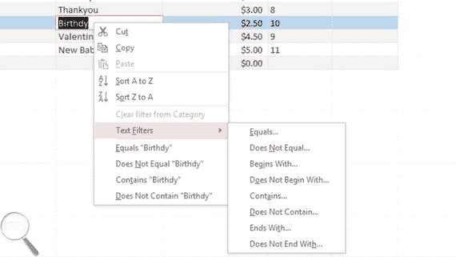
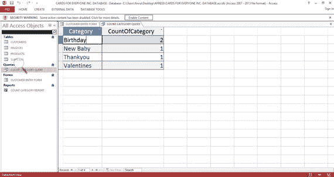
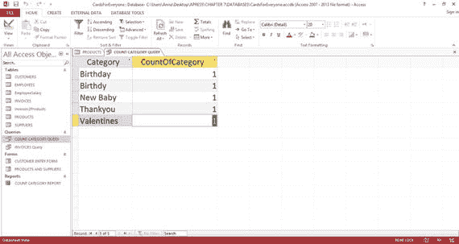
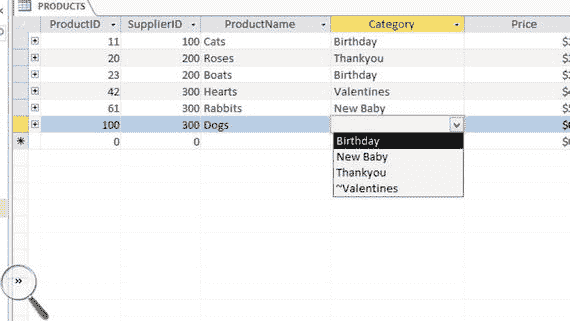
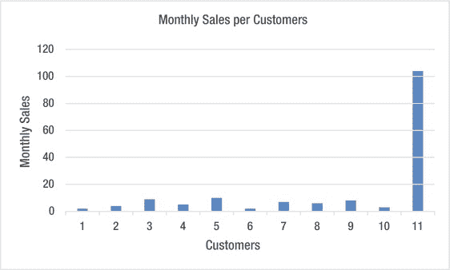
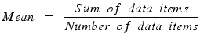
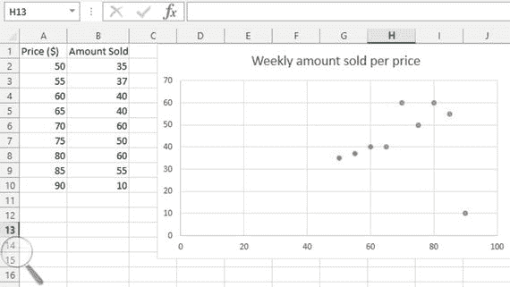
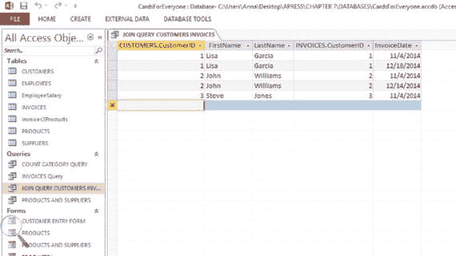
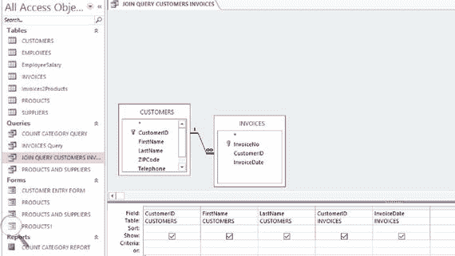

# 十、清理您的数据

每组数据都包含一些错误。检测和消除这些疏忽，即所谓的数据清理，通常是一个漫长的过程。然而，为了能够从数据分析中得出准确的结论，高效的数据清理是必不可少的。此外,《数据保护法》的原则之一(在第 8 章中描述)是确保您的数据是准确的，并且在必要时是最新的。

## 概观

数据清理包括三个主要步骤:

Detecting the errors   Selecting and applying the most appropriate methods to correct the errors   If possible, preventing the errors from happening again  

数据清理的过程通常是开放式的，因为有些错误很难发现和消除。此外，数据库很少是静态的，而是定期更新和追加。因此，不干净数据的可能性始终存在。

根据数据的预期应用，您必须决定要在数据清理上花费多少精力。您的准确性标准可能会根据数据的预期用途而有所不同。

大型组织通常将数据清理步骤外包出去。然而，小型企业通常在内部进行数据清理，并需要获得适当的技能。以下部分描述了可能出现的错误类型，并给出了有关如何查找、补救和预防这些错误的建议。

## 为什么干净的数据很重要

你的数据越干净，你的分析和行动就越有用和准确。不干净的数据可能代价相当高。例如，这些成本可能表现为未能满足法规遵从性或未能及时解决客户问题。

数据分析可用于确定企业的进一步投资。例如，如果一家企业的销售额在过去几年中有所增长，那么现有的商店可能不足以应付预期的销售额。因此，将需要更多的商店和员工。显然，如果这种投资是基于不干净和错误的数据分析，金钱和时间可能会被浪费。制定此类决策时，干净的数据至关重要。

当不准确的数据被用来支持广告时，会导致不必要的成本和可能的声誉损失。例如，客户地址、购买习惯和偏好的列表应该是正确的，没有重复的，如果它是通过直接邮寄来为新产品做广告的话。任何不正确的地址都可能导致信件因无法投递而被退回，从而浪费金钱；邮件列表中的重复客户将会收到不止一封信，再次导致企业不必要的开支以及客户的失望。关于消费者购买习惯和偏好的不准确数据可能导致不良的客户描述和不符合人们兴趣的产品广告。

正如第[章第 2](02.html)–[第 4](04.html) 中的案例研究所示，业务数据不仅仅包含客户数据。例如，智能手推车公司有一个标准化零件代码的材料数据库表。这些数据必须准确，以便订购正确的零件并联系到供应商。如果不是这样，那么订购错误的材料会浪费金钱和时间。

## 不干净数据的原因

了解不干净数据的原因有助于改进数据收集程序(在第 9 章中讨论)和改进数据清理技术。例如，如果你断定一个错误的数据输入是由打字错误引起的，键盘的布局可能会引导你找到正确的输入。

以下部分确定了不干净数据的许多原因。

### 数据输入中的打字错误

数据输入通常是手工完成的。数据可以是电话交谈的结果，也可以来自书面或印刷来源。在这些情况下，由于拼写错误或对数据源的误解，在将数据键入数据库时可能会出现错误。有时，数据值可能被输入到错误的列中，这使得错误难以检测。

其他问题包括在列中单词的开头添加额外的空格，这在数据处理过程中会引起问题，例如在对数据进行排序时。例如，如果猫、玫瑰、船、汽车和城堡是 Cards for Everyone Inc .的产品名称，并且它们是按字母顺序排序的，我们会认为顺序是船、汽车、城堡、猫和玫瑰。然而，如果一个空间被不经意地放在了猫的前面，顺序就会变成猫、船、车、城堡和玫瑰。在一个简短的列表中，这不是一个大问题。然而，在具有数百个条目的列表中，由于这些条目被有效地隐藏起来，所以出现在意想不到的地方的数据项妨碍了列表的排序。

### 文本中的非打印字符

非打印字符是不希望在文本中看到的指令，而是用于在后台格式化文本。来自 HTML(用于编写网页)的一个例子是`\n`，意思是“移动到新的一行”。当文本从一个地方转移到另一个地方时，非打印字符可能会变得可见，从而导致混乱。

### 文本不一致

大小写的差异会导致排序错误，至少会使数据库看起来不整洁。比如“瑜伽课”和“瑜伽课”指的是同一个东西。MS Access 不区分大小写，但是您需要检查您使用的数据库包是如何处理大写和小写的。

使用单数和复数名词也会引起问题。例如，“铰链”和“铰链”可能指的是同一个东西。如果数据库中同时有这两个记录，可能会导致重复记录(这将在本章后面讨论)。

### 编码错误

当输入不正确的代码时，会出现编码错误。例如，如果 1 =男性，2 =女性，并且在某些情况下错误地输入了女性的 1 而不是 2，那么这就形成了编码错误。这种错误通常发生在数据收集时，例如在电话或面对面访谈中。

有时可以将列自动设置为默认值。例如，默认情况下，代表性别的列可以设置为男性。如果数据输入者错误地忽略了这一列，即使是女性顾客，也会保留默认值。

### 缺失数据

数据丢失可能有多种原因。例如，客户可能拒绝回答问题，数据输入者可能没有数据输入数据库，等等。如果我们忽略所有缺少值的行，那么有用的数据就会被浪费掉。

缺失值不一定以一致的方式出现在数据库中。例如，缺失的数据可以用超出范围的数据进行编码，例如 999，这样就很容易看到。但是，有时像 0 这样的值可能用于编码可能不突出的丢失值。其他时候，缺失的数据由默认值替换(例如，性别=男性)。虽然这样的值看起来是正确的，不会留下明显的错误痕迹，但过一会儿，数据就会变得没有意义或有误导性。

### 数据类型

在数据库中，数字有时不是数字类型，而是以文本类型存储，如“短文本”。这意味着计算总数、平均值等所需的数学运算不能应用于该值。此外，这些数字不能以数字精确的方式排序。例如，如果数字 5、11、4、10 和 9 以“短文本”数据类型保存并按升序排序，则结果将是 10、11、4、5 和 9，这在数字上是不准确的。

输入日期时应使用“日期/时间”之类的类型。否则，诸如过滤给定月份的所有行之类的操作将无法应用。

Note

筛选器使您能够专注于感兴趣的行的子集。例如，您可以只查看或搜索包含给定时间段内的日期的行；包含以 s 开头的名称的所有行；或者包含数量少于 5 的所有行。图 [10-1](#Fig1) 显示了 Access 中可用的过滤器类型。

图 10-1。

The filter function in MS Access

### 数据集成错误

您的数据库可能包含使用各种方法从多个来源获取的数据。这可能意味着使用不同的数据表示，不一致地使用单位和缩写，等等。例如，可以使用其他格式来表示客户地址:一种格式将除邮政编码之外的整个地址放在一列中，另一种格式将地址的每个部分放在不同的列中。

以下是不同格式的货币数据的一些示例:

*   500 万美元
*   3000 万至 3500 万美元
*   15 亿
*   20 亿美元
*   One million
*   One thousand

因此没有一致的单位或数据类型。

### 截尾和截断

截尾数据指的是有限但不精确的测量值。例如，所有持续时间超过 20 分钟的电话都被记录为持续 20 分钟。这意味着数据可能不反映实际情况:如果所有呼叫持续时间超过一小时，在这种情况下，它们仍然会被记录为持续 20 分钟，这并不反映实际情况。

截断数据是指超出或低于某个界限时被丢弃的数据。例如，每月通话时间少于两分钟的客户不会被输入数据库。与审查一样，截断会导致数据不能反映真实事件。

### 单个单元格中有多个数据项

我们在第 7 章中看到，每个单元格应该只包含一个数据项。例如，输入为“瑜伽课和太极课”的活动应分别输入为“瑜伽课”和“太极课”。

### 极端值

术语“异常值”指的是与预期的显著偏离。例如，在每个人的卡公司的每个客户每月卡销售额的下列数字序列中，最后一个值是意外的，因为它远远高于所有其他值:

> 2，4，9，5，10，2，7，6，8，3，104

离群值可能是合理的，并且非常有用。例如，如果 104 是正确的，它可能代表高利润的客户。然而，104 也可能代表打字错误。

有些异常值可能只有在两列比较时才会出现，比如年龄和性别。举个例子，假设你有一群男女混合的人，M =男，F =女，年龄平均分布在 20 到 50 之间，如表 [10-1](#Tab1) 中的合计列所示。假设其中一名女性比其他所有女性年轻 10 岁。只有当性别年龄分开时，人们才会注意到这一点，如表 [10-1](#Tab1) 所示。

表 10-1。

An Example of an Outlier Based on Two Columns

<colgroup><col> <col> <col> <col></colgroup> 
| 年龄范围 | 频率(米) | 频率(华氏度) | 总数 |
| --- | --- | --- | --- |
| 40 | Eleven | nine | Twenty |
| 30 | nine | eight | Seventeen |
| 20 | Eighteen | one | Nineteen |

### 不合逻辑的行

发生一些错误是因为它们不符合您的业务逻辑流程。例如，发票日期早于业务开始日期是不合逻辑的。此外，任何产品的数量都不应小于零。

### 重复行

重复行是指表示同一事物(如客户或产品)的两行或更多行，而实际上应该只有一行。这些行的值不需要完全相同:它们可以表示相同的内容，但是它们的所有或部分列的值不同。例如，由于错误的更新，Cards for Everyone Inc .的客户可能在两行中有相同的姓名，但有不同的联系人数据。重复项可能由不同的行组成，这增加了检测它们的难度。

相同的事物使用不同的名称会产生重复的行。例如，“糖尿病南区”和“糖尿病南区”指的是同一个组织，需要删除一个。

形容词的使用也可能导致重复行。例如，“放松瑜伽课”与“瑜伽课”相同，只需要使用“瑜伽课”。

以“the”为前缀的名称也可能导致重复。例如，“咨询中心”和“咨询中心”是一样的。

### 数据库表之间的链接断开

随着时间的推移，插入、删除和更新将导致链接断开。例如，在 Cards for Everyone Inc .中，供应商可能会停止交易。如果您要从“供应商”表中删除供应商，但不从“产品”表中删除他们提供的相应卡片，您可能会向您的客户提供不再可用的卡片。

除了表之间的链接之外，查询、窗体和报表还可能基于以不兼容的方式进行了调整或不再存在的表。

## 检测、纠正和防止错误

以下部分假设您的数据存储在数据库内的一系列链接表中，如第 7 章中所述——所有记录长度相等，所有列的数据类型相同，每一行都有唯一的标识符。

与任何数据处理练习一样，在开始之前备份数据库是非常重要的。完成后，使用以下步骤来检测、纠正并最终防止错误。您的数据库应该使您能够自动执行这些操作。本章中的示例使用 MS Access 2013。

错误检测、纠正和预防的背景通常来自于您自己对业务的认识。例如，知道数量的缺失值条目是“999”。这种信息通常只存在于人们的头脑中，因此有必要对其进行记录，以确保其能够被传递。

### 打字错误的检测和纠正

您应该从检测和纠正打字错误开始，因为它们会加剧其他错误。

一些打字错误可能来自一个雇员小组，如果每个人都在他们插入的任何行上附上他们的姓名首字母，那么在需要的地方可以给予额外的培训。

#### 拼写检查器

大多数数据库都有拼写检查功能，使您能够查找和纠正拼写错误的单词。拼写检查器还可以找到不经常使用的值，如产品或公司名称。

#### 频率分布

当您在寻找输入错误时，考虑频率的分布是否符合您的预期。在像性别这样的列中，你会看到两个类别——男性和女性。频率分布将有助于显示频率中的任何偏差。

频率分布提供了每个值在数据中出现的次数。在第 1 章中，您已经看到了“人人卡公司”的各类卡的频率分布示例；如图 [10-2](#Fig2) 所示。

图 10-2。

Sample query for Cards for Everyone Inc.

您可以看到数据库中有两张类别为“生日”的卡片，其他三个类别各有一张。频率分布可应用于由名称(如图 [10-2](#Fig2) 所示)和数字数据组成的数据。

例如，如果您注意到男性比女性多，您可能会考虑这是否是输入错误。

频率分布还将显示拼写错误:例如，如果每个人公司的卡片的“生日”类别之一被拼写为“生日”，则频率分布将有一个“生日”出现，一个“生日”出现。图 [10-3](#Fig3) 显示了图 [10-2](#Fig2) 中存在生日拼写错误的查询。频率分布在[第 13 章](13.html)中有更详细的介绍。

图 10-3。

Sample query with spelling mistake in the Cards for Everyone Inc. database

#### 从文本中删除不需要的空格

要删除不需要的空格，可以对给定的列应用以下函数:LTrim(删除左边的空格)、RTrim(删除右边的空格)和 Trim(删除两边的空格)。

#### 使用移动技术

将数据直接输入智能手机或平板电脑等移动设备，可以防止手写问题，并有助于减少输入错误。移动技术包含在第 9 章中。

### 文本中的非打印字符

更正非打印字符通常就是找到并删除它们。通过使用内置的查找和替换功能来查找字符，也许可以在数据库中更正这些错误。最困难的步骤是识别可能出现的非打印字符的类型。建立一个清单是有意义的。您的列表可能包括:

*   `\n`(新行)
*   `\b`(粗体)
*   `\ul`(下划线)

由于许多非打印字符包含`\`，您可以从搜索文本中的`\`开始，并使用结果来识别您的非打印字符。理想情况下，编写一个能够自动查找和替换非打印字符列表的宏会很有用。

Note

宏是一条指令，当它运行时，启动一条或多条指令来执行任务。宏适用于电子表格、文字处理器文件和数据库。编写宏通常是为了执行一组经常需要的任务，例如创建一个带有固定标题集的表格。

作为预防措施，如果您的非打印字符似乎来自给定的来源，您可以尝试确定一种替代方法来获取数据。

### 文本中的不一致

文本的短列中的不一致，例如姓名的第一个字母(即 pat 相对于 Pat ),可以通过按字母顺序对该列进行排序并向下扫描任何不正确的内容来检测。

一些数据库具有可以纠正大小写不一致的功能。例如:

> LOWER: Convert all uppercase letters in a text string to lowercase. UPPER: Convert text to uppercase letters.

单数/复数错误可能很难发现和纠正。创建每次数据清理期间要应用的检查列表可能会有所帮助。例如，您的列表可能包括检查:

*   阶级与阶级
*   会话与会话
*   教堂对教堂

如果您选择用 Class 替换 Class 的每个实例，您可以使用 find and replace。

### 编码错误

为了避免默认值，例如男性代表性别，可以使用一个查询表，将未知作为默认值。这也有助于在一个列表中有清晰的代码和相应描述的查找表，这样就不会有歧义。

列可以设置为查找类型。这意味着它的值可以以下拉菜单的形式预先确定。这些菜单可用于表格或表单中的数据输入。图 [10-4](#Fig4) 显示了“产品”表中“人人公司”卡片的“类别”列的下拉菜单。填写该栏时，可以选择所需的值。这些值在每次使用时都是一致的，因为它们是由下拉菜单决定的。打字错误是不可能的。

图 10-4。

Lookup table for the PRODUCTS Table in Cards for Everyone Inc.

### 缺失值和异常值

频率分布可能有助于检测缺失值。例如，对于数字数据，由超出范围的数字(如 99)表示的缺失值将很容易被发现，因为它们通常显示出异常高的频率。但是，如果缺少的值用一个范围内的数字表示，比如 0，那么就不太容易找到。如果您有一个频率为 0 的分布，其中一些可能表示缺少值，可能需要密切关注。

频率分布还以局部方式显示数据是否丢失。例如，如果某个特定地理区域的所有调查都丢失了，那么很明显该区域出现了问题。

条形图对于检测异常值很有用。条形图显示不同类别或组的频率或其他度量，不同条形图的高度与其代表的类别大小成比例。

例如，图 [10-5](#Fig5) 中的条形图显示了异常值部分描述的 Everyone Inc .客户的 11 张卡的月销售量。这些是:

> 2，4，9，5，10，2，7，6，8，3，104

图 10-5。

Outlier detection for Cards for Everyone Inc.

您可以立即看到，客户 11 的月销售额远远高于其他客户，这反映出它是一个异常值。

当您收集所谓的连续比率数据时，可能会发生一个特别有趣的情况，这是一种允许无限细分的数字数据。你将在第 13 章中了解更多。有了这样的数据，一种模式通常被称为正态分布。这是数据以非常规则的方式围绕平均值均匀分布的地方。

的意思是:

这个在[第十三章](13.html)中有涉及。

如果将数据的频率分布绘制成线形图，它将呈现钟形曲线的形状，钟形曲线的峰值位于平均值处(图 [10-6](#Fig6) )。简而言之，正态分布告诉我们，大多数数据将接近平均值，如果有很大一部分不接近，就可能有问题。图 [10-6](#Fig6) 中一些虚构的连续比率数据的概率显示了观察到任何观察值的可能性。

图 10-6。

A normal distributuion with the mean equal to 15

因此，分析正态分布可以帮助您检测错误。但是，不能保证您的数据将遵循正态分布，因此应谨慎遵循此建议。如需进一步阅读，请参阅本章末尾的参考资料。

可以用数值代替缺失的数据，如列平均值。这一过程被称为“插补”。像这样的简单插补没有考虑到列之间的任何关系，应该谨慎使用，因为它可能会引入偏差。

当您输入数据时，对缺少的值应用一致且适当的编码是很重要的。例如，在值状态的上下文中，使用术语“无”来表示缺少数据是令人困惑的。这可能意味着客户住在国外。诸如“未知”之类的条目会更合适。第 20 章涵盖了通过有效的员工培训减少价值缺失的主题。

与缺失值一样，处理异常值的最佳方式可能是将它们设置为列平均值。但是，与缺失值一样，您必须小心不要过于频繁地应用这种方法。

检测由一对列生成的异常值的有效方法是使用散点图。散点图显示数值对之间的关系:在本例中，是同一数据库表中的列。一个点代表每个个体或物体，并参照两个轴上的测量值进行定位。图 [10-7](#Fig7) 显示了一个例子。

图 10-7。

A scatter plot depicting the relationship between price and amount sold per week for Smart Wheelbarrows Inc.

寻找与其他点不同的点。图 [10-7](#Fig7) 显示了不同价格的小型豪华独轮车的周销售量。你可以看到，当价格设定为 90 美元时，销售额的下降与其他销售水平不成比例。散点图在[第 13 章](13.html)中有详细讨论。

### 标识每列的数据类型

应该确定每一列的数据类型。在 MS Access 中，数据类型列在相应表的设计视图中，如本书末尾的附录所示。

给定列的数据类型应该反映该列中数据的性质:不匹配可能表示有错误。

*   日期有一种类型，如日期/时间
*   美元有一种类型，如货币
*   只回答“是”或“否”的列具有“是/否”这样的类型
*   任何包含需要应用计算和排序的数字的列都应该有一个数字类型，如数字或货币
*   根据要插入的文本数量，文本可以出现在不同类型的列中，例如，MS Access 中的短文本最多可容纳 255 个字符

这种错误很容易纠正，因为您可以在表的设计视图中直接改变数据类型。应用此操作时，可能会警告您数据可能会丢失，因此请确保您正在进行正确的更正，并且您的数据库已备份。

### 数据集成错误

从外部数据源导入数据后，常见的任务是将两列或更多列合并为一列，或将一列拆分为两列或更多列。例如，您可能希望将包含全名的列拆分为名和姓列。或者，您可能希望将包含地址字段的列拆分为单独的街道、城市、地区和州列。反过来也可能是正确的。

与 MS Excel 一样，LEFT、MID、RIGHT、SEARCH 和 LEN 函数可用于在 MS Access 查询中将一列拆分为两列或更多列。在名称中搜索空格后，名称将被拆分。

同样，与 MS Excel 一样，可以使用&函数来合并列。

Note

在这个早期阶段，与其学习如何在数据库中应用这些函数，不如将数据发送到 MS Excel 电子表格中，在您熟悉的环境中应用这些函数，然后将数据发送回数据库中经过调整的表中。

### 截尾和截断误差

频率分布可能显示截断误差和截尾误差。例如，如果频率分布显示大量电话呼叫持续了 20 分钟，但您知道许多电话呼叫持续的时间超过了 20 分钟，则此类分析可能表明存在截断错误。

或者，如果出现频率分布左端的数据丢失，表明在特定时间之内的呼叫没有被记录，即使您知道它们已经发生，这可能表明审查错误。

一般来说，检测删截和截断错误依赖于业务人员的知识。重要的是，任何审查和截断方法都要记录在案，以便其他员工了解它们。

### 将一行拆分成两行或更多行

数据项可能已经合并，需要分离。例如，输入为“瑜伽班和太极班”的组织应该在两个单独的行中输入为“瑜伽班”和“太极班”。

检测这样的条目并不容易。您可以搜索逗号之类的分隔符。你可以搜索像“和”这样的词。当您在日常工作中进行数据清理或使用数据库时，您可能会注意到这些错误。

除非这种错误经常发生，否则最好是通过向有问题的表中添加一个新行并拆分有问题的单元格来手动更正它们。

### 检查不合逻辑的错误

您可以使用约束检查来识别可能出现不合逻辑错误的列错误。例如，您可以确保:

*   发票表中的日期总是在业务开始日期之后
*   订购数量绝不会少于 1
*   某人的头衔和性别是一致的——例如，如果他们的头衔是夫人，他们的性别就不应该被编码为男性

除了手动搜索这些错误之外，在一些数据库中还可以设置一个验证规则。这种规则限制不满足约束的数据的输入。有效性规则的语法与 MS Excel 等电子表格中使用的表达式相似。一些不合逻辑的错误，如涉及姓名和性别的错误，在入境时可能难以识别，一些手工检查可能是必要的。

### 消除重复行

您应该尝试在数据清理过程的最后消除重复行。这是因为错误删除的过程会使重复的行更加明显，所以您需要最后再做一次，以确保它们都被更正。

您需要决定如何处理某些名称—例如，是否要从“连接南区”中使用的组织名称的开头删除“the”。

一些行可能表示相同的东西，但使用稍微不同的名称。

对包含许多不同条目的列的频率分布使用字母排序有助于识别几乎相同的名称。一旦确定了它们，就可以给它们起一致的名字。

或者，可以确保给定地址的每个客户都是唯一的，假设这是一个合理的假设。如果名称稍有不同，可以合并这些行。

和任何生意一样，你对当地的了解是最重要的。例如，在 Connecting South Side，组织表中可能会列出许多瑜伽课程。这些课程可以用 Yoga 这个词来过滤，它们的形容词也可以去掉，比如把放松瑜伽课改成瑜伽课，以达到一致性。

一旦找到了不一致的地方，就可以应用许多数据库都提供的重复检测技术来识别匹配或部分匹配的行。

Note

您可能会发现，对表中的一组列应用频率分布比应用重复检测方法更容易。任何出现频率超过一次的行都可能是重复的。

### 检测表之间断开的链接

避免表与查询、窗体和报表之间断开链接的最佳方法是，如果插入、更新或删除行或表会导致断开链接，则指示数据库不要这样做。这是在表之间插入链接时强制执行的一个预防步骤。

Note

这个过程被称为加强关系完整性。

如果您在建立关系时没有设置这些措施，您可以下载免费的数据库插件来识别所有断开的链接。

定位两个链接表之间断开的链接的另一种方法是使用两个表中的列运行查询，通过相应的行有效地连接表。这就是所谓的连接查询。如果结果查询的行数少于“子”表，则子表包含断开的链接。这本书的附录告诉你如何建立一个简单的查询。

Cards for Everyone Inc .的一个例子涉及到 Customers 表和 Invoices 表之间的链接。这两个表之间的关系是一对多的，发票是子表，客户是父表。如果连接的客户和发票表的行数少于发票表的行数，您就会知道有些发票没有链接到客户。图 [10-8](#Fig8) 显示了客户和发票表之间可能的连接查询的查询设计，图 [10-9](#Fig9) 显示了输出。图 [10-9](#Fig9) 显示了 5 行，即与发票表相同，所以你可以断定没有遗漏环节。

图 10-9。

Output from the join query shown in Figure [10-8](#Fig8)

图 10-8。

Query design of a join query between the Customers and Invoices tables of the Cards for Everyone Inc. database Note

连接查询至少由两个表中的一列组成。

您的数据库可以让您快速识别所有不匹配的行。例如，MS Access 有一个名为“查找不匹配的查询”的工具。

## 数据库维护

数据库不是静态的，会定期添加新的记录。清洁也必须经常进行。这是第 11 章中讨论的数据库维护的一部分。

## 摘要

干净的数据是做出有效业务决策的基础。清理数据的过程可能是一个漫长的过程，涉及到检测、纠正和有希望的防止错误。错误可能来自许多方面，这意味着清理过程可能很复杂。此外，必须定期完成数据清理，以跟上数据库的发展。

表 [10-2](#Tab2) 总结了本章讨论的错误的纠正和预防。

表 10-2。

Summary of Error Correction and Prevention Techniques

<colgroup><col> <col></colgroup> 
| 错误类型 | 清洁技术 |
| --- | --- |
| 打字错误 | 数据库拼写检查频率分布使用移动技术从文本中删除不需要的空格 |
| 显示非打印字符 | 识别和定位违规字符并删除 |
| 矛盾 | 使用内置命令(标准化大小写)选择单数或复数名词并编辑 |
| 编码错误 | 只提供名称或同时提供名称和代码的查找表 |
| 缺少值 | 频率分布条形图正态分布 |
| 错误的数据类型 | 直接在设计视图中更改数据类型 |
| 数据集成错误 | 使用内置命令(拆分列) |
| 截尾和截断误差 | 内部知识的频率分布 |
| 一个单元格中的多个数据项 | 将一行拆分成两行或更多行 |
| 不合逻辑的错误 | 使用验证规则 |
| 重复行 | 频率分布和排序使用内置的重复检测工具 |
| 检测断开的链接 | 联接查询运行查找不匹配项查询 |

## 进一步阅读

《假人统计学》,作者黛博拉·j·拉姆齐、约翰·威利父子公司；第二版，2011 年，ISBN-13: 978-0470911082。