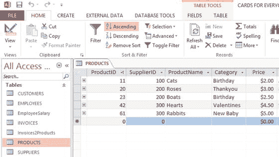
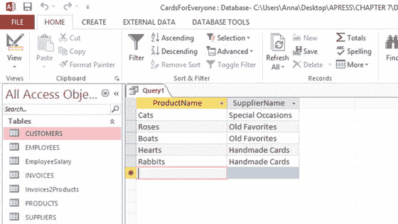
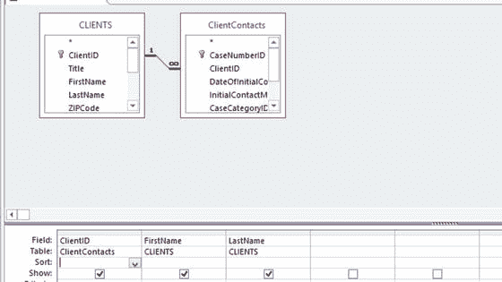

# 十二、搜索您的数据库

如果不能有效地访问数据，那么将数据存储在数据库中就没有什么意义。例如，当您在数据库中搜索他们的详细信息时，客户不喜欢长时间等待。一般来说，如果您了解一些基本的技术，很容易快速找到数据。

将本章放在上下文中，[第 13 章](13.html)涵盖了数据分析，它涉及到数据的检查，而本章关注的是发现数据，这是分析之前的步骤。本章与[第 19 章](19.html)有些重叠，后者涵盖了在线搜索。此外，您的员工能够高效地搜索数据库也很重要；员工培训包含在[第 20 章](20.html)中。

与本书中的所有章节一样，示例使用 MS Access 2013。书的附录也有 LibreOffice 5 Base 中的例子。

## 搜索类型

您可能想知道您想要在数据库上执行什么类型的搜索，以及哪些类型是可能的。决定因素包括:

*   搜索将覆盖的数据库表的数量
*   无论您有完整的还是部分的搜索词
*   无论是搜索单个数据项还是大部分数据

搜索示例包括:

*   确定客户是新客户还是现有客户
*   识别给定产品的供应商
*   寻找最老的顾客
*   标出不付账的顾客

数据库搜索是你营销工作的一个有用的前奏。例如，大多数企业不会只迎合一种类型的客户，即使他们销售单一的产品或服务。例如，智能手推车公司可以向大型花园中心以及公寓的所有者销售。这是两种截然不同的客户，有着不同的需求。因此，用相同的广告电子邮件瞄准这些客户不如发送每个定制的信息有效。花园中心的所有者可能对批量购买手推车的交易感兴趣，而个人可能对单项商品的折扣感兴趣。能够根据一列或多列(如地址、年龄和性别)将数据库划分为客户群是很重要的:这个过程称为细分。

就像整本书一样，本章中的许多例子都是基于 Cards for Everyone Inc .的案例研究。图 [12-1](#Fig1) 重述了其数据库的设计，以供参考。

图 12-1。

Database design for Cards for Everyone Inc.

### 在表格中搜索一行或多行

涉及给定表中一行或多行的搜索可以分为基于给定列值的搜索和基于多个列值的搜索。

#### 基于给定的列值进行搜索

以下部分介绍了基于给定列值搜索一行或多行。

##### 搜索单行

最简单的搜索类型是根据给定的列值在给定的表中查找一行，比如根据客户的姓氏来搜索客户。如果您想知道向您购买产品的人是新客户还是现有客户，这将非常有用。

最明显的方法是直接看表。通过按字母顺序对所需的列进行排序，可以使搜索变得容易得多。图 [12-2](#Fig2) 显示了在按姓氏排序之前每个人公司卡中的客户表，图 [12-3](#Fig3) 显示了之后的表。(为了使示例更加有用，在[第 1 章](01.html)中使用的表格中增加了三个额外的名字。)

图 12-3。

The Customers table from Cards from Everyone Inc. sorted on the LastName column

图 12-2。

The Customers table from Cards from Everyone Inc. Note

对数据库列中的数据进行排序将在本书末尾的附录中介绍。

排序后的列表就像一个姓名索引，可以通过扫描找到与搜索词匹配的姓名。

要避免扫描名称列表，请使用 Filter 命令。如果您使用 Filter 命令的 Equals 选项，您将直接找到所需的数据。要操作筛选器命令，请在要应用筛选器的列中选择一个单元格，然后执行下列操作之一:

*   点击出现在上图 [12-2](#Fig2) 中上部的过滤器图标，并选择文本过滤器。
*   右键单击并从菜单中选择文本过滤器。

图 [12-4](#Fig4) 显示了产生的过滤器命令。当您单击 OK 时，将显示 Customers 表中包含“LastName 等于 Garcia”的单行。

图 12-4。

A text filter on the LastName field is applied to the Customers table of the Cards from Everyone Inc. database

这是一个非常简单的例子。在现实世界中，搜索可能要复杂得多。如果出现以下情况，则需要进一步搜索:

*   不止一个顾客姓加西亚。
*   加西亚拼错了。
*   只有丽莎的名字被输入。

有搜索可以覆盖这些可能性；它们将在本章后面讨论。

##### 搜索多行

或者，您可以根据一列中的值在给定的表中查找多行，例如在 Cards for Everyone Inc .数据库中，所有类别为“生日”的产品。

图 [12-5](#Fig5) 显示了每个人卡片的产品表，图 [12-6](#Fig6) 显示了只有生日卡片的同一张表。在后一种情况下，应用了类别=“生日”的过滤器。

图 12-6。

The Products table with the Category = ‘Birthday’ filter applied

图 12-5。

The Products table in the Cards for Everyone Inc. database

另一种类型的搜索涉及应用于数值的过滤器。例如，在产品表的情况下，图 [12-7](#Fig7) 显示了根据小于或等于$3.00 的价格筛选行的情况。

图 12-7。

The Products table for the Cards for Everyone Inc. database filtered on Price ≤ ‘$3.00’ Note

除了选项应用于数字之外，可以使用与前面解释的文本相同的方法在 motion 中设置这样的过滤器。

#### 基于给定表中的多个列值进行搜索

您可能会根据多个列中的值在给定的表中查找一行或多行，例如根据名字和姓氏查找客户。例如，假设每个人公司的卡的客户表中有一个名为约翰·加西亚的客户，如图 [12-8](#Fig8) 所示。

图 12-8。

Updated Customers table in the Cards for Everyone Inc. database

对 LastName = 'Garcia '进行过滤得到的输出如图 [12-9](#Fig9) 所示。

图 12-9。

Filtering the Customers table from the Cards for Everyone Inc. database on LastName = ‘Garcia’

如果过滤后的输出很长，您可以使用 FirstName = 'Lisa '应用第二个过滤器(当然，假设您只尝试查找 Lisa Garcia)。

#### 单个表上的搜索技术概述

对于这种在给定表中查找一行或多行的搜索，排序和过滤是查找相关数据的理想方法。使用表格符合您的电子表格知识，因为您使用的是您已经熟悉的查看数据的方法。

前面的例子非常简单地描述了您可能会遇到的情况。随着业务的增长，您的数据库表可能会有数百或数千行，因此仔细应用排序和筛选非常重要。

本节假设您拥有关于您正在查找的数据的完整信息。本章后面关于部分数据的部分将考虑不属于这种情况的情况。

### 基于多个表格的搜索

在这一节中，我们感兴趣的是涉及多个链接表的搜索。这种搜索的一个例子是 Cards for Everyone Inc .数据库中来自给定供应商的所有产品。在这种搜索中，行的概念失去了相关性:products 表中有包含产品的行，而 Suppliers 表中有包含供应商的行。但是，为了进行搜索，您会对这些行在数据库中是如何链接在一起的感兴趣。

不再可能单独打开“产品”或“供应商”表来执行搜索，因为只有您需要的部分数据可用。你需要一种方法来把它们整合在一起。当您的搜索涉及多个链接表时，您将开始理解数据库有多强大，以及它们与电子表格有何不同。

基于多个表进行搜索时，主要考虑的是如何将相关数据组合在一起以及如何查看这些数据。有两个主要的选择，这两个你以前都遇到过。你可以使用一个连接查询(在[第 10 章](10.html)中介绍)或者一个表单(在[第 1 章](01.html)中介绍)。

#### 使用连接查询

由于连接查询最类似于电子表格，我们将从这种方法开始。

Note

这本书的附录描述了如何建立一个简单的查询。

每次设计任何查询时，都必须首先选择要从中选择数据的表。要在 Cards for Everyone Inc .数据库中查找来自给定供应商的产品，需要选择 products 和 Suppliers 表。如附录中所述，您可以使用查询向导或查询设计。这里我使用查询设计，因为它显示了表的图形表示。图 [12-10](#Fig10) 显示了 Cards for Everyone Inc .数据库的链接产品和供应商表以及两个选定的列——产品名称和供应商名称。没有选择其他列，因为对于这次搜索，我们只对供应商的名称感兴趣，仅此而已。

图 12-10。

Query design over the Products and Suppliers tables in the Cards for Everyone Inc. database

图 [12-11](#Fig11) 显示了运行图 [12-10](#Fig10) 中的查询的结果:注意查询的输出看起来像一个表格或电子表格，并反映了您习惯的数据表示。这些表已经在 SupplierID 列的基础上“连接”起来，SupplierID 列将它们链接在一起。

图 12-11。

Output of the Products and Suppliers query on the Cards for Everyone Inc. database

通过少量的输出，很容易识别您正在寻找的数据——例如，哪些产品由哪些供应商提供。但是，和前面几节一样，如果有大量的行，还需要做进一步的工作。与表一样，可以使用本章前面介绍的技术对查询进行排序或筛选。例如，如果您想知道谁提供了船只，您可以按字母顺序对 ProductName 进行排序，向下扫描船只列表，并从相邻列中读取供应商的名称 Old Favorites。或者你可以在 ProductName = 'Boats '上过滤，这将给出如图 [12-12](#Fig12) 所示的结果。

图 12-12。

Query in Figure [12-11](#Fig11) for the Cards for Everyone Inc. database filtered on ProductName = ‘Boats’

#### 使用表单

图 [12-13](#Fig13) 显示了一个表格，该表格涵盖了每个产品的组合数据及其供应商的相关数据。

图 12-13。

A form combining data from the Products and Suppliers tables of the Cards for Everyone Inc. database Note

本书末尾的附录解释了如何创建一个简单的表单。

总共有五个表格，每个产品一个。表单上的框对应于数据库中“产品”和“供应商”表的列，与查询一样，您可以选择包含的列。每个框都可以排序和过滤，就像它存在于一个表中一样。图 [12-14](#Fig14) 显示了在 ProductName = 'Boats '上过滤的图 [12-13](#Fig13) 中的表单。

图 12-14。

A form combining the data from the Products and Suppliers tables of the Cards for Everyone Inc. database filtered on ProductName = ‘Boats’

然后，您可以直接从表单中确定船只的供应商，这是以前的最爱。

#### 多个表的搜索技术总结

跨多个表进行搜索需要一种将数据集中在一起的方法。最常用的技术是连接查询和表单，其中的选择很大程度上取决于个人偏好。一旦可以在单一位置查看数据，就可以使用排序和过滤直接找到所需的项目。

如前所述，本节假设您已经获得了关于您正在寻找的数据的完整信息。本章后面关于部分数据的部分将考虑不属于这种情况的情况。

### 基于几个标准的搜索

您可以同时对同一个数据库列应用多个筛选器。例如，如果您正在查找一个链接到 Connecting South Side 的组织，并且您知道该名称包含单词“Yoga”和“Center ”,但是您不确定确切的名称，您可以对 Organizations 表中的 OrganizationName 列应用两个过滤器(图 [12-15](#Fig15) ,如下所示:

*   Apply one filter to the OrganizationName that contains the word “Center,” giving you the output shown in Figure [12-16](#Fig16).

    

    图 12-16。

    The OrganizationName column of the Organizations table filtered for the word “center”
*   如果第一个过滤器返回了很多行，那么对 OrganizationName 应用第二个过滤器，使用单词“Yoga”。

图 12-15。

The first few columns of the Organizations table from Connecting South Side

无论是在同一个表中，还是在查询或窗体的多个表中，都可以对同一列应用多个筛选器，也可以同时对多个列应用筛选器。例如，如果要在 Cards for Everyone Inc .数据库的 Customers 表中查找 Lisa Garcia，可以同时应用两个筛选器:LastName = 'Garcia '和 FirstName = 'Lisa '。

### 基于部分列值进行搜索

您在前面几节中对 Garcia 的搜索可能没有成功。可能是 Lisa 的姓氏输入不正确，这是在数据清理过程中被忽略的错误。Lisa 的姓氏可能根本没有输入，也可能 Lisa 不是现有客户。

在放弃寻找之前，你还有其他的选择。过滤器可以搜索部分数据。以下是一些筛选器搜索与 Garcia 这个名字相关的部分数据的示例:

*   搜索名称的开头，使用“以 G 开头”、“以 Ga 开头”、“以 Gar 开头”等等。
*   使用“以 a 结尾”、“以 ia 结尾”、“以 cia 结尾”等搜索名称的结尾。
*   使用“包含 ar”、“包含 arc”、“包含 arci”等搜索名称的中间(或两端)。

如果 Garcia 被拼错为 Garica，那么下面的过滤器将会选择它，尽管有些过滤器会返回比其他过滤器更多的行:

*   以 G 开头，“以 Ga 开头”和“以 Gar 开头”
*   以'结尾
*   包含 ar '(以及 G，Ga，Gar，a，r，I)

建议找到名称中不常见的特征，以便过滤器返回的行数尽可能少。

下列过滤器在 Garica 的情况下不会成功:

*   “以加西亚开头”或“以加西亚开头”
*   以 ia 结尾'(以及 cia、rcia、arcia)
*   “包含弧”或“包含弧”

搜索过程可能是重复的，需要反复试验:不要期望马上得到你要找的数据。根据命中次数和结果的相关性，根据需要修改您的搜索。

这些类型的搜索可能很耗时，而且可能不会有任何结果。例如，如果 Lisa 的姓氏没有输入到数据库中，您将搜索不存在的东西。考虑到这一点，您可能希望过滤其他列，以获得正确的数据。您可以按如下方式对其他列进行筛选:

*   名字等于“丽莎”
*   性别等于“女性”(如果你知道丽莎是女性)
*   State 包含“MI”(如果您知道 Lisa 住在密歇根州)
*   InvoiceDate 等于“上个月”(如果您知道 Lisa 之前的订单是上个月)

每次应用额外的筛选器时，返回的行数将与以前相同或更少。数量越少，就越容易识别 Lisa 的记录(假设它存在)。

可能会有这样一个时刻，当你尽了一切合理的努力去寻找 Lisa 的详细信息时，你需要停下来总结 Lisa 是一个新客户。

您可以通过在某些表格中添加关键字来提高搜索效率。例如，如果 Pat at Cards for Everyone Inc .面临非常模糊的搜索标准，例如“所有上面有动物的卡片”，那么搜索所有卡片以查看它们是否符合这一要求将是没有效率的。更有效的方法是在 Products 表中添加一个 keywords 列，其中的关键字反映了卡片上的图片，例如猫和兔子代表动物，玫瑰代表花。图 [12-17](#Fig17) 中显示了人人卡公司数据库的产品表示例。

图 12-17。

Adding a Keywords column to the Products table of the Cards for Everyone Inc. database

有了关键字，你可以使用一个过滤器，比如关键字包含“动物”来识别动物卡片。图 [12-18](#Fig18) 显示了产品表中的过滤结果。

图 12-18。

The Keywords column in the Products table for the Cards for Everyone Inc. database filtered on Keywords Contains ‘Animals’

## 个案研究

以下部分给出了您可以在属于[第 2–4 章](http://dx.doi.org/10.1007/978-1-4842-0277-7_2-4)中描述的每个小型企业的数据库上运行的搜索示例。

### 智能手推车公司。

智能手推车公司的数据由客户、材料、产品和供应商组成。其数据库设计已在第 7 章的[中介绍过，图](07.html) [12-19](#Fig19) 中再次显示，以供参考。

图 12-19。

Overview of the complete database design for Smart Wheelbarrows Inc

潜在搜索的数量很大，而且多种多样。这里有几个例子:

*   某个组件或材料存在缺陷，需要确定其供应商—需要进行搜索以将该组件或材料与其供应商相匹配，从而解决问题。在涵盖跨多个表的搜索的部分中，您看到了一个示例，其中 Cards for Everyone Inc .数据库中的 Products 和 Suppliers 表是使用联接查询或表单合并的。在这种情况下，两种方法都可以使用。
*   为了满足质量审核的要求，第 5 章讨论了 Smart 独轮车公司开发儿童独轮车的可能性。为了开发这样一种产品，很可能需要进行质量审核，将每个组件追溯到其来源，以确保儿童使用安全。这种审计将涉及确定拟议产品的每一个组成部分，并将它们与供应商联系起来。在相关材料清单的帮助下，这可以通过与单个组件相同的方式完成。
*   确定客户以前是否从该企业购买过产品—这应该是一个简单的搜索(如果客户的姓名输入正确)，或者如果有输入错误，可能是一个漫长的过程。按照本章所述的步骤，在 Cards for Everyone Inc .数据库中找到 Lisa Garcia。如果所有这些寻找客户的尝试都一无所获，很可能你有了一个新客户。
*   识别不支付账单的客户—许多小企业都受到不支付账单的客户的影响。搜索以识别未支付的发票和负责的客户可能是有用的。这是一个搜索示例，目前无法使用 Smart 独轮车公司的数据库进行搜索，因为 CustomerInvoices 表中没有保存发票何时支付的数据的列。但是，这是一个简单的添加—该列可以称为 DatePaid，数据类型为 Date/Time。

一旦 date payed 列就绪，就可以使用连接查询或表单连接 Customers 和 CustomerInvoices 表(请参阅基于多个表的搜索一节),并且可以过滤 date payed 列中的空值。出现在这个过滤的查询或表单上的客户还没有支付他们的账单(假设数据库已经保持最新)。

### 詹宁斯-哈佛法律事务所有限公司。

Jennings-Havard 法律事务所的数据包括客户、案例和人口统计数据。在第 7 章的[中介绍过的整个数据库设计再次显示在图](07.html) [12-20](#Fig20) 中，以供参考。

图 12-20。

Overview of the database design for Jennings-Havard Law Offices

以下搜索会很有用:

*   识别某人是新客户还是现有客户——如前几节所述的 Smart 独轮车公司和 Lisa Garcia。
*   识别回头客——客户忠诚度对任何企业都很重要，尤其是像 Jennings-Havard 律师事务所这样的律师事务所，他们可能会留住客户很多年。

查找重复客户的一种方法是在客户和客户联系人之间建立一个连接查询，从客户联系人表中选择 ClientID 列，从客户表中选择 FirstName 和 LastName，如图 [12-21](#Fig21) 所示。这个查询将客户的名字与他们的每个联系人放在一起，使他们能够被计数。运行查询后，显示图 [12-22](#Fig22) 中的表格。你可以看到金珠已经联系了公司两次。

图 12-22。

Query showing repeat clients for Jennings-Havard Law Offices

图 12-21。

Query design for repeat clients of Jennings-Havard Law Offices

### 连接南侧

Connecting South Side 保存关于他们的查询者、查询者被指引到的组织以及关于查询者的人口统计细节的数据。在第 7 章的[中介绍过的整个数据库设计再次显示在图](07.html) [12-23](#Fig23) 中，以供参考。

图 12-23。

Database design for Connecting South Side

下面的搜索会很有用。

*   确定询问者之前是否联系过 Connecting South Side 与 Lisa Garcia 的流程相同。
*   识别与当前问题类似的询问者—识别与当前问题类似的客户可能有助于避免重复工作，尤其是在最近一段时间。包含每个案例说明的列在案例表中被标注为 AboutContact。如果跨查询者和案例表创建了连接查询或表单，并且针对可能提供关联的单词和短语过滤了 NotesAboutContact 列，则可能会显示相关的案例。

例如，如果一个查询者联系了 Connecting South Side 关于糖尿病和酒精消费的帮助，可以在 NotesAboutContact 列上使用诸如糖尿病、酒精等词进行搜索。幸运的话，这将识别出最近的一个案例，在这个案例中，一个询问者已经被指示在这种情况下寻求帮助，而新的研究将是不必要的。

## 摘要

不同类型的数据库搜索的数量是巨大的。在这一章中，我们考虑了在一个表中的那些，跨多个表的那些，以及涉及多个标准的那些。搜索可以基于完整或部分数据。搜索数据的过程经常是重复的。本章介绍了许多可用于搜索的工具，有了经验，您将能够有效地应用它们。