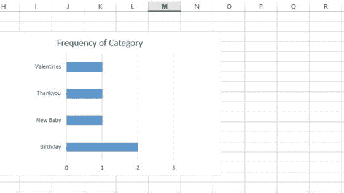
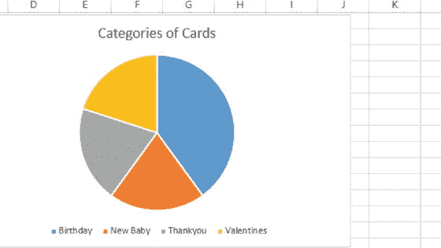
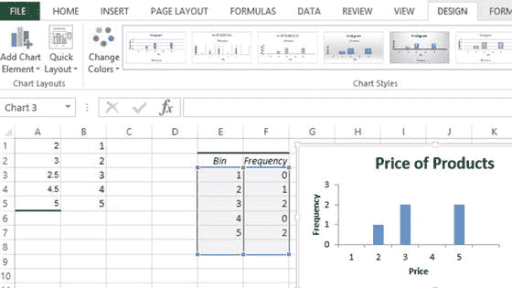
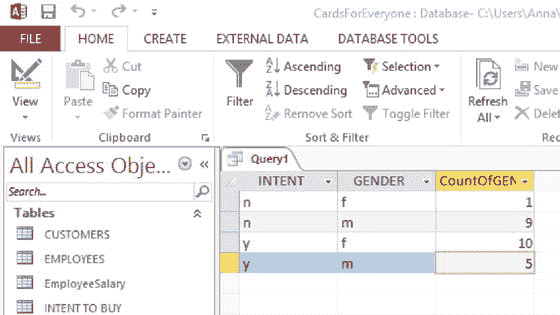
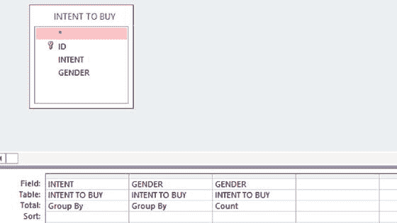
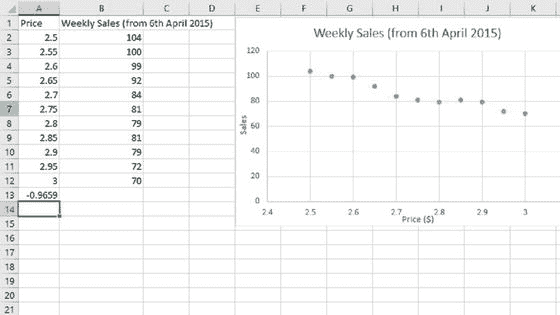
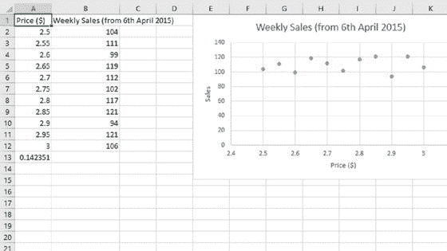
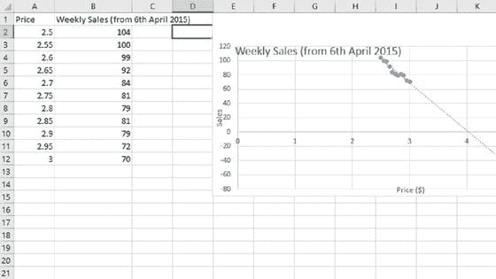

# 十三、分析您的数据

你不能按下一个按钮就指望所有的数据分析都自动进行。数据分析涉及对数据元素或结构的详细检查，是业务决策的基础。

以下部分介绍了数据分析技术，并描述了应用这些技术的最佳环境。即使是公认的数据分析技术也可能被错误地应用，知道要寻找什么陷阱是很重要的。

您必须选择技术来满足给定数据集的要求和您的小型企业的目标。如果您刚刚开始，尝试几种技术来感受它们是如何工作的可能是个好主意。制作数据库的副本或组装一个简单的测试数据库是明智的。这里考虑的工具可以在数据库包或电子表格中找到。

## 概观

数据分析可以分为两种主要类型——探索性和验证性。探索性数据分析包括应用给你数据“感觉”的技术，使你对可能发生的事情产生预感(或假设)。例如，你可能会有这样的印象，对某个营销活动反应良好的女性多于男性。验证性数据分析测试直觉，并以特定的准确度产生估计值。

在统计学中，区分了:

*   一个数据样本，从中可以预测总体的详细信息
*   假设为总体的数据

在本章中，除非另有说明，否则假设您已经获得了所有感兴趣的数据。关于使用样本的细节可以从本章末尾列出的进一步阅读材料中获得。

## 数据类型

数据分析应该总是从评估数据的特征开始。如您所见，数据并不完全相同，您必须仔细进行分析，即使测量结果看起来非常简单。在这一章中，我们将考虑三种类型的数据，每一种都向其前身添加了更多的属性:

*   名义上的
*   序数
*   比例

Note

定义测量级别的传统尺度是名义、顺序、间隔和比率。区间数据和比率数据的区别在于比率数据包含一个有意义且非任意的零。

### 标称数据

名义数据包括由简单命名系统区分的项目，例如 Cards for Everyone Inc .数据库中的卡片类别、customer 表的 address 列中的州名列表以及 Smart 独轮车公司数据库中的部件名称。每一项都不与其他任何一项重叠。为了简化收集和参考，标称项目可能会分配有编号，例如 1 =蓝色，2 =红色，3 =黄色。这些数字没有任何数学意义，因此不能相加。

### 序数数据

序数数据有一个自然的顺序，因此得名。这种数据经常用于要求人们表明其偏好的调查中。它们还被用来表示企业中的工资级别和其他许多方面。这些项目的顺序通常是通过给它们分配数字来表示它们的相对位置来定义的。也可以适当地使用字母或其他顺序符号。和标称数一样，你不能对序数进行算术运算:它们只显示顺序。此外，间隔序数不能进行比较。例如，在一个五分制的问题量表中，四和五之间的差异不能与二和三之间的差异相比较。

### 比率数据

在比例上，数字可以相加。倍数也可以比较。例如，一种产品可能比另一种产品贵一倍，因为价格是一个比率数字。

比率数据可以分为连续型和离散型。连续数据是沿着可以分成分数的连续尺度测量的，例如高度。连续数据允许无限精细的细分。

离散数据是通过一组固定值来衡量的，例如以年为单位的年龄。

## 频数分布

在第 10 章中介绍的频率分布对于显示数据的“形状”很有用，也就是说，数据值是如何分布的。频率是某件事情发生的频率。例如，在给定的一周中，每个人的卡公司可能在星期六上午销售一张卡，在星期六下午销售一张，在星期三上午销售一张。频率是周六两个，周三一个，全周三个。希望这不是正常销售的指标！频率分布可以应用于上一节中探索的每种类型的数据，如下一节所示。

### 离散比率数据

通过计算频率，我们可以制作一个频率分布表。例如，假设 Cards for Everyone Inc .的每个客户每月的卡销售额如下:

2, 3, 1, 2, 1, 3, 2, 3, 4, 5, 4, 2, 2, 3

相应的频率分布如表 [13-1](#Tab1) 所示。

表 13-1。

Example of a Frequency Distribution for Cards for Everyone Inc.

<colgroup><col> <col></colgroup> 
| 每位顾客每月的卡销售额 | 频率 |
| --- | --- |
| one | Two |
| Two | five |
| three | four |
| four | Two |
| five | one |

从表 [13-1](#Tab1) 中，我们可以看到一些有趣的事情，例如:

*   顾客每月购买两张卡是最常见的情况
*   只有一次顾客在一个月内买了五张卡

接下来是 Cards for Everyone Inc .的一个例子，一些客户下了更大的订单:

2, 8, 2, 5, 1, 6, 9, 3, 11, 5, 4, 12, 3, 15

为了避免 15 行的冗长表格，这些值被分成三组，如表 [13-2](#Tab2) 所示。

表 13-2。

Example of a Frequency Distribution with Grouped Values for Cards for Everyone Inc.

<colgroup><col> <col></colgroup> 
| 每位顾客每月的卡销售额 | 频率 |
| --- | --- |
| 1 – 3 | five |
| 4 – 6 | four |
| 7 – 9 | Two |
| 10 – 12 | Two |
| 13 – 15 | one |

一般来说，间隔的数量应该限制在大约 8 到 10。标签应该清晰，不能重叠。例如，如果您有 10-12 和 12-14，您将不知道将每月购买 12 张卡的客户放在哪里。

### 名义数据和顺序数据

标称和序数数据可以用频率分布来表示，如表 [13-1](#Tab1) 所示。然而，如表 [13-2](#Tab2) 所示，对名义数据和顺序数据进行分组是不正确的，因为它们之间没有数学关系。

表 [13-3](#Tab3) 显示了 Everyone Inc .卡产品表中卡类别的频率分布。即使频率为零，也应包括所有类别。

表 13-3。

Frequency Distribution for the Card Category in the Products Table of Cards for Everyone Inc.

<colgroup><col> <col></colgroup> 
| 卡的类别 | 频率 |
| --- | --- |
| 生日 | Two |
| 新生婴儿 | one |
| 谢谢你 | one |
| 情人 | one |

### 连续比率数据

将连续的比率数据表示为频率分布中的单个值既不容易也不准确。这是因为值之间的间隔可能非常小(可能无限小)。例如，价格的值可以用一美分来分隔，一个详细列出所有可能的美分值的频率的表将是巨大而无用的。因此，连续数据表示为间隔，例如$0 < Price ≤ $5, $5 < Price ≤ $10, etc. Such intervals must be written so that there is no ambiguity as to where any of the prices belong. For example, $5 belongs in the $0 < Price ≤ $5 interval. Table [13-4](#Tab4) 显示了 Cards for Everyone Inc .数据库的产品表中价格的频率分布。

表 13-4。

Example of a Frequency Distribution for Price Taken from the Products Table for Cards for Everyone Inc.

<colgroup><col> <col></colgroup> 
| 价格 | 频率 |
| --- | --- |
| 0 | Zero |
| 1 | one |
| 2 | Two |
| 3 | Zero |
| 4 | Two |

## 图表

创建频率分布表后，您可以构建条形图或饼图。

### 条形图

条形图是最常用的图表类型之一。它们用于显示和比较标称数据、序数数据、离散比率数据和分组连续比率数据的频率或其他度量。不同条形的高度与它们所代表的数据项的大小成比例。因为水平轴代表不同的类别，所以它没有刻度。垂直轴的刻度是测量单位。也可以水平绘制条形，当类别名称很长时，这对于名义数据特别有用。图 [13-1](#Fig1) 显示了表 [13-3](#Tab3) 中所列数据的横条图。MS Excel 等电子表格将直接从频率分布表中生成条形图。

图 13-1。

Horizontal bar chart for the Categories column in Cards for Everyone Inc.’s Products table

### 饼图

饼图用于可视化名义数据。它们也可用于顺序数据、离散比率数据和分组连续比率数据，尽管这种情况不太常见。它们显示了总数据在不同类别之间的分布情况，是将部分与整体联系起来的有效方法。当类别数量较少时，它们工作得最好。饼图的每个部分反映了每个类别占整个数据集的比例。零件通常按尺寸降序排列。

图 [13-2](#Fig2) 中的示例显示了与上表 [13-3](#Tab3) 中所示的人人卡公司的卡类别的频率分布相对应的饼图。因为有两张生日类别的卡片，所以这些卡片被分配了一块比其他卡片大一倍的饼。MS Excel 等电子表格将直接从频率分布表中生成饼图。

图 13-2。

Pie chart for the Categories column in Cards for Everyone Inc.’s Products table

### 直方图

直方图是条形图的一种特殊形式，其中的数据代表连续的比率数据。软件包通常会为您划分数据，而无需您构建频率分布。例如，Excel 2013 将输入数据列表和用户定义的条块列表作为直方图命令的输入。然后，它将数据放入这些箱中，并生成频率分布和直方图。图 [13-3](#Fig3) 显示了与上表 [13-4](#Tab4) 中的数据相对应的输入数据和 bin。Bin 2 对应于 1 <价格≤ $2，因此直方图上的“条”代表该区间。与条形图不同，在直方图中，两个轴都有刻度。这意味着条形的面积与所代表的量的大小成正比，而不仅仅是它的高度。

图 13-3。

Histogram for the data shown in Table [13-4](#Tab4) Note

要在 MS Excel 2013 中构建直方图，您需要安装软件附带的分析工具库。

## 描述统计学

描述性统计有助于总结您的数据。在接下来的章节中，将会考虑平均值和扩散的测量。

### 集中趋势测量

集中趋势或平均值的度量是有用的，因为它们可以用一个数字概括许多数据。例如，Cards for Everyone Inc .可能会发现，平均而言，每个客户每次交易都会购买两张卡。不可能每个顾客每次交易都恰好买两张卡；有的会多买，有的会少买。然而，每笔交易两张卡的数字是一个很好的指标，表明了总体的卡购买量。

平均值有三种不同的定义，即均值、中值和众数。每一项都是用不同的方法计算的，当应用于同一组数据时，通常会产生不同的值。

选择使用哪个定义部分取决于数据的类型。理解每个统计数据告诉你什么是非常重要的，这样你就可以做出最适合你正在进行的分析的明智选择。

#### 这人

默认情况下，人们在日常语言中谈论平均值时通常指的是平均值。一组数据项的平均值计算如下

Adding all the data items.   Dividing this total by the number of data items.  

当数据项分布相对均匀，没有特别高或特别低的值时，最好使用平均值。此外，对于名义数据或顺序数据，平均值不是适当的平均值，因为不可能对这些数据进行数学运算。平均值可应用于离散比率数据，尽管结果需要四舍五入到最接近的整数。

如果一组数据项包含少量相对较高或较低的值，则作为一个整体，平均值将不是数据项的典型值，因为这些非典型值将对平均值有相对较强的影响。

在第 10 章中，以下示例用于定义异常值。数字序列显示了卡为每个人公司的每个客户的每月卡销售额:

2, 4, 9, 5, 10, 2, 7, 6, 8, 3, 104

平均值= 160/11 = 14.55(或最接近卡片的 15)。这个平均数不能很好地反映数字的顺序，因为除了一个以外，所有的数字都较低。最后一个数字异常高，对计算有不成比例的影响。

Note

在 MS Access 中，使用`Avg`命令计算平均值。

#### 中间值

计算一组有序数据的平均值的最合适的方法是使用中位数或众数。中值是指一组数据中的中间值，这些值按大小从最小到最大的顺序排列，反之亦然。当数据集中有奇数个值时，中间值很容易找到。当有偶数个值时，两个中心值之间的中点就是中间值。

当数据包含相对较高或较低的值时，中位数是衡量比率数据平均值的好方法，因为这些值对结果有相同的影响，这与平均值不同。

例如，上一节中用于显示 Cards for Everyone Inc .每个客户每月卡销售额的数字序列为:

2, 4, 9, 5, 10, 2, 7, 6, 8, 3, 104

平均值为 15。相比之下，可以通过首先对序列进行排序(此处为升序)来找到中值:

2, 2, 3, 4, 5, 6, 7, 8, 9, 10, 104

因为有 11 个数字，所以中位数在第六位，也就是数字 6。请注意，6 的中值比 15 的平均值更能代表序列的中心。

#### 模式

与平均值和中值不同，该模式可应用于名义数据。它还可以应用于顺序数据和比率数据(离散数据和分组连续数据)。众数是在一组数据中出现频率最高的值。因为它是最常见的值，所以它具有代表性或典型性。如果几个值同样常见，则一组数据中可能有一个以上的模式。在表 [13-3](#Tab3) 所示的 Everyone Inc .的卡类别的频率分布中，模式(或模式类)是生日，因为该类别出现的频率最高。

### 传播的量度

分布的度量用于描述一组数据的可变性。目的是提供一个概念，说明所选的集中趋势度量(平均值、中值或众数)代表数据的程度。如果数据集中的值的分布很大，则集中趋势的度量不像数据的分布很小时那样具有代表性。这是因为较大的分布表明各个数据项之间可能存在较大的差异。

#### 范围

范围是一组数据中最高值和最低值之间的差值，适用于顺序数据以及离散和连续比率数据。例如，上一节中用于显示 Cards for Everyone Inc .每个客户每月卡销售额的数字序列为:

2, 4, 9, 5, 10, 2, 7, 6, 8, 3, 104

最大值是 104，最小值是 2。这导致范围为 104 - 2 = 102。虽然使用范围作为分布的度量是有限的，但它确实设置了数据项的值的边界。

#### 四分位数和四分位数间距

四分位数通过将一组数据分成四份来告诉我们它的分布情况，就像中位数将它分成两半一样。四分位数是有序数据的最佳分布度量，也是离散比率数据的有用分布度量。

例如，上一节中用于显示 Cards for Everyone Inc .每个客户每月卡销售额的数字序列为:

2, 4, 9, 5, 10, 2, 7, 6, 8, 3, 104

按升序排列，至于中位数，这是:

2, 2, 3, 4, 5, 6, 7, 8, 9, 10, 104

四分位数如下:

*   第一个四分位数(Q1)是标记序列中四分之一路径的数据项。在本例中，这是第三个数据项 3。
*   第二个四分位数(Q2)是标记序列中间位置(中位数)的数据项。在本例中，它是第六个数据项 6。
*   第三个四分位数(Q3)是标记序列中四分之三部分的数据项。在本例中，这是第九个数据项 9。

对于偶数个数据项，四分位数的计算方法是取每个四分位数周围两个数据项的和，然后将它们减半。

表示四分位数的一种常见方式是四分位数间距。四分位数范围描述了第三个四分位数(Q3)和第一个四分位数(Q1)之间的差异，告诉我们分布中数据项的中间一半的范围。因此，在前面的例子中，四分位数间距= Q3 - Q1 = 9 - 3 = 6

#### 方差和标准差

对于比率数据，分布的度量是方差或标准差。

差异的计算方法如下:

Adding the squared differences between each data item and the mean.   Dividing by the total number of data items.  

对差异求平方会移除负值，并对远离平均值的值给予不成比例的权重。因此，如果数据集中的值分散开，方差将是一个很大的数字。相反，如果分数接近平均值，方差将是一个较小的数字。但是，方差的单位与数据集中的值不同，这意味着很难解释它的值。

计算标准偏差(取方差的平方根)提供了一个与所考虑的数据集具有相同单位的结果。尽管如此，分析方差在一些统计分析中是极其重要的，这将在本章末尾的进一步阅读中讨论。

Note

MS Access 提供了计算方差(`Var`)和总体标准差(`STDEV.P`)的函数。

## 交叉列表和分段

交叉制表有助于您理解两列或多列数据之间的关系。例如，假设 Cards for Everyone Inc .的经理 Pat 想回答这样一个问题:“男性和女性再次购买的意愿有什么不同吗？”假设已经进行了一项调查，询问参与者是否会再次从该企业购买(y 或 n)以及他们的性别(m 或 f)，可以设置一个查询，如图 [13-4](#Fig4) 所示。输出如图 [13-5](#Fig5) 所示。

图 13-5。

Query output for a cross-tabulation between Intent and Gender for Cards for Everyone Inc.

图 13-4。

Query design for a cross-tabulation between Intent and Gender for Cards for Everyone Inc.

在图 [13-5](#Fig5) 中，您可以看到 10 名女性做出了积极回应，而男性只有 5 名。

分割数据(在第 12 章中讨论)和应用数据分析工具的潜力非常大，例如前面章节中讨论的工具。两个例子是比较不同州和不同年龄组的卡片销售情况。Cards for Everyone Inc .可以根据购买频率进行细分，并奖励忠诚的购物者。

## 文本分析

在调查中，通常会有一些开放式问题，让受访者填写自己的答案。当样本较大时，很难分析每个回答者的答案。如果你有文本数据，那么有一个文本分析工具是很有帮助的。顶级工具并不便宜(如 NVivo)，但通常一个词云会提供一些有用的信息。一个特别著名的工具是 Wordle.net。例如，假设 Cards for Everyone Inc .向其调查对象提出了一个开放式问题，如“您还有其他反馈吗？”并收到了以下五份答复:

快速服务

卡片不错，质量很好

良好的响应时间，非常快

高质量的卡片

友好、高效的服务

相应的输出如图 [13-6](#Fig6) 所示。

图 13-6。

Output from wordle.net for the Cards for Everyone Inc. survey

对每个词的强调是基于它在调查中的出现和位置。试用这样的软件包将有助于你有效地分析你的文本。

## 相关性和散点图

当您想要了解两列连续比率数据之间的关系时，可以使用相关性。例如，Cards for Everyone Inc .可能想知道名为“Paris by Moonlight”的卡的销售与其价格变化之间的关系，因为他们怀疑他们一直在以相当低的价格出售该卡，并想知道提高其价格对销售的潜在影响。

*   如果相关性为 1，则卡的价格与其销量完全正相关，同涨同跌。
*   如果相关性为 0，则这两个变量之间没有相关性。
*   如果相关性为-1，则卡的价格和销售额完全负相关，这意味着一个卡的价值越高，另一个卡的价值越低。

如果相关性的绝对值大于 0.5，变量之间的相关性通常被认为是“显著的”，这意味着观察到的相关性不太可能是偶然发生的。

Note

根据给定的概率对相关数据进行精确的显著性检验是很简单的。请参阅本章末尾的参考资料，以便进一步阅读。

假设 Cards for Everyone Inc .从 2015 年 4 月 6 日开始每周记录“巴黎月光”卡的价格和相应销售水平的微小变化。以下示例提供了两种可能的结果。图 [13-7](#Fig7) 显示了《月光下的巴黎》价格的逐渐上涨和销量的逐渐下降。

图 13-7。

Example of a high negative correlation between Price and Sales from Cards for Everyone Inc. Note

价格是独立的列；sales 是因变量，因为它依赖于 price 的值。

通过使用 MS Excel 中的`CORREL`函数获得的相关性(本例中为`=CORREL (A2:A12,B2:B12)`)给出了非常高的负相关性-0.97，如图 [13-7](#Fig7) 的单元格 A:13 所示。这种相关性表明，即使价格小幅上涨也会对销售产生负面影响，对利润的影响也应仔细考虑。

另一方面，图 [13-8](#Fig8) 所示的示例显示单元格 A:13 中的相关性非常低，为 0.14。这表明几乎没有证据表明价格上涨会导致需求下降。然而，由于这种相关性低于 0.5，在做出任何确定的结论之前，还需要进行更多的调查。

图 13-8。

Example of a low positive correlation between Price and Sales from Cards for Everyone Inc.

你应该小心使用相关性。相关性计算仅适用于遵循直线的关系。因此，相关性最好用散点图来表示。散点图在第 10 章中介绍，用于显示来自同一对象或个人的成对比率数据之间的关系。一个点代表每一个人或每一个对象(在本例中为卡片),它是根据两个轴(在本例中为价格和销售额)上的度量来定位的。

通过分析构成散点图的点的模式，您可以直观地看到两组测量值之间是否存在相关性计算所指示的关系，或者点的线是否是非线性的，从而使相关性计算变得不可靠。此外，相关性并不意味着一件事导致另一件事(可能有其他原因导致数据具有良好的相关性)。

## 线性回归

回归是测试列之间关系的一种比相关更准确的方法，用于预测未来值。例如，在销售“月光下的巴黎”卡的情况下，在实际观察到卡的价格变化之前，可以使用回归来预测卡的销售，从而避免潜在的低销售期。

价格并不是影响《月光下的巴黎》销量的唯一因素——一年中的时间、经济状况等等。，可能也有关系。然而，如果我们有兴趣预测未来一小段距离(即轻微的价格上涨)，那么几乎所有的非线性函数都可以用一条直线来近似。

当在回归中使用一个独立的列时，它被称为简单回归；当使用两个或多个独立的列时，称为多元回归。线性模型假设列之间的关系是直线关系。

要实现预测，首先要像上一节一样在散点图上绘制数据。独立列和从属列之间的理想相关性介于 0.5 和 0.99 之间，或者介于 0.99 和 0.5 之间。我们的相关性是-0.97。

为了做出这些预测，必须从散点图中出现的数据绘制一条回归线。图 [13-9](#Fig9) 与上面图 [13-7](#Fig7) 所示的散点图相同，增加了一条拟合数据的回归线。

图 13-9。

A regression line fitted to the data in Figure [13-7](#Fig7) covering price and sales from Cards for Everyone Inc.

从图 [13-9](#Fig9) 中，你可以看到，如果价格提高到 3.25 美元，预期的销售价值大约是 60 张卡片。

回归线是其自身与散点图上每个数据点之间距离最小的线。数据点到回归线的距离称为残差。寻找最佳拟合线(即最小化所有残差大小的线)的典型过程称为最小二乘法。

这种计算通常使用计算机软件进行。例如，可以使用趋势线工具在 MS Excel 2013 中直接在散点图上绘制回归线。回归线几乎总是包含误差项，因为现实世界并不完美。

以下假设是在线性回归中做出的。如果您的数据不符合这些条件，您可能需要考虑一个更复杂的模型:

*   这两列之间的关系是线性的
*   回归线周围的方差对于垂直轴上的所有值都是相同的(在本例中为 Sales)
*   你的每一个观察都是相互独立的(这里，给定价格下一天的销售数量不应该取决于以前的结果)
*   残差不应该显示模式，如果存在模式，则表明两列(在本例中为价格和销售额)之间的关系不是线性的，需要更复杂的回归形式
*   残差应该与一个模态类合理对称(即，它们遵循正态分布)

## 验证性数据分析

验证性数据分析使用传统的统计推断工具来评估探索性分析的观察结果在多大程度上是偶然发生的。目的是从总体人口的随机数据样本中得出结论。使用的两种方法的例子是:

*   置信区间—估计汇总统计的精确度，如平均值、标准偏差等。例如，95%的置信区间保证了在 95%的时间内摘要统计的真实值将被包括在内。
*   假设检验——评估数据组之间的差异(如平均值、方差等)。)是偶然发生的或统计上显著的结果(即真正的差异)。推论的过程从一个中立的立场开始——通常被称为“零假设”——这个立场一般被设定为“没有区别”。

关于验证性分析的细节，请参考本章末尾提供的进一步阅读材料。

## 摘要

在任何数据分析练习中，重要的是从评估数据的特征开始。考虑到这一点，表 [13-5](#Tab5) 列出了本章中描述的每一种技术及其适用的数据类型。

表 13-5。

Summary of Data Analysis Techniques and the Types of Data They Can Be Applied To

<colgroup><col> <col></colgroup> 
| 技术 | 数据类型 |
| --- | --- |
| 图表 |   |
| 条形图 | 名义数据、顺序数据、离散比率数据和分组连续比率数据 |
| 圆形分格统计图表 | 名义数据、顺序数据、离散比率数据和分组连续比率数据 |
| 柱状图 | 连续比率数据 |
| 集中趋势测量 |   |
| 平均 | 连续比率数据 |
| 中位数 | 序数数据和比率数据 |
| 方式 | 名义数据、顺序数据、离散比率数据和分组连续比率数据 |
| 传播的量度 |   |
| 范围 | 名义数据、序数数据和比率数据 |
| 四分位数和四分位数间距 | 有序和离散比率数据 |
| 方差和标准差 | 连续比率数据 |
| 交叉列表和分段 | 名义数据、顺序数据、离散比率数据和分组连续比率数据 |
| 文本分析 | 文本 |
| 相互关系 | 连续比率数据 |
| 线性回归 | 连续比率数据 |

## 进一步阅读

《商业和经济统计》，作者:保罗·纽博尔德、威廉·卡尔森和贝蒂·索恩，培生教育公司；第八版，平装本，2012，ISBN-13: 978-0273767060。