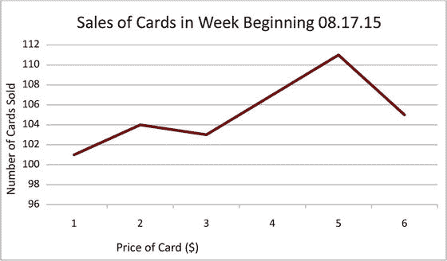
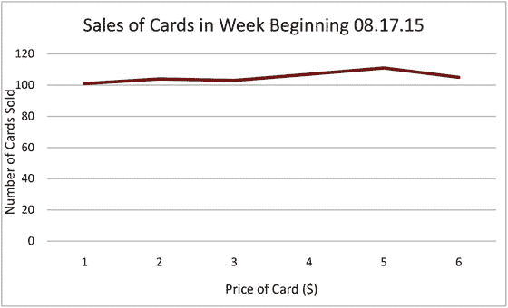
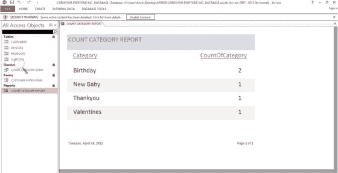
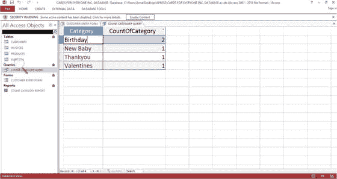

# 十四、报告您的小型企业数据分析

小型企业定期向内部决策者、外部顾问、融资机构、会计师和许多其他人报告数据分析的结果。数据库报告包含对决策有用的信息，这些信息应该与业务目标直接相关。

报告的性质在很大程度上取决于分析的目的以及分析结果所针对的受众。分析结果往往被用来做出决策，例如:

*   重复分析，但进行修改
*   一起执行另一个分析
*   影响你的小企业的杠杆

Note

目标、杠杆和指标包含在第 5 章中。

该报告应提供足够的细节，以便能够从同一组数据中重复得出结果。

## 写作风格

写作风格应该尽可能的直截了当，这样读者就可以专注于分析而不会分心。一方面，非常正式或华丽的语言最好避免。另一方面，过度放松或非常简短的语言也是不合适的。此外，语法和拼写错误会偏离报告的主线，所以要注意改正。还应避免使用高度技术性的语言。

在报告中，整数通常被写成数字，而不是在文本中拼写出来。例如，“人人卡公司今年有 85 种新型卡”，而“人人卡公司今年有 85 种新型卡”数字应该保持简单，这可能意味着:

*   在不需要确切数字的情况下，四舍五入以避免使用小数位；例如，2 而不是 1.99
*   用文字说明单位(例如，400 万美元而不是 4，000，000 美元)

文本和图表之间应该有一个良好的平衡，因为有些读者对图像的反应更好，而有些读者对文本的反应更好。一个好的平衡会适合每个人。

## 你报告的结构

请记住，您要向其汇报的人员和组织可能有不同于此处建议的要求。然而，这些基本要素应包含在大多数报告中:

Introduction   Body   Conclusion(s)/Discussion   Appendix/Appendices  

### 导言

简介应包括以下信息，按照给定的顺序排列:

*   分析和数据的简要概述，以及任何相关的背景问题
*   数据分析提出的主要问题和结论摘要
*   这些问题的答案和下一步行动的总结
*   报告其余部分的简要概述

报告您没有预料到的发现是合理的，否则这些发现被称为次要发现。然而，你要回答的问题应该优先考虑。

### 报告的正文

报告的正文可以用不同的方式来理解。

它可以分为几个部分，与导言的级别相同，标题如下:

*   方法
*   分析
*   结果

或者，报告的主体可以形成一个单独的部分，有时称为“分析”，用一个小节来回答导言中提出的每个问题。在每个小节中，对每个问题进行了分析，并给出了结论。

#### 数据和方法

一份报告应该以这样一种方式来写，让阅读它的人清楚地知道你从哪里开始。你还应该报告分析的时间尺度。

对分析中使用的数据给出清晰的细节是有帮助的。例如，同意参与调查的客户可能在重要方面与选择不参与的客户不同。例如:

*   他们可能过着有更多空闲时间的生活方式(可能偏向退休人员)
*   那些参与者可能处于满意度的两端——要么对产品非常满意，要么非常不满意

这两种情况都可能导致结果的偏差。

此外，最好描述用于分析数据的软件，因为不同的包之间的结果可能略有不同。

#### 结果

结果部分应该简明扼要。避免证明这些发现——这留给讨论部分。结构使信息更容易吸收，并可以采取多种形式。例如，可以从最一般到最具体，或者从最重要到最不重要来呈现结果。

你应该从你的分析中提供证据(例如通过使用表格或图表)来支持每一个观点，尽管详细的证据以及其他额外的材料最好放在附录中。

开始结果部分的一个好方法是使用一个表格，用数字汇总基础数据。这样的表格为读者提供了一个清晰的数据概念，以及如何与更广泛的人群进行比较。这通常是报表中的第一个表。表 [14-2](#Tab2) 说明了表 [14-1](#Tab1) 中所列数据的潜在汇总表，该表由[第 1 章](01.html)重述而来。

表 14-2。

Summary Products Table

<colgroup><col> <col> <col></colgroup> 
| 列标题 | 范围 | 平均 |
| --- | --- | --- |
| 价格(美元) | 2.00 ≤价格≤ 5.00 | Three point four |
| 可用数量 | 5 ≤可用数量≤ 11 | nine |

表 14-1。

Basic Product Table from [Chapter 1](01.html)

<colgroup><col> <col> <col> <col> <col> <col></colgroup> 
| 产品 ID | 供应商 ID | 产品名称 | 种类 | 价格(美元) | 可用数量 |
| --- | --- | --- | --- | --- | --- |
| Eleven | One hundred | 猫 | 生日 | Two | five |
| Twenty | Two hundred | 玫瑰 | 谢谢你 | Three | eight |
| Twenty-three | Two hundred | 船 | 生日 | Two point five | Ten |
| forty-two | Three hundred | 心 | 情人 | Four point five | nine |
| Sixty-one | Three hundred | 兔子 | 新生婴儿 | Five | Eleven |

Note

在表 [14-1](#Tab1) 中，可用数量四舍五入到最接近的整数。

这一节的措辞必须附有高质量的图表，以便读者能容易地理解论点。有关表格和图形的更多信息，请参见本章的最后一节。

如果您的业务目标起草得很仔细，您的数据库是根据这些目标设计的，并且您的数据收集得很有效、很干净，那么您的分析应该会提供可靠的结果。

### 讨论

你分析的目的是产生可以考虑和采取行动的结果。讨论部分不是一个你可以放入所有你在报告的前三个部分放不下的信息的地方。如果你已经以清晰的方式陈述了你的方法和结果，讨论部分可以让你以一种读者可以自己拿主意的方式陈述结果。

首先讨论主要分析的含义。在分析过程中得出的任何结果都可以在以后提及，以免转移对业务目标的关注。此外，你应该提及数据收集、分析或解释的任何缺点或优点。将这些问题公之于众为你提供了一个为它们辩护和/或推荐克服它们的方法的机会。

该报告应包括与结果相关的不确定性的讨论。这种不确定性可能以多种方式出现，向读者展示这些不确定性可以确保你已经考虑到了分析的局限性。可能出现的不确定性类型有:

*   由于无法解释数据中所有潜在的变异来源而导致的不确定性
*   数据收集、编码和分析过程中可能出现的未知错误导致的不确定性
*   不确定性:数据中的发现与分析时一样

当出现这些或任何其他不确定性时，提供讨论是有用的。

### 结论

将你的结论限制在你的分析所支持的范围内。重要的注意事项如下:

*   对积极和消极的发现给予同等的关注。
*   根据事实和逻辑得出你的结论。
*   做因果联系和关联的时候要小心。例如，正如在第十三章中提到的，数据库表中两列之间的相关性并不意味着一个导致另一个。

## 表格和图表

呈现数字数据有三种主要方法:

*   将它融入正文中
*   在表格中单独呈现
*   构建一个图表

确定哪种方法是最好的取决于您要处理的数据量及其复杂性。相关的文字应该描述数据揭示的主题，但不应该重复图表中描述的内容。

当只有两个数值需要比较时，数字最好作为文本的一部分呈现。例如:

Cards for Everyone Inc 的女性顾客定期购买贺卡，而男性顾客的比例为 62%

如果你在讨论三个或更多的数字，用表格往往更合适。表格是展示数据的有效方式:

*   当您要展示一些数字时(一个表格中的数字太多会让人感到困惑)
*   当精确的值对你的论点至关重要，而一个图表不能表达同样的精确程度时。例如，当重要的是读者知道结果是 2.48 而不是 2.45 时

如果您希望引起对数据模式的注意，最好在表的列中显示，而不是在行中，因为向下读取一列比读取一行更容易。决定哪一列包含最重要的趋势，并以此为焦点来构建表格。如果不止一列同样重要，那么包含两个或多个简单的表通常比使用一个更复杂的表更好。

根据数值大小(例如从大到小)对列中的数字数据进行排序通常会有所帮助，除非您想要突出显示数据中的特定模式或趋势。有效表格呈现的其他要点如下:

*   所有表格都应包含一个描述性标题，其中包含足够的细节，读者无需查阅随附的文本即可理解内容，标题中应包含计量单位(如百分比、总数和频率)
*   可以使用线条和/或粗体文本将标题与数据主体分开
*   特定行可以突出显示/加阴影以引起注意
*   应该避免列与列之间有很大的间隙，因为这样很难一行一行地阅读

图形和图表是呈现大量数据的一种特别有效的方式，但也可以用来代替表格来呈现较小的数据集。图表和图形可以用来快速说明数据。二维图表通常比三维图表更容易阅读。一般来说，图表应该:

*   始终显示标题和轴标签，并在必要时提供一个键
*   显示测量单位(如百分比、总数和频率)
*   尽可能使用天平
*   使用不影响数据的细微网格线
*   在条形图、直方图和饼图中使用颜色或阴影图案来反映正在绘制的数据类别中的任何自然序列，以便相邻区域的颜色从暗到亮渐变，反之亦然

以图表的方式呈现数据可能需要一些预先考虑，以便选择最佳的比例。例如，数据的最佳视图可能来自于从非零点开始任一轴。图 [14-1](#Fig1) 显示了人人卡公司的销售数据图，其中纵轴从零开始。图 [14-2](#Fig2) 显示了相同的数据，但是垂直轴从 96 开始。

图 14-2。

An example of sales data from Cards for Everyone Inc. presented on a graph with the vertical axes starting at 96

图 14-1。

An example of sales data from Cards for Everyone Inc. presented on a graph with the vertical axes starting at zero

数据中的趋势在图 [14-2](#Fig2) 中更容易看到。在这种情况下，应该清楚地标记起始值，将读者的注意力吸引到文本中的非零起始值上。

## 直接从数据库生成报告

报告使文档可以从数据库表或查询中设计出来，这些表或查询可以以电子形式轻松共享，也可以在远离计算机的地方查看。例如，报告可以用来总结哪些产品卖得好，哪些客户一直在购买。图 [14-3](#Fig3) 显示了最初出现在[第 1 章](01.html)中的查询，图 [14-4](#Fig4) 显示了相应的报告，该报告也出现在[第 1 章](01.html)中。

图 14-4。

Sample report for Cards for Everyone Inc.

图 14-3。

Sample query for Cards for Everyone Inc.

有关从数据库生成简单报告的详细信息，请参见本书末尾的附录。

## 案例研究和描述性报告

不是所有的数据都会涉及到分析数字。你报告的一部分可能会描述事件。例如,"连接南方"可能在其报告中包括一些案例研究，描述其询问者面临的问题以及工作人员如何帮助他们。此类案例研究将揭示团队在每项调查中投入的精力，这些精力很难通过调查者数量、每个调查者的电话数量等数量分析来捕捉。

为了保护查询者的匿名性，任何姓名和具体细节都应小心隐藏。通常，仅仅删除姓名和地址是不够的。某人的特殊情况可能意味着他们很容易被认出来——例如，某人有着不寻常的职业。每个案例研究都应该由团队中的许多人进行校对，以确保任何识别特征都被掩盖。

## 作为一个团队制作报告

与数据库和一些电子表格一样，团队报告通常需要几个人同时访问。最有效的方法是使用云，这将在第 18 章中介绍。过去的趋势是通过电子邮件交换报告的版本，这可能会导致版本混淆。

当几个人对报告做出贡献时，你需要确保每个部分都是一致的。这包括语言以及字体样式和字体大小。请至少一个没有参与撰写的人通读报告是有用的，以便找出不一致的地方。

当报告准备好时，以只读格式保存它，这样就不能对它进行未经授权的更改。PDF 格式是一个很好的选择，因为任何人都可以使用免费的 PDF 阅读器查看它，不管他们使用的是什么操作系统。

## 摘要

你的数据分析报告应该简洁明了，有很好的文字和图表组合。你分析的目的、结果和结论都应该清晰。该报告的主要目的是促进基于您的业务目标的有效决策。