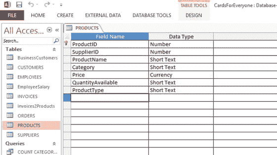

# 十五、根据报告采取行动

数据分析报告，如果有效地执行，可以让您了解您的企业如何实现其目标。如果需要变革，变革越快越好，这样你的企业就能尽可能保持竞争力。这些操作可能涉及到对数据库进行永久更改。相比之下，[第 16 章](16.html)考虑了如何在不对数据库做任何改变的情况下响应一次性的外部数据请求。

## 概观

为了对报告进行操作，您的数据库设计必须灵活，并且您必须能够使数据库在短时间内脱机。需要培训员工使用调整后的数据库:培训在[第 20 章](20.html)中介绍。

以下部分使用 Cards for Everyone Inc .中的一个示例，描述了响应报告时更改数据库的可能方法。

## 例如:人人卡公司。

图 [15-1](#Fig1) ，重述自[第 12 章](12.html)，显示了每个人公司数据库的卡片设计，作为提醒。正如在[第一章](01.html)中所描述的，Cards for Everyone Inc .出售在其网站上展示的卡片。该数据库包含客户、发票、产品和供应商的表，以及员工及其工资的表。每个客户购买的每个产品的数量存储在 Invoices2Products 表中。

图 15-1。

Database design for Cards for Everyone Inc.

假设 Cards for Everyone Inc .的一份报告提供证据表明，一年后卡片销售趋于平稳，表明业务增长停滞不前。经理帕特想调查并找出销售不景气的原因。

Pat 认为，Cards for Everyone Inc .的主要吸引力在于客户可以在任何地方快速地在线购买卡片，并且在网站上很容易搜索到这些卡片。她想回顾数据收集和数据分析，以下降的销售额为焦点，以便找出正在发生的事情。

## 进一步的数据收集和分析

帕特组织了一次顾客满意度调查，以判断销售额下降的原因。调查的反馈表明，与商业街商店或其他互联网企业提供的卡片相比，顾客发现 Cards for Everyone Inc .的卡片选择相当有限。顾客也想设计他们自己的卡片——例如从照片或个人艺术作品中设计。此外，一些客户对信用卡缺货、订单被延迟或取消表示愤怒。

Pat 尝试了几种方法来提高销售额并留住客户:

*   通过尝试新的供应商来增加卡片的选择
*   通过供应商提供新的服务，这些供应商能够根据照片和图纸制作您自己的卡片
*   出售与卡片相关的物品，如邮票、包装纸、礼品标签和小礼物
*   分析全年的销售情况，以确定何时是增加库存的最佳时机，并提高企业对订单的响应能力

定期重复数据分析，以评估这些额外步骤对销售的影响。针对人人用卡公司的新重点，对数据库进行了一些更改，包括:

*   新列的添加
*   新表格的添加
*   拆分现有表格
*   更改现有查询
*   改变现有的形式

这些步骤将在接下来的章节中进行说明。

### 添加新列

由于产品的类型将不再局限于卡片，因此在 Products 表中增加一列来进行区分将会很有用。ProductType 列被添加到 Products 表中，该表可以接受这些值—卡片、邮票、包装纸、礼品标签、礼品和个性化。

Note

确保在向表中添加新列时，遵循“进一步检查”一节中的第 7 章中概述的规则是很重要的。

通过转到数据库中有问题的表的设计来添加新列。在 MS Access 中，就是进入设计视图并添加列名和数据类型，如图 [15-2](#Fig2) 所示。

图 15-2。

Adding a new column called ProductType to the Products table of the Cards for Everyone Inc. database Note

关于创建和查看表格的具体细节可以在本书末尾的附录中找到。

图 [15-2](#Fig2) 中表格显示的 ProductType 列的数据类型为短文本。为了保持数据尽可能的“干净”,最好将产品类型列的数据类型设置为查找，并包括每个可供选择的产品类型，如[第 10 章](10.html)所述。

在这一阶段，ProductType 列已经添加到 Products 表中，但是还没有填充数据。如果没有将 ProductType 列引入数据输入表单、查询、报告等，它将保持未使用状态。对 Pat 来说，向她的团队解释已经做出的改变以及解释为什么有必要做出改变是很重要的。

在此示例中，将 ProductType 列添加到数据库需要四个操作:

*   需要将新的供应商添加到供应商表中
*   相应的产品需要添加到 products 表中，并带有它们的 ProductID 和 SupplierID
*   对于每个新产品，需要添加相应的产品类型
*   需要为 products 表中在添加 ProductType 列之前就存在的产品填充 ProductType 列；这些都有 ProductType = 'Card '

假设 Cards for Everyone Inc .选择了三家新供应商——Art and Stuff(销售卡片和包装纸)、Glittery Fun(销售卡片、包装纸和小礼物)和 My Designs(利用照片和图画制作卡片)。供应商表将更新为三个新的供应商，如图 [15-3](#Fig3) 所示。

图 15-3。

Adding new suppliers to the Suppliers table of the Cards for Everyone Inc. database

许多这些新的卡片没有一个特定的类别，里面是空白的:一个新的类别被引入来包括这样的产品，称为所有场合。这一类别可适用于卡片以外的产品，如包装纸。

Cards for Everyone Inc .可以代表其客户在任何给定时间订购多达 100 张的个性化卡片:因此在 QuantityAvailable 一栏中最多有 100 张。

产品表将被更新，如图 [15-4](#Fig4) 所示，每个新产品都有相应的产品类型。

图 15-4。

Populating the ProductType column with new entries in the Products table of the Cards for Everyone Inc. database

在图 [15-4](#Fig4) 中，您可以看到在添加 ProductType 列之前，所提供的产品没有 ProductType。如图 [15-5](#Fig5) 所示，这可以通过向这些行中的每一行添加 ProductType = 'Card '来纠正。

图 15-5。

Completing the ProductType column for earlier entries in the Products table of the Cards for Everyone Inc. database

随着业务的增长，手动完成如图 [15-5](#Fig5) 所示的变化是不太可能的。你需要将它们自动化。更新查询可用于一次自动更改一列中的几个值。本书末尾的附录中详细介绍了建立一个简单查询所需的过程。下面是一个简短的更新查询示例。

在开始此过程之前，请备份您的数据库。然后有两个步骤。

第一步是选择要更新的列中的数据。您可以通过指定所需的标准来做到这一点。图 [15-6](#Fig6) 显示了一个例子，它要求 ProductType 的所有空值——即 ProductType 的所有未被填充的值。它还要求输入 ProductName，以便可以识别 ProductType 的每个实例。检查查询是否返回了正确的行。否则，您需要调整标准陈述。

图 15-6。

Query to select Null values in the ProductType column for the Products table of the Cards for Everyone Inc. database

一旦确定选择了相关列的正确值，第二步就是应用更新查询。在 MS Access 2013 中，从“查询类型”部分的“设计”选项卡中选择 UpdateQuery。图 [15-7](#Fig7) 展示了一个更新查询，它用值‘Card’替换 ProductType 列中的所有空值。

图 15-7。

Update query that completes the ProductType column for earlier entries in the Products table of the Cards for Everyone Inc. database

### 添加新表格

决定在 Cards for Everyone Inc .的数据库中添加一个名为 Orders 的新表，以便 Pat 可以密切关注库存水平。新表包含以下列:

*   产品 id
*   供货商编号
*   预测或梦想数量
*   NextOrderDate

在下新订单之前，需要检查 Products 表中的 QuantityAvailable 列。

创建新表非常简单。需要采取第 7 章中的步骤，并插入图 [15-8](#Fig8) 中所示的所需关系。订单表和数据库的其余部分之间有两种关系:

*   订单和产品之间的一对一关系。每种产品的库存都是单独考虑的。每当下新订单时，它只适用于一种产品。相反，当产品需要重新订购时，只需下一个订单。
*   供应商和订单之间的一对多关系。每份订单都交给一个供应商。但是，一个供应商可以接收多个订单。

图 15-8。

The relationships of the Orders table Note

数据库关系在第 7 章中有详细介绍。

与上一节中的新列一样，如果新表没有被填充和合并到表单和查询中，它将不会被使用。

### 拆分表格

Pat 决定将 QuantityAvailable 列从 Products 表中删除，放在 Orders 表中以避免混淆。做出这一决定的原因是 QuantityAvailable 列中的数据与订单直接相关，但与产品不直接相关。诸如此类的观察结果将在第 7 章的[章节“进一步检查”中讨论。拆分表有许多步骤，当您对导入和导出数据越来越熟悉时，拆分会变得越来越容易。](07.html)

Note

本书末尾的附录中介绍了数据的导入和导出。

有许多方法可以将可用数量从 Products 表移动到新创建的 Orders 表中。这里有一个建议:

Back up your database   Create a new table called Orders with the ProductID, SupplierID, QuantityAvailable, PredictedOrderAmount, and NextOrderDate columns.   Export the data from Products to a spreadsheet.   On the spreadsheet, delete all the columns in Products except ProductID, SupplierID, and QuantityAvailable, as shown in Figure [15-9](#Fig9).

图 15-9。

Exported and cropped data from the Products table of the Cards for Everyone Inc. database   Create two new columns on the spreadsheet entitled PredictedOrderAmount and NextOrderDate, as shown in Figure [15-10](#Fig10).

图 15-10。

The PredictedOrderAmount and NextOrderDate columns added to the Orders table   Add the data to the PredictedOrderAmount and NextOrderDate columns, as shown in Figure [15-10](#Fig10). (You can do this after the data has been imported to the Orders table in your database if you prefer.)   Import the data from the spreadsheet to the Orders table and ensure that it has moved successfully.   Delete the QuantityAvailable column from the Products table.  

您需要仔细研究拆分“产品”表对任何使用产品的查询、窗体或报表的影响。移动 QuantityAvailable 列可能会导致链接断开和错误，您可能需要在以后的阶段修复这些错误。

重要的是让每个人都知道变化即将到来，这样他们就可以做好准备。此外，如前所述，在进行更改时，数据库应该脱机。

### 添加新对象

新查询、表单和报告的添加遵循与之前相同的步骤。但是，您必须确保对数据库所做的更改没有损坏任何表或查询。检查表之间的链接、表列中的值以及查询是否按预期运行。一旦你对一切正常感到满意，你就可以按照本书附录中的步骤添加新的对象。

## 摘要

阅读完本章后，您应该有信心评估何时需要对数据库进行更改以及如何实现这些更改。数据库可以非常灵活，所有的设计工作都需要在项目开始时进行，这是一个神话。小企业需要能够对市场状况做出反应，以保持竞争力和发展。

第 16 章考虑了对外部请求的响应，与本章不同，它不涉及对数据库的永久更改。