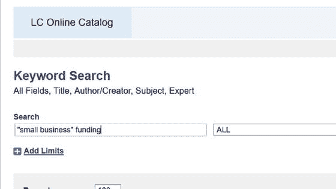
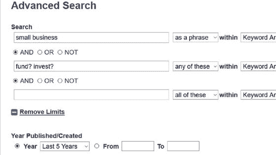

# 十九、搜索在线数据库

许多小企业在政府和商业在线数据库中搜索有关法律、拨款和研究领域的信息。有效搜索在线数据库的关键是熟悉搜索技术，这些技术可以应用于几乎任何数据库，包括文章数据库和在线图书馆目录。理解这些技术很重要，因为搜索在线数据库与使用网络搜索引擎有点不同。

在线数据库的外观或用户界面没有标准化的格式。例如，图书馆数据库中的记录由包含特定书目信息的字段组成，如作者、标题、期刊标题、出版商、出版日期/年份、主题等。一个法律案例的数据库将会完全不同。此外，一些简单的特征，如区分大小写，在不同的数据库之间可能会有所不同。

然而，大多数数据库提供类似的搜索功能以及帮助内容和/或搜索提示。本章涵盖了在线数据库中常见的功能。您还将学习如何构建您的搜索方法，并查看 Cards for Everyone Inc .数据库中的一个示例。

## 数据库功能

为了有效地进行搜索，熟悉数据库的特征非常重要。您通常可以从帮助页面中做到这一点。以下部分总结了关键工具。大多数数据库也有一个基本的搜索功能，这是我们的出发点，和一个高级搜索功能。

### 基本搜索

基本搜索框通常搜索一个字段。基本搜索有助于找出有多少参考文献与你的关键词相关，让你知道还需要做多少工作。当您运行已知项目搜索时，它也很有帮助，例如，当您知道您要搜索的确切标题时。

### 高级搜索

高级搜索功能使您能够在潜在参考数量很大时创建更有针对性的搜索。您可以在多个字段中同时使用多个搜索词进行搜索。当来自多个字段的信息可以帮助您找到感兴趣的项目时，高级搜索也很有用，例如将出版商的名称与主题结合起来。

### 布尔运算符:与、或、非

当你想要组合搜索词时，你需要使用布尔运算符或连接器。这些常用于高级搜索模式。

#### AND 运算符

AND 运算符将检索内容中提到所有术语的结果。例如,“猫和狗”搜索将返回内容中包含猫和狗的所有结果。使用和通常会检索较小的结果集。换句话说，它缩小了搜索范围，因为它排除了只提到猫、只提到狗或者既没有猫也没有狗的任何结果的返回。

在许多(但不是所有)数据库中，和是隐含的，自动放在搜索词之间。

#### OR 运算符

在搜索词之间使用 OR 运算符将检索到提及任一词的结果。例如，“猫或狗”搜索将返回所有符合以下条件的结果:

*   包含猫和狗
*   只包含猫
*   只包含狗

使用或通常会检索更大的一组结果。换句话说，它扩大了搜索范围。OR 在您搜索处理相同基本概念的术语时特别有用。

#### NOT 运算符

如果要排除术语，可以使用布尔 NOT 运算符。例如，“猫不是狗”搜索将返回包含猫而不是狗的所有结果。这具有缩小搜索范围的效果。

表 [19-1](#Tab1) 总结了布尔搜索运算符。

表 19-1。

Summary of Boolean Operators

<colgroup><col> <col> <col></colgroup> 
| 操作员 | 例子 | 对搜索的影响 |
| --- | --- | --- |
| 和 | “猫”和“狗”:包含单词“狗”和“猫”的所有结果 | 缩小搜索范围 |
| 运筹学 | “猫”或“狗”:包含“猫”和“狗”的所有结果，仅包含“猫”和“狗” | 扩大搜索范围 |
| 不 | “猫”不是“狗”:包含“猫”而不是“狗”的所有结果 | 缩小搜索范围 |

#### 组合运算符

数据库通常将 and 作为主操作符，并将首先用 AND 将概念连接在一起。如果在搜索中使用 AND 和 OR 运算符的组合，请用括号将要“或”运算的单词括起来。例如，(狗或猫)和(犬或猫)。

### 截断和通配符

大多数在线数据库还不够完善，无法自动搜索一个单词的所有变体。例如，包含“慈善”的搜索会错过包含“慈善家”、“慈善事业”等的结果。截断有助于缓解这个问题。要使用截断，请输入单词的词根并将截断符号放在末尾。数据库将返回包含该词根的任何结尾的结果。截断符号因数据库而异。例子包括:*、？, !、%和$。

例如，如果您搜索术语“菲兰特？”在在线数据库中，您可以检索包含以字母 philant 开头的任何单词的结果，包括:philanthropy、philantic、philantist 等。图 [19-1](#Fig1) 显示了在美国国会图书馆数据库( [`http://catalog.loc.gov/`](http://catalog.loc.gov/) )中搜索最近五年出版的书籍中的前三本书，并带有术语“菲兰特？”在他们的标题或字幕中。对于前两本书，《菲兰特？出现在他们的书名和第三本书“菲兰特？”出现在其中一个字幕里。

图 19-1。

Keyword search based on “philant?” for books published in the last five years in the Library of Congress database

在单词末尾过早截断会将搜索范围扩大到不相关的主题。例如，将单词 philanthropy 截短为“phil？”会捡起很多与慈善事业无关的词汇(比如市侩、哲学、菲律宾)。图 [19-2](#Fig2) 显示了图 [19-1](#Fig1) 中使用“菲尔而不是“菲兰特？”。你可以看到所有的书都与哲学有关，而不是慈善事业。

图 19-2。

Keyword search based on “phil?” for books published in the last five years in the Library of Congress database

如果一个单词以不同的方式拼写，但意思相同，通配符就很有用。比如颜色和色彩。通配符通常用符号代替单词中的一个字母。例如，在 colo*r 上搜索将返回所有包含 color 和 color 的结果。

### 短语和邻近运算符

尽管结果中包含了您的所有搜索词，但它们可能不会以您想要的方式连接起来。例如，搜索“小型企业和数据库”可能在某些数据库中作为固定短语进行搜索，或者在其他数据库中被翻译为“小型企业和数据库”,这些词在结果中单独出现。

大多数数据库允许您指定将相邻的单词作为短语进行搜索。在搜索词周围使用括号或引号是引发短语搜索的一种常见方式。您需要查阅正在使用的数据库的帮助页面，以获得具体的说明。

邻近运算符是另一种指定要搜索的单词彼此在一定距离内的方式。这使得您的搜索更精确(和更窄)。近似运算符也因数据库而异，但一些常见的运算符包括:

w# = 'with '。指定单词以给定的顺序出现，中间有固定数量的单词。用中间可能出现的最大字数替换#号。如果没有给出数字，它指定一个精确的短语。例如:

*   小型企业(搜索短语“小型企业”)
*   w3 总统奥巴马(搜索“奥巴马总统”、“奥巴马总统”、“奥巴马总统”等。)

n# = '近'。指定单词可以按任何顺序出现。用中间可能出现的最大字数替换#号。例如:

*   就业 n3 法律(搜索“就业法”，“就业法”等。)

### 限制搜索

许多数据库都有限制，通过指定的参数(例如，日期、格式、材料类型、语言或位置)来控制返回的结果。此功能有助于消除超出所选限制的结果，例如将搜索限制为最近五年出版的书籍。

## 搜索方法

找到正确的信息不是偶然发生的。创建策略对于成功的搜索结果至关重要。下一节将介绍一个好的策略，并包括一个来自 Cards for Everyone Inc .数据库的示例。

### 识别关键搜索词

通常，进行一次好的搜索最困难的部分不是使用数据库本身，而是确定使用哪些搜索词以及使用什么组合。

首先，用一个句子或一个问题写下你要寻找的信息。这本身不太可能是一个好的数据库搜索，因为可能会有一些相关的信息你会错过，只是因为它的措辞略有不同或用不同的词表达。

你的句子可能只包含一个想法，或者更有可能包含几个你需要考虑的想法。

*   将你的句子分成一到三个单词的想法和关键词。
*   在每个想法中，确定适当的单词或短语，包括意思相同的单词和短语、广义术语、相关术语、狭义术语，以及必要的多种拼写。
*   尝试从你认为答案应该如何措辞开始，使用这些词作为你的搜索词集的一部分。
*   随着相关术语的出现，在搜索过程中修改列表。

### 开始搜索

本节列出了帮助您开始搜索的步骤。

从一般性搜索开始。如果您从一个复杂的搜索开始，您可能会检索到非常少的结果。从一般搜索开始，然后根据需要缩小搜索范围，这样更有意义。

问自己以下问题:

*   我能使用更好的术语吗？
*   我需要缩小或扩大搜索范围吗？

如果你觉得有更好的搜索词可以使用，请参考你在上一节中列出的列表。

如果您需要缩小搜索范围以检索更少的结果，请考虑:

*   添加术语
*   将限制应用于特定领域
*   使用布尔运算符，如 AND 和 NOT
*   使用更多限制的截断/通配符(例如，“philant？”而不是“菲尔？”)
*   使用措辞
*   使用数字较小的近似运算符(例如，用 w2 代替 w3)

如果您需要扩大搜索范围以检索更多结果，请考虑:

*   删除术语
*   使用布尔 OR 运算符
*   使用限制较少的截断/通配符(例如，“charit？”而不是“查丽塔？”)
*   删除措辞
*   使用较大数值的近似运算符(例如，用 w3 代替 w2)

最重要的是，在寻找过程中要灵活和坚持。如果一个术语不起作用，尝试不同的术语。永远不会有一个完美的搜索，可能需要几十次搜索才能检索到所有必要的信息。

如果你的搜索一无所获，考虑加入一个相关的留言板，提出你的问题，或者甚至联系一个专业人士协会。会有很多人在你的领域有专业知识，他们可能会给你指出正确的方向。

向公共图书馆的咨询人员寻求帮助也是非常宝贵的。

## 人人卡公司:示例

假设人人贺卡公司的帕特想扩大业务。她想找到更多潜在的资金来源。

她开始写下她的研究句子:

“小企业融资”

她将此分为两个主要观点:

*   “小型企业”
*   “资金”

为了开始识别意思相似的单词，她在网络搜索引擎中输入小企业资金(没有引号，因为她不想指出短语)。这有助于她将每个想法与下列意思相似的单词匹配起来:

*   “小型企业”——初创企业、初创公司、初创企业、中小企业、公司
*   “资金”——投资、赠款

她首先在 [`http://catalog.loc.gov/`](http://catalog.loc.gov/) 访问国会图书馆数据库。

首先，她对“小企业”融资进行了简单的关键字搜索。屏幕的放大部分如图 [19-3](#Fig3) 所示。

图 19-3。

Keyword search on the Library of Congress online catalog

搜索得到 59 个结果。Pat 注意到其中一些非常旧，并担心这些信息可能太旧而无用。她通过使用排序工具从最新到最早对结果进行排序来限制搜索。她找到了一些最近出版的关于众筹和撰写成功标书的有用书籍。

然而，她想将搜索范围扩大到具有类似含义的其他术语，看看她是否错过了任何有用的信息。她使用高级搜索，将“小企业”设置为短语，并使用截短的“基金？”另一个缩写词“投资？”指示“这些中的任何一个”(而不是它们两个一起)。她还将搜索限制在过去五年内发表或创作的结果。搜索设计如图 [19-4](#Fig4) 所示。该搜索产生 187 个结果。帕特按日期顺序把它们从最新的到最早的分类，找到了更多有用的材料。她觉得已经有足够的证据开始调查了。

图 19-4。

Advanced keyword search on the Library of Congress online catalog

## 摘要

在线数据库是一个重要的信息来源。为了最大限度地利用它们，花点时间熟悉通用搜索工具并阅读相关数据库的帮助页面是值得的。

搜索数据库只是查找所需信息过程的一部分。你需要花些时间来计划你的搜索，并找出一些相似的搜索词。规划你的搜索会给你找到你要找的东西的最好机会。