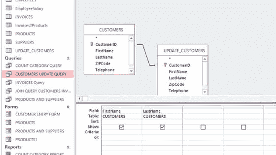
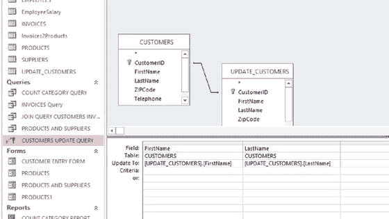

# 二十、培训你的员工

为了让您的企业从数据库中受益，您的员工必须接受如何有效使用数据库的培训。正如您所看到的，对数据库的全面理解不仅仅是操作数据库本身。数据保护立法、数据清理程序、数据收集方法、数据库维护和数据分析以及许多其他问题也很重要。在设计员工培训计划时，你需要考虑所有这些方面。本章详细介绍了培训方法。员工培训应确保总有人能够处理任何可能出现的问题:仅仅依靠一个人是不安全的政策。

## 如何开始

你需要从一开始就有耐心，因为许多员工需要时间来学习新技术。试着从一个刚遇到数据库的人的角度来看这个数据库。确保认可成功，以保持团队的热情高涨。

也许从向所有将要使用数据库的人解释为什么采用它以及你希望它如何帮助业务开始。向您的员工保证，他们都将有机会在适合他们特定学习要求的时间内熟悉数据库。此外，鼓励不把数据库视为己任的员工采用数据库的最佳方式之一是关注他们将获得的直接优势。第 1 章中列出的益处可能会有所帮助。

考虑提供一个测试数据库，例如您设计的数据库的副本，供员工使用。

## 实际培训课程

如果您正在执行培训课程，请避免解释任何与操作数据库不直接相关的技术内容。试着把你的培训分成短的部分，让观众容易理解。

如果您只有一次培训:

*   提供数据库的总体描述
*   涵盖需要理解的关键概念
*   涵盖一个案例研究
*   为如何解决各种任务的问题预留额外的时间

每个人的学习速度都不一样，将你的培训演示记录下来并保存起来可能会有所帮助，以便员工在需要时可以再次观看。一种方法是使用 Slideshare 之类的网站，它可以让你上传幻灯片并录制画外音以与它们同步(如果你想添加隐私设置，你需要支付订阅费；否则，就是免费的)。除了 Slideshare 之外，还有许多其他方法可以让你创建和分享演示文稿，包括 MS PowerPoint Online、Office Sway 和 Google Slides。

您的员工可能分布在几个地方，因此一次性将他们召集起来进行培训是不切实际的。你可以选择在线会议，而不是提供预先录制的演示。这是交互式的，因此可以根据您的员工的需求进行定制。共享幻灯片、文档等的在线工具可以通过电话线与音频组件结合，以低成本和简单的方式将员工聚集在一起进行“现场”培训。如果你只培训几个人，像 WebHuddle、Yugma 和 Adobe Connect 这样的工具会提供免费账户。其他网站，如 GoToMeeting、WebEx 和 ReadyTalk，为更实质性的培训项目提供了一种低成本的方法。唯一的警告是确保你知道电话费用有多高。

## 实践培训

远程培训您的员工可能不会引起他们的兴趣，也不会为他们提供学习如何使用数据库所需的技能。仅仅听演讲和看网上资料可能无法提供他们需要的实际培训。考虑提供一个教程，让您的团队按照自己的进度完成测试数据库上的任务。这是学习的理想环境。如果他们确信当问题出现时你会在那里回答，他们将能够以自己的速度前进。

## 文件

在您的团队了解新数据库时，包含大量屏幕截图和其他视觉效果的帮助指南是一个非常有用的工具。文档应该包含数据库中使用的所有进程和过程的详细信息。

你的团队需要学习三种主要技能:

*   所有数据库共有的技能
*   特定于您正在使用的数据库包的技能
*   与您实施的数据库设计相关的技能

关于前两项技能的信息在其他地方有详细的文档记录，您不希望花费太多的文档来重复它:对主要问题的总结就足够了。大多数数据库包都有包含其特定功能的帮助页面。例如，当您在 MS Access 2013 中打开帮助指南时，您会看到一个热门类别列表和一个搜索工具，您可以输入关键字来查找主题。你可以列一个建议章节的清单。网上有很多教程。例如，AccessLearningZone.com 提供了一些关于 Access 的免费教程，可能会有用。当你的员工考虑更广泛的数据库主题时，你可能会发现本书的不同章节很有帮助。

尝试将你的材料分开，以反映你认为你的团队会如何使用该系统。那些寻找单一任务的人应该能够找到所需的帮助，而不必阅读大量不相关的内容。探索超链接、内容列表等的使用。

如您所见，您的数据库不太可能是静态的。因此，以电子形式保存文档以便于访问和更新是有意义的。您的团队应该意识到文档是不断变化的，最后一次更新的日期应该在指南的开头就明确。

不管你的文档有多广泛和仔细，你总是会遇到你没有涉及到的问题。当您编写文档时，您将尽最大努力解决您的团队需要的问题。由于您可能已经与数据库打交道有一段时间了，并且不再用新的眼光看待它，所以肯定会有一些重要的因素被您忽略。因此，尽快收集反馈并相应调整指南是非常重要的。内联网上的可编辑评论文档可能就足够了。您还可以在文档的开头提供一条消息，要求您的团队通过自动电子邮件链接将任何意见直接发送给您。

你可以要求工作人员在没有任何指导的情况下尝试使用数据库，除了回答他们提出的问题。在此过程中，您可以在问题出现时做笔记，并确保文档涵盖了这些问题。

## 逐步采用数据库

如果您的团队能够逐步熟悉数据库，他们可能会更容易接受数据库。例如，在对他们进行培训之后，您可以将数据从电子表格一次一个或两个表地移动到数据库中。一旦每个人都有机会熟悉现有的表格，您就可以添加更多的电子表格。一个合理的起点是将客户联系数据移动到数据库中。

值得注意的是，电子表格和数据库可以一起使用，直到所有员工都感到舒适。实现这一点最明显的方法是允许员工对电子表格进行更改，然后您可以使用这些更改定期更新数据库。这个过程可以通过几个简单的步骤来实现，如下所示:

Back up your database.   Import the changes from the spreadsheet into your database into a table with identically named columns to that of the table you wish to update. Here, we use an example of a table named Update_Customers to update the FirstName and LastName columns of the Customers table in the Cards for Everyone Inc. case study. Note Importing data into a database table is covered in the appendix to the book.   Create a relationship between the Update_Customers table and the Customers table using the unique identifiers. Note The creation of relationships between tables is covered in the appendix to the book.   Use a query to select the rows from the table you wish to update. In this case, your query would look like Figure [20-1](#Fig1).

图 20-1。

Query showing the FirstName and LastName columns of the Customers table in the Cards for Everyone Inc. database Note Creating a simple query is covered in the appendix to the book.   Run the query (using “!” on the Design tab) and make sure that the returned rows are the ones you want to update.   If all is well, you can convert your query to an Update query. To do this, select the Design tab and then select Update from the Query Type area of the top toolbar. You will see the Update To row appear in the grid at the bottom of your query design.   To update values in the FirstName and LastName columns of your Customers table to match those of the Update_Customers table, place the corresponding column references:

> [更新 _ 客户]。[名字][更新客户]。[姓氏]

in the Update To part of the grid, as shown in Figure [20-2](#Fig2).

图 20-2。

Update query renewing the FirstName and LastName columns of the Customers table with the corresponding columns of the Update_Customers table   Run the query in the usual way. You will asked if you are sure you want to update the rows. Also, your database may have been “disabled” if you have not set up a safe area for it and, if so, you will need to “enable” it using the button that appears on the message bar.  

这种方法允许您的电子表格保持正常运行。同时，工作人员可以打开数据库，查看数据是如何存储的，并熟悉如何访问数据。然后，您可以为从电子表格到数据库的最终切换设置最后期限。

## 大局

员工培训不仅仅是教员工直接操作数据库。正如您在本书中所看到的，数据库主题涵盖了数据处理和数据库管理的许多方面:您团队中的某个人必须始终接受培训以承担责任。然而，大多数工作人员不需要接受所有这些技能的培训。例如，没有必要向将要收集和输入数据的职员教授数据分析。概括地说，本书涵盖的基本领域有:

*   数据保护法和数据安全
*   数据收集
*   数据清理
*   数据库维护
*   搜索数据库
*   分析您的数据
*   写报告
*   根据报告采取行动
*   根据外部数据请求采取行动
*   存档数据库
*   搜索在线数据库

你需要确定谁需要哪方面的培训。然而，任何处理个人数据的人都需要了解数据保护法，并且需要知道如何设置强密码。

您还需要提供关于数据输入的强有力的指导。在可能出错的地方，你需要提供具体的指示，这样每个人的行为才会一致。例如，每个人都应该清楚如何处理诸如缺少值这样的问题，以便数据是明确的。例如，在输入某人地址的州部分的情况下，使用术语“无”来表示缺少数据是令人困惑的，因为它可能表示客户住在国外。诸如“未知”之类的条目会更合适。

当几名员工在输入数据时，例如在 Connecting South Side 的案例研究中，有一个将员工姓名首字母链接到记录的列是很有用的。这样每个人都知道该联系团队中的哪个成员。此外，任何负责清理数据的人都将能够发现哪里经常出错以及是谁出错，并且能够提供反馈。

## 案例研究:连接南区的员工培训类型

下面的例子说明了培训要求如何针对不同的员工。必要的培训按上一节中的每个要点依次进行评估:

*   数据保护法和数据安全:每个人都应该关注。这一点对于存储着询问者个人生活信息的 Connecting South Side 来说尤为重要。
*   数据收集:几乎所有团队成员都参与数据收集，因为他们接受查询并直接从中创建数据库记录。
*   数据清理:这应该由所有接触数据库的工作人员负责，因为任何输入数据的人都必须意识到他们工作的质量非常重要。有人将需要直接负责清理数据库，并需要在相关技术的培训。需要另一名工作人员作为后备。
*   数据库维护:每天必须有一个人在办公室进行必要的数据库维护，例如备份数据库。这意味着一个人应该承担主要责任，其他人可以在必要时介入，比如在休假、生病或离职的情况下。
*   搜索数据库:连接南区的所有工作人员需要能够搜索 enquirer 数据库，以便找到当前的案件。还必须确定与当前案例相似的以往案例，以避免重复工作。这些技能可以从一两个团队成员开始获得，但最终应该成为每个人的第二天性。
*   分析数据:通常只有经理需要能够分析数据，因为他或她将会写报告。然而，在紧急情况下，必须有另一名受过足够培训的工作人员介入。这些报告对于“连接南方”的工作至关重要，既可以让相关机构知道当前资助的目的和目标正在实现，也有助于为未来的赠款进行投标。
*   写报告:同样，在大多数情况下，只有经理需要能够写报告。但是，如果经理由于任何原因不在，就需要一个后备人员。
*   对报告采取行动:[第 15 章](15.html)展示了对报告采取行动需要对数据库进行根本性的改变。这需要比日常操作数据库更多的技能。除了被认为设计和实施了数据库的管理人员之外，其他任何人都不太可能受过足够高的培训来根据报告采取行动，尽管由另一名工作人员学习相关技能是谨慎的。
*   根据外部请求采取行动:第 16 章展示了擅长搜索和设计查询的员工可以处理外部的信息请求。没有必要让每个人都接受这种程度的培训，但由于这种要求可能每天都会出现，办公室每天至少应有一名工作人员接受过所需的培训。
*   数据库存档:与维护一样，需要一名全职(或同等职位)工作人员负责将数据库存档作为其职责的一部分，还需要一名全职(或同等职位)备份人员。
*   搜索在线数据库:所有工作人员都需要能够搜索在线数据库，寻找能够帮助查询者的组织信息。

## 摘要

如果要成功采用您的数据库，量身定制的员工培训是必不可少的。工作人员的职责和学习进度会有所不同。通过提供演示文稿、实践教程、文档、录制材料和测试数据库的组合，您的员工将能够以合理的速度学习必要的技能。