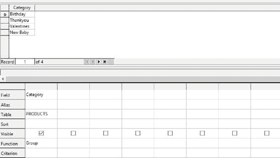

# 二十一、附录

本附录的目的是涵盖以下内容的最初步骤:

*   创建数据库
*   创建表格
*   对表中的一列数据进行排序
*   创建表之间的关系
*   创建查询
*   创建表单和报表
*   使用外部数据

将使用两个数据库包来演示这些操作:MS Access 2013 和 LibreOffice 5 Base。对于初学者来说，这两个软件包都非常简单，因为几乎不需要任何编程知识。并非所有的数据库都是如此:例如，MySQL 是一个流行的数据库包，但是需要对 SQL 编程语言有很好的理解，这不在这里讨论。

本书通篇使用 MS Access 2013 来提供示例。之所以选择它，是因为它被广泛使用，因此为人所熟悉。MS Access 曾经随 MS Office 一起提供，但现在情况不同了，除非你购买更贵的软件包。图书馆是免费的，服务也一样好。

本附录旨在向您介绍数据库的基本功能。它并不打算是全面的，而应该被视为在本书中描述的数据库示例之前完成的步骤，并使您能够构造和使用数据库。MS Access 和 LibreOffice 都提供了帮助指南，除了此处提供的基本信息之外，还可以带您了解更多信息。

这两个包有许多相似之处，在某些部分将被放在一起考虑。你可能会惊讶于这两个包是如此的相似。

## 从头开始创建数据库

与任何文字处理器文件或电子表格一样，您需要能够创建一个新文件。MS Access 2013 和 LibreOffice 5 Base 提供模板来帮助您。然而，这里我们解释如何从头开始创建一个数据库。

### MS Access 2013

首先，双击访问图标。图 [A-1](#Fig1) 显示了将要出现的部分输出。

图 A-1。

Initial MS Access 2013 interface

单击空白桌面数据库(左上第二个图标)。

在出现的文件名框中输入数据库的名称，如图 [A-2](#Fig2) 所示。

图 A-2。

The File Name box for your new database in MS Access 2013

您可以使用 Access 在“文件名”框下显示的默认位置，或者单击文件夹图标选择一个位置。

单击创建。您将看到一个带有新表的新 MS Access 2013 数据库。请注意顶部的选项卡:主页、创建、外部数据和数据库工具。这些将在本章中提及。表格将在下一个主要部分讨论。

### 书架 5 Base

双击图书馆图标。在左侧菜单中点击基础数据库图标，如图 [A-3](#Fig3) 所示。将打开数据库向导。

图 A-3。

The LibreOffice 5 main interface

默认选项是创建一个新的数据库，因此单击 Next。默认选项很好，所以单击 Finish。系统会提示您为新数据库选择一个名称和位置，如图 [A-4](#Fig4) 所示。

图 A-4。

Select a name and location for your new database in LibreOffice 5 Base

单击保存。

数据库界面将打开三个面板:

*   数据库面板是您找到数据库对象的地方
*   在“任务”面板中，您可以看到每个对象的可能任务
*   主工作区根据“数据库”面板中的选择而变化

## 创建表格

第 7 章中介绍了表格。图 [A-5](#Fig5) ，重述自[第 7 章](07.html)，显示了如何在 Cards for Everyone Inc .数据库中设置 Customers 表的数据类型。图 [A-6](#Fig6) ，同样转述自第 7 章的[，显示了填充了三个项目的客户表。本节介绍如何创建表，这是设置数据类型和添加数据之前的步骤。](07.html)

图 A-6。

Adding data to a new table in MS Access 2013

图 A-5。

Setting data types for a new table in MS Access 2013

两个数据库包都有一个表的两个视图，如下所示:

*   设计视图:列(字段)名称及其数据类型的视图。图 [A-5](#Fig5) 显示了客户表的设计视图。
*   数据表视图:表中数据的视图。图 [A-6](#Fig6) 。显示“客户”表的数据表视图。

### MS Access 2013

当您第一次打开数据库时，您将在数据表视图中看到一个空白表。这可用于您创建的第一个表。

添加表时，单击“创建”选项卡，然后单击“表”。

在输入数据之前，您需要设置数据类型。这是在“设计”视图中完成的，您可以通过单击“主页”选项卡，然后依次选择“视图”和“设计视图”来访问该视图。

Note

从现在开始，操作序列将采用以下格式:主页➤视图➤设计视图。

在“另存为”框中命名该表。

现在您已经准备好设置您的列的类型，如图 [A-5](#Fig5) 所示。

通过单击相关单元格并使用下拉菜单来选择数据类型。当您选择好数据类型后，选择主页➤视图➤数据表视图并输入您的数据，如图 [A-6](#Fig6) 所示。

正如您在第 7 章中了解到的，您需要一个惟一的标识符(也称为主键)用于您的表。这里选择了 CustomerID。在设计视图中，通过旁边的钥匙符号可以看到 CustomerID 是主键(如图 [A-5](#Fig5) )。您可以通过以下方式将不同的行设置为唯一标识符:

Highlighting the row (by clicking on the area to the left of the Field Name column)   Right-clicking the highlighted area and selecting Primary Key from the drop-down menu that appears   Save your table when you have finished adding columns and data. You can do this by using Ctrl+S.  

### 基本书店 5

从数据库区域选择表。

从“任务”面板中，选择“在设计视图中创建表”。(如果您愿意，可以使用向导来创建表，并按照说明进行操作。)

使用设计视图键入列名及其数据类型。如果单击单元格，数据类型列中将出现数据类型的下拉菜单。选择最适合您的数据的类型。

您现在需要设置一个唯一的标识符(也称为主键)。为此:

Highlight the row (or rows) that will make up the unique identifier by clicking in the area to the left of the Field Name column   Right-click the highlighted row and select Primary Key from the bottom of the menu that appears   Give the table a name and save the design using Ctrl+S.  

当您关闭设计视图时，您会在任务面板的底部看到您的表。双击该表，在数据表视图中打开它。然后您可以添加您的数据。

## 表之间的关系

关系在第 7 章中介绍。最简单的关系就是一对一的关系。在[第 7 章](07.html)中给出的例子是雇员和雇员之间的关系，并在图 [A-7](#Fig7) 中重述。关系的类型—无论是一对一、一对多还是多对多—都是由数据库包自动创建的。以下两节介绍了在 MS Access 2013 和 LibreOffice 5 Base 中创建表之间关系的分步过程。

图 A-7。

A one-to-one relationship between tables

### MS Access 2013

单击数据库工具选项卡。点击关系。

要向 relationships 区域添加新表，右键单击任何空白区域，从出现的菜单中选择 Show Table，然后选择一个相关的表。然后单击添加。继续添加表格，直到完成为止。然后单击关闭。

如果要从“关系”区域中删除任何表，请右键单击它的顶部，然后从菜单中选择“隐藏表”。

创建关系时，从一个表的选定列(通常是唯一标识符)拖动到相关表中的匹配列。将出现一个对话框，允许您设置条件，如级联删除，如图 [A-8](#Fig8) 所示。

图 A-8。

Creating a relationship between two tables in MS Access 2013

您可以通过单击描述关系的线(它将被突出显示)然后右键单击并选择删除来删除关系，如图 [A-9](#Fig9) 所示。

图 A-9。

Deleting a relationship between tables in MS Access 2013

### 书架 5 Base

单击工具选项卡。从出现的菜单中选择关系。在“添加表”对话框中，双击每个感兴趣的表。单击关闭按钮。

创建关系时，从一个表中的一列(通常是唯一标识符)拖到相关表中的一个匹配列。

您可以通过单击描述关系的线条(它将突出显示)来编辑关系，然后右键单击并选择编辑。你就是这样给出删除级联等指令的，如图 [A-10](#Fig10) 所示。

图 A-10。

Creating a relationship between two tables in LibreOffice 5 Base

要删除一个关系，点击描述该关系的线条，点击右键，然后选择删除，如图 [A-11](#Fig11) 所示。

图 A-11。

Deleting a relationship between tables in Libre Office 5 Base

## 对列中的数据进行排序

在第 12 章的[中解释了如何对表格中的一列数据进行排序。在任一数据库包中实现这一点的最直接的方法是在数据表视图中打开表，然后按照下列步骤操作。](12.html)

在 MS Access 2013 中:

Right-click any cell in the column of data you wish to sort   Select Sort A to Z or Sort Z to A from the menu that appears  

在 library 5 base 中:

Highlight the whole column you wish to sort by clicking its name at the top   From the toolbar at the top, select one of the two sort options, either ascending sort (A above Z with a downward arrow alongside) or descending sort (Z above A with a downward arrow alongside)  

## 问题

本节旨在演示如何在 MS Access 2013 和 LibreOffice 5 Base 中设置和运行查询。[第 1 章](01.html)介绍了一个统计每类卡片数量的查询。这再次显示在图 [A-12](#Fig12) 中。阅读完这一部分后，您将能够设置并运行这个查询，产生如图 [A-12](#Fig12) 所示的输出。

图 A-12。

Sample query from the Cards for Everyone Inc. database

该查询包括两个步骤:

*   对卡片的类别进行分组。
*   计算每组卡片的数量。

与表一样，查询可以在数据表视图(查询的输出，如图 [A-12](#Fig12) 所示)和设计视图中查看。

整本书都介绍了查询的例子。在每种情况下，都会显示查询的设计和输出。这意味着，如果您知道如何设置查询，您将能够运行所有的示例。

要了解本书中未涉及的说明，如可用作函数/标准的说明范围，请访问 MS Access 2013 或 LibreOffice 5 Base 的帮助页面，您会找到一个全面的列表。

两个数据库包以相似的方式处理查询。在任一包中，您都可以保存查询，以便以后使用。

### 在 MS Access 2013 中设计和运行查询

要打开查询的设计视图:

*   单击创建选项卡。
*   从查询区域中，选择查询设计。(如果您愿意，可以选择查询向导并按照说明进行操作。)
*   双击“显示表格”框并关闭该框，从中选择产品。
*   Choose Category from the Products table by double-clicking on it. You will see Category appear in the grid at the bottom of the screen. Each of the labels on the far left applies to the cell in the grid of the adjacent row, as shown in Figure [A-13](#Fig13).

    

    图 A-13。

    The first step of query design in MS Access 2013 for the query shown in Figure [A-12](#Fig12)

若要指示查询对类别进行分组，请选择“设计”选项卡，然后选择“ʃ(总计)”。您将看到网格中出现一个总计部分，默认为分组依据。这是您正在寻找的命令。

要运行查询，请选择设计表，然后选择 run(用红色感叹号“！”表示)).这产生了如图 [A-14](#Fig14) 所示的输出。

图 A-14。

Output from Step 1 of the query in Figure [A-12](#Fig12) using MS Access 2013

输出给出了四组类别，但没有告诉您每组包含多少张卡片。要确定每组中有多少张卡，您需要发出第二个命令，如下所示:

*   像以前一样运行查询。您应该得到如图 [A-12](#Fig12) 所示的输出。

*   选择主页➤设计视图，返回到设计视图。
*   Add a second command on the Categories column by double-clicking on the Categories column shown in the Products table on the Queries area. You will see a second Category appear in the grid at the bottom of the screen, as shown in Figure [A-15](#Fig15).

    

    图 A-15。

    Step 2 of the Design for the Query in Figure [A-12](#Fig12) Using MS Access 2013
*   您需要将出现在汇总行中的分组依据更改为计数。为此，单击总计单元格并从下拉菜单中选择计数，如图 [A-15](#Fig15) 所示。

### 在 LibreOffice 5 Base 中设计和运行查询

要打开查询的设计视图，请按照下列步骤操作:

*   在主窗口中，单击左侧列表中的查询图标。
*   选择“在设计视图中创建查询”。(也可以使用查询向导；不言自明。SQL 视图超出了本书的范围，因为本书没有涵盖 SQL 语言。)
*   双击“显示表格”框并关闭该框，从中选择产品。
*   Select Category from the Products table by double-clicking on it. You will see Category appear in the grid at the bottom of the screen. Each of the labels on the far left applies to the cell in the grid of the adjacent row, as shown in Figure [A-16](#Fig16).

    

    图 A-16。

    The first step of query design in LibreOffice 5 Base for the query in Figure [A-12](#Fig12)

若要指示查询对类别进行分组，请按照下列步骤操作:

*   单击查询网格的函数单元格。
*   从下拉菜单中选择组。

要运行查询，请单击图 [A-16](#Fig16) 中所示的图标。您应该得到如图 [A-17](#Fig17) 所示的输出。

图 A-17。

Output from step 1 of the query in Figure [A-12](#Fig12) using LibreOffice 5 Base

为了计算每组中卡片的数量，按照以下步骤在 Categories 列上添加第二个命令:

*   双击查询区域的产品表中显示的类别列。您将看到第二个类别出现在屏幕底部的网格中。
*   通过单击第二个 Category 下的单元格，并从下拉菜单中选择 Count，将 Count 应用于函数行。

您的设计视图应该如图 [A-18](#Fig18) 所示。

图 A-18。

Step 2 of the design for the query in Figure [A-12](#Fig12) using LibreOffice 5 Base

当您运行设计视图时，您将得到如图 [A-19](#Fig19) 所示的输出，它对应于如图 [A-12](#Fig12) 所示的输出(来自 MS Access 2013)。

图 A-19。

Output in LibreOffice 5 Base from running the query in Figure [A-18](#Fig18)

## 表单和报表

在本书中没有详细使用表格和报告。然而，开始使用它们非常容易，因为 MS Access 2013 和 LibreOffice 5 Base 都提供了有用的向导。您可以使用表和查询中的数据来创建窗体和报表。

在 MS Access 2013 中，请按照下列步骤操作:

Click the Create tab.   From the Forms area, choose Form Wizard or from the Reports area, choose Report Wizard.  

在 LibreOffice 5 Base 中，按照下列步骤操作:

Select Forms or Reports.   Select the respective Wizard from the list of options that appears.  

您可以基于多个表生成表单，这对于将数据输入到多个表中以及在数据库中搜索数据都很有用。报告使文档可以从数据库表或查询中设计出来，这些表或查询可以以电子形式轻松共享，也可以通过打印输出在远离计算机的地方查看。

## 外部数据

使用外部数据很重要，因为它可以将数据读入数据库(导入),而无需手动输入。这也意味着数据可以从数据库中读出(导出),而不需要重新输入。如果要执行数据库包中没有的操作，例如电子表格中可用的操作，这一点非常重要。

### MS Access 2013 中的外部数据操作

以下部分讨论了使用 MS Access 2013 导入和导出数据的必要步骤。

#### 导入数据

要将数据移入数据库(例如，从另一个数据库或电子表格)，请按照下列步骤操作:

*   单击顶部工具栏上的外部数据选项卡。
*   在“导入和链接”部分，单击要导入的数据格式。如果您看不到正确的格式，请点按“更多”。您可以从其他 Access 数据库导入表，从 Excel 电子表格导入数据，等等。

按照“获取外部数据”对话框中的说明进行操作，如图 [A-20](#Fig20) 所示。您可以将数据追加到现有的表中，也可以创建一个全新的表。文件的列标题必须与导入源表的列标题相同。此外，您不能通过复制任何值来违反唯一标识符(主键)。

图 A-20。

Importing data into MS Access 2013

#### 导出数据

要将数据移出数据库(例如，移至另一个数据库或电子表格)，请按照下列步骤操作:

*   在左侧列表中单击一次，突出显示要导出的数据库对象。
*   单击顶部工具栏上的外部数据选项卡。
*   从工具栏的导出部分选择要导出到的文件类型。
*   选择您的目标文件。
*   按照说明操作。

图 [A-21](#Fig21) 显示了将 Cards for Everyone Inc .数据库中的产品表导出到 MS Excel 文件的示例。

图 A-21。

Exporting data from MS Access 2013

### 书架 5 Base

LibreOffice 使用其电子表格 Calc 来导入和导出数据。由于假设每个阅读本书的人都熟悉电子表格，本节不包括截图。

#### 导入数据

要将数据移入您的数据库(例如，从另一个数据库或电子表格)，您必须首先将数据导入 Calc。Calc 接受逗号分隔的文本文件。CSV 文件。这些可以在 Calc 中通过选择文件➤打开来打开。

确保从中导入数据的文件的列标题与数据将被移入的数据库对象的列标题相匹配。

*   打开所需数据库类型的基本文件。
*   请使用“数据库向导”创建一个新的 base 文件，或者打开一个非只读的现有 Base 文件。
*   打开包含要导入到 Base 的数据的 Calc 文件。
*   选择要复制到 Base 的数据，包括第一行的列名。
*   选择编辑➤副本。
*   在基本窗口中，单击“表格”以查看表格。
*   在基本窗口中，选择编辑➤粘贴。

将出现“复制表格”对话框。您可能需要选中“创建主键”框。

#### 导出数据库中的数据

要将数据移出数据库(例如，移至另一个数据库或电子表格)，请按照下列步骤操作:

*   打开包含要导出的数据库表或查询的数据库文件。
*   在 Calc 中，选择文件➤新➤电子表格。
*   在 Base 窗口中，右键单击要导出的表的名称，然后选择“复制”。
*   在新的 Calc 窗口中单击单元格 A1，然后选择编辑➤粘贴。
*   现在将数据保存或导出到您选择的文件类型。

## 摘要

本附录填补了书中提供的示例与从头创建数据库、表和查询所需的步骤之间的空白。附录还介绍了表关系、如何对表中的列进行排序以及如何导入和导出数据。它还提到了使用向导创建表单和报告。以 MS Access 2013 和 LibreOffice 5 Base 两个数据库包为例。