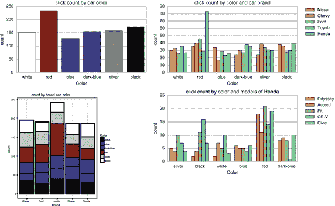

# 一、了解数据科学

在本章中，我首先定义了什么是数据科学家以及他或她做什么。然后，我将介绍用于收集、清理和分析数据的不同类型的软件和工具。一旦您了解了数据科学中使用的不同类型的软件和工具，我将简要回顾一下关注组织知识的重要性。

## 定义具有多重含义的多学科实践

那么什么是数据科学家呢？数据科学家比其他类型的科学家更难定义。如果你是政治科学家或气候科学家，你有一个既定项目的学位。在“数据科学”成为一门定义明确的学科之前，“数据科学家”一词就已经被广泛使用。即使是现在，自称数据科学家的人也来自各种不同的领域。作为一门学科，“数据科学”仍在自我梳理中。有点像早期考古。只要拿起铲子开始挖掘文物，任何人都可以自称为考古学家。如今，要成为一名考古学家，你必须读完大学，花上几年时间做研究。像早期考古学一样，数据科学更多的是一种实践，而不是一门学科。

如果你以科学的方式处理数据，你就是一名数据科学家。你是否选择称自己为数据科学家仍然取决于你自己。肯定有一些群体比其他人更适合“数据科学家”这个头衔。如果你是一名统计学家或数据分析师，或者你在生物科学领域工作，你可能会说你一直是一名数据科学家。一些自称数据科学家的人实际上是数学家；其他人来自系统和信息工程，有些甚至来自商业和金融。如果你与数字打交道，并对数据略知一二，你可以很容易地称自己为数据科学家。

现在，随着对数据科学家需求的增加，将会有更多的运动来创建标准化的技能集。你已经开始在伯克利、锡拉丘兹大学和哥伦比亚大学的新项目中看到这一点。新的学位项目将允许公司在招聘时依赖一套通用的技能。目前来看，情况并非如此。事实上，仍然存在一些危险，数据科学家将被视为任何与数据打交道的人，并且可以更新他们的 LinkedIn 个人资料。

思考数据科学的最佳方式是关注科学而不是数据。在这种情况下，科学使用科学方法。你应该进行实验，用经验方法来观察结果。经验主义是科学家通过实验和问题对数据做出反应来获得洞察力和知识的方式之一。一个数据科学家应该每天都使用这项技能。经验方法是知识和实践的结合。你可能使用了经验方法，却没有意识到这一点。

作为一名教练和培训师，我必须经常出差。这通常意味着我发现自己在不同的酒店。我总是惊讶于世界上有这么多不同类型的水龙头和固定装置。我一直纠结的一件事是如何处理酒店淋浴的复杂性。过了一段时间，我意识到处理这个问题的最好方法是使用经验方法。首先，我得猜猜怎么打开淋浴。我先问一个经验性的问题。我如何打开淋浴？然后我做了一个实验。当我按下一个按钮，水就充满了浴缸。如果我按下另一个，莲蓬头就会启动。打开水后，我必须转动不同的旋钮，看看是否能控制温度。如果我拧一个旋钮，它会变得太热。如果我拧另一个，它会变得太冷。所以我问问题，重新评估，直到我能让水变得舒适。我不想用理论的方法。我可以从理论上解释如何让水变得舒适，然后我就可以转动一个转盘，跳进淋浴间。问题是我可能会被冻僵或烫伤。

数据科学家一直使用同样的经验方法。他们对数据提出问题，并做一些小的调整，看看是否能获得洞察力。他们转动旋钮，问更多有趣的问题。

就本书的目的而言，我将数据科学家视为使用经验方法从数据中获得洞察力并专注于科学方法的人。我们强调的是“数据科学”中的科学，而不是数据。

## 使用统计和软件

因为数据科学仍然是由实践定义的，所以特别强调使用通用工具和软件。请记住，数据科学家就像第一批考古学家。因此，把软件想象成你进行发现所需要的刷子和镐。但是，尽量不要太专注于学习所有的工具，因为它们不是你需要知道的全部。让一个人成为数据科学家的是科学方法，而不是工具。数据科学家需要的工具分为三大类:

*   保存数据的软件:这些是电子表格、数据库和键/值存储。一些流行的软件包括 Hadoop、Cassandra 和 PostgreSQL。
*   用于清理数据的工具:数据清理，也称为数据清理，通过修改或修正数据或删除重复的、格式不正确的、不正确的或不完整的数据，使数据更容易处理。用于清理数据的典型工具是文本编辑器、脚本工具和编程语言，如 Python 和 Scala。
*   帮助分析数据的统计软件包:最流行的是开源软件 environment R、IBM SPSS 预测分析软件和 Python 的编程语言。其中大多数包括可视化数据的能力。你需要这个来制作漂亮的图表。

### 保存数据

让我们先来看看你需要知道的保存数据的工具。你会经常听到的一个术语是大数据。大数据听起来像 20 世纪 60 年代恐怖电影的标题。你想象一个戴着猫眼眼镜尖叫的女人被堆积如山的数据吞噬。大数据是指大到不适合大多数数据管理系统的数据集。有些人混淆了数据科学和大数据，因为它们同时被炒作，经常被混为一谈。但是，请记住，数据科学是将科学方法应用于数据。这并不假设您的数据必须很大。事实上，有一本名为《数据智能:利用数据科学将信息转化为洞察力》的好书，作者是 John W. Foreman， [1](#Fn1) ，书中介绍了仅使用电子表格的数据科学统计。

然而，数据科学中最活跃的领域之一是围绕大数据，并且有专门设计来处理大数据的软件。开源软件包 Hadoop 是目前最流行的。Hadoop 使用分布式文件系统将数据存储在一组服务器上，通常称为 Hadoop 集群。集群还在服务器上分配任务，这样您也可以在服务器上运行应用程序。这意味着您可以在数百甚至数千台服务器上存储数 Pb 的数据，并对集群中的数据运行处理。Hadoop 集群上运行的两个最常见的进程是 MapReduce 和 Apache Spark。MapReduce 批量处理数据，Spark 可以实时处理数据。

### 清理数据

收集完数据后，您很可能希望使用一些工具来清理数据，使其更有用。清理数据通过修改或修正数据或删除重复的、格式不正确的、不正确的或不完整的数据，使处理数据变得更加容易。假设您正在收集数百万条客户的推文，其中可能包含文本、图片甚至视频。在收集这些数据时，您可以创建一个脚本，将所有传入的 tweets 分成各种类型(文本、图片、视频等)。这将允许您使用不同的参数分别分析这些组。如果您经常进行这种分析，那么最好创建一个小的 Python 应用程序来执行集群上的操作，而不是创建一个在 tweets 传入时执行该操作的脚本。

数据科学家可能会花费高达 90%的时间来调整和清理数据，以提高其可用性，因此自动化这一过程对于这一步至关重要。

### 分析数据

最后一组工具是用于分析数据的工具。最流行的两个是 R 和 Python。

R 是一种统计编程语言和软件环境，允许您在数据中建立联系和相关性，然后使用 R 的内置数据可视化来呈现它们。这可以让你的报告有一个漂亮的图表。例如，假设您的公司想要一份报告，以了解他们的积极反馈与该反馈是发生在白天还是晚上之间是否有联系。收集这些信息的一种方法是在 Hadoop 集群中捕获 Twitter 数据，然后使用数据清理将推文分类为正面或负面。接下来，您可以使用像 R 这样的统计包来创建正面和负面推文以及它们发布的时间之间的关联，并打印一份报告，在一个漂亮的图表中显示结果。

请记住，这些是最流行的工具。如果你是数据科学团队的一员，你几乎肯定会在对话中听到至少一个问题。还有许多工具可以自动收集、清理和分析数据。

有许多组织花了很多钱试图进入这个领域。尽量记得把重点放在分析上。数据和工具只是获得更大洞察力的工具。在这个成长中的领域谨慎花钱。

## 发现洞见和创造知识

在过去的 20 年中，大多数组织都致力于通过简化业务流程来提高运营效率，从而变得更加精简和灵活。他们问了一些运营问题，比如“我们如何才能更好地合作？”

数据科学不一样；它不是目标驱动的。它是探索性的，使用科学的方法。这不是关于一个组织运作得有多好；而是获得有用的商业知识。对于数据科学，您可以提出不同类型的问题，例如:

*   我们对客户了解多少？
*   我们如何交付更好的产品？
*   为什么我们比竞争对手强？

这些都是需要更高层次的组织思维的问题，而大多数组织还没有准备好问这类问题。他们被迫设定里程碑和创建预算。他们没有因为怀疑或好奇而得到回报。

想象一下，你正在参加一个商务会议，有人问了这些问题。为什么我们要这样做？你凭什么认为这会有用？为什么这是个好主意？有可能，问这个问题的人会被认为是令人讨厌的。通常，有人会回答类似“你没看备忘录吗？”然而，这些是你建立组织知识所需要的技能。这些是您希望从数据科学团队那里得到的问题。尽管如此，组织中的大多数人还是专注于把事情做好。诸如此类的问题被视为前进的障碍。然而，作为一个组织，你通过问有趣的问题来获得知识。

我曾经为一个网站工作，这个网站将潜在的汽车购买者和经销商联系起来。网站上有数百个信息标签，显示客户是否停留或点击了他们的链接。所有这些数据都流入了 Hadoop 集群，每周都有数 TB 的数据。该公司拥有数年前的历史数据。他们花费了大量的资金，甚至成立了专门负责收集和维护这些数据的部门。收集数据很容易。他们使用的软件简单且易于创建。困难的部分是弄清楚如何处理这些数据。

这似乎是许多在数据科学领域起步的组织面临的共同挑战。这些组织大多将其视为运营挑战。他们关注数据的技术方面。它是关于收集数据的，因为它相对便宜并且容易理解。这是一个友好的会议，每个人都可以支持这项工作。他们甚至会创建多个集群或数据湖来汇集来自整个组织的数据。这是容易的部分。组织苦苦挣扎的是科学。他们不习惯问和回答有趣的问题。

如果您是这个汽车网站的数据科学家，请考虑您可能会提出的实验和问题。你可以进行一个如图 [1-1](#Fig1) 所示的实验，改变图片的颜色，看看如果图片是红色、蓝色或黄色，顾客是否更有可能点击它。如果报告显示顾客点击红色汽车的可能性增加了 2%,该组织可以与汽车经销商分享这一点，以产生新的收入。你可以做一个实验，通过减少显示的汽车数量来看看这个站点的页面上是否有太多的汽车。然后，您可以运行一个报告，看看显示的汽车越少，客户点击链接的可能性是否会增加。

图 1-1。

Changing the color of the cars Note

在 [http:// ds. tips/ 4H5Ud](http://ds.tips/4H5Ud) 查看如何创建这些图表。

这是数据科学家应该思考的实证研究类型。他们应该扭曲数据，提出有趣的问题，进行快速实验，并产生精心设计的报告。

## 摘要

在本章中，您学习了什么是数据科学家以及他或她做什么。您还了解了用于收集、整理和分析数据的不同类型的软件和工具，以及如何发现见解和创造知识。关键是要问有趣的问题。在第 [2](02.html) 章中，你将学习一些数据库基础知识。

Footnotes [1](#Fn1_source)

《数据智能:利用数据科学将信息转化为洞察力》。约翰威利父子公司，2013 年。