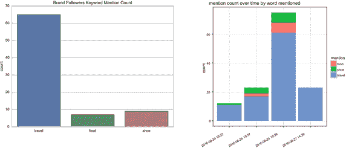

# 三、识别不同的数据类型

当你在一个数据科学团队中时，你会经常处理许多不同类型的数据。这些不同的类型将是决定如何存储数据的关键因素。像 NoSQL 这样的技术为存储不同的数据类型提供了很大的灵活性。关系数据库的灵活性较差，但有时更容易使用，而且在关系数据库中生成报告通常更容易。

当您考虑如何存储数据时，您需要了解不同的数据类型。任何存储都是如此。某些数据库针对某些类型的数据进行了优化。就像您不希望在水壶中存储三明治一样，您也不希望建立一个关系数据库来保存错误类型的数据。

您的团队应该考虑三种类型的数据:

*   结构化:按照特定顺序遵循特定格式的数据。
*   半结构化:具有某种结构的数据，但也增加了更改字段名和创建值的灵活性。
*   非结构化:不遵循模式且没有数据模型的数据。

我们将在接下来的章节中更详细地探讨每一种类型的数据，然后介绍什么是大垃圾，并为您提供一些筛选垃圾的技巧。

## 用结构化数据保持简单

第一种数据在许多方面是最简单的。它通常被称为结构化数据。结构化数据是遵循特定格式和特定顺序的数据。它就像数据库世界的砖块和砂浆——它便宜、不灵活，并且需要大量的前期设计。

结构化数据的一个很好的例子是典型的办公室电子表格。当你用数据填充你的行时，你必须坚持一个非常严格的格式和结构。例如，您可能有一个名为“购买日期”的列每个领域都必须遵循严格的准则。你不能把“星期二”放在一排，然后把“三月”放在下一排。你必须遵循特定的格式；例如，数字月后跟斜杠、日和年(类似于 MM/DD/YYYY 格式)。

这种格式和结构称为数据模型。结构化数据依赖于这种数据模型。数据模型类似于数据模式，除了模式用于定义整个数据库结构。数据模型定义了各个字段的结构。它是如何定义每个数据字段的内容。您决定该字段是否包含文本、数字、日期或其他内容。

想想电子表格的例子，如果忽略了数据模型会发生什么。如果在一行的“购买日期”字段中键入星期二，在另一行键入三月，当您希望创建一个显示三月所有购买的报表时，会发生什么情况？你会怎么做？你会用数字三吗？你会用三月这个词吗？你肯定不会用星期二这个词。

如果您进行这种类型的数据输入，您的电子表格将充满数据垃圾。每次你试图对数据进行排序或创建报告时，都会有一堆无效数据。然后你必须回去清理它，或者从报告中删除它们。这就是为什么许多电子表格应用程序都有格式规则，迫使您在输入数据时遵循特定的模式。

数据库也是如此。许多数据库拒绝不符合模型的数据。通常，用于收集数据的网站(或中间件)被设置为各种字段的特定类型和格式。

关系数据库擅长收集结构化数据，这意味着存在大量的结构化数据。你在网站上或通过移动应用程序访问的许多数据都来自结构化数据。您的银行对账单、航班信息、公交时刻表，甚至您的地址簿都是结构化数据的形式。

这并不意味着大多数数据都是结构化的。实际上，大多数数据并不遵循特定的格式和结构。事实上，一些更有趣的数据根本不遵循任何结构。像视频、音频和网页这样的数据没有定义的结构。

作为数据科学团队的一员，您需要将数据类型与收集方法结合起来。如果您使用关系数据库，您会受限于主要是结构化的数据。对于结构化数据，创建报告通常非常简单。您可以使用结构化查询语言或 SQL 从数据库中提取数据，并以标准格式显示。如果使用 NoSQL 集群，可以处理所有数据类型，但是创建报告会更加困难。这些都是你的团队需要考虑的决定。

## 共享半结构化数据

当您在关系数据库中拥有结构化数据时，世界上的一切似乎都已定义好并且组织得很好。这就像你把所有的调料都放在调料罐里——你知道所有的东西都在哪里，也知道在哪里可以找到它们。然而，很少有应用程序会如此简单。

半结构化数据比结构化数据更难定义，所以我们将以跑鞋网站为例。假设您为跑鞋网站使用一个关系数据库。它有四个表:鞋子、顾客、他们的地址和运输选项。所有的结构化数据都适合一个数据模型。日期是标准的，邮政编码也是标准的。事情进展顺利。世界上的一切似乎都是对的。

然后你收到了一封运输公司的邮件。运营商表示，通过直接将信息添加到他们的数据库中，可以显著降低成本。您只需要查询他们的数据库，下载其中一个地区运输代码，然后将其添加到订单中并创建一个新记录。这应该很容易，因为他们的数据库就像你的一样。这些都是结构化数据，并且在关系数据库中。

问题是他们的模式和你的模式不一样。您将您的邮政编码数据称为“邮政编码”他们称他们的邮政编码数据为“邮政编码”你并不关心鞋子是运往企业还是住宅。确实如此。你没有具体说明是房子还是公寓。他们每一种都有不同的价格。现在，您需要一种方法来交换您的结构化数据和它们的结构化数据，即使它们都是不同的模式。

要解决这个问题，您需要下载运营商的数据和相关的模式。当客户订购鞋子时，您的数据库会将邮政编码发送到运营商的数据库。它将返回一堆数据，包括他们的地址版本、字段名和数据模型。请记住，他们使用“邮政编码”作为邮政编码。这将包含在新数据中。

他们的数据具有结构化数据的一些特征。它组织良好，有一个标准的格式。文本字段是文本。日期字段是日期。但是数据包括他们的模式。运营商可以使用他们想要的任何名称。这就是为什么这种类型的数据被称为半结构化数据。

半结构化数据甚至比结构化数据更受欢迎。它有结构，但结构取决于来源。您将一直使用半结构化数据。你的电子邮件是半结构化数据。它有一个非常一致的结构。你总是有一个发件人和收件人，但信息可能会有所不同。邮件内容可以只是文本，也可以包括图像或附件。

数据科学团队通常处理半结构化数据多于结构化数据。有大量的电子邮件、博客和社交网站内容可以分析。

当您谈论使用和交换半结构化数据时，有几个术语是相当常见的。其中之一是扩展标记语言(XML)数据类型，这是一种用于交换信息的较老的半结构化数据类型。还有 JavaScript Object Notation (JSON)，这是一种交换半结构化数据的更新方式。它通常是 web 服务的首选数据类型。

包含半结构化数据是提出更有趣问题的好方法。回到跑鞋的例子。假设您想获得客户对您的跑鞋订单的反馈。您可以从一些最大的社交媒体网站下载半结构化数据，然后将这些数据与您拥有的客户的结构化数据相结合。如果你的顾客对他们的鞋子不满意，你可以给他们寄一张道歉券。

使用结构化和半结构化数据可以发现这些问题。你的团队可以开始调查你的顾客对他或她的购买有多满意。

## 收集非结构化数据

最流行的数据类型是非结构化或半结构化的:非结构化数据。一些分析师估计 80%的数据是非结构化的。仔细想想，这很有道理。想想你每天创建的数据:每次你留下语音邮件，你上传到脸书的每张图片，你在工作中创建的 OneNote 备忘录或 PowerPoint 演示文稿，甚至你在网上搜索时生成的数据。这都是无组织的。

那么这些数据有什么共同点呢？这是最大的挑战。答案是不多。它是无模式的。请记住，模式是显示数据的字段、表和关系的映射。您没有包含非结构化数据的地图。此外，非结构化数据的格式取决于文件。Microsoft Word 文档可能有固定的格式，但该格式仅由该应用程序使用。这不是所有文本的格式。这就是为什么您通常不能在另一个程序中编辑 Microsoft Word 文档。

这也意味着没有固定的数据模型。没有一致的地方来寻找字段名和数据。如果您有一打文档，您如何确定它们的标题和内容？如果有些是 pdf，有些是 Microsoft Word 文档，有些是 PowerPoint 演示文稿呢？每一个都有自己的格式。没有要查找的标签为“文档标题”的字段

这是谷歌等搜索公司多年来一直在努力应对的挑战。如何处理没有固定格式和一致数据模型的数据？每次你搜索这些引擎，你都会看到他们的劳动成果。如果你搜索像“猫”这样的词，你会看到文本、视频、图片，甚至音频文件。

处理非结构化数据是数据科学中最有趣的领域之一。像 NoSQL 这样的新数据库允许你捕获和存储大文件。把它们都存放在一个地方要容易得多。所有的音频、视频、图片或文本文件都可以进入 NoSQL 集群。

如果你想捕捉一切，也有新的工具。你可以使用像 Hadoop 这样的大数据技术来批量或实时处理数据。

所以让我们回到你的跑鞋网站。业务增长了一些，现在你是新数据科学团队的一员。你与营销和管理部门合作，提出了你的第一个有趣问题:谁是最好的跑鞋顾客？您收集了一些基本的个人信息，这些信息很容易在您的客户数据库中找到。你有他们的电子邮件地址和他们居住的城市和州。你获取这些信息，开始浏览客户的社交网络帖子。你开始收集所有的非结构化数据。也许您的客户发布了一个完成马拉松的视频。你可以发一条祝贺的微博。

你也可以决定开始浏览客户朋友的帖子。也许你的客户发布了一张他们和一群人一起跑步的照片。您可以使用非结构化数据来识别这些人，并向他们发送特殊促销信息。

这种类型的数据项目通常被称为客户的 360 度视图。你要尽你所能找出他们的动机。然后，您可以使用这些信息找到您的最佳客户并发送促销信息。你可能还会发现，有几个客户推荐了他们的很多朋友。你可能想给他们提供特殊的奖励和折扣。

随着时间的推移，您可以捕获越来越多的客户非结构化数据，这将允许您询问有关客户的更复杂的问题。比如:他们更有可能去旅行吗？他们更有竞争力吗？他们多久去一次餐馆？这些问题中的每一个都有助于你联系顾客，销售更多产品。当您收集这些数据时，您可能希望将其显示在图表中，如图 [3-1](#Fig1) 所示。

图 3-1。

Brand followers keyword mention count Note

参见如何在 [`http://ds.tips/Muj7f`](http://ds.tips/Muj7f) 创建此图表。

非结构化数据是一种每天都在增长的资源。想一想你今天做的可能会引起公司兴趣的事情。你发了一条关于你长途步行上班的微博吗？也许你需要更好的鞋子。你抱怨过下雨天吗？你应该买一把雨伞。非结构化数据允许公司提供这种级别的交互。

### 坐在大垃圾堆里

非结构化数据带来了一系列新的挑战。您遇到的第一个问题是是否要删除数据。请记住，数据科学团队对他们的数据使用科学方法。你希望能够提出有趣的问题。你需要决定你想问的问题是否有任何限制。

保留和丢弃数据都有很好的理由。一些数据分析师认为，你不可能知道你可能会问的每一个问题，所以为什么要扔掉数据呢？保存大量数据也相对便宜——通常每千兆字节只需几美分。你不妨把它都留着，而不是决定扔掉什么。有时，购买新硬盘比花时间参加数据保留会议更便宜。

其他分析师认为，你应该扔掉你的数据。这些大数据集群中可能有大量垃圾。你的垃圾越多，就越难找到有趣的结果，因为你的信息中有太多的噪音(无意义的数据)。决定是保留还是删除数据是许多数据科学团队仍在努力解决的问题。

我曾经为一家应对这一挑战的公司工作。他们拥有一个网站，将潜在的汽车购买者与汽车经销商联系起来。他们创建了一个标记系统，可以记录客户在他们网站上看到的所有内容。每当客户滚动图像时，数据库都会添加一条新记录；他们点击的所有链接都被收集了。这个系统发展成了数以千计的标签。每个标签都有数百万笔交易。公司内部只有少数人了解每个标签捕捉的内容，这使得他们很难创建有趣的报告。

他们对非结构化数据使用相同的标记系统。他们开始收集广告和 Flash 视频的信息。他们希望将标签与图片和交易联系起来，这样他们就可以看到客户点击的图片以及指示图片在页面上位置的标签。所有这些信息都存储在不断增长的 Hadoop 集群中。

团队中的一些人认为很多数据都过时了。只有少数人知道标签系统，广告也在不断变化。此外，了解标签系统的人开始给标签重新命名。很多数据都过时了。

团队中的其他人认为，与 Hadoop 集群中可以存储的数据相比，这是非常少量的数据。谁在乎你是否有几千兆字节的过时数据？不值得花力气去清理。

很有可能，你也会处理这些类型的挑战。当你这样做的时候，请记住这些事情:

*   真的没有正确的答案。您的数据科学团队只需要找出最适合他们的方法。
*   如果您决定保留所有内容，那么在创建有趣的报告时，您可能需要更加努力。你需要做更多的过滤，数据中会有更多的噪声。
*   如果你决定扔掉数据，你会有一个更干净的集群。然而，有可能你会不经意地扔掉一些你将来会后悔的东西。就像你清理衣柜一样。你永远不知道那件麂皮领夹克是否会再度流行。但是如果你保留太多夹克，你可能会忘记你有什么。

最重要的是确保你的团队做出决定。你不希望数据策略每隔几个月就改变一次。要么在一开始就决定保留所有数据，要么放弃一些数据。与团队合作，确保每个人都同意该政策以及哪些可以扔掉。如果你没有一套政策，你可能会破坏所有的数据。如果你不知道你扔掉了什么，保留了什么，就很难理解报告的意义。试着尽早决定什么最适合你的团队。

## 摘要

在本章中，您学习了结构化数据是按照特定顺序遵循特定格式的数据。您还看到了半结构化数据是具有某种结构的数据，但是在更改字段名方面增加了灵活性。最后还有非结构化数据，其他都是。它是不遵循模式并且没有数据模型的数据。你还了解了大垃圾，并找到了一些筛选垃圾的技巧。在第四章中，你将学习如何对你的数据进行统计分析。