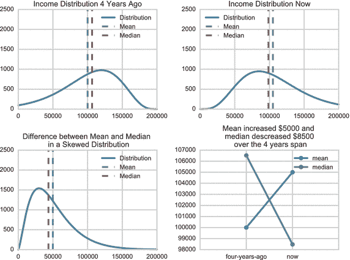
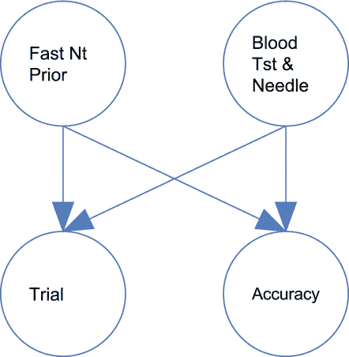
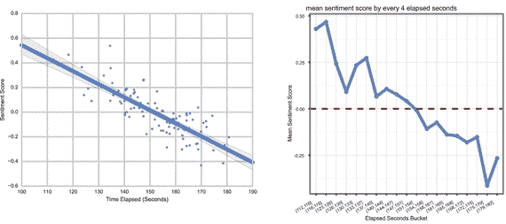
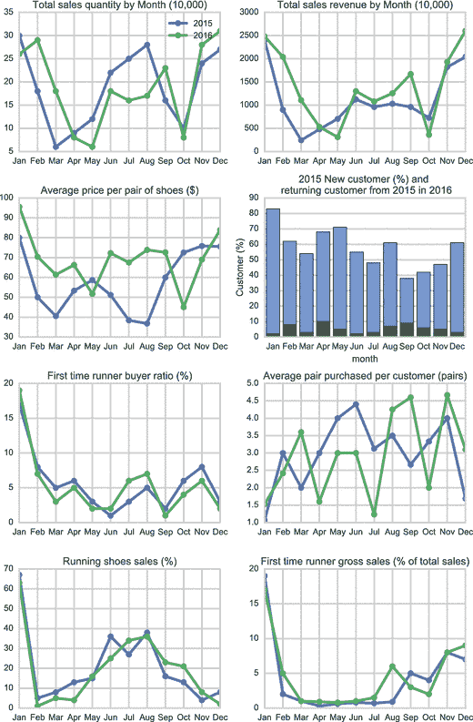

# 四、应用统计分析

数据科学团队将花费大部分时间收集和存储数据，然后使用这些数据提出问题。他们使用统计学和数学创建报告，看看是否能得到答案。统计学是一个非常有趣的领域。要加入数据科学团队，您需要对该语言有一些基本的了解。在探索统计分析时，您需要熟悉几个术语。它们是:

*   描述性统计:以有意义的方式分析、描述或总结数据以发现数据模式的过程。
*   概率:某事发生的可能性。
*   相关性:衡量两个事物相关程度的一系列统计关系。通常用 1 或 0 之间的数字来衡量。
*   因果关系:一个事件是另一个事件发生的结果。
*   预测分析:对历史数据进行统计分析，以预测未来。

我们将在接下来的章节中更详细地讨论这些问题。当您阅读这些部分时，一定要寻找更多的统计分析术语。

## 从描述性统计开始

统计数据是讲述故事的工具，但它们本身并不是故事的结尾。当事情看起来不太对的时候，最好的方法就是回推。

我儿子曾经给我讲过一个关于这个的笑话，这个笑话展示了团队如何利用统计数据来讲述故事。他问:“为什么你从来没见过大象藏在树上？”我耸耸肩，他说:“因为他们真的很擅长。”当你看你的报告时，试着记住这个笑话。人们通常认为统计学是具体的数学。谁会质疑二加二等于四？事实上，统计更像是讲故事。像任何故事一样，它可以充满事实、虚构和幻想。如果你不知道去哪里找，你可以藏起一些相当大的大象。

你会看到这一点的一个地方是政治。一位代表可能会说，“在过去的四年里，选民的平均工资增加了 5000 美元。“人们会鼓掌。挑战者可能会说他们不应该鼓掌，并指出“典型的中产阶级家庭现在的收入比四年前少 1 万美元。“谁说的是实话？答案是两个都有。他们只是用统计数据来讲述不同的故事。一个故事讲繁荣，另一个故事讲失败。他们俩都是真实的，然而他们俩都没有说出全部真相。你必须在这些故事中找到大象。

在这种情况下，代表们使用描述性统计。他们试图在不与每个家庭交谈的情况下描述所有选民的情况。他们正在创作一个典型家庭的故事。

一个代表使用了一种叫做平均值的东西。这是最有用和最流行的描述性统计之一。你可以看到它被用于平均绩点、体育成绩、旅行时间和投资。在这个例子中，代表将每个家庭的收入相加，然后除以家庭总数。果然，每个家庭多赚了大约 5000 美元。

但是坚持住。平均并不是描述一个典型家庭的唯一方式。竞争代表有另一种方法。她使用家庭收入中值。中位数描述了一个处于中间的家庭的收入。为了找到这个数字，你从最低到最高排列所有的家庭，然后从上到下编号。你把排名一分为二就找到了中间的数字。中间的家庭有中等收入。

竞争代表发现中位数收入少了 10，000 美元。这表明平均家庭收入增加了 5，000 美元，但中位数家庭收入减少了 10，000 美元。这是同一个家庭有不同故事的两个描述，如图 [4-1](#Fig1) 。

图 4-1。

Different stories for the same families Note

查看如何在 [`http://ds.tips/c6Aha`](http://ds.tips/c6Aha) 创建这些图表。

当你看到这个的时候，记得去找那头大象。当中位数和平均数之间有很大的差异时，通常意味着你的数据是有偏差的。在这种情况下，想象一下一些家庭非常富有。在过去的几年里，他们的收入大幅增加。这带来了数百万美元的额外收入。这些家庭会歪曲数据，因为顶端有一大笔钱。这将提高平均值，但不会真正影响中位数。也就是说，他们的收入会像其他人一样加起来。在中间值，他们可能只是在排名的顶端。中间点的家庭实际上一点也不会改变。

你会在其他方面看到中位数和均值的挑战。如果有两个人站在一个房间里，他们的平均身高可能略低于 6 英尺。如果一个篮球运动员走进房间，他们的平均值可能会增加一英尺。中值高度将大致保持不变。

在您的数据科学团队中，当您看到使用统计数据讲述的故事时，不要害怕提问。此外，尽量确保您的报告使用不同的方式来描述数据。描述性统计可以讲述许多不同的故事。

## 理解概率

概率是统计学中另一个可以让你讲有趣故事的领域。概率是某事发生的可能性。这是对可能结果的衡量。如果你掷硬币，概率给出硬币落在一边或另一边的可能性。概率统计侧重于概率分布。如果你掷出一个六面骰子，这意味着有六种可能的结果，任何数字出现的可能性是六分之一。这意味着每次你掷骰子，你有大约 17%的机会击中一个特定的数字。概率也可以表示一系列事件。如果你想显示连续两次击中同一个数字的可能性呢？这是 17%中的 17%，大约是 3%。如果你在玩掷骰子游戏，这种概率相当低。您的数据科学团队肯定希望与概率打交道。这是预测分析的关键部分。它帮助你计算出你的客户做一件事比做另一件事的可能性。

我曾经与一家生物技术公司合作，该公司试图利用数据科学来预测某人参加临床试验的可能性。让人们参与临床试验是一件棘手的事情。有一定数量的诊所，公司需要让它们继续运营——即使它们是空的。如果他们不填满，公司就会损失收入。

他们问的一个有趣的问题是，“阻止人们参与临床试验的一些因素是什么？”事实证明，有很多事情可能会降低人们参与的可能性。如果人们不得不在前一天晚上禁食，他们可能会减少 30%的参与。另外，如果有验血和打针，可能会少 20%参加。图 [4-2](#Fig2) 是一个流程图，展示了事前出勤、检测、恐血之间的三向关系。

图 4-2。

Three-way relationship between prior attendance, testing, and fear of blood Note

参见如何在 [`http://ds.tips/V2tup`](http://ds.tips/V2tup) 创建此图表。

该公司必须权衡人们参与的可能性和结果的准确性。例如，有一个药物试验，公司可以通过唾液测试或血液测试来检查药物的有效性。验血有 10%的可能性是准确的。这很容易；他们应该直接用验血。但是坚持住。如果他们进行血液测试，他们的参与者将减少 20%,因为有些人因为害怕针头而决定不做这项研究。如果他们想要 1000 名参与者，那就意味着少了大约 200 人。

这引出了另一个有趣的问题。如果测试少了 200 人，这是否意味着他们的药物试验不太准确？数据科学团队创造了另一种概率分布。如果药物有 1/500 的几率引起某种类型的反应呢？你对 1000 个人的研究比你对 800 个人的研究要好得多。

数据科学团队必须考虑到这一点。即使唾液测试不太准确，让更多的人不用针头参与研究是不是更好？这引发了更多的问题。团队是否应该让参与者进行几次唾液测试，以增加获得准确结果的可能性？最终，这就是数据科学团队帮助公司做出的决定。也许最好是让尽可能多的人参与试验，以增加发现药物反应的可能性。然后，他们可以更频繁地执行不太准确的测试，以增加获得准确结果的可能性。这将允许公司最大限度地参与，同时增加他们研究的准确性——所有这些都是通过概率的力量带给你的。

当您在数据科学团队中从事概率工作时，有几件事情需要记住。首先是概率会把你带到一些意想不到的地方。谁会想到医疗实践可能会通过实施不太准确的测试获得更好的结果？第二，概率也可以是提出有趣问题的重要工具。如果你的问题只是引出更多的问题，不要气馁。

请记住，数据科学涉及将科学方法应用于您的数据。有时候这条路会把你带到意想不到的地方。重要的是当道路急转弯时不要跳下来，这在你处理概率时很容易发生。那些急转弯往往是通向你最大洞察力的道路。

## 寻找相关性

相关性是数据科学中另一个非常有趣的领域。许多公司用它来猜测你会买哪些产品。它也用来联系你的朋友和熟人。如果你使用像网飞这样的服务，你可能会惊讶于网站能如此准确地猜出你喜欢什么电影。亚马逊多年来一直使用相关性来推荐书籍。

相关性是衡量两个事物相关程度的一系列统计关系。通常用 1 或 0 来衡量。如果两件事密切相关，那么相关性为 1。如果两件事没有关系，那么相关性为 0。1 可以表示为正数或负数。A -1 是典型的逆相关或反相关。

正相关可能是身高和体重。如果一个人个子高，他或她可能会更重。随着高度的增加，重量也增加。还有更直白的例子，比如外面温度越高，买冰淇淋的人就越多。随着气温的上升，冰淇淋的销量也会上升。负相关可能类似于汽车和汽油。汽车越重，越不可能获得好的油耗。随着汽车重量的增加，耗油量会减少。他们有一种相反的关系。

如果你是一名跑步者，你可能会注意到上坡时跑得更慢了。这也是一种负相关。坡度越陡，你跑得越慢。坡度越大，你的速度越慢。

正相关和负相关都是观察两个事物之间关系的好方法。负相关不是坏事。这只是另一种关系。

数据科学团队将在他们的数据中寻找相关性。他们会尝试微调人与物之间的任何关系。幸运的是，软件工具可以处理计算相关性背后的大量数学运算。一个常用的公式是相关系数，它是 1、0 和-1，表示人和事物之间是否存在统计关系。

当计算相关系数时，你通常不会得到一个好的、整洁的整数。相反，你可能会发现 0.5 或 0.75 的相关性。这表明相关性更强或更弱，你越接近 1 或-1，关系越强。

一个有趣的数据科学挑战是 LinkedIn 的“你可能认识的人”功能。LinkedIn 希望找到一种方法来确定专业人士何时相互认识。有数据科学团队处理 LinkedIn 数据，寻找联系之间的相关性，然后试图找出它们为什么联系在一起。这种联系可能是因为他们上过的学校、共同的工作或共同的团体和兴趣。

这个数据科学团队寻找正相关和负相关。他们可能会在网站上找到信息，显示你在某家公司工作，并且你对某个工作感兴趣。然后他们会找到对同一份工作感兴趣并在同一家公司工作过的其他人。这足以在你和另一个人之间建立关联；因此，网站可能会建议您与此人建立联系。

数据科学团队还可以在你的人脉和其他人的人脉之间建立关联。如果你和一个人有联系，而他们又和一个和你有相似技能的人有联系，你们可能会有很好的联系。仔细想想，这很有道理。你更有可能认识在同一栋办公楼工作的人。你也更有可能和有相似兴趣和技能的人联系在一起。随着相似技能数量的增加，你认识那个人的可能性也会增加。

相关性也有能力帮助你的团队质疑它的假设。你可能会认为在你的网站上花钱最多的人也会是你最快乐的顾客。事实可能并非如此。事实上，两者之间可能存在负相关。也许花钱最多的人实际上有着最不切实际的期望。他们更容易失望，也更有可能留下负面反馈，如图 [4-3](#Fig3) 所示。

图 4-3。

Sentiment score over time Note

访问者在网站上花的时间越多，情感得分就越低。参见如何在 [`http://ds.tips/pawR7`](http://ds.tips/pawR7) 创建此图表。

作为一个数据科学团队，您将使用相关性来测试您的假设。你可能会寻找策略让你最快乐的人花更多的钱。你也可以想办法管理高消费群体的期望。如果你寻找这些相关性，你会发现很多你可能会忽略的东西。

### 看到相关性并不意味着因果关系

相关性是一个很好的工具——它帮助你看到你可能看不到的关系。但是也有不好的一面。你得看看这种相关性是否导致了某些事情的发生。这是引起变化的原因吗？一般来说，相关性并不意味着因果关系。第三件没有被考虑的事情可能会影响两件事情之间的关系。对于数据科学团队来说，找出因果关系是一个巨大的挑战。你不想建立不存在的关系。

这么想吧。我在该国较冷的地区长大。当我的父母长大后，他们搬到了佛罗里达州南部。他们现在幸福地生活在一个阳光明媚的退休社区。每隔几个月，我的家人都会去佛罗里达拜访。据统计，他们的社区是地球上最危险的地方之一。我们每次探访，都有人在住院或者更糟。他们的社区和死亡或严重伤害之间有很强的相关性。你可能会认为因为这个我永远不会去看望我的父母。这听起来像每个第一人称射击游戏的开场场景。

然而，我们忽略了这种相关性。我们经常去看他们，感觉非常安全。因为相关性并不意味着因果关系。真正的原因是年龄中位数高得多。退休社区中的老年人受伤或死亡的概率更高。如果你看到这种相关性，你会认为他们生活在战区。你永远想象不到他们会在泳池边平静地打麻将。

想想你的数据科学团队可能也应用这些概念。让我们回到我们的跑鞋网站。假设团队发现一月份的销售额大幅增长。一月和买新鞋的人数之间有很强的相关性。

团队聚在一起了解原因。他们问了一些有趣的问题。人一月钱多吗？最冷的月份跑步的人多吗？这些是第一次跑步吗？他们是新客户吗？他们在买什么样的鞋？

团队讨论问题并决定创建报告。报告显示，这些顾客大多是购买昂贵鞋子的新顾客。因为这些报告，团队认为新销售的原因是新客户在一月份有更多的钱。也许他们收到了购物卡。

第二年，团队决定利用这种因果关系。12 月，他们提供打折礼品卡。他们还向去年的新客户发送促销信息。几个月后，团队查看数据。他们发现他们的促销和折扣没有影响。大致相同数量的人买了相同数量的鞋子。更糟糕的是，去年的新客户似乎对新跑鞋毫无兴趣。因此，有更多的钱并不是相关性的原因。数据科学团队回到他们最初的问题，并运行了几个报告。他们发现，这两年所有的新销售都是针对新客户和首次跑步者的。为什么在最冷的几个月会有大量新顾客购买昂贵的跑鞋？

该团队对此进行了思考，认为原因可能是行为上的。他们提出了一个新问题。所有的新顾客都是因为新年决心而努力减肥的人吗？他们回去创建报告，如图 [4-4](#Fig4) 所示。报道称，他们都是新客户，购买了一双鞋，然后在年中停止访问该网站。这表明他们买了昂贵的鞋子，然后放弃了。该团队猜测，昂贵的鞋子可能是继续跑步的动力。第二年，他们决定创造一个新的促销活动。它围绕着新年决心。他们发出一封邮件，上面写着:“你想保留你的新年决心吗？”它提供免费的跑步指南和健身追踪器，以此来保持人们的兴趣。

图 4-4。

January 2015 and 2016 reports Note

2015 年 1 月和 2016 年 1 月的销售额和总收入分别位居第一和第二。在这两年中，一月份每双鞋的平均价格最高。该公司在 2016 年提供了更多的礼品卡折扣，但这并没有促进销售。2015 年回头客数量和 2016 年新增客户数量均为历年最低。2015 年 1 月和 2016 年 1 月，约有 15%至 20%的买家是首次跑步者。他们平均买了 1 到 1.5 双鞋。当您深入查看首次跑步者细分市场的客户行为时，总销售额在 1 月份达到峰值。他们中的一些人在第四季度回来，但大约一半的人再也没有回来。参见如何在 [`http://ds.tips/fe2Ax`](http://ds.tips/fe2Ax) 创建此图表。

相关性和因果关系是大多数数据科学团队面临的主要挑战。制造虚假关系是真正的危险。在统计学中，这被称为虚假因果关系。如你所见，找到真正的原因会给你带来更大的价值。避免虚假因果关系的最好方法是遵循科学方法。记得提出好的问题，并对结果保持清醒的头脑。

## 预测分析的组合技术

到目前为止，你所看到的一切都是关于过去的。您已经看到了如何收集不同的数据类型，然后执行统计分析。这些统计数据是获得更深刻见解的起点。您的数据科学团队将开始创建相关性，并查看某些事件的概率。现在，让我们用这些想法来预测未来——通常称为预测分析。这个术语与数据科学密切相关，以至于它们有时甚至可以互换使用，但是它们并不相同。预测分析是一种数据科学。数据科学是将科学方法应用于您的数据，而预测分析会获取该结果并使其具有可操作性。

这么想吧。气象学是一门科学。这些科学家研究物理、风速和大气。如果你和一位气象学家在外面，他或她会向你解释为什么云看起来像某种样子，以及压力如何决定它们的运动。这是气象学的科学方面。而是了解天气，看到历史趋势。更普遍的气象学观点并不围绕科学；相反，它与天气预报有关。

天气预报是指一组气象学家使用预测分析。他们可以使用历史数据来分配概率，并使用概率和相关性来预测天气模式。低压系统和强风暴之间可能有关联。随着气压的降低，风暴的强度增加。气压和风暴之间存在正相关关系。

所有这些分析综合起来，气象学家就可以回答一个简单的问题:明天天气会怎么样？曾经的理解过去现在变成了对未来的预测。

目前，人们对预测分析越来越感兴趣，因为新的工具和技术允许更有趣的见解。想想天气预报。目前，气象服务仅限于几千个气象站的历史数据。想象一下，气象局发出了数百万个低成本的信标。人们会把它们安装在家里，并连接到他们的无线网络。这些设备将记录气压和温度信息，以及视频和音频，然后将数据上传到全国 Hadoop 集群。这将给科学家提供前所未有的信息。

这就是预测分析与数据科学如此紧密相关的原因。更大的数据量允许团队提出有趣的问题。然后团队可以执行复杂的分析。在这里，团队将能够逐屋逐街区地观察天气模式，然后基于数百万个家庭创建复杂的预测模型。

你的团队也是如此。想想跑鞋网站。想象一下，你的团队收集了数百万条关于跑步的推文。该团队在 Twitter 上发现了一些有影响力的跑步者。然后你可以送他们免费的鞋子或促销商品，希望他们会说你公司的好话。您还可以使用这些数据来识别关键的跑步事件。

这些新工具允许数据科学团队获得更大的数据视图，并实时查看信息波。气象学家可以分析数十亿字节的信息，跑鞋网站团队可以分析数百万条推文。

组织通常对预测分析的想法非常兴奋，以至于他们并不总是投入足够的时间来发展他们的数据科学团队。他们想在不了解现有数据的情况下直接进行预测。当你在数据科学团队工作时，一定要传达预测的质量取决于团队对数据的分析程度。

你的团队必须了解过去才能预测未来。不要欺骗你的分析。对您的数据提出好的问题，并使用您的统计工具来创建有趣的报告。一旦你做到了这一点，你对未来的预测就更有可能准确。

## 摘要

在本章中，您学习了描述性统计、概率、相关性、因果关系和预测分析。您还学习了如何在您的数据科学故事中使用统计数据。在第 [5](05.html) 章中，您将学习如何在开始使用数据科学时避免陷阱。