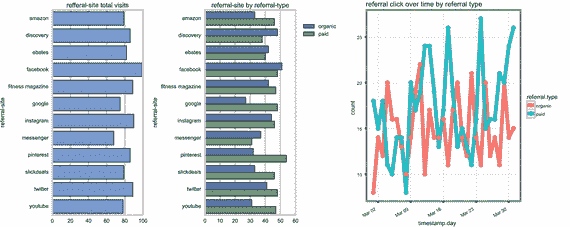
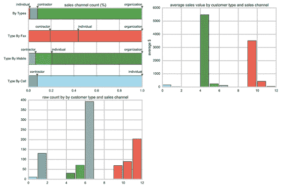

# 六、完善你的才能

我们在第 2 章[中定义了数据科学，并讲述了成为“数据科学家”意味着什么在这一章中，你将看到如何把这个角色分成几个团队角色。然后，您将看到这个团队如何共同努力建立更好的数据科学思维。](02.html)

## 透视数据科学家

正如您在第 [2](02.html) 章中了解到的，围绕数据科学家的角色存在一些困惑。2001 年，威廉·s·克利夫兰出版了《数据科学:扩大统计领域技术领域的行动计划》。 [1](#Fn1) 这篇论文首次将统计学和计算机科学领域融合在一起，创建了一个新的创新领域，称为“数据科学”与此同时，Leo Breiman 出版了《统计建模:两种文化》， [2](#Fn2) 描述了统计学家应该如何改变他们的思维模式，采用一套更加多样化的工具。这两篇论文为数据科学奠定了基础，但它建立在统计学领域之上。

2008 年，来自脸书和 LinkedIn 的一些顶级数据专家聚在一起讨论他们的日常挑战。他们意识到他们在做类似的事情。他们认为自己的角色是许多不同学科的交叉。他们决定称这个角色为“数据科学家”

当时的数据科学家只是一个素质列表。例如:

*   理解数据
*   懂统计学和数学
*   应用机器学习
*   懂编程
*   好奇
*   成为伟大的沟通者和黑客

他们是文艺复兴的狂热分子，跨越了许多不同的领域。

问题是，这个技能列表不容易在一个人身上找到。我们每个人都根据自己的天赋倾向于某些领域。我们通常被自己的天赋所吸引，然后努力完善自己的技艺。统计学家通常会努力成为更好的统计学家。业务分析师将努力提高他或她的沟通技巧。专业化也有很大的组织压力。大多数大型组织都划分为不同的职能领域。需要一些共同的理解，但不总是共同的专业知识。

众所周知，人们也不善于自我评估自己的能力。著名的邓宁克鲁格研究 [3](#Fn3) 发现，认为自己技术高超的人通常会戏剧性地高估自己的专业知识。一个有天赋的统计学家可能认为自己是一个优秀的沟通者，但是你不需要成为一个优秀的沟通者来成为一个伟大的统计学家。一个伟大的统计学家可以轻松地拥有漫长的职业生涯，即使他或她在演讲中笨手笨脚。

这就是为什么大多数组织将工作分成小组。团队中的每个人都有自己的专业领域。跨职能团队不会假设每个人都是专家。相反，它鼓励个人取长补短。数据科学家团队可能无法识别这些弱点。如果没有人识别盲点，团队就会盲目摸索。

我曾经为一个组织工作，该组织有一个数据科学家团队正在构建一个集群。企业有一些担忧，因为高层不知道团队在构建什么——他们感到沮丧，因为他们在为他们不理解的东西付费。我参加了一些会议。数据科学家团队演示了一个简单的 mapReduce 工作。业务经理们茫然地盯着屏幕，偶尔瞥一眼他们的智能手机。对于一个局外人来说，从打哈欠和揉眼睛来看，这个团队显然没有做好沟通工作。

会后，我在白板上写了一个矩阵。我列出了以下六种技能:

*   数据
*   发展
*   机器学习
*   统计数字
*   数学
*   沟通

我请数据科学家从 1 到 10 (1 为差，10 为最好)对他们在这些方面的表现进行评分，以便我们寻找需要改进的地方。我拿着同样的技能列表，给其中一位业务分析师看。我让他们给这个团队打分。

结果如表 [6-1](#Tab1) 所示。

表 6-1。

Data scientists’ and business analysts’ ratings

<colgroup><col> <col> <col></colgroup> 
| 技能组合 | 数据科学家的评级 | 商业分析师的评级 |
| --- | --- | --- |
| 数据 | eight | Ten |
| 发展 | seven | nine |
| 机器学习 | six | eight |
| 统计数字 | eight | nine |
| 数学 | eight | Ten |
| 沟通 | nine | six |

这是典型的邓宁·克鲁格结果。在数据科学家认为自己技术高超的地方，他们大大高估了自己的专业知识。数据科学家都来自定量领域。他们是统计学家、数学家和数据分析师。他们无法识别自己的盲点。需要一个完全不同领域的人来照亮他们的挑战。

如果你是一个试图从数据科学中获取价值的大型组织的一部分，那么依赖少数超级数据科学家将是一个错误。来自相似背景的人往往会有相同的盲点。学术研究表明，你通常会从背景各异的跨职能团队中获得更好的见解。 [4](#Fn4)

在我们兼收并蓄的组织结构中有一些智慧。具有市场营销、商业和管理背景的人应该在数据科学领域占有一席之地。假设具有量化背景的关键人物会有相同的问题和见解是不现实的。让你的团队多样化，你更有可能取得好成绩。

## 看到不同技能的价值

你的数据科学团队面临的危险之一是过于强调数据科学家。请记住，数据科学家是多学科的。他们应该了解统计学、数学、开发和机器学习，同时了解客户并提出有趣的问题。大多数数据科学家来自工程、数学和统计背景。这意味着他们可能会分享相似的提问方式，并从共同的角度看待数据。

从事数学和统计工作的人不太可能像从事市场营销工作的人那样了解客户。成为一个领域的专家并不意味着在另一个领域也有专长。

许多自称多学科的人通常拥有一些非常强的技能和其他领域的知识。如果你在很多领域都非常自信，你可能会有很大的技能差距。这也意味着，一个只有数据科学家的团队可能会有类似的盲点，容易出现群体思维。

防止这种情况发生的一种方法是允许具有其他背景的人加入您的数据科学团队。请记住，好的数据科学依赖于有趣的问题。没有理由为什么这些有趣的问题只能来自分析数据的人。

想想你的跑鞋网站。数据分析师应该不难找到将客户推荐到商店的网站。假设大部分客户来自 Twitter、Google 和脸书。也有不少顾客来自其他跑鞋网站。一个好的数据分析师可以很容易地创建一份客户在向您购买之前访问的前 50 个网站的报告。试图找出人们来自哪里是一个很好的分析问题。它是关于收集数据，统计数据，并显示在一个漂亮的报告中，如图 [6-1](#Fig1) 所示。

图 6-1。

Referral-site total visits and referral type Note

脸书、Twitter 和 Instagram 似乎在付费和有机流量方面都带来了巨大的流量。Pinterest 为其他网站带来了相当数量的流量，但大约一半的流量来自付费广告。查看如何在 [http:// ds. tips/ fRa4a](http://ds.tips/fRa4a) 创建这些图表。

数据科学团队更深入。团队可能会问，为什么来自 Twitter 的人比来自 Google 的人多？人们在发鞋子的照片吗？如果我们在 Twitter 上购买广告，会有多少人访问这个网站？一个网站比另一个网站更适合发布新产品吗？如果人们看到一只鞋的照片，他们会更有可能访问这个网站吗？这些问题与数据是分开的。商业分析师、营销专家或项目经理没有理由不能问这些问题。

一项对经济系的研究表明，当不同学科的人合作时，他们更有可能产生更高质量的出版物。意见的多样性有利于他们工作的数量和质量。此外，来自不同背景的人更有可能不同意。意见不一致导致每个人都更加努力。最终，这使得每个人的论点更加有力。如果团队中的每个人都很容易就最佳问题达成一致，那么你可能没有问出非常有趣的问题。

当您创建数据科学团队时，请尝试包含来自组织不同部门的许多人。您希望您组织中的每个人都考虑如何更加数据驱动。如果你只为你的团队雇佣数据科学家，你可能会让数据科学看起来像一门黑暗的艺术——只有少数高技能人才应该尝试。这将使您的数据科学缺乏创造性，并与组织的其他部分脱节。

在您的数据科学团队中，将分析与洞察分开非常重要。数据分析师捕获、计算并呈现数据。获得洞察力要难得多。你需要遵循提出有趣问题和寻找结果的科学方法。不要让你的团队只出数据分析。你希望他们更加努力。很可能来自业务部门的某个人会推动团队提出更多有趣的问题。营销团队中的某个人也可能会对您的客户有一些有趣的问题。

一些组织已经开始朝着这个方向发展。LinkedIn 等公司创建了数据墙，显示来自数据分析师的不同报告和图表。这些信息墙允许组织中的所有人查看数据中是否有任何有趣的东西。营销助理可能会看到一个有趣的故事，或者人力资源实习生可能会想到一个有趣的问题。这是从组织的其他部门获得反馈的好方法。

一些组织更进一步，确保每个数据科学团队都有一名来自营销和项目管理办公室的代表。这可以确保您的数据科学团队中有人专门为客户着想，也有人了解如何为组织的其他部门提供价值。

## 创建数据科学思维模式

与数据科学团队相关的一个术语是“数据驱动”这是一个有点棘手的术语。我们都喜欢用数据来驱动我们的决策。如果你决定不吃加油站的寿司，这是基于真实数据的。你在利用过去的经验和一些观察来做出一个好的决定。通常情况下，你的直觉是正确的——或者至少有一半是正确的。尽量不要把数据驱动的决策看作是你自己直觉的替代物。数据驱动的文化使用数据来增强团队的直觉，而不是取代它。

您的数据科学团队将是创建与数据有更深关系的更大数据科学思维的起点。试着将数据驱动型组织想象成拥有许多数据科学团队的公司，这些团队强化了数据科学思维模式。这些团队创造了一种问题和洞察力的文化。他们不仅应该帮助组织收集数据，还应该使数据具有可操作性。

数据科学团队将有三个主要职责领域。这三个领域为您的数据科学团队奠定了基础，这将有助于您组织中的其他人接受这种新的思维模式。它们是:

*   收集、访问和报告数据(基础工作):这包括将原始数据处理成其他人都能理解的东西。
*   问好问题:这推动了有趣的数据实验，并且可能来自不一定具有技术背景的团队成员。他们可能来自商业、营销或管理部门。他们提出有趣的商业问题，并促使每个人质疑他们的假设。
*   使数据具有可操作性:这将是团队成员的责任，他们主要关心团队学到了什么，以及如何将这些数据应用到组织中。

我曾经在一家零售机构工作，销售家用五金和建筑用品。该公司维护了几个呼叫中心，因为许多客户更喜欢通过电话订购，而不是使用移动应用程序。

该公司刚刚开始研究数据科学，并希望数据科学团队了解为什么这些客户更喜欢打电话，因为维护呼叫中心的成本很高。此外，通过电话接受的订单更容易出错。数据科学团队有三个人:理解数据的人、业务分析师和项目经理。他们三个聚在一起，试图理解为什么这些客户更喜欢打电话。

业务分析师是第一个开始提问的人。这些客户有通过手机订购的账户吗？他们是专业人士还是住宅客户？他们花了多少钱？

然后，团队创建了数据报告，如图 [6-2](#Fig2) 所示。数据显示，大多数人都是专业人士，他们经常通过移动设备下几个订单。他们通过呼叫中心下的订单比通过移动应用程序下的订单少得多。大约 80%的交易金额低于 20 美元。业务分析师提出了后续问题，“为什么我们一些最忠诚的专业客户打电话来订购低于 20 美元的订单？”

图 6-2。

Data reports for sales channels Note

大部分订单都是组织下的；然而，大多数通过电话下单的都是个人。在所有类别中，通过个人电话下单的平均总价值最低。查看如何在 [`http://ds.tips/3uprU`](http://ds.tips/3uprU) 创建这些图表。

在查看数据并与一些客户服务代表交谈后，他们发现这些客户打电话是因为他们需要一个小零件来解决一个大问题。当这些专业人员在工作现场时，客户服务代表正在查找该零件。电话中的大部分时间都花在了描述、识别和加速他们需要的关键部分上。

这个小组尝试了一个实验。他们联系了一些大批量的专业客户，要求他们在需要紧急零件时发送一张图片。他们称之为“Pic-it-Ship-it”计划。他们希望这能提高客户满意度，减少花在电话上描述零件的时间。

数据科学团队很小，但他们仍然涵盖了所有三个责任领域。他们收集了数据并创建了有趣的报告。业务分析师问了一些有趣的问题，并对客户有了一些了解。最后，项目经理组织了一个实验，并开始了一个小的试验计划。他们收集新数据，提出有趣的问题，并使这些见解具有可操作性。

在数据科学团队进行这些实验之前，该组织总是假设这些人是小钱的住宅客户，他们在电话上比在移动应用程序上更舒服。他们的直觉只是部分正确。大多数打电话的人实际上都是他们最有价值的客户。多元化团队的数据科学思维带来了更好的见解。

## 摘要

在本章中，您探索了数据科学团队中的角色。你发现了什么样的技能可以发挥作用。您还看到了如何培养数据科学思维。在第 7 章中，你会发现如何组建你的团队。

Footnotes [1](#Fn1_source)

数据科学:扩展统计学领域技术领域的行动计划。《国际统计评论》69，第 1 期(2001 年):第 21-26 页。

  [2](#Fn2_source)

布雷曼，利奥。"统计建模:两种文化(作者的评论和反驳)."统计科学 16，第 3 期(2001 年):199-231。

  [3](#Fn3_source)

克鲁格、贾斯汀和大卫·邓宁。"不熟练并且没有意识到:认识到自己的不称职是如何导致自我评估膨胀的."人格与社会心理学杂志 77.6 (1999): 1121。

  [4](#Fn4_source)

博斯克特、克莱门特和皮埃尔-菲利普·库姆斯。“大系会让学术更有成果吗？研究中的聚集效应和同伴效应。”空间经济研究中心讨论文件，第 133 号(2013 年)。