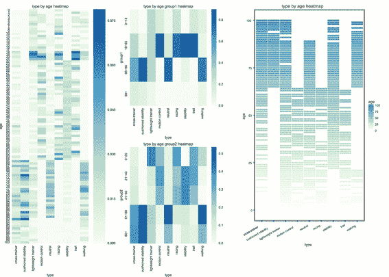
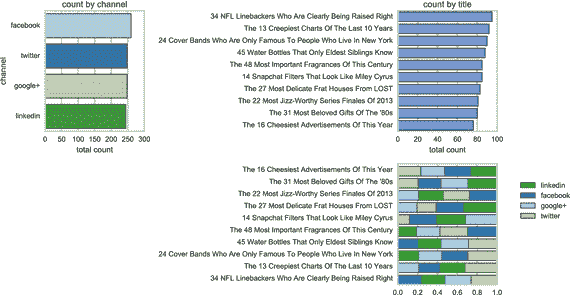
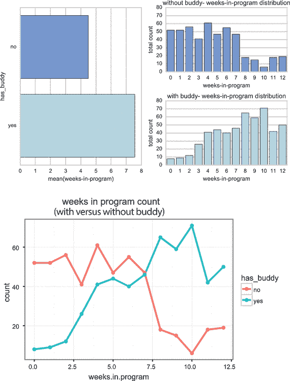

# 七、组建团队

拥有数据科学思维既是一种组织挑战，也是一种文化挑战。不是雇几个数据分析师那么简单。您希望您的整个组织以创造性和有趣的方式思考您的数据。数据分析师将帮助你分析你的数据，但他们可能不是新见解的最佳来源。正如在第 [6](06.html) 章中提到的，你应该把数据科学看作是一个团队的努力——不同背景的小团体用你的数据进行实验来创造知识。那是数据科学中的科学方法。这是一个经验性的探索过程。你会问好问题，收集证据，并试图得出结论。

与其找几个什么都能做的人，不如和你现有的能做大部分事情的人一起工作。我认为一个行之有效的模式是将您的数据科学团队分成三个角色:

*   研究领导
*   数据分析师
*   项目管理人

我在不同的组织中见过这三种角色。他们可能有不同的名字，但他们期待完成同样的事情:问好问题，收集证据，并试图获得洞察力。我们将在接下来的章节中更详细地介绍每一个角色，然后我们将讨论他们如何在团队中合作。

## 利用研究线索提出好问题

阿尔伯特·爱因斯坦说过，如果他有一个小时来解决一个问题，他会花前 55 分钟去寻找正确的问题。问题是发现的关键。这使得他们对于数据科学团队来说至关重要。问题是你获得新见解的最重要的驱动力。数据科学中“科学”的关键部分是找到正确的问题。

你已经有数据了。您的组织可能正在收集比您需要的更多的数据。在许多方面，你已经收集了答案。现在你必须提出正确的问题。对于大多数组织来说，这不是一件容易的事情。我们仍然为渴望答案的公司工作，因为答案结束了讨论。你从会议中解脱出来，开始将一些事情付诸实践。这就是为什么组织倾向于青睐专家。他们提供了答案。答案是最终的和封闭的；问题是开放式的。另外，一个好的问题可以引出更多的问题。

这就是为什么数据科学团队应该依靠只专注于提问的人。这个人应该了解业务，但他或她也需要走出业务。对于这个角色，我听过的最好的名字之一是研究领导。它抓住了人的主要责任:引导提问和推动研究。

研究负责人应该来自业务部门，推动团队提出有趣的问题。她应该从与团队一起提出问题或确定关键问题开始。她可以把它们贴在问题墙上，或者整理成便利贴。

研究负责人有三个方面的责任:

*   确定假设
*   驱动问题
*   了解业务

这三个领域密切相关。作为一名研究主管，有时你不得不跳出你的经验，像第一次看到业务一样去处理它。这需要一些努力，你必须致力于采取新的视角。

当有一个有趣的问题时，一个好的研究领导者会凭直觉知道。杰森·斯蒂芬博士就是这样。 [1](#Fn1) 他是一位天体物理学家，也是一位经常旅行的人。他发现自己排在等待登机的长队中。大多数人只是接受这是旅行的一部分。Steffen 博士非常了解飞行这一行，他意识到让乘客排长队是低效且昂贵的。他问了一个简单的问题，“有没有更好的登机方式？”他的科学背景帮助他想出了一个解决方案。他想象人们平行登机，每隔一排跳过一排。这比目前让人们一次一个人排队的方法要有效得多。(不幸的是，由于各种原因，这种做法还没有实施。)

Steffen 博士经历了一个好的研究领导者的所有三个行动。他对这个行业有一些了解。他知道飞行。他能够质疑自己的假设。数百万人在他面前排起了长队，没有对登机过程进行第二次思考。最后，他提出了一个简单的问题:有没有更好的办法？

你不一定要成为科学家才能想出有趣的问题。一个研究领导应该对业务有所了解，但是这个人不需要成为专家。例如，爱德华·兰德发明了宝丽来即时照相机，因为他受到了他三岁女儿的一个问题的启发。当他们在新墨西哥度假时，他用一架普通照相机拍了一张照片。他的女儿只是问，“为什么我们要等照片？”他的女儿质疑一个简单的假设。

这两个问题开启了有趣的探索之路。Steffen 博士想出了一种让人们登机效率提高 30%的方法，Edward Land 创造了一种即时相机，这是 20 世纪最具创新性和最漂亮的技术产品之一。

研究领导角色的最有帮助的组成部分之一是它将问题与数据分开。问好问题本身没有什么技术含量。记住，爱德华·兰德的女儿只有三岁。

将提出问题的人和寻找可能答案的人分开也有很多好处。这有内在的利益冲突。如果你只有一个很小的数据集，你可以把自己限制在简单的问题上——那些你已经可以用你的数据来回答的问题。一条好的研究线索可能会让你重新思考你收集的数据类型。最后，那更有价值。

## 向数据分析师展示数据

你的团队需要优秀的数据分析师。数据分析师负责理解数据，获取和清理数据，然后在简单的报告中显示数据。他们应该与研究线索一起工作，看看报告中是否有什么发现。他们还应该推荐统计方法或创建数据可视化。研究负责人和数据分析师将携手构建见解。研究主管专注于提出最佳问题，而数据分析师则试图提供最佳报告。

围绕不同的数据工作头衔有很多混乱。有统计学家，统计分析师，数据分析师，数据科学家，数据工程师，甚至数学家。你甚至可以任意在其中任何一个上面加上“首席”或者“资深”。首席统计师可能比高级数据科学家级别高得多。所有这些混乱的原因是从事这些工作的人都做着非常相似的事情。以这样或那样的方式，他们都在实践从数据中学习的科学；他们只是以非常不同的方式来扮演这个角色。

统计学已经存在了几百年。这一学科的发展是因为政府需要了解自己的人口和经济数据。它有着悠久而丰富的历史。美国统计协会(ASA)是美国历史最悠久的专业协会之一。

另一方面，数据分析师来自计算机科学。他们学习从关系数据库和 NoSQL 数据库中提取意义。他们专注于呈现和发现支持决策的有趣数据。

数据科学家被认为是多学科的。他们是数据分析师，但他们也开发软件，从事数学工作，了解业务，并提出有趣的问题。作为 Bitly 的前首席科学家，希拉里·梅森创建了一个流行的定义。她认为数据科学家是数据分析师，他们也懂数学、软件开发、工程和黑客。他们可以迈出下一步。他们可以开始寻找见解，而不仅仅是制作报告。

数据科学团队将通常由一名数据科学家承担的职责进行了拆分。通常，要求一个人理解数据和业务并提出有趣的问题是很难的。一个好的数据科学团队需要一个对软件开发略知一二的数据分析师，而大多数数据分析师已经发现了解软件开发是必要的。许多优秀的可视化工具需要一些软件编码。Python 和 R 是探索和显示数据的两种最流行的语言。(你在第 [1](01.html) 章学到了一些关于这些语言的知识。)

在数据科学团队中，数据分析师有三个主要职责领域:准备数据、选择工具，然后展示结果。

### 准备数据和选择工具

准备数据和选择工具是齐头并进的。你必须选择准备数据的工具。所以，作为数据分析师，你大部分时间都在准备数据。您必须找出获取数据的最佳方式——无论是通过 web APIs、从页面抓取数据，还是从组织的不同部门收集数据——然后清理数据。清理数据通过修复不同的字段或添加缺失的数据(如扩展缩写或纠正拼写错误的单词)使其更加有用。

### 展示结果

数据分析师面临的主要挑战之一是与研究主管一起探索数据，找出是否有突出的东西，并创建见解和报告。有时候，大量的数据会导致缺乏洞察力。如果数据分析师让团队超负荷工作，实际上会限制每个人解读信息的方式。

为了避免这种情况，数据分析师需要与研究负责人密切合作，在他们的报告中解释权衡。通常在统计数据中，你看不到的东西对你的理解至关重要。有时候那是故意的；其他时候不是。

假设研究负责人想要查看在跑鞋网站上购物的所有男性和女性的汇总，并显示按年龄组的细分。作为数据分析师，你可能会问年龄层。你是每五年还是每十年创建一个支架？如果你每五年创建一个，你会有 18 或 19 个中间倾斜的括号，因为 18 岁以下或 90 岁以上的跑步者可能较少。

该报告也可能难以阅读。对于 20 岁到 40 岁之间的人，你可能不需要这种粒度。35 岁和 40 岁之间可能会有很大的差别。如果你打破这个年龄段，你可能会歪曲数据。这可能会让 30 岁到 40 岁的人看起来更少。这就是数据分析师在展示数据时保持透明非常重要的原因。这里有一些影响故事的决定。如图 [7-1](#Fig1) 所示，整个团队应该努力提前了解这些决策，并传达一个准确的故事。

图 7-1。

Heatmaps Note

从最细的层面(每个年龄作为一个单元)和不同年龄组的热图来看:左图显示轻量级运动鞋在 18-21 岁之间最受欢迎；运动控制、赛车、稳定性和拖车更受 21-65 岁人群的欢迎。然而，由于不同的年龄界限，显示在右边，这个数据可能携带一个非常不同的信息。在右上方，似乎轻量级运动鞋在所有三个年龄段(0-18 岁，19-65 岁，66-90 岁)都同样受欢迎，但如果你看看右下方和原始热图，它显然只在 18-21 岁之间更受欢迎。这是因为右上角的第一个桶将最受欢迎的范围分成了两半。查看如何在 [`http://ds.tips/m2zAm`](http://ds.tips/m2zAm) 创建这些图表。

所有这些决策通常由数据分析师决定。然而，与研究主管一起做出这些决定有助于整个团队更好地理解数据。

## 与项目经理保持一致

在数据科学团队工作最困难的部分之一是让您的见解具有可操作性。这项工作应该开始感觉像一个正在进行的科学实验。你得到一点数据。研究线索引发了有趣的问题。这些问题刺激更多的报告，这通常会导致更多的问题。

在这一轮探索中，团队需要专注于收集数据的目的。还需要一种向组织的其他人解释这些见解的机制。不幸的是，这意味着许多会议，这可能是一个真正的时间消耗。当作品具有创造性时尤其如此。

我曾经为一个组织工作，该组织有一个非常有创造力的数据科学团队。他们想出了利用公司大量信用卡数据的有趣的新方法。在最初的几个月里，数据科学团队大多独自探索数据。最终，团队产生了一些非常有趣的见解。随着他们的见解变得更加有趣，组织中的其他人也变得更加好奇。各部门开始号召团队成员做报告。这些会议使得其他团队更加感兴趣。这导致了更多的会议。几个月后，数据科学团队中的一些人每周开会长达 20 个小时。他们从数据科学从业者变成了演示者。

数据科学团队中这些关键人物的缺席降低了团队其他成员的工作效率，以至于他们产生的见解越来越少。他们花在查看数据上的时间要少得多。请求召开会议的部门开始询问为什么数据科学团队没有找到同样多的见解。

这在许多组织中都是一个悖论。你的工作对公司的其他人越有意思，你在会议上谈论工作的时间就越多，这意味着实际工作的时间就越少。

打破这种循环的最好方法是拥有一个高效的项目经理。项目经理非常擅长保护数据科学团队不偏离轨道。他们可以通过在会议上代表团队来做到这一点。

数据科学团队中的项目经理负责三个主要领域:使数据民主化(使其广泛可用)、共享结果以及加强组织学习。项目经理既当挡箭牌，又当推土机；保护团队免于过多会议的盾牌，这将有助于保持团队工作，以及打破障碍和访问隐藏数据的推土机。

### 使数据民主化

当您在大型组织中工作时，访问所有数据变得越来越困难。项目经理可以帮助打破这些孤岛，从而使整个组织受益。例如，假设您的数据科学团队想要访问位于数据中心角落的某个布满灰尘的服务器上的数据。当团队试图访问它时，他们发现它是禁区，只对某个部门开放。您的项目经理负责尝试说服该部门允许数据科学团队访问这些数据。

### 分享结果

项目经理还负责分发信息。他们是参加会议并展示团队成果的人。如果另一个部门的人想要访问团队的数据，项目经理会给他们提供访问权限。

数据民主化和结果分发密切相关。这是一条双行道:一条路可以访问组织数据，另一条路允许组织的其他人访问团队的见解。其中每一个都有自己的一系列会议和挑战。

### 加强组织学习

项目经理的最后一个领域是加强学习——获取洞察力并使其可操作。在一天结束的时候，团队仍然会根据组织学到的东西进行评估。需要有人坚持到底，将洞察力转化为产品或变革。

想象一下，如果拥有信用卡数据的组织发现了一些有趣的事情，比如午餐时间交易数据略有上升。项目经理会将这种洞察力转化为可操作的东西。他或她也可能与基础设施组合作，在这些时间扩大他们的技术，或者与营销组合作，创建午餐促销。强化这种学习需要大量的时间和会议。一个好的项目经理通过承担这个责任来保持团队在正确的轨道上。

## 团队合作

一旦你的团队就位，整个团队一起工作，看看他们是否能创建一个有趣的数据模型来显示数据的趋势。也许你会发现几个不同的项目之间有很强的相关性，然后一起猜测是什么导致了这种相关性。

假设您的团队为一家在线杂志工作。在每个故事的顶部，都有一个链接，允许读者将文章分享给他们的社交网络。您团队中的数据分析师对读者分享最多的故事进行排名，并为团队准备一份报告，如图 [7-2](#Fig2) 所示，以便您可以讨论调查结果。反过来，研究负责人可能会问，“是什么让这些文章如此受欢迎？它们是被最广泛阅读的还是被最广泛分享的？有没有某些话题让一篇文章更容易被分享？有没有关键短语？”

图 7-2。

Counts by channel and title along with totals Note

该数据由随机生成的文章标题和频道的分享数组成。从图表中，您可以看出，尽管它们都是份额排名靠前的故事，但渠道之间可能会有很大差异。查看如何在 [`http://ds.tips/spu3E`](http://ds.tips/spu3E) 创建这些图表。

您的团队合作创建一个模型，该模型显示某些主题之间的相关性以及该主题被共享的可能性。也许团队创建了他们自己的主题标识。研究负责人在这里至关重要，因为她是最了解业务的人。她可能对读者有足够的了解来猜测某些主题类别。她可能是想出关键词的最佳资源，比如“偷窥”、“模糊的照片”、“古怪的幽默”或“谣言”，这意味着技术谣言。(有出版背景的人会有很多有用的建议。)

该团队甚至可以创建一个程序的第一个版本，试图根据关键字将文章分类。数据分析师创建报告，并开发识别故事主题的应用程序。然后，他创建了一个数据模型，可以准确地对分享最多的文章进行排序。(这个人可能不太了解出版，但他知道如何处理数据。)最后，团队使用预测分析将该模型应用于未来。您现在有了一个应用程序，它可以准确地预测一篇新文章何时可能被许多读者共享。

这是项目经理介入的地方，获得这种新的洞察力，并使之可行。她将结果传达给其他团队，并与管理层合作改进组织。她甚至可能与市场部合作，将最赚钱的广告放在更有可能被读者高度分享的文章上。

数据科学思维的一部分是承认，为了鼓励创新，你需要研究主管和数据分析师一起工作来推广新想法。研究负责人必须提出有趣的问题。他们还必须培养意见的多样性。他们可能想从组织的其他部门引进人员。

如果你只和数据科学家一起管理你的团队，你很可能缺乏意见的多样性。他们的训练和背景会有太多相似之处。他们更有可能很快达成共识，然后齐声合唱。

我曾经和一所研究生院合作，他们试图通过查看过去的数据来提高他们的毕业率。事实证明，最好的主意来自一个项目经理，他也是一个热爱潜水的人。他查看了人口统计数据，并建议伙伴系统可能会增加参加整个项目的学生人数。这是水肺训练中常见的做法。没人能预料到他的洞察力。这只是来自他的生活经历。图 [7-3](#Fig3) 显示了您可以收集的关于伙伴系统的数据示例。

图 7-3。

Buddy system data Note

看左边，如果一个学生参加了他们的伙伴计划，平均来说，这个人会比那些没有伙伴的人在计划中多呆三周。那些有朋友的人比那些没有朋友的人更有可能在八周后留下来。参见如何在 [`http://ds.tips/naF7u`](http://ds.tips/naF7u) 创建此图表。

这种形式的创造性发现比大多数组织意识到的要普遍得多。事实上，一份来自专利局的报告表明，几乎一半的发现都是简单的偶然发现。团队在寻找解决问题的方法，而某人的洞察力或经验将他们引向一个全新的方向。

Note

我们将在第 [8](08.html) 章中更详细地介绍这种工作关系。

## 摘要

在本章中，您了解到数据科学中最有效的团队模式之一包括以下角色:研究主管、数据分析师和项目经理。研究负责人有三个方面的职责:寻找假设，提出问题，了解业务。数据分析师准备数据，选择工具，并展示结果。最后，项目经理从各个部门收集您需要的数据，然后分享团队的成果并强制组织学习。在第 8 章中，你会发现这个团队将如何开始合作。

Footnotes [1](#Fn1_source)

杰森·h·斯特芬《航空乘客的最佳登机方法》《航空运输管理杂志》14，第 3 期(2008): 146-150。

  [2](#Fn2_source)

亨利·明茨伯格。《战略规划的兴衰》《哈佛商业评论》第 72 期，第 1 号(1994 年):第 107-114 页。