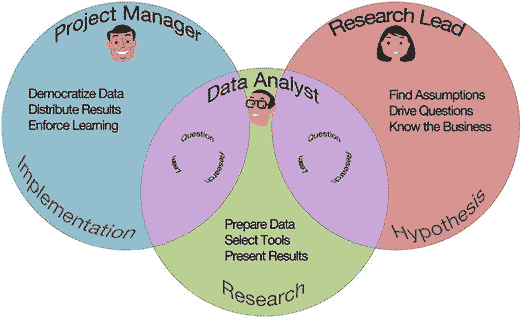

# 八、开始工作

现在你已经有了自己的团队，你需要了解如何开始工作。首先，您需要探索每个团队成员的职责范围，并指出这些职责范围的重叠之处。接下来你需要考虑的是如何呈现你的数据。数据可视化是整本书都涉及的主题。我将简要介绍这个主题，并涵盖您的数据科学团队将主要关注的两种不同类型的报告:内部报告和外部报告。

在您知道如何展示您的报告后，我将继续解释数据仓库以及它们如何影响您的团队收集数据的能力。然后，我会给你一些关于如何使你的数据民主化的建议。最后，我将讲述深入了解数据科学团队和获得管理层认同的重要性。

## 界定责任范围

与大多数组织的运营方式相比，数据科学思维是一个巨大的变化。即使自称为数据驱动的组织也不经常使用他们的数据来创造新的见解。相反，他们使用数据的方式就像一个醉汉使用灯柱一样。 [1](#Fn1) 他们认为这是支持而不是照明。

这对您的数据科学团队来说是一个真正的挑战。您的组织可能认为这是数据驱动的，但他们实际上只是使用数据来强化他们已经知道的东西。任何与这一知识相矛盾的东西都被视为坏数据。

您的数据科学团队需要确保使用数据进行发现，这可以防止团队陷入仅使用数据支持已知内容的陷阱。事实上，数据科学的一个主要好处是质疑已有的知识。就像那句古老的马克·吐温名言:“让我们陷入困境的不是我们不知道的事情。这是我们确切知道的，但事实并非如此。”

如果你的组织依赖于没有数据支持的知识，你可能会遇到麻烦。通常，这种共享的知识是正确的，但当它是错误的，它会产生持久的后果。如果您的数据科学团队忠实于其三个方面的职责，这将为您的组织带来实实在在的好处。这三个领域是研究、问题和实现，如以下部分所述。

到目前为止，您已经看到了数据科学团队中的三个常见角色:提出有趣问题的研究主管、与研究主管合作提出有趣报告和见解的数据分析师，以及将这些见解付诸实践并提供给组织其他成员的项目经理。

现在是时候承担这些角色，并把它们放到更大的责任范围内，这样你就可以看到团队是如何团结在一起的。想象你的团队有不同的重叠责任区域，如图 [8-1](#Fig1) 所示。

图 8-1。

The overlap between different roles

### 研究

让我们从数据分析师的维恩图开始。数据分析师的主要职责是研究，这是科学和数据科学的关键部分。数据分析师与研究负责人合作，提出有趣的问题，研究这些问题，并通过创造性的报告或图表来展示结果。

该数据分析师是团队的基础。他与项目经理和研究主管一起工作。他们只是以不同的方式工作。把他想象成和他们两个都有独立的双向关系。他以有趣的问题的形式从研究负责人那里获得输入，然后他将结果和见解输出给项目经理，以便她可以强制学习。

### 质问

现在我们来看看图 [8-1](#Fig1) 中的下一个圆。右边是研究线索的圆圈。他们的职责范围是提问。如果你用科学的方法来思考这个问题，这个人就是创造了一个有趣假设的人。

研究主管在自己和数据分析师之间创造了一个循环。她在问问题并得到反馈。这并不像给数据分析师发一封电子邮件说“你怎么看？”这是一个合作的过程。研究负责人提出问题，数据分析师根据可用数据对这些问题提供反馈。这两个圆重叠在一起。这是问题和研究之间的直接关系。

### 履行

图中最后一个圆圈 [8-1](#Fig1) 是给项目经理的。他的职责是执行。他需要确保团队获取数据并将其用于可行的事情。他确保团队将他们的见解分发给组织的其他成员。

采取探索性的过程并将其应用于组织知识并不是一个简单的挑战。在数据科学团队中，您通常不知道最可行的见解的途径。在团队找到一条有趣的路径之前，团队将通过 50 个死胡同。

尽管如此，重要的是要考虑这些见解最终实现时会是什么样子。

这些责任领域中的每一个都是团队需要完成的地图的一部分。这有助于强化您的数据科学团队是探索和发现的理念。团队需要遵循数据，即使它与已有的知识相矛盾。

## 提交报告

数据可视化是数据科学最有趣的领域之一。它是使用图形和图像显示数据的方式。简单的图形是传达复杂思想的最佳方式之一。平衡复杂的想法和简单的设计是一个真正的挑战。

大多数报道在这一方向上或另一方向上走得太远。有许多漂亮的图表并没有真正传达多少信息，也有一些信息丰富的图表很难看，很难理解。良好的可视化是数据分析师的核心职责。也就是说，分析师应该与数据科学团队密切合作。如果你必须向研究负责人解释这个图表，对其他人来说可能太复杂了。这个团队是一个很好的试验场，可以帮助你使你的图表更漂亮，可读性更好。

有许多关于数据可视化的好资源。最古老和最受尊敬的方法之一是量化信息的可视化显示，第二版由 Edward R. Tufte 出版。 [2](#Fn2) 在这本书中，图夫特教授介绍了数据-墨水比率的概念。他指出，你应该推动你的可视化，用最少的墨水传达最多的数据。他将“图表垃圾”这个术语用于无用的视觉效果，如三维阴影或渐变效果。

塔夫特教授帮助建立和设定了数据可视化领域的方向。他帮助建立了一种展示数据的现代方法。

对于另一种方法，请查看 Cole Nussbaumer Knaflic 的《用数据讲故事:商业专业人士的数据可视化指南》。在她的书中，她列出了六个关键的教训。她首先说，数据分析师应该了解他们的受众和背景；选择合适的显示器，消除杂乱，集中注意力；像设计师一样思考，讲述一个引人入胜的故事。这两本书将让你很好地理解创建良好的数据可视化意味着什么。

Note

在数据分析师的培训中，通常没有为他们创建良好的可视化做任何准备。大多数研究生课程仍然深深植根于数学和统计学。良好的数据可视化依赖于美学和设计。这是一项需要学习的技能，可能并不容易。

请记住，您的团队一起工作来探索数据，这意味着您设计的第一轮报告的大部分将是为彼此设计的。研究领导提出有趣的问题，数据分析师创建一个快速而肮脏的报告来探索可能的答案，然后团队可能会提出一系列新问题。这意味着您的大部分初始数据可视化将是快速交换——更像是可视化聊天，而不是完整的数据报告。

另一方面，还有最终的数据可视化，您需要与组织的其余部分进行交流。这些可视化效果将会更加完美、简单、易于理解。

把你的第一轮可视化想象成数据白板，就像大多数组织墙上的白板一样。它们主要用于帮助小型会议和讨论的快速可视化。你的第一份报告应该有那样的可读性。这可能是一个快速简单的聚类图。也许这只是一个简单的线性回归。

没有人会给行政报告中的白板上的涂鸦拍照。只是为了团队。要将白板上的数据呈现到执行报告中，您必须增加清晰度和修饰。

如果你是一名数据分析师，记得利用你从团队其他成员那里得到的反馈。数据可视化就像任何设计一样。你不需要成为专家才能有自己的观点。你的团队将是判断你的图表是否可读和可理解的最佳方式。也请记住，你最好的图表将是一个紧急设计的产品。从简单的报告开始，随着时间的推移进行改进，使它们更简单，可读性更强。每个新版本都应该阐明你所拥有的信息。您还可以通过添加信息来改进您的报告，而不会增加其复杂性。

如果经过几次改进，你最终会得到更漂亮的报告。团队的其他成员将是帮助你实现目标的最佳资源。

## 了解孤岛并释放您的数据

数据科学团队面临的最大挑战之一是访问组织的所有数据。这是项目经理的核心职责之一。她会努力进入你组织中每个角落布满灰尘的旧数据库服务器。

对于大型组织来说，每个部门拥有不同的数据库并且不共享信息的情况并不少见。每个部门都有自己的数据分析师、经理和数据库工程师。该部门的人员将了解他们的数据挑战，但不太了解组织的其他部门。这通常被称为数据仓。筒仓这个术语是从农业中借用的。农民通常将季节性谷物储存在一个高大的中空建筑中。如果你见过筒仓，你就会知道它是一座高大的独立建筑。每个筒仓储存自己的粮食，通常与其他筒仓没有联系。组织数据也是一样。每个部门都存储少量数据，不会与其他孤岛混在一起。

数据孤岛的存在是有充分理由的。每个部门可能都有自己的法规挑战或安全措施。一个数据库可能有密码，而另一个可能只有简单的产品列表。密码数据库很可能是加密的和安全的，而产品数据库是开放的和可用的。

孤岛的问题在于，它们使您的组织很难对您的数据有一个整体的了解。我曾经为一个组织工作，该组织试图将其所有数据转换到一个集中的集群中。他们觉得他们没有从数据中获得足够的洞察力。该组织刚刚经历了一次数据治理转型，希望治理如何控制数据。

当他们最终进入他们的数据时，他们意识到有多少数据被锁在无人知晓的小仓库中。多年来，每个部门都创建了自己的流程、模式和安全程序。该组织希望从这些数据中获得价值，但是这些数据分布在整个公司的不同服务器上。让每个人分享他们的数据有点像让他们分享他们的牙刷。项目经理参加了许多讨论非常激烈的会议。

不幸的是，打破这些孤岛是成为一个更加数据驱动的组织所必需的。您可能希望几个数据科学团队在一个集中的数据集群上工作。您还会希望数据科学团队之外的人创建基本的报告和图表。

请记住，数据是发现洞察力和创造新的组织知识的关键材料。要成为数据驱动的，你需要自由访问数据。

既然您已经了解了孤岛，那么如何使数据民主化，以便尽可能多的人可以访问它呢？您需要确保数据不再是在高管和数据分析师之间传递的受保护资源。相反，它需要成为一种全公司范围的资源，被每个人操纵和理解。

如果你是数据科学团队的项目经理，请记住以下几点:

*   不要低估访问数据仓库的难度。这需要很长时间，并且您希望在团队实际需要他们的数据之前就开始。
*   创建集中式数据集群需要进行组织变革。如果你没有高管的认同，你可能不会有太大的进步。您可能需要向每个部门推销集中式数据集群的理念。大多数部门不会同意你的观点。他们认为如果它没坏，为什么要花时间去修理它呢？您可能需要向他们解释，他们将能够创建更复杂的报表或使用更新的可视化工具，以此来吸引他们。
*   您需要提供对团队报告的访问权限。如果你能展示公司范围内的报告和见解的价值，你可能会更容易打破孤岛。过一段时间后，就更容易认为共享数据就像任何其他共享资源一样。整体将比所有部分的总和更好。

尽最大努力保护数据科学团队免受数据孤岛会议的影响。你希望他们专注于探索和发现。你专注于增加他们的使用和访问。

## 在数据科学团队中创造洞察周期

许多组织关注于监控每个团队的里程碑。经理们专注于他们的合规性，并且他们的大部分努力致力于规划。他们有季度预算，并密切监督。他们寻找成本或进度差异。如果他们看到了变化，他们会迅速追踪，然后报告给主管。这些类型的组织是为监控和遵从而构建的。如果你在这种类型的组织中，想想你的会议。很有可能，你正在做一些事情，比如计划或提出一个计划，与另一个团队协调，要求增加预算，或者因为进度落后而要求延期。

这种工作方式不太适合数据科学团队。记住你的团队的工作是探索性的。它的成员提出问题，创造理论，然后进行实验。

当然也有一些公司习惯于与科学家合作，比如制药或高科技公司。这些类型的公司已经进行了多年的实验。但对大多数公司来说，探索性工作是一个新概念。拥有一个创造新知识的数据科学团队似乎不太自然。在这些公司里，你必须特别小心团队的运作方式。将存在将业务与技术分开的机构压力，以及确保由合规经理管理团队的强大推动力。这通常是项目经理或总监。建立这些结构会减缓发现的速度。

我曾经为一个组织工作，该组织不允许研究领导与数据团队密切合作。他们认为，提出最佳见解是数据分析师的工作，而业务经理只会在月度报告中看到这些想法。

业务经理有自己的预算，独立于数据团队的预算。业务经理对寻找真知灼见不感兴趣。她只是确保她的团队不超出预算。拥有一个全职的研究带头人不在他们的预算之内。数据科学团队甚至在开始之前就停止了探索。

我看到另一家公司试图使用项目经理来监控数据科学团队的里程碑。他试图创造不同的方法来衡量团队的进展。他为开发问题创建任务，然后测量团队完成这些任务的情况。效果不好，因为大多数问题只会引出更多的问题。当团队的里程碑持续下滑时，项目经理很不高兴。他的动机是尽可能快地“完成”问题，这与你在数据科学团队中想要的正好相反。

当你在一个数据科学团队时，试着意识到这些制度压力。大多数组织很难接受一个不容易衡量或控制的数据科学团队。很难设定目标或创造投资回报。

努力工作以确保你的团队不会被拉入这些顺从的结构中。相反，确保团队创造一个反馈循环。每个人都应该一起质疑、研究和学习。

数据科学团队中的每个人都有自己的关注领域，但他们仍然在紧密的反馈循环中一起工作。例如，当研究负责人和数据分析师研究数据时，项目经理会参与其中，而数据分析师可能会给项目经理一些关于访问另一个团队的数据的好建议。当每个人都参与的时候，团队总是会做得更好。当你探索的时候，你对一个问题的观察越多，你就越有可能获得深刻的见解。

此外，请确保您的数据科学团队拥有高管级别的支持。没有它，你几乎肯定会被拉回普通的控制策略。这并不容易，但如果你有管理层的支持，并能在团队内部建立紧密的反馈循环，你会更容易有所发现。如果这些组织变革需要很长时间，不要沮丧。第一步是理解数据科学的目的，以及它如何适应这些长期服务的组织结构之外。

## 摘要

在本章中，您探索了每个团队成员的职责范围。然后，您会看到这些责任领域的重叠之处。您还了解了一些如何呈现数据(数据可视化)以及内部和外部报表之间的区别。接下来，您了解了数据仓库以及它们如何影响您的团队收集数据的能力。然后，您收到了一些关于如何使您的数据民主化的提示。最后，您了解了向数据科学团队提供透明度的重要性，以及这如何有助于管理层的认同。在第 [9](09.html) 章中，你会发现如何让你的团队像数据科学团队一样思考。

Footnotes [1](#Fn1_source)

这句话通常被认为是苏格兰小说家和民俗学家安德鲁·朗说的。

  [2](#Fn2_source)

塔夫特，爱德华 r，和 P. R .格雷夫斯-莫里斯。定量信息的可视化显示。第 2 卷，第 9 号。康涅狄格州柴郡:图形出版社，1983 年。

  [3](#Fn3_source)

科尔·努斯鲍默·纳弗里克。用数据讲故事:商业专家数据可视化指南。约翰·威利父子公司，2015 年。