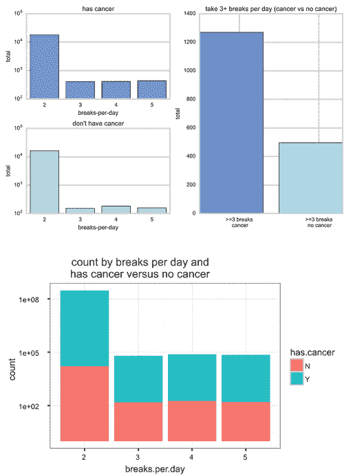

# 九、像数据科学团队一样思考

现在，您已经知道如何构建您的团队，并划分了责任区域，您如何确保您的数据科学团队像团队一样思考？在这一章中，我将通过研究一些让你的团队保持正轨的常用方法来帮助你。首先，我通过问有趣的问题来讲述如何避免不加推理地报道。接下来，我将探索如何为你的团队整体找到正确的心态。最后，你将学习如何理解数据，并获得一些如何摆脱团队冻结的技巧。

## 不讲道理避免举报

如果你不熟悉统计学，一个很好的起点是《赤裸裸的统计学:从数据中剥离恐惧》，作者是前芝加哥大学公共政策教授查尔斯·惠兰。这是一本有趣的读物，也是对统计分析的很好的介绍。在书中，他回顾了利用报告得出草率结论的危险。

如果你知道要找什么，你会发现到处都是草率的结论。你可以在互联网新闻网站上看到这个。Wheelan 教授设想了一个新闻网站，标题引人注目:“工作时短暂休息的人更有可能死于癌症。”听起来很可怕。根据这项对 36，000 名工人的研究，那些报告每天休息几次 10 分钟的人在未来五年内患癌症的可能性增加了 41%。那些没有休息的人要健康得多，如图 [9-1](#Fig1) 所示。

图 9-1。

People who take short breaks are far more likely to develop cancer

如果我们只看那些每天休息三次或更多的人，他们患癌症的可能性确实增加了 43%。然而，95.1%的人每天只休息两次。查看如何在 [`http://ds.tips/Sp4ye`](http://ds.tips/Sp4ye) 创建此图表

一个粗心的数据科学团队可能会将此报告给组织的其他部门，公司可能会采取古怪的措施，例如锁上门以确保每个人的安全。这似乎是一个极端的例子，但它比你想象的要普遍得多。

一个负责任的数据科学团队绝不会从这类报告中得出结论。相反，研究负责人会用它来引出有趣的问题。为什么离开办公桌会如此致命？这些休息了 10 分钟的人是谁？为什么不休息的人更安全？

研究负责人可能需要通过与熟悉这些员工的人交谈来研究这些问题。也许有人会认可这种行为。

如果你在办公室工作过，你可能会认识到，任何一个每天起床 10 分钟的人都可能是去外面抽根烟。记住相关性并不意味着因果关系。在这种情况下，问题是这些工人经常吸烟。与他们每 10 分钟起床的联系只是偶然的。吸烟才是真正的危险。

在您的数据科学团队中工作时，请记住，防止草率报告的最佳方法是与研究主管合作，提出有趣的问题。记住结论是容易的。难的是探索和推理。这些将是你最大的洞察力的来源。

你的研究主管和数据分析师之间应该有一种健康的紧张关系。数据分析师将寻找数据来得出结论。研究负责人总是会有更多的问题。数据分析师将提交报告，研究主管将测试这些报告的弱点。最终，这将有助于创建更强有力的分析。

草率的推理是一个比看起来更大的问题。前面的例子只是一个虚假的互联网标题，但有时现实可能是危险的。在 20 世纪 90 年代，医生观察到服用雌激素补充剂的女性患心脏病的可能性降低了三分之一。一项对 122，000 名女性的大规模研究表明，雌激素补充剂和心脏病发作之间存在负相关关系。许多医生得出结论，雌激素具有保护作用，可能有益于女性健康。 [2](#Fn2)

到 2001 年，1500 万妇女正在服用雌激素补充剂，通常称为激素替代疗法。然后奇怪的事情发生了。医生开始注意到，接受激素替代疗法的女性更有可能患中风、心脏病和乳腺癌。

几年后，医生们开始仔细检查这些发现。他们中的许多人得出结论，在最初的研究中，看起来更健康的女性有外部因素——她们更富有，更有健康意识，更有可能获得出色的医疗保健。雌激素不是他们身体健康的可能原因。这个数据至今仍有争议。然而，有一点是可以接受的，那就是这种草率的分析导致了成千上万妇女的死亡。

对草率推理的最好防御是研究领导和数据分析师之间创造性的紧张关系。如果你没有问正确的问题，你更有可能得出错误的结论。

## 拥有正确的心态

你已经看到草率报道的危险。现在让我们稍微思考一下如何进入正确的心态。许多组织认为数据科学只是一种分析技能，一个房间里有一群分析师，他们只是简单地报告他们的数字。这些数字被视为真理，因为数字不会说谎，但数字会说谎。在第 4 章中，你看到了统计数据讲述错误故事的例子，两个政客基于相同的数字讲述了不同的故事。研究可能会得出错误的结论。人们可能会曲解数据。他们的故事可能不完整。

你已经看到，提出问题是对草率结论的最好防御。那么如何提出更好的问题呢？要达到这个目标，你需要有正确的心态。好消息是，在过去的几年里，在这方面已经做了很多工作。许多不同的领域走到了一起，以更好地了解人们是如何思考的。计算机工程师将这些应用于机器学习和人工智能。

研究发现，分析性思维不一定能很好地服务于数据科学。报告和数据只是第一步。下一步是概念思维——观察数据并将其与自己的直觉相结合的能力。概念思维将帮助团队确定他们的问题所关注的领域。

有一本关于这个话题的有趣的书，书名是《全新的思维:为什么右脑思考者将统治未来》，作者是丹尼尔·平克。在书中，他认为我们已经接近了信息时代的尽头，仅仅关注数字和报告是没有价值的。真正的价值来自我们创造的知识。他称之为概念时代。

数据科学正处于这个概念时代的边缘。在某种程度上，分析工具将足够简单，以便更多的人可以访问数据。很快，用户将可以像 WordPress 或微软的 LinkedIn 一样使用数据科学工具。这将使更多的人获得有趣的信息。

目前，数据科学团队负责数据及其底层概念，这在许多方面要困难得多。团队必须使用他们的分析技能作为起点，然后使用一套全新的概念技能。在丹尼尔·平克的书中，他讲述了其中的一些技巧。他称之为概念时代的“感觉”。我将这些感觉融入了三种团队价值观。这些值应该有助于您的团队在概念层面上考虑数据。

### 讲故事胜于报道

第一个价值是讲故事胜于报道。您的数据科学团队应该努力提供关于数据的有趣故事。你应该讲一个令人信服的故事。通常情况下，你的数据会被解读，这意味着可能有不止一个故事。如果你想到一个有趣的故事，就更容易提出问题。

把数据想象成戏剧中的角色。询问他们为什么做一件事而不是另一件事，然后询问他们的行为。

### 细节之上的交响乐

第二个价值是细节上的和谐。参与信息时代的最佳方式之一就是专业化。你可以在公司招聘中看到这一点——例如，数据库工程师通常只专注于少数几个平台。您将希望在数据科学团队中远离这种专业化。你希望团队通过将几个不同的故事放在一起，创造一个更大的画面，来创作一首交响乐。

你已经在几个例子中看到了这一点:看到吸烟者离开办公桌的大画面，理解为什么顾客在年初购买跑鞋。这些故事要求你引入许多不同类型的数据，以获得更好的理解。

### 同理心胜过确定性

最终的价值是同理心高于确定性。了解人们的动机是对你的数据提出疑问的最好方法之一。您的数据科学团队想要了解您的客户在想什么，什么对他们来说是重要的。请记住，数据科学可以分析数百万人的行为。如果你的团队能理解他们的动机是什么，他们就能提出更有趣的问题。

请务必记住，您的数据科学团队必须使用一套全新的技能才能取得成功。要问好问题，你必须从概念上思考。尝试使用这些团队价值观来提醒自己，数据科学不仅仅是简单的报告。你的团队需要运用他们的概念技能来提出好的问题并创造组织知识。

## 深入“意义建构”

如您所见，团队拥有正确的心态非常重要。你的团队应该从概念上思考数据。那不是一件容易的任务。请记住，大多数数据分析师来自数学或统计学，这些领域往往依赖于结构化指标。

概念思维往往需要一种讲故事的风格，更有创造性和艺术性。许多数据分析师需要依靠他们的能力，而不是他们的培训。一旦每个人都有了正确的心态，他们就可以开始专注于有意义的事情。理解是数据科学的一个关键部分。

我们都以这样或那样的方式理解事物。当您度假回来时，您可能会被收件箱中的电子邮件淹没。您可能决定创建标记为“重要”、“旧”或“通知”的子文件夹，或者您可能决定按发件人对所有电子邮件进行排序。

每个人处理数据的方式可能不同。作为一个团队，要对数据有一个共同的认识就更难了。每个人都有自己的理解技巧。这些视图可能不会重叠。对一个人来说有意义的事情对另一个人来说可能是浪费时间。

对数据科学团队来说，理解可能是一个巨大的挑战。这些团队将试图理解非常大的数据集，这些信息可能是压倒性的。这可能会导致团队冻结，即当一个团队有如此多的数据，他们不知道从哪里开始。如果你在团队之外，当团队冻结时，你可能很难看到。

我曾经为一家公司工作，该公司试图理解一个巨大的新数据集。该公司收集了适量的数据，然后从外部公司购买了大量数据集。他们希望将现有数据与这些更大的数据集联系起来，以便更好地了解他们的客户。在另一家公司的帮助下，他们能够快速地将这些新数据集放入他们的集群。问题是数据科学团队不知道从哪里开始。他们努力理解。他们愣住了，只是生成显示他们有多少数据的报告。

它们被冷冻了几个月。每当他们有一个商业会议，团队只是显示更好的数据报告。他们下载了昂贵的可视化工具，并制作了非常棒的图表。但是最后，他们没有问任何有趣的问题。

如果你在一个数据科学团队，试着寻找你可能正在努力理解的迹象。如果每个人都专注于工具，这可能是您的团队被数据淹没的迹象。当心取代数据科学的空洞演示。

摆脱数据冻结的一个方法是从数据中获得更多乐趣。你可以提出一些看起来没有价值的荒谬问题。试着提出一些问题，看看某人是喜欢狗还是喜欢猫。也许试着通过查看某人的购物记录来猜测他或她的身高。记住问题往往会引出更多的问题。仅仅是拿到数据并使用它就足够开始了。你的团队的许多发现将来自意外的发现，这意味着你越是摆弄这些数据，你就越有可能发现一些有趣的东西。

不要害怕瞎折腾(但不要对团队以外的人这么说)。在团队内部，围绕问题反复讨论，直到有东西卡住为止。实验和玩游戏之间往往只有一线之隔。你对数据了解得越多，对一些有趣的问题就越有感觉。

试着理解团队中的每个成员可能会以不同的方式处理数据。这是理解的关键部分。您应该提出这一挑战，并寻找一种共享数据的方式。认识到你的团队何时冻结也很重要。许多数据科学团队在创建报告时会受困于工具。最后，记得玩得开心。通过摆弄数据，你可能会得到一些最好的观点。

## 摘要

在这一章中，你学习了一些让你的团队保持正轨的常用方法。这些包括如何通过确保他们问有趣的问题来阻止他们不加推理地报道。您还发现了如何拥有正确的数据科学思维。团队需要通过概念思考和学习讲故事来理解数据。在第 [10](10.html) 章中，您将了解如何在组建数据科学团队时避免陷阱。

Footnotes [1](#Fn1_source)

查尔斯·惠兰。赤裸裸的统计:从数据中剥离恐惧。WW 诺顿公司，2013 年。

  [2](#Fn2_source)

Shlipak，Michael G .，Joel A. Simon，Eric Vittinghoff，林峰，Elizabeth Barrett-Connor，Robert H. Knopp，Robert I. Levy 和 Stephen B. Hulley。"雌激素和孕激素、脂蛋白(a)与绝经后冠心病复发的风险."《美国医学会杂志》第 283 期，第 14 号(2000 年):1845-1852 年。

  [3](#Fn3_source)

《全新的思维:为什么右脑思考者将统治未来》。企鹅，2006。