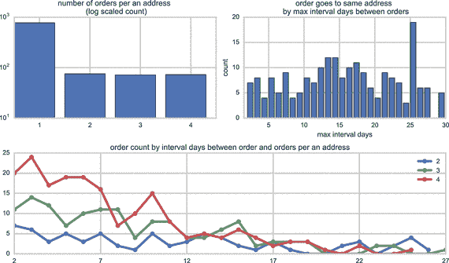
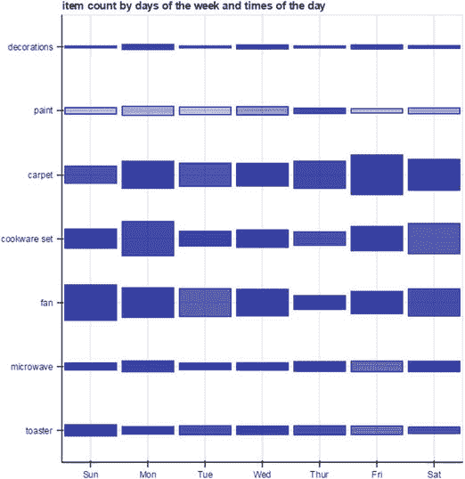

# 十、在组建数据科学团队时避免陷阱

在本章中，我们将讨论影响数据科学团队的两个主要陷阱。首先，如果一个团队太快达成共识，它会扼杀发现，这是一个团队有盲点和倾向于集体思维的迹象。

最后，你如何知道你的团队在错误的问题上花了太多时间，或者问了错误的问题？这被称为徘徊，我们也为你提供一些如何避免这种情况的建议。

## 避开共识

在大多数组织中，人们自然会试图达成共识。不同的组织有不同的叫法。有的鼓励大家“结伴而行”。其他人用“社会化”这样的词。数据科学非常不同。共识可能是个大问题。你希望你的团队探索新的想法。如果每个人都太快达成共识，这可能意味着每个人都有一个共同的误解。

请记住，数据科学是关于探索的。你在寻找知识和洞察力。没有必要让每个人都达成一致。事实上，你希望每个人都能够舒服地讨论如何解释数据。数据科学团队应该更像是一次尴尬的家庭聚餐，而不是安静的乘车旅行。你希望团队成员互相交谈、探索，甚至互相烦扰。这种类型的交流更有可能发现新的想法。

你可以做一些事情来阻止你的团队迅速达成共识:

*   要意识到共识的危险。认识到在一个复杂的话题上迅速达成一致通常是集体思维的标志。
*   确保你的团队足够小，以至于每个人都乐意表达不同意见。你的团队应该有你的研究领导，一些数据分析师和项目经理。努力保持你的团队少于六人。较大的群体往往会排挤较安静的声音，而这些声音往往拥有你的一些最佳见解。
*   确保你的研究负责人从团队之外引进人员。

让我们详细阐述最后一点，因为这是远离快速达成共识的关键。假设你正在看一个关于你的跑鞋网站的有趣问题。你想看看处于浪漫关系中的人是否会说服他们的伴侣跑步。该小组正试图通过网站上的数据找出解决这个问题的方法。研究负责人可能想邀请销售人员分享轶事，或者邀请他们认识的几个和他们的女朋友、男朋友、丈夫或妻子一起跑步的人来谈论他们是如何开始和他们的伴侣一起跑步的。这些人可能会增加一些团队没有的洞察力。只要记得保持团队的小规模。所以也许每次会议只增加一两个人。

你的团队可能尝试的另一件事是通过假设他们是错的来结束每一次讨论。这可能就像问“如果我们错了呢？”你的团队应该能回答这个问题。也许他们会意识到他们在这件事上是错的，或者他们在许多其他事情上是错的。如果这是真的，那就去经历所有其他的事情。注意团队对这个问题没有答案的时候。这是团队可能成为集体思维受害者的警告信号之一。

假设团队决定探讨浪漫的跑步伙伴问题。他们决定查看这些数据的最佳方式是查看是否有共享相同地址的客户，然后比较他们的订单，看一个客户是否比另一个客户先开始订购，如图 [10-1](#Fig1) 所示。但是如果团队错了呢？数据会是什么样的？也许室友很有可能一起跑。他们可能是学生或者想合租。这些可能是无力的论点，但仍应予以考虑。最有价值的是关于错误意味着什么的讨论。

图 10-1。

Orders from customers who share an address

大多数地址只有一个订单，一个月内每个地址最多有四个订单。除去只有一个订单的客户，平均而言，一个地址的订单最大间隔天数为 16.5 天。如果我们比较订单之间的间隔天数，最有可能的情况是，人们会在 15 天内再下一个订单，在一个月的时间内下的订单越多，他们在前 7 天内下的订单就越多。查看如何在 [`http://ds.tips/s5Ere`](http://ds.tips/s5Ere) 创建此图表

如果团队达成共识太快，另一个尝试是找一个可能不同意的人，并且是魔鬼的拥护者。例如，对于跑鞋网站，你可能想引入一个永远不会和浪漫伴侣一起跑步的人。问她为什么会有这种感觉。也许人们利用这段时间独处更常见。这可能是因为跑步者喜欢跑步，因为它是一项孤独的运动。这些见解确实能为团队的讨论增色不少。

如果你在一家大公司工作，你可能会比你意识到的更倾向于快速达成共识。大型组织中的典型项目需要大量的协调工作。对于这些项目，你需要一个共识来完成事情。数据科学团队有不同的优先级。当你寻找新的知识和见解时，太快达成共识可能是一个真正的危险。如果您使用本节中讨论的技术，您更有可能让您的团队不断探索并接受新的想法。

## 让团队不要走神

正如我们所看到的，团队有过快达成共识的危险。另一方面，您如何知道您的团队在错误的问题上花费了太多时间？什么时候应该放弃一个问题，开始另一个问题？这是相反的挑战。不是大家都同意，而是继续问错误的事情。团队最终徘徊而不是探索。

从许多方面来说，这是一个比共识或集体思维更困难的挑战。你想让你的团队感受自由漫步。同时，企业需要获得有价值的见解。你不想因为关注交付而扼杀创新。然而，该团队必须兑现承诺。

我曾经为一家大型家装零售商做过一个项目。他们试图确定顾客是普通人还是专业改造者。他们试图根据客户购买的东西创建一个预测数据模型。

研究负责人问了一些非常有趣的问题。专业人士更有可能购买哪些物品？专业人士是否更有可能购物？也许他们一大早就去购物，然后还要去建筑工地报道。专业人士更有可能进行大额采购吗？

所有这些问题都非常有趣。数据科学团队引入了一些外部人员，以便获得他们的观点。他们在避免共识方面做得很好。有许多不同的问题。也有一些不同的方法来获取数据。

该团队面临的一个挑战是，零售商错误地认为如果他们有更多的数据分析师，他们会更有效率，并使团队变得更大。有一名研究负责人、一名项目经理和四名数据分析师。

研究负责人会提出有趣的问题，然后数据分析师团队会生成几份不同的报告。问题是这些报告中的每一个都有非常狭窄的定义。数据分析师有时会出现这种情况。大多数分析师来自统计学、数学或软件开发的结构化世界。他们受过训练，所以当他们看到复杂性时，他们倾向于将其分解成狭窄的度量标准。因此，他们没有被数据淹没，而是对小细节不感兴趣。

这正是这支球队的情况。如图 [10-2](#Fig2) 所示，他们每隔几周就要制作几十份报告，报告的结论都很小，也很无趣。他们发现，购买油漆的人更有可能在早上购买，购买量大的人更有可能购买电器，购买地毯的顾客更有可能在周五购买。

图 10-2。

Item counts by days of the week and times of the day Note

方块越大，一周中某一天花在该项目上的钱就越多。较深的颜色代表当天晚些时候的销售额；浅色代表当天早些时候的销售。与地毯、炊具和风扇相比，油漆和装饰品的总价值很小。油漆大多是早上买的。地毯在周五的销售额略高，炊具在周一的销售额略高。参见如何在 [`http://ds.tips/y2wRe`](http://ds.tips/y2wRe) 创建此图表。

这些小数据点中的每一个都很好，但是数据分析师没有试图创造一个故事。专业客户的动机和挑战是什么？

这就是透过玻璃门的钥匙孔看的问题。当一个团队有太多的数据分析师时，有时会发生这种情况。他们专注于几十个小数据点，而不是试图与更大的真相搏斗。如果这个问题得不到解决，团队可能会继续在数据中徘徊，失去询问大问题的兴趣。

研究负责人的一项重要职责是通过推动团队提出有趣的问题并提供有价值的见解来确保这种情况不会发生。研究主管代表数据科学团队的业务利益。

你希望团队可以自由探索，但同时，你又希望他们不要徘徊。如果团队没有提供洞察力，他们对业务就没有价值。这也是你想让团队保持小规模和平等代表性的原因之一——一两个数据分析师，一个研究领导，和一个项目经理。如果你的团队中有太多的数据分析师，你就有在没有洞察力的情况下收集数据的危险。

小团队可以提出大问题。此外，记住你拥有来自团队的知识和洞察力。如果你认为团队的想法不够宏大，你必须挑战他们去追求更大的故事。

## 摘要

在这一章中，你学习了一些如何避免数据科学团队中两个常见陷阱的技巧。一个是达成共识太快，另一个是徘徊。如果一个团队太快达成共识，它会扼杀发现，是团队有盲点的标志。如果你的团队在徘徊，他们在一个问题上花了太多时间。他们也可能会问一些错误的问题。在第四部分中，您将了解您的数据科学团队应该如何专注于交付价值，从第 [11](11.html) 章开始，您将看到数据科学团队的行为方式之间的差异，以及它与大多数组织的运营方式有何不同。