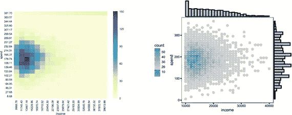
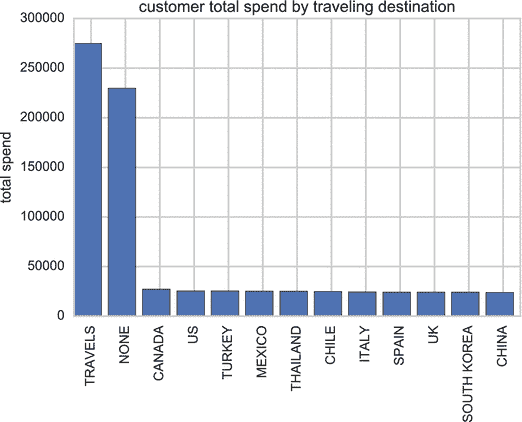

# 十一、一种新的工作方式

数据科学中的“科学”是指使用科学的方法。这种科学方法是一个发现的循环。你的团队会问一些有趣的问题，然后你会研究这些问题。接下来，你将利用研究提出新的见解。你的团队需要对这项工作采取经验主义的方法。他们需要的不是计划，而是适应。他们不再依赖答案，而是寻找有趣的问题。

这与大多数组织的运作方式有很大不同。大多数组织依赖于计划、目标和具体的可交付成果。通常在这些情况下:

1.  投资组合被分解成更小的、可操作的项目。
2.  每个项目可能有几个团队。
3.  中央项目管理办公室(PMO)跟踪项目的成功。
4.  项目管理办公室确保团队能够按时完成可交付成果。

另一方面，您的数据科学团队需要适应性、探索性和创造性来帮助他们质疑、探索和做出反应..这是一个相当大的脱节。大多数组织仍然渴望计划、目标和确定性。

为了让你的数据科学团队取得成功，你必须改变组织对你的工作的看法。你必须摆脱计划和交付的观念，代之以探索和发现的观念。在大多数组织中，这种改变并不容易。

你要做的第一件事就是传达数据科学的与众不同之处。首先将数据科学与一个典型项目进行比较。展示传统的规划和交付理念如何不适用于数据科学团队。重新定义成功的标准，解释你不能在项目结束时专注于一个大爆炸的可交付成果。相反，你必须通过创造新的见解来展示成功，然后展示创造组织知识的价值。

## 回顾典型项目

根据项目管理协会(PMI)的数据，世界上有超过 1600 万的项目经理。相比之下，研究公司国际数据公司(IDC)估计软件开发人员只有 1800 万多一点。这意味着几乎每个软件开发人员都有一个项目经理。对于许多开发人员来说，这并不奇怪。

在软件开发领域，项目管理和软件开发似乎是齐头并进的。大多数软件开发人员都讲流利的项目管理。他们可能会问一些关于软件需求的问题，或者某个新特性是否超出了项目的范围。他们甚至可以使用甘特图或其他项目管理计划。这些开发者已经将项目管理内在化了。他们将需求、范围和进度作为软件开发的一部分来考虑。尽管开发可以以许多不同的方式发生，但是对于这些开发人员来说，遵循项目管理实践是一种自然的趋势。

这对您的数据科学团队来说可能是一个相当大的挑战。如果你的团队成员从事过传统的软件项目，他们可能会尝试应用那些项目管理原则。数据科学团队不做项目。请记住，这些团队是探索性的。这就是数据科学中的科学。

项目管理是一个明确的过程。它要求你在开始之前对交付品有一个了解。典型的项目要求预先建立规范。他们专注于在范围、时间表和预算内交付。如果没有对这些约束的认识，你就不能有效地管理这些项目。

典型的项目也交付产品或服务。在你的项目的结尾应该有一个名词。也许你正在完成一份报告，或者你的团队交付了一个软件产品。在最后，你的项目必须交付一些东西，这样你就知道它是完整的。

我们来看一个典型的项目。假设您需要为您的跑鞋网站购买一台新的服务器。你有一个项目经理在做这个项目。项目经理做的第一件事是创建项目章程，这是一个简短的一页文档，说明项目将完成什么。

如果章程获得批准，项目经理将创建一个计划。该计划记录了项目的范围、成本和时间表。在这种情况下，项目的范围是购买新的服务器。项目经理估计了成本，并指定了服务器到达的日期。当服务器到达时，项目结束。

范围、成本和进度都是平衡的约束。如果计划改变，成本很可能会上升，时间表很可能会延长。如果项目经理决定通宵运行服务器，成本会上升，进度会缩短。在这个铁三角中，范围、成本和进度都是平衡的。

那么这和数据科学团队有什么关系呢？简单的回答是什么都没有。好的项目管理是一个完全不同的学科。它有不同的目标和过程。这并不意味着项目管理将从数据科学中消失；很有可能有人会推动您的数据科学团队使用项目管理原则。

有一个老笑话说，如果你有一把闪亮的新锤子，所有东西看起来都像钉子。大多数组织和项目管理也是如此。这是他们习惯使用的工具。没有锤子和钉子，他们不会放心花钱。

我曾经为一个深度投资于项目管理的组织工作过。项目管理办公室是公司最有权力的部门之一。数据科学团队在几乎所有的会议中都在努力解决这个问题。利益相关者会询问项目的范围，而数据科学团队从来没有一个好的答案，因为他们试图创造新的知识和发现洞察力。涉众还会询问团队计划何时交付这些见解。同样，这个团队也没有真正的答案。他们不知道会发现什么。他们仍在查阅数据。他们无法确定找到最有价值见解的日期。这从来没有让涉众非常满意。

如果你在一个数据科学团队工作，你几乎肯定会遇到这样的问题。如果只是几个项目经理问这些问题，大概不会有太大的挑战。如果赞助你项目的人问这些问题，你可能真的有问题了。

在这种情况下，你能做的最好的事情就是交流项目管理和数据科学之间的区别。至少，要确保你的数据科学团队中的每个人都明白其中的区别。尝试远离项目管理语言，如范围、成本和进度。随着时间的推移，你的观众可能会接受不同的方法。

## 从事数据科学“项目”

项目管理在大多数组织中都非常成功。这是一把帮助降低成本和管理时间表的闪亮的锤子。组织使用项目管理来完成他们的许多工作已经足够成功了。这并不意味着项目管理适合所有这些工作。

数据科学明显不同于项目管理。你的团队可能会探索新的机会。他们可能试图让您的数据更容易被组织中的其他人访问。也许他们正在寻找更好地了解您的客户的方法，或者试图检测安全漏洞或欺诈。该团队甚至可能探索来自传感器或机器的海量数据集。这些努力不适合典型的项目管理框架。首先，你不会有一个范围。数据科学项目是探索性的。这就是数据科学中的科学。

在开始探索之前，你无法对你将要发现的东西做出详细的描述。探索的全部目的是你不知道你会发现什么。你必须能够对你的数据做出反应。如果你想探索和获得新的知识，你需要期待意想不到的事情。总的来说，数据科学寻找新的机会或试图解决当前的假设。它侧重于知识探索，并试图提供见解。

想一想你在生活中所做的更具探索性和经验性的事情。你曾经走过一条狭长的餐馆，看着菜单吗？这是一个经验过程。你正在探索每一家餐馆，并对菜单做出反应。这与你在一家著名的餐馆预订大不相同。然后你会计划去哪里，什么时候去，可能还会计划吃什么。

现在，想象一下，当你在探索的时候，有人要求你承诺你将吃什么，你将花费什么，以及你将在什么时候完成。很有可能，你无法回答。如果那个人坚持要你回答，你可能会跳到第一家餐馆，看看菜单，然后做个估计。在非常真实的意义上，你必须停止探索。你不是在学习，而是在计划。

这正是项目管理实践应用于数据科学时所发生的事情。表 [11-1](#Tab1) 比较了典型的软件项目和典型的数据科学项目。

表 11-1。

Software project and data science project comparison

<colgroup><col> <col></colgroup> 
| 典型软件项目 | 典型的数据科学项目 |
| --- | --- |
| 开发新的客户自助门户 | 更好地了解客户的需求和行为 |
| 根据客户反馈创建新软件 | 创建一个模型来预测客户流失 |
| 安装新的服务器群以提高可扩展性 | 寻找新的市场和机会 |
| 将遗留代码转换成更新的软件 | 验证关于客户使用的假设 |

我曾经为一个组织工作，该组织坚持将良好的项目管理实践应用到他们的所有工作中。数据科学团队也不例外。团队试图通过创建知识里程碑和洞察力交付来适应这种实践。最后完全行不通。知识里程碑只是最好的猜测，并阻止团队关注任何有趣的东西。由于时间限制，他们只寻找容易证明或近乎显而易见的东西。每当我试图问更多有趣的问题时，他们都担心会错过一个里程碑。

如前所述，项目管理实践对大多数组织都是有益的。不幸的是，对于您的数据科学团队来说，这些实践具有寒蝉效应。项目管理不鼓励不确定性。它迫使数据科学团队只尝试和验证已知的东西。如果他们发现任何意想不到的东西，它被视为一个错误，而不是一个功能。

当您创建里程碑和可交付成果时，您是在告诉团队，他们有一个固定的时间来验证已知的内容。他们通过没有发现新事物来衡量他们的成功。这与您希望您的数据科学团队做的事情背道而驰。你不希望将数据科学视为一个交付产品的项目。

## 比较项目挑战

传统的项目依赖于设定的需求和仔细的计划。请记住，典型的项目有范围、成本和进度。这与数据科学团队使用的科学方法并不兼容。没有具体的可交付成果需要管理，并且您无法真正平衡这些约束。

相反，数据科学团队是经验性和探索性的。这些项目包括边看边学。如果你坚持一个项目计划，你就是在强迫团队寻找他们已经知道的东西。很难想象大多数团队会在一个定义明确的盒子里发现大量新数据。

如果你想想大多数组织中的会议，它们通常围绕着计划和达成目标。大多数组织的语言仍然依赖于诸如使命、目标和结果等短语。很难退一步想象一个纯探索的团队。对于大多数组织来说，这将是一个艰难的转变。

所以我们来看一个项目，把它比作一个数据科学团队。然后让我们看看如果你应用计划和目标会发生什么。

让我们从一个典型的软件项目开始。您的组织想要开发一个新的客户自助门户。项目章程旨在创建门户，作为降低成本的一种方式。该项目将有一个固定的成本，但该组织将节省客户服务的资金。这个项目有很高的投资回报率。该计划列出了需求文档中的所有功能。有一个开发进度的估计，所有的成本都有记录。所有这些都在项目计划中进行了概述。项目经理将在整个项目中更新计划，并帮助平衡任何变化。

现在让我们想象一下数据科学团队。是一个四人小团队。有一名研究主管、两名数据分析师和一名项目经理。他们的任务是更好地了解客户的需求和行为。组织的领导者认为，如果他们能够更好地了解他们的客户，他们可以将这种了解转化为未来的收入。

研究负责人首先会问几个问题:

*   我们对客户了解多少？
*   我们对顾客有什么假设？
*   为什么我们的客户会选择我们而不是我们的竞争对手？
*   什么会让我们的顾客更愿意和我们一起购物？

研究负责人将与数据分析师合作，将这些信息分解成报告。也许他们可以创建关于客户收入的报告，如图 [11-1](#Fig1) 所示。他们还可以分析社交媒体平台，并从成千上万的客户那里创建一个反馈词云，如图 [11-2](#Fig2) 所示。例如，单词云中一些最大的单词是“旅行”、“食谱”和“餐馆”团队可以回去问更多的问题。为什么我们的客户喜欢旅行？他们要去哪里？

图 11-1。

Income and spend Note

x 轴是收入，y 轴是支出。收入高的人不一定消费多。那些收入在 20，000-30，000 美元左右的人似乎花钱最多。参见如何在 [`http://ds.tips/n6cEc`](http://ds.tips/n6cEc) 创建此图表。

图 11-2。

Word cloud Note

参见如何在 [`http://ds.tips/k8wRa`](http://ds.tips/k8wRa) 创建此图表。

你可以看到更多地了解你的顾客会带来更高的销售额。也许你可以和营销团队合作，在旅游杂志上做广告。也许你可以开始销售与旅行密切相关的产品。

另一方面，你也可能发现整个探索是一个死胡同。也许你的数据分析师创建了一份客户旅行地点的报告，如图 [11-3](#Fig3) 所示。事实证明，你的许多客户确实在国际间旅行，但不足以证明销售新产品是合理的。所以团队决定放弃它，探索其他领域。也许接下来你会尝试探索顾客最喜欢的餐厅。

图 11-3。

Where customers travel Note

旅行的顾客总花费比不旅行的顾客多。然而，如果你比较旅行目的地，每个目的地的总花费少于那些不旅行的人。参见如何在 [`http://ds.tips/y8seS`](http://ds.tips/y8seS) 创建此图表。

这如何适应传统的项目管理框架？你的项目范围是什么？而是了解你的顾客。它是关于新知识的。你怎么知道你已经了解了什么？这个新知识什么时候交付？项目范围内有什么？

所有这些问题可能会让任何项目经理茫然不知所措。学习是动词而不是名词。如果你不知道你在寻找什么，就没有办法衡量你将学到什么。如果你知道你在寻找什么，你并没有真正学到新的东西。日程安排呢？即使他们已经走到了死胡同，他们还会继续这个项目吗？团队什么时候停止工作？最后，费用呢？如果你不知道工作团队工作多长时间，你如何预算他们的时间？

您可能已经注意到，这个数据科学项目不适合项目管理框架。您将会看到，对于您的数据科学探索来说，即使不是全部，也是如此。

## 定义成功标准

在 1921 年的一次采访中，托马斯·爱迪生说他的助手对他们失败的实验感到沮丧。这位著名的发明家很高兴，并向他保证他们没有失败。他们总是在学习新的东西。一旦他们学到了什么，他们就会尝试不同的方法。今天，我们知道托马斯·爱迪生是正确的，因为他取得了许多成功。其中一些至今仍在使用。也有一些实验被历史遗忘了——在他们的混凝土钢琴上演奏的不多。我们可以将他的遗产视为一系列成功的实验。我们看不到占用他大部分时间的失败实验。失败比成功多得多。

如果爱迪生使用现代项目管理，他会遇到一些挑战。他如何定义自己的成功标准？你不能只寻找有用的东西。如果你做了，你需要很大的耐心。他的实验会持续几个月或几年，直到产生任何看似成功的东西。

我们应该像爱迪生看待他的实验一样看待数据科学的成功。只要问一个简单的问题:我们学到了什么新东西吗？你的团队会对数据进行很多实验，大部分实验都会失败或者是死胡同。试着不要认为这些是失败。不是每一个实验都会带来真知灼见。这也可能是真的，你的大部分见解没有太大价值。也许你会发现你的顾客大多是养宠物的。那可能很有趣，但可能没有多大价值。

这种方法在许多组织中可能具有挑战性。在一些组织中，这甚至可能是令人讨厌的。当人们问:“那个团队在做什么？”时，你就知道你遇到了这个问题或者更糟，“那个团队是做什么的？”这可能是一个组织挑战。经理们可能会雇佣一个数据科学团队作为实验，看看他们能想出什么。这可能会让您的数据科学团队的工作变得更加困难。

你可以做一些事情来展示一些成功的标准:

*   确保你的团队尽可能透明。抑制住远离组织其他成员的冲动。通常，如果人们不理解你在做什么，他们很快就会问你为什么在那里。
*   确保你在尝试解决大问题。你想让你的团队有足够的雄心去解决有趣的问题。如果问题太胆小，可能很难展示有趣的结果。
*   尝试通过定期安排的讲故事会议展示团队正在学习的内容。在这些会议中，涵盖团队正在研究的问题，并提供一些最近的见解。

我曾经为一所大学工作，该大学雇佣了一组“非结构化数据专家”。教务长希望有一个寻找新见解的数据科学团队。该团队在雇用他们的管理人员附近的办公室工作。大学里没有其他人知道他们在做什么。大多数人甚至没有意识到他们在那里。问题是这个数据科学团队很难提出任何有趣的问题。大学里的其他人都不会花时间去见研究负责人。

如果这个团队被安排在离其他教员而不是行政人员很近的地方，事情会变得更加顺利。这将使他们能够从一开始就与每个人合作，提出有趣的问题。他们可以通过讲故事的会议来深入了解这些问题。

如果你是一个数据科学团队的研究负责人，努力让问题与组织的其他部分紧密相连。对你的发现保持透明。经常展示有趣的见解。尝试利用组织的其他成员，让他们了解数据科学的价值。

如果你是一个数据科学团队的项目经理，努力确保团队和其他人坐在一起。你的一些最好的灵感可能来自人们的来访和提问。团队与组织的其他部分联系越紧密，就越容易提出有趣的问题。

## 摘要

在本章中，您回顾了一个组织中的典型项目。接下来，您了解了从事数据科学项目的感受。然后，您了解了每种类型的项目所面临的不同挑战。最后，您了解了如何定义数据科学团队的成功标准，以及您需要向组织的其他成员传达什么。在第 [12](12.html) 章中，您将了解如何使用数据科学生命周期。

Footnotes [1](#Fn1_source)

项目管理学院。PMI 项目管理手册；第二版。项目管理研究所，2001 年。

  [2](#Fn2_source)

《2014 年全球软件开发人员和 ICT 技术工人评估》，2013 年 12 月，2016 年 8 月 5 日， [`http://www.idc.com/research/viewtoc.jsp?containerId=244709`](http://www.idc.com/research/viewtoc.jsp?containerId=244709) 。

  [3](#Fn3_source)

"为什么这么多男人永远一事无成？"由 B. C .福布斯，[采访托马斯爱迪生]，美国杂志，第 91 卷，1921 年 1 月。俄亥俄州春田市克罗威尔出版公司。(谷歌图书全览第 10 页开始，引用第 89 页第 2 栏) [`http://books.google.com/books?id=CspZAAAAYAAJ&q=%22I+cheerily%22#v=snippet&`](http://books.google.com/books%3Fid=CspZAAAAYAAJ%26q=%22I+cheerily%22#v=snippet%26)