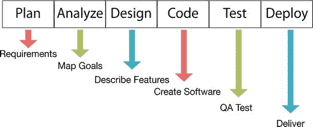
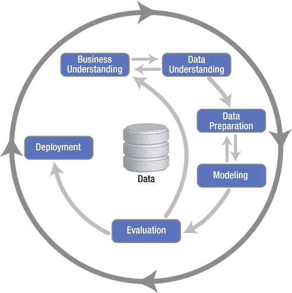
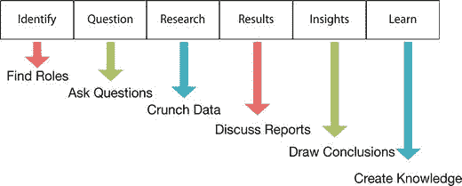
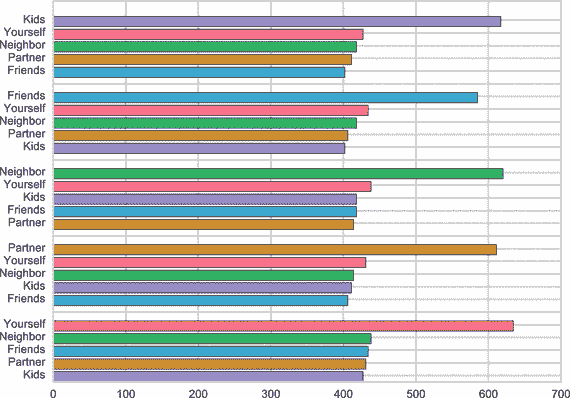
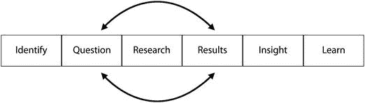
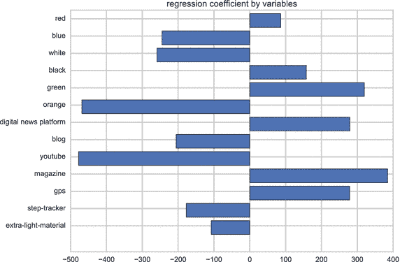

# 十二、使用数据科学生命周期

数据科学团队中的大多数人都熟悉典型的项目生命周期。具有软件开发背景的人熟悉软件开发生命周期(SDLC)。来自数据挖掘的人可能使用了跨行业的数据挖掘标准过程(CRISP-DM)。

根据项目的不同，每个生命周期都运行良好。这些生命周期的问题在于，它们要求你在开始之前对你正在做的事情有很多了解。在软件开发中，你必须有一个清晰的范围。使用数据挖掘，您必须了解大量数据和业务需求。

数据科学是经验性的。你不知道你会发现什么。你可能甚至不知道你在找什么。相反，你必须关注有趣的问题，然后创建一个反馈循环，以确保这些问题与商业价值相关联。

然而，生命周期是非常有用的。它就像一个高层次的地图，帮助团队保持在正确的轨道上。这就是为什么对于数据科学团队来说，您需要尝试不同的方法。您可以使用数据科学生命周期(DSLC)来为团队设定一些方向。

在本章中，您将探索 SDLC 和 CRISP-DM，以便了解它们与 DSLC 的不同之处。然后你将学习如何使用 DSLC，以及如何有效地循环 DSLC 问题。

## 探索 SDLC 或 CRISP-DM

您已经看到让数据科学团队在项目管理框架内工作是多么困难，所以让我们看看项目管理中常用的两个生命周期。生命周期是你在开发软件或解决问题时采取的一系列步骤。

在大型组织中，您可能会遇到两个生命周期。

第一个是软件开发生命周期(SDLC)。这个生命周期有六个阶段，如图 [12-1](#Fig1) 所示。每个阶段下面都有一个在该阶段发生的事情的例子。

图 12-1。

The Software Development Life Cycle (SDLC)

这通常被称为瀑布模型，因为这些阶段中的每一个都必须在下一个阶段开始之前完成:

1.  计划和分析:计划软件和分析需求。
2.  设计和编码:创建基本设计并开始编码。
3.  测试:代码完成后，质量保证人员测试软件。
4.  部署:通过所有测试后，部署给人们使用。

你可能看到的第二个生命周期是数据挖掘的跨行业标准过程(CRISP-DM)，它用于数据而不是软件。它被建模为比严格的瀑布模型更灵活一点。它也有六个阶段，如图 [12-2](#Fig2) 所示:

图 12-2。

Cross Industry Standard Process for Data Mining (CRISP-DM)

1.  商业理解
2.  数据理解
3.  数据准备
4.  建模
5.  估价
6.  部署

这两个生命周期的共同点是它们都是为“大爆炸”交付而设计的。您花费大量时间在软件的计划和分析阶段或数据的业务理解阶段。目标是在开始工作之前尽可能多地收集信息。然后你最终用一个大爆炸来传递它。

由于数据科学的实验性和探索性，当您从事数据科学工作时，这不一定是最佳方法。想象一个典型的数据科学项目。假设您的数据科学团队正在识别典型的客户行为，然后他们决定离开您去找竞争对手。有时这被称为客户流失率。您的数据科学团队可能能够清楚地陈述他们的意图:了解客户在离开之前做了什么，并创建一个模型来预测某人可能何时离开。

然而，你的团队将无法计划他们的工作。他们可能会通过查看社交网络数据、公司的销售数据，甚至是竞争对手异常成功的促销活动，找到自己的最佳模式。关键是他们开始找之前不会知道。

如果您的团队被迫使用 SDLC 或 CRISP-DM 流程，他们将花费太多时间进行规划。他们将无法应用从数据中学到的东西。这是因为他们被迫在开始建模或编码之前就计划好他们的工作。像 SDLC 或 CRISP-DM 这样的已定义流程要求理解每一项工作。如果您犯了一个错误，您必须在 SDLC 中处理一个变更请求，并在 CRISP-DM 中重新评估。

如果您希望您的数据科学团队具有灵活性和探索性，您不能应用标准的生命周期。相反，你应该寻找一种更轻量级的方法来传递见解，这样你就可以在拥有结构的同时，仍然有足够的灵活性来适应新的想法。

## 使用 DSLC

数据科学不太适合现有的流程生命周期。像软件一样贴合 SDLC 是不够的，CRISP-DM 的数据挖掘过程也有点太死板。这并不意味着数据科学团队应该以任何感觉正确的方式工作。在这些生命周期中有真正的价值。一个价值是它给你一个你要去的地方的高层次地图。当你开始一个数据科学团队时，这真的很有用。你对前进的道路有了一个大致的概念，所以你可以从目标开始。

生命周期的危险在于它成为工作的主要焦点。您希望将生命周期作为更好的数据科学的载体。你不要为了走流程而走流程。一个好的生命周期应该像一个扶手。当你上下楼梯的时候，你想把它放在那里。你不想每一步都紧紧抓住它。过一会儿，你甚至不会注意到它在那里。

对于数据科学项目，您可以使用 DSLC。这个过程框架是轻量级的，不太严格。DSLC 有六个步骤，如图 [12-3](#Fig3) 所示，并在以下章节中详细讨论。

图 12-3。

Data science life cycle (DSLC)

这种生命周期松散地建立在科学方法的基础上。

### 识别

作为一个数据科学团队，首先要确定您故事中的关键角色。最后，你希望能够用你的数据讲述一个有趣的故事。开始一个故事的最好方法是确定关键人物。就当是戏里的一个场景吧。谁走进房间？有没有主角或者主角？有没有一个背景故事有助于理解他或她的行为？

让我们回到跑鞋网站。谁是你的关键人物？跑者在那里。也许跑步者有一个影响他或她的跑步习惯的伙伴。也许你的跑步者的搭档是医生、博客写手或教练。这些参与者中的每一个都可能是您的数据科学故事的一部分。

### 问题

确定了关键人物后，你可以问一些有趣的问题。你团队的研究负责人可能会问:“有没有一个博客作者影响了你的跑步者？”也许教练在影响你的跑步者购买什么方面起了很大的作用。他们可能会问，“CrossFit 教练在推荐我们的产品吗？”这些问题是探索数据的关键的第一步。请记住，数据科学是实验性和探索性的。当你以一个好问题开始时，你更有可能得到有趣的研究。

### 研究

数据分析师希望与团队紧密合作，尝试并获得一些研究问题的策略。团队决定探究跑步者和他们的伙伴之间的关系。在这里，研究负责人会问数据分析师他们如何获得这些信息。

如何通过网站上的数据来确定某人是否是跑步伙伴？也许你可以把寻找朋友的促销活动发送到同一个邮政编码。数据分析师可以尝试将客户数据与社交网站上的朋友进行交叉引用。如果数据分析师不能研究这个问题，团队可以提出未来的策略。也许网站应该为跑步伙伴创建一个特别的促销活动。

### 结果

有了研究主题后，您需要创建第一份报告。这些结果是给团队的。它们应该又快又脏。希望你的数据科学团队会经历很多问题和很多报告。其中大部分都是无用的。它们可能很有趣，但还不够有趣，不足以深入探索。您不希望您的数据分析师花费太多时间来完善结果。

### 见识

最后，你的数据科学团队应该看看结果，看看是否有什么有趣的见解，如图 [12-4](#Fig4) 所示。也许数据表明，你的大多数客户都是与合作伙伴一起运营的。这种洞察力可能对营销团队非常有价值。

图 12-4。

Who people run with Note

这张图表是从季度调查中得出的，在调查中，客户选择了他们的跑步伙伴。每组中的第一个条形是与他们一起跑步最多的人的记录。下面是调查受访者的其他类型的人的记录。例如，经常独自跑步的人也会和他们的邻居一起跑步，而和孩子一起跑步的人会更喜欢独自跑步。参见如何在 [`http://ds.tips/cH6th`](http://ds.tips/cH6th) 创建此图表。

### 学习

最后，你的团队会将这些见解捆绑在一起，试图创造组织知识。在这里，您的团队将讲述客户的故事。你可能想用数据可视化来支持你的故事。这种新知识真正为组织的其他部分增加了价值。如果你讲述了一个令人信服的故事，它可能会改变你的组织对他们业务的看法。

## 循环提问

软件和数据挖掘生命周期没有足够的灵活性来处理新信息。这就是为什么你要用 DSLC，它要轻得多。如果您的数据科学团队发现了新的东西，他们不应该为了让您的组织受益而与流程斗争。

如前所述，DSLC 有六个领域:识别、提问、研究、结果、见解和学习。总结一下，首先，你确定玩家，然后你创造一些有趣的问题。然后，您的数据科学团队应该就如何研究这些问题达成一致。你们会讨论结果，看看有没有什么真知灼见。然后你收集你的见解，创造一个故事，告诉组织的其他人你学到了什么。

这六个领域不像软件开发生命周期，每一步都通向下一步。而是把中间的三个区域想象成一个循环。您的数据科学团队应该循环处理问题、研究和结果(参见图 [12-5](#Fig5) )。

图 12-5。

Cycle through question, research, and results

这个问题、研究和结果的循环是驱动您的数据科学团队的引擎。您团队中的三个角色都专注于其中一个领域。研究负责人专注于提出正确的问题。数据分析师与研究主管合作，提出正确的研究问题并创建报告。然后，项目经理将这些结果传达给组织的其他成员。

让我们回到跑鞋网站的例子。每隔几年，就会有一款跑鞋大获成功。你的制造商生产了数百双鞋，但往往有一双比其他的好得多。你找到数据科学团队，要求他们为这些顶级鞋子创建一个预测模型，如图 [12-6](#Fig6) 所示。这位研究负责人提出了一个有趣的问题:“一只鞋为什么会引起轰动？”她与数据分析师合作，提出一些有趣的问题:

图 12-6。

Regression coefficient by variables

*   是鞋子的颜色吗？
*   是什么新技术吗？
*   这款鞋是否出现在杂志上，并受益于网络效应？

Note

使用销售价值作为 y 变量，颜色、营销渠道和技术作为 x 虚拟变量，我们可以看到最畅销的产品最有可能是黑色而不是白色，橙色也有帮助。你可以解读这些数据说:如果其他一切保持不变，如果产品在数字新闻平台上做广告，它可能会帮助其销售额增加 200 美元，而在博客上做广告会减少近 200 美元的销售额。参见如何在 [`http://ds.tips/wrA3e`](http://ds.tips/wrA3e) 创建此图表。

研究负责人、数据分析师和项目经理循环处理这些问题、研究和结果。大部分问题和结果可能都是哑弹。其中的几个可能会引出真知灼见。也许结果表明，它是一些关键属性的组合，可以用作洞察力。然后团队把这个捆绑起来，讲一个故事，这是新的知识。这个故事是说，预测热门的最佳方式是媒体宣传、新技术和有趣设计的结合。

现在，跑鞋公司可以利用这些知识来创造新产品。该公司可以提供制造轰动一时的产品的规格和环境，而不是制造数百双等待轰动一时的鞋子。

一些拥有强大数据科学团队的组织已经在使用这种方法。网飞订阅服务公司用这种方法创建了他们的热门系列《纸牌屋》。他们当时有 3300 万用户。他们的数据科学团队研究了客户在看什么，节目的收视率，观众喜欢什么情节，以及受欢迎的演员(凯文·史派西非常受欢迎)。网飞认为政治节目很受欢迎，于是雇佣了斯派西。然后，他们根据该节目流行的英国版本制作了这个新节目。他们根据流行节目的内容创建了一个预测模型。他们通过问题、研究和结果循环工作。然后，数据科学团队创造了一个客户希望看到的故事。那个故事变成了一个情节，后来变成了一个热门的电视节目。 [1](#Fn1)

这个问题、研究和结果的循环驱动着你的洞察力和知识。您的数据科学团队将这些区域作为更大的 DSLC 的一部分进行循环。记住不要把这个生命周期想成瀑布式的过程。相反，把它想象成开始的几个步骤，然后中间的一个循环，产生伟大的故事。

## 摘要

在本章中，您已经了解了 SDLC 和 CRISP-DM，因此您可以理解它们与 DSLC 有何不同。您了解到 SDLC 和 CRISP-DM 都有六个阶段，并且您已经研究了这些阶段。您发现了如何使用 DSLC 有效地循环有价值的见解。在第 [13](13.html) 章，你将学习如何在短跑中工作。有了 sprints，你将能够经常向你的利益相关者展示一些有价值的东西，并积累组织知识。

Footnotes [1](#Fn1_source)

大卫·卡尔，“给观众他们想要的”，《纽约时报》，2014 年 10 月 15 日， [`http://www.nytimes.com/2013/02/25/business/media/for-house-of-cards-using-big-data-to-guarantee-its-popularity.html?_r=0`](http://www.nytimes.com/2013/02/25/business/media/for-house-of-cards-using-big-data-to-guarantee-its-popularity.html?_r=0) 。