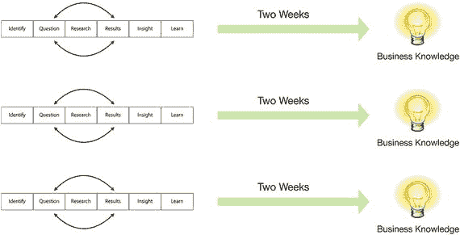
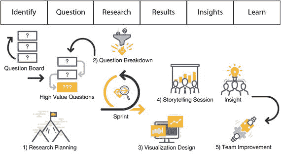
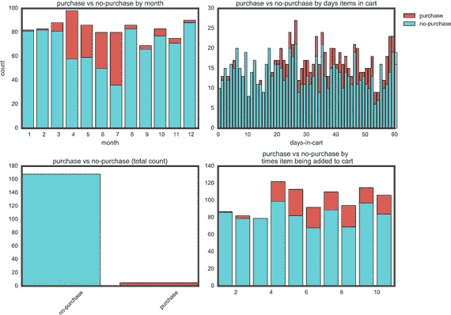

# 十三、在短跑中工作

保持适应性的一个关键方法是将你的工作分解成小块，这样你就可以经常向你的利益相关者展示一些有趣的东西。您的团队可以创建问题并获得快速反馈，以查看数据故事是否有价值并与组织的其他成员产生共鸣。如果它没有价值，团队可以迅速转向其他问题。如果是这样的话，团队可以进行更深入的研究，甚至可以根据业务部门的反馈提出问题。这个反馈循环对于确保团队的工作与商业价值相联系是必不可少的。

在这一章中，你会发现如何通过 DSLC 短跑，创建一个问题板，关注一些会议，分解工作，并讲述一个有趣的故事。所有这些技能将帮助你更有效地通过 DSLC。

## 迭代通过 DSLC 短跑

重要的是要记住，整个 DSLC 应该快速递增。DSLC 并不是为运行数周或数月而设计的——它小到足以容纳两周的工作。每两周，团队可以改进他们的工作，创造新的见解，并提出改进的问题。如果企业认为工作没有价值，团队可以改变路线，尝试新的东西。

现在你已经看到了 DSLC，你可能想知道这在实践中是什么样子的。需要记住的最重要的一点是，DSLC 的结构不像 SDLC 那样分阶段运行，在 SDLC 中，通常只有在前一个阶段结束后才开始下一个阶段。

DSLC 是关于确保你专注于六个领域:识别、提问、研究、结果、见解和学习。整个生命周期应该在一个短的“冲刺”中运行你可能听说过术语 sprint，它在敏捷软件中被广泛使用，但它实际上来自于产品开发。冲刺是团队贯穿整个生命周期的持续时间。每次冲刺都应该贯穿 DSLC 的全部六个区域。

数据科学团队应该进行两周的冲刺。这足以让你找到真知灼见，但也足以让你适应新的想法，如图 [13-1](#Fig1) 所示。

图 13-1。

Two-week sprints

冲刺跑的主要优势是它缩短了“概念到现金”的时间许多组织花很长时间提出新想法，然后经历一个漫长的交付过程。这些新概念可能在几个月内不会增加价值，当然也不会给企业增加任何新的现金，直到他们提出最初的概念。两周的冲刺更频繁地增加价值。即使没有真知灼见，还是会有做完的题。

您不希望您的数据科学团队长时间工作。如果你在几个月或几个季度内工作，问题和结果之间会有太多的时间。等你有了什么见解，数据可能已经改变了。

你也不希望你的团队在任何一个问题上花费太多时间。请记住，你的大部分研究都会走进死胡同。你的大多数问题都是无用的。在找到珍珠之前，你必须打开许多牡蛎。这就是为什么你想快速解决这些问题，这样当你发现一些有趣的东西时，你就可以继续做下去。

我曾经和一个州的教育部门一起工作，他们试图更好地了解在公立学校上学的学生。他们有一个庞大的数据科学团队。该团队试图创建一个模型来更好地预测学生的兴趣。不幸的是，他们试图使用 SDLC。该团队试图以冲刺的方式工作，但更喜欢以典型的瀑布方式工作。

数据科学团队花了大部分时间进行规划。当他们开始他们的项目时，他们花了几个星期在头脑风暴会议上。如果你曾经参加过头脑风暴会议，你知道它需要很好的组织。如果不是这样，会议将远远超过预定时间。事情就是这样。

事实上，几个月过去了，团队才能够发布他们的第一个需求文档。该文件列出了几个他们希望得到答案的问题，并概述了研究技术。然后，团队提出了他们希望从研究中获得的见解。

这种方法有许多挑战。请记住，数据科学是探索性和实验性的。他们只布置了几个实验，然后记录下他们希望学到的东西。他们开始证明他们已经假设为真的东西，因为证明是一项要求，这意味着如果他们被证明是错误的，这个项目就失败了。

如果数据科学团队决定用冲刺跑来代替，效果会好得多。这将允许他们提出更多的问题，进行更多的实验。他们本可以完全专注于学习新的东西，而不是希望自己是对的。它也会更有效率。在这个项目上工作了三个月之后，团队唯一需要展示的就是一系列问题和一些假设。在这三个月内，他们可能经历了十几次较小的短跑，对数据了解得更多，因为他们可能经历了更多的问题和实验。

如果你在一个数据科学团队，试着记住不要被数据淹没。不要在几个月内制定大计划。相反，尽量让事情变得小而简单。一点一点地积累你的知识，这样你就可以适应新的想法，而不是专注于任何一条道路。

## 创建问题板

当您在数据科学团队工作时，您的研究主管负责提出有趣的问题。提出好的问题不是一件容易的事情。一个好的问题可以激起很多新的信息，迫使人们重新思考他们的工作。这就是为什么大多数组织倾向于回避好问题。当你有一个好问题时，它会引起一些恼怒。你几乎渴望找到最佳答案。这可能会导致更多的工作，有时甚至更多的问题。

即使在今天，大多数组织仍然试图专注于提高他们的知识。他们认为如果他们能够优化，他们将永远领先于新的竞争对手。一个好问题往往能打乱这些井然有序的计划。好的问题有打破可预测性的趋势，可以将一组有序的目标变成一个开放式的问题。

打破这个井然有序的过程并注入一些探索和实验是研究领导者的责任。研究主管可以使用的最好工具之一是问题板。问题板通常是一块写满便签的大白板，通常放在数据科学团队附近。应该有足够的空间放置新的问题，并在其中一个角落放上一叠便笺。您可能需要创建一个指向便利贴堆栈的大箭头。有些团队会加上标题:“问一个问题。”

问题板用于征集问题。研究负责人提出问题，这并不意味着所有问题都是她想出来的。它应该是她自己的想法、数据科学团队的问题以及来自组织其他部门的开放式问题的组合。

问题板应该是开放的，有吸引力的。试着让它看起来尽可能的诱人。你希望任何人都可以走过，拿起一张便条纸，然后快速提问。努力保持轻松愉快。有些团队甚至把它搞得几乎像一场游戏。他们把一大碗糖果放在问题板旁边，或者他们打印出一个牌子，上面写着:“问一个问题，赢得一份奖品。”

Note

参见第 [16](16.html) 章，了解如何组织你的问题板，以及如何针对不同类型的问题使用不同颜色的便笺。

问题板还有助于组织中的每个人了解数据科学团队的目的。当您的数据科学团队进行讲故事演示时，人们通常会认识到自己的问题，并在未来更有可能提出问题。他们甚至可能鼓励他们的同事也问问题。

你永远不会有太多的问题。研究负责人与团队的其他成员合作，对最有趣的想法进行优先排序。如果你让你的组织使用该板，它开始看起来有点像一个三维搜索空间。你可以从人们的提问中看出规律。电路板本身成为另一个数据源。

我曾经为一个组织工作，该组织在数据科学团队旁边的角落里放了一个问题板。一开始只是好奇。人们只是路过并阅读它，就像人们被吸引到公告栏一样。这个团队很聪明，把它放在一个饮水机旁边。过了一会儿，几个新问题突然出现在黑板上。他们大多是愚蠢的，没有多少价值。尽管如此，研究负责人还是使用问题板来交流数据科学团队正在做的事情。该团队发布了他们的问题，并继续进行演示。

整个夏天，这个组织带来了一批全新的实习生。第一个月，学生们试图搞清楚这个行业。作为学生，他们更愿意问问题。董事会开始充满了他们的便利贴。他们问的一些问题非常直观。他们正从一个全新的角度看待这个行业。这些问题非常简单且结构合理，因此数据科学团队开始将它们作为最高优先级。他们帮助团队以有趣的新方式探索业务。

如果你是研究负责人，一定要利用问题板。这是一个简单的方法，可以获得有趣的新问题，同时与公司的其他人交流你的进展。

## 只关注几个会议

您的数据科学团队通常希望在两周的冲刺阶段工作。团队将有很多事情要做，所以他们需要一些结构来保持高效。记住，在每次冲刺中，你将穿越 DSLC 的每一个区域。要以这样的速度工作，团队需要固定的工作时间，并且不能参加很多开放式会议。他们必须解释他们所有的时间。

每次会议都需要一个固定的时间框架。时间盒就像它听起来的那样:团队在会议前商定的一组时间。假设您的团队有一个一小时的会议。无论他们在那个时间盒结束时做出什么决定，都必须持续到冲刺阶段结束。你永远不能重新安排或跟进有时间限制的会议。它们开始然后结束。

在大多数组织中，会议不一定是坏事。这是提出问题和强化文化的好方法。会议的挑战在于，它们给你的一周增加了许多不可预测性。您的数据科学团队需要一个可预测的时间表，以便他们能够投入一定的探索和发现。您希望您的数据科学团队以可持续的速度工作。

在每个冲刺阶段，数据科学团队应召开以下五次会议:

*   研究规划
*   问题细分
*   可视化设计
*   讲故事环节
*   团队改进

如图 [13-2](#Fig2) 所示，这五种含义共同帮助传递 DSLC 的所有区域。每一次会议都有时间限制。

图 13-2。

Five meetings for the DSLC

### 研究规划

团队应该从他们的研究计划会议开始每个 sprint。一些团队选择在周三开始冲刺，这使他们能够在周二下午进行一次讲故事的会议。让人们在星期二参加这些会议比在星期五容易得多。研究计划会议是团队决定他们在下一次冲刺中最感兴趣探索哪些问题的时候。通常时间限制为两个小时。在会议中，研究负责人和数据分析师一起工作，提出一周的研究日程。

通常，分析师将不得不争论大量的数据，甚至试图得到一个有趣的报告。研究负责人和数据分析师将合作创建一份最基本的可行报告。也许他们不需要擦洗所有的数据来开始实验和探索。数据分析师和研究主管之间应该有一种天然的紧张关系。研究负责人想要创建小而快速的报告。数据分析师想要清理大型数据集，解决更大的问题。这个会议旨在帮助团队成员提出一个折中的策略。准备数据和创建有趣的报告，您需要做的最少工作是什么？

### 问题细分

在每个冲刺阶段，团队至少要召开两次一小时的问题分解会议。在这些会议中，整个数据科学团队将尝试提出有趣的问题，并将其放在问题板上。他们还会从问题板上拿走任何新的便利贴，看看它们是否有趣。

他们还会寻找问题主题:

*   有什么常见问题吗？
*   有没有大问题可以被分解成更小、更容易处理的问题？
*   有人回答了团队的任何问题吗？

团队将一起努力，为下一个 sprint 优先考虑一些更有趣的问题。

### 可视化设计

第三次会议是可视化设计会议。这个会议通常被限制在一个小时内。这时，研究负责人和数据分析师一起创建一个有趣的可视化。这通常只是数据分析师在讲故事时将使用的内容的草稿。

### 讲故事环节

第四次会议是一个小时的讲故事环节。这时，数据科学团队会讲述他们在冲刺阶段学到的东西。在这次会议中，他们展示了一些更好的数据可视化，在问题板上谈论问题，然后讲述关于这些问题的故事或提出自己的问题。

### 改进

最后，在每个冲刺阶段结束时，团队应该有一个两小时的改进会议来评估他们的进展，并讨论他们是否合作得很好，以及他们是否应该做出任何改变。

所有这些会议应该协同工作，以便数据科学团队可以在每次冲刺后提供有趣的见解。记住，在每个冲刺阶段都有很多事情要做，所以把这些会议的时间限制在一定范围内，这样你就可以专注于发现。

## 分解你的工作

到目前为止，您已经了解了 SDLC 和 DSLC 之间的区别，并且知道 DSLC 最好在两周冲刺阶段交付，因此您可以分解工作并提供有价值的见解。当你在一个数据科学团队中时，总有大量的数据集需要清理和探索新的数据源。事实上，你要做的大部分事情是准备数据。当你在冲刺阶段工作时，你是在强迫团队做最少的准备。

做最少量的数据准备听起来可能是件坏事。大多数人想做更高质量的工作。实际上，当您做最少量的准备时，您会迫使您的数据科学团队关注洞察力，而不仅仅是能力。您不希望您的团队花费数周甚至数月的时间来设置数据。相反，您希望团队几乎立即开始探索数据。

你还必须从组织的角度来看待它。大多数组织对数据并不感兴趣。他们对从报告中获得的知识感兴趣。从组织的角度来看，管理这些数据是成本的一部分，而不是收益。这意味着尽快从数据中提取价值的压力会越来越大。数据科学团队很难花太多时间准备数据，只在最后提交报告。

在许多方面，这类似于现在许多组织对软件的看法。一开始，大多数组织认为软件开发有点神秘。他们把大部分细节留给了技术高超的软件工程师。这些工程师会花大部分时间计划和准备一个大的发布。现在，大多数软件开发人员被迫以更小的块来交付有价值的软件。他们花更少的时间准备，更多的时间交付。这允许组织在团队走得太远之前看到价值。

像早期的软件开发一样，在许多组织中，数据科学仍然有点神秘。该团队在如何开展工作方面仍有很大的回旋余地。然而，用不了多久，经理们就会开始提出更尖锐的问题。目前，大多数数据科学团队花费大量时间准备大型数据集。一旦这些经理开始提问，团队将不得不关注最少的可行的数据准备。

我曾经为一个组织工作，该组织专注于自动化清理非常大的数据集的过程。他们希望将其插入到一个更大的数据集，而这个数据集已经存在于他们的集群中。几个月来，科学小组一直专注于这项任务。他们下载了开源软件工具，并购买了一些商业产品来帮助他们准备数据。几个月后，他们创建了几个脚本、软件工具和实践，自动化了将这些大型数据集移入集群的过程。

在他们把它转移过来之后，他们和企业数据服务的副总裁开了一个会。他们用 PowerPoint 演示了群集消耗了多少数据。他们浏览了几张幻灯片，展示了清理和导入新数据集的难度。会议快结束时，副总统问了一个有趣的问题。他只是简单地问:“我们现在知道了哪些以前不知道的事情？”这个问题砰的一声落在房间里。从沉默中可以明显看出，几个月来没有人以这种方式考虑过这些数据。房间里的每个人都完全专注于能力。他们忘记了组织的真正价值。

如果他们以两周冲刺的方式交付，他们可能会更快地关注价值。他们可以使用较小的数据子集，而不是构建整个数据集，立即开始创建报告和研究数据。当你研究这些数据时，你会对其价值有更好的理解。当你只专注于清理和导入数据的时候，你就有把工作变成例行公事的危险。这就好像你花了所有的时间为你的晚宴布置桌子，却没有留下任何时间来准备一顿大餐。

## 讲述一个有趣的故事

呈现数据和讲述故事有很大的区别。首先，讲述一个故事更具挑战性，因为你要做更多的工作，引入数据和你对业务的了解，并加入你对世界的了解。

当你用数据图表做一个 PowerPoint 演示时，你在说，“这是我所看到的。”当你讲故事时，你是在说，“这是我所相信的。”这要困难得多，而且在某种程度上，这也更加私人化。这就是讲故事如此有价值的原因。

Note

有关如何讲述有趣的数据故事的更多信息，请参见第 [19](19.html) 章。

当你讲故事时，你同时做了几件事。首先，您简化了数据的复杂性。您还可以定义参与创建这些数据的人员的角色。

接下来，你把自己对公司的了解带进来。这可能是通过你的经验或研究。你对人和数据进行简单的观察，然后把它放在组织的环境中。你不只是用数据来谈论地点和内容，你还要展示原因。

你做的第三件事是让你的数据更容易记忆。大多数研究表明，当你用 PowerPoint 格式展示某样东西时，很少的信息能被你的观众理解。这些要点可能很容易创建，但也很容易忘记。一个故事能更有效地抓住你的观众的注意力。如果你能编一个好故事，你更有可能让每个人都参与进来。

最后，一个好的故事会有行动的号召。它要么会告诉你一些新的东西，要么证明你继续寻找是正确的。如果你能讲一个好故事，让你的观众也参与进来。你就不太可能被人问:“你们为什么又要这样做？”

让我们回到我们的跑鞋网站。假设您的数据科学团队一直致力于提高销售额的问题。你和团队一起将问题分解成几个更小的问题。其中一个较小的问题是，“人们在购买他们的愿望清单上的东西吗？”

研究负责人和数据分析师一起工作，创建一个快速而肮脏的报告，看看有多少愿望清单项目被转换为购买。然后他们创建一个时间序列来观察这些购买是上升还是下降。通常，团队会在讲故事的前一天召开可视化设计会议。在这个会议中，他们会尝试将原始数据和丑陋的报告转换成一个漂亮的可视化，然后使用这个可视化来讲述一个有趣的故事。

数据显示，在夏季的几个月里，人们更有可能将他们的愿望清单项目转化为购买。这只是原始数据，但这不是一个非常有趣的故事。为什么人们在冬天对鞋子感兴趣，却要等到夏天才买？数据科学团队决定讲述一个故事。他们使用的标题是，“夏季梦想家:为什么冬季购物者在夏季买鞋？”接下来，数据分析师使用白板提出数据可视化的初稿(图 [13-3](#Fig3) )。

图 13-3。

Purchasing habits throughout the year

在左上角，有更多的人在夏季(六月到九月)购买他们购物车中的商品，但是在左下角，购物车中的大多数商品都没有被购买。在右上角，购买的商品被放在购物车中超过 20 天，并被重复添加超过 4 次。查看如何在 [`http://ds.tips/truD6`](http://ds.tips/truD6) 创建此图表

注意这个故事是如何让数据变得更有趣的。想象一下，如果数据分析师使用标题“年度愿望清单转换率”，并在 PowerPoint 幻灯片中包含简单的时间序列图。像那样的东西不会引起任何人的兴趣。没有背景也没有行动号召。

第二天，数据科学团队使用他们的“夏季梦想家”可视化向组织的其他人讲述一个有趣的故事。这个故事说，你的许多顾客考虑在冬天跑步，但他们只在夏天买鞋。这个故事引发了更多的问题。人们在冬天穿着旧鞋跑步吗？他们只是不跑吗？他们不需要新鞋是因为他们大多在室内跑步吗？是否应该做一款专门为室内跑步设计的跑鞋？

希望你会在讲故事的过程中得到这些问题，然后你可以把它们添加到你的问题板上。如果你能讲一个好故事，你组织中的每个人都会想参与你的发现。

## 摘要

在这一章中，你看到了如何通过 DSLC 短跑锻炼自己。DSLC 有五个核心会议。在这些会议中，您的团队将使用一个问题板，分解工作，并讲述一个有趣的数据故事。在第 [14](14.html) 章中，您将学习如何避免在数据科学冲刺中可能遇到的陷阱。