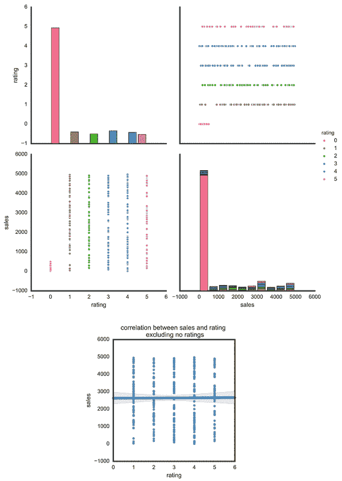
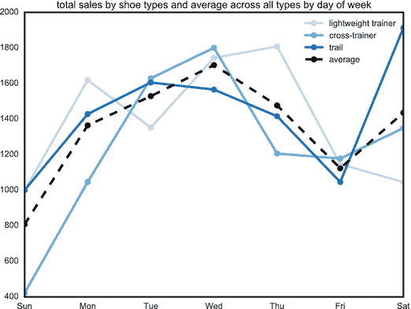
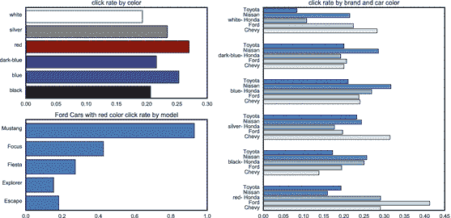
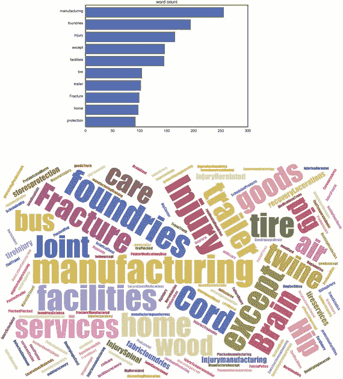

# 十四、在数据科学冲刺中避免交付陷阱

在避免陷阱这一章中，你会发现一些改变公司思维模式的方法。你可以从想象如何在没有目标的情况下工作开始。许多组织专注于目标并创建强大的法规遵从性部门。这些部门确保每个人都达到这些目标。这种专注会让你的团队无法探索和发现。数据科学团队需要利用意外收获，增加组织知识。他们需要强调探索而不是常规工作。

## 改变心态

许多公司在组建数据科学团队时低估了组织变革。这不是让一群统计学家看数据那么简单。这是指以不同的方式对待您组织的数据。它不再是需要控制的静态资源。相反，它是一个不可忽视的不断变化的见解来源。

Note

有关开始组织变革的更多信息，请参见第 [25](http://dx.doi.org/10.1007/978-1-4842-2295-9_25) 章。

改变这种心态的一部分是放弃过去可能行之有效的策略。如果你想探索，你必须摆脱项目目标和计划的结果。这些往往是发现的障碍。你必须接受这样一个想法，即你不知道数据可能会导向何处。你甚至可以依靠简单的意外收获。

同时也不能没有任何目的和方向的流浪。你需要创造增加真正价值的组织知识。你必须是开放的和探索性的，同时仍然是务实的和由商业价值驱动的。如果你太开放，你的团队可能会迷失在数据中。你会探索死胡同，问一些没人有兴趣回答的问题。这会让你的利益相关者感到沮丧，并限制你的成功。另一方面，如果你太专注于目标，你不会发现很多新的见解。你会被限制在你已经希望成为事实的范围内。不会有太多新发现的空间。

如果你既想解释又想被商业价值所驱动，你需要改变你对工作的看法。第一步是仔细看看老朋友:计划好的目标。

## 没有目标的工作

您的数据科学团队将希望使用 DSLC 和 sprints，这样他们可以每隔几周讲述一些有趣的故事。这些实践有助于您的团队探索数据和提出好问题，并且应该有助于让您的团队专注于探索。尽管如此，对于许多团队来说，最大的挑战是试图改变组织的心态。

正如本章开始时提到的，大多数组织仍然将工作视为一系列目标和目的。这就是为什么大多数关键角色都专注于管理和法规遵从性。项目经理确保团队遵守项目计划。首席开发人员帮助维护某些编码标准。质量保证经理执行像六适马这样的标准。即使是首席执行官也专注于为组织的其他成员设定清晰的目标。所有这些受欢迎的角色都以合规性为中心。他们确保团队忠于他们的目标。担任这些角色的人往往很有影响力。很有可能，他们会尝试将这种目标驱动的心态应用到您的数据科学团队中。

这对数据科学团队来说是一个真正的挑战，因为他们需要探索并使用经验过程来研究和学习数据。很难摆脱典型的目标。根据定义，探索就是寻找和发现不熟悉的东西。目标是关于忠于你的预期目标。

你当然可以混合探索和目标。如果你发现自己在一个新的城市，你可能会有一个寻找美食的目标。然后你在这个地区寻找好吃的小吃摊或餐馆。你的目标是找到晚餐，但你仍然愿意探索新的想法。问题是大多数组织没有这么灵活。他们倾向于狭隘地定义他们的目标。目标本身成为最大的焦点。一个团队不会因为发现新事物后改变路线而出名。一个成功的团队通常有一个明确的目标，并在预期的时间框架内实现他们的目标。这种对目标的关注会为探索创造一个非常困难的环境。

让我们回到我们的跑鞋网站。假设您的数据科学团队的目标是创建一个报告，按各种信用卡细分购买情况。你想知道接受不同的信用卡是否会增加销售额。当团队探索数据时，如图 [14-1](#Fig1) 所示，他们注意到一些意想不到的事情。看起来鞋的销量和顾客评分之间有正相关关系。你可能会认为评分最高的鞋子可能会有更高的销量。然而，数据科学团队注意到，任何评级的鞋子都有更高的销售额。销量最低的鞋子是那些根本没有评级的鞋子。

图 14-1。

Correlation between shoe sales and customer ratings Note

假设 0 为无评分，其余为真实评分。总销售额接近 0 的大多数商品都没有评级。然而，其余的数据并没有表明更高的收视率会带来更高的销售额。事实上，原因可能恰恰相反。因为销售额更高，更多真正购买了该商品的人愿意在网站上留下反馈。然而，在底部的图表中，如果我们忽略那些没有评级的，几乎没有任何相关性。查看如何在 [`http://ds.tips/8refR`](http://ds.tips/8refR) 创建这些图表。

基于这些数据，该团队决定利用这一新发现。他们创建了一套完全不同的报告，将评分与顶级鞋的购买相关联。在接下来的讲故事环节中，他们会讨论如果顾客认为某款鞋不受欢迎，他们最不可能购买。事实上，一双评级很糟糕的鞋仍然比一双没有评级的鞋更有可能卖出去。这个新发现完全出乎意料。该团队的目标是查看新的信用卡数据，然后转向开始查看评级数据。

在典型的项目中，这是完全不可接受的。你不希望你的团队有一个既定的目标，然后根据他们自己的标准改变方向。然而，这正是您希望从数据科学团队那里获得的经验探索。事实上，许多数据科学团队试图远离典型的目标。他们可能有寻找模式的开放式概念。他们可能只是浏览数据，看看是否有什么突出的东西。他们想看看数据中是否有有趣的东西。这些团队发现，明确定义的目标往往会成为发现的障碍。

当你在一个数据科学团队中时，试着记住你正在做一些与组织中大多数其他团队不同的事情。借助数据科学，如果您专注于发现，就能从数据中获得最大价值。你应该与你的经理密切合作，沟通这种差异。不要低估试图改变他们期望的挑战。大多数人花了很多年专注于实现目标。一组人探索数据寻找新的东西可能不容易被接受。

## 利用机缘巧合

您已经看到，为您的数据科学团队设定目标可能会很困难。尽管如此，许多组织发现很难想象没有他们的工作。目标无处不在:有职业目标，也有学习目标，励志书讲个人目标。这些目标指导着我们的大部分工作，但它们可能没有你想象的那么有价值。

在过去的几年里，在这个领域已经做了一些有趣的工作。它来自一个你可能意想不到的地方:机器学习和人工智能的世界。试图让计算机显示智能行为的人们发现，我们所知道的很多东西都是基于无计划的发现。事实上，我们从流浪中学到的东西比我们从既定计划中学到的要多。

关于这个主题的最好的书之一是由肯·斯坦利和乔尔·雷曼所著的《为什么伟大不能被规划:目标的神话》。肯·斯坦利教授在中佛罗里达大学经营着一个研究人工智能的研究小组。在书中，他说，“目标实际上成为更令人兴奋的成就的障碍，比如那些涉及发现、创造、发明或创新的成就。”这来自一位研究人工智能的顶尖计算机科学家。这不是狄巴克·乔布拉的励志名言。

你应该这样想，你越专注于目标，就越不可能有有趣的发现。数据科学团队中的每个人都应该适应创造性的漫游。事实上，斯坦利教授指出，该团队实际上应该依靠纯粹的意外收获。

Serendipity 是一本关于人工智能的书中出现的一个奇怪的词。简单来说，意外之喜就是事情刚刚发生。这是无法预测或计划的。就像你在街上偶遇一个朋友，然后决定一起坐下来喝杯咖啡。这是未计划的，未规划的，未知的。

听起来可能很奇怪，数据科学团队必须依靠一些意外收获。有时团队成员会在数据中看到一些他们没有预料到的东西。它会看起来有趣或不寻常。对这个团队来说，追踪这个发现是很重要的。你不希望他们以牺牲发现为代价专注于目标。

斯坦利教授称这些为垫脚石。这些都是有趣的事情，最终导致见解。如果你忽视它们，你很可能会错过关键的发现。

让我们回到我们的跑鞋网站。数据科学团队的任务是预测网站在即将到来的一年中应该有多少新的销售额。在查看数据时，分析师发现了一些有趣的事情。如图 [14-2](#Fig2) 所示，在过去的几周里，周日的销售额略有下降。如果团队完全专注于目标，他们可能会忽略这个有趣的发现，因为很难想象轻微的下降可能会帮助他们创建一个预测未来销售的报告。专注于发现的数据科学团队将跟进这些有趣的信息。

图 14-2。

Total sales by shoe types and avererage across all types by day of week Note

平均而言，所有类型的鞋在周日的总销售额都略有下降，但不同类型的鞋在一周的不同日子达到峰值。参见如何在 [`http://ds.tips/tuc2E`](http://ds.tips/tuc2E) 创建此图表。

可能不会有任何结果。事实上，这些小发现中的大部分只会是死胡同。然而，他们中的一些人将成为未来非常有价值的东西的垫脚石。团队对数据探索得越多，他们就越能建立与未来问题的联系。

所有这些语言是你在组织中通常听不到的。像垫脚石、意外收获和发现这样的词听起来更像是你在浪漫喜剧预告片中使用的关键词。然而，这些是尝试学习新的和有趣的东西的关键部分。

加拿大哲学家马歇尔·麦克卢汉曾经说过:“我不知道谁发现了水，但它不是鱼。”许多发现都是因为不知道你的信息会引向何方而感到舒服。你必须能够追求意想不到的东西。你走向发现的垫脚石只有在你的路的尽头才会清晰。关键是不要忽视那些看起来有趣的事情，只是为了忠于你的目标。

请记住，数据科学是将科学方法应用于您的数据。科学方法的一个关键部分是进行观察和提出有趣的问题。不要为了短期规划而减少你的探索。

## 增加组织知识

您已经看到了一种可以预测的方式来获得重大发现，那就是允许您的团队探索数据并寻找有趣的联系。还有 DSLC，它迫使团队每两周讲述一次有趣的故事，并让组织了解团队正在做什么。代替目标规划，组织得到可预测的交付。给你的团队一个可预测的框架是让他们专注于积累知识的好方法。每两周一次的节奏分享他们的故事。如果组织中的其他人不喜欢他们的故事，他们可以鼓励他们朝不同的方向发展。

DSLC、sprints 和 exploration 共同提供见解和知识。如果你在一个数据科学团队工作，你应该试着平衡这三件事。DSLC 为团队提供了考虑交付价值的蓝图。团队应该确定角色，并在提问、研究和讨论结果的循环中工作。

短跑给组织一个可预测的速度。没有 sprint，团队就有花费太多时间准备而不是交付的危险。大多数时候，您的数据分析师都在清理和准备大型数据集。两周的 sprint 迫使你的数据分析师在尽可能小的块中工作，并鼓励他或她交付许多较小的报告，而不是一个大的演示文稿。

最后，组织需要非常重视对数据的探索。团队应该有追踪有趣发现的自由。组织的其他部分仍然可以看到团队的工作，但是工作可能会改变。它可以基于一个偶然的发现。

冲刺和探索之间的平衡有助于保持对话活跃。团队有额外的自由，作为回报，组织得到每周的反馈。如果做得好，数据科学团队将与组织密切合作，帮助员工和高管了解业务和他们的客户。这是轻量级结构和频繁发现的良好平衡组合。

也就是说，这不是一个容易的平衡。在一些冲刺阶段，团队可能无法交付任何有趣的东西。其他时候，数据集看起来如此庞大和复杂，以至于不可能在两周的冲刺中分解。

这个 DSLC 框架不是为解决这些问题而设计的。这只是照亮斗争的一种方式。它迫使团队往小处想，这鼓励组织允许探索。

确保你的 sprint 始终传递价值的一个方法是，在每次讲故事的时候，都要有一个清晰的行动号召。你的听众会对增加组织知识非常感兴趣。您可以就他们如何利用这些新数据提出明确的建议，从而帮助强调这些知识的价值。

让我们回到你的跑鞋网站。你看到了一双鞋是否有评级和它卖得有多好之间的明显联系。在你的讲故事环节中，你应该建立一个清晰的视觉效果，展示销售和评分之间的联系。新的组织知识是，没有评级的鞋子不太可能卖出去。然而，这不应该是你的故事的标题。相反，你应该展示你的组织如何从这些新知识中获得价值。你可以把这个形象化的标题定为，“增加我们的评级产品数量应该会增加整体销售额。”

有了这个头衔，你不仅仅是说出了组织所知道的。你所做的是清楚地概述你的团队交付的价值。在一周内，数据科学团队就如何提高销售额提出了建议。有人呼吁采取行动。如果你想增加网站的销售额，鼓励顾客评价他们的产品。这种行动号召可以针对组织的其他部分，也可以重定向到团队。在讲故事环节，组织可能会建议数据科学团队想出一个有趣的故事，告诉他们如何提高产品评级。

当你在数据科学团队工作时，试着记住你的组织将以一种非常实际的方式看待新知识。一定要平衡 DSLC 与冲刺和探索，以传递有趣的故事。这些故事应该有新的组织知识和明确的行动号召。当你的团队有明确的行动号召时，你更有可能从组织的其他人那里得到有趣的反馈。他们可能会要求你继续你的故事，或者创造新的故事来给予更多的指导。

## 注重对日常工作的探索

1999 年，两位心理学家进行了一项实验。 [3](#Fn3) 他们拍摄了一段六个人传球的视频。他们向 40 名学生展示了这段视频。他们要求学生数一数球从一个人传给下一个人的次数。大多数学生都能数出球传了多少次。他们没有说的是，一个穿着大猩猩服装的人会走到屏幕中间。大猩猩停在中间，然后离开镜头。当被问到时，只有一半的学生没有注意到大猩猩。事实上，参与者非常确信它不在那里，他们不得不重放视频。

心理学家公布了他们的研究结果，并称之为知觉盲。当人们如此专注于日常任务，以至于对有趣的事情视而不见。看视频的学生太专注于数通行证，以至于没有注意到有人穿着大猩猩的衣服。

这项研究已经重复了几十次。一项实验将一个跳舞的大猩猩的小图像放在 CT 扫描上，以检查放射科医生是否会注意到。 [4](#Fn4) 原来，80%没有。即使知道这项研究的人也只是稍微更有可能发现一些意想不到的东西。

这表明日常工作经常关闭我们大脑中看到意外事件的部分。许多人在做复杂的日常工作，但却看不到大猩猩。

这对您的数据科学团队来说是一个真正的危险。请记住，数据科学的大部分价值在于探索。您希望团队中的每个人都注意到一些有趣的事情，但是工作的一部分是例行公事。您的数据分析师仍然将大部分时间花在清理数据上。你要注意的是，当你的团队变得如此专注于常规，以至于错过了一些意想不到的东西。

我曾经为一家公司工作，该公司试图理解为什么顾客会点击某些广告。每个广告都展示了一辆汽车的图片。当客户点击汽车时，图像和点进被记录到集群中。数据科学团队创建了数据的几种可视化形式。他们专注于创造实时成功率和点击率。有很多工具可以帮助他们以有趣的方式展示这些信息。数据科学团队非常忙碌，并适应了可预测的数据收集节奏。

在一次讲故事的会议上，数据分析师深入点击数据可视化，以显示数据中的详细信息。作为一个例子，他们展示了一个红色福特野马的广告结果。出于某种原因，这个广告做得非常好。它有更高的点击率。团队中的一个利益相关者打断了演示，并问为什么这个广告如此成功。数据科学团队没有考虑这个问题。他们太专注于获取点击率数据，以至于没有真正注意到任何有趣的东西。他们的工作已经成为例行公事。他们收集数据，清洗数据，然后上传到集群。他们没有问很多有趣的问题。这就像一只大猩猩走进了他们的数据，而他们甚至没有注意到。

数据科学团队在下一次冲刺中解决了这个问题。研究负责人问了一些关于成功广告的有趣问题。是什么让这个广告更成功？是车的牌子吗？是车的类型吗？是车的颜色吗？为什么网站上的客户更有可能购买这辆车？

在经历了这些问题之后，团队讲了一个有趣的故事。原来车的颜色对点击率有轻微影响，如图 [14-3](#Fig3) 。这一点，加上汽车的品牌和型号，可能是这个广告更成功的原因。数据科学团队在结束下一个讲故事环节时呼吁采取行动。他们建议将更多的汽车换成红色会提高他们的整体广告收入。

图 14-3。

Color click rate Note

在所有颜色中，红色的点击率可能比其他颜色稍高。如果按品牌细分，只有福特的红色点击率高于其他品牌。比如对于日产来说，蓝色是点击率最高的颜色。如果您进一步深入了解红色福特车型，只有野马的点击率极高；其他型号相对较低。参见如何在 [`http://ds.tips/wr5nU`](http://ds.tips/wr5nU) 创建此图表。

该团队很幸运，他们有一个团队之外的利益相关者指出了他们数据中的大猩猩。大多数团队必须集中精力确保他们提出了有趣的问题。

记住，你的团队提供的是洞察力，而不是数据。最干净的数据或最大的集群没有奖项。不过，你的团队很容易专注于数据科学的这些常规部分。当这种情况发生时，你的团队可能不会在他们的数据中注意到大猩猩。

## 将洞察力与商业价值联系起来

即使你的团队发现了一些有趣的东西，你仍然要把它和真正的商业价值联系起来。将探索与商业价值联系起来并不容易。如果团队知道去哪里找，那就不是探索了。通常，在数据科学中，直到你发现了洞察力之后，你才知道商业价值。在你传授任何新知识之前，你必须走遍整个 DSLC。

这是短跑训练的主要好处之一。你将每两周一次传达一点点这些见解。在每一次冲刺中，你都将建立在你所知道的基础上。研究主管可以评估您的见解，并将它们与商业价值联系起来。如果团队走错了路，他们可以转向更有趣的东西。

我曾经为一家零售商工作，这家零售商试图提高工人的安全性。他们创建了一个收集所有非结构化数据的 Hadoop 集群。集群有视频、图像和受伤报告。数据科学团队使用这些数据创建了该组织所有工伤的单词云，然后该团队在他们的讲故事会议上展示了该云的简单可视化(见图 [14-4](#Fig4) )。当他们开始讲述他们的故事时，你可以看到房间里的每个人都在摩擦他们的手或交叉他们的腿，因为团队描述了常见的伤害。会议结束时，数据分析师说他们将利用下一次冲刺来完善他们的分析。他们将创建数据可视化，讲述更深层次的故事，并涵盖更具体的伤害。

图 14-4。

Word cloud of all the organization’s job injuries Note

参见如何在 [`http://ds.tips/waxU8`](http://ds.tips/waxU8) 创建此图表。

房间中的一名利益相关者问了数据科学团队一个简单的问题:“为什么您关注的是伤害，而不是造成伤害的设备？”房间里的每个人都能同情受伤的人。然而，真正的价值是试图防止未来的伤害。该团队应该使用预测分析来判断这项工作是否太危险。

数据科学团队一直专注于谁受伤了，这是一个需要讲述的艰难故事。然而，对现有工人的真正商业价值是防止未来的伤害。该团队需要查看人们受伤时使用的设备，或者他们遵循的流程。这是一组全新的待探索的数据。

如果团队没有进行短跑训练，他们可能要花几个月甚至更长时间来提炼和探索受伤的数据。他们会讲有趣的故事，但不是利益相关者想听的故事。相反，在接下来的冲刺中，团队专注于危险的活动。他们以之前的数据为基础，讲述了一个关于危险设备和过程的全新故事。

数据科学团队探索与商业价值没有明确联系的数据并不罕见。事实上，Gartner Group 估计，85%的数据分析团队的工作与商业价值毫无关联。 [5](#Fn5) 这是一些工作的性质。不了解的东西很难评价。另一部分是确保你和利益相关者有一个清晰的联系。您的研究主管将与企业合作，将团队的见解与实际价值联系起来。

如前所述，在 sprints 中工作可以让团队在发现有趣的事情时快速转向。涉众可能不总是知道在哪里找到商业价值。相反，他们更有可能告诉你不要去哪里。尽管如此，这个反馈循环对于保持团队在正确的轨道上是必不可少的。知道不去哪里可能最终会让你走上正确的道路。

数据科学团队应该在做有趣的工作。这是组织中你可以积累真正洞察力的地方之一。然而，该团队不会对典型的业务压力免疫。如果您的数据科学团队没有产生真正的价值，过不了多久，利益相关者就会开始质疑这项工作。

大多数数据科学团队的工作方式与组织的其他部门有很大不同。如果你不迅速开始存钱，你就不太可能存在足够长的时间来改变现状。创造价值的最佳方式是在业务和数据科学团队之间建立紧密的反馈回路。涉众应该知道团队在每个冲刺阶段都在做什么，并且工作应该明确地与他们认为有价值的东西联系起来。

在每个讲故事环节中，尝试讲述一个简单的故事，讲述团队学到了什么，以及它将如何帮助组织的其他成员。这些会议对于保持团队工作和专注于有趣的工作至关重要。

## 摘要

在这一章中，你学会了如何通过想象如何在没有目标的情况下工作来改变公司的心态。您发现专注于目标会阻止您的团队探索和发现。在第四部分，你将学习如何提出好问题。要提出好的问题，你必须理解批判性思维，这你会在第 15 章学到。

Footnotes [1](#Fn1_source)

肯尼斯·o·斯坦利和乔尔·雷曼，《为什么伟大不能被规划》(施普林格科学商业媒体，2015 年)，第 978-3 页。

  [2](#Fn2_source)

引用自贝尔和豪厄尔公司总裁彼得·G·彼得森在技术和世界贸易研讨会上的演讲，1966 年 11 月 16-17 日，伊利诺伊州，芝加哥，第 83 页，引用第 91 页，会议由美国商务部和国家标准和技术研究所主办，国家标准局杂项出版物，美国政府印刷局，华盛顿特区(HathiTrust)[http://hdl.handle.net/2027/uc1.b4112688?urlappend=%3Bseq=103](http://hdl.handle.net/2027/uc1.b4112688?urlappend=%3Bseq=103)

  [3](#Fn3_source)

丹尼尔·j·西蒙斯和克里斯托弗·f·沙布里斯，“我们中间的大猩猩:动态事件的持续疏忽性失明”，《感知》28，第 9 期(1999):第 1059-1074 页。

  [4](#Fn4_source)

Trafton Drew、Melissa L-H. V 和 Jeremy M. Wolfe，“隐形大猩猩再次出击:专家观察者的持续疏忽性失明”《心理科学》24 卷 9 期(2013):第 1848-1853 页。

  [5](#Fn5_source)

特德·弗里德曼和库尔特·施莱格尔，“数据和分析领导力:用可信数据赋能人们”，高德纳商业智能、分析和信息管理峰会，2016 年，澳大利亚悉尼。