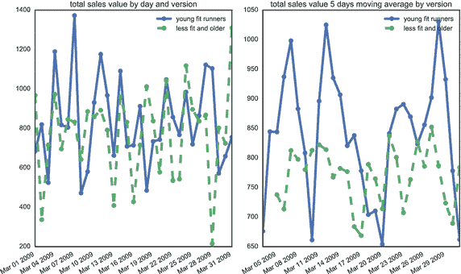

# 十五、理解批判性思维

对于您的数据科学团队来说，问题非常重要。在这一章中，你会发现如何利用问题的力量。然后你会发现那些有趣的问题是批判性思维的一部分。你还将了解批判性推理，以及如何寻找合适的问题。

## 利用问题的力量

想象一下，你正在给一群同事做演示。你想出了一个增加公司销售额的方法——一个花了你几周时间准备的策略。在你演讲的中途，有人打断你，问你一个关于你的假设的问题:“你是怎么得出你的结果的？”你对这个问题有什么反应？在一些组织中，这将被视为对抗和好斗。通常，这类问题来自持怀疑态度的主管或不同意的人。不管怎样，这都超出了演示的正常节奏。

在西德尼·芬克斯坦的《为什么聪明的高管会失败:你能从他们的错误中学到什么》一书中，他指出许多高管会毫无疑问地接受好消息。他们把问题留给坏消息或不同意时，这意味着大多数组织把问题视为一种不同意。当没有任何问题时，人们通常会重复同样的错误。他们倾向于群体思维，有盲点。许多公众失败可以追溯到从未被问过的关键问题。

正如本书中提到的，大多数组织仍然专注于完成工作。他们有任务声明，鼓励团队推动和交付，并按照明确定义的目标和积极的时间表工作。很难想象一个组织或会议中每个人都会问有趣的问题。在许多组织中，根本没有时间来鼓励这种类型的提问。然而，让你的数据科学团队存在于现实之外是很重要的。你的团队需要创造一个对有趣的问题开放的环境。您组织的其他成员可能生活在一个陈述的世界中，但是您的团队需要适应一个充满不确定性、争论、问题和推理的世界。

当你思考这个问题时，数据科学已经给了你很多答案。你将拥有显示购买趋势的报告，以及显示产品评级的万亿字节数据。你的团队需要使用这些答案来提出有趣的问题。由你来创造一个环境，让每个人都可以自在地质疑彼此的想法。

有几件事需要记住，以帮助您的数据科学团队保持正轨。

首先，如果你有一个新成立的数据科学团队，这个团队不太可能擅长问正确的问题。那是因为他们没怎么练习过。大多数团队不会问问题，因为好问题会挑战你的思维，不容易被忽视或忽略。他们迫使团队解开已经完全理解的东西，这需要比被动倾听更多的工作。

当你在学校时，你的老师可能会快速浏览材料，因为他们希望你记住事实并通读专家的建议。当你举手的时候，可能是为了一个很简单的问题。可能是一些很平常的事情，比如“这个会出现在试卷上吗？”没有人提出更大胆的问题，比如“我们为什么要学习这门学科？”或者甚至是，“我们能学到不同的东西吗？”

在工作中，你可能没有太多机会问有趣的问题。大多数公司仍然根据员工贯彻公司愿景的能力来提拔他们。你需要和你的同事好好工作。总是问问题并不总是最好的相处方式。您需要为您的数据科学团队改变这种观点。

第二件要记住的事情是，问问题真的很难。大多数人还是喜欢简单的陈述。告诉全世界你的想法是很容易的。向一个能提出好问题的人捍卫你的想法不是那么容易的。例如，想想你为自己做的健康的事情。也许你吃某些食物或做某些运动。现在问问你自己，你怎么知道它是健康的？是因为有人告诉你还是因为你的感受？如果是因为有人告诉你，你怎么知道那个人是对的？许多专家对什么是健康有不同意见。哪些专家是对的？

不用多久就会意识到提问会让人精疲力尽。解构你已经相信是真的东西需要很多工作。现在想象一下在小组环境中做这件事。

请记住，提出好的问题是很难做到的，而且并不总是被接受。尽管如此，这对您的数据科学团队来说是必不可少的。最好的问题会让你对你的数据有新的见解，这将帮助你建立你的组织知识。

## 淘金

提出有趣的问题是批判性思维的关键部分。所以我们来问一个有趣的问题。什么是批判性思维？大多数人认为批判性思维是批评的一种形式。你在判断一件事，决定它是好是坏，是对是错。这是否意味着如果你不同意某人的观点，你就在运用批判性思维？大多数人会说不。

批判性思维不是你判断事物的能力。批判性思维中的“批判性”是关于发现可能会削弱想法基础的关键问题。这是关于你的能力，去挑选组成一个被接受的信念的结论。这与你的判断无关，而是你发现本质的能力。

许多组织抱怨他们没有运用批判性思维的人。试图找到关键问题不是你能一直做的事情。有点像跑步。大多数人可以做一点，然后通过一些锻炼，他们可以做得更多一点。再好的运动员也不能天天跑。

想想我们的跑鞋网站。想象一下，公司发客户优惠券，年底有一天的销售活动。月底，数据分析师运行了一份报告，显示销售额增长了 10%，如图 [15-1](#Fig1) 所示。很容易说较低的价格鼓励了更多的人买鞋。较高的鞋销量弥补了折扣价格，促销活动也发挥了作用。越来越多的人购买鞋子，公司收入也越来越多。许多团队会就此止步。

图 15-1。

Average sales quantity

按商品 SKU 和优惠券代码(包括无优惠券代码)旋转平均销售数量，取每个优惠券代码的平均销售数量并减去无优惠券代码的平均销售数量，您会得到使用每个优惠券代码与不使用优惠券代码相比平均多销售了多少单位。对于具有最高折扣(60%)的优惠券代码，平均比不使用任何折扣多 0.1 个单位销售。参见如何在 [`http://ds.tips/6acuV`](http://ds.tips/6acuV) 创建此图表。

这是您的数据科学团队希望应用其批判性思维的地方。记住这不是好与坏的问题；它是关于发现关键问题，例如:

*   我们怎么知道收入的增加与促销有关呢？也许同样多的人会不顾促销而买鞋。
*   哪些数据会显示促销和销售之间的紧密联系？
*   促销有效吗？

每个人都认为促销是有效的。所以很多公司都有。这意味着他们为你的网站工作吗？这些问题为研究领导开辟了一个全新的领域。当你接受促销有效时，一切都很容易——它们有效了，所以让我们做更多的促销。

既然团队已经提出了他们的问题，是时候让研究负责人转向另一个方向，提出更关键的问题，例如:

*   我们如何证明这些促销活动是有效的？
*   要不要看一天活动的收入？
*   顾客买了打折的东西吗？
*   仅仅是为了让更多的人访问网站吗？

这种技术通常被称为淘金。这是指早期的采矿技术，当时矿工们会在沙子中寻找黄金。沙子是你的团队问的所有问题。研究负责人与团队合作，寻找值得探索的黄金问题。不容易，因为确定哪些问题是金块是一个价值判断。由研究负责人决定问题是否有趣。

淘金的意义在于，尽管你会有很多一次性的问题，但少量的金块可以改变你的组织的运作方式。每一块金块都会有很多沙子。筛选那么多材料需要很大的耐心。

如果你是团队的研究负责人，试着积极倾听每个人的问题。通常，他们的问题是你的问题的早期版本。不要害怕问大的“为什么”对每个人来说，促销的作用似乎显而易见。这并不意味着你应该忽略这个问题。如果您对答案不满意，您可能希望与数据分析师一起创建报告。

另外，一定要注意你自己的结论。记住，批判性思维就是要分解这些结论。确保你评估了团队其他成员所说的话。

这可能是非常累人的工作。你不想因为没有花时间问问题而被迫接受一个结论。如果你没有得到这些关键问题，请随意重新安排会议时间。当每个人都觉得更有活力的时候，重新在一起。

## 专注于推理

我们中的许多人都有坚定的信念，这些信念指引着我们，帮助我们理解新事物。当你在数据科学团队工作时，信念可能会强烈影响你和其他人如何看待相同的数据。这就是为什么批判性思维的一个关键部分是理解这些信念背后的推理。你不应该只是能够描述你的信念——你需要描述这些信念背后的推理。

推理是支持关于数据的结论的证据、经验和价值。当你在数据科学团队工作时，理解彼此的推理是很重要的。这将有助于团队提出有趣的问题。

我们来看一个简单的语句作为例子。"你应该多喝绿茶，因为这对你的健康有好处。"这里的意思是你应该多喝绿茶。理由是这对你的健康有好处。当你运用批判性思维时，你想问一些关于推理的问题。为什么对身体有好处？你怎么知道这对你的健康有好处？对大家的健康有好处吗？如果你不运用批判性思维，你就只剩下想法了。你只是接受了你应该多喝绿茶的事实。

现在，让我们回到我们的跑鞋网站。假设设计团队正在研究他们从客户那里收到的一些反馈。网站上的许多图片描绘了处于最佳身体状态的跑步者。您的数据科学团队正在尝试确定更改这些图片是否会影响销售。

你的团队和网页设计师一起做一些实验。他们随机将健康跑步者的图像替换为不健康和年长的图像。该团队与数据分析师合作，创建报告来查看图片更改后数据的差异。报告显示整体销售额下降，如图 [15-2](#Fig2) 所示。

图 15-2。

Drop in overall sales

看看时间序列，你会发现“较不健康和较老”版本的页面每天的总销售额略低。如果你看一下五天移动平均线,"较不健康和较老"的版本在整个月都较低。参见如何在 [`http://ds.tips/X3xex`](http://ds.tips/X3xex) 创建此图表。

现在球队需要谈论结果了。你的项目经理认为销售额下降是因为跑步者被图片所激励。他们不想要展示他们长相的照片。相反，他们想要他们想成为的人的照片。销售额的下降使得鞋子看起来不那么有效。它模糊了这样的信息:如果你买了这双鞋，你会变得更健康。

这位数据分析师不同意这种说法，他认为销量下降是因为顾客认为照片代表了一个理想的顾客。结果，顾客以为这些鞋是为刚开始跑步的人设计的。

要运用批判性思维，你必须看看这些陈述背后的推理。在这两个例子中，关键词是“因为”和“结果”这些话暗示着推理会随之而来。

对于项目经理来说，理由是客户“不是被他们是谁所激励，而是被他们想成为谁所激励。”对于数据分析师来说，理由是“客户认为产品是为刚开始跑步的人设计的。”

现在你有了推理，你可以开始寻找关键问题。顾客有动力看起来年轻健康吗？顾客真的认为不太合脚的人意味着鞋子是给新跑步者穿的吗？你认为谁的论点更有力？更重要的是，每个论点的弱点是什么？为什么一个不太健康的跑步者会被认为是一个刚刚开始跑步的人？你可能会认为情况正好相反。年长的跑步者通常已经跑了很多年了。

项目经理的论点也有弱点。顾客真的会相信买一双跑鞋会让他们看起来更年轻吗？这是否意味着更年轻、更健康的跑步者的照片会增加销量？

现在，您已经有了推理和一些关键问题，您可以与研究负责人一起寻找数据并确定最有趣的问题。购买特定鞋子的顾客的平均年龄是多少？有什么策略可以用来判断他们是否是跑步新手？这些问题将有助于你获得关于顾客动机的新见解。

推理是找到关键问题的第一步。记住批判性思维帮助你的团队从他们的报告中获得更多的价值。你可以帮助研究领导决定什么是有趣的。这些有趣的问题将帮助你的团队获得最好的洞察力。

## 测试你的推理

想想你最后一次听到别人说他或她错了。不是关于一家餐馆或一部电影的错误，而是关于他或她热情地相信的事情的错误。你能想到什么吗？如果不能，也没关系。很少看到有人改变主意。在一些组织中，这被视为摇摆不定或糟糕的领导，这只是你不常看到的事情。

加州大学的物理学家理查德·穆勒花了数年时间反对全球气候变化。他帮助建立了伯克利地球组织。他的大部分工作是由天然气和石油工业资助的。后来，他自己的研究发现了全球气温上升的非常有力的证据。他断定他错了。气候变化应归咎于人类。穆勒看到对他不利的事实太强大了，不能忽视，所以他改变了主意。他没有悄悄地做这件事。他在《纽约时报》的专栏上写了一篇很长的文章，概述了他最初的观点以及为什么反对意见更强烈。

记住，怀疑别人的想法是很容易的。难的是对自己的怀疑。从两个方面思考批判性思维:

*   强烈的批判性思维:当你思考关于自己信念的批判性问题时。
*   弱感觉批判性思维:当你只找到批判性的问题来挑剔别人的信仰时。

你可能知道更多的人运用弱感觉批判性思维。他们对自己的信仰有经过深思熟虑的论证，并且永远不会质疑自己的信仰。如果你提出问题，他们会尽力捍卫自己的立场。他们不会在你的问题上做文章，也不会自己创造新的问题。在您的数据科学团队中，您希望应用强烈的批判性思维。团队中的每个人都应该质疑自己的想法，提出有趣的问题，并探索自己论点中的弱点。这就是你应该如何在你的数据科学团队中运用批判性思维。

试着想象这在你的数据科学团队中会是什么样子。假设跑鞋网站开展了一项促销活动，并向每个购买产品的人发送了一张优惠券。数据科学团队查看使用优惠券购物的人数。数据显示，8%的顾客看了优惠券。在这 8%中，大约 5%的顾客在优惠券到期前使用了它。数据还显示，在优惠券发送给客户的当天，收入有所增加。见图 [15-3](#Fig3) 。

图 15-3。

Number of people who used the coupon to make a purchase

左边的图表显示大约 50%的顾客收到了优惠券。第二个柱状图显示，在这些人中，只有 8%的顾客真正点击了优惠券。只有 5%的人使用了优惠券。右图显示了优惠券发给顾客当天的销售高峰。优惠券确实影响了“无优惠券”的销售，但如果你比较实际数字，优惠券销售只占总销售额的 10%，因为没有多少人真正点击和使用优惠券。查看如何在 [`http://ds.tips/pre6E`](http://ds.tips/pre6E) 创建这些图表。

您的数据科学团队希望了解此次促销活动产生了多少收入。所以让我们运用一些强烈的批判性思维。你可以争辩说，所有进入网站的新收入都是推广的直接结果。

这个论点的薄弱之处是什么？也许一些收到优惠券的顾客最终购买了促销活动之外的产品。应该算吗？也许你应该只计算实际使用优惠券的人。问题在于，你没有看到促销的全部效果。也许发送一封电子邮件询问顾客为什么他们有一段时间没去购物会同样有效。这可能是一个有趣的实验。

您的数据科学团队应该能够质疑所有这些想法。你团队中的某些人可能会强烈地感觉到任何新的收入都是促销的结果。这个人还应该了解这种方法的弱点，并能够提出有趣的问题，例如，“如果我们以这种方式看待数据，我们是否完全了解客户？”也许，客户只是需要被提醒你的网站。如果你只看实际使用优惠券的顾客，更容易把他们分成两类:一类是因为省钱而被激励的，另一类是需要提醒的。

当你的团队运用强烈的批判性思维时，感觉应该更像是一场公开的讨论。没人应该觉得自己在自卫。这种方法对于你的团队来说是一种很好的方式，可以提出有趣的问题，并最终获得更深刻的见解。

## 摘要

在这一章中，你学会了如何利用问题的力量，以及那些有趣的问题是批判性思维的一部分。你还发现了什么是批判性思维，以及你如何淘金来得到伟大的问题。最后，您探索了在提问和测试推理的同时使用推理。在第 16 章中，你将学习如何鼓励人们提问。

Footnotes [1](#Fn1_source)

Sydney Finkelstein,《为什么聪明的高管会失败:你能从他们的错误中学到什么》。企鹅，2004 年。

  [2](#Fn2_source)

理查德·a·穆勒，“一个气候变化怀疑论者的转变”，观点页，《纽约时报》，2016 年 1 月 2 日， [`http://www.nytimes.com/2012/07/30/opinion/the-conversion-of-a-climate-change-skeptic.html?_r=0`](http://www.nytimes.com/2012/07/30/opinion/the-conversion-of-a-climate-change-skeptic.html?_r=0) 。