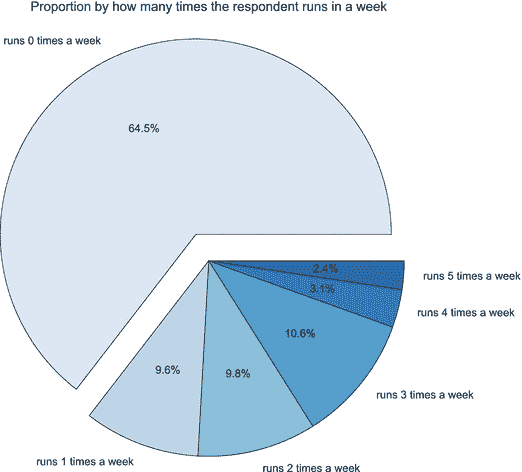

# 十六、令人鼓舞的问题

在这一章中，你将学习各种鼓励提问的方法。您将了解如何召开问题会议。接下来，您将探索不同类型的问题，以及如何使用问题板和问题树有效地显示和组织这些问题。最后，你将学习如何发现新问题，我们将在第 [17](17.html) 章中详细介绍。

## 运行问题会议

提问和学习是数据科学和团队只看数据的关键区别。请记住，数据科学是关于使用科学方法来获得洞察力。提出好的问题是这种科学方法的核心。

正如我们在本书中所讨论的，组织通常将问题视为一种判断，而不是一种学习的方式。作为数据科学团队的领导者，你需要确保你的团队提出好的问题。你要做到这一点，最好的方法之一就是建立一个良好的交流思想的环境。

研究负责人是提问负责人，他确保团队提出好的问题。研究负责人也应该关注学习而不是判断。团队中的每个人都应该努力做到深度倾听，这是一种更专注的方式来倾听对方的想法，并且能够在不感到被评判的情况下反击这些想法。

建立这种环境的一个好方法是召开问题会议。在这些会议上，鼓励与会者在发言前提问。这有时被称为问题优先的方法。这些会议是关于创造最大数量的问题。他们专注于每个人的提问和倾听。如果你是研究负责人，不要让任何人带着智能手机或笔记本电脑。你希望每个人都专注于倾听。

我曾经为一个刚开始研究数据科学的组织工作过。该团队正在开会预测将有多少人参与医学研究。数据分析师展示了他们过去研究的图表，并表示他可以创建一个数据模型来预测谁可能会参与。有一段短暂的沉默，然后会议结束了。一个星期后，团队又聚在了一起。数据分析师提交了一份显示历史数据的报告，这些数据表明每个研究可能都有一定数量的参与者。

现在，想象一下，如果这个会议集中在好的问题上。如果你是研究负责人，你可以这样开始会议:“每个人都知道我们为什么要开这个会吗？”然后等待回应。一个好的问题领导者不害怕短暂的沉默。不要试图回答自己的问题。给房间里的每个人时间思考他们的答案。

一旦你对每个人都理解了会议内容感到满意，就提出挑战。你可以用这样的话来总结挑战，作为会议的开场白，“我们浪费了很多钱，因为我们不知道谁会参加我们的医学研究。”将解决方案留给团队的其他成员。你也可以用一些非常开放的话题作为开场白，比如“我们需要更好地预测谁会出现。”坐下来，等着看是否有人开始提问。如果几分钟后，没有人说什么，你可以问这样的问题，“每个人都明白为什么这是一个挑战吗？”

你希望从团队中得到的是类似这样的问题，“有些研究比其他研究填充得多吗？”这些类型的问题允许您的数据分析师为报告提供更完整、更有趣的数据。

你要避免的是会终止对话的快速陈述，例如，“我们应该做研究，看看我们的竞争对手是如何填满他们的医学研究的。”这使得人们无法想出他们最好的主意。请记住，讨论给你的团队带来了最大的价值。您希望团队在探索数据时感到舒适。

如果你是研究负责人，如果团队很难提出好的问题，不要太沮丧。大多数组织仍然觉得最好是一群知道事情的人(或者至少说得好像他们知道)。他们喜欢说话清晰的团队。这种清晰仍被视为比不知道更有价值。可能要开几次会，人们才会愿意问好问题。在你开了几次问题会议后，你可能会发现，一群提出尖锐问题的人通常会获得更深刻的见解。

## 识别问题类型

如果你开了一个有效的问题会议，你可能会得到很多好问题。太好了。请记住，您希望您的团队在找到几个想要进一步探索的问题之前淘金并通过几十个问题。就像早期淘金的矿工一样，你希望能够从沙子中挑出金子。你会想知道如何把好问题从那些你可以留下的问题中分离出来。

一个好的方法是考虑不同的问题类型。每种类型都有自己的优势和挑战。如果你是研究负责人，你可以帮助团队确定哪种问题类型会带来最有趣的见解。两种最常见的问题类型是开放式和封闭式。这些问题中的每一个都可以是一个基本的或非基本的问题。有些问题类型比其他类型更容易区分。

你能识别的第一种类型是开放性问题。开放性问题没有固定答案。想想跑鞋网站。您的数据科学团队可以提出一个开放式问题，例如，“谁是我们的理想客户？”一个开放的问题通常需要更多的讨论。这些都是你试图认同对方推理的问题。例如，团队中的某个人可能会说，理想的客户是购买大量跑鞋的人。团队中的另一个人可能会质疑这种推理，认为理想的客户是鼓励其他人购买跑鞋的人，或者是博客写手，或者是创办了跑步俱乐部的跑步者。

一个开放性的问题通常没有答案。相反有人认为。谁的推理最好，谁就能解决问题。您的数据科学团队将希望寻找谁是理想客户的最有力论据，然后数据分析师将尝试用数据来支持这一论据。

封闭式问题通常更具决定性。一个封闭的问题可能是这样的，“我们的跑步者的平均年龄是多少？”这类问题通常会有一些讨论。你的团队可能要考虑平均年龄相对于平均年龄的优势。他们也可能想质疑信息的价值。从这个问题中你还能得到什么问题？

如果你是研究负责人，确保团队没有问太多任何一类问题。问太多开放式问题，会让大家花太多时间提问，没有足够时间整理数据。太多的封闭式问题会导致团队花太多时间问小的、更容易证明的问题，而没有着眼于全局。

一旦你确定了你的问题是开放式的还是封闭式的，你就会想弄清楚你的问题是否重要。一个基本问题旨在激发团队进行深入讨论。这些问题在大多数组织中通常很难问。它们可以是简单的问题，比如“为什么人们从我们这里买跑鞋？”它们也可以更复杂，比如，“人们为什么要跑？”

基本问题通常是开放的，必须进行辩论。不应该有一个正确的答案。也可以有一个封闭的本质问题。团队可能会问这样的问题，“我们是否应该停止印刷目录，只通过网站销售鞋子？”封闭的本质问题很少。

正如你可能已经猜到的，还有许多不同类型的无关紧要的问题。一个无关紧要的问题并不是一件坏事。在你开始问一些重要的问题之前，你可能要经历许多不重要的问题。一个好的策略是问许多封闭的、不重要的问题，作为一种建立想法和问更大的重要问题的方法。

假设你想问人为什么要跑。你的科学团队可能想在第一个冲刺阶段解决一些不重要的问题。我们的顾客属于跑步俱乐部吗？我们的大多数客户是长期跑步者还是刚刚开始跑步？他们家还有其他人跑步吗？这些问题可能有助于你为你的顾客为什么喜欢跑步建立一个案例。如果你的团队对人们为什么喜欢跑步有充分的理由，这将有助于你推销你的产品来满足这些需求。

如果你是团队的研究负责人，请留意这些不同的问题类型。他们会帮助你引导讨论，整理出你最有价值的问题。如果你知道不同的类型，你更有可能找到能让你获得最佳洞察力的黄金。

## 组织你的问题

如果你是侦探剧的粉丝，你可能看过犯罪墙，当侦探试图找出一个未解之谜的所有不同部分时使用。他或她把图片和笔记贴在墙上，试图把不同的部分联系起来。板子变成了一个视觉故事。这就是为什么你会经常看到侦探坐在地板上盯着黑板，试图从数据中的所有小谜团中拼凑出故事。

您的数据科学团队将面临类似的挑战。他们会试着讲一个故事，但他们只有拼图的一部分。您的团队可以使用相同的技术创建一个问题板—一个他们可以看到所有问题和数据的地方。这样他们可以讲述一个更大的故事。

正如在第 [13](13.html) 章中提到的，创建一个问题板是展示想法并向你的团队和组织中的其他人征求问题的好方法。在黑板的最上面，你应该放一个简单的标识符，比如“问题板”或者“问一个问题”问题板是一种在一个地方交流和组织他们的清晰方式。

你的数据科学团队应该有几十甚至几百个不同的问题。问题板很可能是团队的一个关键会议点，也是团队成员和风险承担者讨论项目的一个好地方。

首先，将你的问题板放在团队成员的桌子旁边或走廊上。开放空间不适合做问题板。你会希望人们站在黑板旁边读问题。另一个建议是把广告牌放在人流量大的地方。理想的地方是靠近饮水机、小吃店或浴室。它应该是一个几个团队成员可以见面并且不会分散其他人注意力的地方。

通常，整理你的白板的最好方法是使用不同颜色的便利贴。你需要从上到下组织你的董事会。黑板上方的便笺包含了你的基本问题。对于这些问题，使用红色或粉红色的便利贴。在它们下面，你可以用黄色便利贴来写不重要的问题。请记住，这些问题是针对小问题的。它们通常是有正确答案的封闭式问题。最后，你可以使用白色或紫色的便利贴。这些是研究小组发现的可能有助于解决问题的小数据点。

拥有问题板有五大好处:

*   它为团队提供了一个共享空间，有助于他们的小组讨论。
*   它显示了问题是如何相互联系的。
*   它帮助你按类型组织你的问题。
*   它帮助你讲述一个故事。问题板显示了团队可能难以解决的更大的问题。
*   它给组织中的其他人一个参与的地方。你希望团队之外的人添加他们自己的问题，并看到你的进步。

请记住，您希望您的团队进行深入的讨论。每个人都应该能够质疑对方的推理。团队应该倾听彼此的问题，并尝试提出自己的问题。他们应该专注于学习，而不是判断他们问题的质量。

问题板有助于这一点，因为它为人们提供了一个集中讨论的地方。这也有助于团队站起来，亲自参与并提出新的想法。

你的许多问题将是相互关联的。通常，你会有一些重要的问题与几个封闭的、不重要的问题联系在一起。如果是在墙上，可以用细绳展示这些联系。如果是在白板上，你可以画不同颜色的线。这将有助于你的团队保持有组织性，甚至优先考虑他们最有价值的问题。

如第 [13](13.html) 章所述，问题板将邀请团队以外的其他人参与。你可能想在黑板旁边放一叠绿色的便利贴。留下标记和小纸条，邀请其他人添加他们自己的问题。有时候这些来自团队之外的问题讲述了最有趣的故事。

## 创建问题树

您的问题板将是传达您的数据科学故事的关键部分。它应该包括你的团队正在努力解决的问题。它也可能有一些数据提示一些答案。一个好的问题板鼓励组织的其他成员参与进来，并吸引人们成为你分享故事的一部分。

问题板的挑战之一是保持它的良好组织。因为它是为小组讨论而设计的，所以您希望每个人都能够共享相同的信息。它不应该有几组不同的一个人的笔记。如果每个小组只有一个人的想法，那么这个人将是唯一理解其含义的人。

相反，你所有的问题都应该用同一个系统来组织。最好的方法之一是创建问题树。问题树是一组与一个基本问题相关的便笺。你会想用最引人注目的颜色来回答基本问题。通常这不是红色就是粉色。

让我们为跑鞋网站设想一个问题板。你的团队提出的一个问题是，“我们的网站能帮助鼓励不跑步的人成为跑步者吗？”如果你是团队的研究负责人，你应该把这个重要的问题写在黑板最上方的红色贴纸上。

在这个基本问题下面，你可以开始添加其他问题。这可能是另一个基本问题，比如“是什么让人们跑步？”也可以是一个无关紧要的问题，比如“非跑步者会在我们的网站上购物吗？”由于这是一个封闭问题，您可以在黄色问题“粘滞”旁边放一点“粘滞数据”。也许类似于，“数据显示，我们 65%的客户在一周内都没有跑步。”你可以使用如图 [16-1](#Fig1) 所示的饼状图来说明这一点。

图 16-1。

Pie chart that shows how many times per week respondents run

假设生成的数据来自该公司对其客户进行的调查。问题是，“你平均每周跑步几次？”当你看数据时，你会发现大约 65%的受访者根本不跑步。55%的受访者每周跑步一次或多次。参见如何在 [`http://ds.tips/S3eve`](http://ds.tips/S3eve) 创建此图表。

查看问题树的人应该能够跟踪团队的思维过程。她应该看到下面的问题以一个开放式的基本问题开始(“我们的网站能帮助鼓励不跑步的人成为跑步者吗？”)并查看解决该问题的团队。她应该能一路追踪到不同的分支。

假设这个问题，“是什么让人们跑步？”向自己的方向分叉。在这个问题的下面是另一个问题，“他们跑步是为了减压吗？”下面是另一个问题，“压力大的不跑步的人能看到跑步的好处吗？”

有了问题树，研究主管现在就有了一份报告，向组织的其他人展示进展情况。她可以展示数据科学团队正在同时处理几个高价值的问题。不难看出，深入了解如何创造客户可能会增加收入。

问题树帮助研究主管将团队的工作与真正的商业价值联系起来。一个问题板应该有几个问题树。在黑板的最顶端，应该有几个红色或粉红色的基本问题。这些问题中的每一个都应该像一棵倒挂的树一样分支到其他几个问题中。如前所述，确保使用不同颜色的便笺条(重要问题用红色或粉色，不重要问题用黄色)。有时，开放式问题会分支成不同的问题树，您应该用显示数据的小便笺来结束封闭式问题。

和任何一棵树一样，你会想要修剪你的问题。这是研究主管的主要职责之一。她需要确保你的问题能带来真正的商业价值。如果她认为你的问题不会带来真知灼见，她可能想把它们从问题板上拿下来，这样数据分析师就不会开始搜索结果了。

Note

作为团队问题会议的一部分，研究负责人通常会删除问题。您不希望您的研究主管在没有与团队沟通变更的情况下，就将问题从白板上拿下来。

关于问题树的一个关键点是，它们实际上反映了大多数团队如何提出新问题。请记住，数据科学是使用科学的方法来探索您的数据，这意味着您的大部分数据科学将是经验性的。你的团队会问一些问题，收集数据，并通过问一系列问题对数据做出反应。当你使用问题树时，它反映了团队学到了什么。同时，它向组织的其他人展示你的进步。

## 发现新问题

有两种方法可以帮助你的团队找到更好的问题。其中之一是你组织中的某人在你的问题板上张贴了好问题。这些是你的“礼物问题”另一种方法是在与您的数据科学团队的定期会议中提出好的问题。

张贴在你的布告栏上的礼物问题很大程度上取决于你的组织。一些组织更具协作性。其他人更受控制。如果你的组织更加开放，你可能会被问题淹没，不得不优先考虑讨论。如果组织更谨慎，你可能几个星期看不到任何输入。

不管是哪种情况，填写问题板的最好方法就是让它看起来有吸引力。一个好方法是创建一个简单的询问问题的标志，例如“请向我们的数据科学团队提出任何问题。”另一种方法是将问题板整合到有趣的演示文稿中。

假设有人提出了这样一个问题，“怎样才能做出一双完美的跑鞋？”这是一个开放式的基本问题。如果你是研究负责人，你可以把这个问题复制到一个红色的便利贴上，然后把它放在你的问题树的顶端。在下一次演示中，请团队回答一些有趣的礼物问题，并讲述一个关于数据暗示的故事。他们想讲述一个关于完美跑鞋的故事。他们可能会谈论颜色、质量和风格的组合，并用简单的数据可视化来备份数据。接下来，让公司的其他人知道这个好故事是从哪里来的:张贴在公告板上的一个有趣的礼物问题。这种认可鼓励其他人参与。组织中的大多数人总是在寻找更好的参与方式。如果你能证明他们的问题很重要，你就能更容易地填满你的白板。

来自团队外部的问题是获得洞察力的好方法。这些问题通常简单明了，这通常使它们很难讨论。这些简单的问题往往最能质疑我们的假设。这就是为什么这些礼物问题可以让你的团队专注于商业价值。

可惜你的问题大多不是礼物。相反，它们是与您的数据科学团队的其他成员进行艰难讨论的结果。这些都是来之不易，难以创造的问题。

如果你是团队的研究负责人，尽你所能利用你的礼物问题。此外，与团队的其他成员一起努力工作，找出你将在第 [17](17.html) 章中看到的六个关键领域中的问题。您的问题越多，您的团队就越有可能找到关键的见解，并将其与真正的商业价值联系起来。

## 摘要

在本章中，您学习了各种鼓励提问的方法以及如何召开问题会议。接下来，您了解了不同类型的问题，以及如何使用问题板和问题树有效地显示和组织这些问题。最后，你简要学习了如何发现新问题，这将在第 [17](17.html) 章中详细介绍。