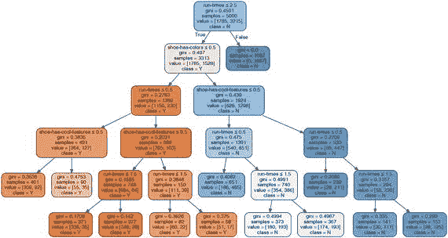
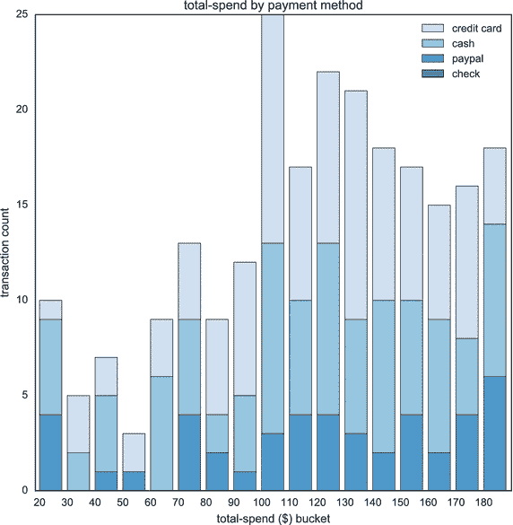
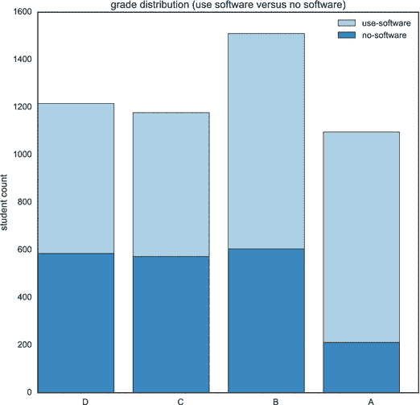
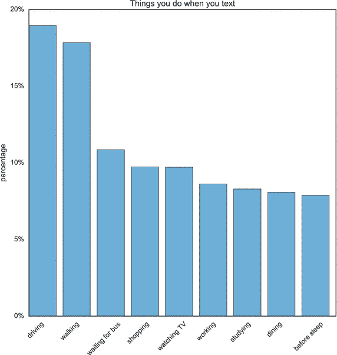
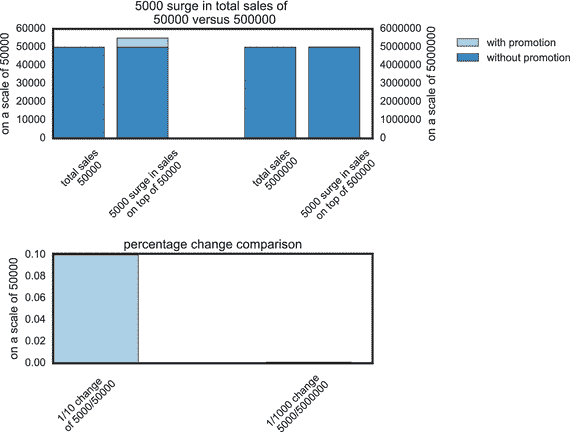
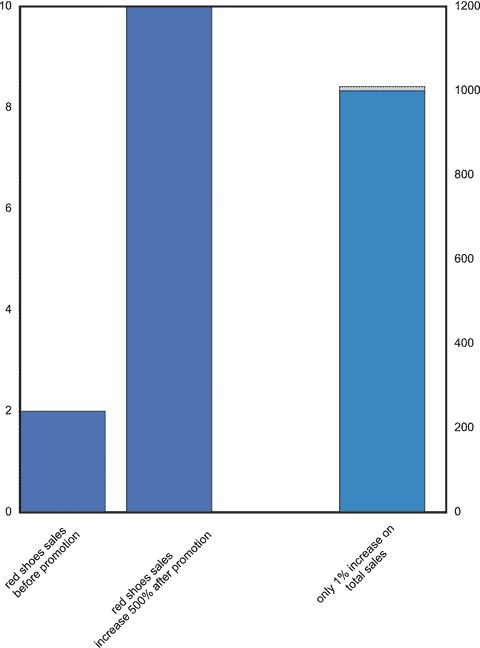
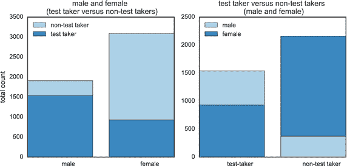

# 十七、寻找问题的地方

让团队提出好的问题通常不像创造合适的环境那么简单。即使是技术高超的数据科学团队也常常需要更多的指导。当您与您的团队会面时，您会希望将问题集中在六个关键领域。这些领域不是你能找到好问题的唯一地方，但它们通常是一个好的起点。这些问题是:

*   澄清关键术语
*   根除假设
*   查找错误
*   查看其他原因
*   揭露误导性的统计数据
*   突出显示缺少的数据

这六个领域都有自己的提问风格。当你问一些根除假设的问题时，它们与关于误导性统计的问题有很大不同。这些领域中的每一个都让团队走上了不同的道路，每一个都将在接下来的章节中详细讨论。

这六个方面旨在作为指南。不是所有的问题都会涵盖这六个方面。相反，你应该这样想:如果你讨论这六个方面，你肯定会提出至少几个问题。这些问题将成为推动您的数据科学团队的动力。在每个冲刺阶段，你的团队将努力解决或重新排列你的问题板上的问题。

## 澄清关键术语

乔治·卡林曾开玩笑说，他把一美元放进找零机，结果什么也没变。这让你想知道他希望什么样的改变。你永远不会知道，因为他用的词有几种不同的意思。不幸的是，英语中的许多单词都是如此。我们使用单词的上下文对它们的意思有很大的影响。这就是为什么查看关键词和短语是收集有趣问题的最佳方式之一。

数据科学讨论应该运用批判性思维。你需要仔细看对方的推理，然后质疑对方的推理，这样你才能更好的理解大家的想法。最好的方法之一是质疑关键术语和短语。

所以让我们回到跑鞋网站。假设数据科学团队中有人提出了一个有趣的问题:“人们经常跑步是因为这会让他们更快乐吗？”这是一个开放式的基本问题，这意味着可能不会有是或否的答案。相反，该团队将不得不提出有数据支持的有力论据。

数据科学团队应该质疑哪些关键术语和短语？想想那些可能有歧义或多重含义的词。这些词通常是抽象的，可以有多种解释。在这种情况下，有几个词你可能想探究一下:“经常”和“更快乐”

想想“经常”这个词。这个词对你来说意味着什么？意思通常取决于人。例如，我的妻子喜欢去餐馆。我们尽量每周至少去一次。如果你问我，我会说我们经常去餐馆。如果你问她，她会说我们从不去餐馆。

您的数据科学团队应该提问，以澄清“经常”一词的含义你可能想问一个封闭的问题，比如“我们的普通顾客每周跑几次？”然后把这个问题放在你的问题树上的前一个问题下面。

你也应该探索“更快乐”这个词。“更快乐”这个词对你来说意味着什么？你的顾客跑步是因为他们喜欢跑步吗？也许他们真的喜欢跑步，当他们跑步回家时，他们最开心。也许他们不喜欢跑步，但这是他们知道的唯一缓解压力的方法。从某种意义上说，他们更乐于跑步。

这是你可以进一步提问的另一个领域。你可以问一个宽泛的基本问题，比如“什么能让我们的客户快乐？”你也可以试着把快乐分成几部分。也许可以问这样一个问题，“我们的客户跑步是因为他们觉得他们必须跑步吗？”你甚至可以更具体地问:“我们的顾客在跑完步后最开心吗？”

现在你看到了询问关键短语和单词是如何快速产生更多问题的。请记住，在你的团队参加问题会议时，寻找答案是研究负责人的工作。仅仅因为你的数据科学团队问了这些问题，并不意味着他们有义务坚持到底。研究负责人是倾听这些问题并挑选出听起来最有趣的金块的人。

带着这个问题(人们经常跑步是因为跑步让他们更快乐吗？)，你现在有五六个其他可能更有趣的问题。您的团队正在询问可能与业务价值相关的基本开放式问题。

想想这个基本的、开放式的问题，“什么让我们的客户快乐？”这个问题可能看起来很简单，几乎微不足道，但是如果您的数据科学团队能够获得一些洞察力，这将会带来真正的商业价值。见解是您的数据科学团队将提供的金块。然而，许多数据科学团队并不追求这样的问题，因为他们觉得这些“关键术语”是显而易见的。请记住，对您来说显而易见的事情可能对其他人来说并不明显，所以请花时间问这些问题，这样您就可以让您的数据科学团队更有效率和洞察力。

## 根除假设

找到好问题的另一个方法是寻找隐藏的假设。人们一直在做隐藏的假设。假设没有错。事实上，你需要他们富有成效。你认为你的同事工作出色。一般来说，人们会认为你说的是实话。你不想为了完成某件事而事后批评每件事。

你需要注意的是那些可能导致盲点的假设。这些假设让你无法探索有趣的问题，并导致你的团队参与集体思维。在您的数据科学团队中尤其如此，这就是为什么获得新问题的最佳方式之一是查看潜在的假设。

一般来说，假设有四个特征:

*   它们通常是隐藏的或未声明的。很少有人以这样的话开始句子:“如果我们假设这是真的……”
*   它们通常被认为是理所当然的，或者被视为“常识”
*   它们对于决定你的推理或结论是必不可少的。你的推理甚至可能依赖于假设。
*   它们可能具有欺骗性。通常，有缺陷的推理被常识性的假设所掩盖。比如，“糖对你不好，所以人工甜味剂肯定对你有好处。”

我曾经为一个组织工作，该组织检查了它的客户服务数据，并意识到它有很高比例的人打电话订购产品。数据科学团队的任务是试图改变这种行为，因为维护呼叫中心的成本很高。该公司希望鼓励客户使用网站或手机应用程序。

研究负责人以问一些有趣的问题开始。为什么有人打电话进来？我们能做些什么来使我们的网站更容易被客户使用？我们如何让更多的客户使用我们的移动应用？为什么顾客更喜欢和一个人说话？

其中一些问题有潜在的假设。研究负责人认为，人们打电话进来是因为他们不喜欢这个网站，而且客户没有安装移动应用程序。这个推理可能对，也可能不对。重要的是不要假设他们是对的。如果团队从表面上接受这种推理，他们可能会错过发现关键见解的机会。在这种情况下，大多数打电话进来的人都是在工作网站上工作的专业人士，他们无法使用智能手机或访问网络。

团队可能寻找假设的另一个领域是当他们试图预测未来行为时。假设我们的跑鞋网站想要使用预测分析来确定哪双鞋最成功。也许他们发现非常鲜艳的鞋子在过去做得很好。他们创建了一个模型，预测一双色彩鲜艳的鞋子会更成功，如图 [17-1](#Fig1) 所示。

图 17-1。

How customers decide which shoe to buy

您创建的调查包含以下变量:

1.一周跑几次？

2.鞋子有很酷的特点吗？

3.鞋子有很多颜色吗？

4.被告是否购买了鞋子？

第四个特征用作决策树预测的因变量。参见如何在 [`http://ds.tips/fuJE3`](http://ds.tips/fuJE3) 创建此图表。

解决这一假设的一个好方法是尝试首先确定推理。在这里，理由是彩色跑鞋在过去做得很好。一旦你有了这个推理，你就可以开始考虑假设了。

其中一个假设是，跑鞋之所以成功，是因为它色彩鲜艳。记住相关性并不一定意味着因果关系。可能高质量的厂商一直在努力让自己的鞋子颜色更鲜艳，也就是说跑者买的是高质量的鞋子，只是碰巧颜色鲜艳而已。这些假设中的一些可以通过几个小心的问题来强调。一些简单的问题，比如，“顾客买跑鞋是因为它们色彩鲜艳还是其他什么原因？”

重要的是要记住，假设没有好坏之分。搞清楚他们都是对是错，并不坏，甚至很关键。关键是要集中精力确定他们在哪里。一个被接受为事实的假设可能会引起连锁反应，导致错误的推理。还要记住，假设并不总是需要纠正的错误。这更像是一条探索之路。

假设面临的主要挑战是，如果你不把它们公之于众，它们就会堆积起来。在你意识到这一点之前，你的团队可能已经在研究一堆薄弱的假设了。当这种情况发生时，很难有有趣的发现。

## 查找错误

数据中的错误不一定会引起最大的麻烦。在数据科学团队中，更大的问题是团队推理中的错误。数据中的一个错误可能是一个挫折或产生一系列虚假报告。另一方面，推理中的错误可能会将团队引向完全不同的方向。整个团队可能会花几周甚至几个月的时间在错误的地方寻找，让团队问不出有趣的问题。

你已经看到了收集好问题就像淘金一样。在进入有趣的话题之前，你可以先思考几个糟糕的问题。你可能需要澄清一些关键的短语和语言。还有一些假设可能把不正确的推理粘在看似正确的结论上。一旦你剥开这些假设，理清语言，你就只剩下简单的推理了。从很多方面来说，你在问一个更难的问题，“这个推理正确吗？”

总的来说，当你质疑别人的推理时，有七种危险你要小心:

1.  人身攻击:在你的数据科学团队中，如果有人说“你不理解数据”，你可能会看到这种情况这可能是真的，但这不是一个建设性的方式来驳回别人的问题。
2.  问题驳回:你不想驳回一个有趣的问题，因为它可能会导致不舒服的问题。您不希望您的数据科学团队说类似“问这个问题的组织政治是什么？”
3.  快速共识:这有时被称为广告大众推理。它与群体思维密切相关，并基于一个有缺陷的推理，即如果每个人都很快同意，他们就一定是对的。
4.  依赖可疑权威的推理:你有时会在经典案例中看到这种情况，“我在互联网上看到了这个图表，所以它肯定是正确的。”
5.  循环的，或巧妙的推理:有时你会在数据科学团队中看到这种情况。你会听到这样的话，“我们是一家数据驱动的公司，所以我们的数据必须是正确的。”
6.  稻草人推理:这是指你故意歪曲别人的理由，以此来让自己的理由看起来正确。你经常可以识别这一点，因为有人会叫出某人的名字。类似这样的话，“如果你接受了比尔关于数据很糟糕的说法，我们就得从头开始。”
7.  错误的二分法:这有时会对好问题产生寒蝉效应。它基于只有两种可能结果的想法。你可能会听到这样的话，“如果数据是正确的，那就意味着我们都错了。”

将这七种危险视为保持你的问题会议富有成效的指南。这些都可能导致你的团队出现软推理和浅问题。

我曾经与一个数据科学团队合作开发一个州教育部测试应用程序。他们想看看是否可以使用预测分析来确定哪些学生可能需要额外的帮助。该团队有万亿字节的测试信息，但他们很难创建一个工作模型。

在提问会上，一名团队成员问道:“这些测试在评估学生的知识方面做得好吗？”另一个人回答说，“这些是国家标准，我们不是教育者，所以我们应该接受这些数据是正确的。此外，如果它不正确，你就不能使用任何数据。”

这些声明很快结束了讨论。如果团队探索了这些问题，情况会好得多。相反，他们依赖于危险的推理。国家标准可能来自可疑的权威。这种针对个人的攻击假设房间里没有人知道足够的信息来提问。最后，有一个错误的二分法，即数据要么全是好的，要么全是坏的。

在你的团队的问题会议上要小心这些危险。拥有所有的答案并不重要。重要的是识别软推理。你不希望软推理代替有趣的问题。

## 质疑证据

正如我们在本书中提到的，找到有趣问题的最好方法之一是寻找假设。我们也研究了错误推理的危险。当你在寻找好问题时，推理中的错误会产生寒蝉效应。一旦发现推理中的错误，您的数据科学团队就可以考虑对可能被认为理所当然的事实提出关键问题。

许多组织依赖广为接受的事实作为日常工作的一部分。当您与您的数据科学团队合作时，这些事实将成为背景。关键是在问有趣的问题时，要确保事实不是禁区。事实上，您的数据科学团队可能是组织中唯一对质疑既定事实感兴趣的团队之一。

当你在数据科学团队时，每次遇到事实，你应该从三个问题开始:

*   我们应该相信吗？
*   有证据支持吗？证据是公认的数据，可以用来证明一些更大的事实。如果有证据，你应该问第三个问题。
*   证据有多充分，是否支持事实？

你不应该认为证据是证明或否定事实。相反，试着把它想成是有力或无力的证据。有强有力的证据表明吃太多的糖对你的健康有害。没有足够的证据表明蜂蜜比糖更健康。当你看证据时，你所做的只是决定你是否可以依赖事实。在这种特殊情况下，你可能要减少糖的摄入量。你不想用蜂蜜代替你的糖罐。

当你在数据科学团队工作时，你会看到各种公认的事实。他们中的每一个都可能有不同的证据来源，这都能引出有趣的问题。一些最常见的证据是直觉、个人经历、例子、专家意见、类比甚至研究。

当你看到一个有证据支持的事实时，不要试图把它看作一个停止信号。相反，把事实看做一个可能有一段时间没有被探索过的布满灰尘的走廊。可能会有新的东西来支持你的既定事实。你也可能会发现根本没有证据，事实只是一个未经验证的假设。

我曾经在一家公司工作，该公司有一个数据科学团队在处理一组信用卡交易。该公司的人员将信用卡数据视为向银行客户提供促销的一种方式。他们对顾客的信用卡购买了解得越多，他们就越有针对性地进行促销。

数据科学团队与业务部门的某人合作，试图改进该模型。该团队开始对某个品牌的信用卡进行新的促销活动。业务部门的利益相关者说，他们不应该使用那种特定类型的信用卡来进行实验，因为使用那种信用卡的大多数客户只在大额购买时使用它。数据科学团队问这个人是怎么知道这个事实的。利益相关者说她已经“这样做了很多年”，这是她的直觉。

会后，数据科学团队决定测试经理的直觉。他们在问题板上创造了新的问题。其中一个问题是，“顾客只在大额购物时使用这种信用卡吗？”事实证明，经理是对的。有非常有力的证据表明，该品牌的信用卡主要用于大额购买，如图 [17-2](#Fig2) 所示。数据科学团队以更有力的证据支持了经理的直觉，并以交易历史和购买价格为依据。

图 17-2。

Total spend by payment meathod

如果您查看每个交易值时段的计数，随着总金额变高，更多的交易是通过信用卡支付的；第二类是现金。参见如何在 [`http://ds.tips/br5wR`](http://ds.tips/br5wR) 创建此图表。

当你参加问题会议时，你也想评估来自其他团队成员的证据。直觉没有错。通常，直觉可能是伟大发现的开始。然而，并不是团队中的每个人都有相同的直觉。对于每个团队成员在数据中看到的内容，可能会有一些分歧。当这种情况发生时，一起努力看看彼此的证据。询问为什么一个人的直觉可能比另一个人的更准确。也许他们有更多的经验，或者在过去从事过类似的项目。

请记住，事实并不总是刻在大理石上的。事实会随着证据变强或变弱而改变。当你在数据科学团队工作时，不要害怕质疑证据。通常，它会成为新见解的来源。

## 看到对立的原因

很容易说相关性并不意味着因果关系。在实践中并不总是容易看到。通常，你会看到因果关系，没有理由去质疑它们之间的联系。有时很难看出事情发生后的结果和因为事情而发生的结果是不同的。你会在工作和生活中看到这一点。

我和妻子决定，我们不想为我们的房子买一台游戏机。相反，我们和儿子达成了妥协。我们让祖父母在他们的房子里有一个视频控制台。这样，每次我们去看他的时候，我们的儿子都可以看到爷爷奶奶，玩他的新游戏。每次我们去看他，我们都会给儿子买一个新游戏。它会在我们离开前寄到。我们的儿子相信我们买了一个新游戏，然后马上飞到奶奶家让他玩。这是非常清楚的因果关系。

视频游戏的出现实际上是一个对立的原因。比赛到了，我们收拾行李。不过，这不是真正的原因。真正的原因是我们有去看奶奶的票，所以我们买了一个新游戏。

这些对立的原因并不总是容易被发现。有三样东西需要寻找:

*   原因是否真的有意义:有许多对立的原因。进口柠檬和交通事故的减少是有联系的。冰淇淋和鲨鱼袭击之间也有联系。尽管如此，这些联系没有任何意义。柠檬不会让人成为更好的司机，鲨鱼也不吃冰淇淋。你的大部分竞争原因不会那么明显。一定要检查因果关系的证据。
*   原因是否与其他影响一致:你可能会发现买跑鞋和天气变暖之间的联系。这意味着如果你发现跑步短裤和温暖天气之间的联系，它可能是一个实际的原因。几个一致的原因使你更有可能在寻找一个真正的原因。
*   这一事件是否可以用其他对立的原因来解释:也许跑鞋的购买在温暖的天气里会增加，因为它们在夏天比较便宜。如果你能想出其他几个对立的原因，很可能你没有看到真正的原因。

当你在一个数据科学团队工作时，要时刻注意竞争对手。

我曾经为一个州教育部的数据科学团队工作过。该团队正在创建一个应用程序来更好地理解学生评估数据。数据显示，当学生使用软件程序进行评估(而不是书面评估)时，他们获得了更好的分数，如图 [17-3](#Fig3) 所示。这使得软件看起来非常有效。仅仅是使用计算机进行测试的行为就提高了学生的知识水平。

图 17-3。

Grade distribution, software vs. no software

从总体分布来看，大多数学生得了 B，很少学生得了 A。然而，在没有软件的情况下，几乎有 50%的学生获得 C 或 D，而对于获得 B 尤其是 A 的学生来说，更多的学生使用了软件。参见如何在 [`http://ds.tips/fRa5r`](http://ds.tips/fRa5r) 创建此图表。

这是一个伟大的软件营销。如果你使用它，它会增加你的分数。实际上，这没有多大意义。数据科学团队并不只是盲目接受这种因果关系。为什么从纸质考试转向在线考试会增加学生的学习？为什么他们的进步没有随着他们继续使用软件而增加？这一数据具有竞争原因的特征。

在一次提问会上，研究负责人提出了这个问题。她问了这个问题，“为什么我们的学生取得了更高的分数？”数据科学团队试图通过想象对立的原因来打破这个问题。他们问了几个有趣的问题。“当他们开始使用该软件时，还发生了哪些变化？”以及“有没有学生没有这种进步？”

事实证明，考试成绩的跃升有一个对立的原因，而且有更有力的证据证明真正的原因。事实证明，许多使用这种软件的学校都得到了州政府的拨款来改善他们的硬件。每个教室都得到了一打新电脑，作为鼓励学校使用新软件的一种方式。这些电脑让学生更频繁地参加考试，他们对问题变得更熟悉，他们的考试成绩也提高了。

当你在数据科学团队工作时，不要害怕质疑因果之间的联系。团队应该准备好创造对立的原因来解释某些事件。如果它们有意义，你应该调查一下它们之间的联系。你的一些最好的问题可能来自于排除这些对立的原因并找到一个真正的原因。

## 揭露误导性的统计数据

你可能会发现很多问题的一个领域是在看统计数据的时候。如你所见，统计数据不能代替事实。统计数据可能会说谎。事实上，很多统计数据都是骗人的。至少，他们说出了自己的真相。

当你在一个问题会议上，你的团队应该仔细评估统计数据。他们应该互相质疑，对团队之外的统计数据持怀疑态度。

在第 4 章中，你看到了计算平均值的挑战(政客的例子)。统计平均值可能给你一个答案，中位数可能给你一个不同的答案。通常，人们更喜欢其中的一个，这取决于他们想看什么。然而，还有许多其他的方式，你可以用统计数据撒谎。其中一些更难以捉摸。你必须仔细听才能注意到手法的巧妙。

其中之一是推断统计。当你用一个故事建立一个统计上的联系，然后你把这个联系和另一个故事联系起来。例如，假设一项研究表明，20%的时间里，人们一边开车一边发短信，如图 [17-4](#Fig4) 所示。一家试图销售汽车保险的公司可能会推出一则广告，上面写着:“五分之一的人在开车时发短信。确保你有好的保险。”

图 17-4。

Things people doing while they text

根据这项研究，几乎 20%的时间，人们在开车时发短信。发短信时第二高的活动是走路。参见如何在 [`http://ds.tips/f2asP`](http://ds.tips/f2asP) 创建此图表。

注意手法的变化。一项统计数据讲述了一个关于短信的故事:大约 20%的时间，人们在发短信和开车。保险故事是关于一群人的。大约 20%的人在做一些事情。也许很少有司机发短信，但他们经常发短信，这会影响数据。你可能会在开车的时候发 20%的短信，但这并不意味着 20%的人边开车边发短信。一个普通人一天中可能有 5%的时间在吸烟。这并不意味着 5%的人吸烟。保险公司试图告诉我们的故事是关于安全的。它试图给人一种印象，即每个人都因发短信而分心。这些短信让驾驶变得更加危险。

让我们回到我们的跑鞋网站。想象一下，数据科学团队中的某个人强烈感觉到数据显示人们正在和朋友一起跑步，这支持创建一个新的推广。数据分析师制作了一份统计数据，显示 50%的客户将优惠券转发给他们的朋友，并勾选了将他们视为朋友的复选框。他建议多达一半的顾客和他们的朋友一起跑步。他认为，数据科学团队应该探索一个具有更多社交互动的网站是否能促进销售。乍一看，这听起来很有道理。这里真正发生的是，你团队中的这个人试图创建统计推断。

解决这个问题的最好方法是把统计数据和故事分开。对于一个跑鞋网站，你有两个故事:一个说顾客喜欢他们的朋友省钱，另一个说顾客和他们的朋友一起跑步。当你把它们看作两个独立的故事时，就更容易看出可能存在脱节。你可能想问你团队中的人几个问题。省钱和和朋友一起跑步有什么联系？有哪些统计数据可以显示有多少顾客和朋友一起跑步？这里有什么联系吗？

统计推断是提出有趣问题的一个很好的工具。只有当团队认为它们是事实时，它们才是危险的。它们可能是一些有趣的东西的影子，但它们不应该被当作证据。

您可能会看到误导性统计数据的另一个领域是当存在可疑的遗漏时。一个地方你可能会看到这是与规模的措施。想象一下，你的数据科学团队中的某个人使用了这样的统计数据:一次促销活动增加了 5000 个订单的鞋子销量，如图 [17-5](#Fig5) 所示。这听起来可能令人印象深刻。唯一缺少的是尺度的测量。你需要问一个关键问题。该网站通常每月有多少订单？如果是 50，000，这是一个很好的论据，证明你有一次成功的晋升。如果是 500 万，可能影响不大。

图 17-5。

Comparing 5,000 surge on a base of 50,000 versus 5,000,000

在上面的图表中，你几乎注意不到 500 万基数的激增。同样，如果你看看下面图表中的百分比变化，在 500 万的基础上增加 5000 几乎是不明显的。参见如何在 [`http://ds.tips/tRab2`](http://ds.tips/tRab2) 创建此图表。

你也会看到百分比。也许团队中有人说红鞋销量上升了 500%，如图 [17-6](#Fig6) 所示。这是相当令人印象深刻的，当然，除非她从销售两个订单的红色鞋子到十二个。

图 17-6。

Red shoe sales went up by 500%

促销后，红色鞋子的销量可能会增加 500%；然而，你应该假设总销售额是每天 1000，这只是 1%的增长。参见如何在 [`http://ds.tips/5ugEc`](http://ds.tips/5ugEc) 创建此图表。

当你在数据科学团队工作时，注意不要把统计数据当成事实。有几种常见的方法可以让统计数据看起来像在讲述一个有趣的故事。你的团队需要提出关键问题，然后提出一些更有趣的问题，以获得更好的见解。

## 突出显示丢失的数据

问好问题的最好方法之一是检查缺失的信息。一点点缺失的信息可以极大地改变故事。有时数据不完整。其他时候，这个人故意省略信息，因为它讲述了一个不同的故事。你在广告中经常看到这种情况。

拿一个很普通的广告来说。你可能听说过一个流行的说法，五分之四的牙医向嚼口香糖的病人推荐无糖口香糖。这似乎是一种非常强烈的支持。然而有一点信息丢失了。一个恰当的问题可以改变整个故事。关于口香糖，牙医一般会告诉他们的病人什么？也许 100%的牙医告诉他们的病人永远不要嚼口香糖。在这些患者中，可能有 10%的人坚持说他们无法放弃这个习惯。

因此，对于这 10%，大多数牙医说，如果你坚持嚼口香糖，确保它是无糖的。如你所见，这是一个完全不同的故事。没有广告商会说，“100%的牙医说不要嚼口香糖，但是对于那些嚼口香糖的人来说，试试无糖的。”

在您的数据科学团队中，您将经常寻找缺失的信息。你会希望留意重要的信息，这意味着它将重塑你的推理。你可以随时询问更多的信息。真正的问题是缺少什么信息来重塑这个故事。你甚至可能会以讲述一个与原著大相径庭的故事而告终。

我曾经为一个组织工作，该组织试图找出为什么参与医学研究的男性多于女性。他们从实验室得到一份报告，称男性参与医学研究的可能性增加了 60%，如图 [17-7](#Fig7) 所示。数据科学团队的任务是试图找出为什么会出现这种情况。当数据科学团队查看这份报告时，他们问道:“我们遗漏了哪些重要信息？”有几条信息可能会有所帮助。他们还问，“他们有 60%的可能性参与其中，这意味着什么？”这是否意味着同等数量的男性和女性申请，但更多的男性接受了这项研究？也许接受的男性和女性人数相等，但实际上有更多的男性参与。

图 17-7。

Test takers and non-test takers—male and female

你可以用两种方式转动桌子。左边是男性和女性。大约 80%的男性是考生，而女性只有 30%。右边是考生和非考生。60%的考生是男性，而只有 15%的非考生是男性。参见如何在 [`http://ds.tips/6Wewr`](http://ds.tips/6Wewr) 创建此图表。

了解这些信息将会讲述一个完全不同的故事。其中一个讲述了更多男人被接受的故事。另一个故事讲述了更多的男人出现。

当你寻找丢失的信息时，你可以尝试一些方法。你应该做的第一件事是试图理解信息可能丢失的原因。也许有空间或时间的限制。给你信息的人可能不太了解这个话题。也许这个人有美化信息的动机。如果是这种情况，你可能会多花一点力气去寻找丢失的信息。

另一件你应该注意的事情是当这些数字被比较形容词包围时——比如快 60%、大 20%或瘦 30%。通常，这些短语有重要的遗漏信息，从中你可以引出一些有趣的后续问题，比如比什么更快、更好、更瘦？

最后，一个很好的方法来看看你是否有遗漏的信息，那就是试着采取消极的观点。为什么参与医学研究的男性比女性多很重要？让更多的女性参与进来有好处吗？

事实证明，这最后一个问题帮助团队找到了缺失的信息。让更多女性参与的好处是年轻女性更有可能服用处方药，这使得研究更加全面。他们可以测试更多的药物相互作用。

这个好处是问题的另一面。女性更难参与，因为她们可能服用了研究中不允许的处方。更好的表述这个统计数据的方式应该是，“60%被允许参与医学研究的人是男性。”这讲述了一个完全不同的故事。

当你在一个数据科学团队工作时，试着总是努力寻找丢失的信息。这些重要的信息可能包含数据告诉你的真实故事。

## 摘要

在本章中，您了解了在与数据科学团队会面时应关注的六个关键领域。您需要关注具有以下特点的问题:

*   澄清关键术语
*   根除假设
*   查找错误
*   查看其他原因
*   揭露误导性的统计数据
*   突出显示缺少的数据

您了解到，并非所有的问题都会涵盖这六个方面，但如果您关注这些方面，您的团队肯定会提出至少几个问题。在第 [18](18.html) 章中，你将学习如何避免当你试图问一些很棒的问题时可能出现的陷阱。

Footnotes [1](#Fn1_source)

乔治·卡林，《大脑排泄物》(美国:亥伯龙出版社，1998 年)。