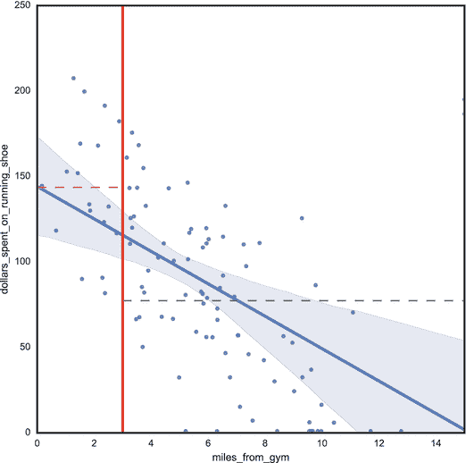

# 二十、理解故事结构

讲故事不仅仅是对发生的事情的简短描述。如果你告诉某人你去杂货店买了一加仑牛奶，你不是在讲故事。故事有着复杂而一致的结构。需要有冲突和情节。在这一章中，我们将谈论一个典型故事的要素。你可以用这些元素来编织一些东西，抓住你的观众的想象力。光描述数据是不够的。一个复杂的数据科学故事必须展示洞察力的重要性。您还会发现，您的许多数据科学故事将遵循类似的情节。当你看到这些模式时，你可以用一种方式来组织你的故事，这种方式将帮助你的观众从你的团队的洞察力中提取意义。

## 使用故事结构

您已经看到了如何将不同的线索编织成一个故事。你也可以用不同的技巧来吸引你的观众。现在，让我们来看看将所有这些整合到一个更大的结构中的不同方法。

您的数据科学故事应该有三个阶段:开始、中间和结束。你应该利用这些阶段来帮助观众找到你故事的意义。在每个阶段，你都想做一些不同的事情。

在第一阶段，与你的观众一起建立环境。第二阶段应该引入冲突。然后，你应该通过创造一些动作来结束故事。也许你解决了冲突，也许人物从斗争中学到了什么。

### 设置上下文

背景是你设置场景和角色的地方，介绍他们并把他们放在时间和空间中。您希望尽快建立上下文。许多人花太长时间来设置上下文。你应该花足够的时间来介绍角色并把他们放在某个场景中。

例如，假设你的研究负责人正在讲故事。她以设置上下文开始。她开始说道，“我们一直在密切关注在我们网站上购买鞋子的顾客。我们可以看到他们住在哪里，并将其与他们买鞋的频率联系起来。”这就建立了一个背景:购买跑鞋的顾客，与他们的居住地相关联。

### 引入冲突

中间，开始说冲突。实际上，冲突是故事中最令人难忘的部分。前一个例子中的研究负责人可能会说，“居住在城市地区的顾客更有可能购买跑鞋。事实上，人口越密集的地区，他们购买跑鞋的频率越高。我们觉得这很奇怪。作为跑步者，我们并不喜欢在人口密集的地方跑步。大型车辆太多，车流量太大。所以我们决定进行一些实验。”

冲突是你吸引观众的地方。他们可能已经在想这是意料之外的。研究负责人用个人轶事来激发他们的好奇心，他们甚至可能会提出自己的理论。也许他们认为这是因为顾客更年轻，或者他们住得离大公园更近？

接下来，研究负责人想要创造一些行动。这是她通过解释冲突的解决方案来解决冲突的地方，她在哪里寻找数据，以及她发现了什么。她应该稍微谈一谈所采取的行动，但同时不要过多地解释细节。她可能会说，“我们做了一个实验来观察他们的年龄。这些客户往往更年轻，但一旦我们进行了调整，仍然存在相当大的差异。我们还看了一些地图，在这些地图上我们有很多活跃的客户。我们想看看是否有更多的跑步路径。事实证明，一般来说，城外有更好的路。"

现在，研究的领先将观众吸引到这场斗争中。她不想花太多时间谈论所有的实验。与此同时，她仍然想刺激他们的好奇心，甚至可能建立一些期望。

Note

在本章的后半部分，你会发现更多关于如何表达冲突的内容。

### 结束故事

在故事的结尾，她说了这样的话，“事实证明，我们发现的最强的联系是，如果顾客住在健身房三英里以内，他们更有可能购买跑鞋。”这就是你在图 [20-1](#Fig1) 中看到的。

图 20-1。

Customers who live near a gym

橙色虚线表示住在离健身房不到三英里的顾客在跑鞋上的平均花费，灰色虚线表示住在离健身房三英里以上的顾客在跑鞋上的平均花费。这两个变量之间有明显的负相关性。参见如何在 [`http://ds.tips/pUhe3`](http://ds.tips/pUhe3) 创建此图表。

她以一个小插曲结束，说道:“想象一下我们的客户住在体育馆附近。他在室内跑步，并且一直在寻找保持身材的新方法。光是在健身房旁边，就足以让他买更多的跑鞋。”

她通过引入新的见解结束了这个故事。也许她甚至会问观众是否有任何问题，并利用这些问题为下一次讲故事提出一系列新问题。

给你的故事一些结构可以帮助你的观众从你的故事中获得意义。记住，你要把最大的努力放在故事的中间。观众最有可能记住这场冲突。然后你可以用一个行动项目结束，甚至获得更多问题以获得更深入的见解。

## 介绍剧情

在上一节中，您了解了故事中基本上有三个阶段(背景、冲突和结尾)。在上下文和冲突之间，你需要包含一个情节。人物和情节使这个故事令人难忘。例如，在莎士比亚的《罗密欧与朱丽叶》中，罗密欧和朱丽叶是人物，他们的爱情是情节的一部分。他们的心碎和死亡是剧情的最后一块(抱歉剧透)。

在数据科学中，情节是你讲故事的主要部分。这是数据所说的和你对数据含义的解释。你的故事情节不一定要新颖才有意思。是你如何在上下文中把情节和人物编织在一起，让你的故事变得有趣。

在克里斯托弗·布克的《七个基本情节》中， [1](#Fn1) 他认为所有的故事都只有几个情节。他说人类在听故事时有非常相似的心理需求。不是每个人都同意这对于文学来说是正确的，但是对于数据科学故事来说几乎肯定是这样的。你的观众只会寻找一些不同类型的情节。

布克的七个情节是:

*   白手起家
*   战胜怪物
*   探索
*   航行和返回
*   喜剧
*   悲剧与重生

在讲述您的数据科学故事时，请记住这些情节。这些图有助于准确定义你想要传达的内容。数据喜剧不太可能受到观众的欢迎，但其他六个情节只需要稍加调整就可以应用到你的讲故事环节中。

### 白手起家

最常见的故事之一是“白手起家”几乎每个组织都对他们可以用来创造新收入的洞察力感兴趣。也许你的团队有一个新产品的想法。也许你已经找到了一种方法来扩展你已经拥有的产品。当你讲述这种类型的故事时，想想你如何以一种与白手起家的情节相一致的方式来讲述这个故事。描述公司现在的状况，为未来的财富铺平道路。记住要清楚地展示情节，以帮助阐明你的故事，并帮助观众找到其中的含义。

### 战胜怪物和任务

数据科学故事的另外两个常见情节是“战胜怪物”和“探索”许多组织试图利用数据来应对危险的挑战。也许你的产品有了新的竞争对手，你的数据显示销量严重下滑。用你从数据中学到的一些聪明绝招，把你的计划集中在战胜这个怪物(竞争对手)上。鼓励你的观众开始探索。如果你试图说服你的观众做一些不同的事情，比如尝试一项新的商业冒险，或者介绍一种新产品，这一点尤其正确。这个情节把你的目的地浪漫化了。

### 航行和返回

一个不太常见的情节是“航行和返回”，这有时被称为死后。例如，你开始了一个新项目，并决定它不值得追求。现在，团队需要检查数据，并确定是否有任何教训要学习，或者经验中是否有任何价值。随着数据科学越来越受欢迎，你会看到更多这样的图。该组织将希望从这些失败中吸取教训。所以，在未来，你可能会看到更多的航行和返回讲故事的会议。

### 悲剧与重生

一个你不常听到的故事是数据科学悲剧。大多数组织更喜欢掩盖他们的悲剧。你可能会在政府项目中看到更多的数据科学悲剧，因为这些项目的观众非常有兴趣了解悲剧的全部范围。一个数据科学的悲剧故事将是对所有出错的事情的全面分析。它不会像尸检一样关注教训；它只会专注于理解这个令人遗憾的故事的全部。

最后，你可能会有一个关于重生的故事。有时公司看着数据，决定他们目前的业务是不可持续的。甚至像 IBM 这样的大公司也可能决定彻底改变他们的业务。IBM 从低利润的个人电脑和硬件销售模式转变为高利润的服务和咨询业务。他们这样做是因为现任 CEO 能够讲述一个令人信服的故事。这是青蛙王子故事的高科技版本。

## 呈现冲突

请记住，故事是用视觉效果来帮助观众理解某种意义的故事。人们通常认为你通过成功和成就的故事与他人联系在一起。这就是为什么许多商务会议开始时都有一些新的成就或目标。观众可能会鼓掌，但他们并没有真正理解任何意义。实际上是斗争，或者冲突，帮助人们找到意义，把你的观众和故事联系起来。

当你在讲故事时，你可能会有一整天都在过滤信息的观众。如果您与高层利益相关者一起工作，这一点尤其如此。他们一天要查看数百条信息，可能还要看几十份报告。要成为一个高效的数据科学团队，你必须以不同的方式与你的受众沟通。

你已经看到你的数据是如何讲述一个故事的。事实上，您已经看到了相同的数据如何讲述几个不同的故事。你的挑战是获取无生命的数据，并对其进行逆向工程，使其包含创建它的人的一些人性。你想要传达一场斗争，并为一个数据科学故事创造一个情节。

那么这看起来像什么？假设您在一家大型信用卡处理公司的数据科学团队中工作。您的团队发现，信用卡客户就在他们难以偿还账户之前改变了他们的消费模式。这些客户在陷入财务困境之前增加了信用卡的使用金额。您的数据科学团队在数十万张信用卡中发现了这种模式。

你的研究负责人可以用几种不同的方式展示这些信息。也许她展示了一个简单的线形图，显示了在顾客陷入困境之前消费的上升，或者讲述了一个关于成千上万顾客的故事。这两种场景都提供了信息，但可能不会将您的受众与数据联系起来。呈现信息的最佳方式是讲述一个有趣的故事，包括一个真实的斗争和冲突的情节。

首先创建一个真实姓名的角色。这不应该是一个真实的客户的名字，但它可以是一个基于您的客户的大多数共同特征的字符。您的研究主管可以这样开始她的讲故事环节:“我们的数据科学团队今天想谈谈我们的一位客户。让我们叫他艾伦吧。两个月后，艾伦将无力支付他的信用卡账单。他成为我们的顾客大约有六年了。在过去的两个月里，他已经花光了他的信用额度。这对艾伦来说很不寻常。他今年 48 岁，用信用卡支付食品杂货和交通费用。通常，他只用信用卡支付机票和酒店账单。我们知道艾伦将无法支付他的账单。现在我们该怎么办？”

通过以这种方式呈现数据，研究负责人结合了成千上万客户的数据，并创建了一个具有真实人类斗争的情节。你的观众应该能够以一种更有趣的方式与这些数据联系起来。也许他们在考虑是否对艾伦有义务。他们应该给他写信还是打电话？

不仅给角色起个名字很重要，而且你还想填充一些关于角色生活的细节。观众发现艾伦已经 48 岁了。他成为顾客已经六年了。这些细节有助于增强斗争和构建情节。

观众会更容易理解数据背后的含义。谈论如何对待艾伦要比谈论他所代表的成千上万的客户容易得多。有一个真实的情节和一场真实的斗争，并通过一些细节得到了加强。

尽管艾伦并不存在，但为了故事的目的，他变得真实了。他能以一种数据本身可能无法显示的方式帮助显示冲突。原本只是静态数据的东西变成了一个有真实斗争、细节和情节的故事。

## 摘要

在本章中，您了解了如何将数据科学故事的所有元素整合到一个更大的结构中。你学会了如何与你的观众一起设置背景，引入冲突，并创造一些行动。然后，你检查了不同类型的情节，你应该包括在上下文和冲突之间，以及如何呈现冲突。在第 21 章中，你将学习如何定义故事细节。

Footnotes [1](#Fn1_source)

克里斯托弗·布克，《七个基本情节:我们为什么要讲故事》(A&C·布莱克，2004)。