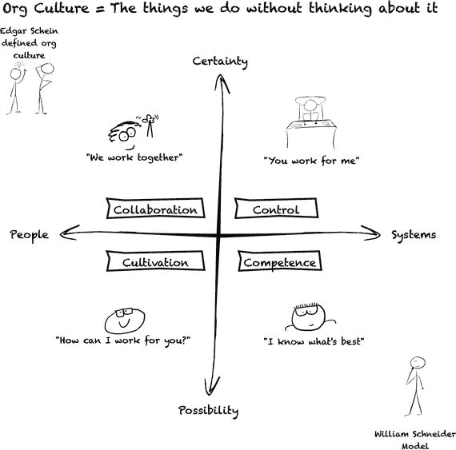

# 二十五、开始组织变革

组织变革管理是一个探索已久的领域。您已经掌握了在您的组织中开始数据科学所需的知识，但在本章中，您将学习一些其他工具，这些工具可用于帮助您的组织改变思维模式。

我在这本书的开头描述了我在 20 世纪 90 年代早期在西北大学学术计算和网络服务(ACNS)的工作。当时，办公室位于芝加哥市中心。每天早上，我从北边的红线乘高架火车到市中心的州立大街和芝加哥大街站。每次我走过这些北边的社区，我都会经过一栋有围栏的小院子的房子。栅栏后面有一只狗，每天早上我去车站的时候，它会抓我，抓我，叫我。这是我们的惯例。我和狗每天早上都分享的东西。我会走向火车，然后狗会抓啊抓啊叫。有时我甚至会看到它闪亮的棕色脑袋从栅栏顶上冒出来。

一天早上，这只狗异常兴奋。当狗把它的身体扔向嘎吱作响的木头时，栅栏板发出像扩音器一样的隆隆声。我看了一眼栅栏，然后回到我的热气腾腾的 NWU 咖啡玻璃杯。那条狗设法把它的一条腿伸过了船舷。然后，它利用这种杠杆作用在它的背上滚动，并以超强的力量翻过栅栏的一侧。带着些许失态，这只狗站了起来，似乎和我一样对它的成功感到惊讶。它带着一丝遗憾回头看了看栅栏，又看了看我。我们的目光锁定，在那一瞬间，我们意识到有些事情发生了变化。我们俩都不知道该怎么办。

当我看到组织进行重大变革时，我会想到这个故事。通常，所有的热情和努力都用在抓和抓来尝试新事物上。事实上，组织并不是这样变化的。大型组织通常不会被激情所感动。他们被对长期、实际改进的不懈追求所感动。

大多数组织无法做出大的改变有三个原因:

*   他们不理解这种变化。组织通常不理解新的数据科学思维模式的价值。关键人物对探索型和经验型组织的样子没有清晰的认识。他们不清楚旅程结束时他们的组织会是什么样子。因此，他们可能会有一些团队尝试新的数据科学思维模式。这些团队会尝试新的东西，但是他们没有一个前进的计划。没有人交流过组织变革的好处。
*   他们对自己的文化没有很好的认识。他们不知道数据科学的思维模式将如何融入他们更大的组织规范。他们还没有考虑他们的组织是否会接受这种变化。数据科学思维模式和您组织的运营方式之间可能存在很大的脱节。在实施数据科学变革之前，您需要对更大的组织文化有一个客观的认识。
*   他们没有真正的改变计划。该组织不知道他们需要采取哪些实际步骤来做出改变。他们可能理解数据科学的思维模式，并认为他们拥有正确的文化，但他们不知道如何将两者联系起来。这可能是一个巨大的挑战，因为在大多数组织中，用科学方法思考数据是一个巨大的变化。如果你不把它作为一个组织的变化，你会很快遇到不可克服的挑战。即使是受欢迎和被广泛接受的变革也不总是适合你组织的文化。广为接受的实践不一定对你的团队有效。如果你不像对待组织变革一样对待新的数据科学思维，你就真的有失败的危险。你可能会有一些创新，但是要做出持久的改变是很有挑战性的。

在本章中，你将学习不同类型的组织文化，以及如何识别你的组织文化。然后你会被介绍给一个资源，它会帮助你学会如何让你的组织克服对改变的恐惧。

## 理解组织文化

对于大多数组织来说，实施变革的第一步是更好地理解组织的文化。组织文化基本上是人们不假思索就去做的东西。前麻省理工学院教授 Edgar Schein 写了一本关于这个主题的很棒的书。他提出了一个更复杂的定义。他说，一个组织的文化是

> "A pattern of sharing basic assumptions, which is learned by the team when solving problems, is effective enough to be considered effective and passed on to new members as the correct way to perceive, think and feel these problems."

他的一个关键点是，组织文化根深蒂固。这些是人们不问就做的事情。它们是一个团体学习和教导新成员的假设。这使得一个组织的文化难以改变。在一个组织中，人们有一个成功的模式。当新员工被公司雇佣时，他们会被告知这些事情，并被告知这是做事的正确方式。因此，这种“文化”被视为正确的工作方式，很难改变。业务分析师和项目管理人员都接受了他们组织的文化是完成事情的方式。在这种文化中，当有人想要扭转局面时，通常会被认为是倒退和不正确的。当你谈论一种新的思维模式时，尤其如此。

这就是为什么如此多的注意力放在抓和抓，并试图做出新的改变。这种策略的唯一挑战是知道当你开始实施这些改变时该做什么。当你真的让一些人翻墙时会发生什么？在许多组织中，这种对话从未发生过。所有的努力都是为了做出改变。但是，在你做出改变后，有些人不容易接受新的心态，会发生什么呢？在你全力以赴抓之前，你需要评估一下你组织的文化。

幸运的是，有一个很好的资源可以用来识别你的组织的文化。这是一本由威廉·施耐德所著的《再造选择》。 [2](#Fn2) 他创造了四个类别来帮助你识别你的文化。每个人关注的东西都不一样(图 [25-1](#Fig1) )。这四种类型是:

图 25-1。

Customers who live near a gym

*   控制
*   合作
*   培养
*   能力

在他的书中，他提供了一份调查问卷，你可以在你的组织中传阅。该问卷帮助您确定这些类别中哪一个最能描述您的组织。类别可能会有一些重叠。你可能是一家非常重视能力的公司，但你也可能相当重视合作。这并不是说这些类别中的每一个都会包含您的整个组织。不过，你可能会看到一种明显突出的组织文化。

每一种文化都有自己的长处和短处。一种文化可能会欣然接受新的变化，而另一种文化可能会反对甚至是最明智的变化。关键是，一旦你理解了组织的文化，你就能更容易地决定有多少数据科学思维会扩展到你的团队之外。

### 控制文化

先说控制文化。这种文化有非常专制的倾向。把它想象成一个狼群。这类公司倾向于保守的管理风格，非常强调等级制度。控制文化中的每个人都知道他们为谁工作，谁为他们工作。在控制文化中，非常强调合规性。个人的角色是遵守其主管的要求。这些组织的负责人传达一个愿景，然后为他们工作的每个人都负责实现这个愿景。

组织中也有人确保每个人都遵从愿景。控制文化更喜欢员工呆在他们的职能范围内。个人一般不怎么走动。控制文化中的很多权威来自于角色和头衔。董事对经理有权威，经理对监事有权威。标题传达了权威的级别。

因为对合规性的强调如此之多，控制文化中的决策制定往往会非常彻底。在最高层有一种确定性的推动力。最高管理层或董事们想知道何时做出决定。他们希望为他们工作的人“签署”这个决定。在这些组织中进行重大变革的方法是让某个高层人士，比如首席数据官(CDO)或首席信息官(CIO)，来“赞助”变革。没有这个赞助者，除了你的团队之外，很难做出任何持久的改变。不幸的是，控制文化如此强调确定性，以至于很难让高层赞助者同意做出大的改变。大变革几乎天生就有风险。控制文化做出大的、有风险的改变的最常见的方式是当他们别无选择的时候。这些组织倾向于更加保守，组织中的规范有利于秩序和确定性。他们通常喜欢可预测的过程。这就是为什么许多这样的组织会倾向于在很大程度上依赖大型系统的地方进行变革。这些系统的建立是为了让每个人都知道他们的角色以及他们在更大的过程中的位置。

数据科学团队通常在控制文化中有困难，因为数据科学团队角色比控制文化中的角色更灵活。此外，根据定义，探索是不确定的。处于强势控制文化中的数据科学团队通常不容易获得数据或决策权。控制文化有利于组织中的功能区域和强大的部门壁垒。这使得这些团队中的项目经理很难突破数据孤岛。即使面临这些挑战，许多数据科学团队仍然在强大的控制文化中工作。控制文化在大型组织中非常普遍，这些组织可能拥有大量有趣的数据。在许多方面，具有强大控制文化的组织通常从运作良好的数据科学团队中受益最多。

### 能力文化

第二种非常常见的文化是能力文化。这种文化在软件开发组织中很普遍。典型的能力文化是这样的，一群软件开发人员创建了一个非常受欢迎的工具，而开发人员成为了事实上的管理者。这种能力文化是作为他们组织的一部分建立起来的。能力文化的领导重点是设定标准和创造任务。他们根据每个员工的能力水平分配这些任务。所以管理风格是非常任务驱动的。管理团队试图分析他们如何分配任务。这是关于谁将完成这项工作做得最好。具有强大能力文化的组织倾向于成为矩阵式组织。在矩阵组织中，一个雇员可能有几个经理。你可能有一个质量保证开发人员向质量保证经理报告，同时也向软件开发经理报告。这意味着你有很多想成为专家的员工，他们的大部分注意力将集中在专业化上。你不想成为一个太了解开发的质量保证开发人员。然后你的软件开发工程师可能会给你任务，你会很快不知所措。所以非常强调专业化。

在能力文化中，很多权力和权威来自于发展高水平的专业知识。这些组织的决策往往非常注重分析。这样的公司将一个问题分解成组件，然后将这些组件分发给不同的员工。他们将组织视为一个工程问题。通常，当工程师遇到问题时，他们会将问题分解成几个组成部分。这些组织文化通过推动大目标来管理变革。他们有一个大目标，并把它分解成任务，以便前进。他们倾向于非常专业，在这些能力文化中，有着强烈的精英意识。你可以以一个低级员工或实习生的身份进来，如果你专攻某一领域并发展出高水平的专业技能，你就可以在组织中步步高升。

拥有强大能力文化的组织也倾向于有一个非常紧张的节奏。它们并不总是最容易工作的地方。能力文化也很难接受数据科学思维模式。数据科学往往是跨学科的。你必须对统计学、数学、讲故事和编程略知一二。非常强调专门化的文化可能不容易接受这种方法。当你需要讲述一个好故事时，你不希望你的数据分析师拒绝帮忙。你也不希望你的项目经理和研究主管觉得自己没有资格问好问题。能力文化非常强调成为专家。这就是专业知识门槛高的原因。这可能是一个挑战，因为在数据科学团队中，通常是外人会给你一些最好的问题。

### 栽培文化

第三种文化是修养文化。这是所有四种类型中最罕见的。在这种以人为本的文化中，领导者专注于授权和帮助人们成为最优秀的员工。经理们喜欢确保每个人都开心。他们希望员工喜欢成为组织的一部分，并且非常重视员工调查。这些组织倾向于建立一个权威的轮子，以员工为中心，所有的资源围绕着他们。他们的每个经理都像车轮上的辐条。他们周围的人试图帮助员工弄清楚他们需要什么才能做到最好。

在培养文化中，非常强调表达自己。经理们关注员工的发展和成长。他们想培养每个人。领导层通常注重魅力。如果你在培养文化中是一个有魅力的人，你可以很快成为一个权威——即使你刚刚在公司从一个低级职位起步。

管理者专注于培养他人的优势。培养领导者通过团队的才能解决问题，从而在组织中上升。

在培养文化中，多面手的价值很高。你不想去敲别人的门，听到他们不能解决你的问题。

在培养文化中，你永远看不到的一件事是有人被困在这个系统中。你会发现，在培养文化中，对部门和过程的强调要少得多。此外，这些组织中的决策制定可能很困难，因为它是高度参与性和有机的。团队中的每个人都想达成共识。

千禧一代和 30 岁以下的人在这些培养文化中有成功的趋势。许多年轻的员工特别倾向于寻求共识。由年轻企业家经营的组织倾向于在这种培养文化中投入大量的价值，并且更有可能拥抱变化和适应新思想。他们认为改变是培养过程的一部分。他们有参与式会议，人们在会上谈论变革。然后，一旦他们决定改变对他们的公司有好处，他们会很快接受这种改变。在这些组织中，成长和发展是受到鼓励的，而且在这些组织中工作往往会非常有趣，因为人们可以自由地犯错误。

然而，这些培养文化的挑战是，他们往往在决策过程中行动缓慢。你可以想象，大集团要花很长时间才能做出大家都同意的决定。真正的栽培文化是罕见的。一些组织可能觉得他们有一种培养文化，但如果你仔细观察，你会发现他们并没有真正遵循许多关键的实践。许多这样的组织只是控制文化，带有一层薄薄的培养文化的外衣。

### 协作文化

第四种也是最后一种文化是协作文化。这几乎和栽培文化一样罕见。你真的不会在信息技术领域看到这么多，因为这不符合领导风格。这种类型的文化更多地出现在培训机构中。协作文化中的领导者往往是团队建设者和教练。他们的管理风格非常民主，但不像栽培文化那样随意。不太需要让每个人都参与进来，但你仍然有一群经理，他们紧密合作，提出有趣的想法。这就是合作的全部意义。这样的公司倾向于团队合作，而不是像你在控制文化中看到的自上而下的等级制度。他们仍然非常强调成为多面手。

合作文化和培养文化的最大区别在于，对于前者，权威来自于关系。有时你会在家族企业中看到这种情况。你越接近组织的领导，你的权威就越大。高层人员合作更加紧密。他们倾向于通过头脑风暴会议和一些实验来做决定。与控制文化或能力文化相比，他们更容易接受变化。如果组织试图接受数据科学思维，这将有所帮助。如果你有一种协作文化，你的组织接受这种改变并不困难。然而，协作文化可能会发现数据科学的一些关键组成部分相当困难。一个有效的数据科学团队必须有追求新想法和犯错误的权力。这种权威被下推到团队层面。协作文化仍然倾向于拥有高层的权威。他们只是比控制文化更民主一点。

## 识别您的文化

现在你已经看到了这四种不同类型的文化，你需要找出哪一种最符合你的组织(如果你还没有的话)。请记住，协作文化或培养文化更容易接受数据科学思维模式的关键组成部分。这些文化中的个人也更容易改变，因为他们在组织中已经有了成为多面手的自然倾向。

如果你有一个强大的控制文化，你的组织倾向于传统的大系统方法。这些组织倾向于创建每个人都知道自己角色的大型流程。在许多方面，这与你希望运行数据科学项目的小型、自组织团队相反。这些文化也常常难以接受科学方法的一些关键组成部分。实验和探索本来就是不可预测的。这些控制文化通常偏爱具有可预测结果的复杂过程。如果你有一个非常强大的控制文化，你可能想从几个独立的团队开始。如果这些团队成功了，你可能有机会进行一些更大的组织变革。请记住，这些文化通常最难改变。

如果您有能力文化，那么您的组织在尝试接受数据科学思维模式时可能会面临类似的挑战。许多科学方法是将事物分解成有趣的问题，因此团队可以通过这些问题寻找更大的见解。这与能力文化通常看待工作的方式大相径庭。他们把一个大问题看作是可以分解成任务的事情。这是非常分析性的，但不是经验性的。处于能力文化中的团队需要确切地知道他们将做什么来完成工作。这些组织也倾向于拥有高度专业化的团队。这个团队中的每个人都应该有自己的专长。从很多方面来说，这降低了团队的协作性。每个人都是各自领域的权威。同样，这使得接受数据科学思维更加困难。您希望您的数据科学团队能够提出有趣的问题。这些问题可能来自研究负责人，但也可能来自数据分析师甚至项目经理。团队中的每个人都被认为有能力提出有趣的问题。对于强大的能力文化来说，这可能是一个小小的变化。

## 做出改变

确定了自己的文化之后，你就可以开始做出改变了。关于组织变革的最好的书之一是《无畏的变革》。这本书确定了组织如何接受或拒绝变革的模式。你可以利用你所学到的关于你的文化的东西，并利用它来确定哪些模式最适合你的组织。即使在控制文化中，您有时也可以为以后的变化做好准备。这本书面向“无权的领导者”这些领导者在组织中没有任何隐性或显性的权力。因此，你不一定要成为首席执行官或董事才能尝试在你的组织中实施变革。

这本书非常适合引导你的组织改变思维模式。即使在一个强大的控制文化中，你也不一定要成为 C 套件中的主管或经理才能开始变革过程。你只需要有一个好主意，想要引入改变。这本书为变革领导者提供了 48 种模式。您可以混合和匹配这些模式，根据您组织的文化提出一个总体策略。

本书最有帮助的指南之一是组织变革的“神话”。这些误区中的一些可能会阻碍你做出改变的努力。最常见的是，“如果这是一个好主意，那么说服别人接受它就很容易了，”以及“实现一个新想法所需要的只是知识和一个有效的计划。”另一个想法是，如果有人对改变持怀疑态度，你可以超越或忽略他们。这本书为你提供了如何应对怀疑论者以及如何倾听他们的策略。你不应该忽视你的怀疑者；他们可能是对的，看到了你看不到的东西。

这本书指出的另一个神话是，你可以成为组织中的变革推动者，独自工作——仅仅是你的知识、魅力和幻灯片的力量就足以做出改变。这本书试图表明的是，你需要建立一个能帮助你做出改变的团队。如果你无能为力，你能做的最好的事情就是和一小群人达成共识，然后推动改变。

最后一个误区是，如果你让某人相信这种改变，他们会一直相信。这本书做得很好的一件事是把变化表现为一种杂耍行为，在这种行为中，你让某人相信变化是值得的，但你仍然必须不时地回到他们身边。在这种情况下，问他们是否还在船上，他们是否仍然支持改变。即使人们接受了改变，接受了这个想法，他们也可能会滑回老路。当你试图做出大的改变时，对于控制组织来说尤其如此。

无畏的改变是基于人们以不同的速度接受想法的观念。这些人自然属于几个群体中的一个:

*   天生的创新者:当这个群体看到新事物时，他们是第一个接受改变的人。你会从数据科学的角度看到这一点。你组织中的一些创新者会对使用科学方法来更好地理解你的数据非常感兴趣。
*   早期采用者:这个群体感兴趣，但他们想听到更多。他们可能认为这是一个好主意，但没有创新者那么积极。
*   早期多数:这个群体是最大的一块。他们认为这个想法很有趣，但在加入之前会等着看别人怎么说。
*   晚多数:这一组说，“好吧，如果每个人都同意，我也同意，但我真的不想成为第一个。”
*   落后者:这些人会说，“我真的很喜欢现在做事的方式，我不明白为什么我们需要改变。”

当你考虑大规模的组织变革时，人们以不同的速度接受变革的想法是有帮助的。你正试图转向数据科学的思维模式，这通常是文化的一个重大变化。这就是为什么你经常想要确保你得到早期多数人的支持。你可以利用你的创新者作为招募他们的一种方式，并试图获得足够的共识，这样你就可以推动你的敏捷转型，并获得一点动力。

另一件要记住的事情是，当你试图改变一个组织的文化时，你不仅要对人们的头脑说话，还要对他们的心灵说话。你希望能够与他们交谈，让他们对改变产生情感上的联系。这允许你激励你的创新者，鼓励你的早期采用者。你不只是想谈论生产力。谈论您的数据科学思维，以此来更好地了解您的客户。甚至可以把它作为与顾客建立情感联系的一种方式。创新者和早期采用者通常在寻找一些有趣的东西。如果你能激发他们的兴趣，他们通常会在整个组织变革过程中一直支持你。

这本书也贯穿了你不能蹂躏人民的思想。你不能忽视组织中的愤世嫉俗者和怀疑论者。通常，愤世嫉俗者和怀疑论者是对的，也有他们的优点。我经常会在一些组织中看到变革领导者试图忽视这些人，把他们视为障碍。他们会把他们斥为不愿做出重大改变的落后者。如果你忽视愤世嫉俗者和怀疑论者，你很可能会遇到更多的问题。这些人通常是第一个指出挑战的人。你应该仔细听他们说话，理解他们想说什么。试着让他们相信这种转变是可以发生的，即使他们对一些作品持怀疑态度。你的怀疑者会想要权衡你的改变带来的好处和付出的代价。

## 摘要

在这一章中，你已经学习了不同类型的组织文化，以及如何识别你的组织文化。然后你被介绍给一个资源，它将帮助你学习如何让你的组织克服对改变的恐惧。在下一节，我会给你一些离别的想法作为压轴戏。

## 压轴戏

这就是了。我们已经走到尽头了。我希望你喜欢这本关于数据科学的书，并对如何组建团队提出有趣的问题并交付真正的商业价值有更好的想法。我试图说明的一个要点是，数据科学不仅仅是一系列实践。而是要有探索和经验主义的心态。有许多关于数据科学战术方面的书籍。我在这里尝试做的与众不同。我试图证明战术的寿命比转向更大的数据科学思维模式要短得多。如果你学习 R、Python、统计学或 Hadoop，那么你将拥有一些你需要的工具，但是仅仅使用这些工具并不能让你成为一个数据科学团队。记得把重点放在数据科学的“科学”上。这种数据科学的思维方式会让你以更有趣的方式自由使用这些工具。以新的方式思考数据远比下载新的工具和软件更具挑战性。新的数据科学思维是一个真正的挑战，但这将是一种更有价值和更有成效的数据处理方式。

我希望你喜欢这本书，并乐于提出好问题，收集见解，并从你的数据中学到更多。

Footnotes [1](#Fn1_source)

组织文化与领导力，第 2 卷。(约翰·威利父子公司，2010 年)。

  [2](#Fn2_source)

威廉·e·施耐德，《再造选择:让你当前的文化发挥作用的计划》(理查德·D·欧文出版社，1994 年)。

  [3](#Fn3_source)

《经理 3.0:千禧一代重写管理规则指南》。美国管理协会 AMACOM 分部，2013 年。

  [4](#Fn4_source)

Linda Rising 和 Mary Lynn Manns,《无畏的变革:引入新思想的模式》(皮尔逊教育，2004 年)。