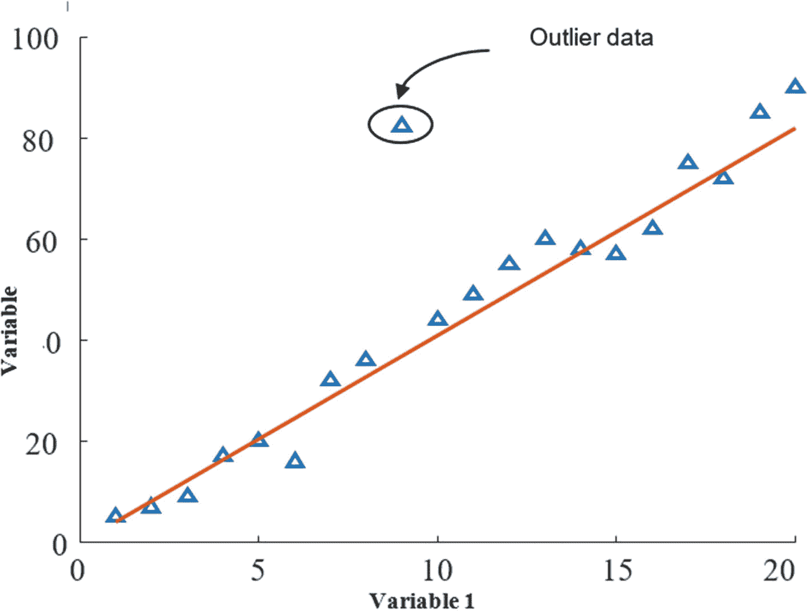

# 一、数据科学导论

数据是关于主题的文字、数字和描述形式的信息的集合。考虑下面的陈述:“狗有四条腿，1.5 米高，有棕色的毛。”这一陈述具有关于狗的三种不同类型的信息(即，数据)。数据“四”和“1.5m”是数值数据，“棕发”是描述性的。了解各种数据类型有助于理解数据、执行有效的分析以及更好地从数据中提取知识。基本上，数据可以分为两种类型。

*   数据

*   质量数据

*定量数据*只能借助测量而不是通过观察来获得。这可以用数值的形式来表示。定量数据可以进一步分为连续数据和离散数据。精确的整数值是*离散*数据，而*连续*数据可以是一个范围内的任何值。*定性数据*是对受试者特征的描述。通常定性数据可以从观察中获得，无法测量。换句话说，定性数据可以被描述为分类数据，而定量数据可以被称为数值数据。

例如，在前面的陈述中，“棕色毛发”描述了狗的特征，是定性数据，而“四条腿”和“1.5m”是定量数据，分别被归类为离散和连续数据。

数据可以以结构化和非结构化的形式提供。当数据被组织在预定义的数据模型/结构中时，它被称为*结构化数据*。借助查询语言，结构化数据可以存储在表格格式或关系数据库中。我们也可以将这类数据以 Excel 文件格式存储，如表 [1-1](#Tab1) 中给出的学生数据库。

表 1-1

结构化数据的一个例子

<colgroup><col class="tcol1 align-left"> <col class="tcol2 align-left"> <col class="tcol3 align-left"> <col class="tcol4 align-left"> <col class="tcol5 align-left"></colgroup> 
| 

**学生**点名

 | 

马克斯

 | 

出席

 | 

一批

 | 

性

 |
| --- | --- | --- | --- | --- |
| One hundred and eleven thousand four hundred and one | 492/500 | 98% | 2011-2014 | 男性的 |
| One hundred and eleven thousand four hundred and two | 442/500 | 72% | 2011-2014 | 男性的 |
| One hundred and twenty-one thousand five hundred and one | 465/500 | 82% | 2012-2015 | 女性的 |
| One hundred and twenty-one thousand five hundred and two | 452/500 | 87% | 2012-2015 | 男性的 |

大多数人类生成和机器生成的数据都是非结构化数据，例如电子邮件、文档、文本文件、日志文件、文本消息、图像、视频和音频文件、网络和社交媒体上的消息以及来自传感器的数据。这些数据只能通过人工或机器干预才能转换成结构化格式。图 [1-1](#Fig1) 显示了非结构化数据的各种来源。

图 1-1

非结构化数据的来源

## 数据类型在数据科学中的重要性

在开始分析数据之前，了解数据类型非常重要，这样您就可以选择合适的分析方法。连续数据的分析不同于分类数据的分析；因此，对两者使用相同的分析方法可能会导致不正确的分析。

例如，在涉及连续数据的统计分析中，确切事件的概率为零，而离散数据的结果可能不同。

您还可以根据数据类型选择可视化工具。例如，连续数据通常用直方图表示，而离散数据可以借助条形图可视化。

## 数据科学:概述

正如本章开头所讨论的，数据科学只不过是从数据中提取知识或信息。不幸的是，并不是所有的数据都能提供有用的信息。它基于客户需求、假设、数据类型的本质以及用于分析和建模的方法。因此，在对数据进行分析或建模以进行智能决策之前，需要进行一些处理。图 [1-2](#Fig2) 描述了这些数据科学流程。

图 1-2

数据科学过程

## 数据要求

为了开发一个数据科学项目，数据科学家首先根据客户/业务需求理解问题，然后定义分析问题的目标。例如，假设一个客户想要分析人们对政府政策的情绪。首先，问题的目标可以设定为“收集人民对政府政策的意见”然后，数据科学家决定支持目标的数据类型和数据资源。对于示例问题，可能的数据是社交媒体数据，包括各种类别的人的文本消息和民意调查，以及关于他们的教育水平、年龄、职业等的信息。在开始数据收集之前，一个好的工作计划对于从各种来源收集数据至关重要。设定目标和工作计划可以减少收集数据所花费的时间，并有助于准备报告。

## 数据采集

互联网上有许多类型的结构化开放数据，我们称之为*二级数据*，因为这种数据是由某人收集并构建成某种表格格式的。如果用户想直接从一个来源收集数据，那就叫做*原始数据*。最初，非结构化数据是通过许多资源收集的，例如移动设备、电子邮件、传感器、摄像头、与人的直接交互、视频文件、音频文件、文本消息、博客等。

## 数据准备

数据准备是数据科学过程中最重要的部分。准备数据会将数据转换成适当的形式，以便进行知识提取。数据准备阶段有三个步骤。

1.  数据处理

2.  数据清理

3.  数据转换

### 数据处理

这一步很重要，因为当我们从各种来源导入数据时，需要检查数据的质量。进行这种质量检查是为了确保数据具有正确的数据类型和标准格式，并且变量中没有打字错误或错误。这一步将减少进行分析时的数据问题。此外，在这个阶段，收集的非结构化数据可以以结构化数据的形式进行组织，以便进行分析和可视化。

### 数据清理

数据处理完成后，需要清理数据，因为数据可能仍有一些错误。这些误差会影响数据中的实际信息。可能的错误如下:

*   复制

*   人为或机器错误

*   缺少值

*   极端值

*   不适当的价值观

### 复制

在数据库中，一些数据重复多次，导致*重复*。最好检查并删除重复项，以减少数据分析期间的计算开销。

### 人为或机器错误

数据由人类或机器从数据源收集。在这个过程中，由于人的疏忽或机器故障，一些错误是不可避免的。避免这类错误的可能解决方案是将变量和值与标准变量和值相匹配。

### 缺少值

在将非结构化数据转换成结构化形式时，一些行和列可能没有任何值(即，空)。这种误差将导致信息的不连续性，并使其难以可视化。编程语言中有许多内置函数，我们可以用它们来检查数据是否有任何缺失值。

### 极端值

在统计学中，异常值是与其他观察值显著不同的数据点。异常值可能是因为测量中的可变性，或者它可能表明实验误差；离群值有时会被排除在数据集之外。图 [1-3](#Fig3) 显示了一个异常数据的例子。异常数据会导致某些类型的模型出现问题，进而影响决策。

图 1-3

异常数据

### 转换数据

数据转换可以通过使用标准化、最小-最大运算、相关信息等多种方法来完成。

## 数据可视化

根据用户的要求，可以借助图表、图形等可视化工具对数据进行分析。这些可视化工具帮助人们理解数据集中特定变量的趋势、变化和偏差。可视化技术可以作为探索性数据分析的一部分。

## 数据分析

借助于数学技术，如统计技术，可以进一步分析这些数据。改进、偏差和变化以数字形式确定。我们还可以通过结合可视化工具和分析技术的结果来生成分析报告。

### 建模和算法

今天，许多机器学习算法被用来从原始数据中预测有用的信息。例如，神经网络可以用于根据用户之前的行为来识别愿意向孤儿捐赠资金的用户。在这种场景下，可以基于用户的教育、活动、职业、性别等来收集用户之前的行为数据。可以用这些收集的数据来训练神经网络。每当一个新用户的数据被馈入这个模型，它就可以预测这个新用户是否会给出资金。但是，预测的准确性取决于可靠性和训练时使用的数据量。

有许多可用的机器学习算法，例如回归技术、支持向量机(SVM)、神经网络、深度神经网络、递归神经网络等。，可以应用于数据建模。在数据建模之后，可以通过提供来自新用户的数据并开发预测报告来分析模型。

### 报告生成/决策制定

最后，在可视化工具、数学或统计技术以及模型的帮助下，可以基于分析开发报告。这种报告在许多情况下是有用的，例如预测一个组织、行业、政府等的优势和劣势。报告中的事实和发现可以使决策变得相当容易和明智。此外，分析报告可以根据客户需求使用一些自动化工具自动生成。

## 数据科学的最新趋势

数据科学中的某些领域正在呈指数增长，因此对数据科学家来说很有吸引力。下面几节将对它们进行讨论。

### 数据科学中的自动化

在当前的场景中，数据科学仍然需要大量的手动工作，例如数据处理、数据清理和数据转换。这些步骤消耗大量的时间和计算。现代世界需要数据科学流程的自动化，如数据处理、数据清理、数据转换、分析、可视化和报告生成。因此，自动化领域将是数据科学行业的最大需求。

### 基于人工智能的数据分析师

可以有效地实施人工智能技术和机器学习算法来对数据进行建模。特别地，使用深度神经网络的强化学习来基于数据的变化升级模型的学习。此外，机器学习技术可以用于自动化数据科学项目。

## 云计算

如今人们使用的数据量呈指数级增长。一些行业每天收集大量数据，因此很难在本地服务器的帮助下进行存储和分析。这使得它在计算和维护方面很昂贵。因此，他们更喜欢云计算，在云计算中，数据可以存储在云服务器上，并可以随时随地进行检索和分析。许多云计算公司在其云服务器上提供数据分析平台。数据处理的发展越快，这个领域就越受关注。

## 边缘计算

许多小规模行业不需要分析云服务器上的数据，而是需要即时的分析报告。对于这些类型的应用，边缘设备可以是一种可能的解决方案来获取数据，分析数据，并以视觉形式或数字形式立即向用户呈现报告。未来，边缘计算的需求将显著增加。

## 自然语言处理

自然语言处理(NLP)可用于从网站、电子邮件、服务器、日志文件等中提取非结构化数据。此外，NLP 对于将文本转换成单一数据格式也很有用。例如，我们可以将人们在社交媒体上的信息转换成数据格式。这将是从许多来源收集数据的有力工具，其需求将继续增加。

## 为什么要在树莓派上使用数据科学？

许多书籍解释了与云计算相关的数据科学中涉及的不同过程。但是在本书中，数据科学的概念将作为使用 Raspberry Pi 的实时应用程序的一部分进行讨论。Raspberry Pi 板可以通过使用通用输入/输出(GPIO)引脚连接到各种传感器，与实时世界进行交互，从而更容易收集实时数据。由于它们的小尺寸和低成本，这些 Raspberry Pi 板的多个节点可以连接成网络，从而实现本地化操作。换句话说，Raspberry Pi 可以用作数据处理和存储的边缘计算设备，更接近用于获取信息的设备，从而克服与云计算相关的缺点。因此，许多数据处理应用程序可以使用这些设备的分布来实施，这些设备可以管理实时数据并在本地运行分析。这本书将帮助你使用 Raspberry Pi 实现实时数据科学应用。