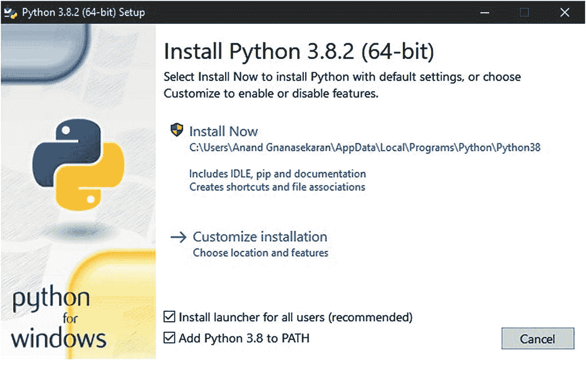
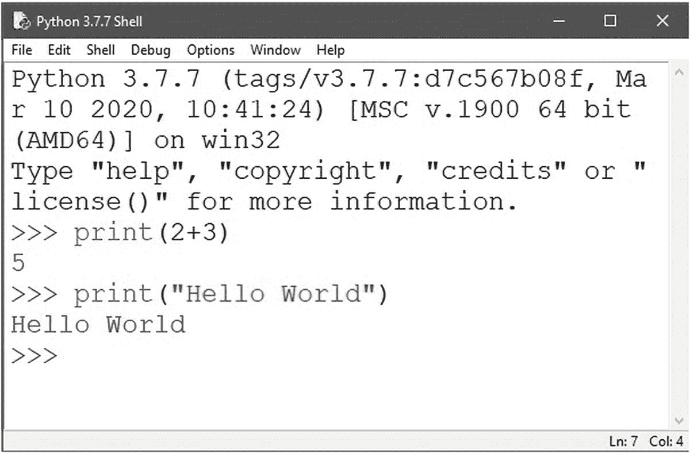
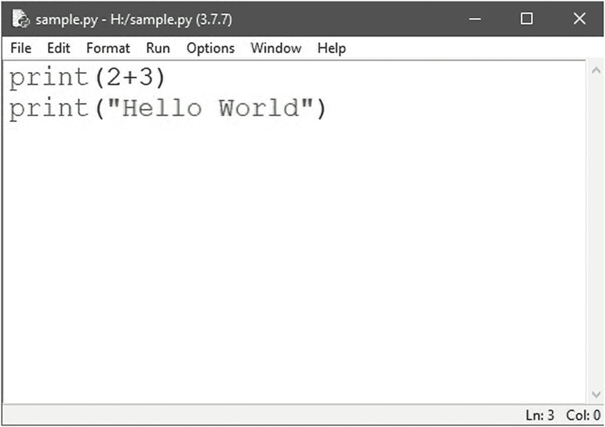
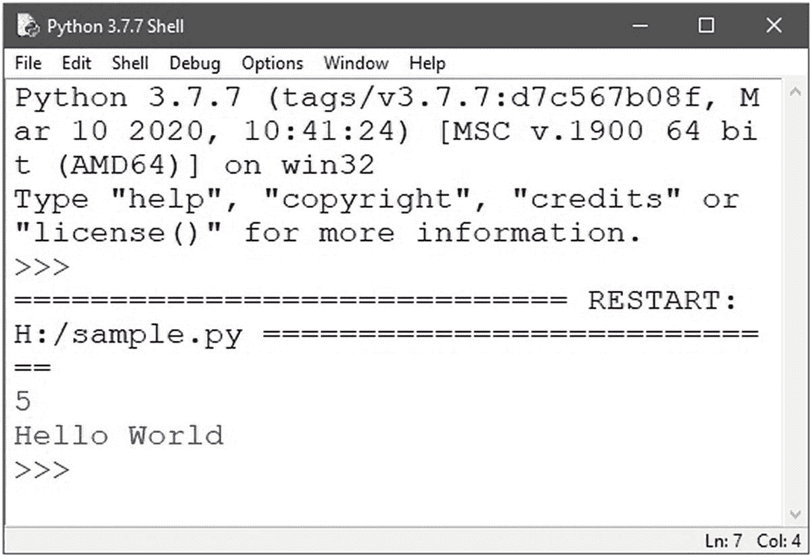
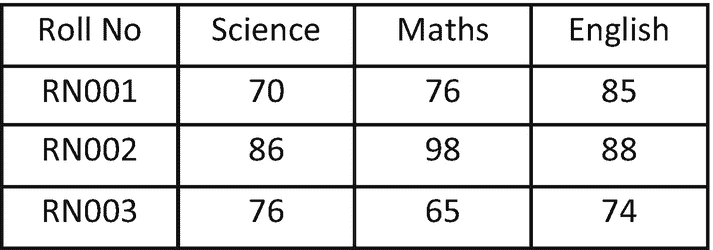

# 二、Python 编程基础

Python 是一种通用动态编程语言，由荷兰程序员吉多·范·罗苏姆于 1989 年创建。它是数据科学领域最常用的编程语言。因为 Python 比其他语言更容易学习和编写代码，所以它是初学者的最佳选择。Python 的广泛使用也归功于它是免费和开源的。Python 社区开发的大量科学库和包允许数据科学家使用数据密集型实时应用程序。一些领先的组织，如谷歌、Dropbox 和网飞，都在不同程度上使用 Python 来增强他们的软件。在本章中，我们将讨论 Python 在 Windows 操作系统上的安装、不同的 Python IDEs、Python 可用的基本数据类型、控制流语句、Python 函数以及用于数据科学的不同 Python 库。

## 为什么是 Python？

Python 是数据科学家最喜欢的编程语言，原因如下:

*   它是一种开源编程语言，拥有强大且不断增长的贡献者和用户社区。

*   它的语法比 C、C++和 Java 等其他编程语言更简单。

*   它允许用户执行面向对象的编程。

*   它有一个很大的库集，可用于执行各种任务，如开发网站、构建机器学习应用程序等。

*   它可以用于嵌入式小型硬件设备，如 Raspberry Pi，支持各种应用的实时实施。

## Python 安装

Linux 操作系统的大多数发行版都预装了 Python 包，但是在 Windows 操作系统的情况下，它必须单独安装。在 Windows 操作系统上安装 Python 的步骤如下:



图 2-1

Python 的安装向导

1.  打开浏览器，进入 Python.org，Python 的官方网站。

2.  在该页面上，单击“下载”选项卡，并在出现的页面上下载软件的最新版本。

3.  下载完成后，打开安装包。在安装向导中，如图 [2-1](#Fig1) 所示，选择将 Python 添加到 path 中，这将确保 Python 自动添加到您的系统变量 PATH 中；否则，必须在系统的环境变量设置中手动添加该路径。

4.  单击“立即安装”安装软件包。

安装完成后，您可以通过在命令提示符下键入`python --version`来验证安装，这将显示系统上安装的 Python 版本。如果它没有显示版本，那么可能是安装或系统路径变量有问题。

请参考官方网站上提供的 Python 文档，以了解下载该软件的附加模块和包的过程。您可以在命令提示符下开始使用 Python，也可以在下一节讨论的各种 ide 中安装一个。

## Python IDEs

*集成开发环境* (IDE)是一个软件套件，它将开发人员的工具组合到一个图形用户界面(GUI)中，其中包括用于编辑代码以及构建、执行和调试程序的选项。Python 可以使用许多 ide，每种 ide 都有自己的优势。这里讨论一些常用的 ide。

### 皮查姆

PyCharm IDE 由捷克公司 JetBrains 开发。它是一个跨平台的 IDE，可以在 Windows、macOS 和 Linux 上使用。它提供了代码分析和图形调试器。它还支持使用 Django 进行 web 开发，以及使用 Anaconda 进行数据科学。PyCharm 的一些吸引人的特性是智能代码完成、简单的包管理界面和重构选项，它提供了跨代码中的多行进行更改的能力。

### 斯派德

Spyder 是用 Python 语言进行科学编程的跨平台 IDE。Spyder 集成了许多科学软件包，包括 NumPy、SciPy、Matplotlib、Pandas、IPython 和其他开源软件。它是在麻省理工学院许可下发布的。

### Jupyter 笔记型电脑

Jupyter Notebook 是一个基于网络的交互式计算环境。该笔记本将代码及其输出集成在一个文档中，该文档结合了可视化、文本、数学方程和其他媒体，从而使其适合数据科学应用。

### 用 IDLE 进行 Python 编程

IDLE 是一个简单的跨平台 IDE，适合教育环境中的初学者。它具有多窗口文本编辑器、带语法高亮显示的 Python shell 和集成调试器等特性。由于这是 Python 自带的默认编辑器，所以让我们看看如何使用 IDLE 执行 Python 代码。

在这种空闲状态下，有两种执行 Python 代码的方法。第一种方式是交互模式，可以直接在 Python shell 中的符号>>>旁边键入代码，如图 [2-2](#Fig2) 所示。每一行代码都将在你按下回车键后被执行。使用交互模式的缺点是，当您保存代码时，它会与结果一起保存，这意味着您不能将保存的代码用于以后的执行。



图 2-2

在交互模式下运行 Python 代码

第二种方法是在脚本模式下运行代码，您可以打开一个脚本窗口并在那里键入完整的代码，然后可以用一个`.py`扩展名保存以供以后使用。要打开脚本文件窗口，请转到顶部的文件菜单，然后单击新建文件。在脚本窗口中，键入同样的两行代码，如图 [2-2](#Fig2) 所示。图 [2-3](#Fig3) 显示了带有代码的脚本文件窗口。然后转到文件菜单，单击保存，然后通过指定一个正确的文件名保存程序。确保文件名不以数字开头或与现有 Python 关键字同名。



图 2-3

脚本文件窗口

文件保存后，可以通过转到顶部的运行菜单并单击运行模块来执行脚本。这将执行脚本并在 Python shell 中打印输出，如图 [2-4](#Fig4) 所示。



图 2-4

脚本文件的输出

### Python 注释

在我们开始讨论 Python 数据类型之前，有必要了解一下 Python 中的注释行，因为我们会在代码中经常用到它们。根据您的注释目的，有两种方式来编写注释行。

如果你打算为自己写一个简短的注释，关于代码中的某一行，那么单行注释是最好的选择。这些单行注释可以通过简单地以一个散列字符(`#`)开始来创建，并且它们在行尾自动终止。执行代码时，Python 编译器将忽略散列符号之后直到行尾的所有内容。

多行注释旨在向他人解释代码的某个特定方面，可以通过在注释的开头和结尾添加三个单引号(`'''`)来创建。Python 编译器不会忽略这些注释，如果您的脚本除了注释之外没有其他内容，它们将出现在输出中。这两个注释使用空闲 Python shell 格式进行说明，如下所示:

```py
>>> # This is a comment
>>> "'This is a comment"'
'This is a comment'

```

## Python 数据类型

在编程语言中，*数据类型*是由变量可以取值的类型定义的。Python 数据类型主要可以分为数值和序列数据类型。属于这两个类别的数据类型将在本节中讨论，并为每个类别提供相关的图示。

### 数字数据类型

数字数据类型是可以接受数值的标量变量。数字数据类型的类别有`int`、`float`和`complex`。此外，我们将讨论使用布尔变量的`bool`数据类型。

### （同 Internationalorganizations）国际组织

`int`数据类型表示不带小数点的有符号整数。清单 [2-1](#PC3) 中的代码显示了整数的数据类型。

```py
a=5
"'print the data type of variable a using type() funcion"'
print("a is of type",type(a))

Output:
a is of type <class 'int'>

Listing 2-1Integer

Data Type

```

### 漂浮物

`float`数据类型表示浮点数，用小数点分隔整数和小数部分。清单 [2-2](#PC4) 中的代码打印浮点值的数据类型。

```py
a = 5.0
print('a is of type',type(a))

Output:
a is of type <class 'float'>

Listing 2-2float Data Type

```

### 复杂的

`complex`数据类型表示形式为 *a* + *bj* 的复数，其中 *a* 和 *b* 分别是实部和虚部。数字 *a* 和 *b* 可以是整数，也可以是浮点数。清单 [2-3](#PC5) 中的代码打印复数的数据类型。

```py
a=3.5+4j
print('a is of type',type(a))

Output :
 a is of type <class 'complex'>

Listing 2-3complex Data Type

```

### 弯曲件

在 Python 中，布尔变量由`True`和`False`关键字定义。因为 Python 是区分大小写的，所以关键字`True`和`False`的首字母必须大写。清单 [2-4](#PC6) 展示了`bool`数据类型。

```py
a= 8>9
print('a is of type',type(a))
print(a)

Output:
a is of type <class 'bool'>
False

Listing 2-4bool Data Type

```

布尔值可以用布尔运算符操作，包括`and`、`or`和`not`，如清单 [2-5](#PC7) 所示。

```py
a = True
b = False
print(a or b)

Output:
True

Listing 2-5Manipulation of boolean Data Type

```

### 数字运算符

表 [2-1](#Tab1) 总结了 Python 中可应用于数值数据类型的数值运算。

表 2-1

Python 中的数值运算符

<colgroup><col class="tcol1 align-left"> <col class="tcol2 align-left"></colgroup> 
| 

操作员

 | 

操作

 |
| --- | --- |
| `( )` | 圆括号 |
| `**` | 指数运算 |
| `*` | 增加 |
| `/` | 分开 |
| `+` | 添加 |
| `-` | 减法 |
| `%` | 模运算 |

表 [2-1](#Tab1) 中的操作符按其优先顺序列出。当在代码的特定行中执行多个操作时，执行顺序将根据表 [2-1](#Tab1) 中的优先顺序。考虑示例 *2*3* + *5* ，其中涉及乘法和加法。由于乘法的优先级高于加法，从表 [2-1](#Tab1) 中可以看出，乘法运算符(`*`)将首先被执行，给出*2***3*=*6*，然后是加法运算符(+)，这将给出 *6* + *5* = *11 的最终结果。*

### 序列数据类型

序列数据类型允许在一个变量中存储多个值。五类序列数据类型分别是`list`、`tuple`、`str`、`set`和`dict`。

#### 目录

列表是数据科学家在 Python 中最常用的数据类型。列表是元素的有序序列。列表中的元素不必是相同的数据类型。列表可以声明为用方括号`[]`括起来的逗号分隔的项目。列表是可变的；即列表中元素的值可以改变。列表中的元素从零开始索引，因此列表中的任何元素都可以通过其对应的索引来访问，如清单 [2-6](#PC8) 所示。索引应该是整数，索引使用任何其他数据类型都会导致`TypeError`。类似地，试图访问列表范围之外的索引将导致`IndexError`。

```py
a = [1, 2.5, 5, 3+4j, 3, -2]
print("a is of type",type(a))
"'print the first value in the list"'
print("a[0]=",a[0])
"'print the third value in the list"'
print("a[2]=",a[2])
"' print the values from index 0 to 2"'
print("a[0:3]=",a[0:3])
"'print the values from index 4 till the end of the list"'
print("a[4:]=",a[4:])
"'Change the value at the index 3 to 4"'
a[3]=4
print("a=",a)
"'fractional index leads to TypeError"'
print(a[1.5])
"out of range index leads to IndexError"'
print(a[8])

Output of line 2: a is of type <class 'list'>
Output of line 4: a[0]= 1
Output of line 6: a[2]= 5
Output of line 8: a[0:3]= [1, 2.5, 5]
Output of line 10: a[4:]= [3, -2]
Output of line 13: a= [1, 2.5, 5, 4, 3, -2]
Otuput of line 15: TypeError: list indices must be integers or slices, not float
Output of line 17: IndexError: list index out of range

Listing 2-6Operations in a List

```

考虑分别存储在变量`a`和`b`中的两个列表。表 [2-2](#Tab2) 显示了 Python 提供的一些附加操作，这些操作可以在列表`a`和`b`上执行。其中一些函数也适用于元组、字符串和集合。

表 2-2

Python 中的列表操作

<colgroup><col class="tcol1 align-left"> <col class="tcol2 align-left"></colgroup> 
| 

功能

 | 

描述

 |
| --- | --- |
| `a+b` | 连接两个列表`a`和`b` |
| `a*n` | 将列表`a`重复`n`次，其中`n`是一个整数 |
| `len(a)` | 计算列表`a`中元素的数量 |
| `a.append()` | 将一个元素添加到列表的末尾`a` |
| `a.remove()` | 从列表`a`中删除项目 |
| `a.pop()` | 移除并返回列表`a`中给定索引处的元素 |
| `a.index()` | 返回列表`a`中第一个匹配项的索引 |
| `a.count()` | 返回列表`a`中作为参数传递的项目数 |
| `a.sort()` | 按升序排列列表`a`中的项目 |
| `a.reverse()` | 颠倒列表`a`中项目的顺序 |

#### 元组

元组也是像列表一样的有序元素序列，但区别在于元组是不可变的；即，元组中的值不能改变。试图改变元组中某个元素的值会导致`TypeError`。通过将不会改变的数据存储为元组，可以确保它们保持写保护。元组可以声明为用圆括号括起来的逗号分隔的项，`()`。元组也可以像列表一样被索引，如列表 [2-7](#PC9) 中所述。

```py
a = (1, 3, -2, 4, 6)
print("a is of type",type(a))
print("a[3]=",a[3])
a[2] = 5

Output of line 2: a is of type <class 'tuple'>
Output of line 3: a[3]= 4
Output of line 4: TypeError: 'tuple' object does not support item assignment

Listing 2-7Operations in a Tuple

```

#### 潜艇用热中子反应堆（submarine thermal reactor 的缩写）

`str`数据类型代表一个字符串。字符串可以声明为双引号(`" "`)内的字符。单引号(`' '`)也可以使用，但是由于它们在一些单词中以撇号的形式出现，所以使用双引号可以避免混淆。字符串中的字符的索引方式与列表和元组相同。字符串中两个单词之间的空格也被视为字符。像元组一样，字符串也是不可变的，如清单 [2-8](#PC10) 所述。

```py
a = "Hello World!"
print("a is of type",type(a))
print("a[3:7]=",a[3:7]
a[2] = "r"

Output of line 2: a is of type <class 'str'>
Output of line 3: a[3:7]= lo W
Output of line 4: TypeError: 'str' object does not support item assignment

Listing 2-8Operations in a String

```

#### 设置

集合是项目的无序集合，因此不支持索引。集合由集合大括号`{}`内逗号分隔的值定义。集合可用于从序列中删除重复项。清单 [2-9](#PC11) 显示了集合中的操作。

```py
a = {1, 2, 3, 2, 4, 1, 3}
print("a is of type",type(a))
print("a=",a)

Output of line 2: a is of type <class 'set'>
Output of line 3: a= {1, 2, 3, 4}

Listing 2-9Operations in a Set

```

考虑分别存储在变量`a`和`b`中的两个集合。表 [2-3](#Tab3) 说明了 Python 支持的可以应用于这两个集合的各种集合操作。

表 2-3

Python 中的集合运算

<colgroup><col class="tcol1 align-left"> <col class="tcol2 align-left"></colgroup> 
| 

功能

 | 

描述

 |
| --- | --- |
| `a.union(b)` | 返回新集合中两个集合`a`和`b`的并集 |
| `a.difference(b)` | 将两个集合`a`和`b`的差作为新集合返回 |
| `a.intersection(b)` | 返回两个集合`a`和`b`的交集作为新集合 |
| `a.isdisjoint(b)` | 如果两个集合`a`和`b`有空交集，则返回`True` |
| `a.issubset(b)` | 如果`a`是`b`的子集，则返回`True`；即集合`a`的所有元素都出现在集合`b`中 |
| `a.symmetric_difference(b)` | 将两个集合`a`和`b`之间的对称差作为新集合返回 |

#### 词典

一个`dict`表示字典数据类型，这是一个由键值对表示的无序数据集合。字典可以在大括号`{}`中定义，每个条目都是一对，形式为`{key:value}`。字典针对检索数据进行了优化，其中字典中的特定值可以通过使用其对应的键来检索。换句话说，该键充当该值的索引。键和值可以是任何数据类型。键通常是不可变的，不能在字典中重复，而值可能有重复的条目。试图访问字典中不存在的键将导致`KeyError`，如清单 [2-10](#PC12) 中所述。

```py
a = {1: 'Hello', 4: 3.6}
print("a is of type", type(a))
print(a[4])
print(a[2])

Output of line 2: a is of type <class 'dict'>
Output of line 3: 3.6
Output of line 4: KeyError: 2

Listing 2-10Operations in a Dictionary

```

#### 类型变换

类型转换是将任何数据类型的值转换为另一种数据类型的过程。Python 为类型转换提供的函数如下:

*   `int()`:将任意数据类型更改为`int`数据类型

*   `float()`:将任意数据类型更改为`float`数据类型

*   `tuple()`:将任何数据类型更改为元组

*   `list()`:将任何数据类型更改为列表

*   `set()`:将任何数据类型更改为集合

*   `dict()`:将任何数据类型更改为字典

清单 [2-11](#PC13) 展示了其中的一些功能。

```py
a = 2
print(a)
float(a)
b = [2 , 3, -1, 2, 4, 3]
print(tuple(b))
print(set(b))

Output of line 2: 2.0
Output of line 4: (2, 3, -1, 2, 4, 3)
Output of line 5: (2, 3, 4, -1)

Listing 2-11Type Conversion Operations

```

### 控制流语句

控制流语句允许根据表达式的值执行一条或一组语句。控制流语句可以分为三类:*顺序控制流语句*，按照语句出现的顺序执行程序中的语句；*决策控制流语句*，根据条件是`True`还是`False`来执行或跳过语句块；以及*循环控制流语句*，允许多次执行语句块，直到满足终止条件。

#### 如果语句

决策控制流语句类别中的`if`控制语句以`if`关键字开始，后跟一个条件语句，以冒号结束。条件语句评估一个布尔表达式，只有当布尔表达式评估为`True`时，才会执行`if`语句中的语句体。`if` block 语句以缩进开始，第一条没有缩进的语句标志结束。`if`语句的语法如下，清单 [2-12](#PC15) 展示了它是如何工作的:

```py
if <expression>:
     <statement(s)>

```

```py
x = 12
y=8
if x > y:
   out = "x is greater than y"
   print(out)

Output: x is greater than y

Listing 2-12if Statement Operations

```

##### if-else 语句

`if`语句后面可以跟一个可选的`else`语句。如果`if`语句中条件语句对应的布尔表达式为`True`，则执行`if`块中的语句，如果布尔表达式为`False`，则执行`else`块中的语句。换句话说，`if-else`语句提供了一个双向决策过程。`if-else`语句的语法如下:

```py
if <expression>:
     <statement(s)>

else:
     <statement(s)>

```

清单 [2-13](#PC17) 显示了`if-else`语句的示例代码。

```py
x = 7
y=9
if x > y:
   out = "x is greater than y"
else:
   out = "x is less than y"
print(out)

Output:
x is less than y

Listing 2-13if-else Statement Operations

```

##### 如果... 否则如果...else 语句

`if...elif...else`语句可以提供多路决策过程。关键词`elif`是`else-if`的简称。如果需要从几个可能的选项中进行选择，`elif`语句可以和`if`语句一起使用。`else`语句将最后出现，作为默认动作。以下是`if...elif...else`语句的语法，清单 [2-14](#PC19) 显示了示例代码:

```py
if <expression>:
     <statement(s)>
elif <expression>:
     <statement(s)>
elif <expression>:
     <statement(s)>
...
else:
     <statement(s)>

```

```py
x = 4
y=4
if x > y:
   out = "x is greater than y"
elif x<y:
   out = "x is less than y"
else:
   out = "x is equal to y"
print(out)

Output:
x is equal to y

Listing 2-14if...elif...else Statement Operations

```

##### while 循环

`while`和`for`循环是循环控制流语句。在一个`while`循环中，条件语句中的布尔表达式被求值。只有当布尔表达式为`True`时，才会执行`while`循环中的语句块。循环块的每次重复被称为循环的一次*迭代*。每次迭代后检查`while`语句中的布尔表达式。循环继续执行，直到表达式变为`False`，此时`while`循环退出。`while`循环的语法如下，清单 [2-15](#PC21) 显示了它是如何工作的:

```py
while <expression>:
<statement(s)>

```

```py
x=0
while x < 4:
      print("Hello World!")
      x=x+1

Output:
Hello World!
Hello World!
Hello World!
Hello World!

Listing 2-15while Loop Operations

```

##### for 循环

`for`循环使用一个迭代变量运行，该变量随着每次迭代而递增，并且这种递增一直持续到变量到达循环操作序列的末尾。在每一次迭代中，将获取与迭代变量给定的位置相对应的序列中的项，并使用这些项执行循环中的语句。`for`循环的语法如下:

```py
for <iteration_variable> in <sequence>:
    <statement(s)>

```

`range()`函数在`for`循环中很有用，因为它可以生成一个数字序列，这个序列可以使用`for`循环进行迭代。`range()`函数的语法是`range([start,] stop [,step])`，其中`start`表示序列的开始(如果没有指定，从零开始)，`stop`表示必须生成的数字的最大值(不包括数字本身)，而`step`表示生成的序列中每两个连续数字之间的差值。起始值和步长值是可选的。range 参数生成的值应该总是整数。清单 [2-16](#PC23) 显示了一个`for`循环，用于逐个打印字符串中的元素。

```py
x = "Hello"
for i in x:
    print(i)

Output:
H
e
l
l
o

Listing 2-16for Loop Operations

```

清单 [2-17](#PC24) 展示了如何使用`range()`函数打印一个整数序列。

```py
for i in range(4):
    print(i)

Output:
0
1
2
3

Listing 2-17for Loop Operations with range Function

```

## 异常处理

异常只是在执行过程中检测到的错误。当程序中出现异常时，执行被终止，从而中断程序的正常流程。通过异常处理，可以向用户提供关于错误的有意义的信息，而不是系统生成的消息。例外可以是内置的，也可以是用户定义的。用户定义的异常是由用户创建的自定义异常，可以使用`try...except`语句来完成，如清单 [2-18](#PC25) 所示。

```py
while True:
try:
    n=int(input("Enter a number"))
print("The number you entered is",n)
     break
except ValueError:
    print("The number you entered is not
          the correct data type")
    print("Enter a different number")

Output:
Enter a number 5
The number you have entered is 5
Enter a number3.6
The number you entered is not the correct data type
Enter a different number

Listing 2-18Exception Handling

```

在清单 [2-18](#PC25) 中，当一个变量接收到一个不合适的数据类型的值时，就会出现一个`ValueError`异常。如果没有异常发生，即输入的数字是一个整数，则跳过`except`程序块，只执行`try`程序块。如果在输入不同数据类型的数字时出现异常，则跳过`try`块中的其余语句，执行`except`块，程序返回到`try`块。

## 功能

函数是 Python 编程中的基本块，当需要在一个程序中多次执行一个语句块时，可以使用函数。可以通过对这一组语句进行分组并给它一个名称来创建函数，这样只需通过这个名称就可以在程序的任何部分调用这些语句，而不是重复整个块。因此，函数可以通过消除冗余代码来减少程序的大小。这些功能可以是内置的，也可以是用户定义的。

Python 解释器有许多内置函数，其中一些我们已经见过，比如`print()`、`range()`、`len()`等。另一方面，Python 使用户能够定义自己的函数，并根据需要使用它们。函数定义的语法如下:

```py
def function_name(parameter1, ....  parameter n):
        statement(s)

```

函数名可以包含字母、数字或下划线，但不能以数字开头，也不能与关键字重名。让我们考虑一个简单的函数，它将单个参数作为输入，并计算其平方；参见清单 [2-19](#PC27) 。

```py
def sq(a):
    b = a * a
    print(b)
sq(36)

Output:1296

Listing 2-19Square Functions

```

让我们来看一个稍微复杂的函数，它计算给定十进制数的二进制表示。

如清单 [2-20](#PC28) 所示，计算十进制数的二进制表示所需的五行代码可以用一行用户定义的函数来代替。

```py
    import math as mt
    def dec2bin(a):
        b=' '
        while a!=0:
            b=b+str(a%2)#concatenation operation
            a=math.floor(a/2)
            return b[:-1]# reverse the string b
    print(int(dec2bin(19))

Output: 10011

Listing 2-20Square Functions

```

## 用于数据科学的 Python 库

Python 社区积极参与了许多面向各种应用程序的工具箱的开发。数据科学应用中最常用的一些工具箱有 NumPy、SciPy、Pandas 和 Scikit-Learn。

### 科学计算的 NumPy 和 SciPy

NumPy 是 Python 中可用的科学计算包。NumPy 支持多维数组、线性代数函数和矩阵。NumPy 数组表示为数据科学家提供了一种有效的数据结构。一个 NumPy 数组被称为一个 *ndarray* ，它可以使用`array()`函数创建。清单 2-21 展示了如何创建 1D 和 2D 数组以及如何索引它们的元素。

```py
'''import the NumPy library'''
import numpy as np
'''creates an 1D array'''
a=np.array([1,2,3,4])
'''print the data type of variable a'''
print(type(a))
'''creates a 2D array'''
a=np.array([[1, 2, 3, 4], [5, 6, 7, 8]])
print(a)
'''print the dimension of the array'''
print(a.ndim)
'''print the number of rows and columns in the array'''
print(a.shape)
'''print the third element in the first row'''
print(a[0,2])
'''print the sliced matrix as per given index'''
print(a[0:2,1:3])
a=np.array([1, 2, 3, 4, 5, 6, 7, 8, 9])
'''reshape the 1 x 9 array into a 3 x 3 array'''
b=a.reshape(3,3))
print(b)

Output of line 6: <class 'numpy.ndarray'>
Output of line 9:
[[1 2 3 4]
 [5 6 7 8]]
Output of line 11: 2
Output of line 13: (2, 4)
Output of line 15:3
Output of line 17
[[2 3]
 [6 7]]
Output of line 21:
[[1 2 3]
 [4 5 6]
 [7 8 9]]

Listing 2-21Array Using NumPy

```

使用`sum()`可以计算任意维度数组中元素的总和。可以为数组中的所有元素计算总和，也可以沿着清单 [2-22](#PC30) 中所示的一个维度为之前创建的数组`b`计算总和。

```py
'''print the sum of elements in array b'''
print(b.sum())
'''print the sum of elements along each column'''
print(b.sum(axis=0))
'''print the sum of elements along each row'''
print(b.sum(axis=1))

Output:
Output of line 2: 45
Output of line 4: array([12,15,18])
Output of line 6: array([6, 15, 18])

Listing 2-22Array Using NumPy

```

关于数组的另一个重要操作是多维数组的展平。这个过程在许多基于机器学习的应用程序中更常见，可以通过使用`flatten()`函数来完成，如下所示:

```py
b.flatten()
Output:
       array([1, 2, 3, 4, 5, 6, 7, 8, 9]

```

`flatten()`函数将任意维度的数组转换成一维数组。这也可以使用`reshape()`来实现，但是与`flatten()`函数不同，在这种情况下，必须指定一维数组的大小。表 [2-4](#Tab4) 描述了在使用数据分析应用程序时可能会派上用场的其他一些数组操作。

表 2-4

数据分析的 NumPy 函数

<colgroup><col class="tcol1 align-left"> <col class="tcol2 align-left"></colgroup> 
| 

句法

 | 

描述

 |
| --- | --- |
| `np.ones()` | 在括号内指定的维度中创建一个 1 的数组。 |
| `np.zeros()` | 在括号内指定的维度中创建一个零数组。 |
| `np.flip(a,axis)` | 沿给定轴反转数组`a`。如果未指定 axis，数组将沿两个维度反转。 |
| `np.concatenate(a,b,axis)` | 沿指定轴串联两个数组`a`和`b`(`=0`或`1`对应垂直和水平方向)。 |
| `np.split(a,n)` | 将数组`a`分割成`n`个更小的数组。这里的`n`可以是任意正整数。 |
| `np.where(a==n)` | 给出数组`a`中数字`n`的索引值。 |
| `np.sort(a,axis)` | 沿给定轴对数组`a`中的数字进行排序。 |
| `np.random.randint(n,size)` | 使用从 0 到数字`n`的整数生成给定大小的数组。 |

SciPy 生态系统是基于 Python 的 NumPy 扩展构建的科学计算开源软件集合。它提供了操作和可视化数据的高级命令。这个生态系统的两个主要组件是 SciPy 库和 Matplotlib，前者是数值算法和特定领域工具箱的集合，后者是提供 2D 和 3D 绘图的绘图包。以下语法可用于在代码中导入和使用 SciPy 模块中的任何函数:

```py
from scipy import some_module
some_module.some_function()

```

根据官方 SciPy 文档，该库被组织成覆盖不同领域的不同子类型，如表 [2-5](#Tab5) 中所总结的。

表 2-5

SciPY 中的子包

<colgroup><col class="tcol1 align-left"> <col class="tcol2 align-left"></colgroup> 
| 

分装

 | 

描述

 |
| --- | --- |
| `cluster` | 聚类算法 |
| `constants` | 物理和数学常数 |
| `fftpack` | 快速傅立叶变换例程 |
| `integrate` | 积分和常微分方程解算器 |
| `interpolate` | 插值和平滑样条 |
| `io` | 输入和输出 |
| `linalg` | 线性代数 |
| `ndimage` | n 维图像处理 |
| `odr` | 正交距离回归 |
| `optimize` | 优化和求根例程 |
| `signal` | 信号处理 |
| `sparse` | 稀疏矩阵和相关例程 |
| `spatial` | 空间数据结构和算法 |
| `special` | 特殊功能 |
| `stats` | 统计分布和函数 |

### sci kit-为机器学习而学习

Scikit-Learn 是一个用于 Python 编程的开源机器学习库，具有各种分类、回归和聚类算法。它旨在与其他 Python 库(如 NumPy 和 SciPy)进行互操作。

### 用于数据分析的 Pandas

Pandas 是一个快速而强大的开源库，用于 Python 编程中的数据分析和操作。它有一个快速有效的`DataFrame`对象，用于集成索引的数据操作。它具有在内存数据结构和不同文件格式(如 CSV、Microsoft Excel 等)之间读写数据的工具。考虑一个名为`data.csv`的 CSV 文件，其中包含三名学生在三个科目上的成绩，如图 [2-5](#Fig5) 所示。清单 [2-23](#PC33) 显示了使用 Pandas 读取和访问这些数据的过程。



图 2-5

包含学生成绩数据的 CSV 文件

```py
import pandas as pd
'''reads the file data.csv with read_csv package and the header=None option allows pandas to assign default names to the colums
Consider the data in the above table is typed in a excel sheet and saved as csv file in the following path C:\Python_book\data.csv
'''
d = pd.read_csv("C:\Python_book\data.csv",header=None)
print(type(d))
print(d)
"'print the element common to row1-column2"'
print(d.loc[1,2])
"'print the elements common to rows 1,2 and
  columns 1,2"'
d.loc[1:2, 1:2]

Output of line 4:
<class 'pandas.core.frame.DataFrame'>
Output of line 5:
     0           1       2           3
0  Roll No    Science  Maths   English
1    RN001       70        76          85
2    RN002       86        98          88
3    RN003       76        65          74
Output of line 7: 76
Output of line 9:
    1      2
1   70   76
2   86   98

Listing 2-23Data Modification Using Pandas Functions

```

同样，还有其他的读取功能如`read_excel`、`read_sql`、`read_html`等。，读取其他格式的文件，每一个读取函数都带有相应的写入函数，如`to_csv`、`to_excel`、`to_sql`、`to_html`等。，它允许你把 Pandas 数据帧写成不同的格式。

从传感器收集的大部分实时数据是时间序列数据的形式，即按时间顺序索引的一系列数据。让我们考虑一个数据集，它由澳大利亚墨尔本 10 年(1981 年到 1990 年)的最低日气温(摄氏度)组成。数据来源是澳大利亚气象局。尽管这也是一个 CSV 文件，但与上图中的`DataFrame`不同，它是时间序列数据。清单 [2-24](#PC34) 展示了探索时序数据的不同方法。

```py
Series=pd.read_csv('daily-min-
             temperatures.csv',header=0, index_col=0)
"'prints first 5 data from the top of the series"'
print(series.head(5))
"'prints the number of entries in the series"'
print(series.size)
print(series.describe())
"'describe() function creates 7 descriptive   statistics of the time series data including mean, standard deviation, median, minimum, and maximum of the observations"'

      Output of line 3:
   Date                  Temp
1981-01-01            20.7
1981-01-02            17.9
1981-01-03            18.8
1981-01-04            14.6
1981-01-05            15.8
Output of line 5: 3650
Output of line 6:
            Temp
count  3650.000000
mean     11.177753
std       4.071837
min       0.000000
25%       8.300000
50%      11.000000
75%      14.000000
max      26.300000

Listing 2-24Data Modification in Pandas

```

### 用于机器学习的张量流

TensorFlow 是 Google Brain 团队打造的机器学习端到端开源平台。TensorFlow 有很多机器学习模型和算法。它使用 Python 提供一个前端 API，用框架构建应用程序。Keras 是一个运行在 TensorFlow 之上的高级神经网络 API。Keras 允许简单快速的原型制作，并支持卷积网络和递归神经网络。