# 三、树莓派简介

Raspberry Pi，简称 Pi，是由英国 Raspberry Pi 基金会发明的一系列小型、低成本、单板计算机，旨在向世界各地的学生推广基础计算机科学和电子技术。学生和技术爱好者使用 Raspberry Pi 学习编程概念，构建硬件项目和机器人，以及制作人工智能项目。它也用于工业应用。

## 你能用覆盆子酱做什么？

一个 Raspberry Pi 板可以做几乎所有台式电脑可以做的事情:上网冲浪，观看高清视频，听音乐，查看和编辑图片，进行文字处理，制作电子表格和演示文稿，编写和编译代码，参加视频会议，甚至玩游戏。

### 使用 Raspberry Pi 进行物理计算

树莓皮也可以用来与物理世界互动。这是通过 Raspberry Pi 板上的通用输入/输出(GPIO)引脚实现的。这使得 Raspberry Pi 功能强大，因为它可以与传感器和其他电气和电子组件连接，如 led、伺服和步进电机、继电器等。

### 树莓派怎么编程？

Raspberry Pi 附带了两种预装语言(Scratch 和 Python)，但它也支持其他语言。Scratch 是面向儿童的可视化编程语言，而 Python 是高级通用编程语言；这两种语言都很容易学。如果你学习用 Python 编程，那么你可以用 Raspberry Pi 做任何可能的事情。

## Raspberry Pi 硬件

树莓派基金会于 2012 年发布了首款树莓派——树莓派 B 型。在那之后发布了许多改进的版本，我们将在后面查看所有这些版本。最新版本是 2019 年 6 月发布的树莓 Pi 4 model B。图 [3-1](#Fig1) 显示了带有许多 I/O 端口的 Raspberry Pi 板的俯视图。我们先来看看它的硬件规格和其他特性。

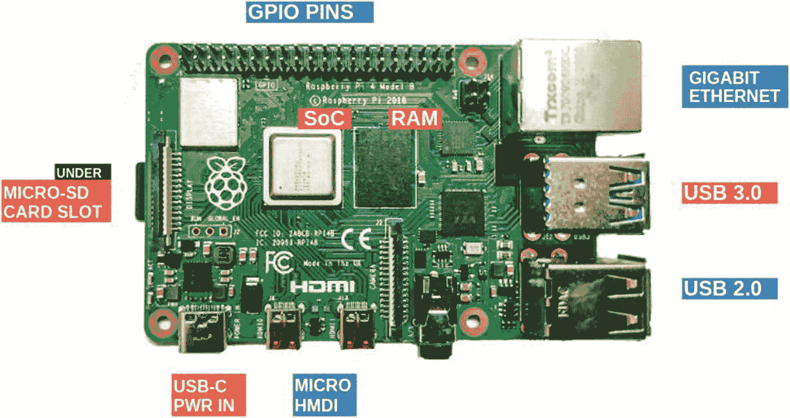

图 3-1

Raspberry Pi 硬件

### 片上系统

图 [3-2](#Fig2) 所示的*片上系统* (SoC)，是树莓派的大脑。这个小芯片由许多重要部分组成:中央处理器(CPU)、图形处理器(GPU)和数字信号处理器。

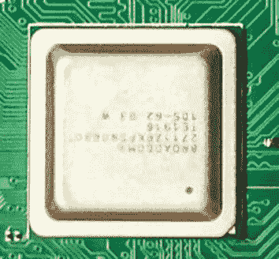

图 3-2

片上系统

树莓 Pi 4 model B 拥有强大的 Broadcom BCM2711 (1.5 GHz 64 位四核)SoC。Pi 的 CPU 执行基本算术、逻辑、控制和输入/输出等操作，而 Pi 的 GPU 用于处理多媒体任务，如数字图像处理、绘制 3D 图形和玩游戏。

### 树莓皮公羊

随机存取存储器(RAM)是树莓 Pi 4 model B 中位于 SoC 旁边的黑色矩形，如图 [3-3](#Fig3) 所示。在以前版本的 Raspberry Pi 中，RAM 封装在 SoC 内部。Pi 4 提供了三种 LPDDR4 RAM 选择:1GB、2GB 和 4GB。

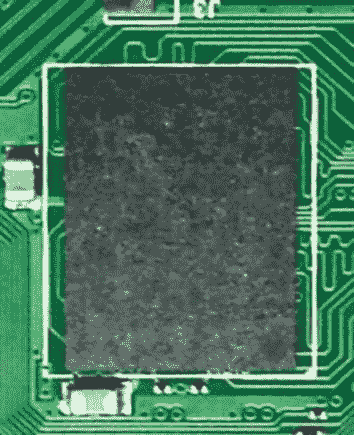

图 3-3

树莓皮公羊

RAM 存储应用程序使用的短期数据，当 Raspberry Pi 关闭时，这些数据将被删除。RAM 由中央处理单元和图形处理单元共享。

### 连通性

树莓 Pi 4 型号 B 具有板载 Wi-Fi、蓝牙和千兆以太网。这些功能对于远程访问 Raspberry Pi 非常方便，使其成为物联网(IoT)项目的理想硬件选择。这也释放了 USB 端口和 GPIO 引脚，用于连接外部 Wi-Fi 和蓝牙模块。

## 设置树莓 Pi

本节解释如何设置树莓 Pi。

### 微型存储卡

与台式机和笔记本电脑不同，Raspberry Pi 使用 microSD 存储卡来存储文件、应用程序甚至操作系统。与硬盘相比，microSD 存储卡体积较小，易于使用。Pi 至少需要 8GB 的内存。对于数据科学项目，建议使用 16GB 或 32GB 的 microSD 存储卡。建议使用 10 级超高速(UHS)存储卡，以便更快地读取/写入数据。

### 安装操作系统

Raspbian 是树莓 Pi 基金会发布的树莓 Pi 的官方和最常用的操作系统。使用 Raspberry Pi Imager 软件可以很容易地将其安装在 microSD 卡上，如图 [3-4](#Fig4) 所示。树莓派还支持其他操作系统，如 Ubuntu 和 Windows 10 IOT 核心。

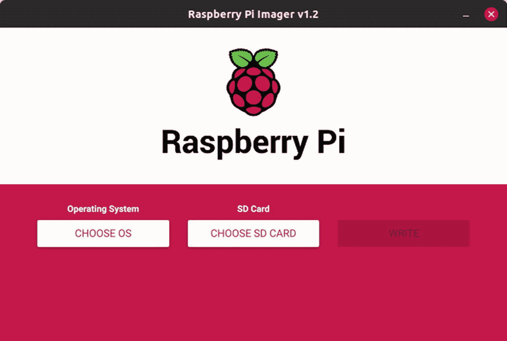

图 3-4

Raspberry Pi 成像仪软件的界面

按照以下说明在您的 Raspberry Pi 中安装 Raspbian 操作系统:

1.  访问 Raspberry Pi 网站的下载页面，并在您的操作系统上下载 Raspberry Pi 成像仪软件。

2.  下载完成后，通过单击启动安装程序。

3.  将 microSD 存储卡插入电脑。请务必备份卡中的任何重要数据，因为存储在卡中的任何数据都将被格式化。

4.  选择您想要安装的 Raspbian 或其他所需的操作系统，以及您想要安装的 microSD 卡。

5.  最后，单击 Write 按钮，等待操作完成。

### 插入 microSD 存储卡

树莓 Pi 底面的细金属槽，如图 [3-5](#Fig5) 所示，是 microSD 存储卡槽。一旦操作系统安装在 microSD 存储卡上，将其插入 Raspberry Pi 的存储卡插槽。

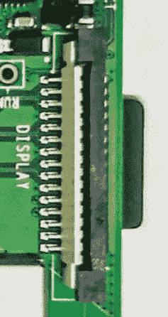

图 3-5

MicroSD 卡插槽

由于操作系统与其他文件一起存储在 microSD 存储卡上，这使得 Pi 的存储器可移植。microSD 存储卡可以插入新的 Raspberry Pi，它会像魔咒一样工作。

### 连接键盘和鼠标

图 [3-6](#Fig6) 显示了 Raspberry Pi 引脚的 USB 端口。树莓 Pi 4 型号 B 有两个 USB 2.0 端口(黑色)和两个通用串行总线(USB) 3.0 端口(蓝色)。USB 可用于连接键盘、鼠标、网络摄像头和其他 USB 外围设备。USB 3.0 端口比 USB 2.0 端口快大约 10 倍。通常，键盘和鼠标等外围设备连接到 USB 2.0 端口，而更快的 USB 3.0 端口则用于硬盘和网络摄像头等设备。

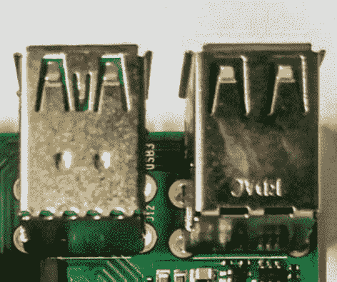

图 3-6

USB 连接埠

如果您有无线键盘和鼠标而不是有线组合，可以通过将 USB 加密狗连接到两个黑色端口中的一个来将它们连接到 Raspberry Pi。这也释放了一个 USB 端口，可用于连接其他设备。

### 连接显示器

Raspberry Pi 可以通过图 [3-7](#Fig7) 所示的 micro-HDMI 端口连接到显示器。HDMI 代表高清多媒体接口，Raspberry Pi 从该端口提供组合音频和视频输出。Raspberry Pi model 4 带有两个支持 4K 的微型 HDMI 端口，这意味着您可以同时将两个 4K 显示器连接到 Raspberry Pi。

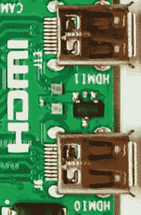

图 3-7

HDMI 端口

如果您的电视或显示器支持 HDMI 输入，那么您将需要一根微型 HDMI 转 HDMI 电缆来将 Raspberry Pi 连接到您的电视或显示器。旧版本的 Raspberry Pi 带有一个 HDMI 端口。如果您的电视或显示器有 VGA 输入，那么您需要使用微型 HDMI-VGA 适配器将其连接到 Raspberry Pi。同样，您可以将 HDMI 转 DVI 电缆用于带有 DVI 输入的显示器。

### 为树莓派供电

树莓派 4 B 需要通过 5.1V DC USB-C 型连接器供电，如图 [3-8](#Fig8) 所示，最小电流输入为 3A。它也可以通过 GPIO 接头供电。USB-C 型电源端口位于树莓派的一角附近。没有一款 Raspberry Pi 机型有开/关开关；一旦你将树莓派连接到电源，它就会打开。

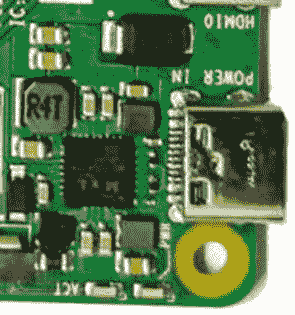

图 3-8

USB-C 型连接器

提供不正确的电压或不足的电流会导致树莓皮损坏；因此，建议使用官方的 Raspberry Pi 电源。

### 树莓皮围栏

Raspberry Pi 需要封装在一个盒子里，以防止裸露的连接和 GPIO 头。树莓派有多种外壳案例可供选择，或者您可以自己制作案例，但建议使用树莓派基金会发布的官方案例。还提供带冷却风扇的机箱。它们可用于防止 Pi 在运行重型应用程序时过热。

## 树莓 Pi 版本

本节解释了不同的版本。

### 树莓 Pi 1

树莓 Pi B 是树莓 Pi 基金会在 2012 年推出的第一款机型，随后在 2013 年推出了 Pi A。它们有 26 个 GPIO 引脚，700MHz 处理器，256MB/512MB 内存，没有任何内置 Wi-Fi 或蓝牙。2014 年发布了 40 个 GPIO 引脚的紧凑型 Pi A+和改进的 B+型号。

### 树莓 Pi 2

树莓 Pi 2 于 2015 年发布，采用改进的 900MHz 四核处理器和 1GB RAM。这款机型有 40 个 GPIO 引脚，没有内置 Wi-Fi 或蓝牙。它有四个 USB 2.0 端口、一个以太网端口和一个 HDMI 端口。

### 树莓 Pi 3

2016 年，树莓 Pi 3 发布。它有一个 1.2GHz 的四核处理器和 1GB 内存。这个型号有 40 个 GPIO 引脚，这是第一个内置 Wi-Fi 和蓝牙的 Raspberry Pi 型号。类似于 Raspberry Pi 2，它有四个 USB 2.0 端口，一个以太网端口和一个 HDMI 端口。2018 年晚些时候，推出了紧凑型 Pi 3 A+和改进的 Pi 3 B+车型。

### 树莓派零度(W/WH)

2015 年推出了小尺寸、低成本、GPIO 引脚更少的 Raspberry Pi Zero。Pi Zero W 于 2017 年发布，内置 Wi-Fi 和蓝牙。接下来是预焊 GPIO 头附带的 Pi 零 WH。

### 树莓 Pi 4

树莓 Pi 4 model B 于 2019 年发布，拥有强大的 1.5GHz 四核处理器和 1GB/2GB/4GB RAM 选项。这是第一款带有双 4K 显示输出、USB-C 型电源输入和两个 USB 3.0 端口的型号。

### 推荐树莓 Pi 版本

有不同版本的 Raspberry Pi 可用，但建议数据科学项目使用 Raspberry Pi 4，因为它比其他版本更强大，并且还提供高达 4GB 的 RAM 选项。

Raspberry Pi Zero WH 是可用的 Raspberry Pi 的最小变体，当单板计算机的尺寸需要很小时，建议使用它。但它配备了相对较慢的处理器、更少的 RAM 和更少的 GPIO 引脚。

## Raspberry Pi 与传感器的接口

本节重点介绍如何将 Raspberry Pi 与传感器连接起来。

### GPIO 引脚

图 [3-9](#Fig9) 所示的 GPIO 引脚是 Raspberry Pi 最强大的功能之一。GPIO 引脚是沿着电路板边缘的一排小引脚。最近发布的所有 Raspberry Pi 版本都有一个 40 引脚 GPIO 头。这些图钉是树莓派和现实世界之间的联系。GPIO 引脚可以在软件中指定为输入或输出，并可用于各种目的，如打开/关闭 led、控制伺服电机以及从传感器获取数据。它们可以用 Python 或任何其他语言编程，如 Scratch 或 C/C++。

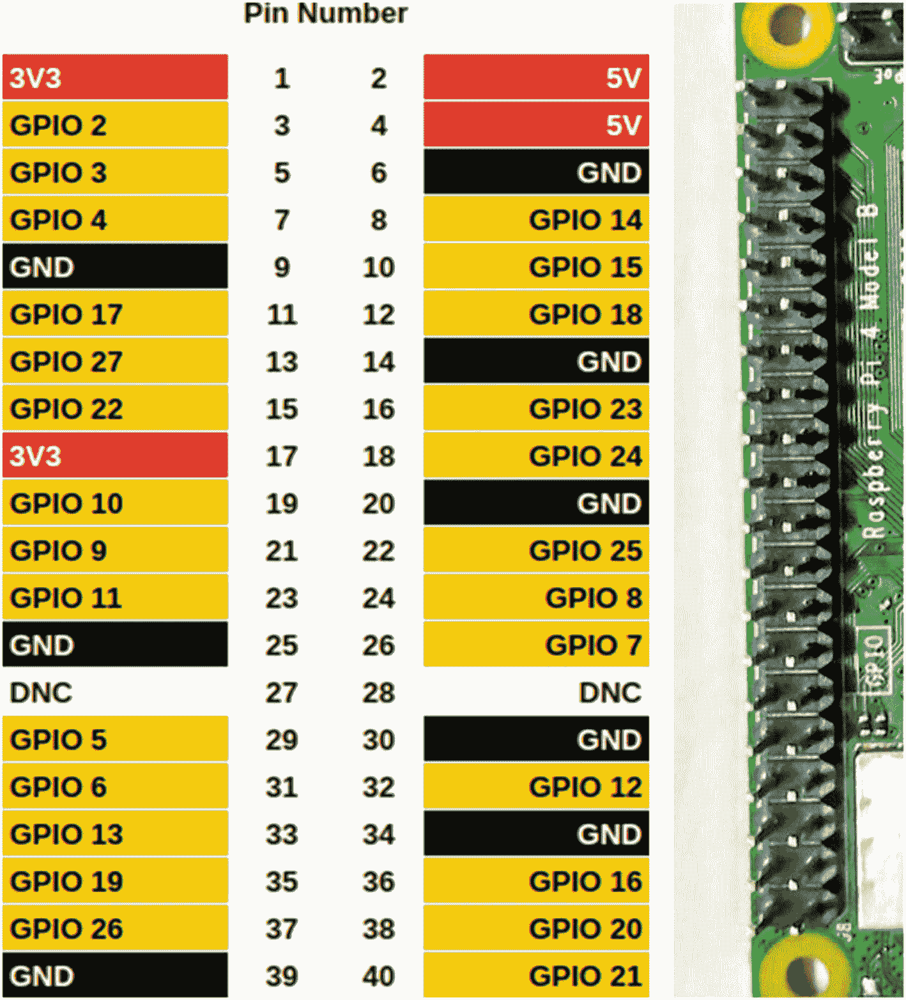

图 3-9

Raspberry Pi GPIO 引脚

### GPO 皮诺曹

在连接到 Raspberry Pi GPIO 引脚之前，我们需要知道 GPIO 引脚参考。引脚排列配置不打印在 Raspberry Pi 上，但是我们可以通过打开终端窗口并键入命令`pinout`来获取任何 Raspberry Pi 的引脚排列参考。这个工具是由`gpiozero`库提供的，预装在 Raspbian OS 上。

### GPIO 输出

树莓 Pi 有两个 5V 管脚和两个 3V3 管脚；它还有 8 个无法配置的接地引脚(0V)。其余 28 个引脚都是通用 3V3 引脚。这些引脚的输出设置为 3V3，或者可以接收最高 3V3 的输入。指定为输出引脚的 GPIO 引脚可以设置为高电平(3V3)或低电平(0V)。

### 用 Python 控制 GPIO 输出

使用 Python 的`gpiozero`库可以轻松控制 GPIO 引脚。让我们看一个简单的 Python 例子，演示如何打开/关闭连接到 GPIO 引脚的 led。led 总是需要通过一个电阻连接到 GPIO 引脚。电阻器将确保只有小电流在电路中流动；因此，树莓派或 LED 将受到保护免受损坏。

我们将通过一个 330ω的电阻将一个 LED 连接到 GPIO 引脚 17，如图 [3-10](#Fig10) 所示。现在，可以使用清单 [3-1](#PC1) 中给出的 Python 代码让 LED 持续打开和关闭。`led.on()`功能打开 LED，`led.off()`功能关闭 LED。

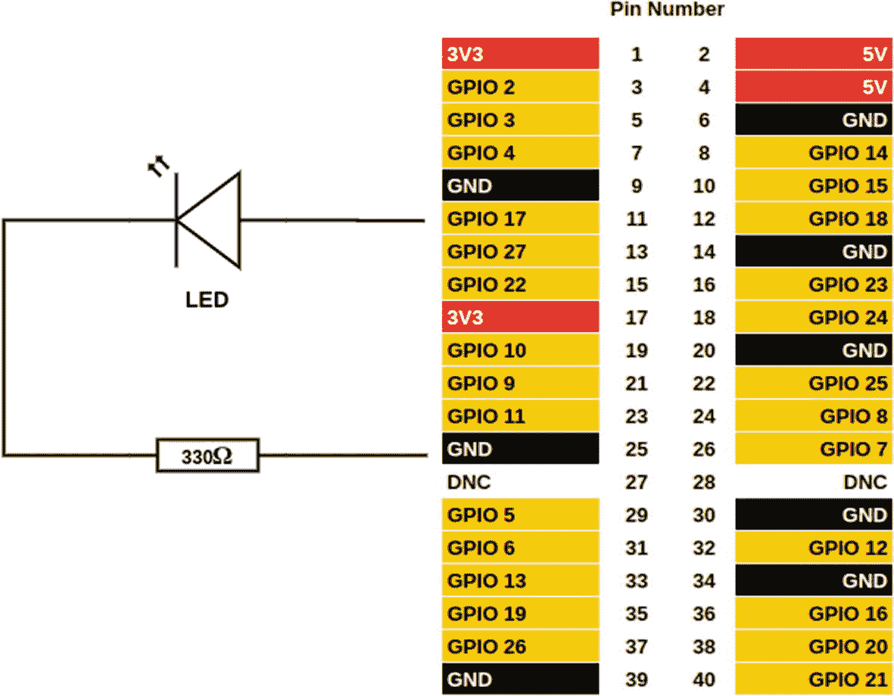

图 3-10

将 LED 连接到 GPIO 引脚

```py
from gpiozero import LED
from time import sleep
led = LED(17)
while True:
      led.on()
      sleep(1)
      led.off()
      sleep(1)

Listing 3-1LED Function Using GPIO

```

### GPIO 输入信号

指定为输入引脚的 GPIO 引脚可以读取为高电平(3V3)或低电平(0V)。这意味着 GPIO 引脚不支持模拟输入，只能接收数字输入。虽然 Raspberry Pi 中没有模数转换器硬件，但我们可以使用 MCP3008 等外部 ADC 从传感器读取模拟数据。

#### 用 Python 读取 GPIO 输入

通过将传感器连接到 GPIO 引脚，可以轻松地与 Raspberry Pi 接口。通过将传感器的 VCC 连接到树莓 Pi 的 3.3V/5V，并将传感器的 GND 连接到树莓 Pi 的 GND，可以为传感器供电。传感器的数字输出可以直接连接到 GPIO 引脚并读取。但在读取模拟输出时，模数转换器需要将模拟传感器与 Raspberry Pi 接口。

##### 来自传感器的数字信号

Raspberry Pi 将任何低于 1.8V 的输入视为低电平(0)，将任何高于 1.8V 的输入视为高电平(1)，如图 [3-11](#Fig11) 所示。使用`InputDevice.value`功能可以轻松读取任何传感器的数字输出数据。该函数返回给定 GPIO 引脚的当前状态。


图 3-11

低和高输入

清单 [3-2](#PC2) 中的代码每秒打印一次 GPIO 管脚 17 的状态。

```py
from gpiozero import InputDevice
from time import sleep
sensor = InputDevice(17, pull_up=True)
while True:
      print(sensor.value)
      sleep(1)

Listing 3-2State of GPIO

```

##### 来自传感器的模拟信号

图 [3-12](#Fig12) 显示了一个模拟信号。要从传感器或其它器件读取模拟信号，我们应该使用一个模数转换器，如用于 Raspberry Pi 的 MCP3008。ADC 将模拟信号转换成数字信号。串行外设接口(SPI)协议用于将 ADC 的输出传输至 Raspberry Pi。

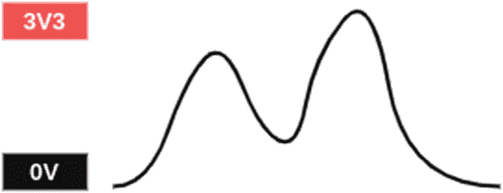

图 3-12

模拟信号

要启用 SPI 通信，请从主菜单打开 Raspberry Pi 配置，并在接口选项卡上启用 SPI。MCP3008 是一款 10 位 ADC，有 8 个输入通道(0–7)。让我们将模拟输入连接到 MCP3008 的第一个通道(0)和 MCP3008 的其他引脚，如图 [3-13](#Fig13) 所示。

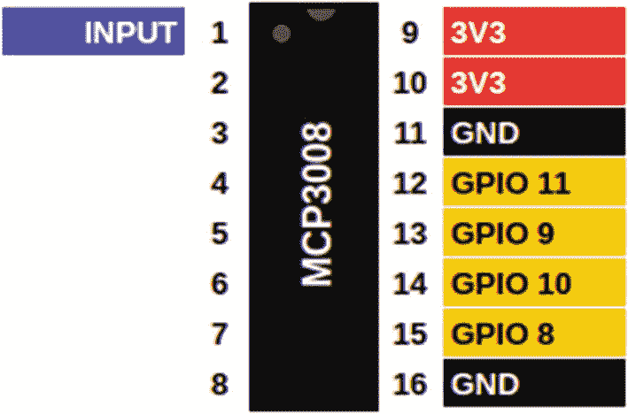

图 3-13

10 位模数转换器 MCP3008

清单 [3-3](#PC3) 中的代码每秒打印连接到 MCP3008 第一通道(0)的传感器的模拟值。由于 MCP3008 是一个 10 位 ADC，输出值范围为 0 至 1023。

```py
from gpiozero import MCP3008
from time import sleep
sensor = MCP3008(0)
while True:
      print(sensor.value)
      sleep(1)

Listing 3-3Implement the MCP3008

```

### 将超声波传感器与 Raspberry Pi 接口

超声波传感器通过发现声波的时间来测量物体的距离。HC-SR04 超声波传感器可用于测量 2 厘米至 400 厘米的距离，精度为 3 毫米。超声波传感器通过发出频率为 40kHz 的声波来工作，这一频率高于人类的听觉范围，并通过空气传播。如果有障碍物或物体，声波会反弹回传感器。物体的距离可以通过传播时间的一半乘以声速来计算。图 [3-14](#Fig14) 显示了超声波传感器及其引脚，其中 VCC 引脚需要连接到树莓 Pi 的正极端子，GND 引脚可以连接到树莓 Pi 的 GND 引脚，Trig 引脚用于触发超声波脉冲，Echo 引脚在接收到反射声波时产生脉冲。

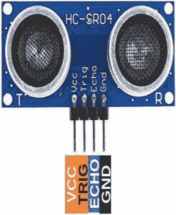

图 3-14

超声波传感器引脚

将超声波距离传感器连接到树莓皮上，如图 [3-15](#Fig15) 所示。

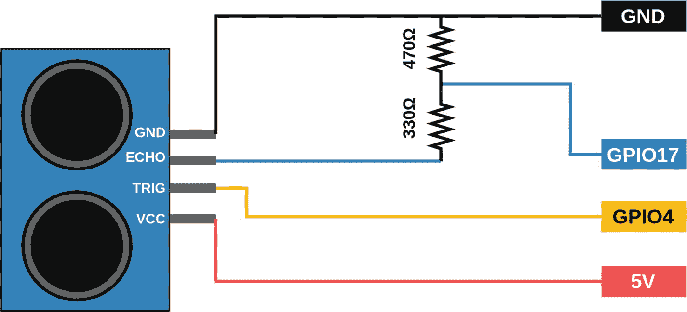

图 3-15

带 Raspberry Pi GPIO 引脚的超声波传感器

`gpiozero`库中有一个名为`DistanceSensor`的对象，可以使用 Python 中的超声波传感器来测量距离。距离函数返回超声波距离传感器测量的距离，单位为米。让我们将该值乘以 100，将其转换为厘米。清单 [3-4](#PC4) 中的代码连续打印超声波距离传感器每秒测量的距离，单位为厘米。

```py
from gpiozero import DistanceSensor
from time import sleep

sensor = DistanceSensor(echo=17, trigger=4)

while True:
    print(sensor.distance * 100)
    sleep(1)

Listing 3-4Code for calculting distance measured by the Ultrasonic Sensor

```

当代码运行时，移动放置在超声波传感器前面的物体的位置以获得不同的值。

### 将温度和湿度传感器与 Raspberry Pi 接口

顾名思义，这些传感器可以用来测量温度和湿度。它们由一个电容式湿度感测元件和一个用于感测温度的热敏电阻组成。温度和湿度传感器有一个专用的电阻式湿度测量组件，称为*负温度系数* (NTC)温度测量组件，以及一个 8 位微控制器，以串行数据的形式输出温度和湿度值。单总线数据格式用于 Raspberry Pi 和 DHT11 传感器之间的通信和同步。

DHT 11 和 DHT 22 是常用的温度和湿度传感器。图 [3-16](#Fig16) 显示了温度和湿度传感器(THD ),图 [3-17](#Fig17) 解释了 THD 与 Raspberry Pi 的接口，其中 VCC 引脚需要连接到 Raspberry Pi 的正极端子，GND 引脚可以连接到 Raspberry Pi 的 GND，信号/数据引脚用于串行通信，需要连接到 GPIO 引脚。

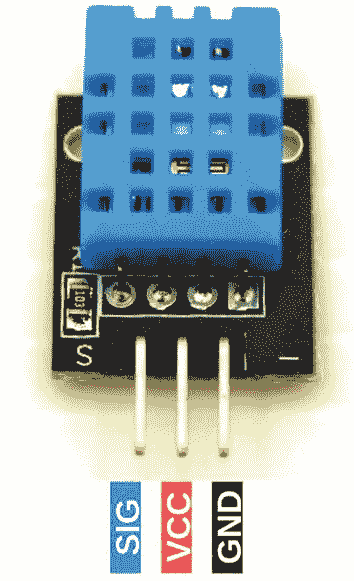

图 3-16

温度和湿度传感器

将 DHT 11/22 传感器模块连接到 Raspberry Pi，如图 [3-17](#Fig17) 所示。

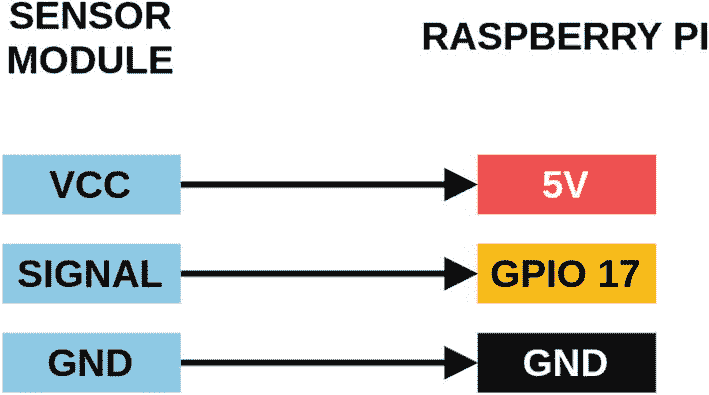

图 3-17

带 Raspberry Pi GPIO 引脚的温度和湿度传感器

让我们使用`Adafruit_DHT`库从传感器获取温度和湿度值。清单 [3-5](#PC5) 中的代码连续打印摄氏温度和湿度百分比。

```py
import Adafruit_DHT
import time

DHT_SENSOR = Adafruit_DHT.DHT11
DHT_PIN = 17

while True:
    humidity, temperature =
        Adafruit_DHT.read(DHT_SENSOR, DHT_PIN)
    if humidity is not None and temperature is not None:
        print("Temperature="{0:0.1f}C)
      humidity={1:0.1f}%".format(temperature, humidity))
    else:
        print("Sensor not connected.");
    time.sleep(3);

Listing 3-5Code for Temperature and Humidity Sensor

```

可以使用以下代码将 Adafruit 模块安装在 Raspberry Pi 中。

对于 Python 2:

```py
sudo pip install Adafruit_DHT

```

对于 Python 3:

```py
sudo pip3 install Adafruit_DHT

```

### 将土壤湿度传感器与树莓接口

土壤湿度传感器用于检测土壤中的湿度。土壤湿度传感器由两个探头组成，用于测量土壤中的湿度。该传感器使用电容来测量土壤的介电常数，它是土壤含水量的函数。该传感器配有模拟和数字输出，因此它可以在模拟和数字模式下使用。但是，让我们从传感器获取模拟信号，并使用 Python 读取它。图 [3-18](#Fig18) 所示为土壤湿度传感器。这里，VCC 引脚需要连接到 Raspberry Pi 的正端，模拟输出(AO)产生一个与介电常数成比例的电压，从而与土壤含水量成比例，当土壤湿度高于阈值时，数字输出(DO)产生一个脉冲。阈值使用传感器模块中的电位计设置，GND 引脚可以连接到 Raspberry Pi 的 GND。

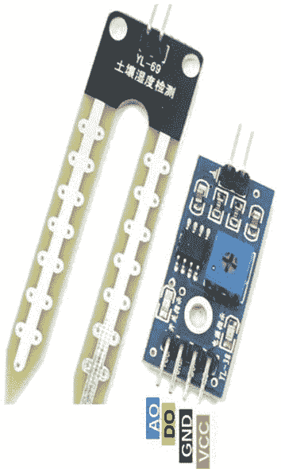

图 3-18

土壤湿度传感器

通过 MCP3008 ADC 将土壤湿度传感器模块连接到 Raspberry Pi，如图 [3-19](#Fig19) 所示。

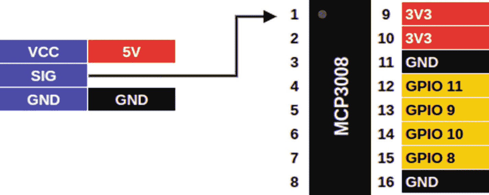

图 3-19

带 Raspberry Pi GPIO 引脚的温度和湿度传感器

让我们使用`gpiozero`库中的 MCP3008 模块从 MCP3008 中获取值。清单 [3-6](#PC8) 中的代码每秒连续打印土壤湿度传感器的模拟值。

```py
from gpiozero import MCP3008
from time import sleep

soil_sensor = MCP3008(0)

while True:
    print(soil_sensor.value)
    sleep(1)

Listing 3-6Code for interfacing soil moisture sensor

```

### 将相机与树莓 Pi 接口

相机是使用图像传感器记录图像的光学仪器。图像传感器检测并传送用于生成图像的信息。相机可以很容易地与 Raspberry Pi 接口，以获取图像或视频数据。有两个选项可用于将摄像机与 Raspberry Pi 接口。

**方法 1:** 第一种方法是使用 USB 端口将 USB 网络摄像头连接到 Raspberry Pi。图 [3-20](#Fig20) 显示了一个 USB 网络摄像头。一旦 USB 网络摄像头连接正确，就可以使用`OpenCV`库在 Python 中访问它。`OpenCV`是一个用于图像处理和实时计算机视觉的 Python 库。清单 [3-7](#PC9) 中的代码可用于将 USB 网络摄像头连接到 Raspberry Pi。

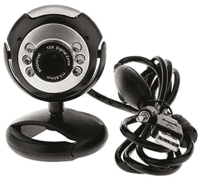

图 3-20

USB 网络摄像头

```py
import cv2

videoCaptureObject = cv2.VideoCapture(0)
result = True

while(result):
    ret,frame = videoCaptureObject.read()
    cv2.imwrite("/home/pi/Desktop/webcam_image.jpg ",frame)
    result = False

videoCaptureObject.release()
cv2.destroyAllWindows()

Listing 3-7Code for Connecting USB Web Cameras with the Raspberry Pi

```

**方法 2:** 另一种方法是通过摄像头串行接口(CSI)端口连接 Raspberry Pi 摄像头模块。图 [3-21](#Fig21) 为树莓派相机。有两个 Raspberry Pi 相机模块可供选择:一个标准模块和一个黑色相机模块，用于在黑暗中拍照。要启用 Raspberry Pi 摄像头，请从主菜单打开 Raspberry Pi 配置，并在接口选项卡上启用摄像头。

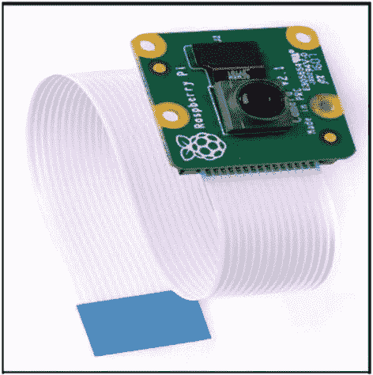

图 3-21

带 CSI 的 Raspberry Pi 摄像机

清单 [3-8](#PC10) 中的代码从 Raspberry Pi 相机模块中获取一张图片，并将图片存储在指定的位置。

```py
from picamera import PiCamera
from time import sleep

camera = PiCamera()

camera.start_preview()
sleep(5)
camera.capture('/home/pi/Desktop/cammodule_img.jpg')
camera.stop_preview()

Listing 3-8Code for Connecting Raspberry Pi Camera with the Raspberry Pi

```

## 作为边缘设备的树莓皮

在数据源或其附近进行的计算被称为*边缘计算*。在需要即时或实时计算的领域，以及无法连接到中央云或连接受限的远程位置，边缘计算优于云计算。边缘计算的最大优势是其减少延迟的能力，因为传感器收集的数据在边缘设备中处理，不需要传输到数据中心。见图 [3-22](#Fig22) 。

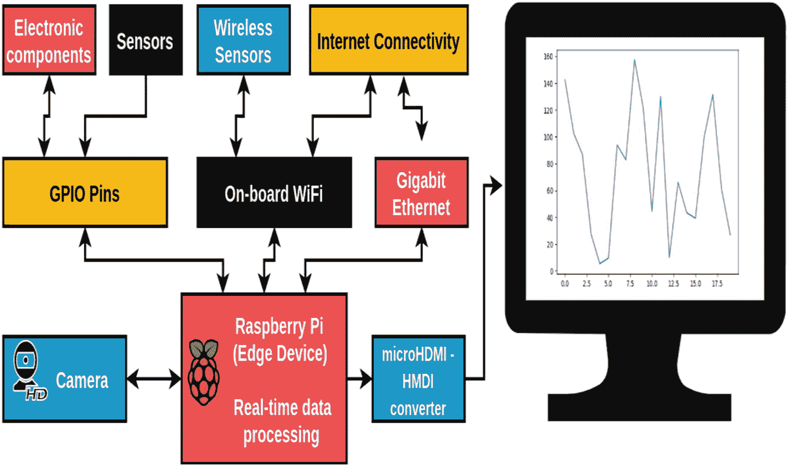

图 3-22

树莓皮作为边缘装置

### 无人驾驶汽车中的边缘计算

自动驾驶汽车将依赖边缘计算，因为在路上行驶时，每一毫秒都非常重要。从他们的传感器和相机收集的大量数据不能被发送到云中进行分析，因为这将花费相当多的时间，并且还需要不间断的网络。因此，边缘计算因其更快的速度和高可靠性而成为这类应用的首选。

### 什么是边缘设备？

边缘计算在边缘设备中完成。边缘设备能够实时收集、存储和处理数据。因此，边缘设备提供了更快的响应并具有更好的可靠性。传感器和其他设备通过有线电缆或无线连接(如 Wi-Fi 或蓝牙)连接到边缘设备，如图 [3-22](#Fig22) 所示。有时，边缘设备连接到一个集中式云，用于大数据处理和数据仓库。

### 使用 Raspberry Pi 进行边缘计算

Raspberry Pi 具有良好的计算能力，能够通过有线和无线连接来连接传感器和设备。Raspberry Pi 还支持许多计算机编程语言，如 Python、C/C++和 Java。这使得 Raspberry Pi 成为边缘计算的绝佳选择。

## 作为本地化云的 Raspberry Pi

在这一章中，我们将讨论使用 Raspberry Pi 作为本地化的云。

### 云计算

云计算是使用互联网上的远程服务器网络来存储、管理和处理数据的实践。这些远程服务器被称为*云服务器*，位于世界各地的数据中心。从这类服务器访问数据需要强大的互联网连接。

### 树莓 Pi 作为本地化云

如今，物联网设备高速生成海量数据。通常，这些数据需要实时处理才能做出快速决策，而这可以由本地化云提供支持。此外，一些物联网传感器网络部署在互联网连接稀疏的偏远地区，这对本地化云的概念提出了挑战。Raspberry Pi 可以作为本地化的云来支持更接近物联网网络的实时数据处理。它需要通过以太网或 Wi-Fi 连接到网络。作为本地化云的 Raspberry Pi 可用于存储和处理从传感器或其他设备(如电脑和手机)收集的数据，如图 [3-23](#Fig23) 所示。

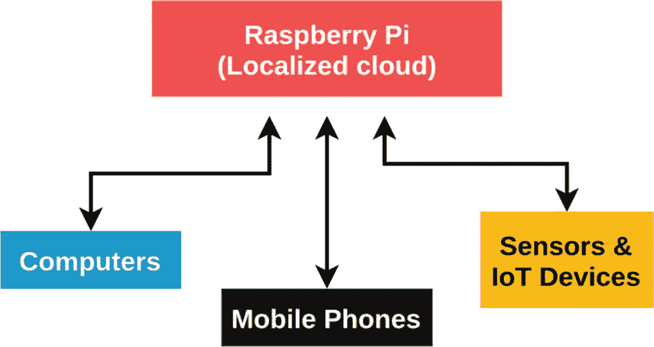

图 3-23

作为本地化云的 Raspberry Pi

### 连接外部硬盘

外部硬盘驱动器可以连接到 Raspberry Pi 以增加其存储容量。这些硬盘需要使用外部电源供电。如果没有电源，它们可以通过通电的 USB 集线器连接。这种增强的存储可以让 Raspberry Pi 收集和处理来自物联网网络的大量实时数据。

### 连接 USB 加速器

Coral USB Accelerator 是一个超快速的开发板，用于深度学习从业者在不需要互联网的情况下部署他们的模型，从而实现边缘计算。它为树莓派带来了机器学习界面。它由一个边缘 TPU 协处理器组成，每秒能够执行 4 万亿次运算(万亿次运算)。这使得实时运行 ML 模型成为可能。例如，该设备可以帮助 Raspberry Pi 以 400 FPS 的速度运行 MobileNet v2 模型。