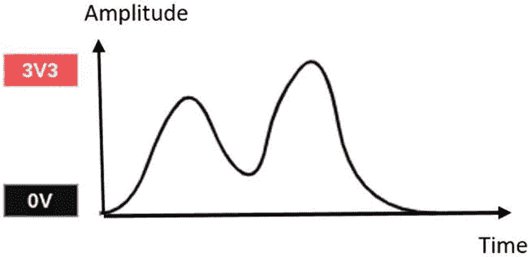
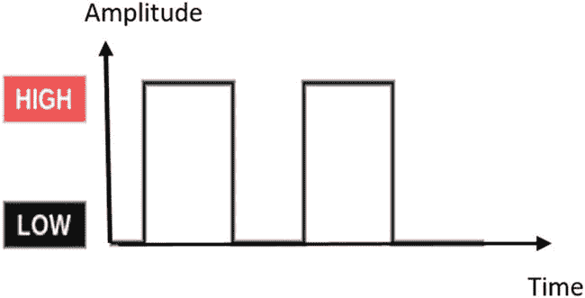
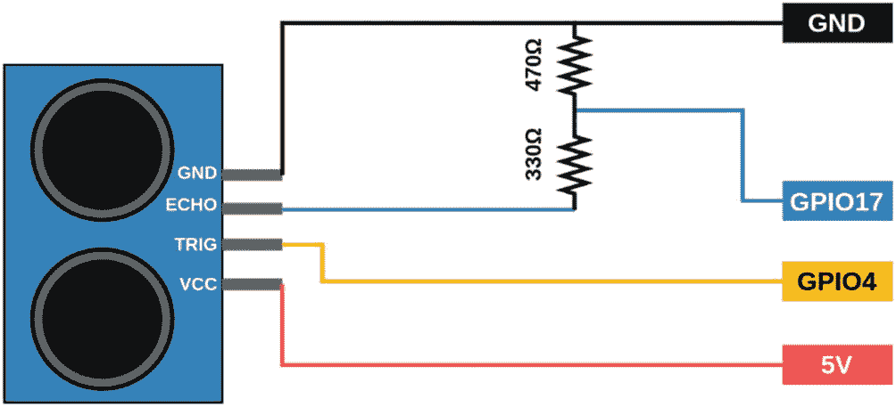
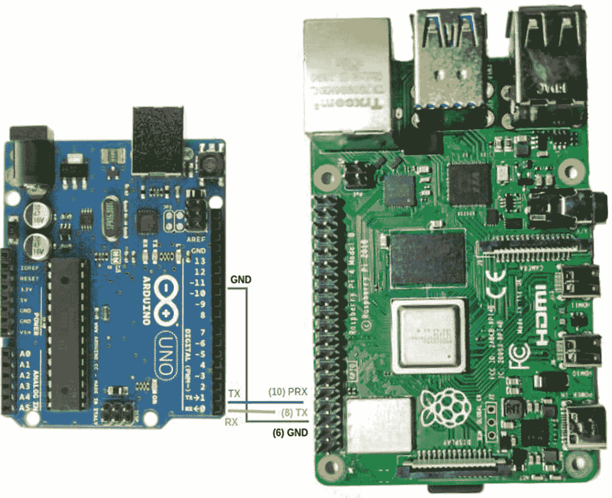

# 四、传感器和信号

本章包括传感器和信号。

## 信号

通常，信号代表关于时间或空间的一些信息。例如，汽车速度随时间的变化就是一种信号。信息可以以信号的形式传递。在电气工程中，信号是一个携带时间或空间信息的函数。电气设备以电压、电流或电磁波的形式显示信号。根据 *IEEE 信号处理汇刊*，信号可以是音频、视频、语音、图像、声纳、雷达相关等等【1】。同样，从数学上讲，信号是一个或多个独立变量的函数。自变量就是那些不会被你试图测量的其他变量改变的变量。例如，考虑温度随时间的变化。这里，时间是独立变量，因为时间不会因为温度的变化而改变。

本章讨论如何通过 Raspberry Pi 使用传感器从实时环境中获取信息，然后将这些信息转换为结构化数据。传感器输出是电信号的形式。本章首先描述关于信号及其各种类型。信号有许多分类，我们集中描述以下电信号:

*   模拟和数字信号

*   连续时间和离散时间信号

*   确定性和非确定性信号

*   一维信号、二维信号、多维信号

## 模拟和数字信号

a *模拟信号*表示相对于独立变量(即时间)连续变化的物理量的瞬时值。简单来说，模拟信号在时间和幅度上都是连续的。物理量可以是温度、压力、速度等。传感器可以将物理量的变化转换成电信号，如电压或电流。这样，可以使用传感器以电信号的形式收集实时环境数据。

*数字信号*是用于将数据表示为离散值序列的信号。独立变量(即时间)是离散的，并且具有量化的振幅。通过对模拟信号进行采样和量化，可以获得数字信号。在任何给定时间，数字信号只能呈现有限数量的值中的一个。

## 连续时间和离散时间信号

*连续时间信号*或*连续信号*是在其域(通常是时间)的连续体上定义的信号。任何模拟信号本质上都是连续的。

*离散时间信号*或*离散信号*是自变量(时间)只有离散值的信号。它是由一系列数量组成的时间序列。数字信号处理中使用的离散时间信号可以通过对连续信号进行采样和量化来获得。

## 确定性和非确定性信号

*确定性信号*是相对于其在任何时刻的值没有不确定性的信号。换句话说，可以使用数学公式精确定义的信号是确定性信号。

*非确定性信号*或*随机信号*是在某一时刻其值具有不确定性的信号。由于其随机性，该信号也被称为*随机信号*，并且该信号不能用数学方程来描述。

## 一维、二维和多维信号

一个*一维信号*仅仅是一个独立变量的函数。语音信号是一维信号的一个很好的例子，因为语音的幅度只取决于一个自变量(即时间)。

同样，如果信号是两个因变量的函数，则该信号称为*二维信号*。灰度图像是二维信号的一个例子。空间坐标(x，y)是图像中的两个独立变量。*多维信号*是两个以上变量的函数。电影(即视频)是多维信号的最佳例子。

## 收集实时数据

收集数据有两种方式:手动和自动。在手动方法中，可以从现有文件和文档中收集数据。然后，可以手动将收集的数据组织成结构化的方式(即，表格格式)。在自动化领域，可以使用一些叫做传感器的设备来收集数据。温度、压力、图像等物理量的实时信息。，可以使用传感器收集。本章重点描述使用传感器的自动数据收集。为了使数据收集自动化，需要数据采集系统。本节说明如何使用传感器收集数据，如超声波传感器、湿度、温度和来自摄像机的图像数据。此外，还讨论了以结构化格式存储收集的数据。

## 数据采集

对测量真实世界物理条件的信号进行采样，并将结果样本转换为可由计算机处理的数字数值的过程称为*数据采集*。数据采集系统(DAS 或 DAQ)通常将模拟信号转换为数字值进行处理。数据采集系统包括以下三个部分:

*   传感器

*   信号调理电路

*   模数转换器

### 传感器

通常，传感器产生与环境变化相对应的电信号。传感器是一种转换温度、湿度、距离等物理参数的装置。转换成电信号。传感器可以是能够检测环境中的事件或变化并将信息发送到其他电子设备(通常是计算机处理器)的设备、模块、机器或子系统。例如，热电偶是一种温度传感器，它根据输入温度变化产生输出电压。根据其输出信号类型，有两种类型的传感器:模拟和数字。

### 模拟传感器

模拟传感器产生连续的输出信号或电压，通常与被测量的量成比例。这些传感器通常产生随时间平滑连续变化的输出信号。见图 [4-1](#Fig1) 。



图 4-1

模拟信号

以下代码每秒连续打印连接到 MCP3008 第一个通道(0)的传感器的模拟值。由于 MCP3008 是一个 10 位 ADC，输出值范围为 0 至 1023。

```py
from gpiozero import MCP3008
from time import sleep

sensor = MCP3008(0)

while True:
    print(sensor.value)

```

### 数字传感器

数字传感器产生数字输出信号或电压，这些信号或电压是被测量量的数字表示。在这些传感器中，数据转换和数据传输以数字方式进行。见图 [4-2](#Fig2) 。



图 4-2

数字信号

以下代码连续打印 GPIO 引脚 17 的数字状态:

```py
from gpiozero import InputDevice
from time import sleep

sensor = InputDevice(17, pull_up=True)

while True:
    print(sensor.value)]

```

下面列出了电子行业中一些常见的传感器:

*   温度传感器

*   红外传感器

*   超声波传感器

*   压力传感器

*   近程传感器

*   触摸传感器

*   液位传感器

*   烟雾和气体传感器

## 什么是实时数据？

*实时数据(RTD)* 是收集后立即传递给最终用户的信息。实时数据可以是静态的，也可以是动态的，通常使用*实时计算进行处理。*

### 实时数据分析

实时分析是指在收集数据后立即对收集的数据进行分析。实时数据分析使我们能够毫不延迟地做出决策，并能够防患于未然。

在这里，我们将讨论如何从摄像机获取关于距离、湿度、温度和图像数据的实时数据。

### 从超声波传感器获取实时距离数据

超声波传感器的基本原理是发射和接收声波。物理变量(如距离、水平、高度、流量等。)可以基于发射波和接收回波声波之间的持续时间来计算。

### 将超声波传感器与 Raspberry Pi 接口

第 [3](3.html) 章已经讨论了超声波传感器与 Raspberry Pi 的接口。我们将从 HC-SR04 超声波传感器收集数据，该传感器可用于测量 2 厘米至 400 厘米的距离，精度为 3 毫米。这里，我们的目标是将超声波距离传感器与 Raspberry Pi 接口，并将收集的数据保存为 CSV 格式。为此，可以将超声波距离传感器连接到 Raspberry Pi GPIO 引脚，如图 [4-3](#Fig3) 所示。



图 4-3

超声波传感器与 Raspberry Pi GPIO 引脚连接

正如在第 [3](3.html) 章中所提到的，我们将使用`gpiozero`库中的`DistanceSensor`对象。`distance`函数返回超声波距离传感器测量的距离，单位为米。为了以厘米为单位显示，我们需要将该值乘以 100。下面的代码以厘米为单位打印超声波距离传感器每秒测量的距离，并在 100 秒后保存收集的数据。

```py
from gpiozero import DistanceSensor
from time import sleep

sensor = DistanceSensor(echo=17, trigger=4)

n = 100
for i in range(n):
    print(sensor.distance * 100)
    sleep(1)

```

当代码运行时，移动放置在超声波传感器前面的物体的位置以获得不同的值。测量的距离(单位 cm)连续打印 *n* 秒；在我们的例子中，是 100。

## 从摄像机获取实时图像数据

本节说明如何从网络摄像头获取实时视频。

### 从网络摄像头获取实时视频

通过 USB 端口将 USB 网络摄像头连接到 Raspberry Pi。使用`OpenCV` Python 库，我们可以访问网络摄像头并从中捕捉图像和视频。以下代码可用于从网络摄像头获取实时视频。可以实时分析收集的帧。

```py
import cv2
vid = cv2.VideoCapture(0)

while(True):

    ret, frame = vid.read()
    cv2.imshow('frame', frame)

    if cv2.waitKey(1) & 0xFF == ord('q'):
        break

vid.release()
cv2.destroyAllWindows()

```

### 从 Pi-cam 获取实时视频

通过摄像头串行接口(CSI)端口将 Raspberry Pi 摄像头模块连接到 Raspberry Pi。要启用 Raspberry Pi 摄像头，请从主菜单打开 Raspberry Pi 配置，并在接口选项卡上启用摄像头。以下代码可用于使用 Raspberry Pi 摄像头模块捕捉图像，并将捕捉到的图像存储在指定位置:`/home/pi/Desktop/cammodule_img.jpg`。

```py
from picamera import PiCamera
from time import sleep

camera = PiCamera()

camera.start_preview()
sleep(5)
camera.capture('/home/pi/Desktop/cammodule_img.jpg')
camera.stop_preview()

```

## 数据传送

数据传输或数据传送是指在两个或多个数字设备之间传送数据的过程。数据以模拟或数字格式传输，数据传输过程使设备或设备内的组件能够相互通信。

### 串行和并行通信

串行通信是通过通信信道或计算机总线一次一位地顺序发送数据的过程。并行通信是一种同时传送多个二进制数字(位)的方法。

### Arduino 与 Raspberry Pi 的接口

我们可以将 Arduino 连接到 Raspberry Pi，并将数据从 Arduino 传输到 Raspberry Pi，反之亦然。传感器、电机和致动器可以连接到 Arduino，并使 Arduino 向/从 Raspberry Pi 传输值。通过这样做，我们可以使用 Arduino 作为节点，并通过这些节点获取传感器数据。

Arduino 可以通过两种方式连接到 Raspberry Pi。

*   通过 USB 进行串行通信

*   通过 GPIO 引脚进行串行通信

#### 通过 USB 串行

使用 Arduino USB 电缆连接两块电路板是在 Arduino 和 Raspberry Pi 电路板之间建立通信的最简单方法。

在 Raspberry Pi 上，选择板上可用的四个 USB 端口中的任意一个，并连接 USB 连接器。将 Arduino USB 电缆的另一端连接到 Arduino。不同版本的 Arduino 的连接器电缆会有所不同。

#### 通过 GPIOs 串行

也可以使用普通导线在 Raspberry Pi GPIOs 和 Arduino 引脚之间建立串行连接。根据你的 Arduino 板，可能需要一个电压电平转换器。

Raspberry Pi 的工作电压为 3.3V，而诸如 Uno、Mega、Leonardo、Nano 等 Arduino 板的工作电压为 3.3V。工作电压为 5V。因此，在连接 RX 和 TX 引脚时，需要使用 3.3V/5V 电平转换器来保护 Raspberry Pi，如图 [4-4](#Fig4) 所示。



图 4-4

通过 GPIO 引脚连接 Arduino 和 Raspberry Pi

一般来说，建议使用 Arduino USB 电缆而不是 GPIOs 进行串行通信。

### Arduino 和 Raspberry Pi 之间的数据传输

当通过 USB 电缆将 Arduino 连接到 Raspberry Pi 时，在 Raspberry Pi 终端窗口中运行命令`ls /dev/tty*`来查找 Arduino 设备的名称。它应该返回类似于`/dev/ttyACM0`或`/dev/ttyUSB0`的东西。

`pySerial` Python 库用于制作与 Python 的串行接口，封装了对串口的访问。

以下代码可用于在 Arduino 和 Raspberry Pi 之间进行双向通信。

#### Arduino 伫列

以下是 Arduino 代码:

```py
void setup() {
Serial.begin(9600);
}
void loop() {
  if (Serial.available() > 0) {
    String data = Serial.readStringUntil('\n');
    Serial.print("Received Data: ");
    Serial.println(data);
  }
}

```

`Serial.available()`将给出已经到达并存储在接收缓冲区中的字节数。这可用于检查 Arduino 是否已接收到数据。

如果一些数据已经到达，`Serial.readStringUntil()`与换行符`\n`一起使用来获得下一行。在换行符`\n`之前收到的所有字节都被自动转换并添加到 Arduino `String`对象中。

然后，我们只返回包含接收到的数据和一些附加文本的字符串。

#### Raspberry Pi Python 代码

下面是显示串行数据的 Raspberry Pi Python 代码:

```py
#!/usr/bin/env python3
import serial
import time

if __name__ == '__main__':
    ser = serial.Serial('/dev/ttyACM0', 9600, timeout=1)
    ser.flush()
    while True:
        ser.write(b"Data from Raspberry Pi!\n")
        line = ser.readline().decode('utf-8').rstrip()
        print(line)
        time.sleep(1)

```

`pySerial`功能`write()`用于向 Arduino 发送数据。在发送字符串之前，它会将字符串编码成字节，因为你只能通过`Serial`发送字节。任何不是字节或字节数组的数据都必须在通过`Serial`发送之前进行转换。

此外，我们添加了一个换行符`\n`，因为 Arduino 在使用`Serial.readStringUntil('\n')`读取时希望它出现在字符串的末尾。

然后我们从`Serial`读取一行，解码成一个字符串，最后打印接收到的字符串并等待一秒钟，然后通过`Serial`发送下一个字符串。

## 时间序列数据

*时间序列*是按时间顺序索引的一系列数据点。最常见的是，它是在连续的等距时间点上拍摄的序列。因此，时间序列可以定义为一系列离散时间数据。在时间序列数据中，时间往往是自变量，目标一般是对未来做出预测。

时间序列经常通过折线图绘制。时间序列用于统计学、信号处理、通信工程、模式识别、天气预报、地震预测、控制工程、天文学等。

### 时间序列分析和预测

*时序分析*包括分析时序数据以提取有意义的统计数据和数据的其他特征的方法。时间序列分析还包括对未来序列的预测、从噪声数据中提取隐藏信号、发现数据生成机制等。*时间序列预测*是基于历史数据使用模型预测未来值。

## 内存要求

本节讨论内存需求。

### 更多存储空间

有时，microSD 卡的内存可能不够，可能需要更多内存。更多的存储空间对于存储收集的数据和重模型非常有益。为了增加存储容量，可以将外部硬盘驱动器连接到 Raspberry Pi。

### 更多内存

RAM 是数据科学项目的另一个重要因素。RAM 越大，它可以处理的数据量就越大，从而导致处理速度更快。虽然 1GB RAM 的基本版本可以完成这项工作，但对于大多数深度学习任务，推荐使用 4GB RAM 版本的 Raspberry Pi。

## 案例研究:收集实时行业数据

我们来看一个案例研究。

### 使用 Pandas 存储收集的数据

收集的数据也可以保存以备后用。Pandas 是一个用 Python 构建的开源数据分析和操作工具。我们将使用 Pandas 将收集的数据转换成结构化的数据格式。Pandas 库可以使用以下命令通过`pip`安装:

```py
pip install pandas

```

### 数据帧

*数据帧*是二维数据结构。数据以表格的形式排列成行和列，它通常是最常用的 Pandas 对象。一旦我们将数据转换成数据帧，我们就可以轻松地将数据转换成其他格式，如 CSV 和 Microsoft Excel。

### 将数据保存为 CSV 文件

逗号分隔值文件是使用逗号分隔值的分隔文本文件。文件的每一行都是一条数据记录。每个记录由一个或多个字段组成，用逗号分隔。Pandas 数据帧的`to_csv()`函数将数据帧导出为 CSV 格式。

```py
df.to_csv('file path\File Name.csv')

```

### 另存为 Excel 文件

要将单个对象写入 Excel `.xlsx`文件，只需指定一个目标文件名。要写入多个工作表，需要创建一个带有目标文件名的`ExcelWriter`对象，并在文件中指定要写入的工作表。Pandas 数据帧的`to_excel()`函数将数据帧导出为`.xlsx`格式。

```py
df.to_excel("output.xlsx")

```

### 读取保存的数据文件

数据保存后，可使用`read_csv()`或`read_excel()`功能读取。`read_excel()`函数将一个 Excel 文件读入 Pandas 数据帧，它支持从本地文件系统或 URL 读取的`.xls`、`.xlsx`、`.xlsm`、`.xlsb`和`.odf`文件扩展名。它有一个选项来读取单个表或表的列表。`read_csv()`函数将一个 CSV 文件读入一个数据帧，并且还支持可选的迭代或者将文件分成块。

### 向实时数据添加日期和时间

在收集数据的同时，我们还可以在数据中添加数据和时间。我们将使用`datetime` Python 库。`datetime.datetime.now()`可用于获取当前日期和时间。

```py
from datetime import datetime

now = datetime.now()

print("now =", now)

# dd/mm/YY H:M:S
dt_string = now.strftime("%d/%m/%Y %H:%M:%S")
print("date and time =", dt_string)

```

### 来自温度和湿度传感器的行业数据

我们将使用温度和湿度传感器来测量温度和湿度。如第 [3](3.html) 章所示，将 DHT 11/22 传感器模块连接到 Raspberry Pi。

以下代码收集 100 秒的温度和湿度值，并将收集的数据存储为 CSV 文件:

```py
import Adafruit_DHT
import time
from datetime import datetime

DHT_SENSOR = Adafruit_DHT.DHT11
DHT_PIN = 17

data = []

while _ in range(100):

    humidity, temperature = Adafruit_DHT.read(DHT_SENSOR, DHT_PIN)

    if humidity is not None and temperature is not None:

      now = datetime.now()
      dt_string = now.strftime("%d/%m/%Y %H:%M:%S")

      data.append(dt_string,humidity,temperature)

    time.sleep(60*5)

df = pd.DataFrame(data)
df.to_csv('data.csv',index=None,header=None)

```

CSV 文件将如下所示:

<colgroup><col class="tcol1 align-left"> <col class="tcol2 align-left"> <col class="tcol3 align-left"></colgroup> 
| 17/05/2020 01:05:14 | Twenty-six point two four | Sixty-nine point nine one |
| 17/05/2020 01:10:14 | Twenty-six point two four | Seventy point six five |
| 17/05/2020 01:15:14 | Twenty-six point two two | Sixty-eight point eight seven |
| 17/05/2020 01:20:14 | Twenty-six point one five | Seventy point one one |
| 17/05/2020 01:25:14 | Twenty-six point one one | Sixty-nine point zero two |