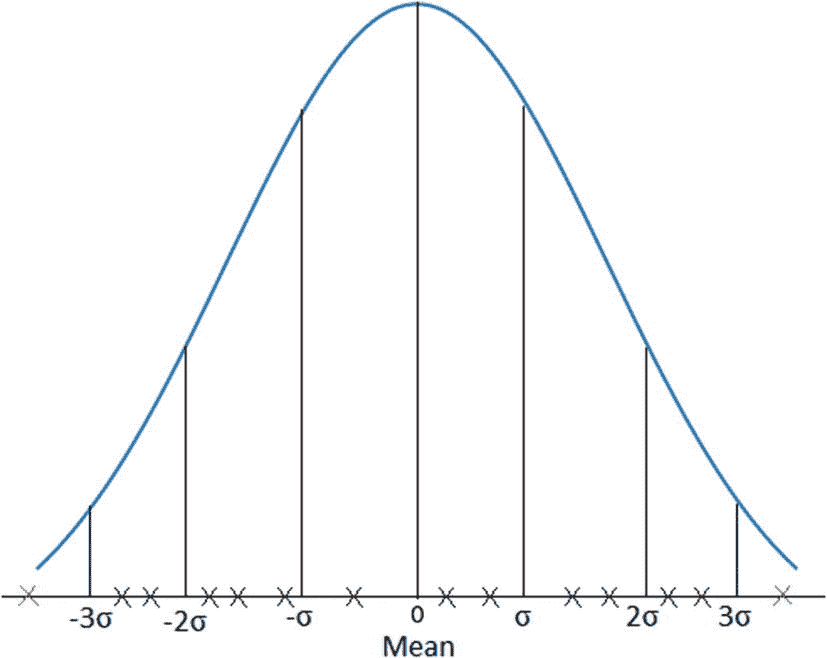

# 五、准备数据

数据科学最重要的一步是准备数据。数据准备是清理、处理和转换用于分析的原始数据的过程。从这个阶段开始，可以通过清理、识别缺失值、处理异常值等方式有效地处理数据中的错误。因此，本章讨论了使用 Python 中的 Pandas 包准备数据的方法。

## Pandas 和数据结构

Pandas 是一个为 Python 编程语言编写的软件库，主要用于数据操作和分析。

简而言之，Pandas 就像 Python 的 Excel，表格(在 Pandas 中称为 *dataframes* )由行和列组成(在 Pandas 中称为*系列*)。Pandas 有许多功能，使它成为一个数据处理、检查和操作的极好的库。

### 安装和使用 Pandas

在您的系统上安装 Pandas 需要安装 NumPy，如果从源代码构建库，则需要适当的工具来编译构建 Pandas 的 C 和 Cython 源代码。

您可以在 Pandas 文档中找到关于此安装的详细信息。Pandas 可以安装使用 pip 功能:pip 安装 Pandas。安装 Pandas 后，您可以导入它并检查版本，如下所示:

```py
import pandas
pandas.__version__

```

正如我们通常以别名`np`导入 NumPy 一样，我们将以别名`pd`导入 Pandas，这种导入约定将贯穿本书的其余部分。

```py
import pandas as pd

```

### Pandas 数据结构

数据结构是一种数据组织、管理和存储格式，支持高效的访问和修改。更准确地说，数据结构是数据值、数据值之间的关系以及可应用于数据的功能或操作的集合。Pandas 向 Python 引入了两个新的数据结构，`Series`和`DataFrame`，这两个数据结构都是建立在 NumPy 之上的(这意味着它们很快)。

## 系列

*系列*是一个一维对象，类似于表格中的数组、列表或列。它将为序列中的每个项目分配一个带标签的索引。默认情况下，每个项目将收到一个从 0 到 N 的索引标签，其中 N 是序列的长度减 1，如下所示:

```py
s = pd.Series([1, 'Raspberry Pi', 3.14, -500, 'Data'])
print(s)
Output:
0          1
1   Raspberry Pi
2    3.14
3    -500
4    Data
dtype: object

```

我们可以不提供默认索引，而是在创建序列时为每个条目指定一个索引，如下所示:

```py
s = pd.Series([1, 'Raspberry Pi', 3.14, -500, 'Data'],
               index=['M', 'A', 'X', 'I', 'E'])
print(s)
Output:
M          1
A   Raspberry Pi
X    3.14
I    -500
E    Data
dtype: object

```

`Series`构造函数也可以将字典转换成序列，使用字典的键作为索引，如下所示:

```py
d = {'English': 95, 'Math': 100, 'Science': 98, 'Social Science': 93}
marks = pd.Series(d)
print(marks)
Output:
English           95
Math             100
Science           98
Social Science    93
dtype: float64

```

该索引可用于从系列中选择特定项目。例如，可以通过指定索引`Math`来选择数学的标记。类似地，可以通过在列表中提供以逗号分隔的相应索引来打印一组项目，如下所示:

```py
print (marks['Math'])
print(marks[['English', 'Science', 'Social Science']])

Output :
100.0
English           95
Science           98
Social Science    93
dtype: float64

```

也可以使用过滤值的布尔索引。例如，使用索引`marks < 96`返回一系列布尔值，然后我们将这些值传递给我们的序列`marks`，返回相应的`True`项，如下所示:

```py
marks[marks < 96]
Output:
Math             100
Science           98
dtype: float64

```

通过访问项目的相应索引，可以随时更改系列中特定项目的值，如下所示:

```py
print('Old value:', marks['Math'])
marks['Math'] = 99
print('New value:', marks['Math'])
Output:
('Old value:', 100.0)
('New value:', 99.0)

```

我们还可以使用以下代码检查某个项目是否存在于序列中:

```py
print('Math' in marks)
print('French' in marks)
Output:
True
False

```

也可以对一系列数值进行数学运算，如下所示:

```py
marks * 10
Output:
English           950
Math              990
Science           980
Social Science    930
dtype: float64

np.square(marks)
Output:
English           9025
Math              9801
Science           9604
Social Science    8649
dtype: float64

```

## 数据帧

表格`DataFrame`数据结构由行和列组成，类似于电子表格或数据库表。您也可以将一个`DataFrame`看作一组共享一个索引(列名)的`Series`对象。

### 阅读日期

为了从常见的 Python 数据结构中创建一个`DataFrame`数据结构，我们可以将一个列表字典传递给`DataFrame`构造函数。

```py
a={'Name':['Augustus', 'Hazel', 'Esther', 'Cavas'],
      'Gender':['Male','Female','Female','Male'],
      'Age':[19, 18, 22, 21]}
b=pd.DataFrame.from_dict(a)
            print(b)

Output:
   Name      Gender   Age
0  Augustus    Male   19
1     Hazel  Female   18
2    Esther  Female   22
3     Cavas    Male   21

```

### 读取 CSV 数据

读取 CSV 文件就像调用`read_csv`函数一样简单。默认情况下，`read_csv`函数希望列分隔符是逗号，但是您可以使用`sep`参数来更改它。以下代码显示了将 CSV 文件读入`DataFrame 'df'`并使用`head()`函数打印`df`的前五行的语法:

```py
df = pd.read_csv('data.csv')
print(df.head())

```

还有一组 writer 函数，用于将`DataFrame`对象写成各种格式，如 CSV 文件、HTML 表格、JSON 等。以下代码行显示了将`DataFrame`对象写入 CSV 文件的语法:

```py
df.to_csv('path_to_file.csv')

```

### 读取 Excel 数据

Pandas 允许我们读写 Excel 文件，所以我们可以很容易地用 Python 从 Excel 中读取数据，然后将数据写回 Excel。读取 Excel 文件需要使用`pip`命令安装的`xlrd`库，如下所示:

```py
pip install xlrd.

```

下面的代码说明了从 Excel 文件读取一个工作表到`DataFrame df` *的语法。*用 Excel 文件的路径/文件名替换`data.xlsx`来运行代码。

```py
df = pd.read_excel('data.xlsx', 'Sheet1')
print(df.head())

```

类似地，来自`DataFrame`对象的数据可以写入 Excel 文件，如下所示:

```py
dataframe.to_excel('path_to_file.xlsx', index=False)

```

### 正在读取 URL 数据

`read_table`函数可以用来直接从一个 URL 读取。以下代码说明了使用来自给定 URL 的原始数据创建的`DataFrame`:

```py
url = 'https://raw.github.com/gjreda/best-sandwiches/master/data/best-sandwiches-geocode.tsv'
from_url = pd.read_table(url, sep='\t')
from_url.head(3)
Output:
      rank         sandwich  ...   lat        lng
0     1                 BLT  ...   41.895734  -87.679960
1     2       Fried Bologna  ...   41.884672  -87.647754
2     3   Woodland Mushroom  ...   41.890602  -87.630925

```

### 清理数据

在大多数数据分析项目中，可用数据并不总是完美的。除了有用的数据之外，原始数据总是容易被损坏或不准确的数据弄乱。因此，数据科学家必须处理这些杂乱的数据样本，以便将原始数据转换成可以工作的形式，并且他们要花相当长的时间来这样做。

数据清理是识别数据中不准确、不正确或不完整的部分，并通过替换、删除或修改数据来处理它们的过程。换句话说，它是通过处理原始数据中的所有不规则性来为分析准备数据的过程。在接下来的部分中，我们将讨论如何处理缺失值和异常值，填充不合适的值，以及删除重复的条目。

### 处理缺失值

缺失值在原始数据中很常见。假设输入数据由使用调查表收集的成千上万客户的产品反馈组成。客户在填写调查表时跳过一些条目是很常见的行为。例如，一些客户可能不会分享他们对该产品的体验，一些客户可能不会分享他们使用该产品的持续时间，还有一些客户可能不会填写他们的联系信息。在编辑这些调查表并将其转换成表格时，表格中肯定会有大量缺失值。

由于各种原因，如传感器节点临时断电、硬件故障、通信干扰等，来自传感器的数据也可能丢失数据。因此，处理这些缺失值是数据科学家在处理原始数据时的首要任务。以下代码说明了如何使用 NumPy 库中的`random.randn`函数创建随机数数据库:

```py
import pandas as pd
import numpy as np
df = pd.DataFrame(np.random.randn(6,4),
index = ['1','3','4','6','7','9'],
 columns = ['a','b','c','d'])

```

从前面的代码中可以看出，行和列的索引是手动分配的。从分配给行的索引中可以看出，缺少索引 2、5 和 8。使用 Pandas 库中的`reindex`函数，这些索引是用缺失的“非数字”(NaN)值创建的，如下所示:

```py
df=df.reindex(['1','2','3','4','5','6','7','8','9'])
print(df)
Output:
         a         b         c         d
1  0.099344  0.293956  1.002970  0.516942
2       NaN       NaN       NaN       NaN
3  1.608906 -1.748396 -1.013634 -0.651055
4  3.211263 -2.555312 -1.036068 -0.728020
5       NaN       NaN       NaN       NaN
6 -0.101766 -0.205572  1.369707 -1.133026
7  0.062344  1.483505  0.026995  1.560656
8       NaN       NaN       NaN       NaN
9 -0.324347 -0.342040  0.107224  0.272153

```

既然已经创建了包含缺失值的数据库，下一步就是处理这些值。在考虑处理这些值的选项之前，最重要的任务是检测丢失值的位置。Pandas 库中的`isnull()`函数可用于检测包含缺失值的行，如下所示:

```py
df1=df[df.isna().any(axis=1)]
print(df1)
Output:
      a   b   c   d
2   NaN NaN NaN NaN
5   NaN NaN NaN NaN
8   NaN NaN NaN NaN

```

前面的过程让我们大致了解了数据库中丢失的数据量。一旦检测到丢失的数据，下一步就是处理丢失的数据。有两种方法可以做到这一点:一种是用值填充缺失的数据，第二种是简单地删除缺失的数据。

Pandas 库中的`fillna()`函数可以用来用用户指定的标量值填充缺失的值，如下所示。如图所示，第 2 行和第 5 行中缺少的值被替换为 0.000000。

```py
df2=df.fillna(0)
print(df2.head())
Output:
          a         b         c         d
1  0.099344  0.293956  1.002970  0.516942
2  0.000000  0.000000  0.000000  0.000000
3  1.608906 -1.748396 -1.013634 -0.651055
4  3.211263 -2.555312 -1.036068 -0.728020
5  0.000000  0.000000  0.000000  0.000000

```

替换缺失值的另一种方法是使用 Pandas 库中的`ffill`或`bfill`函数。`ffill`代表“向前填充”，通过重复出现在它们之前的值来填充缺失的值，`bfill`代表“向后填充”，通过重复出现在它们之后的值来填充缺失的值。以下代码说明了填充缺失值的正向填充方法:

```py
df3= df.fillna(method='ffill')
print(df3.head())
Output:
          a         b         c         d
1  0.099344  0.293956  1.002970  0.516942
2  0.099344  0.293956  1.002970  0.516942
3  1.608906 -1.748396 -1.013634 -0.651055
4  3.211263 -2.555312 -1.036068 -0.728020
5  3.211263 -2.555312 -1.036068 -0.728020

```

处理缺失值的第二种可能方式是使用 Pandas 库中的`dropna`函数删除它们，如下所示:

```py
df4=df.dropna()
print(df4)
Output:
          a         b         c         d
1  0.099344  0.293956  1.002970  0.516942
3  1.608906 -1.748396 -1.013634 -0.651055
4  3.211263 -2.555312 -1.036068 -0.728020
6 -0.101766 -0.205572  1.369707 -1.133026
7  0.062344  1.483505  0.026995  1.560656
9 -0.324347 -0.342040  0.107224  0.272153

```

我们创建了一个带有缺失值的简单数据集，以理解处理缺失值的概念。实际上，分析项目中使用的数据集很大，可能包含 500 到 1，000 行，甚至更多。我们鼓励您将从该示例中获得的知识应用到真实数据集上。处理缺失值的方法可能取决于应用的性质以及数据集中缺失值的数量或频率。

### 处理异常值

在数据集中，离群值是从所有其他观察值中脱颖而出的观察值(即数据)。换句话说，*离群值*是远离数据集中所有其他数据的数据点。异常值可能是由于测量/数据输入中的错误或由于数据中真正的极端值造成的。例如，考虑 112、123、120、132、106、26、118、140 和 125 这一系列数字。在这个数列中，除了 26 以外，所有的数字都接近 100。因此，26 是一个异常值，因为它与其他数字相距甚远。

可以通过两种方式检测异常值:使用可视化技术和使用数学方法。在本节中，我们将介绍两种识别数据中异常值的数学方法，即四分位数间距(IQR)和 Z 值。

*四分位范围*是对数据集中数据的可变性或分布的度量。数据首先被排序并分成四个季度。将总范围分成四个四分位数的值称为*四分位数*。因此，将有三个四分位数用于将数据分成四个四分位数。四分位数是 Q <sub>1</sub> ，Q <sub>2</sub> 和 Q <sub>3</sub> ，其中 Q <sub>2</sub> 是整个数据的中值，Q <sub>1</sub> 是上半部分数据的中值，Q <sub>3</sub> 是下半部分数据的中值。IQR 是第三个四分位数和第一个四分位数之差，即 Q<sub>3</sub>–Q<sub>1</sub>。

为了说明使用 IQR 移除离群值的过程，让我们首先创建一个包含离群值的 15 个条目的`DataFrame`。

```py
  import pandas as pd
  a={'Name':['A','B','C','D','E','F','G','H','I','J','K','L','M','N','O'],
     'Weight':[56,62,48,72,15,80,76,64,68,180,75,47,58,63,71]}
  df=pd.DataFrame.from_dict(a)
  print(df.head())
Output:
   Name  Weight
0    A      56
1    B      62
2    C      48
3    D      72
4    E      25

```

在前面的代码中，我们创建了一个包含 15 个成年人体重(公斤)的数据库。为了方便起见，我们用字母 *A* 到 *M* 来给成年人命名。15 公斤和 180 公斤的体重被列为异常值，因为健康成年人体重不太可能太轻或太重。为了检测这些异常值，我们需要分别计算 25%和 75%的四分位值，Q1 和 Q3。从这些值中，可以通过确定 Q3-Q1 的差值来计算 IQR 值。此过程如下所示:

```py
Q1=df.Weight.quantile(0.25)
Q3=df.Weight.quantile(0.75)
IQR=Q3-Q1
print('Q1=',Q1,'Q3=',Q3,'IQR=',IQR)
Output:
Q1= 57.0 Q3= 73.5 IQR= 16.5

```

通过将`DataFrame`对象中的条目与之前计算的四分位数进行比较，可以看到有四个值低于 Q1，七个值在 Q1 和 Q3 之间，四个值高于 Q3。但是我们知道只有一个异常值低于 Q1，一个异常值高于 Q3。为了检测这些异常值，我们需要形成一个区间，其下限远低于 Q1，上限远高于 Q3。一旦确定了这些限制，就可以放心地认为低于下限的值和高于上限的值将是异常值。下面的代码说明了这一点:

```py
lower_limit = Q1 - 1.5 * IQR
upper_limit = Q3 + 1.5 * IQR
df1=df[(df.Weight < lower_limit) | (df.Weight > upper_limit)]
print(df1)
Output:
   Name  Weight
4    E      25
9    J     180

```

可以看出，使用 IQR 值创建的限制已经准确地检测到了我们数据中的异常值。现在，可以使用以下代码轻松过滤掉这些异常值:

```py
df2=df.drop(df1.index)
   print(df2)
Output:
   Name  Weight
0     A      56
1     B      62
2     C      48
3     D      72
5     F      80
6     G      76
7     H      64
8     I      68
10    K      75
11    L      47
12    M      58
13    N      63
14    o      71

```

### z 分数

Z 分数，也称为*标准分数*，给出了一个数据点离平均值有多远的概念。从技术上来说，Z 得分符合正态分布的数据，并测量数据点相对于整个数据集平均值的标准偏差数，如图 [5-1](#Fig1) 所示。



图 5-1

基于 Z 得分的异常值检测数据的正态分布

图 [5-1](#Fig1) 显示每个数据点沿着以零均值为中心的正态分布绘制。离零均值太远的数据点被视为异常值。在大多数情况下，阈值固定为 3，任何超过 3σ或-3σ的数据点都被视为异常值。让我们使用上一节中使用的同一数据库，并使用 Z 分数来识别异常值。

```py
  import pandas as pd
  from scipy import stats
  import numpy as np
  a={'Name':['A','B','C','D','E','F','G','H','I','J','K','L','M','N','O'],
     'Weight':[56,62,48,72,15,80,76,64,68,180,75,47,58,63,71,]}
  df=pd.DataFrame.from_dict(a)
  z = np.abs(stats.zscore(df.Weight))
  print(z)
  df1=df[z>3]
  print(df1)
Output:
   Name  Weight
9    J     180

```

从前面的代码可以看出，对应于权重值 180 的 Z 分数超过了阈值 3，因此它被显示为异常值。不幸的是，权重值 15 没有被检测为异常值。其原因可以通过比较平均值和标准偏差来理解，这可以通过`np.mean`和`np.std`函数来实现，如下所示:

```py
print(np.mean(df.Weight))
print(np.std(df.Weight))
Output:
67.0
33.448467827390836

```

让我们把标准差的值近似为 33.45。可以看出，权重值 180 和平均值之间的差为 111，大于标准偏差的三倍(> 3σ)，而权重值 15 和平均值之间的差仅为 54，小于标准偏差的两倍(< 2σ)。克服这个问题的一种方法是降低阈值。让我们假设`Threshold`值为 1。

```py
df1=df[z>1]
     print(df1)
Output:
     Name  Weight
4    E      15
9    J     180

```

从上图中可以看出，理想的阈值 3 可能并不适用于每个数据集，因此应该根据数据的分布来选择阈值。现在，与 IQR 的情况类似，可以使用以下代码简单地过滤掉这些异常值:

```py
df2=df.drop(df.Name[z>1].index)
print(df2)
Output:
    Name  Weight
0     A      56
1     B      62
2     C      48
3     D      72
5     F      80
6     G      76
7     H      64
8     I      68
10    K      75
11    L      47
12    M      58
13    N      63
14    o      71

```

### 过滤掉不合适的值

在某些情况下，数据集可能包含一些与数据完全无关的不适当的值。在传感器数据的情况下尤其如此。传感器记录的数据通常是时间序列数据，每个数据点都有唯一的时间戳。在许多情况下，分析不需要这些时间戳，因此可以将其视为不适当的值。为了说明这个概念，我们创建了一个类似于传感器数据的时间序列温度数据，如下所示:

```py
import pandas as pd
data={'Time':['12:00:05','12:08:33','12:25:12','12:37:53','12:59:08'],
      'Temperature':['T=22','T=22','T=23','T=23','T=24']}
df=pd.DataFrame.from_dict(data)
print(df)
Output:
       Time Temperature
0  12:00:05        T=22
1  12:08:33        T=22
2  12:25:12        T=23
3  12:37:53        T=23
4  12:59:08        T=24

```

现在每个数据点对应的时间戳和每个数据点中的头`'T='`都要去掉。时间戳可以使用 Pandas 库中的`drop`函数删除，而报头可以使用`str.replace`函数删除。因为每个数据点中都有一个标题，所以数据最初存储为字符串数据类型。因此，在删除这些头之后，数据类型必须更改为`int`或`float`。这些程序说明如下:

```py
df.drop('Time',inplace=True,axis=1)
df=df.Temperature.str.replace('T=','')
df=df.astype(float)
print(df)
Output:
0    22.0
1    22.0
2    23.0
3    23.0
4    24.0
Name: Temperature, dtype: float64

```

### 删除重复项

重复条目在数据科学中很常见，尤其是当我们从各种来源收集数据并整合它们进行处理时。根据我们分析的性质，这些重复可能会造成问题。因此，最好在分析数据之前删除这些重复项，如下所示:

```py
import pandas as pd
a={'Name':['Alan','Joe','Jim','Tom','Alan','Anna','Elle','Rachel','Mindy'],
   'Age':[22,24,25,24,22,23,21,22,23]}
df=pd.DataFrame.from_dict(a)
print('DATA\n',df)
print('DUPLICATES\n',df[df.duplicated()])
df1=df.drop_duplicates()
print('DATA AFTER REMOVING DUPLICATES\n',df1)

Output:
DATA
     Name  Age
0    Alan   22
1     Joe   24
2     Jim   25
3     Tom   24
4    Alan   22
5    Anna   23
6   Ellen   21
7  Rachel   22
8   Mindy   23
DUPLICATES
   Name  Age
4  Alan   22
DATA AFTER REMOVING DUPLICATES
     Name  Age
0    Alan   22
1     Joe   24
2     Jim   25
3     Tom   24
5    Anna   23
6   Ellen   21
7  Rachel   22
8   Mindy   23

```

如代码所示，从由几个人的姓名和年龄组成的字典中创建了一个`DataFrame`，我们特意为姓名 Alan 创建了一个重复的条目。可以看出，Pandas 库中的*复制*函数清楚地标识了该名称的第二个条目。然后使用 Pandas 库中的`drop_duplicates`函数删除这个重复的条目。