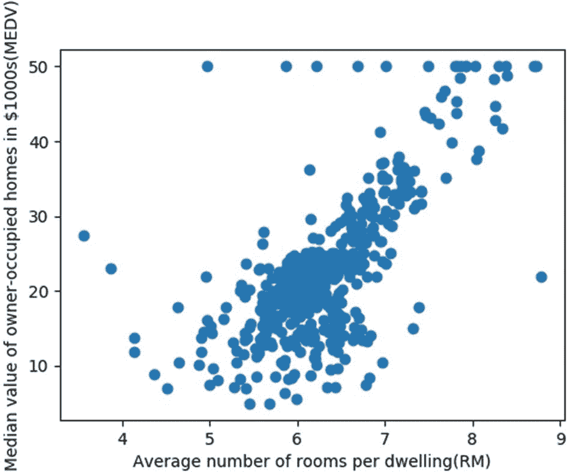
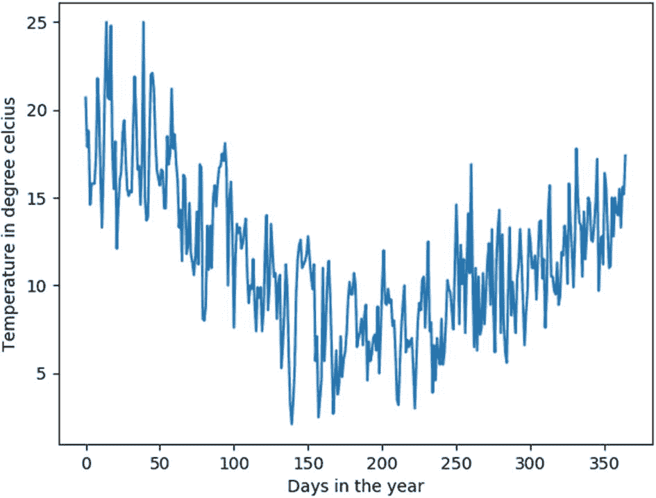
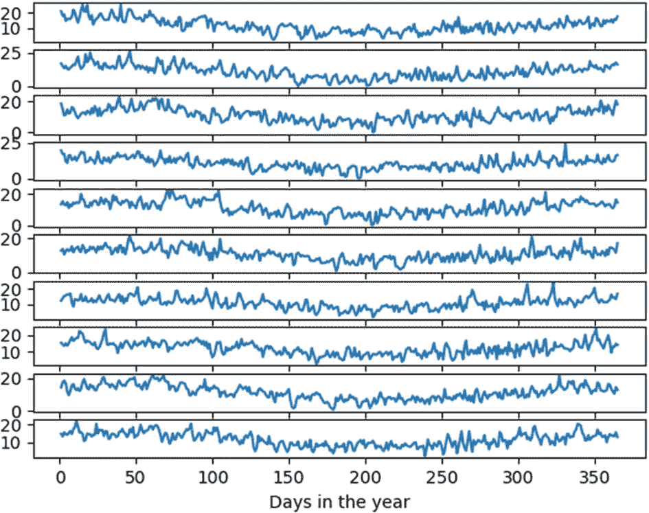
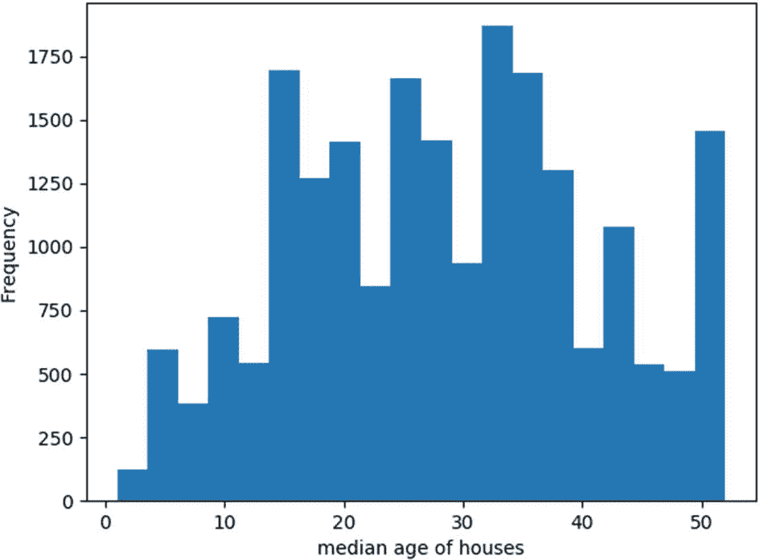
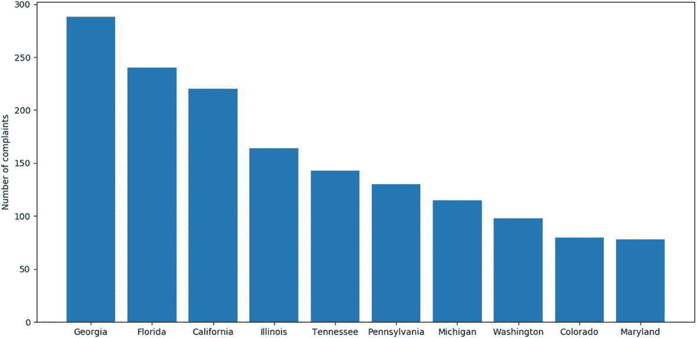
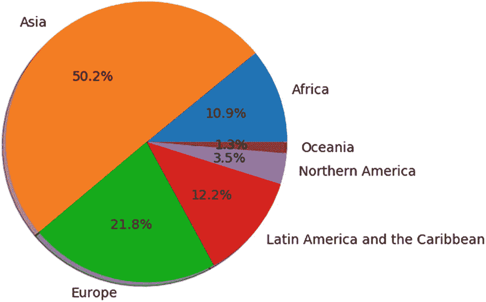

# 六、可视化数据

在前一章中，我们讨论了准备数据进行分析的一些步骤。在分析数据之前，必须了解我们正在处理的数据的性质。可视化数据可能会给我们一些关于数据本质的有用见解。这些洞察，例如数据中的模式、数据的分布、数据中存在的异常值等。，可以方便地确定用于分析数据的方法。此外，可视化可以在分析结束时用于向相关方传达调查结果，因为通过可视化技术传达分析结果可能比编写解释调查结果的文本内容更有效。在本章中，我们将了解 Python 的 Matplotlib 包提供的一些基本可视化绘图，以及如何定制这些绘图来传达不同数据的特征。

## Matplotlib 程式库

Matplotlib 是一个绘图库，用于使用 Python 编程语言创建出版物质量的绘图。该软件包根据要传达的信息类型提供各种类型的绘图。这些情节带有交互式选项，如平移、缩放和子情节配置。这些图也可以保存为不同的格式，如 PNG、PDF 等。此外，Matplotlib 包为每种类型的绘图提供了许多定制选项，可用于有效地表示要传达的信息。

### 散点图

散点图是一种使用标记来指示数据点以显示两个变量之间关系的图。在进行数据分析时，散点图可以有多种用途。例如，当数据点被视为一个整体时，该图可以揭示数据的模式和趋势，这反过来可以帮助数据科学家了解两个变量之间的关系，从而使他们能够提出一种有效的预测技术。散点图也可用于识别数据中的聚类。它们还可以揭示数据中存在的异常值，这一点至关重要，因为异常值往往会极大地影响预测系统的性能。

创建散点图通常需要两列数据，图的每个维度一列。表格中的每一行数据将对应于图中的单个数据点。可以使用 Matplotlib 库中的`scatter`函数创建散点图。为了演示散点图的有用性，让我们考虑一下可以从 Scikit-Learn 库中导入的波士顿住房数据集。这个数据集实际上来自于卡内基梅隆大学维护的 StatLib 图书馆。它由 506 个样本组成，具有 13 个不同的特征属性，如城镇人均犯罪率(CRIM)、每所住宅的平均房间数(RM)、径向公路可达性指数(RAD)等。此外，目标属性 MEDV 表示所有者自住房屋的中值，以千为单位。

以下代码演示了创建 Pandas 数据框架波士顿住房数据集的过程，该数据框架最初采用字典格式。为了方便起见，使用`print`命令，在这段代码中只显示数据帧的前五行。

```py
import matplotlib.pyplot as plt
import numpy as np
import pandas as pd
from sklearn.datasets import load_boston
dataset = load_boston()
boston_data=pd.DataFrame(dataset.data,columns=dataset.feature_names)
print(boston_data.head())

Output:
  CRIM  ZN   INDUS   CHAS  NOX ...  RAD  TAX PTRATIO  B  LSTAT
0  0.00632  18.0  2.31  0.0  0.538  ...  1.0  296.0  15.3  396.90  4.98
1  0.02731   0.0  7.07  0.0  0.469  ...  2.0  242.0  17.8  396.90  9.14
2  0.02729   0.0  7.07  0.0  0.469  ...  2.0  242.0  17.8  392.83  4.03
3  0.03237   0.0  2.18  0.0  0.458  ...  3.0  222.0  18.7  394.63  2.94
4  0.06905   0.0  2.18  0.0  0.458  ...  3.0  222.0  18.7  396.90  5.33
[5 rows x 13 columns]

```

房屋数据集原本是字典的形式，保存到变量`dataset` *。*13 个特征属性分配给`data`键，目标属性 MEDV 分配给`target`键*。然后，这 13 个特征被转换成 Pandas 数据帧。现在，特征变量 RM 相对于目标变量 MEDV 的散点图可以通过下面的代码获得。从图 [6-1](#Fig1) 中的曲线图可以看出，一套房子的价格随着房间数量的增加而增加。除了这一趋势，在图中还可以看到一些异常值。*



图 6-1

房价与每套住宅平均房间数的关系图

```py
plt.scatter(boston_data['RM'],dataset.target)
plt.xlabel("Average number of rooms per dwelling(RM)")
plt.ylabel("Median value of owner-occupied homes in $1000s(MEDV)")
plt.show()

```

### 线形图

折线图只不过是由一条线连接起来的一系列数据点，它可以用来表达一个变量在特定时间内的趋势。折线图通常用于可视化时间序列数据，以观察数据随时间的变化。它也可以作为分析过程的一部分，用于检查迭代过程中变量的变化。

可以使用 Matplotlib 包中的 plot 函数获得线图。为了演示折线图，让我们考虑一个时间序列数据集，该数据集由澳大利亚墨尔本市 10 年(1981-1990 年)的最低日温度(以 <sup>0</sup> 摄氏度为单位)组成。以下代码说明了加载包含数据集的`.csv`文件、将其转换为 dataframe 并绘制 1981 年温度变化的过程。

```py
import pandas as pd
import matplotlib.pyplot as plt
import numpy as np
dataset=pd.read_csv('daily-min-temperatures.csv')
df=pd.DataFrame(dataset,columns=['Date','Temp'])
print(df.head())

Output:
               Date    Temp
0        1981-01-01    20.7
1        1981-01-02    17.9
2        1981-01-03    18.8
3        1981-01-04    14.6
4        1981-01-05    15.8

plt.plot(df['Temp'][0:365])
plt.xlabel("Days in the year")
plt.ylabel("Temperature in degree celcius")
plt.show()

```

图 [6-2](#Fig2) 中的线形图清楚地显示了 1981 年墨尔本气温的逐日变化。



图 6-2

1981 年墨尔本的温度变化

Matplotlib 包还提供了子情节选项，其中可以在一个单一图形对象中创建子情节布局。在这个时间序列数据示例中，我们可以使用一个简单的`for`循环来提取 10 年中每一年的数据，并将其绘制在单独的子图中，如以下代码所示:

```py
y,k=0,1
x=np.arange(1,366)
for i in range(10):
          plt.subplot(10,1,k)
          plt.plot(x,df['Temp'][y:y+365])
          y=y+365
          k=k+1
plt.xlabel("Days in the year")
plt.show()

```

图 [6-3](#Fig3) 由 10 条副曲线组成，每条曲线显示了从 1981 年到 1990 年某一特定年份的温度变化。因此，多条副曲线的使用使我们能够比较墨尔本十年来的温度变化趋势。



图 6-3

墨尔本 10 年(1981 年至 1990 年)的温度变化

### 柱状图

直方图的工作原理是将变量中的数据分成不同的范围，称为*区间*；然后，他们计算每个箱中的数据点，并绘制成竖条。这些类型的图可以很好地给出数值数据的近似分布。箱的宽度，即每个箱中的值的范围，是一个重要的参数，必须通过尝试不同的值来选择最适合数据的一个。

为了演示直方图，让我们考虑一下 Scikit-Learn 库中提供的加利福尼亚住房数据集。该数据集来自 1990 年美国人口普查，每个人口普查区块组使用一行。街区组是美国人口普查局发布样本数据的最小地理单位(街区组通常有 600 到 3，000 人)。数据集由 8 个参数组成，如街区中位收入、街区中位房龄、平均房间数等。和一个目标属性，即加利福尼亚地区的中值房价。数据中共有 20，640 个数据点(行)。以下代码绘制了一个直方图，该直方图根据街区内房屋的中值年龄显示了街区的分布。图 [6-4](#Fig4) 显示了直方图。较低的数字通常意味着较新的建筑。



图 6-4

根据街区中房屋的中位年龄分配街区

```py
import matplotlib.pyplot as plt
from sklearn.datasets import fetch_california_housing
import pandas as pd
dataset = fetch_california_housing()
df=pd.DataFrame(dataset.data,columns=dataset.feature_names)
print(df.head())

Output:
     MedInc  HouseAge    AveRooms  ...  AveOccup  Latitude  Longitude
0    8.3252      41.0    6.984127  ...  2.555556     37.88    -122.23
1    8.3014      21.0    6.238137  ...  2.109842     37.86    -122.22
2    7.2574      52.0    8.288136  ...  2.802260     37.85    -122.24
3    5.6431      52.0    5.817352  ...  2.547945     37.85    -122.25
4    3.8462      52.0    6.281853  ...  2.181467     37.85    -122.25
plt.hist(df['HouseAge'],bins=20)
plt.xlabel("median age of houses")
plt.ylabel("Frequency")
plt.show()

```

从图 [6-4](#Fig4) 中的直方图可以看出，街区中的大多数房屋分布在中部，这表明新街区和非常老的街区的数量低于平均年龄的街区。

### 条形图

数据科学家经常在演示和报告中使用条形图，将分类数据表示为水平或垂直的矩形条，其长度或高度与它们所表示的数据值相对应。通常，其中一个轴代表数据的类别，而另一个轴代表相应的值。因此，条形图是比较不同类别数据的理想选择。条形图也可用于传达一个或多个变量在一段时间内的发展情况。

尽管条形图看起来类似于直方图，但它们之间还是有细微的差别。例如，直方图用于绘制变量的分布，条形图用于比较属于不同类别的变量。直方图将定量数据分组到有限数量的箱中，并绘制这些箱中数据的分布，而条形图用于绘制分类数据。

为了演示这个条形图，让我们考虑一下电信消费者投诉数据集，这是一家美国全球电信公司 Comcast 收到的投诉的集合。这家公司在 2016 年 10 月被罚款 230 万美元，原因是大量客户投诉称，他们被收取了从未使用过的服务费用。该数据集是 2，224 个此类投诉的集合，分为 11 列，如客户投诉、日期、城市、州、邮政编码、状态等。在下面的代码中，首先加载作为 Excel 表提供的数据集，并将其转换为 dataframe。然后，选择包含收到投诉的州的列，使用函数`groupby()`将对应于相同州的多个条目组合成一个条目。通过使用函数`size()`获得每个状态重复的次数计数，该计数对应于从每个状态收到的投诉数量。然后可以使用`sort_values()` *功能按计数值的降序对数据进行排序。*图 [6-5](#Fig5) 显示了投诉数量最多的前 10 个州的图表，该图表清楚地显示了哪些州的客户遇到了更多的投诉。该图基本上是根据客户投诉的数量来比较公司在不同州的疑虑。



图 6-5

显示从不同州收到的投诉数量的条形图

```py
import pandas as pd
import matplotlib.pyplot as plt
dataset=pd.read_excel('Comcast_telecom_complaints_data.csv.xlsx')
data=pd.DataFrame(dataset)
print(data.head(3))

Output:
   Ticket #        Customer Complaint   ...   Zip code  Status
0  250635  Comcast Cable Internet Speeds   ...   21009  Closed
1  223441  Payment disappear - service got disconnected ... 30102  Closed
2  242732               Speed and Service  ...  30101  Closed
[3 rows x 11 columns]
a=data.groupby("State").size().sort_values(ascending=False).reset_index()
plt.bar(a['State'][0:10],a[0][0:10],align='center')
plt.show()

```

### 圆形分格统计图表

饼图通常用于显示数据在不同类别中的分布，以圆形比例段的形式表示占整个数据的百分比。换句话说，每个循环段对应一个特定的数据类别。通过查看饼图，用户可以通过可视化绘图快速掌握分类数据的分布，而不是像条形图那样看到数字百分比。饼图和条形图之间的另一个区别是，饼图用于比较每个数据类别对整体的贡献，而条形图用于比较不同数据类别之间的贡献。

为了演示饼图，让我们考虑一个包含 1980 年至 2013 年加拿大移民详细信息的数据集。该数据集包含每年进出加拿大的移民的各种属性。这些属性包括始发地/目的地名称、地区名称、区域名称等。基于移民的来源/目的地总共有 197 行数据。以下代码绘制了一个饼图，显示了从 1980 年到 2013 年按大陆分类的移民总数:

```py
import pandas as pd
import matplotlib.pyplot as plt
df = pd.read_excel('Canada.xlsx',skiprows=range(20),skipfooter=2)
df.columns = list(map(str, df.columns))
df['Total']=df.sum(axis=1)
df_continents = df.groupby('AreaName', axis=0).sum().reset_index()
print(df_continents)

Output:
                         AreaName   AREA    REG     ...  2012  2013    Total
0                          Africa   48762   49242   ...  38083 38543   765660
1                            Asia   45815   109147  ...  152218 155075  3516953
2                          Europe   39044   39754   ...  29177 28691   1528488
3 Latin America and the Caribbean   29832   30395   ...  27173 24950   855141
4                Northern America   1810    1810    ...  7892   8503    246564
5                         Oceania   12726   13210   ...  1679     1775    93736

```

数据集作为 Pandas 数据帧加载后，带有数字的列标题(表示数据的年份)被转换为字符串格式。这样做是为了确保当我们在下一步计算移民总数时，不会将这些头衔相加。这个移民总数保存在以名称`Total`创建的附加列中。在计算出移民总数后，数据按照标题为`AreaName`的列进行分组，该列包含了移民所在洲的详细信息。通过这样做，现在行数从 197 减少到 6，这表明整个数据集被分组到 6 个大洲。

现在，标题为`Total`的一栏中给出的来自六大洲的移民总数可以绘制成如图 [6-6](#Fig6) 所示的饼状图。因此，饼图将包含对应于六大洲的六个圆形段。为了标记绘图中的这些段，标题为`AreaName`的列中的洲名被转换为一个列表，并存储在一个变量中，作为绘图函数中的标签。这段代码如下所示:



图 6-6

从 1980 年到 2013 年，来自不同大陆的移民进出加拿大的饼图

```py
t=list(df_continents.AreaName)
plt.pie(df_continents['Total'],labels=t,autopct='%1.1f%%',shadow=True)
plt.show()

```

## 其他地块和包装

除了本章讨论的基本图，Matplotlib 包中还有其他可用的图，如等高线图、河流图、3D 图等。，可以根据数据的性质或分析要求来使用。除了 Matplotlib 包，其他可用的包提供了更复杂的绘图，可用于增强不同类别数据的可视化。Seaborn 库就是这样一个包，它可以用来在 Python 中制作统计图形。Seaborn 库提供了更复杂的图形，如箱线图、热图、小提琴图、聚类图等。，可以提供增强的数据可视化。鼓励您探索这些其他类别的地块和库。