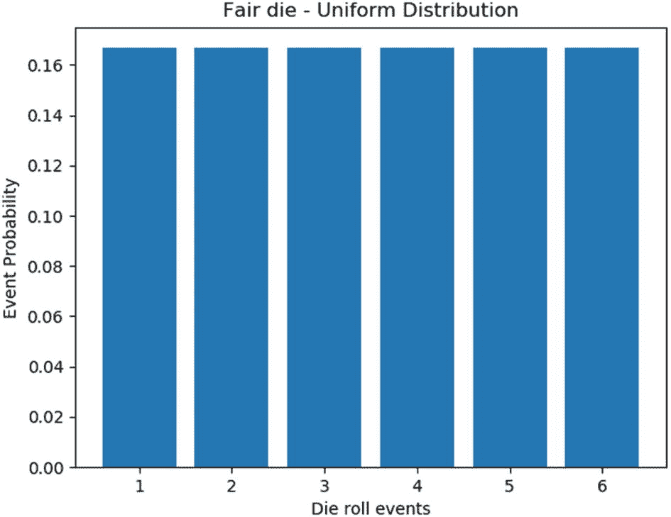
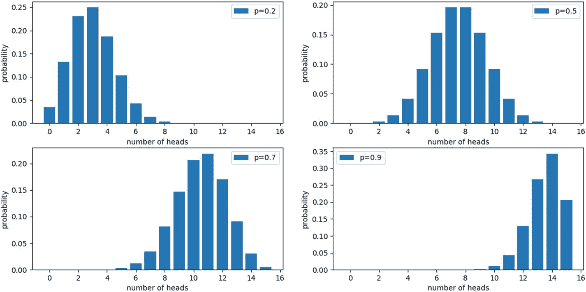
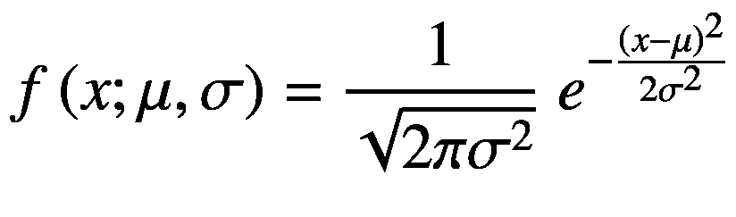
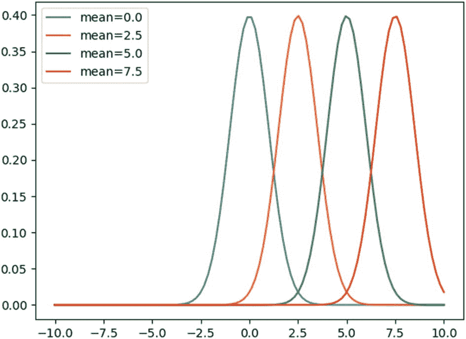
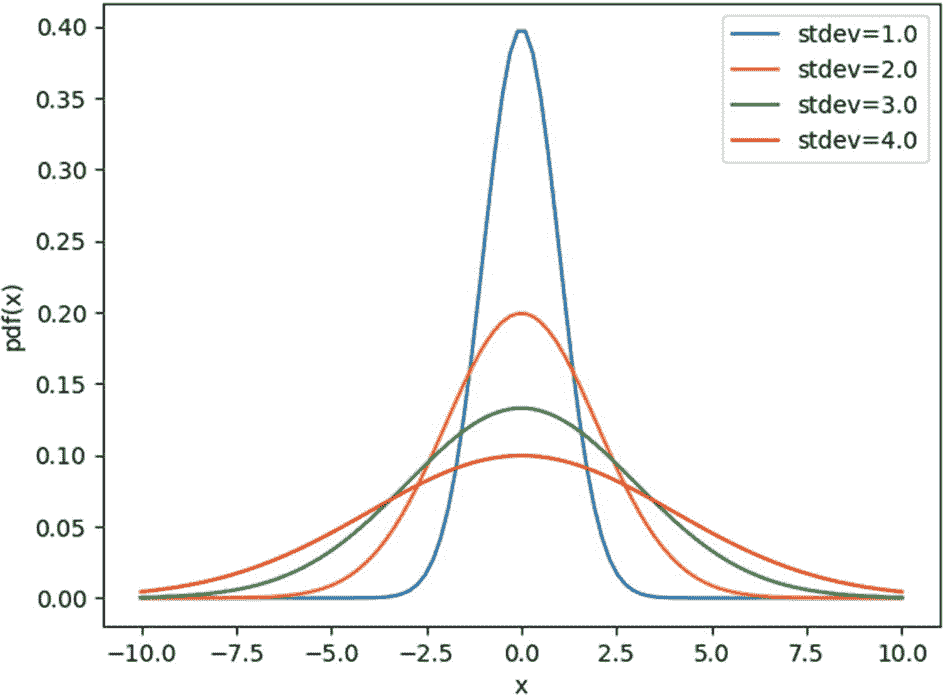
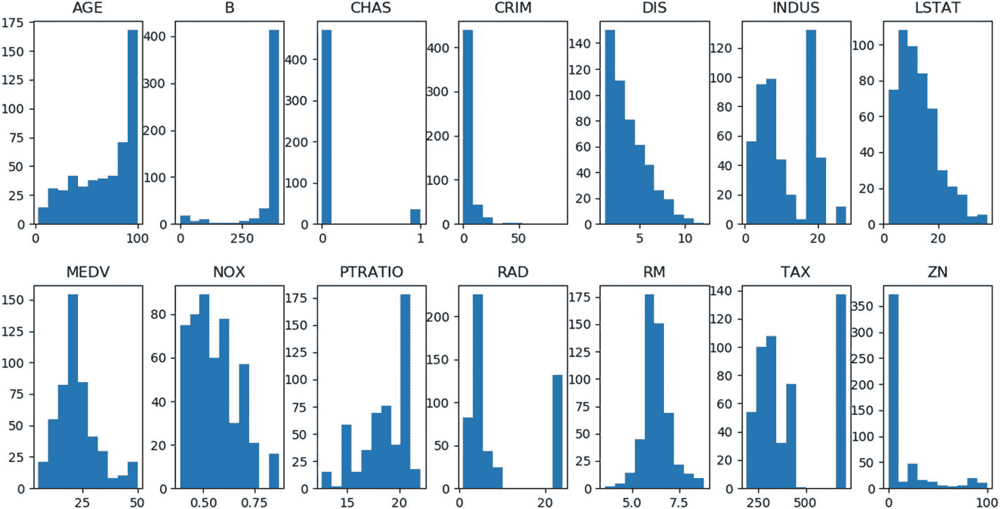
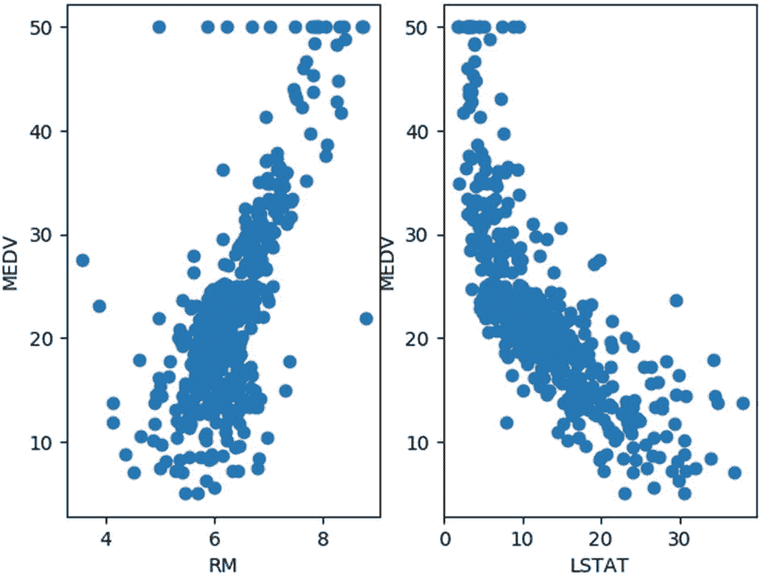

# 七、分析数据

## 探索性数据分析

*探索性数据分析* (EDA)是通过总结数据的特征来理解数据的过程。在为机器学习建模数据之前，这一步很重要。从这种分析中，用户可以提取信息，确定数据中任何问题的根本原因，并找出启动任何开发策略的步骤。简而言之，这种类型的分析探索数据，以理解和识别其中的模式和趋势。做 EDA 没有通用的方法；这取决于我们正在处理的数据。为了简单起见，在本章中，我们将使用常见的方法和图来做 EDA。

## 选择数据集

为了进行 EDA，我们将使用可以从 Scikit-Learn 库中导入的波士顿住房数据集。该数据集已在第 [6](6.html) 章中描述。该数据集包含 13 个不同特征属性下的 506 个样本，如城镇人均犯罪率(CRIM)、每所住宅的平均房间数(RM)、放射状公路可达性指数(RAD)等。，目标属性 MEDV 表示业主自住房屋的中值，以千为单位。

1.  **导入所需的库。**

第一步是加载进行 EDA 所需的库。在本章中，我们将使用 Pandas、NumPy 和 Matplotlib 等包进行绘图:

1.  **导入数据集。**

```py
import matplotlib.pyplot as plt
import numpy as np
from sklearn.datasets import load_boston

```

波士顿住房数据集可以从 Scikit-Learn 库中导入，并保存为`boston_data`变量，如以下代码所示:

```py
dataset = load_boston()

```

更重要的是，大多数开源数据都是以逗号分隔的格式存储的。这种逗号分隔的格式很难获取和分析数据。因此，可以使用 Python 中的 Pandas 包将逗号分隔的数据转换成 dataframe。

```py
import pandas as pd
boston_data=pd.DataFrame(dataset.data,columns=dataset.feature_names)

```

如果数据集非常大，我们可以使用以下代码显示带有标题的顶部和底部五行:

1.  **检查数据集中的数据信息。**

```py
# To display top 5 rows of data
print(boston_data.head(5))
   CRIM  ZN  INDUS  CHAS  NOX  ...  RAD  TAX  PTRATIO  B  LSTAT
0  0.00632 18.0 2.31 0.0 0.538   ...   1.0 296.0 15.3 396.90 4.98
1  0.02731 0.0 7.07 0.0 0.469  ...  2.0 242.0 17.8  396.90 9.14
2  0.02729 0.0 7.07 0.0 0.469  ...  2.0 242.0 17.8  392.83 4.03
3  0.03237 0.0 2.18 0.0 0.458  ...  3.0 222.0 18.7 394.63 2.94
4  0.06905 0.0 2.18 0.0 0.458  ...  3.0 222.0 18.7  396.90 5.33
# To display bottom 5 rows of data
print(boston_data.tail(5))
     CRIM  ZN  INDUS  CHAS  NOX  ...  RAD  TAX  PTRATIO  B  LSTAT
501  0.06263  0.0  11.93  0.0  0.573   ...  1.0  273.0  21.0  391.99  9.67
502  0.04527  0.0  11.93 0.0  0.573   ...  1.0  273.0  21.0  396.90  9.08
503  0.06076  0.0  11.93  0.0  0.573  ...  1.0  273.0  21.0  396.90 5.64
504  0.10959  0.0  11.93  0.0  0.573  ...  1.0  273.0  21.0  393.45  6.48
505  0.04741  0.0  11.93  0.0  0.573  ...  1.0  273.0  21.0  396.90  7.88

```

在进行数据分析之前，检查数据类型和数据大小等信息、描述数据以及了解数据集中可用的数据量是非常重要的步骤，因为有时数据集中的数值可能存储为字符串数据类型。很难绘制和分析存储为字符串数据类型的数值，因此应该将数值字符串数据类型转换为整数，以便更好地进行分析。可以借助以下代码查看数据集的大小:

```py
boston_data.shape
Output:
     (506, 13)

```

该输出显示数据集有 506 行和 13 列。换句话说，我们可以说数据集有 506 个样本，包含 13 个特征。

然后，可以在以下代码的帮助下查看关于数据集的信息:

```py
boston_data.info()
Output:
<class 'pandas.core.frame.DataFrame'>
RangeIndex: 506 entries, 0 to 505
Data columns (total 13 columns):
 #   Column    Count    Non-Null     Dtype
---  ------           -------------- -----
 0   CRIM        506    non-null    float64
 1   ZN          506    non-null    float64
 2   INDUS       506    non-null    float64
 3   CHAS        506    non-null    float64
 4   NOX         506    non-null    float64
 5   RM          506    non-null    float64
 6   AGE         506    non-null    float64
 7   DIS         506    non-null    float64
 8   RAD         506    non-null    float64
 9   TAX         506    non-null    float64
 10  PTRATIO     506    non-null    float64
 11  B           506    non-null    float64
 12  LSTAT       506    non-null    float64
dtypes: float64(13)
memory usage: 51.5 KB
boston_data.dtypes
Output:
CRIM       float64
ZN         float64
INDUS      float64
CHAS       float64
NOX        float64
RM         float64
AGE        float64
DIS        float64
RAD        float64
TAX        float64
PTRATIO    float64
B          float64
LSTAT      float64
dtype:     object

```

而且借助`describe()`函数，可以看到最小值、最大值、均值等数据的分布情况。可以使用以下代码查看波士顿数据的描述:

```py
boston_data.describe()
Output:
            CRIM        ZN          INDUS       ...  PTRATIO     B           LSTAT
count       506.000000  506.000000  506.000000  ...  506.000000  506.000000  506.000000
mean        3.613524    11.363636   11.136779   ...  18.455534   356.674032  12.653063
std         8.601545    23.322453   6.860353    ...  2.164946    91.294864   7.141062
min         0.006320    0.000000    0.460000    ...  12.600000   0.320000    1.730000
25 percent  0.082045    0.000000    5.190000    ...  17.400000   375.377500  6.950000
50 percent  0.256510    0.000000    9.690000    ...  19.050000   391.440000  11.360000
75 percent  3.677083    12.500000   18.100000   ...  20.200000   396.225000  16.955000
max         88.976200   100.000000  27.740000   ...  22.000000   396.900000  37.970000

```

## 修改数据集中的列

如果数据集需要进行预处理，则需要对数据进行修改，例如删除不必要的列、添加虚拟列、删除重复的列、对列进行编码以及对数据进行规范化。当许多列不用于分析时，删除不必要的列更为重要。删除这些列是使数据更简洁、更可靠的更好的解决方案。可以使用以下代码删除波士顿数据集中不必要的列:

```py
boston_data =boston_data.drop(['CRIM','ZN','LSTAT'])
print(boston_data.head(5))
Output:
    INDUS CHAS NOX    RM     AGE   DIS     RAD  TAX    PTRATIO  B
 0  2.31  0.0  0.538  6.575  65.2  4.0900  1.0  296.0  15.3  396.90
 1  7.07  0.0  0.469  6.421  78.9  4.9671  2.0  242.0  17.8  396.90
 2  7.07  0.0  0.469  7.185  61.1  4.9671  2.0  242.0  17.8  392.83
 3  2.18  0.0  0.458  6.998  45.8  6.0622  3.0  222.0  18.7  394.63
 4  2.18  0.0  0.458  7.147  54.2  6.0622  3.0  222.0  18.7  396.90

```

在前面的代码中，删除了`CRIM`、`ZN`和`LSTAT`列，只显示 10 列数据。

重命名列名有助于用户提高数据的可读性。在下面的代码中，列名`DIS`被重命名为`Distance`:

```py
boston_data= boston_data.rename(columns={"DIS":"Distance"})
boston_data.head(5)

    INDUS CHAS NOX     RM    AGE  Distance RAD  TAX    PTRATIO  B
 0  2.31  0.0  0.538  6.575  65.2  4.0900  1.0  296.0  15.3  396.90
 1  7.07  0.0  0.469  6.421  78.9  4.9671  2.0  242.0  17.8  396.90
 2  7.07  0.0  0.469  7.185  61.1  4.9671  2.0  242.0  17.8  392.83
 3  2.18  0.0  0.458  6.998  45.8  6.0622  3.0  222.0  18.7  394.63
 4  2.18  0.0  0.458  7.147  54.2  6.0622  3.0  222.0  18.7  396.90

```

识别重复项、删除重复项和检测异常值已经在前面的章节中讨论过了。

## 统计分析

更好地理解手头的数据可以大大简化数据科学家的工作，这就是统计学派上用场的地方。统计学可以提供必要的工具来识别数据中的结构，并且这种见解可以证明在构建最适合我们的数据的模型中是有价值的。从简单的分析到创建自学模型，统计在数据方面的作用各不相同。在这一节中，我们将介绍各种类型的分布、数据的统计度量以及使数据符合分布的方法。

在讨论分布之前，我们先了解一下数据是如何与概率联系在一起的。当我们考虑一个数据集时，它通常代表总体中的一个样本。例如，如果我们有一个由一所学校所有学生的身高和体重组成的数据集，经过一些统计分析后，从该数据开发的模型可用于预测另一所学校学生的身高和体重。我们手里的数据集只是一个样本，而总体可能由许多学校组成。

我们遇到的数字数据在本质上可能是连续的，也可能是离散的。两者的区别在于，连续数据可以取任何值，而离散数据只能取某些值。例如，每天制造的汽车数量、从客户处收到的反馈数量等数据。实际上是离散的，而诸如身高、体重、湿度、温度等数据。，表示连续数据。

概率分布是统计学中的一个基本概念，它提供了一种方法来表示随机变量的可能值和相应的概率。*概率质量函数* (PMF)表示离散概率分布，*概率密度函数* (PDF)表示连续概率分布。下一节将讨论数据科学家需要了解的一些常见分布。

### 均匀分布

均匀分布，也称为*矩形分布*，具有恒定的概率。换句话说，所有的结果都有相同的发生概率。在均匀分布的情况下，结果的数量可能是无限的。均匀分布最常见的例子是掷骰子，所有六个结果的概率都是 1/6。让我们通过绘制公平骰子实验结果的概率来说明均匀分布。换句话说，骰子的每个面出现的概率是相等的。图 [7-1](#Fig1) 为分布图。



图 7-1

公平模具试验的均匀分布

```py
import numpy as np
import matplotlib.pyplot as plt
probabilities = np.full((6),1/6)
events = [1,2,3,4,5,6]
plt.bar(events,probabilities)
plt.xlabel('Die roll events')
plt.ylabel('Event Probability')
plt.title('Fair die - Uniform Distribution')
plt.show()

```

如果通过将数值数据划分为多个条块来绘制数据集的直方图，并且发现所有条块都具有相等的分布，则可以说数据集是均匀分布的。

### 二项分布

顾名思义，这种分布用于只有两种可能结果的情况。遵循二项式分布的随机变量`X`取决于两个参数:

*   二项分布情况下的试验次数`n`必须是固定的，试验被认为是相互独立的。换句话说，特定试验的结果并不取决于先前试验的结果。

*   每个事件只有两种可能的结果:成功或失败。比如说，每次试验的成功概率都是一样的。

因此，Python 中的二项式分布函数通常将两个值作为输入:试验次数`n`和成功概率`p`。为了理解二项分布，让我们来看看常见的抛硬币实验:

```py
from scipy.stats import binom
import matplotlib.pyplot as plt
import numpy as np
n=15 # no of times coin is tossed
r_values = list(range(n + 1))
x=[0.2,0.5,0.7,0.9]  #probabilities of getting a head
k=1
for p in x:
    dist = [binom.pmf(r, n, p) for r in r_values ]
    plt.subplot(2,2,k)
    plt.bar(r_values,dist)
    plt.xlabel('number of heads')
    plt.ylabel('probability')
    plt.title('p= percent.1f' percentp)
    k+=1
plt.show()

```

在前面的代码中，我们有 15 次投掷硬币的尝试。每次试验得到人头的概率保持不变，并且每次试验的结果都独立于之前的结果。使用`scipy`包的`stats`模块中可用的`binom.pmf`函数计算二项式分布。使用`for`循环对不同的成功概率重复实验，图 [7-2](#Fig2) 显示了结果分布图。



图 7-2

抛 15 次硬币的二项分布

图 [7-2](#Fig2) 显示了不同成功概率的抛硬币实验的二项分布。第一个子图显示了当获得人头的概率为 0.2 时的二项式分布。这意味着有 20%的机会得到一个头。15 次投掷的 20%是 3，这意味着在 15 次投掷中有很高的概率得到 3 个头。因此，概率最大为 3。可以看出，二项分布具有钟形响应。当成功的概率较低时，响应向左侧倾斜，随着概率的增加，响应向右侧移动，如其余子图所示。

在数据科学的各个领域都会遇到二项分布。例如，当一家制药公司想要测试一种新疫苗时，那么只有两种可能的结果:疫苗有效或者无效。此外，单个患者的结果是一个独立的事件，不依赖于针对不同患者的其他试验。二项式分布也可以应用于各种商业问题。例如，考虑在销售部门工作的人整天打电话推销他们公司的产品。呼叫的结果是销售是否成功，并且结果独立于每个工人。类似地，在具有二元结果的商业中还有许多其他领域可以应用二项式分布，因此它在商业决策中起着重要的作用。

### 正态分布

正态分布，也称为高斯分布，通常是一条以平均值为中心的钟形曲线，在这里概率最大，我们离平均值越远，概率越小。这意味着越接近平均值的值出现的频率越高，而越远离平均值的值出现的频率越低。这种分布取决于两个参数:数据的平均值(μ)和标准差(σ)。正态分布的概率密度函数(`pdf`)可以如下给出:



为了说明`pdf`函数，考虑下面的代码。创建一个包含 100 个-10 到 10 范围内的值的数组`x`，使用`scipy`包的`stats`模块中的`norm.pdf`函数计算`x`的`pdf`函数。使用`for`循环对平均值 0、2.5、5 和 7.5 的四个不同值计算`pdf`函数。如果未给出平均值，`norm.pdf`功能将采用默认值 0。

```py
from scipy.stats import norm
import matplotlib.pyplot as plt
import numpy as np
mean=[0.0,2.5,5,7.5] # mean values for the normal distribution
x=np.linspace(-10,10,100) # array of 100 numbers in the range -10 to 10
for m in mean:
     y=norm.pdf(x,loc=m)
     plt.plot(x,y,label='mean= %.1f' %m)
plt.xlabel('x')
plt.ylabel('pdf(x)')
plt.legend(frameon=True)
plt.show()

```

图 [7-3](#Fig3) 显示正态分布产生一个以平均值为中心的钟形曲线。也就是说，曲线在均值点处达到最大值，当我们远离均值时，曲线开始向两边递减。请注意，我们没有指定标准差的值。在这种情况下，`norm.pdf`函数采用默认值 1。



图 7-3

不同平均值的正态分布图

同样，让我们保持平均值不变，并使用以下代码绘制不同标准分布值的分布图:

```py
from scipy.stats import norm
import matplotlib.pyplot as plt
import numpy as np
stdev=[1.0,2.0,3.0,4.0] # standard deviation values for the normal distribution
x=np.linspace(-10,10,100)
for s in stdev:
              y=norm.pdf(x,scale=s)
              plt.plot(x,y,label='stdev= %.1f' %s)
plt.xlabel('x')
plt.ylabel('pdf(x)')
plt.legend(frameon=True)
plt.show()

```

从图 [7-4](#Fig4) 中，我们可以看到所有四条曲线都以默认平均值零为中心。随着标准差σ值的增加，密度分布在较宽的范围内。换句话说，随着标准偏差值的增加，数据的分布更加远离平均值，并且很可能更多的观察值更加远离平均值。



图 7-4

不同标准偏差值的正态分布图

正态分布的一个重要属性使其成为数据科学家的重要统计分布，这就是*经验规则*。根据该规则，如果我们按照标准偏差在 x 轴上划分观察范围，则分别有大约 68.3%的值落在平均值的一个标准偏差内，95.5%的值落在两个标准偏差内，99.7%的值落在三个标准偏差内。如果数据可以符合正态分布，则此经验规则可用于识别数据中的异常值。这一原则被用于异常值检测的 Z 值中，我们在第 [5](5.html) 章中讨论过。

## 波士顿房价数据的统计分析

让我们以波士顿房价数据集为例，尝试根据要素的统计属性来确定可用于数据建模的最佳要素。正如我们已经讨论过的，波士顿数据集由 506 个案例(506 × 13)的 13 个不同特征组成。除了这些特征，由变量 MEDV 表示的自有住房的中值(以千计)被确定为目标。也就是说，给定 13 个不同的特征，房子的中值将被估计。首先使用 Pandas 包将数据集中的要素转换为数据帧。然后将目标变量添加到该数据帧的最后一列，使其维数为 506 × 14。下面的代码说明了这一点:

```py
import matplotlib.pyplot as plt
import numpy as np
import pandas as pd
from sklearn.datasets import load_boston
import matplotlib.pyplot as plt
dataset = load_boston()
boston_data=pd.DataFrame(dataset.data,columns=dataset.feature_names)
boston_data['MEDV'] = dataset['target']
print(boston_data.head())

   CRIM     ZN    INDUS  CHAS  NOX   ...  TAX    PTRATIO  B    LSTAT  MEDV
0  0.00632  18.0  2.31   0.0  0.538  ...  296.0  15.3  396.90  4.98   24.0
1  0.02731  0.0   7.07   0.0  0.469  ...  242.0  17.8  396.90  9.14   21.6
2  0.02729  0.0   7.07   0.0  0.469  ...  242.0  17.8  392.83  4.03   34.7
3  0.03237  0.0   2.18   0.0  0.458  ...  222.0  18.7  394.63  2.94   33.4
4  0.06905  0.0   2.18   0.0  0.458  ...  222.0  18.7  396.90  5.33   36.2
[5 rows x 14 columns]

```

一旦我们手头有了数据，最好的方法就是绘制所有特征的直方图，这样我们就可以了解它们分布的性质。Pandas 包中的`hist`函数可用于一次性绘制所有要素的直方图，而不是单独绘制每个要素的直方图，如下图所示:

```py
fig, axis = plt.subplots(2,7,figsize=(16, 16))
boston_data.hist(ax=axis,grid=False)
plt.show()

```

从图 [7-5](#Fig5) 中，我们可以看到目标变量 MEDV 的分布像正态分布。



图 7-5

波士顿数据集要素的直方图

此外，如果我们观察所有其他参数，参数 RM(其表示每个住所的平均房间数量)的分布也类似于目标 MEDV。因此，RM 绝对可以用于数据集建模。此外，参数 DIS(到五个波士顿就业中心的距离的加权平均值)和 LSTAT(较低地位人口的百分比)具有类似的分布。参数年龄的分布(1940 年以前建造的业主自住单元的比例)与这两个参数正好相反。与目标参数相比，其余参数的分布不太显著。由于这三个参数似乎正相关或负相关，因此使用这三个参数来构建模型是没有意义的。所以，我们必须看看这三个参数中，哪一个与我们的目标变量 MEDV 相关。最好的方法是使用 Pandas 包中的`corr`函数来测量这些参数之间的相关性，如下所示:

```py
cols=['RM','AGE','DIS','LSTAT','MEDV']
print(boston_data[cols].corr())
       RM           AGE          DIS           LSTAT        MEDV
RM     1.000000    -0.240265     0.205246     -0.613808     0.695360
AGE   -0.240265     1.000000    -0.747881      0.602339     -0.376955
DIS    0.205246    -0.747881     1.000000     -0.496996     0.249929
LSTAT -0.613808     0.602339    -0.496996      1.000000     -0.737663
MEDV   0.695360    -0.376955     0.249929     -0.737663     1.000000

```

从这些结果可以看出，对角线元素都是 1，这意味着最大相关，它们代表自相关值。如果我们查看与我们的目标参数 MEDV 对应的行，我们可以看到 RM 与 MEDV 正相关，正如我们之前查看直方图分布时所判断的那样。还可以看出，参数 LSTAT 与 MEDV 负相关更大，这意味着这两个参数之间将存在反比关系。RM 和 LSTAT 分别与 MEDV 的散点图可以让我们更好地理解这种关系，如下图所示:

```py
plt.subplot(1,2,1)
plt.scatter(list(boston_data['RM']),list(boston_data['MEDV']))
plt.xlabel('RM')
plt.ylabel('MEDV')
plt.subplot(1,2,2)
plt.scatter(list(boston_data['LSTAT']),list(boston_data['MEDV']))
plt.xlabel('LSTAT')
plt.ylabel('MEDV')
plt.show()

```

图 [7-6](#Fig6) 证实了我们使用分布图和相关值得出的结论。可以看出，RM 和 MEDV 是正相关的；也就是说，房主自住住房的中值随着每套住房平均房间数的增加而增加。同样，可以看出 LSTAT 和 MEDV 是负相关的；也就是说，自住住房的中值随着较低地位人口百分比的增加而下降。因此，这两个参数是构建波士顿住房数据集模型的良好选择。从图中还可以看出，RM 与 MEDV 图中存在一些异常值，在进一步处理之前，可以使用第 [5](5.html) 章中讨论的技术进行处理。



图 7-6

RM 和 LSTAT 与 MEDV 的散点图