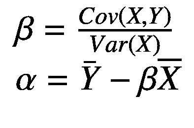
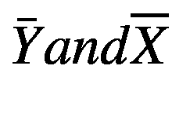
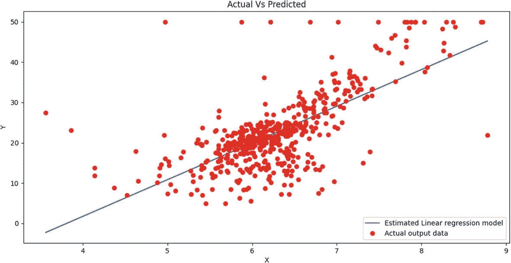
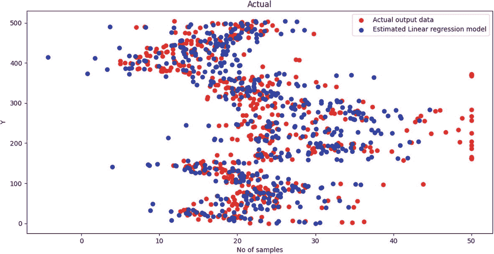
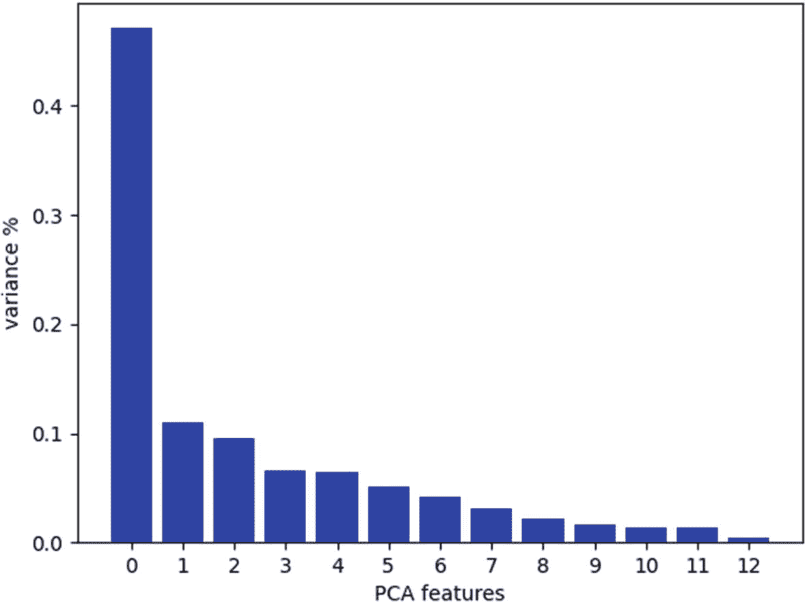
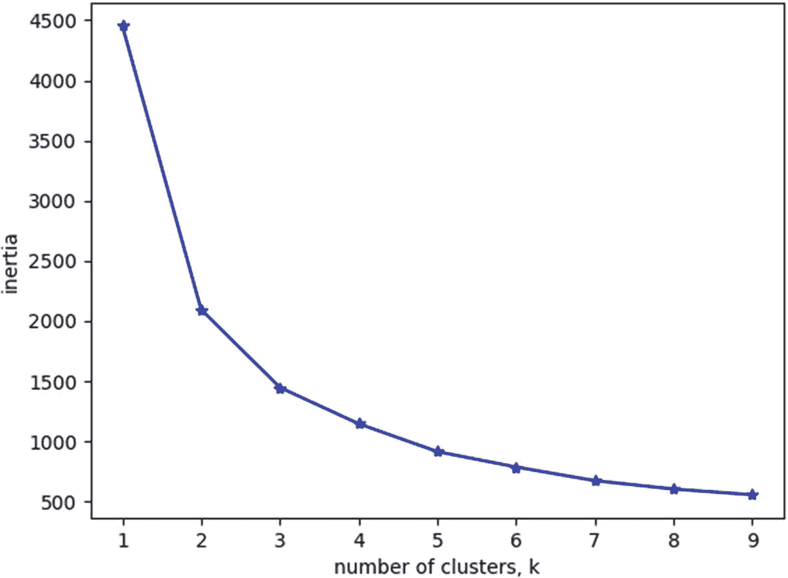
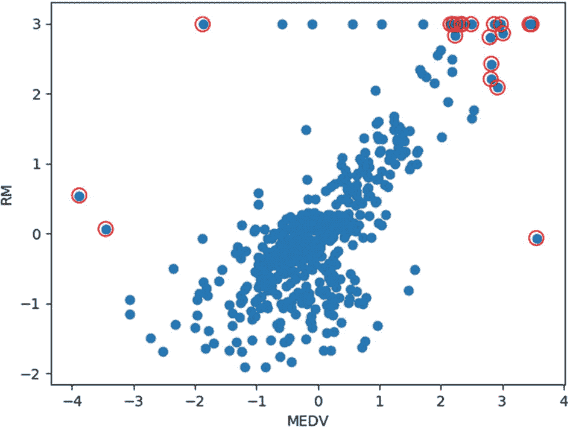

# 八、从数据中学习

从数据中学习意味着从数据中提取信息，并使用它进行预测/预报，以便根据它做出明智的决策。这一领域正变得越来越受欢迎，因为它适用于不同行业的各种应用，如金融、医疗保健、教育、计算机视觉、政治等。

从数据中学习用于各种情况，例如不需要解析解，或者没有关于问题的清晰模型，或者需要基于先前的信息进行预测，等等。基本上，有三种学习技术:监督学习、非监督学习和强化学习。*监督学习*利用对过程的观察来开发模型。基于过程的输入和输出观察(即，输入和输出数据)来训练监督学习模型。在*无监督学习*中，训练数据没有任何关于输出的信息。无监督模型根据数据的特征对模型进行分类。此外，无监督模型可用于发现数据中的模式、通过聚类相似数据来检测异常值、发现数据的结构等。*强化学习*模型也没有利用关于输出的正确信息。但是，它可能会输出一些关于输出质量的信息。

这一章重点描述利用波士顿数据集开发学习模型的技术。然后，我们将在 Raspberry Pi 中实现学习模型，并分析从传感器获取的行业数据。该实施将在第 [9](9.html) 章作为案例研究进行讨论。

## 使用回归根据数据进行预测

*回归*寻找数据集中变量之间的关系。回归用于确定一个变量对另一个变量的影响。此外，它还可用于根据变量以前的数据预测变量。回归模型可用于许多领域，例如预测经济趋势、预测商业销售、预测某些政策的影响以及预测医疗保健应用中的血压水平。

在回归中，开发模型需要两种变量:输入和输出。*输入变量*是数据集中用于预测输出变量的变量。线性回归中的输入变量通常表示为 x。一个*输出变量*是用于预测的变量，表示为 y。方程 [8-1](#Par7) 显示了线性回归的方程。

Ye=α+βX … (8-1)

这里，Ye 是估计输出变量，Y 是实际输出变量，α和β是线性回归模型的参数。例如，如果我们想买一台电视，并试图估计电视的成本(即输出变量)，我们使用输入变量，如电视的大小。现在，α、β和 Y 分别被(随机)选为 2、5 和€170。电视机的尺寸(即输入变量)为 32 英寸，估计电视机成本的线性回归模型的估计输出如等式 [8-2](#Par10) 所示。

叶=2+5 *32

    = €162    …(8-2)

因此，根据等式 [8-2](#Par10) ，当电视尺寸为 32 英寸时，电视的成本为€162，这更接近电视的实际成本:€170。如果我们将参数α和β分别修改为 0.1 和 0.5，则电视的估计成本计算如下:

叶=0.1+0.5 *32

= €16.1

电视的价格急剧变化为€16.1 英镑。这表明α和β的选择在预测输出变量中是重要的。因此，开发线性回归模型的目的是通过最小化实际输出 Y 和估计输出 Ye 之间的差异来找到α和β。有许多方法可以找到α和β的最佳参数。然而，普通的最小二乘法通常用于寻找α和β的最佳参数。

OL 方法使用输入变量的协方差和方差来识别参数α和β，如等式 [8-3](#Par16) 所示。

……(8-3)

这里，是实际输出和输入变量的平均值。

现在让我们考虑波士顿数据集。RM 变量用于表示每个住宅的平均房间数，目标变量(即输出变量)MEDV 用于表示房主自住房屋的中值(以千为单位)。对于线性回归建模，我们将 RM 视为输入变量，将 MEDV 视为输出变量。因为 RM 和 MEDV 彼此紧密相连，所以可以使用下面的代码实现这些变量的线性回归模型。为了识别α和β参数，使用普通的最小二乘法。

```py
from sklearn.linear_model import LinearRegression
import matplotlib.pyplot as plt
import numpy as np
from sklearn.datasets import load_boston
import pandas as pd
dataset = load_boston()
boston_data=pd.DataFrame(dataset.data,columns=dataset.feature_names)
Target=pd.DataFrame(dataset.target,columns=['target'])
# two variable for regression model
X1=boston_data['RM']
X=X1.to_numpy()  # dataframe is converted in to array for arithmetic operations
Y=dataset.target
xmean=np.mean(X)
ymean=np.mean(Y)
xcov=np.multiply((X-xmean),(Y-ymean))
xvar=(X-xmean)**2
# linear regression model
beta=xcov.sum()/xvar.sum()
alpha=ymean-(beta*xmean)
print(beta)
print(alpha)

```

OLS 方法的α和β值输出如下所示:

```py
Beta value is 9.10210898118031
Alpha value is -34.67062077643857

```

线性回归模型可通过使用先前的α和β值来开发，如等式 [8-4](#Par21) 中所示。

叶=-34.6706+9.1021*X … (8-4)

这里，X 是输入变量 RM。可以使用以下代码实现它:

```py
# prediction model
ye=alpha+beta*X

```

让我们绘制实际输出变量 Y 和估计模型 Ye，这清楚地显示了它们之间的关系，并可使用以下代码绘制(见图 [8-1](#Fig1) ):



图 8-1

实际产出变量与估计线性回归模型

```py
# plot
plt.figure(figsize=(12,6))
plt.plot(X1,ye)
plt.plot(X,Y,'ro')
plt.title('Actual Vs Predicted')
plt.xlabel('X')
plt.ylabel('Y')
plt.show()

```

### 使用 Scikit-Learn 进行线性回归

在前面的示例中，线性回归预测器使用一个输入变量来预测输出。基于给定的线性回归，可以用多个变量预测输出(见等式 [8-5](#Par25) )。

ye =α+β*<sub>+β</sub>*

 **方程 [8-5](#Par25) 使用了 *n* 个输入变量来预测输出变量 Ye。如果我们考虑波士顿数据集的所有输入变量(总共 13 个输入变量)和输出变量(MEDV)，则使用多个变量的回归模型可以使用 Scikit-Learn 实现，并在以下代码中给出:

```py
from sklearn.linear_model import LinearRegression
import matplotlib.pyplot as plt
import numpy as np
import seaborn as sns
from sklearn.datasets import load_boston
import pandas as pd
dataset = load_boston()
boston_data=pd.DataFrame(dataset.data,columns=dataset.feature_names)
Target=pd.DataFrame(dataset.target,columns=['target'])
# two variable for regression model
X=boston_data
Y=Target
lm=LinearRegression()
model=lm.fit(X,Y)
print(f'alpha={model.intercept_}')
print(f'beta={model.coef_}')
Ye=model.predict(X)
Y1=Y.to_numpy()
E=np.mean(Y1-Ye)
MSE=E**2
print(MSE)
# plot
plt.figure(figsize=(12,6))
plt.scatter(Y1,np.arange(0,len(Y)),color='red')
plt.title('Actual')
plt.xlabel('No of samples')
plt.ylabel('Y')
#plt.figure(figsize=(12,6))
plt.scatter(Ye,np.arange(0,len(Y)),color='blue')
plt.legend(['Actual output data','Estimated Linear regression model',  ])
plt.show()

Output:
For α and β values
    alpha=[36.45948839]
    beta=[[-1.08011358e-01  4.64204584e-02  2.05586264e-02     2.68673382e+00
      -1.77666112e+01  3.80986521e+00  6.92224640e-04 -    1.47556685e+00
       3.06049479e-01 -1.23345939e-02 -9.52747232e-01     9.31168327e-03
      -5.24758378e-01]]

```

为了评估模型的质量，我们可以使用均方差(MSE)度量。MSE 计算实际输出和预测输出之间的误差平方的平均值。

```py
1.8463848451630152e-29

```

图 [8-2](#Fig2) 比较实际输出(Y)和预测输出(Ye)。



图 8-2

使用线性回归将实际输出数据与预测输出数据进行比较

### 主成分分析

主成分分析是一种统计方法，用于提取大型数据集中的强特征。换句话说，可以通过从数据集中提取重要特征来降低数据集的维度。PCA 使用标准化来识别特征之间的距离，并实现协方差信息来识别特征之间的任何关系。然后，借助于特征向量和特征值，计算主成分。主成分用于提取强特征，即降低数据的维度。此外，主成分被用于优化 k-means 聚类技术的聚类数目，并且波士顿数据集被用于这项工作。波士顿数据集有 13 个要素。在第一步中，使用以下代码在 PCA 的帮助下识别波士顿数据集中的强特征:

```py
from sklearn.decomposition import PCA
from sklearn.preprocessing import StandardScaler
#config InlineBackend.figure_format='retina'
# Load in the data
from sklearn.datasets import load_boston
dataset = load_boston()
df=pd.DataFrame(dataset.data,columns=dataset.feature_names)
#df = pd.read_csv('2013_2014_cleaned.csv')
# Standardize the data to have a mean of ~0 and a variance of 1
X_std = StandardScaler().fit_transform(df)
# Create a PCA instance: pca
pca = PCA(n_components=13)
principalComponents = pca.fit_transform(X_std)
# Plot the explained variances
features = range(pca.n_components_)
plt.bar(features, pca.explained_variance_ratio_, color='black')
plt.xlabel('PCA features')
plt.ylabel('variance %')
plt.xticks(features)
plt.show()
# Save components to a DataFrame
PCA_components = pd.DataFrame(principalComponents)

```

从图 [8-3](#Fig3) 中，我们可以看到前三个特征在数据集中给出了很好的方差。



图 8-3

数据集中与方差相关的要素

因此，可以选择五个特征进行聚类。对于聚类，可以使用 k-means 聚类。为了确定最佳的聚类数目，PCA 与 k-means 聚类算法相适应，并利用所选择的主成分计算聚类模型的惯性。下面的代码标识了聚类模型的惯性，并绘制了具有惯性的聚类数(即 k)(该代码延续了前面的 PCA 代码)。图 [8-4](#Fig4) 显示了惯性与簇数(k)的关系图。从图 [8-4](#Fig4) 可以得出结论，在集群数(k = 5)后，惯性没有发生显著变化。因此，对于给定的数据集，可以选择五个作为簇头的最佳数量。



图 8-4

集群数量与惯性的关系

```py
ks = range(1, 10)
inertias = []
for k in ks:
    # Create a KMeans instance with k clusters: model
    model = KMeans(n_clusters=k)

    # Fit model to samples
    model.fit(PCA_components.iloc[:,:3])

    # Append the inertia to the list of inertias
    inertias.append(model.inertia_)

plt.plot(ks, inertias, '-*', color='blue')
plt.xlabel('number of clusters, k')
plt.ylabel('inertia')
plt.xticks(ks)
plt.show()

```

## 基于 K-均值聚类的离群点检测

聚类是一种用于无监督学习问题的探索性数据分析技术，即当没有关于数据的先验知识时。聚类背后的思想是将数据集中的数据点分组为多个子组，称为*簇*。每个聚类中的数据点比其他聚类中的数据点更类似于同一聚类中的其他点。

广泛用于聚类操作的技术是基于质心的方法，称为 *k 均值聚类*，这是一种迭代算法，将数据集分成 k 个不重叠的聚类，其中每个数据点仅分配给一个聚类。将数据点分配给聚类的条件是数据点到聚类质心的重叠聚类距离的平方和最小。k-means 算法的工作原理如下:

1.  指定分类的数量。

2.  为每个簇随机选择中心点，也称为*质心*。

3.  计算每个数据点与聚类质心之间的距离，并将这些点分配给距离最小的聚类。

4.  通过取分配给聚类的所有数据点的平均值，重新计算每个聚类的质心。

5.  重复步骤 3 和 4，直到质心没有变化。

除了对数据进行聚类，k-means 算法还可用于识别数据中存在的异常值。这种方法背后的思想是以升序对从每个数据点到聚类质心的距离进行排序，并将距离质心最大的一部分数据点视为异常值。

为了说明这种方法，让我们看一下波士顿住房数据集。正如我们在第 [7](7.html) 章中所讨论的，每套住宅的平均房间数(RM)和数千套自有住房的中值(MEDV)高度相关。因此，这两个参数被视为聚类分析算法的二维数据，如以下代码所示:

```py
import matplotlib.pyplot as plt
import numpy as np
import pandas as pd
from sklearn.cluster import KMeans
from sklearn.preprocessing import scale
from numpy import sqrt, random, array, argsort
from sklearn.datasets import load_boston
dataset = load_boston()
boston_data=pd.DataFrame(dataset.data,columns=dataset.feature_names)
x=boston_data['RM']
y=dataset.target
x=x.to_numpy() # convert pandas series data to numpy array
x=x.reshape(x.shape[0],1)
x=scale(x)
y=y.reshape(y.shape[0],1)
y=scale(y)
X=np.zeros((np.shape(x)[0],2))
X[:,0]=x[:,0]
X[:,1]=y[:,0]

```

数据集的要素首先被加载到数据帧中。对应于特征 RM 的列从数据帧移动到变量`x`。因为存储在变量`x`中的 RM 特征是 Pandas 系列格式，所以使用`to_numpy`函数将它转换为 NumPy 数组，使其适用于 k-means 算法。然后，这个数组被重新整形，因为它必须与目标变量 MEDV 一起存储在一个二维数组中。然后通过使用`sklearn`包中的`scale`函数对参数进行额外的缩放。这样做是为了在特定范围内对数据进行标准化。以类似的方式，目标 MEDV 特征(默认为 NumPy 数组)也存储在变量`y`中，进行整形和缩放。然后将两个变量`x`和`y`组合在变量`X`中，从而使其成为一个二维变量。下面的代码演示了对该变量应用 k-means 算法的过程:

```py
km=KMeans(n_clusters=1).fit(X)
distance = km.transform(X)
indexes = np.argsort(distance.ravel())[::-1][:20]

```

从`sklearn`包中导入的`Kmeans`函数可以用来实现聚类算法。这个函数可以接受输入，比如聚类数、最大迭代次数等等。在我们的代码中，我们给定了一个输入值，表示集群的数量。换句话说，我们将把所有数据点分组到一个集群中。由于没有指定最大迭代次数，该函数采用默认值 300 次迭代。在将 k-means 算法拟合到我们的数据之后，下一步是计算每个数据点到聚类质心的距离。这是通过使用`sklearn`包中的`transform`功能完成的。产生的距离变量也是一个 *n* 维 NumPy 数组。因此，首先使用`ravel`函数将其展平，然后将展平后的数组按降序排序。这意味着数组从距离聚类中心较远的数据点开始，到距离聚类中心较近的数据点结束。这种排序是使用`argsort`函数完成的，该函数提供与排序后的数据点相对应的索引。

我们知道离群值是远离数据集中其他数据点的异常数据点。但是什么被认为是不正常的是留给知道分析要求的分析师去做的。在波士顿住房数据的情况下，异常值是房间较少的家庭的高中值(定价过高)，房间较多的家庭的低中值(错误)，以及超出特定限制的房间组合数量的中值，这取决于要求。为了检测这些异常值，我们从排序的索引数组中随机选取前 20 个索引，并在所有数据点的散点图中标记与这些索引对应的数据点，如下所示:

```py
f,ax=plt.subplots()
ax.scatter(X[:,0],X[:,1])
ax.scatter(X[indexes][:,0],X[indexes][:,1],edgecolors='r',
             facecolors='none', s=100)
plt.xlabel('MEDV')

plt.ylabel('RM')
f.show()

```

图 [8-5](#Fig5) 显示了每套住宅的平均房间数与业主自住房屋的中值的散点图。数据中的异常值由周围有红圈的点表示。



图 8-5

使用 k-means 聚类算法检测异常值**