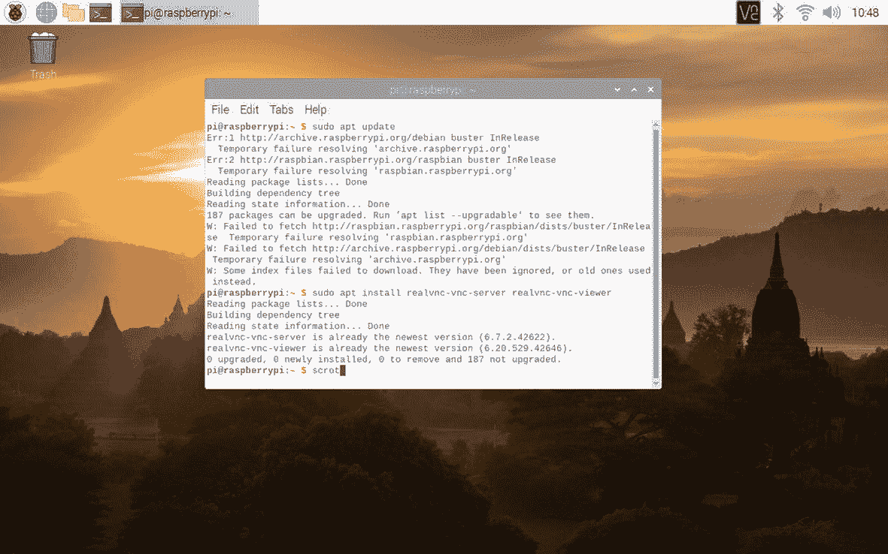

# 九、案例研究

本章介绍了实施数据科学概念的真实案例研究。考虑了三种场景:利用脑电信号进行人类情感分类的数据科学概念、图像数据和工业 4.0。

对于人类情绪分类，使用 NeuroSky MindWave 移动套件提取人类的 EEG 信号，并在 Raspberry Pi 中接收和分析 EEG 信号。NeuroSky MindWave 移动套件和 Raspberry Pi 可以通过蓝牙连接。在图像数据中，应用数据科学步骤对图像数据进行预处理以供进一步分析。在工业 4.0 案例研究中，树莓 Pi 充当了一个本地化的云。在这里，许多传感器连接到 Raspberry Pi，来自传感器的信号被转换为结构化数据，以便进一步分析和可视化。

## 案例研究 1:人类情感分类

情绪是一种以强烈的大脑活动为特征的感觉。大量的研究集中在识别人类情感的广泛应用上，例如医疗、健康、机器人和脑机接口(BCI)应用。有许多识别人类情感的方法，例如面部情感识别、从语音信号中识别音调、从 EEG 信号中识别情感等。其中，从脑电信号中进行分类是一种简单方便的方法。此外，EEG 信号具有关于人类情绪的有用信息。因此，许多研究人员致力于使用 EEG 信号对人类情绪进行分类。通过在头皮上放置电极来测量电信号，EEG 信号被用于记录人类大脑的活动。

让我们考虑一个简单的情绪识别系统，该系统使用单个电极设备，即 NeuroSky MindWave 设备，用于从参与者获取 EEG 信号，并在机器学习算法(即 k-nearest neighborhood(k-NN)和神经网络(NNs))的帮助下将他们的情绪分类为快乐、害怕或悲伤。

## 方法学

被包括的参与者来自不同的年龄组，他们分别接受了来自世界公认的数据库日内瓦情感图片数据库(GAPED)的不同类别的图片的实验。这些图像包括婴儿、快乐场景、虐待动物、人类关切、蛇和蜘蛛的图像，每一个都点燃参与者不同的情绪。然后，为所有参与者获取与记录的 EEG 信号相对应的特征数据集，然后这些特征接受像 k-NN 和 NN 这样的机器学习模型，该模型将每个信号分类为三种情绪之一:高兴、害怕或悲伤。

### 资料组

用于数据收集的两个设备是 NeuroSky MindWave 移动设备和 Raspberry Pi 3 板。NeuroSky MindWave 设备可用于安全记录脑电图信号。该设备由耳机、耳夹和传感器(电极)臂组成。耳机的接地电极在耳夹上，而 EEG 电极在传感器臂上，戴上耳机后，传感器臂将放在眼睛上方的前额上。该设备使用单节 AAA 电池，可持续八小时。

这个设备通过蓝牙连接到一个 Raspberry Pi 3 板上，如图 [9-1](#Fig1) 所示。它是第三代 Raspberry Pi 型号，配有四核处理器、1GB 内存和多个用于连接各种设备的端口。它还配有无线局域网和蓝牙支持，可以帮助连接无线设备，如我们的 MindWave Mobile。NeuroSky 设备供应商提供的软件安装在 Pi 板上，用于从设备获取串行数据。


图 9-1

Raspberry Pi 与通过蓝牙连接的 MindWave 手机

### 通过蓝牙连接 Raspberry Pi 和 MindWave Mobile

有两种方法可以将 MindWave 移动设备与 Raspberry Pi 连接。第一个是将 MindWave 手机与 Raspberry Pi 桌面连接起来。最初打开 Raspberry Pi，启动进入 Raspberry Pi 操作系统，然后打开 MindWave 移动蓝牙。然后点击 Raspberry Pi 操作系统中的蓝牙符号，这将显示准备与 Raspberry Pi 配对的设备。在列表中，可以选择 MindWave Mobile，并且可以使用供应商规定的配对密码 0000。现在，MindWave 移动设备与 Pi 配对，如图 [9-2](#Fig2) 所示。

T2】

图 9-2

树莓桌面与 MindWave Mobile 配对

可以通过蓝牙连接提取来自 MindWave 移动设备的信号。将覆盆子与 MindWave 连接的另一种方法是使用 Pypi 0.1.0。在 [`https://github.com/cttoronto/python-MindWave-mobile`](https://github.com/cttoronto/python-MindWave-mobile) 对步骤进行了说明。该链接提供了脑电波信号的阿尔法、贝塔和伽马值的数据。然而，在这项工作中，数据集是从脑电图信号发展而来。

### 数据收集过程

参与者坐在一个黑暗的小房间里，房间也是无线电静默的，以防止他们受到听觉和视觉的干扰。实验前会解释条款和条件，如果他们有任何不适，就会被告知停止测试。还向参与者提供了一份人工评分表，以评估他们在每张照片中的情绪。总共有 15 名参与者，记录了三种不同情绪的 15 个信号，从而得到总共 15 × 3 = 45 个 EEG 信号。这些情绪是快乐的、害怕的和悲伤的。

最初，使用 NeuroSky 设备从用户处获取原始 EEG 信号。从大脑中提取的原始 EEG 信号不能直接用于进一步处理。当受试者在特定的持续时间内受到基于视觉输入的情绪刺激时，所产生的情绪反应将是时变的。因此，重要的是识别大脑峰值活动的持续时间，并且仅提取该持续时间的特征，以便增强分类结果。为了实现这一点，记录在实验开始一分钟后开始，这样就有足够的时间使用与特定情绪相对应的图像幻灯片来模拟参与者的情绪。此外，为了避免处理大数据，只考虑每秒 512 个样本的 15 秒数据，从而将数据大小减少到 15 × 512 =7680 个样本，如图 [9-3](#Fig3) 所示。图 [9-3](#Fig3) 显示整个记录持续时间的信号，红色表示大脑活动高峰期的信号，图 [9-4](#Fig4) 单独显示这部分。


图 9-4

大脑峰值活动时提取的脑电信号


图 9-3

整个记录期间的 EEG 信号样本

### 从脑电波信号中提取的特征

脑电信号是大脑功能信息的丰富来源。为了从脑电信号中获取有意义的信息，需要提取信号的不同属性。从脑电信号中共提取了 9 个不同的时域属性，这些特征说明如下。

延迟与振幅比(LAR)被定义为最大信号时间与最大信号振幅之比；见方程 9-1。

(9-1)

这里，*t*<sub>*s*max</sub>= {*t*|*s*(*t*)=*s*<sub>max</sub>}为最大信号值出现的时间，*s*<sub>max</sub>= max {*s*(*t*)}为最大信号

峰峰值信号值(PP)定义为最大信号值和最小信号值之差，如公式 9-2 所示。

*s*<sub>*PP*</sub>=*s*<sub>max</sub>-*s*<sub>min</sub>(9-2)

这里， *s* <sub>max</sub> 和 *s* <sub>min</sub> 分别是信号最大值和最小值。

峰峰值时间窗(PPT)定义为最大信号时间和最小信号时间之差，如公式 9-3 所示。

*t*<sub>*PP*</sub>=*t*<sub>*s*max</sub>—*t*<sub>T15】smin</sub>(9-3)

这里， *t* <sub>*s* max</sub> 和 *t* <sub>*s* min</sub> 是最大和最小信号值出现的时间。

峰峰值斜率(PPS)定义为峰峰值信号值(PP)与峰峰值时间值(PPT)之比，如公式 9-4 所示。

(9-4)

这里， *s* <sub>*pp*</sub> 为峰间信号值， *t* <sub>*pp*</sub> 为峰间时间窗。

信号功率(P)定义为恒定振幅下无限时间存在的信号。信号功率如公式 9-5 所示。

(9-5)

信号的平均值(μ)定义为所选区域端点之间数据样本的平均值，并显示平均值。方程 9-6 给出了信号的平均值。

![$$ \mu =\frac{1}{N}\sum \limits_{i=1}^Ns\left[i\right] $$](img/496535_1_En_9_Chapter_TeX_IEq4.png)(9-6)

其中 *N* 是信号中的样本总数。

峰度(K)是频率分布曲线峰值的锐度，在方程 9-7 中给出。

(9-7)

这里，*m*T2 4 和*m*T6】2 是信号的四阶矩和方差。

迁移率(M)定义为信号的一阶方差与信号方差之比，在等式 9-8 中给出。

(9-8)

复杂度(C)被定义为流度的一阶导数除以流度，在等式 9-9 中给出。

(9-9)

九个时域特征的所有这些公式的 Python 代码被编写为单个函数，稍后在主程序中调用该函数。这个函数在大脑情绪活动的高峰期取 15 秒的 EEG 信号和相应的时间样本，图示如下:

```py
def eegfeat(ynew,tnew):
    from scipy.stats import kurtosis
    # latency to amplitude ratio
    smax=max(ynew)
    locmax=np.where(ynew==smax)
    tsmax=tnew[locmax]
    lar1=tsmax/smax
    lar=lar1[0]
    # peak to peak signal value
    smin=min(ynew)
    locmin=np.where(ynew==smax)
    tsmin=tnew[locmin]
    spp=smax-smin
    # peak to peak time window.
    tpp1=tsmax+tsmin
    tpp=tpp1[0]
    # peak to peak slope
    spps=spp/tpp
    # mean value of signal
    m=np.mean(ynew)
    # kurtosis
    k=kurtosis(ynew)
    # mobility and complexity
    n=ynew.shape[0]
    dynew=np.diff(ynew)
    ddynew=np.diff(dynew)
    mx2=np.mean(np.power(ynew,2))
    mdx2=np.mean(np.power(dynew,2))
    mddx2=np.mean(np.power(ddynew,2))
    mob=mdx2/mx2
    complexity=np.sqrt(mddx2/(mdx2-mob))
    mobility=np.sqrt(mob)
    # signal power
    tt=np.power(ynew,2)
    s=0
    for i in np.arange(0,tt.shape[0]):
    s=s+tt[i]
    signalpower=s/ynew.shape[0]
    feat = [lar, spp, tpp, spps, m, k, complexity, mobility, signalpower]
    return feat

```

### 非结构化数据到结构化数据集

既然我们有了从 EEG 信号中提取特征的函数，下一步就是开发代码来获得结构化数据集。首先，在一个`for`循环中使用`pd.read_csv`函数逐一加载对应于三种不同情绪的所有 15 名参与者的 EEG 信号。EEG 信号作为 dataframe 加载后，首先删除时间戳，然后将剩余列中的振幅值转换为 NumPy 数组。然后，将每次迭代中获得的阵列叠加到新的变量上，从而提供由对应于 45 个不同 EEG 信号的 45 列组成的最终阵列。然后，该数组的每一列被传递给前面创建的`eegfeat`函数，该函数通过提供一个大小为 9×45 的最终特征数组来提供与每一列(每个信号)相对应的九个特征。数据集在表 [9-1](#Tab1) 中给出，并作为`emotion_data1.xls`保存在 Excel 表格中。最后，使用`sklearns`模块中的`StandardScaler`和拟合功能缩放特征。这种缩放的工作原理是，首先计算所有 45 个信号的每个特征的平均值和标准偏差，然后从所有值中减去平均值，并将该差值除以标准偏差。以下代码说明了特征提取过程:

表 9-1

人类情感数据集特征

<colgroup><col class="tcol1 align-left"> <col class="tcol2 align-left"> <col class="tcol3 align-left"> <col class="tcol4 align-left"> <col class="tcol5 align-left"> <col class="tcol6 align-left"> <col class="tcol7 align-left"> <col class="tcol8 align-left"> <col class="tcol9 align-left"> <col class="tcol10 align-left"></colgroup> 
| 

利比亚

 | 

包裹邮递(Parcel Post)

 | 

演示文档

 | 

再附言

 | 

力量

 | 

平均

 | 

峭度

 | 

机动性

 | 

复杂性

 | 

标签

 |
| --- | --- | --- | --- | --- | --- | --- | --- | --- | --- |
| 0.016024 | Six hundred and seventy-eight | 11.18505 | 60.61663 | -0.04396 | 6.543546 | 0.864608 | 0.272718 | 3095.76805 | 快乐 |
| 0.021638 | Eight hundred and five | 17.95937 | 44.8234 | -0.13187 | 1.147168 | 0.908352 | 0.323672 | 8861.53844 | 快乐 |
| 0.013645 | One thousand one hundred and fifty-six | 18.50241 | 62.47835 | -0.13599 | 11.54561 | 0.909418 | 0.253198 | 5615.14591 | 快乐 |
| 0.020861 | Nine hundred and thirteen | 20.6941 | 44.11885 | -0.19559 | 4.77647 | 0.869794 | 0.274665 | 7488.51785 | 快乐 |
| 0.027464 | One thousand and fifty-one | 29.44133 | 35.69811 | 0.073972 | -0.04979 | 0.920326 | 0.739543 | 17478.1566 | 快乐 |
| 0.003051 | One thousand and fifty-six | 3.215262 | 328.4335 | 0.555873 | -0.70347 | 0.829795 | 0.648545 | 26836.2039 | 快乐 |
| 0.009142 | Seven hundred and eight | 5.996875 | 118.0615 | -1.4202 | 1.801014 | 0.807949 | 0.203007 | 5224.79068 | 快乐 |
| 0.044871 | Five hundred and seventy-seven | 27.64032 | 20.8753 | 0.774106 | 5.355427 | 0.872217 | 0.221742 | 3616.08585 | 快乐 |
| 0.025742 | One thousand and seventeen | 25.99948 | 39.11617 | -0.02595 | 15.2165 | 0.909882 | 0.275513 | 4281.25747 | 快乐 |
| 0.037152 | Five hundred and ninety-five | 19.31892 | 30.79882 | 0.490321 | 2.851322 | 0.908083 | 0.295561 | 3403.52707 | 快乐 |
| 0.017313 | Nine hundred and forty | 15.40826 | 61.00625 | 0.107773 | 0.582757 | 0.772671 | 0.179429 | 14818.1692 | 快乐 |
| 0.015074 | One thousand six hundred and twenty-six | 22.58107 | 72.00723 | -2.5419 | 2.847854 | 0.813119 | 0.216638 | 25075.0479 | 快乐 |
| 0.034336 | Eight hundred and twelve | 24.72197 | 32.84528 | 0.310597 | 9.089532 | 0.908852 | 0.326948 | 3481.33912 | 快乐 |
| 0.012292 | Nine hundred and eighteen | 12.0211 | 76.36575 | -0.1356 | 12.5699 | 0.88202 | 0.218335 | 4644.36149 | 快乐 |
| 0.001722 | Three thousand and sixty | 4.613882 | 663.2159 | -0.01663 | 34.31637 | 0.827843 | 0.097603 | 30433.0506 | 快乐 |
| 0.018688 | Four hundred and two | 8.89569 | 45.19043 | 0.032993 | 4.738717 | 0.882602 | 0.423034 | 1124.38087 | 恐惧 |
| 0.040525 | Five hundred and seventy-nine | 26.50345 | 21.84621 | 0.254913 | 2.882232 | 0.906008 | 0.304122 | 4124.12924 | 恐惧 |
| 0.020358 | One thousand five hundred and seventeen | Twenty-one point six two | 70.1665 | -0.11243 | 40.33238 | 0.916268 | 0.270259 | 7677.61001 | 恐惧 |
| 0.057451 | Three hundred and eighty-three | 22.63576 | 16.92013 | 0.012297 | 0.515585 | 0.915245 | 0.524744 | 1586.28054 | 恐惧 |
| 0.02732 | Seven hundred and thirty-five | 23.11238 | 31.80113 | -0.4819 | 2.371013 | 0.840896 | 0.430931 | 5550.91016 | 恐惧 |
| 0.010694 | One thousand five hundred and sixty-seven | 16.40448 | 95.52269 | 0.170683 | -0.28034 | 0.906462 | 0.697989 | 35493.9062 | 恐惧 |
| 0.027347 | Three hundred and seventy-eight | 10.88423 | 34.72915 | 0.02714 | 0.021038 | 0.779173 | 0.311332 | 2214.34304 | 恐惧 |
| 0.038418 | Seven hundred and seventeen | 29.58198 | 24.23773 | -0.75375 | 2.735193 | 0.886821 | 0.155092 | 7204.2341 | 恐惧 |
| 0.023423 | One thousand one hundred and fifteen | 25.76507 | 43.27564 | -0.3602 | 2.435107 | 0.860817 | 0.38882 | 12420.8748 | 恐惧 |
| 0.002859 | Four thousand four hundred and twenty | 12.57976 | Three hundred and fifty-one point three five eight | 4.408442 | 5.755933 | 0.6055 | 0.123552 | Two hundred and ninety-six thousand nine hundred and seventy-eight point zero six nine | 恐惧 |
| 0.025219 | Nine hundred and seventy-one | 24.71416 | 39.28922 | -0.08303 | 1.857694 | 0.766682 | 0.165919 | Eleven thousand four hundred and twenty-five point eight one four | 恐惧 |
| 0.015038 | Two thousand five hundred and sixteen | 21.53405 | 116.8382 | -2.2011 | 30.45224 | 0.93143 | 0.384335 | 22246.7576 | 恐惧 |
| 0.017566 | Eight hundred and thirty-three | 14.40422 | 57.83028 | -0.42794 | 2.695262 | 0.842994 | 0.172786 | 8374.92373 | 恐惧 |
| 0.019647 | Nine hundred and thirty-five | 20.27608 | 46.11346 | 0.316469 | 3.61666 | 0.9339 | 0.34069 | 8803.85773 | 恐惧 |
| 0.006667 | One thousand four hundred and four | 12.45475 | 112.7281 | 0.157155 | 27.96396 | 0.854443 | 0.211712 | 6280.25928 | 恐惧 |
| 0.01213 | Nine hundred and ninety-two | 14.45891 | 68.6082 | -0.29278 | 7.918369 | 0.826067 | 0.157843 | 8135.80814 | “悲伤” |
| 0.016787 | One thousand one hundred and eighty-seven | 19.33846 | 61.38029 | 0.17177 | 5.274371 | 0.862185 | 0.195176 | 16224.2062 | “悲伤” |
| 0.025382 | One thousand and seventeen | 24.46803 | 41.56444 | 0.228652 | 14.78168 | 0.863634 | 0.195593 | 5841.32003 | “悲伤” |
| 0.012709 | One thousand five hundred and twenty-four | 18.68212 | 81.57532 | -0.20364 | 19.9148 | 0.873179 | 0.190631 | 10495.4369 | “悲伤” |
| 0.047707 | Four hundred and ninety-nine | 24.13986 | 20.6712 | 0.102337 | 3.259416 | 0.864654 | 0.309553 | 2265.85228 | “悲伤” |
| 0.006046 | One thousand nine hundred and thirty-three | 10.67717 | 181.0405 | 0.758343 | 2.349937 | 1.003761 | 0.682323 | 24010.3048 | “悲伤” |
| 0.020863 | One thousand three hundred and five | 24.40943 | 53.46295 | 0.003427 | 0.833297 | 0.768599 | 0.488095 | 22671.4565 | “悲伤” |
| 0.020863 | One thousand three hundred and five | 24.40943 | 53.46295 | 0.003427 | 0.833297 | 0.768599 | 0.488095 | 22671.4565 | “悲伤” |
| 0.033872 | Eight hundred and sixty-three | 25.47207 | 33.88025 | 0.105906 | 9.95777 | 0.858691 | 0.220224 | 5482.11932 | “悲伤” |
| 0.02912 | Five hundred and thirty-five | 15.78331 | 33.89658 | -0.01854 | 0.234449 | 0.896769 | 0.619883 | 4619.19634 | “悲伤” |
| 0.000649 | Five thousand and seventy | 3.141034 | One thousand six hundred and fourteen point one one eight | -4.11542 | 6.964611 | 0.795685 | 0.173283 | Two hundred and thirty-one thousand six hundred and thirty-eight point nine nine six | “悲伤” |
| 0.015449 | Eight hundred and fifty-six | 14.58393 | 58.69474 | 0.157962 | 1.97371 | 0.786113 | 0.225146 | 6764.73669 | “悲伤” |
| 0.005224 | Three thousand eight hundred | 20.26826 | 187.4852 | 0.570607 | 22.94134 | 0.791691 | 0.094596 | 63679.0805 | “悲伤” |
| 0.016787 | One thousand one hundred and eighty-seven | 19.33846 | 61.38029 | 0.17177 | 5.274371 | 0.862185 | 0.195176 | 16224.2062 | “悲伤” |
| 0.008937 | Four hundred and ninety-four | 4.879542 | One hundred and one point two three nine | 0.109418 | 0.696421 | 0.769311 | 0.304871 | 3185.67894 | “悲伤” |

```py
import pandas as pd
import numpy as np
from sklearn.preprocessing import StandardScaler
F=512
a=np.zeros([(75*F)-(60*F),1])
for i in np.arange(1,4):
    for j in np.arange(1,16):
        filename = 'G:/Anand-EEG/EEG Database/Dataset/user'+str(j)+'_'+str(i)+'.csv'
        s=pd.read_csv(filename)
        s.drop('Time',inplace = True, axis=1)
        s1=s[' Value'][60*F:75*F]
        a=np.column_stack((a,s1.to_numpy()))
a=np.delete(a,0,1)
tnew=np.linspace(0,15,a.shape[0])
features=np.zeros([9,45])
for i in np.arange(0,a.shape[1]):
    parameters=eegfeat(a[:,i],tnew)
    for j in np.arange(0,features.shape[0]):
        features[j,i]=parameters[j]
scaler = StandardScaler()
features=scaler.fit(features)

```

### 脑电图数据的探索性数据分析

要读取`emotion_data.xls`文件，使用以下代码:

```py
import pandas as pd

emotion_data= pd.read_excel('\file_path\emotion_data1.xls')
To show the keys and first 5 dataset using the below code
print(emotion_data.keys())
Output:
Index(['LAR', 'PP', 'PPT', 'PPS', 'Power', 'Mean', 'Kurtosis', 'Mobility',
 'Complexity', 'Label'],
 dtype='object')
print(emotion_data.head(5))
Output:
   LAR       PP    PPT       PPS       ...  Kurtosis  Mobility  Complexity  Label
0  0.016024  678   11.18505  60.61663  ...  0.864608  0.272718  3095.76805  'Happy'
1  0.021638  805   17.95937  44.82340  ...  0.908352  0.323672  8861.53844  'Happy'
2  0.013645  1156  18.50241  62.47835  ...  0.909418  0.253198  5615.14591  'Happy'
3  0.020861  913   20.69410  44.11885  ...  0.869794  0.274665  7488.51785  'Happy'
4  0.027464  1051  29.44133  35.69811  ...  0.920326  0.739543  17478.15660 'Happy'

```

通过使用以下代码，可以查看最后五个数据点:

```py
print(emotion_data.tail(5))
         LAR    PP        PPT  ...  Mobility   Complexity      Label
40  0.000649  5070   3.141034  ...  0.173283  231638.99600    'Sad'
41  0.015449   856  14.583930  ...  0.225146    6764.73669      'Sad'
42  0.005224  3800  20.268260  ...  0.094596   63679.08050  'Sad'
43  0.016787  1187  19.338460  ...  0.195176   16224.20620  'Sad'
44  0.008937   494   4.879542  ...  0.304871    3185.67894     'Sad'
[5 rows x 10 columns]

```

要检查数据的形状，请使用以下代码:

```py
print(emotion_data.shape)
Output:
(45, 10)

```

通过使用下面的代码，可以显示情感数据中的数据类型。

```py
print(emotion_data.dtypes)
Output:
LAR              float64
PP                 int64
PPT              float64
PPS              float64
Power            float64
Mean             float64
Kurtosis         float64
Mobility         float64
Complexity       float64
Emotion Label     object
dtype: object

```

数据集中的修改包括删除列和使用第 [8](8.html) 章中的探索性数据分析部分更改数据。

图 [9-5](#Fig5) 显示了情感数据集中平均数据的直方图。


图 9-5

每种情绪的均值直方图

### 使用学习模型对情绪进行分类

提取特征后的下一步是应用分类算法来识别对应于信号的情感。由于我们已经知道与我们所使用的每个信号相对应的情绪，因此使用监督学习算法进行分类显然更好。在此之前，另一个重要的任务是将我们的数据拆分成训练和测试数据。在每种情绪的 15 个信号中，让我们考虑对应于用于训练的前 12 个信号的数据和对应于用于测试的剩余 3 个信号的数据。此外，应该创建与训练和测试数据相对应的标签。为此，我们将把情绪*快乐*标记为 1，*恐惧*标记为 2，*悲伤*标记为 3。下面的代码演示了数据和标签的这种拆分:

1.  k-神经网络

```py
m1=np.ones((15,),dtype=int)
ids=np.concatenate((m1,2*m1,3*m1),axis=0)
x_train=np.concatenate((features[:,0:12],features[:,15:27],features[:,30:42]),axis=1)
x_test=np.concatenate((features[:,12:15],features[:,27:30],features[:,42:45]),axis=1)
y_train=np.concatenate((ids[0:12],ids[15:27],ids[30:42]))
y_test=np.concatenate((ids[12:15],ids[27:30],ids[42:45]))

```

让我们首先使用 k-NN 算法根据数据对情绪进行分类。k-NN 是一种简单的监督机器学习算法，它对可用数据进行分类，并根据相似性得分将新数据分配到特定类别。k-NN 算法的工作原理是找出测试数据和训练数据之间的距离。找到到每个训练数据的距离后，训练数据按距离值的升序排序。在该有序数据中，选择前 k 个数据，并且该算法将在该数据中出现最频繁的标签分配给测试数据。欧几里德距离是 k-NN 算法最常用的距离度量，两个数据点 x <sub>i</sub> 和 y <sub>i</sub> 之间的距离由以下表达式给出:


使用`sklearn` Python 模块中的`KNeighborsClassifier`包实现 k-NN 分类。使用此包的情感分类代码如下所示:

```py
from sklearn.neighbors import KNeighborsClassifier
from sklearn.metrics import confusion_matrix, classification_report
classifier = KNeighborsClassifier(n_neighbors=16)
classifier.fit(x_train.T, y_train)
y_pred = classifier.predict(x_test.T)
cm=confusion_matrix(y_test, y_pred)
print("confusion matrix\n",cm)
print("Accuracy:",(sum(np.diagonal(cm))/9)*100)
Output:
       confusion matrix
       [[1 0 2]
       [1 2 0]
        [2 0 1]]
Accuracy: 44.44444444444444

```

前面代码中的参数`n_neighbors`表示 k 的值，我们选择为 16。因此，考虑 16 个邻居来做出分类决定。首先，计算测试数据和所有其他训练数据之间的距离。然后，训练数据点按照计算距离的升序排序。在排序的数据中，考虑对应于前 16 个数据的标签，并且将 16 个数据中出现较多的标签分配给测试数据。对所有九个测试信号重复这一过程(每种情绪三个)，使用混淆矩阵显示结果，使用表 [9-2](#Tab2) 中的信息可以更好地理解混淆矩阵。

表 9-2

基于 k-NN 的情感分类混淆矩阵

<colgroup><col class="tcol1 align-left"> <col class="tcol2 align-left"> <col class="tcol3 align-left"> <col class="tcol4 align-left"></colgroup> 
|   | 

**快乐**

 | 

**恐惧**

 | 

**悲伤**

 |
| --- | --- | --- | --- |
| 幸福的 | one | Zero | Two |
| 害怕 | one | Two | Zero |
| 悲哀的 | Two | Zero | one |

在混淆矩阵中，行标题可以被视为输入，列标题可以被视为输出。例如，如果我们考虑第一行，对应于“快乐”情绪的三个 EEG 信号中只有一个被正确识别，而剩余的两个信号被错误地分类为“悲伤”情绪。类似地，在第二行中，对应于“恐惧”情绪的两个信号被正确分类，而在第三行中，对应于“悲伤”情绪的一个信号被正确识别。为了更好地理解，混淆矩阵中的对角线元素表示分类正确的数据，其余元素表示分类错误。总的来说，九个测试信号中有四个被正确分类。使系统的准确率达到 44.44%。

## 案例研究 2:影像数据的数据科学

虽然今天可用的数字设备可以捕捉比人类视觉更高分辨率和更多细节的图像，但计算机只能将这些图像视为代表颜色的数值阵列。*计算机视觉*是指能够使计算机理解数字图像和视频的技术。计算机视觉系统可以被视为人类视觉系统的复制，使计算机能够像人类一样处理图像和视频。计算机视觉系统被用于许多应用中，例如人脸识别、自动驾驶车辆、医疗保健、安全、增强现实等。

任何计算机视觉系统的第一步都是捕捉感兴趣的图像。这可以通过许多手段来完成，如照相机、显微镜、x 光机、雷达等。，取决于应用的性质。然而，捕获的原始图像不能直接使用，需要进一步处理。由于各种原因引入的噪声，原始图像可能不具有期望的质量。因此，在进一步处理之前，增强捕获的原始图像是至关重要的。为了使计算机能够从图像中学习，有时有必要使用分析技术从图像中提取有用的信息。在本节中，我们将了解如何使用与 Raspberry Pi 板接口的摄像机捕捉图像，并讨论为进一步处理准备原始图像所涉及的步骤。

第一步是将 USB 网络摄像头连接到我们的 Raspberry Pi 板，如图 [9-6](#Fig6) 所示。


图 9-6

带网络摄像头的树莓派

为此，我们必须在 Pi 配置设置中启用 SSH 和 Camera。安全外壳(SSH)有助于通过本地网络远程连接 Raspberry Pi，而启用摄像头配置有助于将网络摄像头与 Pi 板连接。这可以通过以下步骤完成:


图 9-8

支持摄像头和 SSH 的接口选项


图 9-7

软件配置工具窗口

1.  在 Raspberry Pi 操作系统的终端窗口中键入命令`sudo raspi-config`。这将打开软件配置工具窗口，如图 [9-7](#Fig7) 所示。

2.  进入接口选项，如图 [9-8](#Fig8) 所示，同时启用 SSH 和 Camera。

3.  重启 Raspberry Pi 设备。

重新启动完成后，在终端窗口中运行`lsusb`命令，并检查连接的 USB 网络摄像头是否列出。然后打开 Python IDE，键入以下代码，使用网络摄像头捕捉并保存图像:

```py
import cv2
import pandas as pd
import numpy as np
import matplotlib.pyplot as plt
camera=cv2.VideoCapture( )
ret, img = camera.read( )
cv2.imwrite('image.png',img)
img= cv2.cvtColor(img,cv2.COLOR_BGR2RGB)
plt.imshow(img)
plt.axis('off')
plt.show( )

```

如代码所示，`OpenCV`包用于处理 Python 中的图像。为了捕捉图像，首先创建一个`VideoCapture`对象。`read()`函数用于使用创建的对象捕捉图像，然后存储在变量`'img'`中。然后可以使用`imwrite()`功能保存拍摄的图像。`OpenCV`以 BGR 格式而非标准 RGB 格式显示图像。因此，在显示之前，首先使用`cv2.color`功能将图像转换为 RGB 图像。要显示图像，可以使用 Matplotlib 包中的`imshow()`函数。由于使用此软件包创建的图默认情况下启用了轴值，因此在显示图像时必须移除轴。这可以通过将 Matplotlib 包中的`axis`函数设置为`off`状态来实现。图 [9-9](#Fig9) 显示了使用先前代码捕获的样本图像。


图 9-9

使用连接到 Raspberry Pi 板的网络摄像头捕获的图像

### 探索性图像数据分析

这张图片显示了一些静止的物体躺在白纸上。为了理解采集的图像数据，最好打印图像的数据类型和大小，如下所示:

```py
print(type(img))
print(img.shape)
Output:
      <class 'numpy.ndarray'>
      (719, 1206, 3)

```

捕获的图像是一个 NumPy 数组。使用网络摄像头捕捉的图像通常是 RGB 格式，其中有三个像素平面:红色、蓝色和绿色。换句话说，图像中的每个像素由三个值组成，这三个值代表红色、蓝色和绿色的比例，从而导致可见光谱中的各种颜色。印刷图像形状中的数字 3 表示三个平面；即，图像由对应于 RGB 的三个平面组成，每个平面的大小为 719× 1206 像素。在许多应用中，其他细节如边缘、形状等。，在图像中比颜色信息更重要。例如，如果我们的目标是识别给定图像中的静止物体，物体的形状将比颜色更重要。在这种情况下，可以使用以下代码将三平面 RGB 图像转换为单平面灰度图像:

```py
gray = cv2.cvtColor(img, cv2.COLOR_BGR2GRAY)
plt.imshow(gray,cmap= 'gray')
plt.axis('off')
plt.show( )
print(gray.shape)
Output:
      (719, 1206)

```

图 [9-10](#Fig10) 显示了一个单平面灰度图像，其中图像中的颜色被移除。这可以从前面代码中打印的图像大小看出来。现在灰度图像的尺寸在单个平面上仅为 719×1206。在一些情况下，捕获的图像可能具有由图像传感器中的缺陷引起的一些缺失值。这些值也可以反映在灰度图像中，并且可以通过将图像转换为数据帧来检测和处理这些值，如下所示:

```py
df=pd.DataFrame(gray)
s=df.isnull( ).sum( ).sum( )
print(s)
if s!=0:
    df=df.ffill(axis=0)
gray=df.to_numpy( )
Output:
      0

```

`isnull( )`功能可用于检测图像的行和列中是否存在缺失值。`sum( )`函数可用于计算数据帧中沿行和列的缺失值的数量。如果`sum( )`函数的结果不等于零，那么图像由缺失值组成，它们可以使用`ffill( )`函数进行处理，该函数将每个缺失值替换为其上的像素。这种向前填充或向后填充的方法不会导致图像中任何可见的变化，因为除了图像的边缘之外，像素值通常被紧密地放置在图像中。如前面的代码所示，缺失值的数量为 0；即图像中没有丢失的值。一旦检查了图像并处理了缺失值，就可以使用 Pandas 中的`to_numpy( )`将数据帧转换回 NumPy 数组。因为像素值被紧密放置，所以在图像中的许多区域可能存在相同像素值的重复。由于这个属性，重复值的识别在图像数据的情况下是不相关的。


图 9-10

图像转换为灰度

在自然光下使用 USB 网络摄像头或 Pi 摄像头通常会导致图像质量不佳。因此，处理缺失值后的下一步是绘制图像的直方图。直方图将给出图像对比度的概念，如图 [9-11](#Fig11) 所示。下面的代码说明了这一点:


图 9-11

灰度图像的直方图

```py
plt.hist(gray.ravel( ),bins=256)
plt.xlabel('bins')
plt.ylabel('No of pixels')
plt.show( )

```

灰度图像中的像素值范围从 0(代表黑色)到 255(代表白色)。前面代码中的`hist( )`函数绘制了该范围内每个像素值计数的条形图。这个图显示了我们正在处理的图像的对比度。图 [9-7](#Fig7) 显示了我们的灰度图像的直方图。可以看出，大多数像素都在范围(120，160)内。如果像素的分布集中在较低的面元中，那么我们有一个低对比度的图像，反之亦然。因此，根据该图，可以决定图像是否需要对比度调整。

图像质量差的另一个原因可能是由各种因素引起的噪声的存在。当观察捕获的图像时，这些噪声可以以颗粒的形式被视觉感知。在这种情况下，在进行进一步处理之前，必须消除这些噪声。有许多不同种类的噪声，如高斯噪声、椒盐噪声等。，有许多不同类型的过滤器可以用来消除那些超出本书范围的噪音。让我们来看看图像处理中经常使用的一种特殊滤波器，称为*平均滤波器*。它是一种低通滤波器，可用于去除数字图像中的高频内容。这种过滤的工作原理是，在图像的各个维度上传递一个特定大小(比如 3×3)的内核，取内核区域下所有像素的平均值，并用该平均值替换中心元素。整体效果是营造一种模糊的效果。下面的代码说明了我们的图像平均过滤器的实现。图 [9-12](#Fig12) 显示了滤波后的图像。


图 9-12

平均滤波得到的图像

```py
blur=cv2.blur(gray,(3,3))
plt.imshow(blur)
plt.axis('off')
plt.show( )

```

### 为模型准备图像数据

一旦预处理步骤完成，下一步就是为学习模型分析或准备图像。这可以通过两种方式实现。第一种方法是提取代表有用信息的特征，并将其用于建模。提取的特征可以是另一个变换图像，或者它们可以是从原始图像提取的属性。有许多可以从图像中提取的特征，并且特定特征的选择取决于我们的应用的性质。对这些众多特性的讨论超出了本书的范围。相反，我们将讨论一个特殊的功能:边缘检测。

边缘代表图像中的高频内容。Canny 边缘检测是一种使用多阶段方法来检测图像中各种边缘的算法。可以通过使用`OpenCV`中的`Canny( )`函数在 Python 中实现，如下面的代码所示。图 [9-13](#Fig13) 显示了边缘检测处理后的图像。


图 9-13

边缘检测后的图像

```py
edge_img=cv2.Canny(gray,100,200)
plt.imshow(edge_img,cmap='gray')
plt.axis('off')
plt.show( )

```

第二种方式是直接将图像馈送给深度学习模型。深度学习是一种流行的机器学习方法，越来越多地用于分析和学习图像。这种方法可以直接从图像中学习有用的信息，不需要任何特征提取。可以将图像调整到不同的形状，然后馈送到学习模型，或者可以将图像阵列转换成一维向量，然后馈送到模型。

### 使用深度神经网络的对象检测

对象检测是一种用于识别真实世界中的对象的技术，例如椅子、书、汽车、电视、花、动物、人等等。，来自图像或视频。这项技术可以检测、识别和辨认图像中的多个对象，以便更好地理解或从现实环境中提取信息。对象检测在计算机视觉应用中起着重要的作用，如自动驾驶汽车、监控、工业自动化和视障人士的辅助设备。Python 环境中有许多模块可用于对象检测，如下所示:

*   基于特征的目标检测

*   Viola Jones 对象检测

*   具有猪特征的 SVM 分类

*   深度学习对象检测

*   单次多盒探测器(SSD)物体探测

*   你只看一次(YOLO)模型物体探测

*   基于区域的卷积神经网络(R-CNN)

*   更快的 R-CNN

这里，我们使用了单次多盒检测器来识别图像或视频中的多个对象。C. Szegedy 等人在 2016 年 11 月提出了单触发多盒探测器。SSD 可以解释如下:

*   *单镜头*:在这个阶段，图像的定位和分类是在单个前向传递网络的帮助下完成的。

*   *Multibox* :这表示在一个图像中绘制多个对象的边界框。

*   *检测器*:这是一个物体检测器，对图像或视频中的物体进行分类。

图 [9-14](#Fig14) 显示了单触发多盒探测器的架构。

在该架构中，输入图像的尺寸被认为是 300×300×3。VGG-16 架构用作基础网络，完全连接的网络被丢弃。VGG-16 体系结构是流行的，并且利用迁移学习技术具有很强的分类能力。这里，VGG-16 架构的卷积层的一部分被用在早期阶段。固态硬盘的详细说明可在 [`https://towardsdatascience.com/understanding-ssd-multibox-real-time-object-detection-in-deep-learning-495ef744fab`](https://towardsdatascience.com/understanding-ssd-multibox-real-time-object-detection-in-deep-learning-495ef744fab) 找到。


图 9-14

单触发多盒探测器( [`https://towardsdatascience.com/understanding-ssd-multibox-real-time-object-detection-in-deep-learning-495ef744fab`](https://towardsdatascience.com/understanding-ssd-multibox-real-time-object-detection-in-deep-learning-495ef744fab) )架构

多框体系结构是一种用于识别边界框坐标的技术，并且基于两个损失函数，例如置信度损失和位置损失。置信损失使用分类熵来测量为边界框识别对象的置信水平。位置损失测量边界框的距离，它远离图像中的对象。为了测量距离，使用了 L2 范数。多盒损耗可借助以下公式测量:

多盒损失=置信度损失+α*位置损失

这提供了关于边界框离预测对象有多远的信息。以下代码使用 DNN 权重实现 SSD 配置文件，以检测 COCO 名称中的对象。可以从 [`https://github.com/AlekhyaBhupati/Object_Detection_Using_openCV`](https://github.com/AlekhyaBhupati/Object_Detection_Using_openCV) 下载用于检测可可名中物体的 DNN 权重(即`frozen_inference_graph.pb`)的 SSD 配置文件(即`ssd_mobilenet_v3_large_coco_2020_01_14.pbtxt`)。

可可名字在这种情况下被称为常见对象，可可名字的数据集可在官方网站获得: [`https://cocodataset.org/#home`](https://cocodataset.org/%2523home) 。COCO 分割了椅子、汽车、动物、人类等常见对象。，并且这些分割的图像可以用于训练深度神经网络。参见图 [9-15](#Fig15) 和图 [9-16](#Fig16) 。


图 9-15

用于对象识别的输入图像

代码如下:


图 9-16

输出带有已识别对象的图像

```py
import cv2
thres = 0.5# Threshold to detect object
cap = cv2.VideoCapture(0)
cap.set(3,1280)
cap.set(4,720)
cap.set(10,70)
classNames= []
classFile = 'coco.names'
with open(classFile,'rt') as f:
     classNames = f.read().rstrip('\n').split('\n')

configPath = 'ssd_mobilenet_v3_large_coco_2020_01_14.pbtxt'
weightsPath = 'frozen_inference_graph.pb'

net = cv2.dnn_DetectionModel(weightsPath,configPath)
net.setInputSize(320,320)
net.setInputScale(1.0/ 127.5)
net.setInputMean((127.5, 127.5, 127.5))
net.setInputSwapRB(True)
print('1st done')
while True:
     success, img = cap.read()
     classIds, confs, bbox = net.detect(img, confThreshold=thres)
     print(classIds, bbox)
      if len(classIds) != 0:
         for classId, confidence,box in zip(classIds.flatten(),confs.flatten(),bbox):
            cv2.rectangle(img,box,color=(0,255,0),thickness=2)
            cv2.putText(img,classNames[classId-1].upper(),(box[0]+10,box[1]+30),
                        cv2.FONT_HERSHEY_COMPLEX,1,(0,255,0),2)
            cv2.putText(img,str(round(confidence*100,2)),(box[0]+200,box[1]+30),
                         cv2.FONT_HERSHEY_COMPLEX,1,(0,255,0),2)
     cv2.imshow("Output",img)
     # Hit 'q' on the keyboard to quit!

```

当代码被执行时，来自网络摄像头的视频帧被使用`OpenCV capture`函数捕获。然后，每一帧都被插入到已经训练好的 SSD-DNN 模型中，用于识别对象。SSD-DNN 模型基于可可名称对对象进行分类，并在检测到的图像上创建具有可可名称标签和准确性的边界框。图 [9-15](#Fig15) 的视频文件作为输入输入到之前的程序中。该图形中有椅子、书和鼠标等物体。从图 [9-16](#Fig16) 可以清楚地得出结论，基于 SSD 的 DNN 模型识别三个物体的准确率为椅子 72.53%，书 67.41%，鼠标 81.52%。

## 案例研究 3:工业 4.0

工业 4.0 代表了制造业的第四次革命。工业的第一次革命(即工业 1.0)是在蒸汽动力的帮助下创造机械能，以提高装配线的生产率。第二次革命(即工业 2.0)将电力纳入流水线，提高生产率。第三次革命(即工业 3.0)结合了计算机来实现工业过程的自动化。目前，工业 4.0 正在采用计算机、数据分析和机器学习工具，以便在传感器获取的数据的帮助下做出智能决策或监控过程。物联网(IoT)最近在获取数据和传输数据以进行远程访问方面发挥了重要作用。

图 [9-17](#Fig17) 描述了工业 4.0 中的基本工艺流程。最初，物理系统的数据是在传感器的帮助下收集的，并被制成数字记录。然后，物理系统的数字记录被发送到服务器系统进行实时数据处理和分析。数据科学技术应用于预处理和准备数据的阶段。然后现代学习算法可以通过用学习的模型预测输出来用于智能决策。此外，可视化技术被用来监控物理系统的实时数据。在这里，Raspberry Pi 可以用作服务器或本地化的云来进行实时数据处理。


图 9-17

工业 4.0 框图

### 树莓 Pi 作为工业 4.0 的本地化云

要实现工业 4.0，需要一台精密的计算机来连接设备，收集数据，处理数据。收集的数据可以存储在云服务中，以供进一步处理。然而，如今，云服务的订阅费用更高，适合高利润的公司。小规模的公司会希望实现一个本地化的云来进行实时处理。此外，本地化云方法可以提供数据安全性，因为它是在现场的，攻击者无法通过远程访问进行入侵。

正如第 [3](3.html) 章所讨论的，树莓 Pi 可以作为一个本地化的云，可以连接传感器、物联网设备、其他附近的计算机和手机，如图 [9-18](#Fig18) 所示。复杂的计算机也可以充当本地化的云，但是它们占据了很大的空间。此外，很难在偏远地区安装计算机。树莓派的优点是占用空间少，可以在偏远地区实现。基于此，树莓 Pi 作为工业 4.0 框架的本地化云，如图 [9-19](#Fig19) 所示。


图 9-19

工业 4.0 框架与树莓派


图 9-18

作为本地化云的树莓派

树莓派的工业 4.0 框架中有三个模块可用。这些模块正在收集来自传感器的数据，使用相机收集信息，并将 Raspberry Pi 与其他计算机连接。

### 从传感器收集数据

我们将使用温度和湿度传感器来测量温度和湿度。将 DHT 11/22 传感器模块连接到 Raspberry Pi，如第 [3](3.html) 章所示。以下代码收集 100 秒内的温度和湿度百分比，并将收集的数据存储为 CSV 文件。

```py
import Adafruit_DHT
import time
from datetime import datetime

DHT_SENSOR = Adafruit_DHT.DHT11
DHT_PIN = 17

data = []

while _ in range(100):

    humidity, temperature = Adafruit_DHT.read(DHT_SENSOR, DHT_PIN)

    if humidity is not None and temperature is not None:

now = datetime.now()
dt_string = now.strftime("%d/%m/%Y %H:%M:%S")

data.append(dt_string,humidity,temperature)

    time.sleep(60*5)

df = pd.DataFrame(data)
df.to_csv('data.csv',index=None,header=None)

```

CSV 文件将类似于表 [9-3](#Tab3) 。

表 9-3

湿度和温度传感器的时间戳数据

<colgroup><col class="tcol1 align-left"> <col class="tcol2 align-left"> <col class="tcol3 align-left"></colgroup> 
| 17/05/2020 01:05:14 | Twenty-six point two four | Sixty-nine point nine one |
| 17/05/2020 01:10:14 | Twenty-six point two four | Seventy point six five |
| 17/05/2020 01:15:14 | Twenty-six point two two | Sixty-eight point eight seven |
| 17/05/2020 01:20:14 | Twenty-six point one five | Seventy point one one |
| 17/05/2020 01:25:14 | Twenty-six point one one | Sixty-nine point zero two |

### 在 Raspberry Pi 中准备行业数据

我们将使用由两列数据组成的数据集，这两列数据来自连接到 Raspberry Pi 板的温度和湿度传感器；在 28 小时内，每 5 分钟记录一次数据。因此，数据集本质上是`.csv`格式的时间序列数据。在进行预处理之前，最好先了解数据集。因此，第一步是读取文件并打印内容，如下所示:

```py
import pandas as pd
import matplotlib.pyplot as plt
import numpy as np
dataset=pd.read_csv('datasets_384649_744229_log_temp.csv')
print(dataset.head())
Output
      Date      Time    Temperature    Humidity
0  3/14/19  19:33:07         T=22.0      H=20.0
1  3/14/19  19:38:10         T=22.0      H=20.0
2  3/14/19  19:43:11         T=22.0      H=26.0
3  3/14/19  19:48:14         T=22.0      H=26.0
4  3/14/19  19:53:15         T=22.0      H=20.0

```

从打印的数据集的前五个条目来看，很明显，在我们开始分析数据之前，需要清理数据。分析不需要由条目的日期和时间组成的前两列，因此可以删除这两列。由实际数据组成的第三和第四列是字符串和数字的混合。我们必须过滤掉这些不合适的值，并将数据集从`string`转换为`float`。这两个操作可以如下图所示执行:

```py
# drop the date and time column
drop=['Date','Time']
dataset.drop(drop,inplace=True,axis=1)
# remove the 'T=' and 'H=' string
dataset['Temperature']=dataset['Temperature'].str.replace('T=','')
dataset['Humidity']=dataset['Humidity'].str.replace('H=','')
dataset=dataset.astype(float)
print(dataset.head())
Output:
    Temperature    Humidity
0          22.0        20.0
1          22.0        20.0
2          22.0        26.0
3          22.0        26.0
4          22.0        20.0

```

下一步是检查两列中缺失的数据。如前所述，丢失的数据通常是 NaN 的形式，Pandas 包中的函数`isna()`可以用来检测这种数据的存在。NumPy 数据中的函数`where()`可以与函数`isna()`一起使用，以获得相应列中缺失值的位置，如下所示:

```py
print(np.where(dataset['Temperature'].isna()))
print(np.where(dataset['Humidity'].isna()))
Outpu:
(array([206, 207, 214, 215, 216, 217, 218, 219, 220, 221, 222, 223, 224,
 225, 226, 227], dtype=int64),)
(array([206, 207, 214, 215, 216, 217, 218, 219, 220, 221, 222, 223, 224,
 225, 226, 227], dtype=int64),)

```

从前面的结果可以看出，温度列和湿度列中都有缺失数据，并且缺失数据的位置在这两列中是相同的。下一步将是处理丢失的值。处理缺失值的方法可能因数据的性质而异。在我们的数据集中，因为我们每五分钟测量一次温度和湿度值，所以可以有把握地假设在缺失值的范围内不会有太大的变化。因此，可以使用`ffill`方法填充缺失的值，这代表“向前填充”,其中缺失的值被前一行中的值替换。这可以使用 Pandas 包中的`fillna()`函数来实现。在实现这个填充过程之后，可以使用`isna().any()`函数来验证这一点，如果任何一列中没有缺失值，该函数将返回 false，如下所示:

```py
dataset['Temperature']=dataset['Temperature'].fillna(axis=0,method='ffill')
dataset['Humidity']=dataset['Humidity'].fillna(axis=0,method='ffill')
print(dataset.isna().any())
Output:
    Temperature    False
    Humidity       False
    dtype: bool

```

既然已经处理了缺失值，下一步就是寻找数据中的异常值。为此，让我们使用我们之前讨论过的 Z 分数。在计算 Z 得分之前，应将数据集中的条目转换为整数。以下代码说明了如何使用 Z 值来检测和移除异常值:

```py
from scipy import stats
z=np.abs(stats.zscore(dataset))
df1=dataset[z>3]
print(df1)
dataset=dataset[(z<3).all(axis=1)]
Output:
       Temperature  Humidity
47             9.0     140.0
157           37.0      12.0

```

从上图可以看出，有两个异常值对应于行索引 47 和 57。我们保留所有 Z 得分小于 3 的数据点，而不是删除对应于 Z 得分大于 3 的数据点的异常值。

### 实时传感器数据的探索性数据分析

我们讨论了数据科学家经常使用的一些基本图，并用一些现成的数据集演示了每个图。在本节中，我们将使用实时传感器数据展示一些曲线图。让我们以在第 [5](5.html) 章中使用的相同温度和湿度传感器数据来讨论准备数据的概念。由于我们已经完成了该章中的所有数据清理步骤，这里提供了相同的代码，用于在绘制之前准备数据:

```py
import pandas as pd
import matplotlib.pyplot as plt
import numpy as np
from scipy import stats
dataset=pd.read_csv('datasets_384649_744229_log_temp.csv')
# drop the date and time column
drop=['Date','Time']
dataset.drop(drop,inplace=True,axis=1)
# remove the string  header'T=' and 'H='
dataset['Temperature']=dataset['Temperature'].str.replace('T=','')
dataset['Humidity']=dataset['Humidity'].str.replace('H=','')
dataset=dataset.astype(float)
print('After removing inappropriate data\n',dataset.head())
# detect the location of missing data, if any
print('Missing values in temperature\n',np.where(dataset['Temperature'].isna()))
print('Missing values in humidity\n',np.where(dataset['Humidity'].isna()))
# filling the missing values using forward fill
dataset['Temperature']=dataset['Temperature'].fillna(axis=0,method='ffill')
dataset['Humidity']=dataset['Humidity'].fillna(axis=0,method='ffill')
# detect and remove outliers using z-score
z=np.abs(stats.zscore(dataset))
df1=dataset[z>3]
dataset=dataset[(z<3).all(axis=1)]
print(dataset.head())

Output:
    After removing inappropriate data
                 Temperature     Humidity
0                       22.0         20.0
1                       22.0         20.0
2                       22.0         26.0
3                       22.0         26.0
4                       22.0         20.0
    Missing values in temperature
      (array([206, 207, 214, 215, 216, 217, 218, 219, 220, 221, 222, 223, 224,
  225, 226, 227], dtype=int64),)
    Missing values in humidity
      (array([206, 207, 214, 215, 216, 217, 218, 219, 220, 221, 222, 223, 224,
  225, 226, 227], dtype=int64),)
             Temperature     Humidity
0                   22.0         20.0
1                   22.0         20.0
2                   22.0         26.0
3                   22.0         26.0
4                   22.0         20.0

```

### 可视化实时传感器数据

既然数据清理过程已经完成，下一步就是绘制数据。使用的绘图类型取决于数据的性质以及分析程序的要求。因为我们已经测量了 28 小时内的温度和湿度，所以理想的做法是绘制出它们相对于时间的曲线图。但是，为了更好地理解这两个参数的变化，每四个小时取一次平均值，并使用条形图绘制这些平均值。如果我们希望可视化整个持续时间内的温度和湿度分布，而不是它们的变化，那么可以将温度和湿度的范围划分为多个区间，每个区间中的值的计数可以用于制作饼图。这三种类型的图如下所示:

```py
# Taking average over every 4 hours
a=dataset.shape[0]
b=[]
c=[]
for i in np.arange(0,a-(a%12),48):
    b.append(np.mean(dataset.Temperature[i:i+47]))
    c.append(np.mean(dataset.Humidity[i:i+47]))
# Temperature vs Time over 28 hours
plt.subplot(221)
plt.plot(np.linspace(0,28,a),dataset.Temperature)
plt.title('Temperature vs Time')
# Humidity vs Time over 28 hours
plt.subplot(222)
plt.plot(np.linspace(0,28,a),dataset.Humidity)
plt.title('Humidity vs Time')
#Bar plot of average temperature over every 4 hours during the 28 hours
plt.subplot(223)
x=['1','2','3','4','5','6','7']
plt.bar(x,b)
plt.title('Average temperature over every 4 hours')
#Bar plot of average humidity over every 4 hours during the 28 hours
plt.subplot(224)
plt.bar(x,c)
plt.title('Average humidity over every 4 hours')
#Pie chart for temperature distribution
d=pd.DataFrame(dataset.Temperature.value_counts(bins=4))
plt.subplot(235)
plt.pie(d.Temperature,labels=d.index)
plt.title('Temperature distribution')
#Pie chart for humidity distribution
e=pd.DataFrame(dataset.Humidity.value_counts(bins=4))
plt.subplot(236)
plt.pie(e.Humidity,labels=e.index)
plt.title('Humidity distribution')
plt.show()

```

在图 [9-20](#Fig20) 中，前两个图显示了温度和湿度的分布，其中每个数据样本沿时间轴绘制，以小时表示。我们可以看到温度和湿度和预期成反比。但是，通过每四个小时取一次样本的平均值，并将数据绘制成条形图，可以更好地表达随时间的分布，如第三和第四个图所示。第五个和第六个图显示的饼状图关注的是温度和湿度的分布，而不是它们随时间的变化。由于传感器数据仅记录 28 小时，因此数据中不会有大的变化，因此仅使用四个箱来绘制分布。从这两个数字，我们可以看到，在这 28 小时内，温度大多在 15 至 20 之间，湿度大多在 19 至 25 之间。


图 9-20

温度和湿度的变化和分布

#### 使用视觉摄像头读取条形码生成报告

如今，许多行业都借助条形码和二维码来记录产品。关于产品的信息可以印在产品上，以便于识别和记录。市场上有专用的条形码/二维码扫描仪，但需要人工扫描产品上的条形码/二维码。这可能会降低装配线的生产率。如今，视觉系统被用来自动扫描产品上的条形码/二维码。这将通过消除人力和减少装配线上的时间来提高生产率。因此，摄像头可以与 Raspberry Pi 接口，以扫描装配线上产品的条形码/QR 码。

我们已经在本章的案例研究 2 中讨论了如何在 Raspberry Pi 上启用摄像头(请参考案例研究 2，了解将网络摄像头与 Raspberry Pi 连接的步骤)。以下代码[30]连续采集产品在装配线上的图像，识别图像中的条码/QR 码，解码条码/QR 码中的信息，并将解码后的信息显示在图像屏幕上。

```py
# import the required packages
from imutils.video import VideoStream
from pyzbar import pyzbar
import argparse
import datetime
import imutils
import time
import cv2

# construct the argument parser and parse the arguments
ap = argparse.ArgumentParser()
ap.add_argument("-o", "--output", type=str, default="barcodes.csv",
     help="path to output CSV file containing barcodes")
args = vars(ap.parse_args())

# initialize the video stream and allow the camera sensor to warm up
print("[INFO] starting video stream...")
vs = VideoStream(src=0).start()
#vs = VideoStream(usePiCamera=True).start()
time.sleep(2.0)

# open the output CSV file for writing and initialize the set of
# barcodes found thus far
csv = open(args["output"], "w")
found = set()

# loop over the frames from the video stream
while True:
     # grab the frame from the threaded video stream and resize it to
     # have a maximum width of 400 pixels
     frame = vs.read()
     frame = imutils.resize(frame, width=400)

     # find the barcodes in the frame and decode each of the barcodes
     barcodes = pyzbar.decode(frame)
     # loop over the detected barcodes
     for barcode in barcodes:
          # extract the bounding box location of the barcode and draw
          # the bounding box surrounding the barcode on the image
          (x, y, w, h) = barcode.rect
          cv2.rectangle(frame, (x, y), (x + w, y + h), (0, 0, 255), 2)

          # the barcode data is a bytes object so if we want to draw it
          # on our output image we need to convert it to a string first
          barcodeData = barcode.data.decode("utf-8")
          barcodeType = barcode.type

          # draw the barcode data and barcode type on the image
          text = "{} ({})".format(barcodeData, barcodeType)
          cv2.putText(frame, text, (x, y - 10),
               cv2.FONT_HERSHEY_SIMPLEX, 0.5, (0, 0, 255), 2)

          # if the barcode text is currently not in our CSV file, write
          # the timestamp + barcode to disk and update the set
          if barcodeData not in found:
               csv.write("{},{}\n".format(datetime.datetime.now(),
                    barcodeData))
               csv.flush()
               found.add(barcodeData)

               # show the output frame
     cv2.imshow("Barcode Scanner", frame)
     key = cv2.waitKey(1) & 0xFF

     # if the `q` key was pressed, break from the loop
     if key == ord("q"):
          break

# close the output CSV file do a bit of cleanup
print("[INFO] cleaning up...")
csv.close()
cv2.destroyAllWindows()
vs.stop()

```

前面的代码使用网络摄像头获取图像，并使用`while`循环捕捉每一帧。此外，在无限`while`循环的帮助下，帧被连续显示。`'q'`键用于打破无限的`while`循环。然后，在`cap.release`的帮助下，可以释放图像采集。在该程序中，每个采集到的帧都被馈送到`pyzbar`模块，以识别图像中的条形码/QR 码，并解码条形码/QR 码中的数据【30】。解码的信息显示在相应的帧中。图 [9-21](#Fig21) 显示了程序的输出。


图 9-21

条形码和 QR 码扫描仪的输出

### 将文件或数据从 Raspberry Pi 传输到计算机

在某些情况下，Raspberry Pi 中的数据需要与附近的计算机共享。此外，如果 Raspberry Pi 在其他地方，需要通过远程访问来访问它。有许多方法可以将数据从 Raspberry Pi 传输到其他计算机。最简单、最有效的方法之一是使用 VNC 查看器来共享数据和进行远程访问。VNC 是一个图形桌面共享应用程序，允许你通过远程访问从一个系统控制另一个系统。本节讨论了使用 VNC 从远程桌面计算机共享文件和控制 Raspberry Pi 的 VNC 查看器的安装过程和用法。

为了在 Pi 中安装 VNC，在 Raspberry Pi 的命令窗口中使用了以下代码，如图 [9-22](#Fig22) 所示:



图 9-22

在树莓码头安装 VNC 浏览器

```py
sudo apt update
sudo apt install realvnc-vnc-server realvnc-vnc-viewer

```

与此同时，VNC 浏览器需要安装在远程桌面计算机上。如果远程桌面计算机有不同的操作系统，VNC 与所有操作系统兼容。在 Pi 上安装了 VNC 之后，我们必须在 Raspberry Pi 中启用 VNC 服务器。通过以下步骤，可以在 Raspberry Pi 中图形化地启用 VNC 服务器:


图 9-23

以图形方式在 Pi 上启用 VNC 服务器

1.  转到 Raspberry Pi 图形桌面，选择菜单➤首选项➤ Raspberry Pi 配置。将打开 Raspberry Pi 配置窗口，如图 [9-23](#Fig23) 所示。

1.  在 Raspberry Pi 配置窗口中，选择接口选项，并确保启用了 VNC。如果未启用 VNC，请选择窗口中的“启用”按钮。

2.  之后，启用 VNC 服务器，点击树莓 Pi 图形桌面右上角的 VNC logo 。将打开 VNC 查看器应用程序窗口。其中显示树莓派的 IP 地址，如图 [9-8](img/#Fig8) 所示。只有当 Raspberry Pi 连接到网络时，IP 地址才会出现。在这里，Raspberry Pi 使用 WiFi 加密狗/手机热点通过 WiFi 网络连接。

这些步骤用于在远程桌面和 Raspberry Pi 之间创建私有连接。为了创建私有连接，远程桌面和 Raspberry Pi 都连接在同一个网络中。这将只在公司园区内创建连接。如果用户想要将数据上传到云中，那么用户需要登录 VNC 浏览器，将 Pi 与远程桌面连接起来，远程桌面可以在世界上的任何地方。

通过在另一个远程桌面打开 VNC 浏览器，如图 [9-24](#Fig24) 所示，在提供的空白处输入树莓派的 IP 地址，VNC 服务器建立电脑与树莓派的连接。登录窗口将打开，如图 [9-25](#Fig25) 所示，要求输入用户名和密码。


图 9-25

使用 VNC 浏览器建立从桌面到 Pi 的连接


图 9-24

《覆盆子里的 VNC 观众》

通常，Raspberry Pi 的用户名和密码是 *pi* 。输入 **pi** 作为用户名和密码，树莓 pi 桌面就会出现在远程桌面电脑上，如图 [9-26](#Fig26) 所示。


图 9-26

远程计算机上的 Raspberry Pi 图形桌面

现在，Raspberry Pi 桌面可以远程访问其他计算机。此外，可以使用 VNC 浏览器中的文件共享选项来共享 Raspberry Pi 中的文件和数据，如图 [9-27](#Fig27) 所示。


图 9-27

从远程桌面上的 Raspberry Pi 传输文件