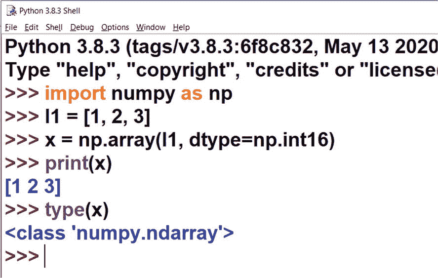
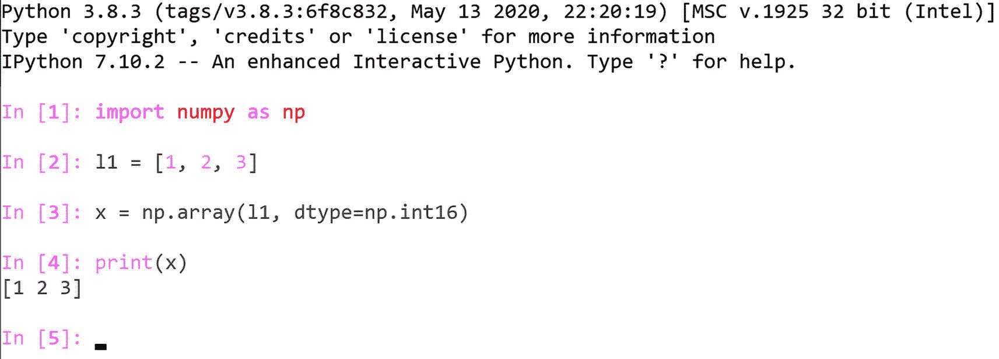

# 二、NumPy 入门

在前一章中，您学习了 Python 编程语言和科学 Python 生态系统的基础知识。您还学习了如何使用 Jupyter 在基于 web 的交互式笔记本中运行简单的 Python 程序。在本书剩余章节的大部分演示中，我们将继续使用 Jupyter Notebook。

在这一章中，我们将通过一些代码演示给出 NumPy 库的简要概述。以下是我们将在本章中探讨的主题列表:

*   NumPy Ndarrays 简介

*   n 数组属性

*   NumPy 常量

在本书的剩余章节中，我们将逐一探索科学 Python 生态系统的许多组件。在整本书中，我们将使用不同的库，它们是这个科学 Python 生态系统的一部分。你将在这一章中获得的有价值的知识是其余章节的基础。由于这是一个广泛的生态系统的介绍性章节，所以我把它写得简短而实用。

## NumPy 和 Ndarrays

NumPy 是 Python 中数值计算的基础包。我们可以用它来进行数值计算。NumPy 库最有用的特性是被称为 *Ndarray* 的多维容器数据结构。

Ndarray 是包含具有相同数据类型和大小的项目的多维数组(也称为*容器*)。我们可以在创建 Ndarray 时定义项目的大小和数据类型。就像列表等其他数据结构一样，我们可以通过索引来访问 Ndarray 的内容。Ndarray 中的索引从 0 开始(就像 C 中的数组或 Python 中的列表)。我们可以使用 Ndarrays 进行各种计算。科学 Python 生态系统中的所有其他库都识别并利用 NumPy Ndarrays 和相关例程来表示它们自己的数据结构和操作。

让我们从动手材料开始。为本章创建新笔记本。运行以下命令在您的计算机上安装 NumPy 库:

```py
!pip3 install numpy

```

让我们通过运行以下命令将其导入到当前笔记本中:

```py
import numpy as np

```

您可以创建一个列表，并使用它来创建一个简单的 Ndarray，如下所示:

```py
l1 = [1, 2, 3]
x = np.array(l1, dtype=np.int16)

```

在这里，您从一个列表中创建了一个 Ndarray。成员的数据类型是 16 位整数。在 [`https://numpy.org/devdocs/user/basics.types.html`](https://numpy.org/devdocs/user/basics.types.html) 可以找到支持的数据类型的详细列表。

您可以在一行中编写前面的代码，如下所示:

```py
x = np.array([1, 2, 3], dtype=np.int16)

```

让我们打印 n array 的值和它的类型(我们知道，它是一个 n array)。

```py
print(x)
print(type(x))

```

输出如下所示:

```py
[1 2 3]
<class 'numpy.ndarray'>

```

正如您在前面的输出中所看到的，它属于类`numpy.ndarray`。

你也可以使用 Python 的交互模式来运行所有的语句，如图 [2-1](#Fig1) 所示。



图 2-1

在 Python shell 中以交互模式运行示例代码

您也可以在 Python shell 中运行您将在本书中练习的大多数代码示例。类似地，您可以通过在命令提示符下键入命令`ipython`来启动 IPython shell，然后运行代码示例，如图 [2-2](#Fig2) 所示。



图 2-2

在 IPython shell 中以交互模式运行示例代码

虽然您可以使用 Python 交互式 shell 和 IPython 来运行代码示例，但是不可能使用这些工具将代码、输出和其他资源(如富文本标题)保存在一个文件中，因此在本书中我们将主要使用 Jupyter 笔记本文件(`*.ipynb`文件)。在一些情况下，我们也将使用 Python 脚本模式程序(`*.py`文件)。

## Ndarrays 中的索引

让我们简单看一下 Ndarrays 的索引。正如您之前简要了解到的，索引从 0 开始。让我们通过访问 Ndarray 的成员来演示一下，如下所示:

```py
print(x[0]); print(x[1]); print(x[2])

```

输出如下所示:

```py
1
2
3

```

您甚至可以使用负索引:-1 返回最后一个元素，-2 返回倒数第二个元素，依此类推。下面是一个例子:

```py
print(x[-1])

```

如果您提供了任何无效的索引，那么它将抛出一个错误。

```py
print(x[3])

```

在前面的语句中，您试图访问 Ndarray 中不存在的第四个元素。这将返回以下错误:

```py
IndexError                    Traceback (most recent call last)
<ipython-input-4-d3c02b9c2b5d> in <module>
----> 1 print(x[3])

IndexError: index 3 is out of bounds for axis 0 with size 3

```

### 在多个维度的数组中建立索引

一个数组可以有多个维度，如下所示:

```py
x1 = np.array([[1, 2, 3], [4, 5, 6]], np.int16)

```

前面是一个二维矩阵。它有两行三列。您可以按如下方式访问单个元素:

```py
print(x1[0, 0]); print(x1[0, 1]); print(x1[0, 2]);

```

您甚至可以访问整行，如下所示:

```py
print(x1[0, :])
print(x1[1, :])

```

输出如下所示:

```py
[1 2 3]
[4 5 6]

```

您可以按如下方式访问整个列:

```py
print(x[:, 0])

```

输出如下所示:

```py
[1 4]

```

你甚至可以有一个二维以上的数组。以下是一个 3D 数组:

```py
x2 = np.array([[[1, 2, 3], [4, 5, 6]],[[0, -1, -2], [-3, -4, -5]]], np.int16)

```

在科学和商业应用中，经常会有多维数据。Ndarrays 对于存储数字数据很有用。尝试运行以下项目并检索先前 3D 矩阵的元素:

```py
print(x2[0, 0, 0])
print(x2[1, 1, 2])
print(x2[:, 1, 1])

```

## n 数组属性

您可以通过参考 Ndarrays 的属性来了解更多关于它们的信息。让我们通过一个演示来看看所有的属性。具体来说，让我们使用我们之前使用的相同的 3D 矩阵。

```py
x2 = np.array([[[1, 2, 3], [4, 5, 6]],[[0, -1, -2], [-3, -4, -5]]], np.int16)

```

您可以使用以下语句找出维数:

```py
print(x2.ndim)

```

输出返回维数。

```py
3

```

您可以找出 n 数组的形状，如下所示:

```py
print(x2.shape)

```

形状是指以下尺寸的大小:

```py
(2, 2, 3)

```

您可以找出成员的数据类型，如下所示:

```py
print(x2.dtype)

```

输出如下所示:

```py
int16

```

您可以按如下方式找出存储器所需的大小(元素数量)和字节数:

```py
print(x2.size)
print(x2.nbytes)

```

输出如下所示:

```py
12
24

```

您可以使用以下代码计算转置:

```py
print(x2.T)

```

## NumPy 常量

NumPy 库有许多有用的数学和科学常数，可以在程序中使用。下面的代码片段打印了所有这些重要的常量。

以下代码片段引用了 infinity:

```py
print(np.inf)

```

以下代码片段引用的不是数字:

```py
print(np.NAN)

```

以下代码片段引用了负无穷大:

```py
print(np.NINF)

```

以下代码片段引用了负数和正数零:

```py
print(np.NZERO)
print(np.PZERO)

```

以下代码片段引用了欧拉数:

```py
print(np.e)

```

以下代码片段引用了 Euler 的 gamma 和 pi:

```py
print(np.euler_gamma)
print(np.pi)

```

输出如下所示:

```py
inf
nan
-inf
-0.0
0.0
2.718281828459045
0.5772156649015329
3.141592653589793

```

## 切片数组

让我们看看 Ndarrays 上切片操作的例子。您可以使用索引通过切片提取 Ndarray 的一部分，如下所示:

```py
a1 = np.array([1, 2, 3, 4, 5, 6, 7])
a1[1:5]

```

这段代码将显示从第二个位置到第六个位置的元素(您知道 0 是起始索引)，如下所示:

```py
array([2, 3, 4, 5])

```

您可以显示第四个位置的元素，如下所示:

```py
a1[3:]

```

输出如下所示:

```py
array([4, 5, 6, 7])

```

您还可以显示特定索引之前的所有元素(不包括该索引处的元素)，如下所示:

```py
a1[:3]

```

输出如下所示:

```py
array([1, 2, 3])

```

你看到了负指数的使用。我们可以使用它们进行切片，如下所示:

```py
a1[-4:-1]

```

输出如下所示:

```py
array([4, 5, 6])

```

您已经以步长 1 对数据进行了切片。这意味着您正在检索结果集中的连续元素。您也可以按如下方式更改步长:

```py
a1[1:6:2]

```

在本例中，步长为 2。因此，输出将列出每隔一个元素。输出如下所示:

```py
array([2, 4, 6])

```

## 摘要

在本章中，您开始学习 NumPy 和 Ndarrays 的基础知识。这是一个有很多例程的大库。有整本书是献给 NumPy 的。然而，我们的出版限制不允许对这个有用的库进行那种探索。我们将在接下来的章节中探索更多来自 NumPy 库的例程，当我们的可视化演示需要它们时。

在下一章中，你将学习一些 Ndarray 创建例程和 Matplotlib 数据可视化的基础知识。