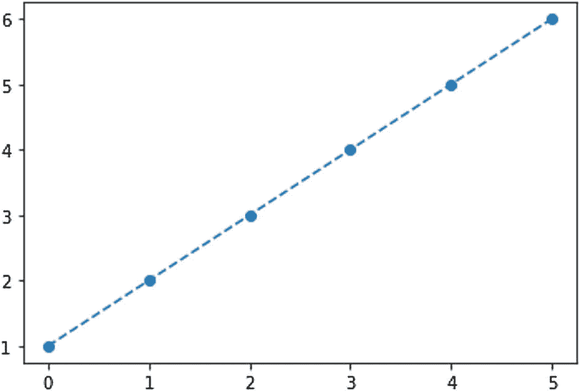
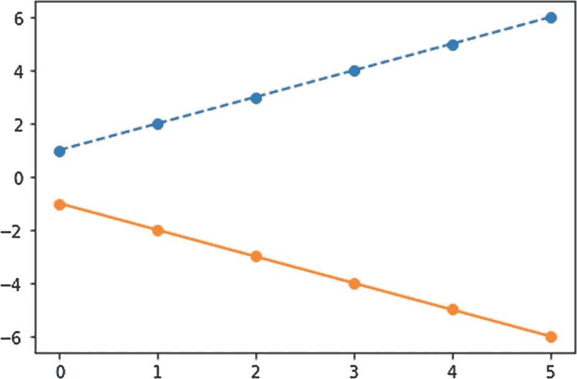
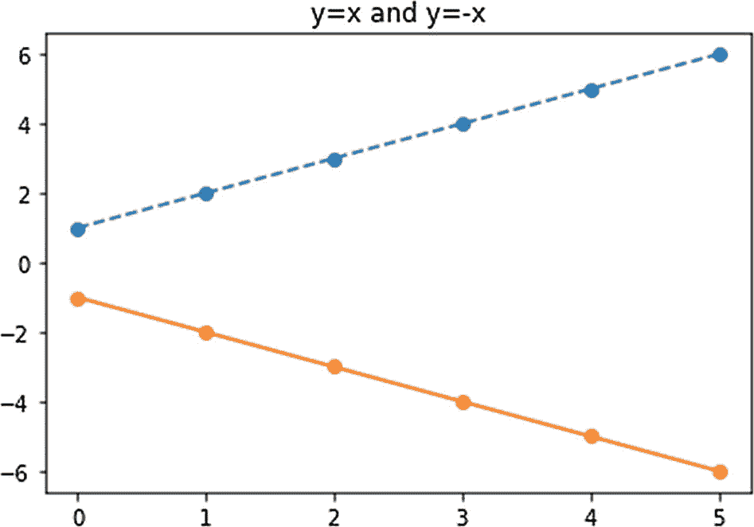
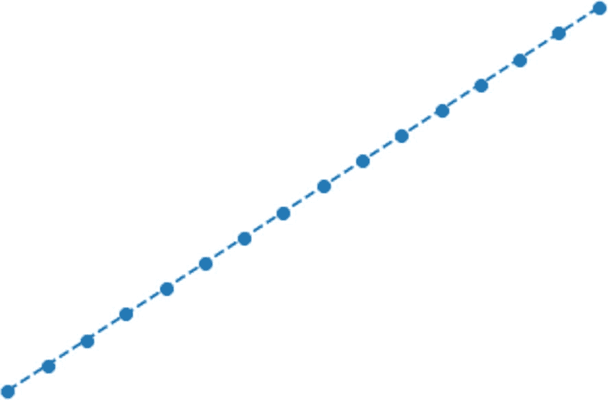
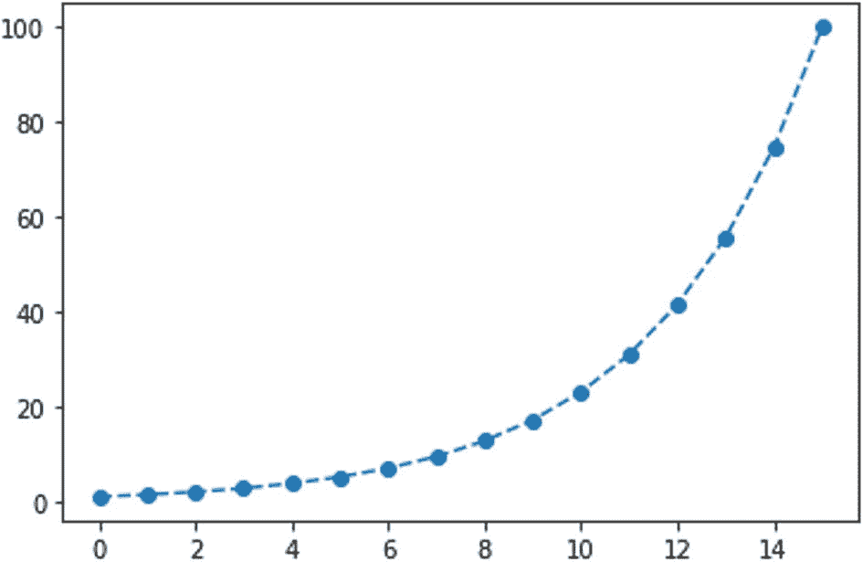
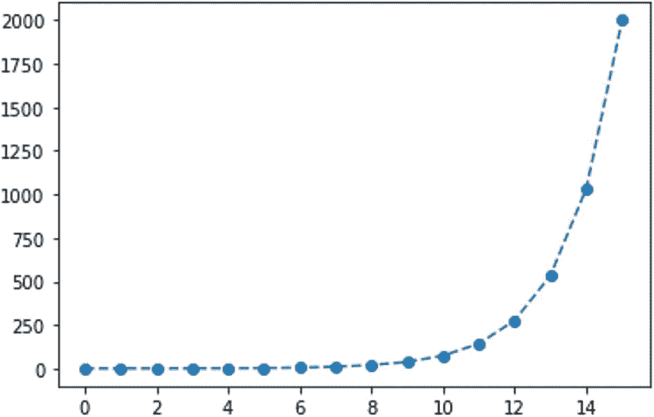
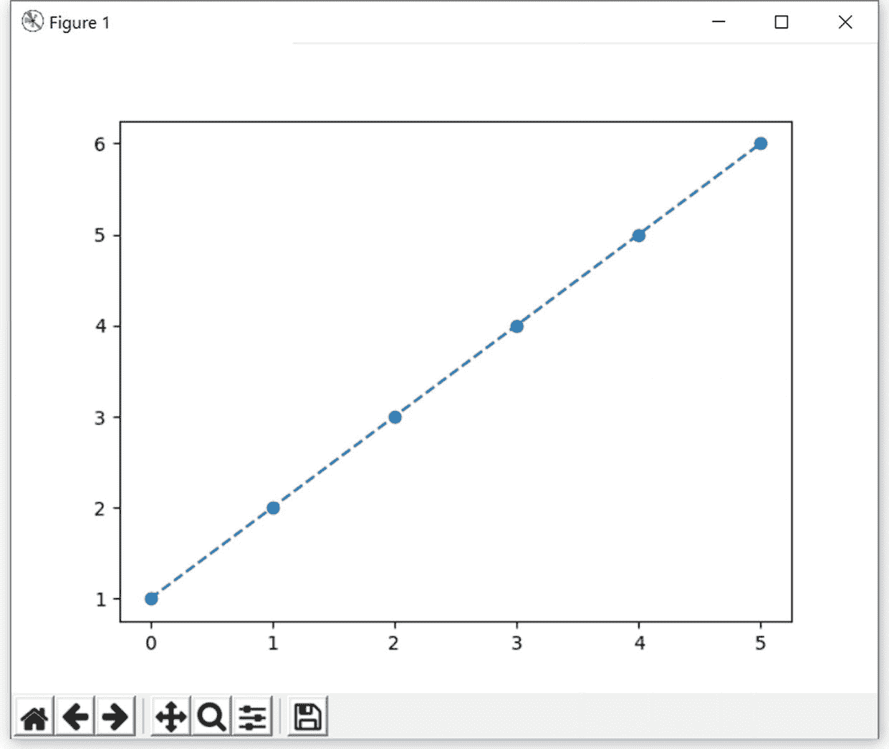

# 三、NumPy 例程和 Matplotlib 入门

在前一章中，您学习了 NumPy 的基础知识。具体来说，您学习了如何安装它以及如何创建 Ndarrays。你在前一章学到的所有主题将作为后面章节的基础，因为 Ndarray 是我们将在整本书中使用的基本数据结构。

在这一章中，我们将从上一章停止的地方继续，看看几个 Ndarray 创建例程。我们还将从科学计算生态系统中的主要数据可视化库 Matplotlib 开始。我们将使用 NumPy 的 Ndarray 创建例程来演示 Matplotlib 的可视化。这是一个详细的章节，非常强调编程和可视化。以下是您将在本章中了解的主题:

*   创建 n 数组的例程

*   Matplotlib

*   用 NumPy 和 Matplotlib 实现可视化

在本书的其余章节中，我们将经常使用 Matplotlib 和 NumPy 来演示数据可视化。

## 创建 n 数组的例程

让我们学习创建 1 和 0 的 n 数组。在这一节中，我们将探索许多数组创建例程。使用 Jupyter Notebook 创建一个新笔记本来保存本章的代码。返回给定形状和类型的新数组，不初始化条目。由于对应于成员的条目没有初始化，所以它们是任意的(随机的)。让我们来看一个小演示。在笔记本的单元格中键入以下代码并运行它:

```py
import numpy as np
x = np.empty([3, 3], np.uint8)
print(x)

```

输出如下所示:

```py
[[ 64 244  49]
 [  4   1   0]
 [  0   0 124]]

```

请注意，每个执行实例的值都不同，因为它不会在创建矩阵时初始化这些值。您可以创建任意大小的矩阵，如下所示:

```py
x = np.empty([3, 3, 3], np.uint8)
print(x)

```

函数`np.eye()`返回一个 2D 矩阵，对角线为 1，其他元素为 0。下面是一个例子:

```py
y = np.eye(5, dtype=np.uint8)
print(y)

```

输出如下所示:

```py
[[1 0 0 0 0]
 [0 1 0 0 0]
 [0 0 1 0 0]
 [0 0 0 1 0]
 [0 0 0 0 1]]

```

您可以更改对角线索引的位置。默认值为 0，表示主对角线。正值表示上对角线。负值表示对角线较低。以下是一些例子。让我们先演示一下上面的对角线:

```py
y = np.eye(5, dtype=np.uint8, k=1)
print(y)

```

输出如下所示:

```py
[[0 1 0 0 0]
 [0 0 1 0 0]
 [0 0 0 1 0]
 [0 0 0 0 1]
 [0 0 0 0 0]]

```

下面是演示下对角线的代码:

```py
y = np.eye(5, dtype=np.uint8, k=-1)
print(y)

```

输出如下所示:

```py
[[0 0 0 0 0]
 [1 0 0 0 0]
 [0 1 0 0 0]
 [0 0 1 0 0]
 [0 0 0 1 0]]

```

一个*单位矩阵*是对角线上所有元素都是 1，其余元素都是 0 的矩阵。函数`np.identity()`返回指定大小的单位矩阵，如下所示:

```py
x = np.identity(5, dtype= np.uint8)
print(x)

```

前面的代码与下面的代码产生相同的输出:

```py
y = np.eye(5, dtype=np.uint8)
print(y)

```

这两种方法的输出如下:

```py
[[1 0 0 0 0]
 [0 1 0 0 0]
 [0 0 1 0 0]
 [0 0 0 1 0]
 [0 0 0 0 1]]

```

函数`np.ones()`返回给定大小的矩阵，该矩阵的所有元素都为 1。

```py
x = np.ones((2, 5, 5), dtype=np.int16)
print(x)

```

运行代码，您将看到以下输出:

```py
[[[1 1 1 1 1]
  [1 1 1 1 1]
  [1 1 1 1 1]
  [1 1 1 1 1]
  [1 1 1 1 1]]

 [[1 1 1 1 1]
  [1 1 1 1 1]
  [1 1 1 1 1]
  [1 1 1 1 1]
  [1 1 1 1 1]]]

```

函数`np.zeroes()`返回一个给定大小的矩阵，所有元素都为 0。

```py
x = np.zeros((2, 5, 5, 2), dtype=np.int16)
print(x)

```

运行代码并检查输出。

函数`np.full()`返回一个给定形状和类型的新数组，用传递的参数填充。这里有一个例子:

```py
x = np.full((3, 3, 3), dtype=np.int16, fill_value = 5)
print(x)

```

输出如下所示:

```py
[[[5 5 5]
  [5 5 5]
  [5 5 5]]

 [[5 5 5]
  [5 5 5]
  [5 5 5]]

 [[5 5 5]
  [5 5 5]
  [5 5 5]]]

```

一个*下三角矩阵*就是对角线和对角线以下的所有元素都是 1，其余元素都是 0。函数`np.tri()`返回给定大小的下三角矩阵，如下所示:

```py
x = np.tri(3, 3, k=0, dtype=np.uint16)
print(x)

```

输出如下所示:

```py
[[1 0 0]
 [1 1 0]
 [1 1 1]]

```

你甚至可以改变次对角线的位置。次对角线以下的所有元素都将为 0。

```py
x = np.tri(5, 5, k=1, dtype=np.uint16)
print(x)

```

输出如下所示:

```py
[[1 1 0 0 0]
 [1 1 1 0 0]
 [1 1 1 1 0]
 [1 1 1 1 1]
 [1 1 1 1 1]]

```

次对角线为负值的另一个示例如下:

```py
x = np.tri(5, 5, k=-1, dtype=np.uint16)
print(x)

```

输出如下所示:

```py
[[0 0 0 0 0]
 [1 0 0 0 0]
 [1 1 0 0 0]
 [1 1 1 0 0]
 [1 1 1 1 0]]

```

类似地，您可以使用函数`np.tril()`来获得下三角矩阵。它接受另一个矩阵作为参数。这里有一个演示:

```py
x = np.ones((5, 5), dtype=np.uint8)
y = np.tril(x, k=-1)
print(y)

```

输出如下所示:

```py
[[0 0 0 0 0]
 [1 0 0 0 0]
 [1 1 0 0 0]
 [1 1 1 0 0]
 [1 1 1 1 0]]

```

上三角矩阵的对角线和上面所有的元素都是 1，其余的元素都是 0。

```py
x = np.ones((5, 5), dtype=np.uint8)
y = np.triu(x, k=0)
print(y)

```

输出如下所示:

```py
[[1 1 1 1 1]
 [0 1 1 1 1]
 [0 0 1 1 1]
 [0 0 0 1 1]
 [0 0 0 0 1]]

```

你可以有一个负的次对角线，如下所示:

```py
x = np.ones((5, 5), dtype=np.uint8)
y = np.triu(x, k=-1)
print(y)

```

输出如下所示:

```py
[[1 1 1 1 1]
 [1 1 1 1 1]
 [0 1 1 1 1]
 [0 0 1 1 1]
 [0 0 0 1 1]]

```

你可以有一个负的次对角线，如下所示:

```py
x = np.ones((5, 5), dtype=np.uint8)
y = np.triu(x, k=1)
print(y)

```

输出如下所示:

```py
[[0 1 1 1 1]
 [0 0 1 1 1]
 [0 0 0 1 1]
 [0 0 0 0 1]
 [0 0 0 0 0]]

```

## Matplotlib

Matplotlib 是科学 Python 生态系统不可或缺的一部分，它用于可视化。它是 NumPy 的扩展。它为绘图和可视化提供了一个类似 Matlab 的界面。它最初是由 John D. Hunter 开发的，作为可用于 Python 的开源替代方案。

您可以使用 Jupyter 笔记本进行安装，如下所示:

```py
!pip3 install matplotlib

```

注意`pip3`命令前的`!`符号。这是因为当你想在笔记本上运行一个操作系统命令时，你必须给它加上前缀`!`。

在安装 Matplotlib 库之前，您可能希望使用以下命令升级 pip:

```py
!python -m pip install --upgrade pip

```

要在笔记本中使用 Matplotlib 库进行基本绘图，必须导入其`pyplot`模块，如下所示:

```py
import matplotlib.pyplot as plt

```

`pyplot`模块提供了一个类似 Matlab 的界面来创建可视化。此外，要在笔记本中显示 Matplotlib 可视化效果，必须运行以下神奇命令:

```py
%matplotlib inline

```

这迫使 Matlab 在产生可视化的代码单元格的正下方内联显示输出。当我们需要使用 Matplotlib 时，我们会一直使用它。

让我们也导入 NumPy，如下所示:

```py
import numpy as np

```

你可以在 [`https://matplotlib.org/`](https://matplotlib.org/) 阅读更多关于 Matplotlib 的内容。

## 用 NumPy 和 Matplotlib 实现可视化

您现在将学习如何使用 Ndarray 创建例程创建 NumPy Ndarrays，然后使用 Matplotlib 来可视化它们。让我们从创建 Ndarrays 的例程开始。

第一个套路是`arange()`。它以给定的间隔创建均匀分布的值。停止值参数是必需的。起始值和间隔参数分别具有默认参数 0 和 1。这里有一个例子:

```py
x = np.arange(6)

```

在前面的示例中，停止值为 5。因此，它创建了一个从 0 开始到 4 结束的 Ndarray。该函数返回具有半开间隔的序列，这意味着停止值不包括在输出中。因为我们没有指定时间间隔，所以假设它为 1。您可以看到其输出和数据类型，如下所示:

```py
print(x)
type(x)

```

输出如下所示:

```py
[0 1 2 3 4 5]
numpy.ndarray

```

让我们继续绘制这些数字。为了在 2D 绘图，我们需要 x-y 对。让我们保持简单，通过运行下面的语句来说 y = f(x) = x:

```py
y=x+1

```

现在，让我们使用函数`plot()`来形象化这一点。它需要`x`和`y`的值以及绘图选项。您将在本章的后面了解更多关于绘图选项的内容。

```py
plt.plot(x, y, 'o--')
plt.show()

```

功能`show()`显示绘图。如你所见，我们用绘图选项`o--`进行可视化。这意味着点用实心圆表示，线用虚线表示，如图 [3-1](#Fig1) 所示。



图 3-1

形象化 y=f(x)=x+1

下面是一个带有开始和停止参数的函数`arange()`的函数调用示例:

```py
np.arange(2, 6)

```

它返回以下输出(它直接打印，我们没有将它存储在变量中):

```py
array([2, 3, 4, 5])

```

我们甚至可以为间隔添加一个参数，如下所示:

```py
np.arange(2, 6, 2)

```

输出如下所示:

```py
array([2, 4])

```

我们可以绘制如下多个图形:

```py
plt.plot(x, y, 'o--')
plt.plot(x, -y, 'o-')
plt.show()

```

输出将有一条线和另一条虚线，如图 [3-2](#Fig2) 所示。



图 3-2

可视化多条线

您甚至可以为图表添加标题，如下所示:

```py
plt.plot(x, y, 'o--')
plt.plot(x, -y, 'o-')
plt.title('y=x and y=-x')
plt.show()

```

输出的标题如图 [3-3](#Fig3) 所示。



图 3-3

可视化多行和标题

函数`linspace(start, stop, number)`返回指定间隔内均匀分布的数字数组。您必须向其传递起始值、结束值以及值的数量，如下所示:

```py
N = 16
x = np.linspace(0, 15, N)
print(x)

```

前面的代码创建了 11 个数字(0 到 10，包括 0 和 10)，如下所示:

```py
[ 0\.  1\.  2\.  3\.  4\.  5\.  6\.  7\.  8\.  9\. 10\. 11\. 12\. 13\. 14\. 15.]

```

让我们想象一下:

```py
y = x
plt.plot(x, y, 'o--')
plt.axis('off')
plt.show()

```

图 [3-4](#Fig4) 显示了输出。



图 3-4

使用 linspace()时 y = x 的输出

如你所见，我们正在用线`plt.axis('off')`关闭轴。

同样，您可以按如下方式计算并可视化日志空间中的值:

```py
y = np.logspace(0.1, 2, N)
print(y)
plt.plot(x, y, 'o--')
plt.show()

```

打印功能的输出如下:

```py
[  1.25892541   1.68525904   2.25597007   3.01995172   4.04265487
   5.41169527   7.2443596    9.69765359  12.98175275  17.37800829
  23.26305067  31.14105584  41.68693835  55.80417175  74.70218989
 100\.        ]

```

图 [3-5](#Fig5) 显示了输出。



图 3-5

日志空间的输出()

你甚至可以计算一个几何级数，如下所示:

```py
y = np.geomspace(0.1, 2000, N)
print(y)
plt.plot(x, y, 'o--')
plt.show()

```

`print`语句的输出如下:

```py
[1.00000000e-01 1.93524223e-01 3.74516250e-01 7.24779664e-01
 1.40262421e+00 2.71441762e+00 5.25305561e+00 1.01659351e+01
 1.96735469e+01 3.80730788e+01 7.36806300e+01 1.42589867e+02
 2.75945932e+02 5.34022222e+02 1.03346236e+03 2.00000000e+03]

```

图 [3-6](#Fig6) 显示了输出。



图 3-6

geomspace()的输出

## 将 Matplotlib 程序作为脚本运行

可以使用 Python 的脚本模式运行 Matplotlib 程序。将清单 [3-1](#PC55) 中显示的程序另存为`prog01.py`。

```py
import numpy as np
import matplotlib.pyplot as plt

x = np.arange(6)
print(x)
type(x)

y=x+1

plt.plot(x, y, 'o--')
plt.show()

Listing 3-1prog01.py

```

当你运行这个程序时，输出显示在一个单独的窗口中，如图 [3-7](#Fig7) 所示。



图 3-7

在单独的窗口中输出

我们将主要使用 Jupyter Notebook 在浏览器窗口中显示可视化效果。

## 摘要

本章重点介绍了创建 Ndarrays 的例程。您还学习了 Matplotlib 的基础知识。除了基础知识之外，您还学习了如何用简单的图形可视化 Ndarrays。NumPy 和 Matplotlib 的内容比您在本章中学到的更多。还有许多数字和数据可视化例程。

在下一章中，您将探索更多这样的处理 NumPy Ndarrays 的 NumPy 例程。