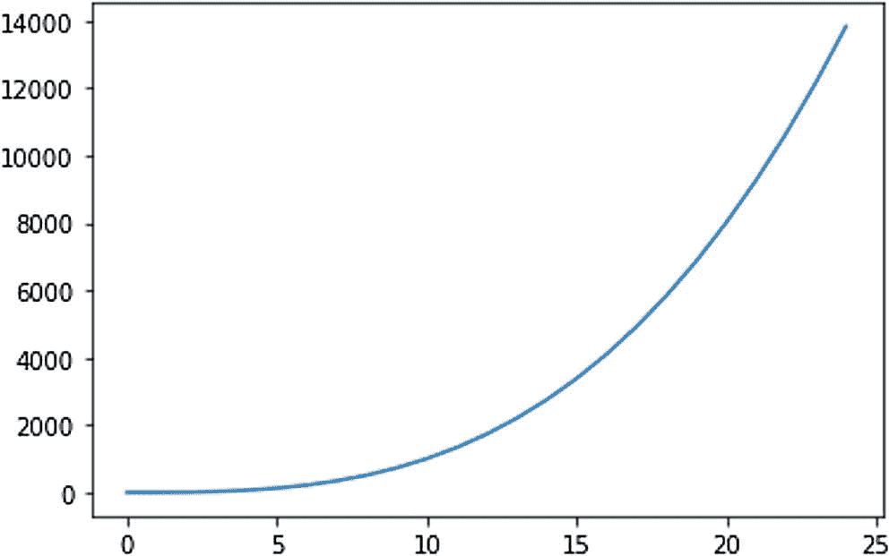

# 四、重温 Matplotlib 可视化

在前一章中，您学习了在 NumPy 库中创建和操作 Ndarrays 的许多例程。在这本书里，你会需要很多这样的程序。

本章致力于探索用 Matplotlib 准备的可视化的美学方面。您将学习如何定制 Matplotlib 可视化的外观。具体来说，我们将详细探讨以下主题:

*   单线图

*   多线图

*   网格、轴和标签

*   颜色、线条和标记

*   支线剧情

*   面向对象的风格

*   使用文本

在阅读完这一章之后，你将能够以编程的方式定制你的可视化的美学方面，使它们更美观。

## 单线图

当一个图形中只有一个使用函数`plot()`的可视化时，它被称为*单线图*。在本节中，您将看到绘制单线图的几种方法。我们已经使用了函数`plot()`来绘制单线图。让我们用几个更具体的例子来更详细地探讨这个概念。

为本章中的演示创建一个新笔记本。您还可以使用 Python 列表来可视化绘图，如下所示:

```py
%matplotlib inline
import matplotlib.pyplot as plt
x = [4, 5, 3, 1, 6, 7]
plt.plot(x)
plt.show()

```

图 4-1 显示了输出。


图 4-1

演示一个简单的单线图

在这种情况下，y 轴的值是假定的。

下面是另一个使用 n 数组的单线图示例:

```py
import numpy as np
x = np.arange(25)
plt.plot(x)
plt.show()

```

图 4-2 显示了输出。


图 4-2

带有 arange()的简单单线图

我们来形象化的描述一下二次图 y = f(x) = x <sup>3</sup> +1。代码如下:

```py
plt.plot(x, [(y**3 + 1) for y in x])
plt.show()

```

图 4-3 显示了输出。



图 4-3

y = f(x) = x <sup>3</sup> +1

您可以用简单的方式编写相同的代码，如下所示:

```py
plt.plot(x, x**3 + 1)
plt.show()

```

## 多线图

可以在同一输出中显示多个图。让我们看看如何在同一个可视化中显示多条曲线。下面是一个简单的例子:

```py
%matplotlib inline
import numpy as np
import matplotlib.pyplot as plt
x = np.arange(7)
plt.plot(x, -x**2)
plt.plot(x, -x**3)
plt.plot(x, -2*x)
plt.plot(x, -2**x)
plt.show()

```

图 4-4 显示了输出。


图 4-4

多线图

如您所见，Matplotlib 自动为曲线单独分配颜色。

您可以用简单的方式编写相同的代码，如下所示:

```py
plt.plot(x, -x**2, x, -x**3,
         x, -2*x, x, -2**x)
plt.show()

```

输出将与图 4-4 相同。

让我们看另一个例子:

```py
x = np.array([[3, 2, 5, 6], [7, 4, 1, 5]])
plt.plot(x)
plt.show()

```

图 4-5 显示了输出。


图 4-5

多线图，另一个例子

您也可以使用随机数据创建多行图形，如下所示:

```py
data = np.random.randn(2, 10)
print(data)
plt.plot([data[0], data[1]])
plt.show()

```

图 4-6 显示了输出。


图 4-6

多线图，随机数据

在本例中，我们使用例程`np.random.randn()`以随机方式生成数据。因为这个例程会生成随机数据，所以每次执行时输出都会不同。因此，每次执行代码时，您看到的输出都是不同的。

## 网格、轴和标签

现在，您将学习如何在可视化中启用网格。这可以通过语句`plt.grid(True)`来完成。您还将学习如何操作轴的限制。但在此之前，您将很快学会如何在硬盘上将可视化保存为图像。请看下面的代码:

```py
x = np.arange(3)
plt.plot(x, -x**2, x, -x**3, x, -2*x, x, -2**x)
plt.grid(True)
plt.savefig('test.png')
plt.show()

```

语句`plt.savefig('test.png')`将图像保存在 Jupyter 笔记本文件的当前目录中。图 4-7 显示输出。


图 4-7

多线图

您可以看到轴的限制默认设置如下:

```py
x = np.arange(3)
plt.plot(x, -x**2, x, -x**3, x, -2*x, x, -2**x)
plt.grid(True)
print(plt.axis())
plt.show()

```

图 4-8 显示了输出。


图 4-8

查看轴的值

您也可以自定义轴的值，如下所示:

```py
x = np.arange(3)
plt.plot(x, -x**2, x, -x**3, x, -2*x, x, -2**x)
plt.grid(True)
plt.axis([0, 2, -8, 0])
print(plt.axis())
plt.show()

```

语句`plt.axis([0, 2, -8, 0])`设置轴的值。第一对(0，2)指 x 轴的极限，第二对(-8，0)指 y 轴的极限。您可以使用函数`xlim()`和`ylim()`用不同的语法编写前面的代码，如下所示:

```py
x = np.arange(3)
plt.plot(x, -x**2, x, -x**3, x, -2*x, x, -2**x)
plt.grid(True)
plt.xlim([0, 2])
plt.ylim([-8, 0])
print(plt.axis())
plt.show()

```

两个示例产生相同的输出，如图 4-9 所示。


图 4-9

自定义轴

您可以为轴添加标题和标签，如下所示:

```py
x = np.arange(3)
plt.plot(x, -x**2, x, -x**3, x, -2*x, x, -2**x)
plt.grid(True)
plt.xlabel('x = np.arange(3)')
plt.xlim([0, 2])
plt.ylabel('y = f(x)')
plt.ylim([-8, 0])
plt.title('Simple Plot Demo')
plt.show()

```

这将产生标签和标题如图 4-10 所示的输出。


图 4-10

可视化的标题和轴的标签

您可以在`plot()`函数中为参数`label`传递一个参数，然后调用函数`legend()`来创建一个图例，如下所示:

```py
x = np.arange(3)
plt.plot(x, -x**2, label='-x**2')
plt.plot(x, -x**3, label='-x**3')
plt.plot(x, -2*x, label='-2*x')
plt.plot(x, -2**x, label='-2**x')
plt.legend()
plt.grid(True)
plt.xlabel('x = np.arange(3)')
plt.xlim([0, 2])
plt.ylabel('y = f(x)')
plt.ylim([-8, 0])
plt.title('Simple Plot Demo')
plt.show()

```

该代码产生带有曲线图例的输出，如图 4-11 所示。


图 4-11

带图例的输出

除了将图例字符串作为参数传递给函数`plot()`，还可以将字符串列表作为参数传递给函数`legend()`，如下所示:

```py
x = np.arange(3)
plt.plot(x, -x**2, x, -x**3, x, -2*x, x, -2**x)
plt.legend(['-x**2', '-x**3', '-2*x', '-2**x'])
plt.grid(True)
plt.xlabel('x = np.arange(3)')
plt.xlim([0, 2])
plt.ylabel('y = f(x)')
plt.ylim([-8, 0])
plt.title('Simple Plot Demo')
plt.show()

```

这产生了与图 4-11 相同的输出。

您也可以通过对前面代码中的`plt.legend()`进行以下更改来更改图例框的位置:

```py
x = np.arange(3)
plt.plot(x, -x**2, x, -x**3, x, -2*x, x, -2**x)
plt.legend(['-x**2', '-x**3', '-2*x', '-2**x'],
           loc='lower center')
plt.grid(True)
plt.xlabel('x = np.arange(3)')
plt.xlim([0, 2])
plt.ylabel('y = f(x)')
plt.ylim([-8, 0])
plt.title('Simple Plot Demo')
plt.show()

```

图 4-12 显示了输出。


图 4-12

图例位于中上位置的输出

最后，让我们用下面的代码将可视化保存到磁盘:

```py
x = np.arange(3)
plt.plot(x, -x**2, x, -x**3, x, -2*x, x, -2**x)
plt.legend(['-x**2', '-x**3', '-2*x', '-2**x'],
           loc='lower center')
plt.grid(True)
plt.xlabel('x = np.arange(3)')
plt.xlim([0, 2])
plt.ylabel('y = f(x)')
plt.ylim([-8, 0])
plt.title('Simple Plot Demo')
plt.savefig('test.png')
plt.show()

```

## 颜色、样式和标记

到目前为止，在多行绘图的情况下，您已经看到 Matplotlib 自动分配颜色、样式和标记。您已经看到了一些如何定制它们的例子。现在，在本节中，您将学习如何详细定制它们。

先说颜色。以下代码列出了 Matplotlib 支持的所有原色(在此示例中，我们不自定义样式和标记):

```py
%matplotlib inline
import matplotlib.pyplot as plt
import numpy as np

x = np.arange(5)
y = x
plt.plot(x, y+0.4, 'g')
plt.plot(x, y+0.2, 'y')
plt.plot(x, y, 'r')
plt.plot(x, y-0.2, 'c')
plt.plot(x, y-0.4, 'k')
plt.plot(x, y-0.6, 'm')
plt.plot(x, y-0.8, 'w')
plt.plot(x, y-1, 'b')
plt.show()

```

图 4-13 显示了输出。


图 4-13

颜色演示

您也可以编写前面的代码，如下所示:

```py
plt.plot(x, y+0.4, 'g', x, y+0.2, 'y', x, y, 'r', x, y-0.2, 'c', x, y-0.4, 'k', x, y-0.6, 'm', x, y-0.8, 'w', x, y-1, 'b')
plt.show()

```

输出将与图 4-13 相同。

您可以自定义线条样式，如下所示:

```py
plt.plot(x, y, '-', x, y+1, '--', x, y+2, '-.', x, y+3, ':')
plt.show()

```

图 4-14 显示了输出。


图 4-14

线条样式

您甚至可以按如下方式更改标记:

```py
plt.plot(x, y, '.')
plt.plot(x, y+0.5, ',')
plt.plot(x, y+1, 'o')
plt.plot(x, y+2, '<')
plt.plot(x, y+3, '>')
plt.plot(x, y+4, 'v')
plt.plot(x, y+5, '^')
plt.plot(x, y+6, '1')
plt.plot(x, y+7, '2')
plt.plot(x, y+8, '3')
plt.plot(x, y+9, '4')
plt.plot(x, y+10, 's')
plt.plot(x, y+11, 'p')
plt.plot(x, y+12, '*')
plt.plot(x, y+13, 'h')
plt.plot(x, y+14, 'H')
plt.plot(x, y+15, '+')
plt.plot(x, y+16, 'D')
plt.plot(x, y+17, 'd')
plt.plot(x, y+18, '|')
plt.plot(x, y+19, '_')
plt.show()

```

图 4-15 显示了输出。


图 4-15

标记

您可以结合所有三种技术(针对颜色、标记和线条样式)来自定义可视化，如下所示:

```py
plt.plot(x, y, 'mo--')
plt.plot(x, y+1 , 'g*-.')
plt.show()

```

图 4-16 显示了输出。


图 4-16

定制一切

这些是您可以在 Matplotlib 中进行的基本自定义。您可以非常详细地定制一切。下面是一个代码示例:

```py
plt.plot(x, y, color='g', linestyle='--', linewidth=1.5,
        marker='^', markerfacecolor='b', markeredgecolor='k',
        markeredgewidth=1.5, markersize=5)
plt.grid(True)
plt.show()

```

图 4-17 显示了输出。


图 4-17

更加详细地定制一切

您甚至可以自定义 x 轴和 y 轴上的值，如下所示:

```py
x = y = np.arange(10)
plt.plot(x, y, 'o--')
plt.xticks(range(len(x)), ['a', 'b', 'c', 'd', 'e', 'f', 'g', 'h', 'i', 'j'])
plt.yticks(range(0, 10, 1))
plt.show()

```

图 4-18 显示了输出。


图 4-18

自定义轴上的记号

## 面向对象绘图

您可以以面向对象的方式创建地块。让我们重写一个早期的代码示例，如下所示:

```py
fig, ax = plt.subplots()
ax.plot(x, -x**2, label='-x**2')
ax.plot(x, -x**3, label='-x**3')
ax.plot(x, -2*x, label='-2*x')
ax.plot(x, -2**x, label='-2**x')
ax.set_xlabel('x = np.arange(3)')
ax.set_ylabel('y = f(x)')
ax.set_title('Simple Plot Demo')
ax.legend()
ax.grid(True)
plt.show()

```

注意，我们使用 axis 对象来绘制和设置标签和标题。图 4-19 显示了输出。


图 4-19

面向对象绘图的输出

您也可以使用功能`ax.text()`或功能`plt.text()`添加文本。这些函数接受要显示的坐标和文本。下面是一个例子:

```py
fig, ax = plt.subplots()
ax.plot(x, -x**2, label='-x**2')
ax.plot(x, -x**3, label='-x**3')
ax.plot(x, -2*x, label='-2*x')
ax.plot(x, -2**x, label='-2**x')
ax.set_xlabel('x = np.arange(3)')
ax.set_ylabel('y = f(x)')
ax.set_title('Simple Plot Demo')
ax.legend()
ax.grid(True)
ax.text(0.25, -5, "Simple Plot Demo")
plt.show()

```

图 4-20 显示了输出。


图 4-20

呈现文本

## 支线剧情

您可以在同一个输出中显示多个单独的图形。这种技术被称为*副音色*。支线剧情可以有自己的标题、标签和其他说明。支线剧情是在网格中创建的。第一个支线剧情位置在左上方。其他子绘图位置相对于第一个位置。下面是一个例子:

```py
x = np.arange(3)
plt.subplots_adjust(wspace=0.3,
                    hspace=0.3)
plt.subplot(2, 2, 1)
plt.plot(x, -x**2)
plt.subplot(2, 2, 2)
plt.plot(x, -x**3)
plt.subplot(2, 2, 3)
plt.plot(x, -2*x)
plt.subplot(2, 2, 4)
plt.plot(x, -2**x)
plt.show()

```

传递给`plt.subplot()`的前两个参数表示网格大小，第三个参数表示特定子绘图的位置。图 4-21 显示输出。


图 4-21

支线剧情

您可以用面向对象的方式编写相同的代码，如下所示:

```py
fig, axs = plt.subplots(2, 2)
plt.subplots_adjust(wspace=0.3,
                    hspace=0.3)
axs[0, 0].plot(x, -x**2)
axs[0, 1].plot(x, -x**3)
axs[1, 0].plot(x, -2*x)
axs[1, 1].plot(x, -2**x)
plt.show()

```

代码产生与图 4-21 所示相同的输出。

## 摘要

本章着重于可视化和各种定制。您学到了很多关于数据可视化和根据需求定制可视化的知识。您还了解了面向对象的绘图风格和支线剧情。你在本章中学到的概念将在本书中用来可视化数据。

在下一章，我们将探索更多的样式表、图例和布局计算。