# 五、样式和布局

在前一章中，您学习了许多与使用 Matplotlib 创建可视化相关的高级概念。

在这一章中，我们将继续探索更多与可视化相关的概念。具体来说，我们将详细探讨以下主题:

*   风格

*   布局

阅读完本章后，你将能够使用颜色、样式表和自定义布局。

## 风格

在本节中，您将探索 Matplotlib 中可用的各种样式。到目前为止，我们一直使用默认样式。样式规定了标记大小、颜色和字体等内容。Matplotlib 内置了很多样式。下面是一个应用内置样式的简短示例:

```py
%matplotlib inline
import matplotlib.pyplot as plt
import numpy as np
plt.style.use('ggplot')
data = np.random.randn(10)

```

现在让我们想象一下:

```py
plt.plot(data)
plt.show()

```

这里我们使用 ggplot2 的风格，它是 R 编程语言的可视化包。图 5-1 显示了输出。

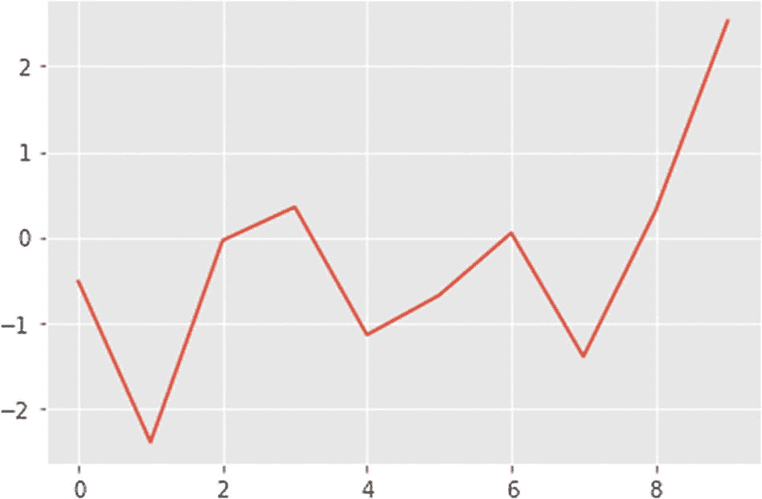

图 5-1

ggplot style(打印样式)

你一定很想知道所有可用款式的名称。您可以使用以下命令打印姓名:

```py
print(plt.style.available)

```

以下是显示所有可用样式名称的输出:

```py
['Solarize_Light2', '_classic_test_patch', 'bmh', 'classic', 'dark_background', 'fast', 'fivethirtyeight', 'ggplot', 'grayscale', 'seaborn', 'seaborn-bright', 'seaborn-colorblind', 'seaborn-dark', 'seaborn-dark-palette', 'seaborn-darkgrid', 'seaborn-deep', 'seaborn-muted', 'seaborn-notebook', 'seaborn-paper', 'seaborn-pastel', 'seaborn-poster', 'seaborn-talk', 'seaborn-ticks', 'seaborn-white', 'seaborn-whitegrid', 'tableau-colorblind10']

```

让我们应用经典的`matplotlib`风格如下:

```py
plt.style.use('classic')
plt.plot(data)
plt.show()

```

图 5-2 显示了输出。

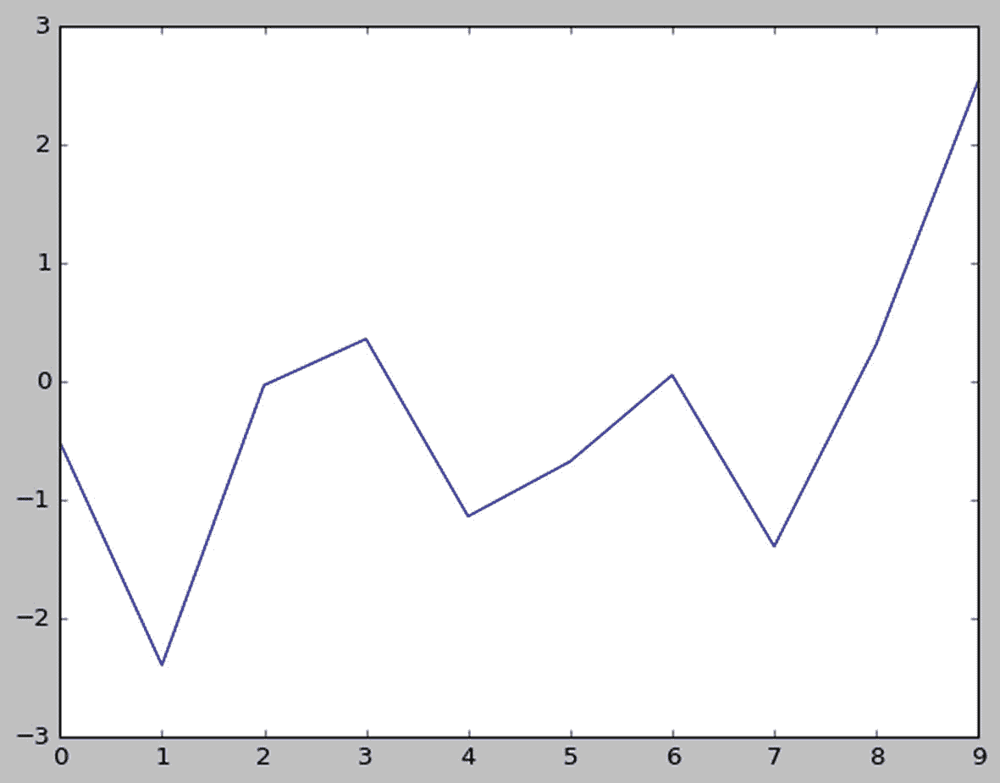

图 5-2

古典派风格

请注意，一旦应用了样式，该样式将应用于整个笔记本。因此，如果您想切换回默认样式，可以使用下面的代码:

```py
plt.style.use('default')

```

让我们用下面的数据来展示一下:

```py
plt.plot(data)
plt.show()

```

图 5-3 显示了输出。

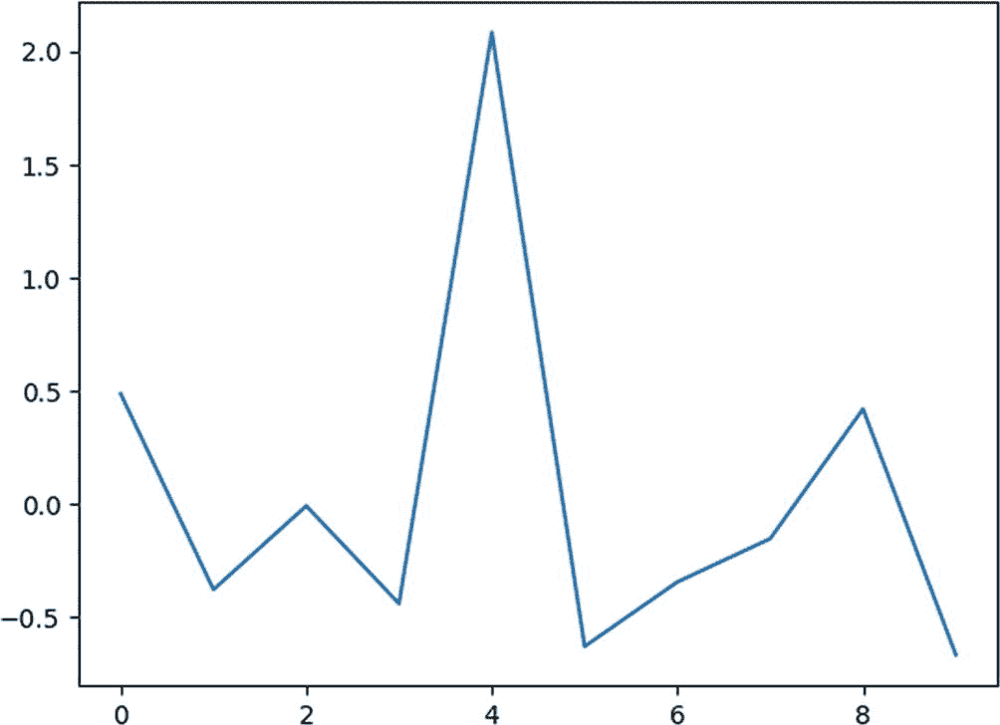

图 5-3

默认样式

现在让我们演示一下当我们改变样式时颜色是如何受到影响的。让我们定义如下所示的数据:

```py
n = 3
data = np.linspace(0, 2*n*np.pi, 300)

```

此外，让我们定义一个自定义函数，如下所示:

```py
def sinusoidal(sty):
    plt.style.use(sty)
    fig, ax = plt.subplots()

    ax.plot(data, np.sin(data), label='Sine')
    ax.plot(data, np.cos(data), label='Cosine')
    ax.legend()

```

函数是可以被调用来执行某种操作的例程。到目前为止，我们一直在使用 Python 本身自带的库函数以及像 NumPy 和 Matplotlib 这样的库。这里，在代码片段中，我们定义了自己的自定义函数。这个自定义函数接受一个参数。我们使用传递的参数作为可视化的样式。让我们用默认样式调用这个函数，如下所示:

```py
sinusoidal('default')
plt.show()

```

图 5-4 显示了输出。

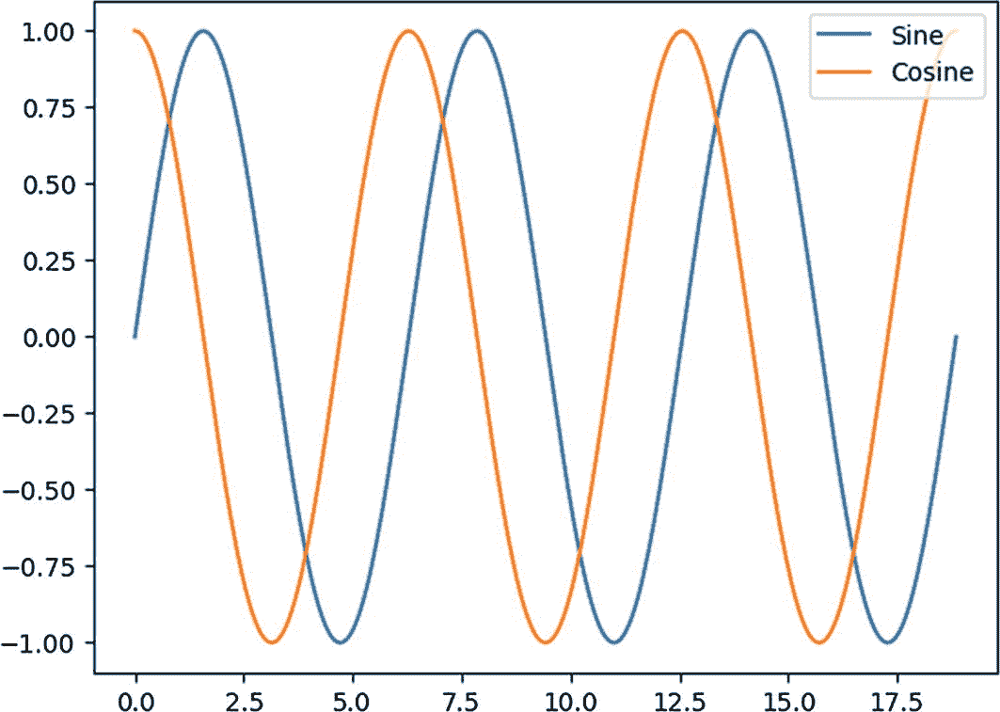

图 5-4

默认样式正弦图

让我们如下使用`ggplot`样式:

```py
sinusoidal('ggplot')
plt.show()

```

图 5-5 显示了输出。

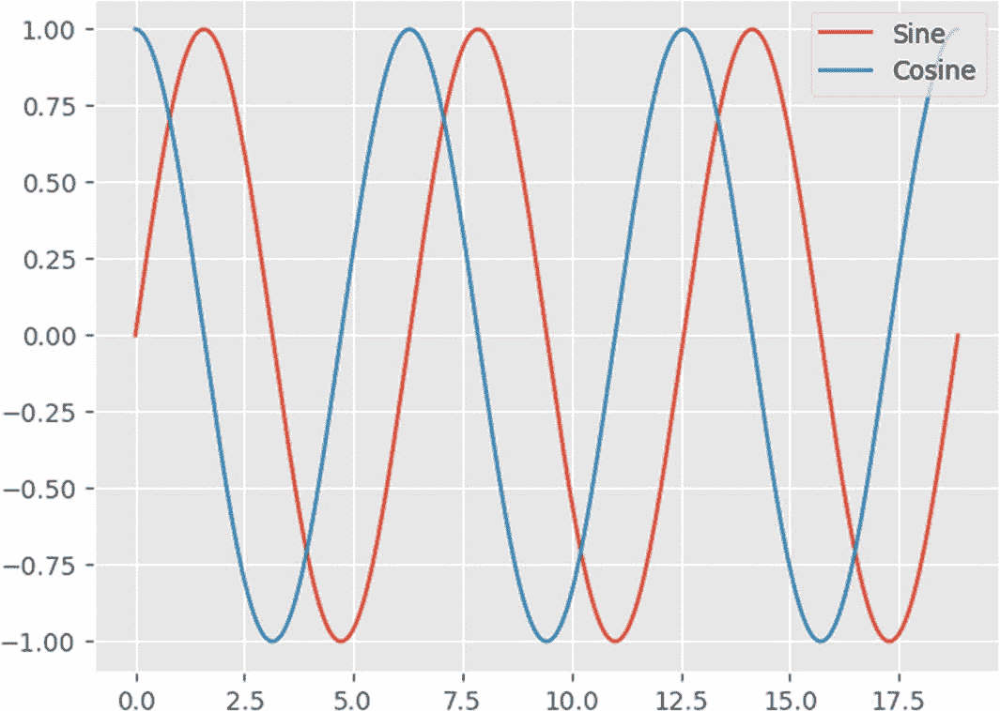

图 5-5

ggplot 式正弦图

让我们来看看 Seaborn 风格，如下图所示:

```py
sinusoidal('seaborn')
plt.show()

```

图 5-6 显示了输出。

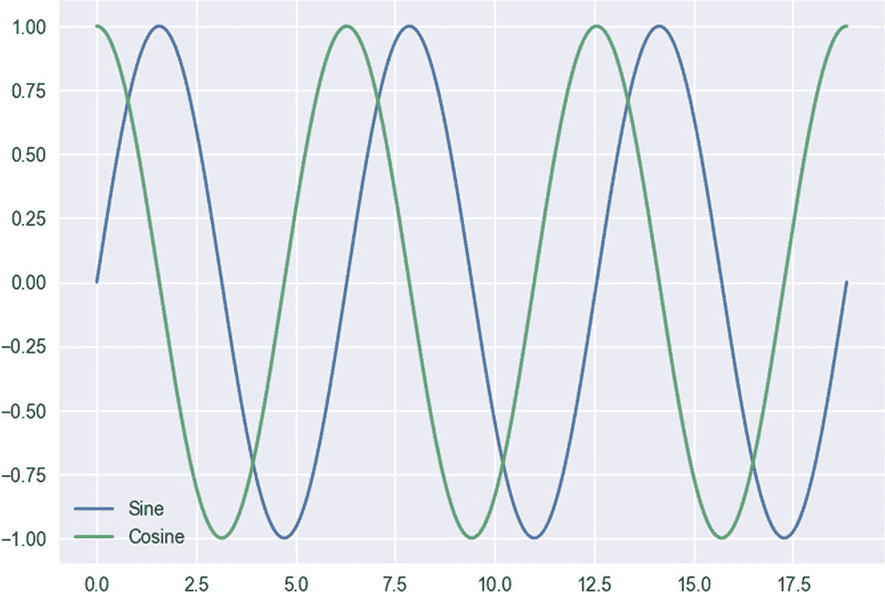

图 5-6

Seaborn 式正弦图

您已经看到样式应用于整个笔记本，并且您已经学会切换到默认样式。您可以局部更改代码块的样式，如下所示:

```py
with plt.style.context('Solarize_Light2'):
    data = np.linspace(0, 6 * np.pi)
    plt.plot(np.sin(data), 'g.--')
    plt.show()

```

图 5-7 显示了输出。

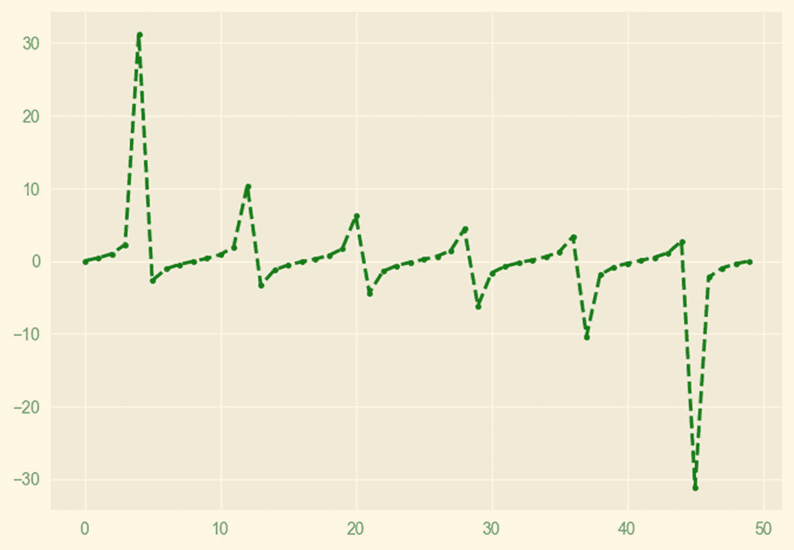

图 5-7

临时造型

## 布局

在本节中，您将学习布局。你已经学习了第四章中的支线剧情，如果你想再次使用默认样式，你可以运行下面一行代码将样式重置为默认样式:

```py
plt.style.use('default')

```

让我们修改一下，创建一个 2×2 的可视化效果，如下所示:

```py
fig, axs = plt.subplots(ncols=2, nrows=2,
                        constrained_layout=True)
plt.show()

```

图 5-8 显示了输出。

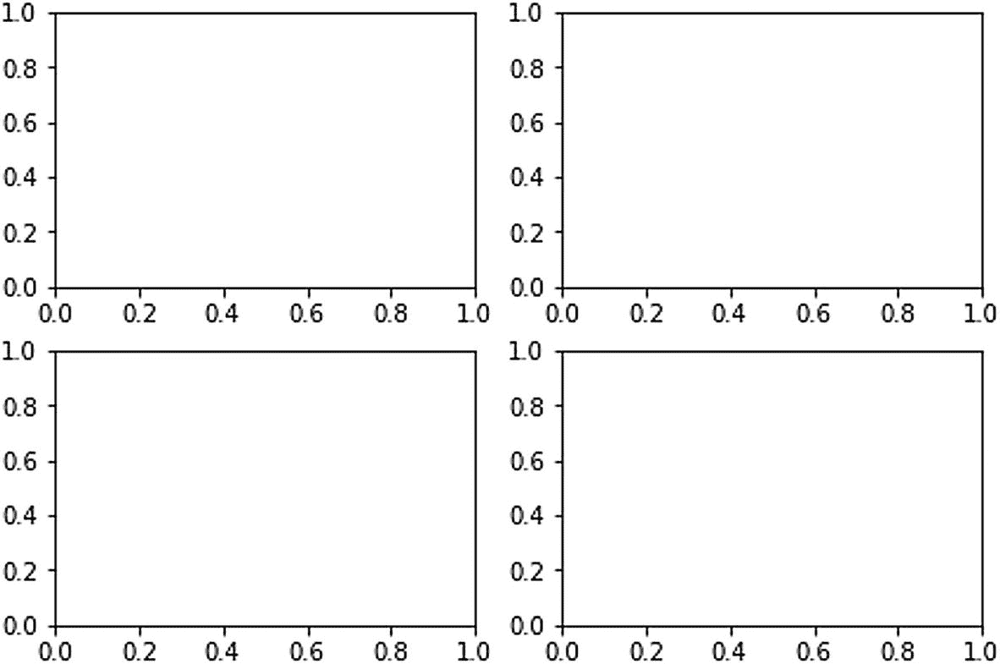

图 5-8

支线剧情

你也可以使用`gridspec`创建支线剧情，如下所示:

```py
import matplotlib.gridspec as gridspec

fig = plt.figure(constrained_layout=True)
specs = gridspec.GridSpec(ncols=2, nrows=2, figure=fig)
ax1 = fig.add_subplot(specs[0, 0])
ax2 = fig.add_subplot(specs[0, 1])
ax3 = fig.add_subplot(specs[1, 0])
ax4 = fig.add_subplot(specs[1, 1])
plt.show()

```

前面的代码将创建一个类似图 5-8 的子绘图。您必须为输出编写大量代码，而这些代码只需几行代码就可以获得。但是，您可以使用此方法创建更复杂的可视化效果。让我们创建一个 3×3 的可视化，这样一个图就占据了一整行。

```py
fig = plt.figure(constrained_layout=True)
gs = fig.add_gridspec(3, 3)
ax1 = fig.add_subplot(gs[0, :])
ax1.set_title('gs[0, :]')
ax2 = fig.add_subplot(gs[1, :])
ax2.set_title('gs[1, :]')
ax3 = fig.add_subplot(gs[2, :])
ax3.set_title('gs[2, :]')
plt.show()

```

该代码将产生如图 5-9 所示的输出。

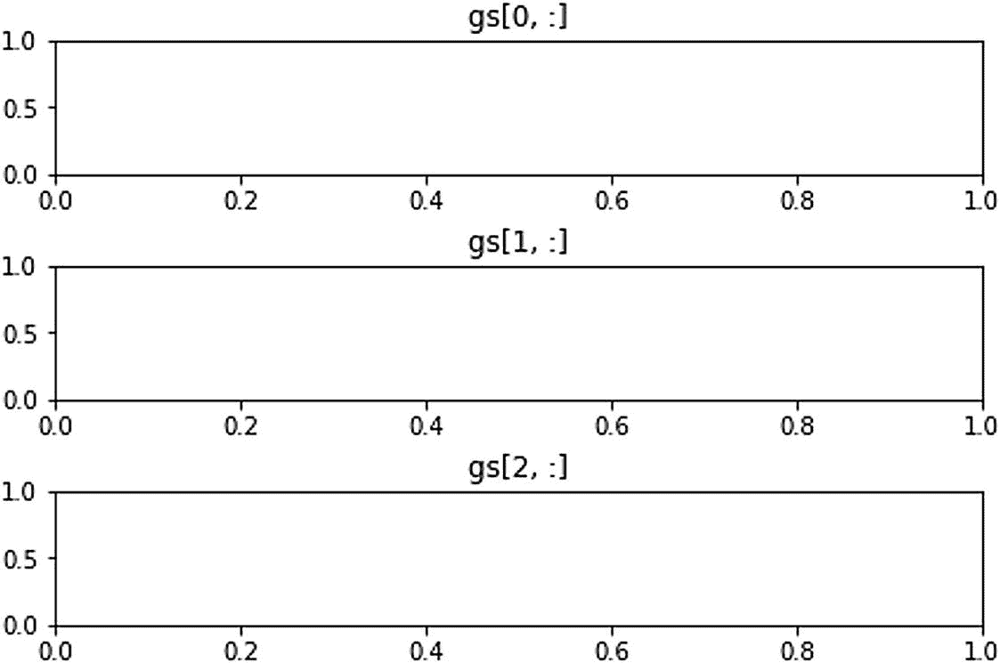

图 5-9

定制支线剧情

您也可以有如下垂直图:

```py
fig = plt.figure(constrained_layout=True)
gs = fig.add_gridspec(3, 3)
ax1 = fig.add_subplot(gs[:, 0])
ax1.set_title('gs[:, 0]')
ax2 = fig.add_subplot(gs[:, 1])
ax2.set_title('gs[:, 1]')
ax3 = fig.add_subplot(gs[:, 2])
ax3.set_title('gs[:, 2]')
plt.show()

```

图 5-10 显示了输出。

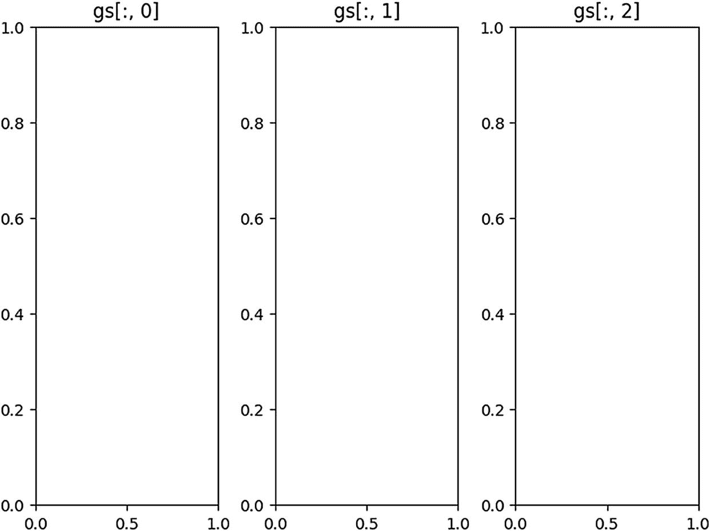

图 5-10

定制支线剧情

让我们看一个更复杂的例子。

```py
fig = plt.figure(constrained_layout=True)
gs = fig.add_gridspec(3, 3)
ax1 = fig.add_subplot(gs[0, :])
ax1.set_title('gs[0, :]')
ax2 = fig.add_subplot(gs[1, :-1])
ax2.set_title('gs[1, :-1]')
ax3 = fig.add_subplot(gs[1:, -1])
ax3.set_title('gs[1:, -1]')
ax4 = fig.add_subplot(gs[-1, 0])
ax4.set_title('gs[-1, 0]')
ax5 = fig.add_subplot(gs[-1, -2])
ax5.set_title('gs[-1, -2]')
plt.show()

```

图 5-11 显示了输出。

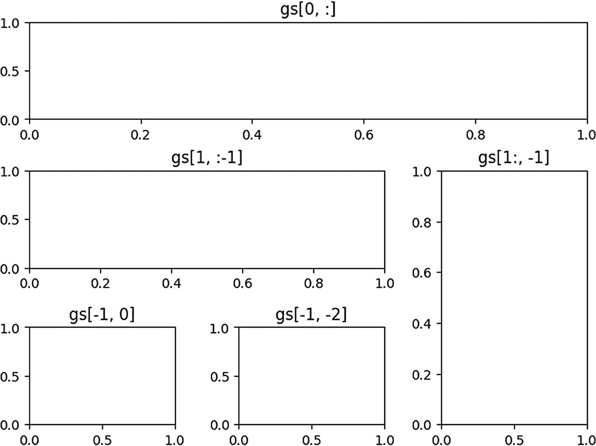

图 5-11

定制支线剧情

这就是你定制支线剧情的方法。

## 摘要

这一章关注的是风格和支线剧情。在整本书中，你会有节制地使用这些概念。

在下一章，我们将探索一些 Matplotlib 的方法来创建可视化。