# 六、折线图、条形图和散点图

在前一章中，您学习了许多与 Matplotlib 可视化相关的高级概念。

在本章和接下来的几章中，你将学习一些创建数据可视化的技术。具体来说，在本章中，您将学习如何创建以下数据可视化:

*   线条和日志

*   误差线

*   条形图

*   散点图

阅读本章后，你将能够使用线条、对数、条形图和散点图。

## 线条和日志

在前面的章节中，你已经看到了如何绘制线条。为了热身，我们再来看一个线条示例，如下所示:

```py
%matplotlib inline
import numpy as np
import matplotlib.pyplot as plt
data = np.linspace(0, 9, 10)

```

现在让我们想象一下。

```py
plt.plot(data)
plt.show()

```

图 6-1 显示了输出。

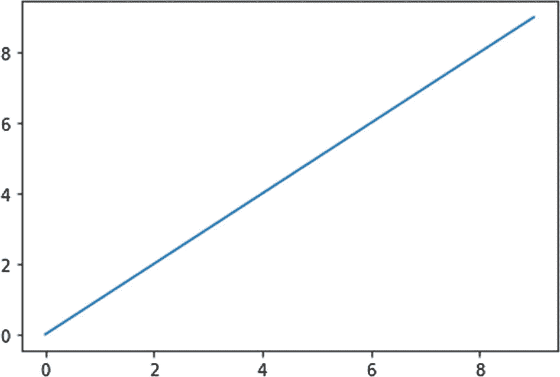

图 6-1

线形图示例

让我们创建一个图表，使 x 轴为对数轴，y 轴为法线轴，如下所示:

```py
t = np.arange(0.01, 10, 0.01)
plt.semilogx(t, np.cos(2 * np.pi * t))
plt.show()

```

图 6-2 显示了输出。

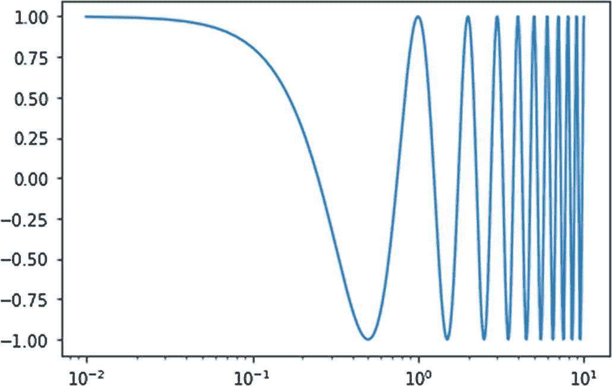

图 6-2

正常 y 轴和对数 x 轴

同样，`you`可以`create a`对数`y-`轴和`a`法线`x-`轴`as follows:`

```py
plt.semilogy(t, np.cos(2 * np.pi * t))
plt.show()

```

图 6-3 显示了输出。

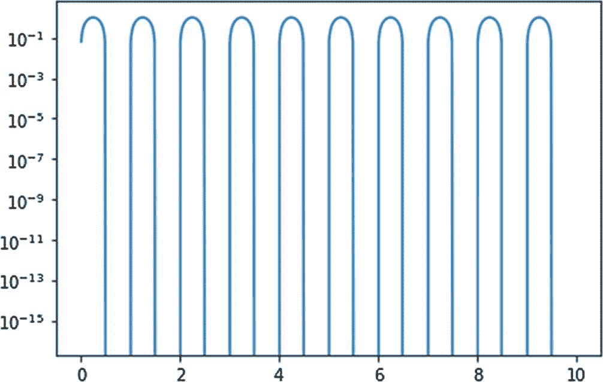

图 6-3

正常 x 轴和对数 y 轴

`You`可以有两个轴`be l`对数，`as shown here:`

```py
plt.loglog(t, np.cos(2 * np.pi * t))
plt.show()

```

图 6-4 显示了输出。

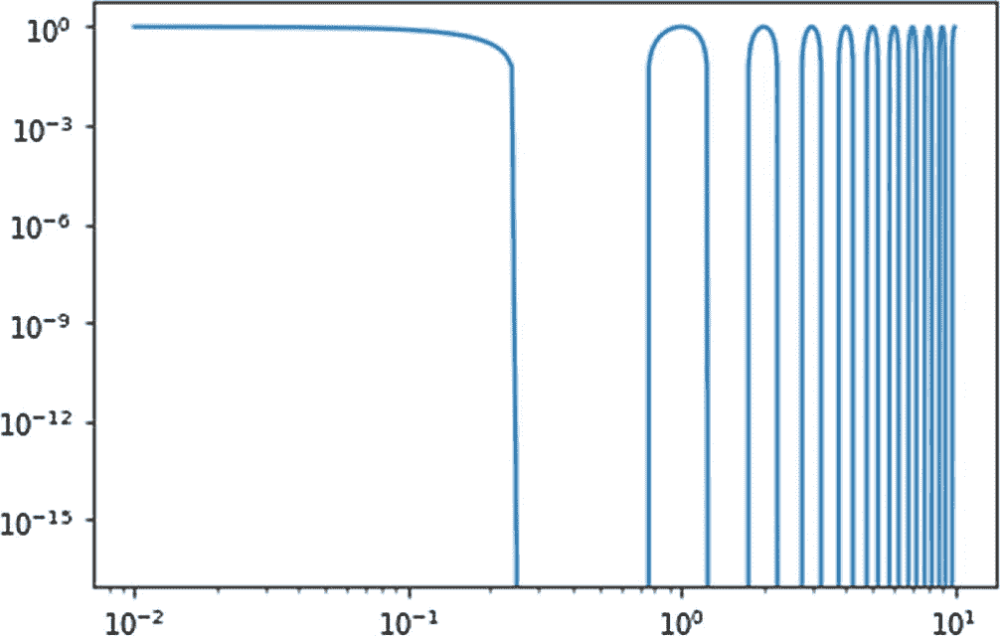

图 6-4

两个对数轴

## 误差线

您还可以使用可视化来显示数据中的错误。当观测数据存在误差的可能性时，通常要在观测中提及。你会说“有 96%的置信区间。”这意味着给定的数据可能有 4%的误差。这给了人们一个关于量的精度的一般概念。当你想表现这种自信(或缺乏自信)时，你可以使用误差线。

为此，您必须使用函数`errorbar()`。您可以创建一个数组或列表来存储错误数据。我们可以有真实的数据，也可以模拟如下:

```py
x = np.linspace (0, 2 * np.pi, 100)
y = np.sin(x)
ye = np.random.rand(len(x))/10
plt.errorbar(x, y, yerr = ye)
plt.show()

```

在本例中，我们在 y 轴上显示误差。图 6-5 显示了输出。

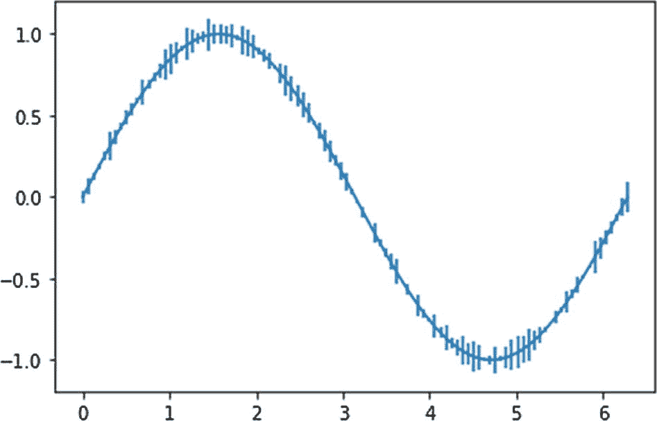

图 6-5

y 轴上的误差

同样，您可以在 x 轴上显示误差数据。

```py
xe = np.random.rand(len(x))/10
plt.errorbar(x, y, xerr = xe)
plt.show()

```

图 6-6 显示了输出。

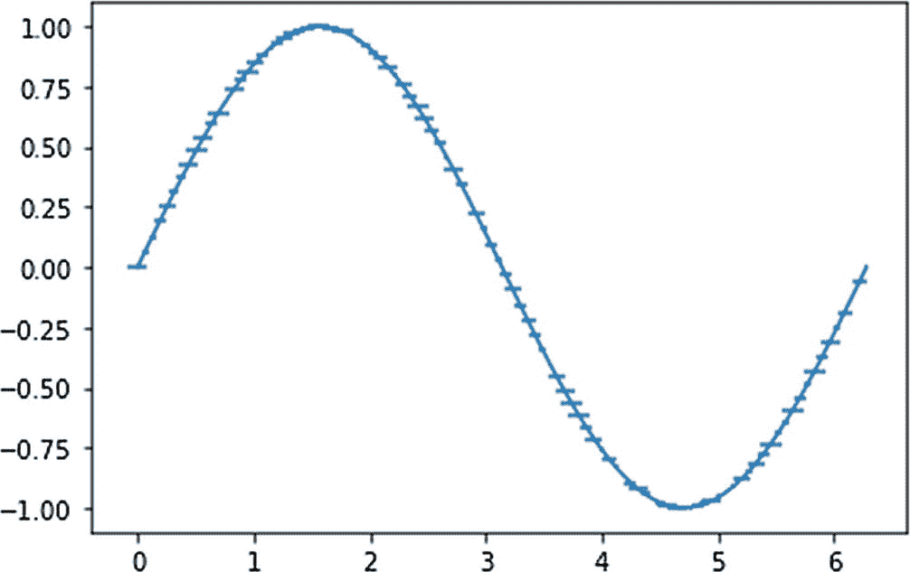

图 6-6

x 轴上的误差

`You`可以显示两个轴上的误差，如下所示:

```py
plt.errorbar(x, y, xerr = xe, yerr = ye)
plt.show()

```

图 6-7 显示了输出。

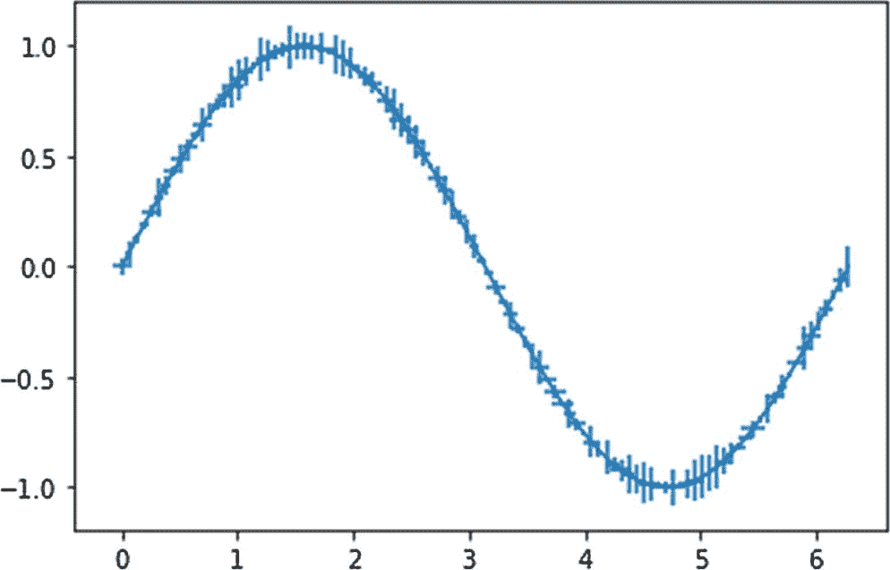

图 6-7

两个轴上都有误差

## 条形图

条形图用条形表示离散和分类数据项。您可以用竖条或横条来表示数据。条形的高度或长度总是与数据量成比例。当您有离散的分类数据时，可以使用条形图或条形图。下面是一个简单的条形图示例:

```py
x = np.arange(4)
y = np.random.rand(4)
plt.bar(x, y)
plt.show()

```

图 6-8 显示了输出。

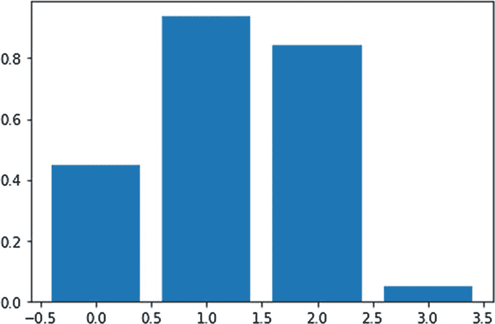

图 6-8

条形图

您可以有如下组合条形图:

```py
y = np.random.rand(3, 4)
plt.bar(x + 0.00, y[0], color = 'b', width = 0.25)
plt.bar(x + 0.25, y[1], color = 'g', width = 0.25)
plt.bar(x + 0.50, y[2], color = 'r', width = 0.25)
plt.show()

```

图 6-9 显示了输出。

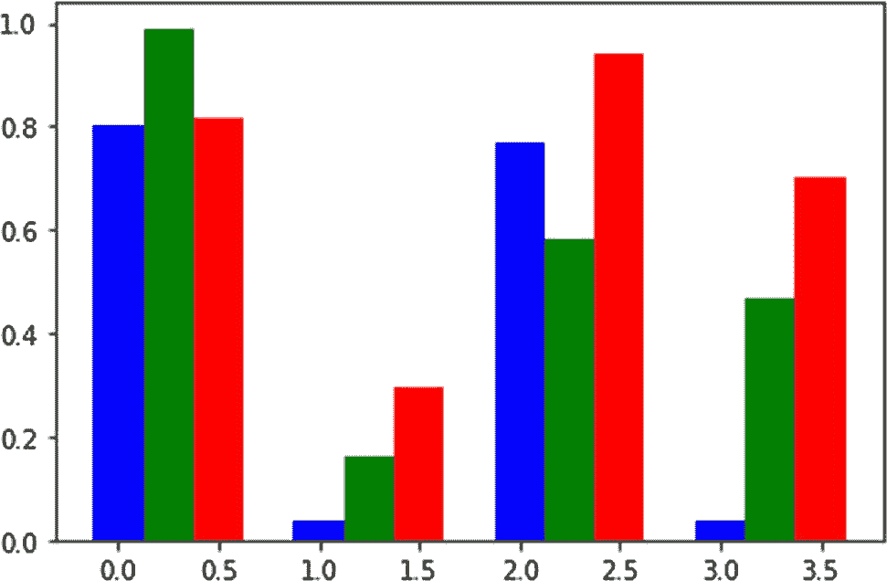

图 6-9

组合条形图

前面的图是垂直条形图的例子。类似地，您可以有如下所示的水平条形图:

```py
x = np.arange(4)
y = np.random.rand(4)
plt.barh(x, y)
plt.show()

```

图 6-10 显示了输出。

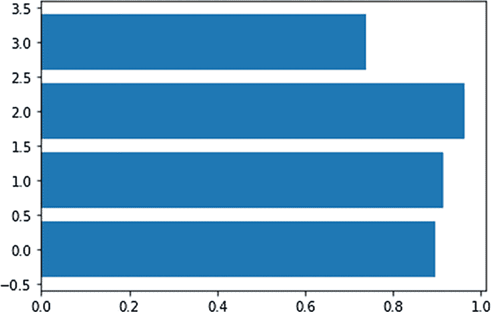

图 6-10

水平条形图

您也可以组合水平条形图，如下所示:

```py
y = np.random.rand(3, 4)
plt.barh(x + 0.00, y[0], color = 'b', height=0.25)
plt.barh(x + 0.25, y[1], color = 'g', height=0.25)
plt.barh(x + 0.50, y[2], color = 'r', height=0.25)
plt.show()

```

图 6-11 显示了输出。

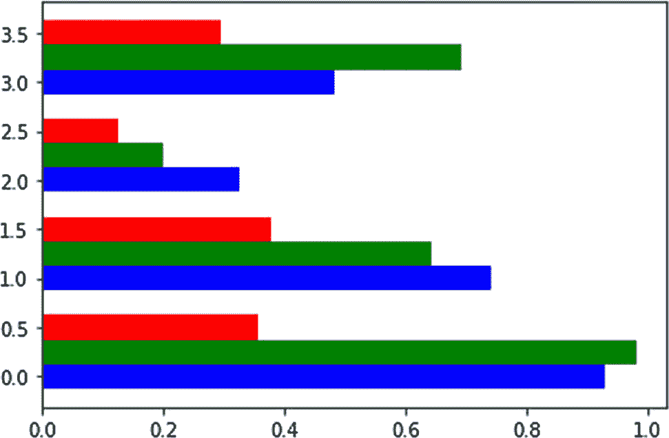

图 6-11

组合水平条形图

## 散点图

您还可以使用散点图来可视化您的数据。您通常会看到一组带有散点图的两个变量。一个变量分配给 x 轴，另一个分配给 y 轴。然后你为 x-y 对的值画一个点。x 和 y 的大小必须相同(它们总是一维数组)。您可以通过控制点的颜色和大小来显示其他变量。在这种情况下，表示 x、y、颜色和大小的一维数组的大小必须相同。

在下面的示例中，我们将随机的 x 轴和 y 轴值和颜色分配给 1，000 个点。所有点的大小都是 20。

```py
N = 1000
x = np.random.rand(N)
y = np.random.rand(N)
colors = np.random.rand(N)
size = (20)
plt.scatter(x, y, s=size, c=colors, alpha=1)
plt.show()

```

图 6-12 显示了输出。

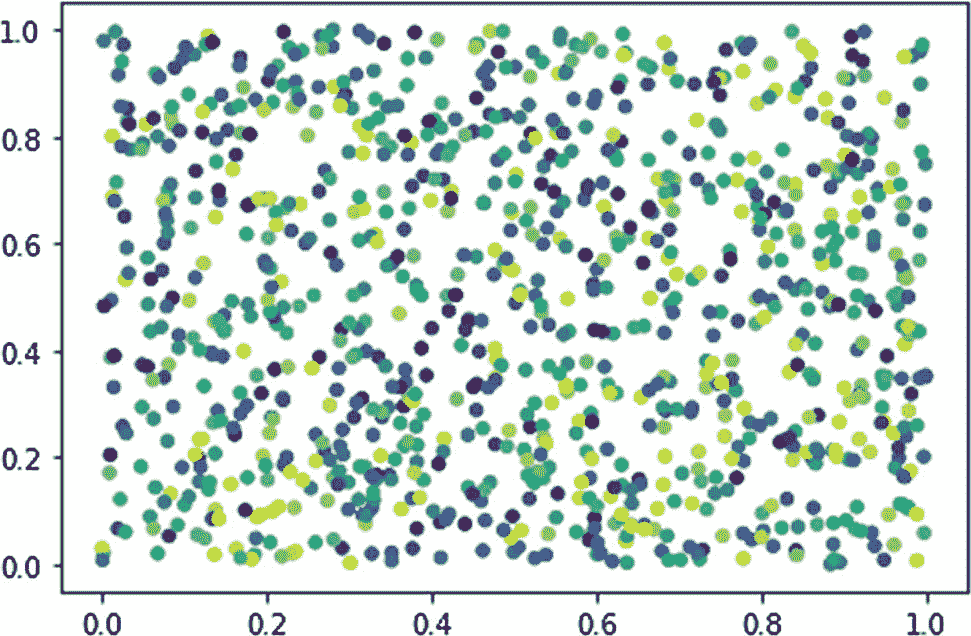

图 6-12

散点图

在这个例子中，点的大小是固定的。您还可以设置图形上每个位置的大小(这取决于 x 和 y 坐标的值)。这里有一个例子:

```py
N = 1000
x = np.random.rand(N)
y = np.random.rand(N)
colors = np.random.rand(N)
size = (50 * x * y)
plt.scatter(x, y, s=size, c=colors, alpha=1)
plt.show()

```

图 6-13 显示了输出。

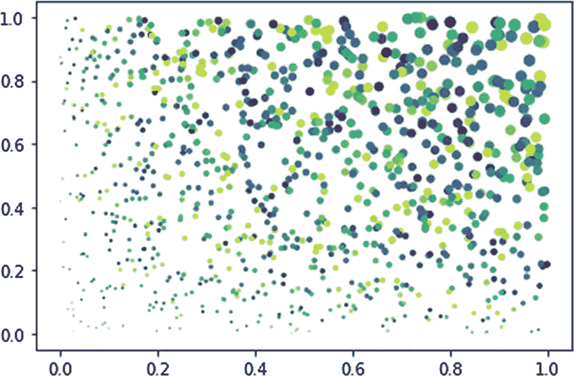

图 6-13

散点图

您刚刚学习了如何创建散点图。

## 摘要

在这一章中，我们以一个线条图开始了一点预热。然后，您学习了如何创建各种日志图。您还学习了如何显示误差幅度以及如何创建条形图。最后，您学习了如何创建散点图。

在下一章中，您将学习更多创建数据可视化的技术。您将学习如何创建直方图、等值线、流图和热图。